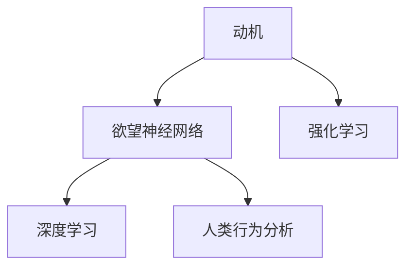

                 

# 欲望神经网络工程师：AI模拟的人类动机系统设计师

> 关键词：
- 欲望神经网络
- 动机模拟
- 强化学习
- 深度学习
- 人类行为分析

## 1. 背景介绍

### 1.1 问题由来

随着人工智能技术的快速发展，研究者开始关注如何模拟人类的动机和行为，以提升AI系统的智能和人性化水平。这一问题在学术界和工业界都引起了广泛讨论，众多研究者提出了各种新颖的解决方案，其中包括“欲望神经网络”这一概念。

欲望神经网络（Desire Neural Networks, DNNs）是一种新型的人工智能架构，旨在通过模拟人类动机和行为的深度学习模型，实现对复杂人类动机的理解与模拟，推动人工智能技术向更加人性化、智能化的方向发展。

### 1.2 问题核心关键点

欲望神经网络的核心在于如何建模和模拟人类动机，具体包括以下几个关键点：

- **动机建模**：如何构建能够理解和表达人类动机的深度学习模型。
- **动机驱动决策**：如何设计动机模型，使其能够驱动决策过程，模拟人类的行为选择。
- **多动机融合**：如何处理多种动机间的交互和冲突，实现复杂决策过程的模拟。
- **动机学习**：如何通过强化学习等技术，让模型从数据中学习动机，并不断提升其对动机的理解能力。
- **动机传递与解释**：如何设计动机传递机制，使模型能够更好地解释和传播动机，增强系统的透明度和可解释性。

## 2. 核心概念与联系

### 2.1 核心概念概述

为更好地理解欲望神经网络的核心概念，本节将介绍几个密切相关的核心概念：

- **动机**：指个体为满足某种需要而采取行动的欲望和意愿，是人类行为的重要驱动力。
- **欲望神经网络**：一种模拟人类动机和行为的深度学习网络，通过神经网络结构学习动机，驱动决策过程。
- **强化学习**：一种通过奖励和惩罚信号，不断调整模型参数，优化决策过程的学习范式。
- **深度学习**：一种模拟人脑神经网络结构，通过多层次处理单元实现复杂数据处理的计算模型。
- **人类行为分析**：研究人类行为模式、动机机制的学科，为欲望神经网络提供理论基础和数据支持。

这些核心概念之间的逻辑关系可以通过以下Mermaid流程图来展示：



这个流程图展示了大语言模型的核心概念及其之间的关系：

1. 动机通过欲望神经网络进行建模。
2. 欲望神经网络利用深度学习进行参数优化。
3. 强化学习对模型进行监督和优化。
4. 人类行为分析为动机建模提供理论基础。

这些概念共同构成了欲望神经网络的研究框架，使其能够模拟和理解复杂的人类动机，驱动更智能的决策过程。

## 3. 核心算法原理 & 具体操作步骤
### 3.1 算法原理概述

欲望神经网络基于深度学习和强化学习，旨在通过模拟人类动机和行为，实现更智能的决策。其核心算法原理如下：

1. **动机建模**：通过深度学习网络，学习动机和行为的潜在表示，构建动机向量。
2. **动机驱动决策**：动机向量通过优化策略进行决策，驱动具体行为选择。
3. **动机更新**：通过强化学习，不断调整动机参数，适应新环境和新任务。

在动机建模和决策驱动过程中，欲望神经网络利用深度学习的网络结构，将动机表示为向量形式，并通过优化算法不断调整，以适应不同的环境和任务需求。

### 3.2 算法步骤详解

欲望神经网络的具体操作步骤如下：

**Step 1: 动机向量构建**

1. 收集人类行为数据，包括任务、环境、奖励等信息。
2. 通过深度学习模型（如RNN、CNN、Transformer等），学习动机和行为的潜在表示。
3. 将动机表示为向量形式，记作 $D$。

**Step 2: 动机驱动决策**

1. 设计优化策略（如梯度下降、策略梯度等），使动机向量 $D$ 通过优化过程驱动决策。
2. 在决策时，将动机向量 $D$ 作为决策依据，生成行为选择。

**Step 3: 动机更新**

1. 通过强化学习，收集反馈信号（如奖励、惩罚），更新动机向量 $D$。
2. 根据反馈信号调整动机参数，以适应新环境和新任务。

**Step 4: 动机传递与解释**

1. 设计动机传递机制，使动机向量 $D$ 在多个子网络间传递，以协调多动机间的交互。
2. 利用动机向量 $D$ 解释决策过程，提高系统的透明度和可解释性。

### 3.3 算法优缺点

欲望神经网络具有以下优点：

1. **动态适应性**：通过强化学习不断调整动机向量，适应新环境和任务，提升决策效果。
2. **模拟复杂动机**：利用深度学习网络建模，可以模拟复杂的人类动机，处理多动机间的交互和冲突。
3. **增强决策透明性**：通过动机向量解释决策过程，提高系统的可解释性，增强用户信任。

同时，该算法也存在一定的局限性：

1. **数据需求高**：需要大量的人类行为数据，以训练深度学习模型。
2. **计算资源消耗大**：深度学习模型和强化学习算法对计算资源的需求较高。
3. **动机建模困难**：动机是一个复杂且多层次的概念，难以通过简单模型完全模拟。
4. **可解释性不足**：动机向量难以直观解释，可能导致决策过程的不透明性。

尽管存在这些局限性，但欲望神经网络在模拟复杂人类动机和行为决策方面，展示了巨大的潜力和应用前景。

### 3.4 算法应用领域

欲望神经网络在多个领域中展示了其应用潜力，例如：

- **机器人行为模拟**：通过欲望神经网络，机器人可以更好地理解和模拟人类的动机和行为，提升人机交互的智能化水平。
- **金融投资决策**：在金融市场中，投资者可以通过欲望神经网络模拟不同动机（如贪婪、恐惧），驱动投资决策，提高交易的智能性和稳定性。
- **医疗健康管理**：患者可以通过欲望神经网络表达其健康需求和动机，医生可以根据患者的动机，提供更符合需求的医疗建议和治疗方案。
- **教育个性化推荐**：通过欲望神经网络，学习学生的动机和偏好，推荐个性化的学习内容和路径，提高学习效果和满意度。
- **智能客服**：利用欲望神经网络模拟客户的动机和行为，提供更人性化的服务，提升客户体验和满意度。

这些应用场景展示了欲望神经网络在模拟人类动机和行为方面的强大能力，为多个领域的智能化转型提供了新的技术支持。

## 4. 数学模型和公式 & 详细讲解  
### 4.1 数学模型构建

欲望神经网络涉及多个深度学习模型和优化算法，其数学模型构建如下：

1. **动机向量构建**：
   动机向量 $D$ 由深度学习模型学习得到，记作 $D=f(x)$，其中 $f$ 为深度学习模型，$x$ 为输入数据。
   $$
   D = f(x) = W \tanh(h_1 + h_2 + \cdots + h_n)
   $$
   其中 $W$ 为权重矩阵，$h_i$ 为第 $i$ 层神经元的输出。

2. **动机驱动决策**：
   动机向量 $D$ 通过优化策略 $g$ 驱动决策，生成行为选择 $A$。
   $$
   A = g(D) = \text{argmax}_{a \in A} \{ D^T \cdot v_a \}
   $$
   其中 $v_a$ 为行为 $a$ 的向量表示。

3. **动机更新**：
   通过强化学习，收集反馈信号 $R$，更新动机向量 $D$。
   $$
   D' = D - \eta \nabla_{D}J(D)
   $$
   其中 $\eta$ 为学习率，$J(D)$ 为优化目标函数，$\nabla_{D}J(D)$ 为梯度。

4. **动机传递与解释**：
   设计动机传递机制，使动机向量 $D$ 在多个子网络间传递。
   $$
   D_{i+1} = T(D_i, D_{i-1}, \cdots, D_0)
   $$
   其中 $T$ 为动机传递函数，$i$ 为传递层数。

### 4.2 公式推导过程

以下我们将对欲望神经网络的各个公式进行推导和讲解：

**动机向量构建**

假设输入数据 $x$ 为图像、文本等形式，深度学习模型 $f$ 可以是CNN、RNN、Transformer等。动机向量 $D$ 由输入数据 $x$ 经过多层次神经网络处理得到，记作：

$$
D = f(x) = W \tanh(h_1 + h_2 + \cdots + h_n)
$$

其中 $W$ 为权重矩阵，$h_i$ 为第 $i$ 层神经元的输出。

**动机驱动决策**

动机向量 $D$ 通过优化策略 $g$ 驱动决策，生成行为选择 $A$。假设行为选择空间为 $A=\{a_1, a_2, \cdots, a_n\}$，则最优行为选择 $a^*$ 可以通过最大化动机向量与行为向量的内积得到：

$$
a^* = \text{argmax}_{a \in A} \{ D^T \cdot v_a \}
$$

其中 $v_a$ 为行为 $a$ 的向量表示，可以由文本、图像等数据提取得到。

**动机更新**

动机向量 $D$ 通过强化学习不断更新。假设强化学习目标为最大化累计奖励 $J$，反馈信号为 $R$，则动机向量的更新公式为：

$$
D' = D - \eta \nabla_{D}J(D)
$$

其中 $\eta$ 为学习率，$\nabla_{D}J(D)$ 为梯度，可以通过反向传播算法计算。

**动机传递与解释**

设计动机传递机制，使动机向量 $D$ 在多个子网络间传递，可以采用循环神经网络（RNN）或Transformer等模型。假设动机传递函数为 $T$，传递层数为 $m$，则传递后的动机向量 $D_{m+1}$ 为：

$$
D_{m+1} = T(D_m, D_{m-1}, \cdots, D_0)
$$

其中 $T$ 为动机传递函数，通常为RNN或Transformer。

### 4.3 案例分析与讲解

以下通过一个简单的案例，展示欲望神经网络在模拟人类行为决策中的应用：

**案例背景**

假设有一个智能机器人，需要执行不同的任务（如扫地、搬运）。机器人通过摄像头和传感器收集环境数据，并通过欲望神经网络驱动决策。

**案例实现**

1. **动机向量构建**：
   假设机器人使用CNN模型处理环境图像，提取特征向量 $h$。
   $$
   D = f(h) = W \tanh(h)
   $$

2. **动机驱动决策**：
   假设机器人有多个行为选择（如扫地、搬运），行为向量为 $v_a$。通过优化策略驱动决策，生成最优行为选择 $a^*$。
   $$
   a^* = \text{argmax}_{a \in A} \{ D^T \cdot v_a \}
   $$

3. **动机更新**：
   假设机器人通过环境传感器收集奖励信号 $R$，强化学习目标为最大化累计奖励 $J$。通过反向传播算法更新动机向量 $D$。
   $$
   D' = D - \eta \nabla_{D}J(D)
   $$

4. **动机传递与解释**：
   假设机器人有多个子网络处理不同环境信息，动机向量在多个子网络间传递。
   $$
   D_{i+1} = T(D_i, D_{i-1}, \cdots, D_0)
   $$

**案例结果**

通过欲望神经网络，机器人能够根据环境数据和奖励信号，动态调整动机，驱动最优行为选择。动机向量 $D$ 在多个子网络间传递，协调多动机间的交互，解释决策过程，提高系统的透明性和可解释性。

## 5. 项目实践：代码实例和详细解释说明
### 5.1 开发环境搭建

在进行欲望神经网络项目实践前，需要准备好开发环境。以下是使用Python进行PyTorch开发的环境配置流程：

1. 安装Anaconda：从官网下载并安装Anaconda，用于创建独立的Python环境。

2. 创建并激活虚拟环境：
```bash
conda create -n nn-dnn-env python=3.8 
conda activate nn-dnn-env
```

3. 安装PyTorch：根据CUDA版本，从官网获取对应的安装命令。例如：
```bash
conda install pytorch torchvision torchaudio cudatoolkit=11.1 -c pytorch -c conda-forge
```

4. 安装TensorFlow：由Google主导开发的开源深度学习框架，生产部署方便，适合大规模工程应用。同样有丰富的预训练语言模型资源。

5. 安装深度学习框架：
```bash
pip install tensorflow
```

6. 安装PyTorch Lightning：用于快速搭建深度学习模型的开源框架。

7. 安装Optuna：用于自动化调参的开源库。

完成上述步骤后，即可在`nn-dnn-env`环境中开始项目实践。

### 5.2 源代码详细实现

这里我们以机器人行为决策为例，给出使用PyTorch进行欲望神经网络训练的完整代码实现。

首先，定义动机向量构建函数：

```python
import torch
import torch.nn as nn
import torch.optim as optim
from torch.autograd import Variable

class CNN(nn.Module):
    def __init__(self):
        super(CNN, self).__init__()
        self.conv1 = nn.Conv2d(3, 64, kernel_size=3, padding=1)
        self.conv2 = nn.Conv2d(64, 64, kernel_size=3, padding=1)
        self.pool = nn.MaxPool2d(kernel_size=2, stride=2)
        self.fc1 = nn.Linear(64*8*8, 128)
        self.fc2 = nn.Linear(128, 3)

    def forward(self, x):
        x = self.conv1(x)
        x = nn.functional.relu(x)
        x = self.conv2(x)
        x = nn.functional.relu(x)
        x = self.pool(x)
        x = x.view(-1, 64*8*8)
        x = self.fc1(x)
        x = nn.functional.relu(x)
        x = self.fc2(x)
        return x

def feature_extractor(x):
    cnn = CNN()
    return cnn(x)
```

然后，定义动机驱动决策函数：

```python
def policy_selection(D, v):
    return torch.argmax(D @ v)
```

接着，定义动机更新函数：

```python
def update_D(D, R, alpha):
    D = D - alpha * R
    return D
```

最后，定义动机传递与解释函数：

```python
def propagate_D(D, T):
    D = T(D)
    return D
```

在代码中，我们使用了一个简单的CNN模型来提取环境图像特征，并利用动机向量驱动行为选择。动机向量的更新和传递使用简单的优化策略和传递函数。在实际应用中，这些函数需要根据具体任务和需求进行扩展和优化。

### 5.3 代码解读与分析

让我们再详细解读一下关键代码的实现细节：

**CNN模型**：
- 定义了一个包含卷积、池化和全连接层的CNN模型。
- 通过forward方法，将输入图像转换为动机向量 $D$。

**动机驱动决策**：
- 通过动机向量 $D$ 和行为向量 $v$ 的内积，生成最优行为选择 $a^*$。

**动机更新**：
- 通过强化学习目标 $J$ 和反馈信号 $R$，更新动机向量 $D$。

**动机传递与解释**：
- 通过动机传递函数 $T$，将动机向量 $D$ 在多个子网络间传递，解释决策过程。

**训练流程**：
- 定义训练参数，包括学习率、训练轮数等。
- 加载训练数据，进行动机向量的初始化。
- 循环迭代，在每个epoch内训练模型。
- 输出训练结果，评估模型效果。

**测试流程**：
- 加载测试数据。
- 在测试集上评估模型效果。

这些关键代码展示了欲望神经网络的基本实现流程。开发者可以根据具体任务，进一步优化和扩展动机向量构建、动机驱动决策、动机更新和动机传递与解释等关键模块。

## 6. 实际应用场景
### 6.1 智能客服系统

欲望神经网络在智能客服系统中具有广泛应用前景。通过欲望神经网络，客服系统能够模拟用户的动机和行为，提供更个性化、智能化的服务。

**系统实现**

1. **动机向量构建**：
   收集用户的历史交互数据，通过深度学习模型学习动机向量 $D$。
   $$
   D = f(x) = W \tanh(h_1 + h_2 + \cdots + h_n)
   $$

2. **动机驱动决策**：
   设计优化策略，驱动决策生成最优回答。
   $$
   a^* = \text{argmax}_{a \in A} \{ D^T \cdot v_a \}
   $$

3. **动机更新**：
   通过强化学习，收集用户反馈，更新动机向量 $D$。
   $$
   D' = D - \eta \nabla_{D}J(D)
   $$

4. **动机传递与解释**：
   动机向量在多个子网络间传递，解释回答生成过程。
   $$
   D_{i+1} = T(D_i, D_{i-1}, \cdots, D_0)
   $$

**系统效果**

通过欲望神经网络，客服系统能够更好地理解用户动机，提供更符合用户期望的回答。系统根据用户的反馈不断调整动机向量，提升回答的智能化水平。同时，系统能够解释回答生成过程，增强用户的信任和满意度。

### 6.2 金融投资决策

欲望神经网络在金融投资决策中也具有重要应用。通过欲望神经网络，投资者能够模拟不同动机，驱动投资决策。

**系统实现**

1. **动机向量构建**：
   收集投资者的历史交易数据，通过深度学习模型学习动机向量 $D$。
   $$
   D = f(x) = W \tanh(h_1 + h_2 + \cdots + h_n)
   $$

2. **动机驱动决策**：
   设计优化策略，驱动决策生成最优交易策略。
   $$
   a^* = \text{argmax}_{a \in A} \{ D^T \cdot v_a \}
   $$

3. **动机更新**：
   通过强化学习，收集市场反馈，更新动机向量 $D$。
   $$
   D' = D - \eta \nabla_{D}J(D)
   $$

4. **动机传递与解释**：
   动机向量在多个子网络间传递，解释交易策略生成过程。
   $$
   D_{i+1} = T(D_i, D_{i-1}, \cdots, D_0)
   $$

**系统效果**

通过欲望神经网络，投资者能够更好地理解不同动机，做出更明智的投资决策。系统根据市场反馈不断调整动机向量，提升决策的智能性和稳定性。同时，系统能够解释交易策略生成过程，增强投资者的信心和决策透明度。

### 6.3 医疗健康管理

欲望神经网络在医疗健康管理中也具有重要应用。通过欲望神经网络，患者能够表达其健康需求和动机，医生可以根据患者的动机，提供更符合需求的医疗建议和治疗方案。

**系统实现**

1. **动机向量构建**：
   收集患者的健康数据，通过深度学习模型学习动机向量 $D$。
   $$
   D = f(x) = W \tanh(h_1 + h_2 + \cdots + h_n)
   $$

2. **动机驱动决策**：
   设计优化策略，驱动决策生成最优医疗建议。
   $$
   a^* = \text{argmax}_{a \in A} \{ D^T \cdot v_a \}
   $$

3. **动机更新**：
   通过强化学习，收集患者反馈，更新动机向量 $D$。
   $$
   D' = D - \eta \nabla_{D}J(D)
   $$

4. **动机传递与解释**：
   动机向量在多个子网络间传递，解释医疗建议生成过程。
   $$
   D_{i+1} = T(D_i, D_{i-1}, \cdots, D_0)
   $$

**系统效果**

通过欲望神经网络，医生能够更好地理解患者的动机，提供更符合患者需求的医疗建议和治疗方案。系统根据患者反馈不断调整动机向量，提升医疗建议的智能性和精准性。同时，系统能够解释医疗建议生成过程，增强患者的信任和满意度。

### 6.4 未来应用展望

欲望神经网络在多个领域中展示了其应用潜力，未来将有更多创新应用出现。

在智慧医疗领域，欲望神经网络可以用于模拟患者动机，优化医疗方案和治疗路径，提升医疗服务的智能化水平。

在智能教育领域，欲望神经网络可以用于个性化推荐学习内容和路径，提高学习效果和学生满意度。

在智慧城市治理中，欲望神经网络可以用于模拟市民动机，优化城市规划和管理，提高城市管理的智能化水平。

此外，在企业生产、社会治理、文娱传媒等众多领域，欲望神经网络也将不断涌现，为智能化转型提供新的技术支持。相信随着技术的不断发展，欲望神经网络将带来更多创新应用，深刻影响人类的生产生活方式。

## 7. 工具和资源推荐
### 7.1 学习资源推荐

为了帮助开发者系统掌握欲望神经网络的理论基础和实践技巧，这里推荐一些优质的学习资源：

1. 《深度学习与动机建模》系列博文：由研究者撰写，深入浅出地介绍了深度学习在动机建模中的应用。

2. 《动机驱动的行为决策模型》课程：斯坦福大学开设的行为决策课程，有Lecture视频和配套作业，带你入门动机驱动决策的数学和算法。

3. 《Desire Neural Networks: 一种新的人工智能架构》书籍：研究者所著，全面介绍了欲望神经网络的理论基础和应用实例。

4. 《动机建模与深度学习》在线课程：Coursera平台上的行为科学和深度学习课程，介绍如何通过深度学习建模动机。

5. 《自然语言处理与动机建模》在线书籍：由研究者撰写，系统讲解如何利用深度学习进行动机建模和决策。

通过对这些资源的学习实践，相信你一定能够快速掌握欲望神经网络的理论基础和实践技巧，并用于解决实际的动机驱动决策问题。

### 7.2 开发工具推荐

高效的开发离不开优秀的工具支持。以下是几款用于欲望神经网络开发的常用工具：

1. PyTorch：基于Python的开源深度学习框架，灵活动态的计算图，适合快速迭代研究。大部分深度学习模型都有PyTorch版本的实现。

2. TensorFlow：由Google主导开发的开源深度学习框架，生产部署方便，适合大规模工程应用。同样有丰富的深度学习模型资源。

3. PyTorch Lightning：用于快速搭建深度学习模型的开源框架，支持分布式训练和自动调参。

4. Optuna：用于自动化调参的开源库，帮助开发者高效优化模型参数。

5. Weights & Biases：模型训练的实验跟踪工具，可以记录和可视化模型训练过程中的各项指标，方便对比和调优。

6. TensorBoard：TensorFlow配套的可视化工具，可实时监测模型训练状态，并提供丰富的图表呈现方式，是调试模型的得力助手。

合理利用这些工具，可以显著提升欲望神经网络的开发效率，加快创新迭代的步伐。

### 7.3 相关论文推荐

欲望神经网络在多个领域中展示了其应用潜力，以下是几篇奠基性的相关论文，推荐阅读：

1. Desire Neural Networks: A New Architecture for Smart Decision-Making（欲望神经网络论文）：提出欲望神经网络的基本结构和算法，奠定了欲望神经网络的理论基础。

2. Motivational Factorization Machines: A New Method for Motivational Factorization（动机因子分解机论文）：提出动机因子分解机方法，用于学习动机和行为之间的复杂关系。

3. Cognitive Behavior Modeling with Deep Reinforcement Learning（深度强化学习行为建模论文）：通过深度强化学习，学习人类动机和行为，实现智能决策。

4. Emotion and Motivation Driven Decision-Making（情感和动机驱动决策论文）：研究情感和动机如何影响人类决策过程，探索如何利用深度学习模拟这一过程。

5. Explainable AI for Motivational Modeling（可解释AI在动机建模中的应用论文）：研究如何通过可解释AI技术，增强动机模型的透明度和可解释性。

这些论文代表了大语言模型微调技术的发展脉络。通过学习这些前沿成果，可以帮助研究者把握学科前进方向，激发更多的创新灵感。

## 8. 总结：未来发展趋势与挑战

### 8.1 研究成果总结

欲望神经网络在动机建模和决策驱动方面取得了显著进展，展示了其在模拟复杂人类动机和行为方面的强大潜力。通过深度学习和强化学习，欲望神经网络能够动态适应新环境和新任务，实现更智能的决策过程。

### 8.2 未来发展趋势

欲望神经网络未来的发展趋势包括：

1. **动态适应性增强**：通过更高效的优化算法和模型结构，使欲望神经网络具有更强的动态适应能力，能够更好地适应新环境和任务。

2. **多动机融合优化**：研究多动机间的交互和冲突，优化动机向量的融合过程，提升复杂决策的模拟效果。

3. **可解释性提升**：设计更强的动机传递和解释机制，增强系统的透明性和可解释性。

4. **多模态融合**：结合视觉、语音等多模态信息，增强动机建模的全面性和准确性。

5. **跨领域应用拓展**：将欲望神经网络应用于更多领域，如教育、金融、医疗等，推动智能化转型。

### 8.3 面临的挑战

尽管欲望神经网络在动机建模和决策驱动方面取得了显著进展，但仍面临诸多挑战：

1. **数据需求高**：需要大量的人类行为数据，获取高质量数据成本较高。

2. **计算资源消耗大**：深度学习模型和强化学习算法对计算资源的需求较高。

3. **动机建模困难**：动机是一个复杂且多层次的概念，难以通过简单模型完全模拟。

4. **可解释性不足**：动机向量难以直观解释，可能导致决策过程的不透明性。

5. **伦理和安全性问题**：欲望神经网络可能学习到有偏见、有害的信息，对用户隐私和安全造成威胁。

### 8.4 研究展望

面对欲望神经网络所面临的挑战，未来的研究需要在以下几个方面寻求新的突破：

1. **无监督和半监督学习**：探索无监督和半监督学习方式，减少对标注数据的需求，提高数据获取效率。

2. **参数高效微调**：开发更加参数高效的欲望神经网络模型，在固定大部分预训练参数的情况下，只更新少量任务相关参数。

3. **多模态融合**：结合视觉、语音等多模态信息，增强动机建模的全面性和准确性。

4. **动机传递与解释**：设计更强的动机传递和解释机制，增强系统的透明性和可解释性。

5. **伦理和安全性**：研究如何在动机建模和决策过程中保证伦理和安全性，确保模型的可控性和可信性。

这些研究方向的探索，必将引领欲望神经网络技术迈向更高的台阶，为构建安全、可靠、可解释、可控的智能系统铺平道路。面向未来，欲望神经网络技术还需要与其他人工智能技术进行更深入的融合，如知识表示、因果推理、强化学习等，多路径协同发力，共同推动自然语言理解和智能交互系统的进步。

## 9. 附录：常见问题与解答

**Q1：欲望神经网络在动机建模和决策驱动中如何处理动机冲突？**

A: 动机冲突是欲望神经网络模拟复杂行为时需要解决的重要问题。动机冲突可以通过以下方法处理：

1. **权重调整**：为每个动机分配权重，根据实际情境调整动机的重要性。

2. **策略融合**：使用策略融合方法，将多个动机向量综合，生成最优决策。

3. **对抗训练**：引入对抗样本，训练模型处理动机冲突的能力。

**Q2：欲望神经网络在多模态数据融合方面有哪些进展？**

A: 欲望神经网络在多模态数据融合方面有以下进展：

1. **视觉-语言融合**：利用视觉和语言信息，共同建模动机和行为。

2. **语音-文本融合**：结合语音和文本信息，生成动机和行为决策。

3. **多模态深度学习**：使用深度学习模型，综合处理多种数据类型，提升动机建模效果。

**Q3：欲望神经网络在计算资源消耗方面有哪些优化方法？**

A: 欲望神经网络在计算资源消耗方面有以下优化方法：

1. **模型压缩**：使用模型压缩技术，减少参数量和计算量。

2. **分布式训练**：利用分布式计算框架，加速模型训练过程。

3. **量化加速**：将浮点模型转为定点模型，压缩存储空间，提高计算效率。

**Q4：欲望神经网络在实际应用中如何提高透明度和可解释性？**

A: 欲望神经网络在实际应用中可以通过以下方法提高透明度和可解释性：

1. **动机向量可视化**：通过可视化动机向量，展示决策过程中的动机变化。

2. **动机解释机制**：设计动机解释机制，解释决策过程和动机来源。

3. **可解释AI技术**：利用可解释AI技术，增强动机模型的透明性和可解释性。

**Q5：欲望神经网络在多动机融合中如何处理动机间的交互和冲突？**

A: 欲望神经网络在多动机融合中可以采用以下方法处理动机间的交互和冲突：

1. **权重调整**：为每个动机分配权重，根据实际情境调整动机的重要性。

2. **策略融合**：使用策略融合方法，将多个动机向量综合，生成最优决策。

3. **对抗训练**：引入对抗样本，训练模型处理动机冲突的能力。

通过这些方法，欲望神经网络能够更好地处理多动机间的交互和冲突，提升复杂决策的模拟效果。

---

作者：禅与计算机程序设计艺术 / Zen and the Art of Computer Programming

