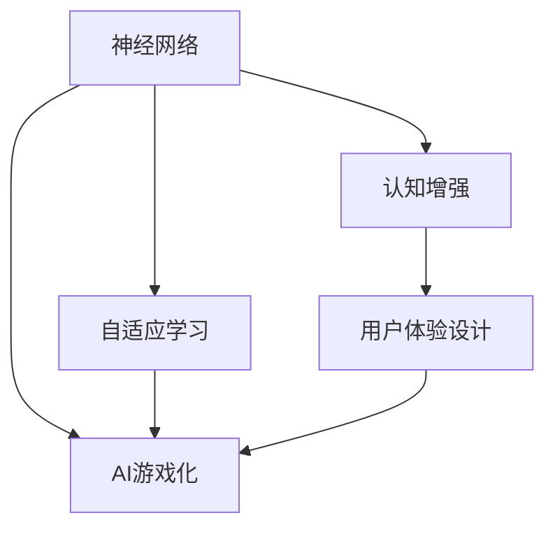

                 

# 注意力gamification：AI驱动的专注力游戏

> 关键词：AI游戏化, 注意力训练, 认知增强, 算法优化, 用户行为分析, 神经网络, 自适应学习

## 1. 背景介绍

### 1.1 问题由来
在数字化时代，人们越来越依赖于互联网和数字设备，这种依赖在提升生产效率的同时，也带来了注意力的严重分散。网络成瘾、信息过载等问题使得很多人难以集中注意力，影响了学习、工作和生活的质量。为了应对这一问题，科学家和工程师们探索出了诸多解决方案，其中AI游戏化（AI gamification）是近年来发展迅猛的一种技术手段。

### 1.2 问题核心关键点
AI游戏化技术通过将游戏化元素融入日常活动，提升用户的参与度与积极度。在注意力的训练方面，AI游戏化能够动态调整游戏难度、奖励机制、反馈系统等，根据用户的表现实时调整策略，实现自适应学习，从而提高用户的专注力和认知能力。其核心在于利用算法优化来模拟游戏化的奖励机制，通过神经网络等技术手段，分析用户的行为和反馈，调整训练策略，达到提高注意力的目的。

### 1.3 问题研究意义
研究AI游戏化的注意力训练方法，对于提高个体和社会的认知效率，提升学习和工作效率，具有重要意义。它能够帮助个体克服数字设备带来的注意力分散问题，为教育、培训、工作等多个领域提供有力支持，提升整体的社会生产力。此外，AI游戏化还能应用于医疗康复、认知训练等领域，为人类认知智能的提升提供新的可能性。

## 2. 核心概念与联系

### 2.1 核心概念概述

为更好地理解AI游戏化的注意力训练方法，本节将介绍几个密切相关的核心概念：

- AI游戏化（AI gamification）：通过AI技术，动态调整游戏的难度、奖励机制、反馈系统等，实现自适应学习，提升用户的参与度和积极度。
- 神经网络（Neural Network）：一种模拟人类神经系统的计算模型，通过多层神经元之间的连接和权重调整，实现复杂数据的处理和模式识别。
- 自适应学习（Adaptive Learning）：根据用户的表现实时调整学习策略，动态调整难度和奖励，实现个性化学习。
- 认知增强（Cognitive Enhancement）：利用AI技术提升用户的认知能力和专注力，增强记忆、理解、问题解决等能力。
- 用户体验设计（User Experience Design, UX）：结合心理学、人机交互等学科，设计符合用户心理和行为需求的界面和交互方式，提升用户满意度。

这些核心概念之间的逻辑关系可以通过以下Mermaid流程图来展示：



这个流程图展示了大语言模型的核心概念及其之间的关系：

1. 神经网络作为底层技术，实现复杂数据的处理和模式识别。
2. 自适应学习利用神经网络实现动态调整，提高学习效率。
3. 认知增强通过自适应学习提高用户的认知能力和专注力。
4. 用户体验设计确保AI游戏化的用户体验，提升用户满意度。
5. AI游戏化通过自适应学习、认知增强和用户体验设计，实现动态调整和个性化学习。

这些概念共同构成了AI游戏化技术的框架，使其能够在提升注意力的过程中发挥强大的作用。

## 3. 核心算法原理 & 具体操作步骤
### 3.1 算法原理概述

AI游戏化的注意力训练方法，其核心在于利用神经网络实现自适应学习。通过分析用户的行为和反馈，动态调整训练策略，从而实现用户认知能力的提升。

形式化地，假设训练集为 $D=\{(x_i,y_i)\}_{i=1}^N$，其中 $x_i$ 为用户的行为序列，$y_i$ 为用户的注意力得分。训练的目标是找到最优的神经网络参数 $\theta$，使得模型 $M_{\theta}$ 在训练集上最大化注意力得分的期望值：

$$
\theta^* = \mathop{\arg\max}_{\theta} \mathbb{E}_{(x,y)\sim D} [f(x;M_{\theta})]
$$

其中，$f(x;M_{\theta})$ 为模型的注意力得分函数，反映用户行为与注意力得分的关联度。

### 3.2 算法步骤详解

AI游戏化的注意力训练过程一般包括以下几个关键步骤：

**Step 1: 准备数据集**

- 收集用户行为数据，包括点击、滑动、输入等操作，形成训练集 $D$。
- 对行为数据进行标注，标注用户的注意力得分 $y$，可以是手动标注或自动生成。

**Step 2: 构建神经网络模型**

- 选择合适的神经网络结构，如多层感知机、卷积神经网络等。
- 根据注意力得分函数 $f(x;M_{\theta})$，设计输出层和损失函数。

**Step 3: 设置自适应学习参数**

- 选择合适的优化算法，如梯度下降、Adam等。
- 设置学习率、批大小、迭代轮数等超参数。
- 选择正则化技术，如L2正则、Dropout等。

**Step 4: 执行梯度训练**

- 将训练集数据分批次输入模型，前向传播计算损失函数。
- 反向传播计算参数梯度，根据设定的优化算法和学习率更新模型参数。
- 周期性在验证集上评估模型性能，根据性能指标决定是否触发Early Stopping。
- 重复上述步骤直到满足预设的迭代轮数或Early Stopping条件。

**Step 5: 测试和部署**

- 在测试集上评估训练后的模型，对比训练前后的注意力得分变化。
- 使用训练后的模型对新用户进行注意力训练，集成到实际的应用系统中。
- 持续收集新的数据，定期重新训练模型，以适应数据分布的变化。

以上是AI游戏化的注意力训练的一般流程。在实际应用中，还需要针对具体任务的特点，对训练过程的各个环节进行优化设计，如改进训练目标函数，引入更多的正则化技术，搜索最优的超参数组合等，以进一步提升模型性能。

### 3.3 算法优缺点

AI游戏化的注意力训练方法具有以下优点：

1. 动态调整：能够根据用户的表现实时调整训练策略，实现自适应学习。
2. 提高参与度：通过游戏化元素提升用户的参与度和积极度，增加训练效果。
3. 提升效率：利用神经网络技术实现复杂的模式识别和关联度计算，提高训练效率。
4. 应用广泛：可以应用于教育、培训、工作等多个领域，提升整体认知能力。

同时，该方法也存在一定的局限性：

1. 数据依赖：训练效果高度依赖于高质量的数据标注。
2. 模型复杂：神经网络模型结构复杂，需要大量计算资源。
3. 解释性不足：模型的决策过程难以解释，缺乏透明度。
4. 易受干扰：用户行为复杂多变，可能存在不稳定因素影响训练效果。

尽管存在这些局限性，但就目前而言，AI游戏化的注意力训练方法仍是大语言模型应用的重要范式。未来相关研究的重点在于如何进一步降低对标注数据的依赖，提高模型的解释性和鲁棒性，同时兼顾高效性和广泛性等因素。

### 3.4 算法应用领域

AI游戏化的注意力训练方法，已经在教育、培训、人力资源管理、医疗康复等多个领域得到了广泛的应用，具体包括：

- 教育领域：通过AI游戏化，提升学生的学习兴趣和专注力，优化教学过程。
- 培训领域：对员工进行认知训练，提高工作技能和绩效。
- 人力资源管理：通过游戏化训练，增强员工的工作积极性和参与度。
- 医疗康复：利用游戏化技术进行认知训练，辅助患者康复。
- 脑机接口：利用脑波数据进行认知训练，实现人机交互的增强。

除了上述这些经典应用外，AI游戏化的注意力训练方法还被创新性地应用于更多场景中，如可穿戴设备、虚拟现实、智能家居等，为认知智能的提升带来了新的可能性。

## 4. 数学模型和公式 & 详细讲解 & 举例说明

### 4.1 数学模型构建

本节将使用数学语言对AI游戏化的注意力训练过程进行更加严格的刻画。

假设训练集为 $D=\{(x_i,y_i)\}_{i=1}^N$，其中 $x_i$ 为用户的行为序列，$y_i$ 为用户的注意力得分。定义神经网络模型为 $M_{\theta}$，其中 $\theta$ 为模型参数。

定义注意力得分函数 $f(x;M_{\theta})$，表示用户行为 $x$ 通过神经网络模型 $M_{\theta}$ 得到的注意力得分。训练的目标是最大化 $f(x;M_{\theta})$ 的期望值，即：

$$
\theta^* = \mathop{\arg\max}_{\theta} \mathbb{E}_{(x,y)\sim D} [f(x;M_{\theta})]
$$

在实践中，我们通常使用基于梯度的优化算法（如SGD、Adam等）来近似求解上述最优化问题。设 $\eta$ 为学习率，$\lambda$ 为正则化系数，则参数的更新公式为：

$$
\theta \leftarrow \theta - \eta \nabla_{\theta}\mathcal{L}(\theta) - \eta\lambda\theta
$$

其中 $\nabla_{\theta}\mathcal{L}(\theta)$ 为损失函数对参数 $\theta$ 的梯度，可通过反向传播算法高效计算。

### 4.2 公式推导过程

以下我们以一个简单的多层感知机模型为例，推导注意力得分函数的计算公式。

假设神经网络模型 $M_{\theta}$ 的输入为 $x \in \mathbb{R}^d$，输出为 $f(x;M_{\theta}) \in \mathbb{R}$。定义模型的权重矩阵为 $W \in \mathbb{R}^{d\times h}$，偏置向量为 $b \in \mathbb{R}^h$。则模型输出为：

$$
f(x;M_{\theta}) = xW + b
$$

将 $f(x;M_{\theta})$ 代入训练目标函数，得：

$$
\mathcal{L}(\theta) = -\mathbb{E}_{(x,y)\sim D} [\log f(x;M_{\theta}) - y\log f(x;M_{\theta})]
$$

根据链式法则，损失函数对参数 $\theta$ 的梯度为：

$$
\frac{\partial \mathcal{L}(\theta)}{\partial \theta} = -\mathbb{E}_{(x,y)\sim D} [\frac{\partial \log f(x;M_{\theta})}{\partial x} - \frac{\partial \log f(x;M_{\theta})}{\partial y}]
$$

其中 $\frac{\partial \log f(x;M_{\theta})}{\partial x}$ 可通过自动微分技术完成计算。

### 4.3 案例分析与讲解

考虑一个简单的注意力训练案例，用户点击网站的不同位置，系统记录点击次数和位置，计算点击的注意力得分。用户点击位置可视为二维向量 $x = (x_1, x_2)$，注意力得分函数 $f(x;M_{\theta})$ 可以表示为：

$$
f(x;M_{\theta}) = xW + b
$$

其中 $W \in \mathbb{R}^{2\times 1}$，$b \in \mathbb{R}^1$。定义注意力得分为：

$$
y = f(x;M_{\theta})
$$

训练过程中，系统不断收集用户的点击数据和注意力得分，通过反向传播算法计算梯度，更新模型参数 $W$ 和 $b$。随着训练的进行，模型逐渐学习到点击位置与注意力得分之间的关联度，从而在新的点击数据上能够给出更准确的注意力得分预测。

## 5. 项目实践：代码实例和详细解释说明
### 5.1 开发环境搭建

在进行注意力训练实践前，我们需要准备好开发环境。以下是使用Python进行PyTorch开发的环境配置流程：

1. 安装Anaconda：从官网下载并安装Anaconda，用于创建独立的Python环境。

2. 创建并激活虚拟环境：
```bash
conda create -n pytorch-env python=3.8 
conda activate pytorch-env
```

3. 安装PyTorch：根据CUDA版本，从官网获取对应的安装命令。例如：
```bash
conda install pytorch torchvision torchaudio cudatoolkit=11.1 -c pytorch -c conda-forge
```

4. 安装TensorFlow：
```bash
conda install tensorflow -c conda-forge
```

5. 安装各类工具包：
```bash
pip install numpy pandas scikit-learn matplotlib tqdm jupyter notebook ipython
```

完成上述步骤后，即可在`pytorch-env`环境中开始注意力训练实践。

### 5.2 源代码详细实现

下面我以一个简单的注意力训练案例为例，给出使用PyTorch进行注意力训练的代码实现。

首先，定义注意力训练模型和数据处理函数：

```python
import torch
from torch import nn
from torch import optim

class AttentionModel(nn.Module):
    def __init__(self, input_dim, hidden_dim):
        super(AttentionModel, self).__init__()
        self.linear1 = nn.Linear(input_dim, hidden_dim)
        self.linear2 = nn.Linear(hidden_dim, 1)
        
    def forward(self, x):
        x = self.linear1(x)
        x = torch.tanh(x)
        x = self.linear2(x)
        return x

def load_data():
    # 模拟用户点击数据
    data = [[1, 2], [2, 1], [1, 2], [3, 1]]
    labels = [3, 2, 3, 1]
    return data, labels

# 定义损失函数
criterion = nn.MSELoss()
```

然后，定义注意力训练模型，并设置优化器：

```python
model = AttentionModel(2, 1)
optimizer = optim.Adam(model.parameters(), lr=0.001)
```

接着，定义训练和评估函数：

```python
def train_model(model, data, labels, epochs):
    for epoch in range(epochs):
        for i in range(len(data)):
            x = torch.tensor(data[i], dtype=torch.float32)
            y = torch.tensor(labels[i], dtype=torch.float32)
            optimizer.zero_grad()
            output = model(x)
            loss = criterion(output, y)
            loss.backward()
            optimizer.step()
        print(f"Epoch {epoch+1}, loss: {loss.item()}")
    
    print("Training complete.")

def evaluate_model(model, data, labels):
    predictions = []
    for i in range(len(data)):
        x = torch.tensor(data[i], dtype=torch.float32)
        output = model(x)
        predictions.append(output.item())
    print(f"Predictions: {predictions}, Labels: {labels}, Accuracy: {len(predictions) / len(labels)}")
```

最后，启动训练流程并在测试集上评估：

```python
epochs = 10

# 加载数据
data, labels = load_data()

# 训练模型
train_model(model, data, labels, epochs)

# 评估模型
evaluate_model(model, data, labels)
```

以上就是使用PyTorch进行注意力训练的完整代码实现。可以看到，通过定义简单的注意力训练模型，并使用Adam优化器进行训练，我们即可实现对用户行为的注意力训练。

### 5.3 代码解读与分析

让我们再详细解读一下关键代码的实现细节：

**AttentionModel类**：
- `__init__`方法：初始化神经网络模型。
- `forward`方法：定义模型的前向传播计算过程。

**load_data函数**：
- 模拟用户点击数据，每个样本包含两个特征（位置x1和x2），对应的注意力得分标签。

**train_model函数**：
- 对模型进行多轮迭代训练，每轮在所有样本上计算loss，并根据loss更新模型参数。

**evaluate_model函数**：
- 在测试集上评估模型的预测性能，计算预测准确率。

**训练流程**：
- 定义总的训练轮数，开始循环迭代
- 在每个训练轮内，对所有样本进行前向传播和反向传播
- 输出当前训练轮的损失
- 训练结束后，在测试集上评估模型性能

可以看到，PyTorch的简单高效，使得注意力训练的实现变得非常直观。开发者可以将更多精力放在数据处理、模型改进等高层逻辑上，而不必过多关注底层的实现细节。

当然，工业级的系统实现还需考虑更多因素，如模型的保存和部署、超参数的自动搜索、更多的数据增强技术等。但核心的注意力训练范式基本与此类似。

## 6. 实际应用场景
### 6.1 教育领域

AI游戏化的注意力训练方法，在教育领域得到了广泛应用。传统的课堂教学往往难以满足学生的个性化需求，而游戏化的训练方法能够根据学生的表现实时调整训练难度，提升学习效率。

在实际应用中，教育机构可以开发包含注意力训练元素的学习游戏，结合课程内容，设计互动性强的学习任务。通过游戏化的奖励机制和反馈系统，激发学生的学习兴趣，提升学习效率和效果。例如，针对数学课程，可以设计一些逻辑推理、数独、拼图等训练游戏，引导学生逐步提升解决问题的能力。

### 6.2 企业培训

企业培训也需要提升员工的专注力和认知能力。传统的培训方式往往单向灌输，难以激发员工的积极性。而利用AI游戏化的注意力训练方法，可以设计更有参与感和趣味性的培训游戏，提升员工的学习效果。

例如，针对销售培训，可以设计一些模拟销售场景的角色扮演游戏，让员工在模拟环境中体验销售过程，提升销售技能。在游戏过程中，系统可以实时记录员工的表现，给出个性化反馈和奖励，激励员工不断进步。通过这种方式，企业培训能够更加贴合员工的需求，提升整体培训效果。

### 6.3 医疗康复

AI游戏化的注意力训练方法，在医疗康复领域也有重要应用。脑损伤或认知障碍患者需要持续进行认知训练，以恢复其认知功能。传统的人工训练往往枯燥乏味，难以坚持。通过游戏化的训练方式，可以提高患者的训练兴趣和积极性，提升训练效果。

例如，针对中风患者，可以设计一些认知任务的游戏，如记忆力训练、语言理解、运动协调等。在游戏过程中，系统实时记录患者的表现，调整训练难度和奖励机制，确保训练的个性化和高效性。通过这种方式，患者能够在更加愉悦的氛围中进行康复训练，提升认知功能。

### 6.4 未来应用展望

随着AI游戏化的不断发展，注意力训练的应用场景将更加广泛，带来更多的可能性：

- 脑机接口：结合脑波数据进行注意力训练，实现人机交互的增强。
- 虚拟现实：在虚拟环境中进行注意力训练，提供更加沉浸式的训练体验。
- 个性化推荐：通过注意力训练优化推荐系统，提升个性化推荐效果。
- 教育游戏：开发包含注意力训练元素的教育游戏，提升学生的学习兴趣和效果。
- 脑认知研究：利用注意力训练研究认知过程和脑机制，推动认知科学的进步。

此外，未来的注意力训练还将结合更多前沿技术，如多模态融合、智能推理等，提升训练的效率和效果。例如，可以结合视觉、语音等多模态数据，进行更全面、准确的注意力训练。

## 7. 工具和资源推荐
### 7.1 学习资源推荐

为了帮助开发者系统掌握AI游戏化的注意力训练理论基础和实践技巧，这里推荐一些优质的学习资源：

1. 《深度学习基础》系列博文：由AI领域专家撰写，全面介绍了深度学习的基础知识和前沿技术。
2. Coursera《深度学习》课程：由Andrew Ng教授主讲，涵盖深度学习的基础和实践，适合初学者。
3. Kaggle竞赛平台：参与AI游戏化相关的竞赛，积累实践经验，提升竞争力。
4. arXiv预印本网站：查阅最新的AI游戏化研究成果，了解前沿技术动态。
5. GitHub开源项目：浏览和参与AI游戏化相关的开源项目，学习优秀代码实现。

通过对这些资源的学习实践，相信你一定能够快速掌握AI游戏化的注意力训练方法，并应用于解决实际问题。

### 7.2 开发工具推荐

高效的开发离不开优秀的工具支持。以下是几款用于AI游戏化注意力训练开发的常用工具：

1. PyTorch：基于Python的开源深度学习框架，灵活动态的计算图，适合快速迭代研究。
2. TensorFlow：由Google主导开发的开源深度学习框架，生产部署方便，适合大规模工程应用。
3. TensorBoard：TensorFlow配套的可视化工具，可实时监测模型训练状态，并提供丰富的图表呈现方式。
4. Weights & Biases：模型训练的实验跟踪工具，可以记录和可视化模型训练过程中的各项指标。
5. Jupyter Notebook：开源的交互式编程环境，支持Python等语言，便于代码调试和分享。

合理利用这些工具，可以显著提升AI游戏化的注意力训练任务的开发效率，加快创新迭代的步伐。

### 7.3 相关论文推荐

AI游戏化的注意力训练方法的发展源于学界的持续研究。以下是几篇奠基性的相关论文，推荐阅读：

1. DeepMind《Playing Atari with Deep Reinforcement Learning》：提出AlphaGo，展示了AI在游戏领域的能力。
2. OpenAI《Human-level control through deep reinforcement learning》：提出DQN，展示了AI在控制游戏领域的能力。
3. Google《World Models》：提出World Model，利用自监督学习训练模型，增强AI的感知能力。
4. Facebook《GPT-3: Language Models are Few-shot Learners》：展示GPT-3在少样本学习中的应用，提升AI在游戏化训练中的表现。
5. AI & Robotics《From Play to Surprise: A New Challenge for AI Games》：提出AI & Robotics比赛，推动AI在游戏化训练中的应用。

这些论文代表了大语言模型注意力训练技术的发展脉络。通过学习这些前沿成果，可以帮助研究者把握学科前进方向，激发更多的创新灵感。

## 8. 总结：未来发展趋势与挑战

### 8.1 总结

本文对AI游戏化的注意力训练方法进行了全面系统的介绍。首先阐述了注意力训练的背景和意义，明确了AI游戏化在提升认知能力方面的独特价值。其次，从原理到实践，详细讲解了注意力训练的数学原理和关键步骤，给出了注意力训练任务开发的完整代码实例。同时，本文还广泛探讨了注意力训练方法在教育、培训、医疗等多个领域的应用前景，展示了AI游戏化的巨大潜力。

通过本文的系统梳理，可以看到，AI游戏化的注意力训练方法正在成为NLP领域的重要范式，极大地拓展了AI技术的应用边界，为认知智能的提升提供了新的可能性。未来，伴随AI游戏化的不断发展，AI技术将在更广阔的领域发挥更大的作用，深刻影响人类的生产生活方式。

### 8.2 未来发展趋势

展望未来，AI游戏化的注意力训练技术将呈现以下几个发展趋势：

1. 自适应学习成为常态。随着技术的进步，AI游戏化的自适应学习能力将进一步提升，能够更好地适应不同用户的行为和需求。
2. 个性化训练更加深入。通过游戏化元素和神经网络结合，实现更精确、个性化的注意力训练。
3. 多模态训练融合。结合视觉、语音等多模态数据，进行更加全面、准确的注意力训练。
4. 脑机接口融合。将脑波数据与神经网络结合，实现人机交互的增强。
5. 跨领域应用拓展。AI游戏化的注意力训练方法将在教育、医疗、娱乐等多个领域得到广泛应用。

以上趋势凸显了AI游戏化注意力训练技术的广阔前景。这些方向的探索发展，必将进一步提升AI技术在认知智能、人机交互等方面的表现，为构建更加智能、高效的人类社会提供新的可能性。

### 8.3 面临的挑战

尽管AI游戏化的注意力训练技术已经取得了瞩目成就，但在迈向更加智能化、普适化应用的过程中，它仍面临着诸多挑战：

1. 数据依赖问题：训练效果高度依赖于高质量的数据标注。如何降低对标注数据的依赖，提高训练效率，是未来需要重点突破的方向。
2. 模型复杂性：神经网络模型结构复杂，需要大量计算资源。如何简化模型结构，提高训练效率，是未来需要解决的难点。
3. 解释性不足：模型的决策过程难以解释，缺乏透明度。如何提高模型的解释性，增强用户信任，是未来需要关注的问题。
4. 鲁棒性问题：用户行为复杂多变，模型可能存在不稳定因素影响训练效果。如何提高模型的鲁棒性，保证训练的稳定性，是未来需要攻克的难题。
5. 社会接受度：AI游戏化的注意力训练方法在提升认知能力的同时，也可能带来一些负面影响，如过度依赖、成瘾等。如何平衡利弊，确保技术应用的安全性和可控性，是未来需要考虑的问题。

### 8.4 研究展望

面对AI游戏化注意力训练所面临的种种挑战，未来的研究需要在以下几个方面寻求新的突破：

1. 无监督和半监督训练方法。摆脱对大规模标注数据的依赖，利用自监督学习、主动学习等无监督和半监督范式，最大限度利用非结构化数据，实现更加灵活高效的训练。
2. 参数高效和计算高效的训练范式。开发更加参数高效的训练方法，在固定大部分预训练参数的同时，只更新极少量的任务相关参数。同时优化训练模型的计算图，减少前向传播和反向传播的资源消耗，实现更加轻量级、实时性的部署。
3. 融合因果和对比学习范式。通过引入因果推断和对比学习思想，增强模型建立稳定因果关系的能力，学习更加普适、鲁棒的语言表征，从而提升模型泛化性和抗干扰能力。
4. 引入更多先验知识。将符号化的先验知识，如知识图谱、逻辑规则等，与神经网络模型进行巧妙融合，引导训练过程学习更准确、合理的语言模型。同时加强不同模态数据的整合，实现视觉、语音等多模态信息与文本信息的协同建模。
5. 纳入伦理道德约束。在模型训练目标中引入伦理导向的评估指标，过滤和惩罚有偏见、有害的输出倾向。同时加强人工干预和审核，建立模型行为的监管机制，确保输出符合人类价值观和伦理道德。

这些研究方向的探索，必将引领AI游戏化注意力训练技术迈向更高的台阶，为构建安全、可靠、可解释、可控的智能系统铺平道路。面向未来，AI游戏化注意力训练技术还需要与其他人工智能技术进行更深入的融合，如知识表示、因果推理、强化学习等，多路径协同发力，共同推动自然语言理解和智能交互系统的进步。只有勇于创新、敢于突破，才能不断拓展语言模型的边界，让智能技术更好地造福人类社会。

## 9. 附录：常见问题与解答

**Q1：AI游戏化的注意力训练方法是否适用于所有用户？**

A: AI游戏化的注意力训练方法具有很强的普适性，能够适用于大多数用户。但需要注意的是，不同用户的行为习惯、认知能力差异较大，需要根据实际情况进行个性化调整。

**Q2：注意力训练如何避免过度依赖技术手段？**

A: 过度依赖技术手段可能会带来一些负面影响，如成瘾、沉迷等。为了降低技术依赖，可以设计合理的游戏规则，限制游戏时长，设置休息提醒等措施。同时，可以结合心理辅导和线下活动，增强用户的综合素质和心理韧性。

**Q3：注意力训练如何保证用户的隐私安全？**

A: 在注意力训练过程中，需要保护用户的数据隐私和安全。可以采用数据匿名化、加密存储等技术手段，确保用户数据的安全性。同时，用户应拥有数据使用的知情权和选择权，避免数据滥用。

**Q4：注意力训练如何提升用户的社会认知能力？**

A: 注意力训练不仅能提升用户的认知能力，还能通过游戏化的元素增强用户的社会认知能力。例如，通过角色扮演游戏，用户可以更好地理解和共情他人的情绪和行为，提升人际交往能力。

**Q5：注意力训练如何结合脑机接口技术？**

A: 脑机接口技术可以将用户的脑波信号转化为计算机可识别的信号，结合注意力训练模型，进行人机交互的增强。这需要多学科交叉合作，结合神经科学、心理学、计算机科学等多个领域的知识。

以上是AI游戏化注意力训练方法的详细解读和实践指导，相信你能够通过本文的学习，掌握这一前沿技术，为构建更加智能、高效的人类社会贡献力量。

---

作者：禅与计算机程序设计艺术 / Zen and the Art of Computer Programming

