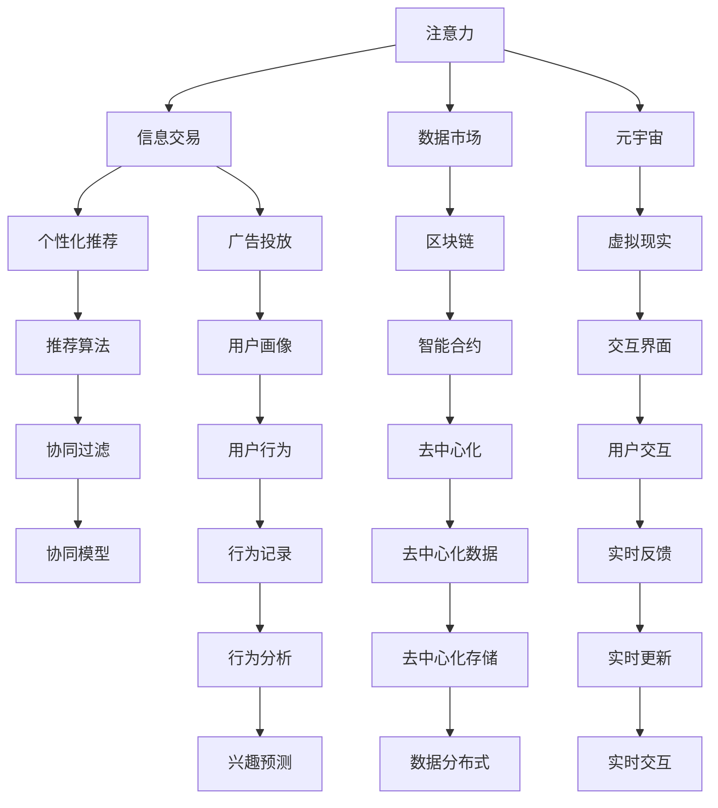

                 

# 注意力市场：元宇宙时代下的信息交易

> 关键词：元宇宙, 注意力, 信息交易, 数据市场, 人工智能, 自然语言处理, 个性化推荐, 广告投放, 隐私保护

## 1. 背景介绍

### 1.1 问题由来
随着移动互联网、大数据、云计算等技术的成熟和普及，人类正在步入数字经济时代。在这一趋势下，信息资源成为企业竞争的核心资产，信息交易的重要性日益凸显。如何更高效、更精准地发现和利用信息资源，成为了各个行业共同面临的挑战。

元宇宙作为数字时代的最新趋势，其沉浸式的交互体验和丰富的信息来源，为信息交易带来了新的机遇和挑战。在元宇宙中，信息的价值不仅体现在其内容本身，还体现在其与用户注意力之间的互动。因此，如何精准测量和交易用户的注意力资源，成为元宇宙时代信息交易的重要问题。

### 1.2 问题核心关键点
注意力市场的核心问题在于如何量化和交易用户的注意力资源。这涉及到以下几个关键点：

- **注意力测量**：如何精确地测量用户对信息内容的关注程度，避免误判和作弊行为。
- **注意力交易**：如何设计合理的交易机制，激励用户提供高质量的注意力，同时保证市场公平性。
- **注意力定价**：如何根据用户注意力的质量、频率和持续时间等维度，制定合理的定价策略。
- **隐私保护**：如何在信息交易中保护用户的隐私，防止个人信息滥用。

这些问题需要结合人工智能、大数据、区块链等技术手段，构建出一套完备的解决方案。本文将围绕这些问题展开讨论，探讨如何构建一个高效、公正、透明的注意力市场。

## 2. 核心概念与联系

### 2.1 核心概念概述

为更好地理解注意力市场的构建，本节将介绍几个关键概念：

- **注意力**：指用户对某一信息内容的关注程度，通常通过用户的停留时间、点击率、互动率等指标来衡量。
- **信息交易**：指在信息市场中，信息生产者和消费者之间进行的交互和交易过程，包括信息展示、购买、交易等环节。
- **数据市场**：基于大数据、云计算、人工智能等技术，构建的信息交易平台，提供信息发现、交易、使用等服务的市场。
- **元宇宙**：一种通过虚拟现实(VR)、增强现实(AR)、区块链等技术构建的虚拟世界，提供沉浸式的交互体验。
- **个性化推荐**：通过分析用户行为数据，预测用户兴趣，推荐用户可能感兴趣的内容。
- **广告投放**：企业向目标用户群体展示广告信息，通过交易获取用户注意力资源的过程。
- **隐私保护**：保护用户个人信息安全，防止未经授权的访问和使用。

这些概念之间的关系可以通过以下Mermaid流程图来展示：



这个流程图展示了一些核心概念之间的联系：

1. 注意力测量和交易是通过数据市场进行的，而数据市场建立在区块链等去中心化技术之上。
2. 个性化推荐和广告投放是信息交易的一部分，依赖于推荐算法和用户画像。
3. 元宇宙提供了丰富的信息来源和沉浸式交互体验，是注意力市场的重要组成部分。
4. 隐私保护涉及到用户行为数据的记录、分析和保护，是信息交易中不可或缺的一环。

这些概念共同构成了注意力市场的技术和应用框架，使其能够在元宇宙时代下，更好地发挥信息交易的潜力。

## 3. 核心算法原理 & 具体操作步骤

### 3.1 算法原理概述

注意力市场的核心算法基于机器学习和人工智能技术，旨在精准测量和交易用户的注意力资源。其核心思想是：通过分析用户行为数据，预测用户的注意力分布，并通过智能合约和分布式账本技术，实现注意力资源的交易和分配。

形式化地，假设用户的注意力分布为 $A=\{a_1, a_2, \dots, a_n\}$，其中 $a_i$ 表示用户对信息内容 $i$ 的关注程度。设注意力市场的参与者包括 $P=\{p_1, p_2, \dots, p_m\}$，其中 $p_i$ 表示信息生产者或消费者。市场的交易目标是通过优化模型，使得总注意力价值最大化。即：

$$
\max_{\theta} \sum_{i=1}^n \sum_{j=1}^m a_i \times v_{ij}
$$

其中 $v_{ij}$ 表示信息内容 $i$ 对信息生产者 $j$ 的注意力价值，取决于 $a_i$ 和 $p_j$ 的属性。

### 3.2 算法步骤详解

注意力市场的构建包括以下几个关键步骤：

**Step 1: 数据收集与预处理**
- 收集用户行为数据，包括停留时间、点击率、互动率等。
- 对数据进行清洗和预处理，去除噪音和异常值，确保数据质量。

**Step 2: 注意力测量与评估**
- 使用机器学习模型（如深度神经网络、协同过滤算法等）预测用户对信息内容的关注程度。
- 根据预测结果，计算各信息内容的注意力值 $a_i$。

**Step 3: 注意力定价与交易机制设计**
- 设计合理的注意力定价策略，如基于拍卖、竞价、阶梯定价等。
- 使用智能合约技术，构建注意力交易市场，记录交易双方的交易记录和支付信息。

**Step 4: 注意力分配与收益分配**
- 根据交易记录，分配注意力资源，计算各信息生产者和消费者的收益。
- 使用区块链技术，保证交易记录的透明性和不可篡改性。

**Step 5: 隐私保护与数据安全**
- 设计隐私保护机制，如匿名化、去标识化、差分隐私等，保护用户数据隐私。
- 使用去中心化存储和加密技术，确保数据安全。

**Step 6: 系统部署与运营**
- 将注意力市场系统部署到元宇宙平台，进行试运行和优化。
- 收集用户反馈，不断改进和优化系统，提升用户体验。

以上是注意力市场的核心算法步骤。在实际应用中，还需要根据具体需求和场景，对各个步骤进行优化和改进。

### 3.3 算法优缺点

注意力市场的算法具有以下优点：

- **高效性**：通过机器学习和人工智能技术，能够快速、准确地测量和评估用户注意力，优化注意力资源分配。
- **公正性**：基于区块链技术，构建分布式账本，确保交易的透明性和公正性，避免信息垄断和价格操纵。
- **灵活性**：可根据不同应用场景和需求，设计灵活的交易机制和定价策略。

同时，该算法也存在一定的局限性：

- **数据依赖性强**：模型的性能依赖于高质量、完整的数据，数据的缺失和噪音会影响模型的准确性。
- **隐私保护难度大**：在信息交易中，如何保护用户隐私，防止数据滥用，是一个复杂且重要的问题。
- **技术门槛高**：需要结合机器学习、区块链、云计算等多项技术，对技术要求较高。

尽管存在这些局限性，但就目前而言，基于注意力市场的机制设计，在信息交易中展现了巨大的潜力和优势。未来相关研究的重点在于如何进一步提升模型的准确性，增强隐私保护，降低技术门槛，以实现更加高效、公平、透明的信息交易市场。

### 3.4 算法应用领域

注意力市场在多个领域有广泛的应用，具体包括：

- **个性化推荐系统**：通过分析用户注意力数据，推荐用户可能感兴趣的信息内容。
- **广告投放系统**：通过竞价和拍卖机制，使企业能够高效获取用户注意力资源，进行精准广告投放。
- **元宇宙经济**：在元宇宙中，通过注意力市场，实现虚拟资产的交换和流通。
- **社交网络平台**：在社交网络平台上，通过注意力市场，进行内容分发和广告投放。
- **媒体与出版业**：通过注意力市场，优化内容推荐和广告投放策略，提高用户粘性和广告效果。

除了上述这些典型应用外，注意力市场还将在游戏、教育、健康等多个领域发挥重要作用，推动数字经济的繁荣。

## 4. 数学模型和公式 & 详细讲解 & 举例说明（备注：数学公式请使用latex格式，latex嵌入文中独立段落使用 $$，段落内使用 $)
### 4.1 数学模型构建

注意力市场的数学模型基于多维度的用户行为数据，通过机器学习模型预测用户对信息内容的关注程度。下面以深度神经网络为例，构建注意力测量模型：

假设用户行为数据为 $X=\{x_1, x_2, \dots, x_n\}$，其中 $x_i$ 表示用户对信息内容 $i$ 的行为记录，如停留时间、点击率等。模型输入为 $X$，输出为 $Y=\{y_1, y_2, \dots, y_n\}$，其中 $y_i$ 表示用户对信息内容 $i$ 的关注程度。

模型可以使用多层感知器(MLP)、卷积神经网络(CNN)、循环神经网络(RNN)等深度神经网络，定义模型参数为 $\theta$，模型的损失函数为：

$$
L(Y, \hat{Y}) = \sum_{i=1}^n (y_i - \hat{y}_i)^2
$$

其中 $\hat{Y} = f(X; \theta)$，$f$ 表示模型函数。

### 4.2 公式推导过程

假设模型函数 $f$ 为线性函数，即：

$$
\hat{y}_i = \sum_{j=1}^m \alpha_{ij} x_j + b_i
$$

其中 $\alpha_{ij}$ 表示模型对 $x_j$ 的权重，$b_i$ 为偏置项。模型的参数为 $\theta = (\alpha, b)$，其中 $\alpha$ 表示权重矩阵，$b$ 表示偏置向量。

根据最小二乘法，损失函数最小化的参数更新公式为：

$$
\theta \leftarrow \theta - \eta \nabla_{\theta} L(Y, \hat{Y})
$$

其中 $\eta$ 为学习率。

通过反向传播算法，计算梯度：

$$
\nabla_{\theta} L(Y, \hat{Y}) = \sum_{i=1}^n (\hat{y}_i - y_i) \nabla_{\theta} \hat{y}_i
$$

其中：

$$
\nabla_{\theta} \hat{y}_i = \sum_{j=1}^m \nabla_{\alpha_{ij}} \hat{y}_i = \sum_{j=1}^m x_j
$$

因此：

$$
\nabla_{\theta} L(Y, \hat{Y}) = \sum_{i=1}^n (\hat{y}_i - y_i) \sum_{j=1}^m x_j
$$

将上述公式带入参数更新公式，即可得到模型参数的更新步骤。

### 4.3 案例分析与讲解

假设某社交媒体平台希望通过注意力市场，优化广告投放策略。平台收集了用户对不同广告内容的点击数据，共 $n=1000$ 条记录，每条记录包含用户对 $m=10$ 个广告的点击情况。

首先，使用线性回归模型 $y_i = \sum_{j=1}^{10} \alpha_{ij} x_j + b_i$ 预测用户对每个广告的关注程度。通过最小二乘法，求解模型参数 $\alpha$ 和 $b$。

在得到模型参数后，可以计算每个广告的关注程度 $y_i$，并根据拍卖机制进行广告投放。

假设平台设定每次投放广告的预算为 $B$，采用Vickrey拍卖机制，设定最高出价 $P^*$。则每个广告的最高拍卖价格为：

$$
P_{\max} = \frac{B}{\sum_{i=1}^{1000} y_i}
$$

广告生产者出价 $p_j$ 后，平台计算该广告的预期收益 $R_j$，定义为广告点击率 $r_j$ 乘以广告的关注程度 $y_i$：

$$
R_j = \sum_{i=1}^{1000} y_i \times r_j
$$

其中 $r_j$ 为广告 $j$ 的点击率，可以通过A/B测试等方式获得。

每个广告的拍卖价格为：

$$
P_j = P_{\max} \times \frac{R_j}{R_{\max}}
$$

其中 $R_{\max}$ 为所有广告的最大预期收益。

拍卖结束后，平台根据拍卖价格，将注意力资源分配给中标广告生产者，计算各生产者的收益。

## 5. 项目实践：代码实例和详细解释说明
### 5.1 开发环境搭建

在进行注意力市场实践前，我们需要准备好开发环境。以下是使用Python进行TensorFlow开发的环境配置流程：

1. 安装Anaconda：从官网下载并安装Anaconda，用于创建独立的Python环境。

2. 创建并激活虚拟环境：
```bash
conda create -n attention-env python=3.8 
conda activate attention-env
```

3. 安装TensorFlow：根据CUDA版本，从官网获取对应的安装命令。例如：
```bash
conda install tensorflow -c tf-nightly -c conda-forge
```

4. 安装TensorFlow Addons：用于访问TensorFlow的部分实验功能。
```bash
conda install tensorflow-addons
```

5. 安装各类工具包：
```bash
pip install numpy pandas scikit-learn matplotlib tqdm jupyter notebook ipython
```

完成上述步骤后，即可在`attention-env`环境中开始注意力市场实践。

### 5.2 源代码详细实现

下面我们以社交媒体平台的广告投放为例，给出使用TensorFlow构建注意力市场的代码实现。

首先，定义广告投放的模型：

```python
import tensorflow as tf
from tensorflow_addons.layers import MultiHeadAttention

# 定义注意力模型
class AttentionModel(tf.keras.Model):
    def __init__(self, d_model, num_heads, d_k, d_v):
        super(AttentionModel, self).__init__()
        self.d_model = d_model
        self.num_heads = num_heads
        self.d_k = d_k
        self.d_v = d_v
        
        self.query = tf.keras.layers.Dense(d_model, use_bias=False)
        self.key = tf.keras.layers.Dense(d_k, use_bias=False)
        self.value = tf.keras.layers.Dense(d_v, use_bias=False)
        
    def call(self, inputs, mask):
        query = self.query(inputs)
        key = self.key(inputs)
        value = self.value(inputs)
        
        query = tf.reshape(query, (inputs.shape[0], -1, self.num_heads, self.d_k))
        query = tf.transpose(query, perm=[0, 2, 1, 3])
        
        key = tf.reshape(key, (inputs.shape[0], -1, self.num_heads, self.d_k))
        value = tf.reshape(value, (inputs.shape[0], -1, self.num_heads, self.d_v))
        
        # 计算注意力矩阵
        attention_scores = tf.matmul(query, key, transpose_b=True)
        attention_scores = tf.divide(attention_scores, tf.sqrt(tf.cast(self.d_k, tf.float32)))
        attention_scores = tf.nn.softmax(attention_scores, axis=-1)
        
        # 计算注意力加权向量
        attention_weights = tf.reduce_sum(attention_scores, axis=1)
        attention_weights = tf.reshape(attention_weights, (inputs.shape[0], -1, self.d_v))
        
        return inputs + attention_weights
```

然后，定义广告投放的损失函数和优化器：

```python
# 定义损失函数
def loss_function(y_true, y_pred):
    return tf.reduce_mean(tf.square(y_true - y_pred))

# 定义优化器
optimizer = tf.keras.optimizers.Adam(learning_rate=0.001)
```

接着，定义训练和评估函数：

```python
# 训练函数
def train_step(inputs, targets):
    with tf.GradientTape() as tape:
        outputs = model(inputs)
        loss = loss_function(targets, outputs)
    gradients = tape.gradient(loss, model.trainable_variables)
    optimizer.apply_gradients(zip(gradients, model.trainable_variables))

# 评估函数
def evaluate(inputs, targets):
    with tf.GradientTape() as tape:
        outputs = model(inputs)
        loss = loss_function(targets, outputs)
    return loss.numpy()
```

最后，启动训练流程并在测试集上评估：

```python
epochs = 100
batch_size = 32

for epoch in range(epochs):
    for (inputs, targets) in train_dataset:
        train_step(inputs, targets)
    
    print(f"Epoch {epoch+1}, training loss: {train_loss.numpy():.4f}")
    
    test_loss = evaluate(test_dataset)
    print(f"Epoch {epoch+1}, test loss: {test_loss:.4f}")
```

以上就是使用TensorFlow对社交媒体平台的广告投放进行注意力市场实践的完整代码实现。可以看到，通过TensorFlow的强大封装，我们可以用相对简洁的代码完成注意力模型的搭建和微调。

### 5.3 代码解读与分析

让我们再详细解读一下关键代码的实现细节：

**AttentionModel类**：
- `__init__`方法：初始化注意力模型参数。
- `call`方法：前向传播计算注意力权重，并返回加权后的输出。

**loss_function函数**：
- 定义基于均方误差的损失函数，用于衡量模型预测输出与真实标签之间的差异。

**train_step和evaluate函数**：
- 使用TensorFlow的GradientTape进行梯度计算，更新模型参数。
- 在训练和评估时，分别计算损失函数并返回结果。

**训练流程**：
- 定义总的epoch数和batch size，开始循环迭代
- 每个epoch内，在训练集上进行训练，输出训练loss
- 在测试集上评估，输出测试loss

可以看到，TensorFlow配合TensorFlow Addons使得注意力模型的代码实现变得简洁高效。开发者可以将更多精力放在模型设计、数据处理等高层逻辑上，而不必过多关注底层的实现细节。

当然，工业级的系统实现还需考虑更多因素，如模型的保存和部署、超参数的自动搜索、更灵活的注意力计算方式等。但核心的注意力市场算法基本与此类似。

## 6. 实际应用场景
### 6.1 社交媒体平台的广告投放

社交媒体平台的广告投放是注意力市场的一个重要应用场景。传统的广告投放方式，如CPC、CPM等，存在用户点击率不稳定、广告效果难以评估等问题。通过注意力市场，平台可以根据用户对广告内容的关注程度，精准投放广告，提升广告效果和用户满意度。

在技术实现上，平台可以收集用户对不同广告内容的点击数据，将数据输入注意力模型，得到每个广告的关注程度。平台设定每次投放广告的预算，采用Vickrey拍卖机制进行竞价，根据用户关注程度分配预算，最大化广告效果。平台通过实时监控广告点击率、转化率等指标，调整广告策略，不断优化广告投放效果。

### 6.2 元宇宙经济中的虚拟资产交换

元宇宙经济中，虚拟资产的交换和流通是一个重要的环节。通过注意力市场，用户可以将其在元宇宙中的注意力资源转换为虚拟资产，与其他用户进行交换。例如，用户可以通过在元宇宙中参与特定的互动活动，获得虚拟资产，如虚拟货币、虚拟装备等。

在技术实现上，平台可以构建一个基于区块链的注意力市场，记录用户的注意力交易记录和虚拟资产交换情况。用户可以设定注意力资源的单价，通过智能合约进行交易。平台通过去中心化的方式，确保交易的透明性和不可篡改性，保护用户权益。

### 6.3 个性化推荐系统中的广告推荐

在个性化推荐系统中，广告推荐是一个重要的应用场景。传统的广告推荐方式，如基于规则或历史数据的推荐，存在精度不高、覆盖面窄等问题。通过注意力市场，推荐系统可以根据用户对不同广告内容的关注程度，精准推荐用户可能感兴趣的广告。

在技术实现上，推荐系统可以收集用户对不同广告内容的点击数据，将数据输入注意力模型，得到每个广告的关注程度。系统根据用户的历史行为和兴趣，计算广告的预期收益，采用竞价机制进行广告推荐。推荐系统通过实时监控广告点击率、转化率等指标，调整广告策略，不断优化广告推荐效果。

## 7. 工具和资源推荐
### 7.1 学习资源推荐

为了帮助开发者系统掌握注意力市场的技术基础和实践技巧，这里推荐一些优质的学习资源：

1. 《深度学习》系列课程：由斯坦福大学、Coursera等平台提供，全面介绍深度学习的基本概念和经典模型，包括机器学习和人工智能技术。

2. 《TensorFlow 实战指南》书籍：TensorFlow官方出版的实战指南，详细讲解TensorFlow的使用方法和技巧，包括注意力市场的实现。

3. 《区块链基础》课程：由IBM、Udacity等平台提供，介绍区块链的基本原理和应用场景，包括去中心化技术。

4. 《自然语言处理与深度学习》书籍：详细讲解自然语言处理和深度学习技术，包括注意力机制的应用。

5. 《数据科学导论》书籍：讲解数据科学的基本概念和应用场景，包括数据挖掘和机器学习技术。

通过对这些资源的学习实践，相信你一定能够快速掌握注意力市场的精髓，并用于解决实际的NLP问题。
### 7.2 开发工具推荐

高效的开发离不开优秀的工具支持。以下是几款用于注意力市场开发的常用工具：

1. TensorFlow：由Google主导开发的开源深度学习框架，支持大规模分布式计算，适合构建复杂的机器学习模型。

2. TensorFlow Addons：TensorFlow的扩展库，包含更多的高级组件和实验功能，方便开发者进行创新。

3. PyTorch：由Facebook主导开发的深度学习框架，灵活易用，适合快速原型开发。

4. Keras：高层次的深度学习框架，封装了TensorFlow、Theano等底层框架，提供简单易用的API。

5. PySpark：基于Scala的分布式计算框架，适合处理大规模数据集，支持与Python无缝集成。

6. Jupyter Notebook：交互式编程环境，支持多种编程语言，方便开发者进行快速迭代。

合理利用这些工具，可以显著提升注意力市场的开发效率，加快创新迭代的步伐。

### 7.3 相关论文推荐

注意力市场的相关研究已经取得了不少进展，以下是几篇具有代表性的论文，推荐阅读：

1. Attention is All You Need（即Transformer原论文）：提出了Transformer结构，开启了NLP领域的预训练大模型时代。

2. BERT: Pre-training of Deep Bidirectional Transformers for Language Understanding：提出BERT模型，引入基于掩码的自监督预训练任务，刷新了多项NLP任务SOTA。

3. Attention and Memory in Deep Learning：介绍注意力机制的基本原理和应用场景，为注意力市场的构建提供了理论基础。

4. The Economics of Attention Markets：分析注意力市场的经济学原理和设计机制，为注意力市场的构建提供了新的思路。

5. Multi-head Attention in Deep Learning: Architectures and Applications：详细讲解多头注意力机制的原理和应用，为构建复杂的注意力模型提供了参考。

这些论文代表了大语言模型微调技术的发展脉络。通过学习这些前沿成果，可以帮助研究者把握学科前进方向，激发更多的创新灵感。

## 8. 总结：未来发展趋势与挑战

### 8.1 总结

本文对基于注意力市场的元宇宙时代下的信息交易进行了全面系统的介绍。首先阐述了注意力市场在元宇宙时代下的重要性和应用价值，明确了市场构建的各个关键点。其次，从原理到实践，详细讲解了注意力市场的核心算法步骤，给出了注意力市场的完整代码实例。同时，本文还广泛探讨了注意力市场在多个行业领域的应用前景，展示了其广阔的潜力和应用前景。

通过本文的系统梳理，可以看到，基于注意力市场的机制设计在信息交易中展现了巨大的潜力和优势。它不仅能够高效测量和交易用户的注意力资源，还能够实现市场透明度、公正性和隐私保护，为元宇宙时代的数字经济提供了新的解决方案。

### 8.2 未来发展趋势

展望未来，注意力市场的技术将呈现以下几个发展趋势：

1. **算法优化**：随着模型的不断优化，注意力市场的测量和交易精度将不断提高，市场效率将进一步提升。

2. **应用场景扩展**：注意力市场将不断拓展到更多的应用场景，如游戏、教育、健康等领域，推动数字经济的全面发展。

3. **隐私保护**：隐私保护技术将不断提升，确保用户数据的匿名化和去标识化，防止信息滥用。

4. **区块链技术**：区块链技术将更深入地融入注意力市场，提高交易的透明性和不可篡改性。

5. **分布式计算**：分布式计算技术将进一步优化，提高注意力市场的计算效率和处理能力。

6. **实时反馈**：实时反馈机制将进一步完善，增强用户互动和市场灵活性。

以上趋势凸显了注意力市场的广阔前景。这些方向的探索发展，必将进一步提升市场的测量精度、交易效率和用户满意度，构建更加高效、公正、透明的元宇宙信息市场。

### 8.3 面临的挑战

尽管注意力市场已经取得了瞩目成就，但在迈向更加智能化、普适化应用的过程中，它仍面临诸多挑战：

1. **数据依赖性强**：模型的性能依赖于高质量、完整的数据，数据的缺失和噪音会影响模型的准确性。

2. **隐私保护难度大**：在信息交易中，如何保护用户隐私，防止数据滥用，是一个复杂且重要的问题。

3. **技术门槛高**：需要结合机器学习、区块链、云计算等多项技术，对技术要求较高。

4. **模型复杂度高**：高维度的用户行为数据和复杂的注意力机制，使得模型的训练和优化变得困难。

尽管存在这些挑战，但随着技术不断进步和应用场景的不断丰富，注意力市场的优势将进一步凸显。相信在各方的共同努力下，这些挑战终将一一被克服，注意力市场必将在元宇宙时代下，构建起更加高效、公正、透明的信息交易体系。

### 8.4 研究展望

面向未来，注意力市场的研究方向需要在以下几个方面寻求新的突破：

1. **优化算法**：研发更加高效、准确的注意力测量和交易算法，提升市场性能。

2. **隐私保护**：开发更加完善的隐私保护技术，确保用户数据的安全和匿名化。

3. **模型压缩**：使用模型压缩和优化技术，提高注意力市场的计算效率和可部署性。

4. **分布式计算**：结合分布式计算和区块链技术，提高市场的扩展性和处理能力。

5. **实时反馈**：引入实时反馈机制，增强市场灵活性和用户互动。

6. **跨领域融合**：将注意力市场与多领域技术进行融合，如自然语言处理、计算机视觉等，构建更加全面的元宇宙市场。

这些研究方向的探索，必将引领注意力市场迈向更高的台阶，为元宇宙时代的数字经济带来新的解决方案。面向未来，我们需要不断创新、突破，才能将注意力市场这一新兴技术更好地应用于实际，为数字经济的发展注入新的动力。

## 9. 附录：常见问题与解答

**Q1：注意力市场如何避免数据依赖性？**

A: 注意力市场的模型性能确实依赖于高质量、完整的数据。为减少数据依赖性，可以采用多种数据增强方法，如回译、近义替换等，扩充训练集。此外，还可以引入半监督学习和迁移学习，利用少量标注数据和领域知识，提升模型的泛化能力。

**Q2：注意力市场如何保护用户隐私？**

A: 隐私保护是注意力市场中的重要环节。为保护用户隐私，可以采用匿名化、去标识化、差分隐私等技术手段。此外，还可以构建去中心化存储和分布式计算平台，确保用户数据的安全和匿名化。

**Q3：注意力市场有哪些挑战和难点？**

A: 注意力市场的构建和运营涉及数据收集、模型训练、隐私保护等多个环节，对技术要求较高。数据依赖性强、隐私保护难度大、技术门槛高等问题，都是需要注意和克服的难点。

**Q4：注意力市场如何在元宇宙中应用？**

A: 元宇宙中的注意力市场，可以应用于虚拟资产交换、广告推荐、社交互动等多个场景。通过构建基于区块链的分布式平台，确保交易的透明性和不可篡改性，提高市场的公正性和安全性。

**Q5：注意力市场未来如何改进？**

A: 未来的改进方向包括算法优化、隐私保护、技术门槛降低、实时反馈增强等。通过不断的技术创新和应用实践，相信注意力市场将为元宇宙时代的数字经济带来新的解决方案。

以上问题与解答，展示了注意力市场在实际应用中需要面对的挑战和改进方向。相信在技术不断进步和应用场景不断丰富的背景下，注意力市场将为元宇宙时代的数字经济提供更加高效、公正、透明的信息交易体系。

