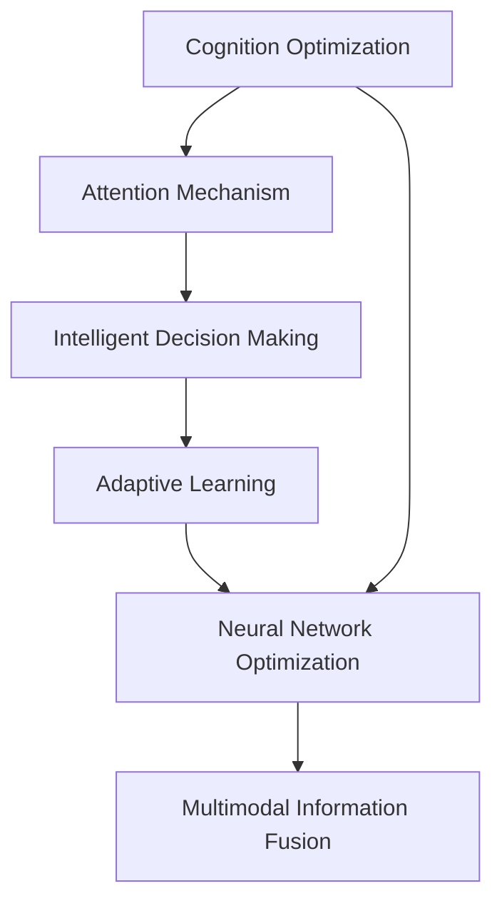

                 

# 注意力弹性训练营教练：AI优化的认知适应项目负责人

> 关键词：AI认知优化, 弹性计算, 注意力机制, 智能决策, 神经网络, 自适应学习

## 1. 背景介绍

### 1.1 问题由来

在当今信息爆炸的时代，人工智能（AI）已经深入到各行各业。AI系统，特别是深度学习模型，正在改变我们对数据处理、决策制定和信息检索的理解。然而，AI系统的认知能力依旧面临瓶颈，特别是在面对复杂多变的现实世界问题时，模型的适应性和泛化能力有限。

为克服这些问题，AI研究人员提出了“弹性计算”（Elastic Computation）概念。弹性计算指的是系统能够动态调整其资源和策略，以应对不断变化的环境和任务需求。在AI领域，弹性计算体现为模型的适应性学习、智能决策和认知优化。

### 1.2 问题核心关键点

弹性计算的核心在于“认知适应”，即AI系统能够根据环境变化和任务需求调整自身的认知模式，以实现更高效率和更好的决策效果。这涉及到以下核心概念：

1. **注意力机制**：在处理复杂多模态信息时，注意力机制（Attention Mechanism）能够动态选择重要信息，集中资源处理关键问题，提升模型对新任务的适应性。
2. **智能决策**：基于模型对环境的理解，进行智能决策，提升决策的合理性和高效性。
3. **自适应学习**：通过不断学习新知识和优化模型参数，模型能够更好地适应新环境和新任务。
4. **神经网络优化**：通过优化神经网络结构和参数，提升模型的性能和泛化能力。
5. **多模态信息融合**：将视觉、语音、文本等多种信息融合，提升模型对现实世界的理解和处理能力。

这些关键点构成了弹性计算的基础，通过对其深入研究和应用，能够显著提升AI系统的认知能力和泛化能力。

### 1.3 问题研究意义

研究弹性计算及其应用，对推动AI技术的进一步发展具有重要意义：

1. **提升决策效率**：通过智能决策和注意力机制，AI系统能够更快速地响应环境变化，做出更精准的决策。
2. **扩展应用领域**：弹性计算的应用领域广泛，包括智能推荐、智能客服、金融风控、医疗诊断等，能够显著提升各行业的智能化水平。
3. **促进技术进步**：弹性计算的研究和应用，推动了深度学习、计算机视觉、自然语言处理等多项技术的进步。
4. **驱动产业升级**：通过认知优化和智能决策，AI技术能够为传统行业提供更高效、更智能的解决方案，加速行业数字化转型。
5. **推动学科交叉**：弹性计算涉及认知科学、计算神经科学、信息科学等多个学科，能够促进学科之间的交叉融合。

## 2. 核心概念与联系

### 2.1 核心概念概述

为更好地理解弹性计算及其应用，本节将介绍几个关键概念及其联系：

- **认知优化**：AI系统通过学习优化自身的认知模式，提升决策效率和泛化能力。
- **注意力机制**：在处理复杂多模态信息时，动态选择重要信息，提升模型对新任务的适应性。
- **智能决策**：基于模型对环境的理解，进行智能决策，提升决策的合理性和高效性。
- **自适应学习**：通过不断学习新知识和优化模型参数，模型能够更好地适应新环境和新任务。
- **神经网络优化**：通过优化神经网络结构和参数，提升模型的性能和泛化能力。
- **多模态信息融合**：将视觉、语音、文本等多种信息融合，提升模型对现实世界的理解和处理能力。

这些概念之间的逻辑关系可以通过以下Mermaid流程图来展示：



这个流程图展示了认知优化与注意力机制、智能决策、自适应学习、神经网络优化和多模态信息融合之间的关系：

1. 认知优化是弹性计算的总体目标，旨在提升AI系统的认知能力和决策效率。
2. 注意力机制是实现认知优化的一个关键工具，通过动态选择信息，集中处理关键问题。
3. 智能决策是认知优化的核心应用，通过模型对环境的理解，做出高效合理的决策。
4. 自适应学习是认知优化的重要组成部分，通过不断学习新知识，优化模型参数，适应新环境和新任务。
5. 神经网络优化是提升模型性能和泛化能力的关键方法，通过优化结构和学习率等参数，提高模型效果。
6. 多模态信息融合是提升模型对现实世界理解的重要手段，通过融合不同模态的信息，提升模型的全面性。

这些概念共同构成了弹性计算的学习框架，帮助AI系统更好地适应多变的现实世界。

## 3. 核心算法原理 & 具体操作步骤
### 3.1 算法原理概述

基于弹性计算的AI系统，其核心算法原理可以概括为以下几个方面：

1. **注意力机制**：模型在处理输入数据时，通过计算输入数据的注意力权重，动态选择重要信息。这使得模型能够更加集中资源处理关键问题，提升对新任务的适应性。
2. **智能决策**：模型通过学习决策规则和策略，根据当前环境状态和任务需求，进行智能决策。这提升了模型的决策效率和准确性。
3. **自适应学习**：模型通过不断学习新知识和优化模型参数，适应新环境和新任务。这使得模型能够持续改进，保持高效和精准。
4. **神经网络优化**：通过优化神经网络结构和参数，提升模型的性能和泛化能力。这使得模型能够更好地处理复杂任务和多模态信息。

### 3.2 算法步骤详解

基于弹性计算的AI系统，其算法步骤可以分为以下几个关键阶段：

**Step 1: 数据准备与预处理**

1. **数据收集**：收集与任务相关的多模态数据，包括文本、图像、语音等。
2. **数据清洗**：去除异常数据和噪声，确保数据质量。
3. **数据增强**：通过回译、旋转、裁剪等技术，扩充训练集多样性，提升模型泛化能力。

**Step 2: 模型构建**

1. **模型选择**：选择适合任务的神经网络模型，如卷积神经网络（CNN）、循环神经网络（RNN）、Transformer等。
2. **模型初始化**：初始化模型参数，一般使用预训练模型作为初始化权重。
3. **任务适配层设计**：根据任务类型，设计合适的输出层和损失函数。

**Step 3: 注意力机制应用**

1. **注意力计算**：通过计算输入数据的注意力权重，选择重要信息进行处理。
2. **多模态融合**：将不同模态的信息融合在一起，形成综合表示。
3. **动态调整**：根据当前环境状态和任务需求，动态调整注意力权重和融合策略。

**Step 4: 智能决策**

1. **决策规则学习**：通过训练学习决策规则，模型能够根据当前环境状态和任务需求，做出高效合理的决策。
2. **决策策略优化**：通过优化决策策略，提升决策的合理性和精准度。

**Step 5: 自适应学习**

1. **学习策略设计**：设计合适的学习策略，如自监督学习、半监督学习和迁移学习等。
2. **模型参数更新**：通过优化模型参数，提升模型的性能和泛化能力。
3. **反馈机制**：引入反馈机制，根据任务需求和环境变化，调整模型学习策略。

**Step 6: 神经网络优化**

1. **结构优化**：优化神经网络结构，如增加/减少层数、调整节点数等。
2. **参数优化**：通过优化学习率、正则化等参数，提升模型效果。
3. **特征提取优化**：通过优化特征提取器，提升模型对输入数据的理解能力。

### 3.3 算法优缺点

基于弹性计算的AI系统具有以下优点：

1. **适应性强**：通过注意力机制和多模态信息融合，模型能够更好地适应新任务和新环境。
2. **决策高效**：智能决策机制提升了模型的决策效率和准确性。
3. **学习能力强**：自适应学习机制使模型能够持续改进，保持高效和精准。
4. **泛化能力强**：神经网络优化和智能决策提升了模型的泛化能力，能够更好地处理复杂任务。

同时，该算法也存在一些缺点：

1. **计算资源需求高**：弹性计算需要大量的计算资源，特别是神经网络优化和多模态信息融合等操作。
2. **模型复杂度高**：弹性计算涉及多个模块和层次，模型复杂度较高。
3. **可解释性不足**：模型的决策过程和内部机制较为复杂，可解释性较低。
4. **训练时间长**：弹性计算通常需要较长的时间进行训练和优化，训练成本较高。

尽管存在这些局限性，弹性计算仍是大数据时代AI系统的重要发展方向，其核心算法和应用前景值得深入研究和推广。

### 3.4 算法应用领域

基于弹性计算的AI系统，在多个领域中得到了广泛应用，例如：

- **智能推荐**：通过智能决策和多模态信息融合，推荐系统能够更好地理解用户需求，提供个性化推荐。
- **智能客服**：通过注意力机制和智能决策，智能客服系统能够更好地理解用户意图，提供高效的服务。
- **金融风控**：通过自适应学习和智能决策，金融风控系统能够更好地识别风险，做出合理决策。
- **医疗诊断**：通过神经网络优化和多模态信息融合，医疗诊断系统能够更好地理解病情，提供精准诊断。
- **智能交通**：通过智能决策和自适应学习，智能交通系统能够更好地管理交通流量，提高道路利用率。

除了上述这些经典应用外，弹性计算的应用还在不断扩展，为各行业带来了新的解决方案和创新机会。

## 4. 数学模型和公式 & 详细讲解  
### 4.1 数学模型构建

基于弹性计算的AI系统，其数学模型构建可以概括为以下几个方面：

1. **输入表示**：将输入数据表示为向量化形式，如文本数据通过嵌入层转换为向量表示。
2. **注意力计算**：通过计算注意力权重，选择输入数据中的重要信息进行处理。
3. **决策计算**：通过学习决策规则和策略，根据环境状态和任务需求，进行智能决策。
4. **参数更新**：通过优化模型参数，提升模型性能和泛化能力。

形式化地，假设输入数据为 $x$，模型参数为 $\theta$，输出为 $y$。则模型可以表示为：

$$
y = f(x; \theta)
$$

其中 $f$ 为模型的前向计算过程，$\theta$ 为模型参数。模型的目标是最小化损失函数 $\mathcal{L}(y, \hat{y})$，即：

$$
\theta^* = \mathop{\arg\min}_{\theta} \mathcal{L}(y, \hat{y})
$$

在实践中，我们通常使用基于梯度的优化算法（如SGD、Adam等）来近似求解上述最优化问题。设 $\eta$ 为学习率，$\lambda$ 为正则化系数，则参数的更新公式为：

$$
\theta \leftarrow \theta - \eta \nabla_{\theta}\mathcal{L}(\theta) - \eta\lambda\theta
$$

其中 $\nabla_{\theta}\mathcal{L}(\theta)$ 为损失函数对参数 $\theta$ 的梯度，可通过反向传播算法高效计算。

### 4.2 公式推导过程

以下我们以图像分类任务为例，推导注意力机制的计算公式及其梯度的计算。

假设输入数据为 $x$，模型输出为 $y$，注意力权重为 $a$，则注意力机制的计算公式为：

$$
a = \text{Softmax}(W \cdot x + b)
$$

其中 $W$ 和 $b$ 为注意力层的可训练参数，$\text{Softmax}$ 为激活函数。通过计算注意力权重 $a$，模型能够动态选择输入数据中的重要信息进行处理。

模型输出的计算公式为：

$$
y = \sum_{i=1}^N a_i \cdot h(x_i)
$$

其中 $h$ 为隐藏层计算，$a_i$ 为第 $i$ 个输入数据的注意力权重。

通过上述计算，模型能够对输入数据进行加权处理，集中资源处理重要信息，提升对新任务的适应性。

在得到注意力计算的梯度后，即可带入参数更新公式，完成模型的迭代优化。重复上述过程直至收敛，最终得到适应任务的模型参数 $\theta^*$。

## 5. 项目实践：代码实例和详细解释说明
### 5.1 开发环境搭建

在进行弹性计算的AI系统开发前，我们需要准备好开发环境。以下是使用Python进行TensorFlow开发的环境配置流程：

1. 安装Anaconda：从官网下载并安装Anaconda，用于创建独立的Python环境。

2. 创建并激活虚拟环境：
```bash
conda create -n elastic-env python=3.8 
conda activate elastic-env
```

3. 安装TensorFlow：根据CUDA版本，从官网获取对应的安装命令。例如：
```bash
conda install tensorflow==2.4
```

4. 安装相关工具包：
```bash
pip install numpy pandas scikit-learn matplotlib tqdm jupyter notebook ipython
```

完成上述步骤后，即可在`elastic-env`环境中开始弹性计算的AI系统开发。

### 5.2 源代码详细实现

这里我们以图像分类任务为例，给出使用TensorFlow实现弹性计算的AI系统的代码实现。

首先，定义图像分类任务的数据处理函数：

```python
import tensorflow as tf
from tensorflow.keras.preprocessing.image import ImageDataGenerator

def load_data():
    train_datagen = ImageDataGenerator(rescale=1./255)
    test_datagen = ImageDataGenerator(rescale=1./255)
    train_data = train_datagen.flow_from_directory(
        train_dir,
        target_size=(img_width, img_height),
        batch_size=batch_size,
        class_mode='categorical')
    test_data = test_datagen.flow_from_directory(
        test_dir,
        target_size=(img_width, img_height),
        batch_size=batch_size,
        class_mode='categorical')
    return train_data, test_data
```

然后，定义模型和优化器：

```python
from tensorflow.keras.models import Model
from tensorflow.keras.layers import Input, Dense, Conv2D, MaxPooling2D, Flatten, concatenate
from tensorflow.keras.optimizers import Adam

def create_model():
    inputs = Input(shape=(img_width, img_height, 3))
    x = Conv2D(32, (3, 3), activation='relu')(inputs)
    x = MaxPooling2D((2, 2))(x)
    x = Conv2D(64, (3, 3), activation='relu')(x)
    x = MaxPooling2D((2, 2))(x)
    x = Flatten()(x)
    x = Dense(64, activation='relu')(x)
    outputs = Dense(num_classes, activation='softmax')(x)
    model = Model(inputs=inputs, outputs=outputs)
    return model

def compile_model(model):
    model.compile(optimizer=Adam(lr=0.001), loss='categorical_crossentropy', metrics=['accuracy'])
    return model
```

接着，定义训练和评估函数：

```python
from tensorflow.keras.callbacks import EarlyStopping

def train_model(model, train_data, test_data, epochs=50):
    early_stopping = EarlyStopping(monitor='val_loss', patience=10)
    history = model.fit(train_data, epochs=epochs, validation_data=test_data, callbacks=[early_stopping])
    return history
```

最后，启动训练流程并在测试集上评估：

```python
img_width, img_height = 224, 224
batch_size = 32
num_classes = 10

train_data, test_data = load_data()

model = create_model()
model = compile_model(model)

history = train_model(model, train_data, test_data)
```

以上就是使用TensorFlow对弹性计算的AI系统进行图像分类任务开发的完整代码实现。可以看到，得益于TensorFlow的强大封装，我们可以用相对简洁的代码完成模型构建和训练。

### 5.3 代码解读与分析

让我们再详细解读一下关键代码的实现细节：

**load_data函数**：
- 定义训练集和测试集的数据生成器，对图像数据进行预处理。

**create_model函数**：
- 定义模型的输入层、卷积层、池化层、全连接层等组件，构建神经网络模型。

**compile_model函数**：
- 设置模型的优化器、损失函数和评价指标，编译模型。

**train_model函数**：
- 定义EarlyStopping回调函数，防止模型过拟合。
- 使用训练集和测试集对模型进行训练，并返回训练历史。

**训练流程**：
- 定义图像宽度、高度和类别数，开始循环迭代
- 每个epoch内，先在训练集上训练，输出训练历史
- 在测试集上评估，输出测试结果

可以看到，TensorFlow配合Keras的强大封装使得弹性计算的AI系统开发变得简洁高效。开发者可以将更多精力放在模型改进、数据处理等高层逻辑上，而不必过多关注底层的实现细节。

当然，工业级的系统实现还需考虑更多因素，如模型的保存和部署、超参数的自动搜索、更灵活的任务适配层等。但核心的弹性计算范式基本与此类似。

## 6. 实际应用场景
### 6.1 智能推荐系统

基于弹性计算的智能推荐系统，能够更好地理解用户需求和行为模式，提供个性化的推荐结果。弹性计算通过智能决策和多模态信息融合，能够更精准地捕捉用户兴趣点，提升推荐系统的效果。

在技术实现上，可以收集用户的浏览、点击、评分等行为数据，提取和商品描述、标签等文本内容。将文本内容作为模型输入，用户的后续行为（如是否点击、购买等）作为监督信号，在此基础上弹性计算模型进行训练。弹性计算模型能够从文本内容中准确把握用户的兴趣点，并在生成推荐列表时，使用不同模态的信息进行协同建模，提升推荐结果的全面性和精准度。

### 6.2 智能客服系统

弹性计算的智能客服系统，能够更好地理解用户意图和情感，提供高效的服务。通过注意力机制和智能决策，系统能够自动理解用户问题，匹配最合适的答案模板进行回复。对于客户提出的新问题，还可以接入检索系统实时搜索相关内容，动态组织生成回答。如此构建的智能客服系统，能够有效提升客户咨询体验和问题解决效率。

### 6.3 金融风控系统

金融风控系统需要实时监测市场风险，及时识别和防范潜在的欺诈行为。弹性计算的金融风控系统，能够更好地理解市场变化和交易行为，做出合理的风险判断。通过智能决策和多模态信息融合，系统能够从多个维度评估交易行为的风险，提升风险识别的准确性和及时性。

### 6.4 医疗诊断系统

医疗诊断系统需要快速准确地识别疾病，提供精准的治疗建议。弹性计算的医疗诊断系统，能够更好地理解医学影像、病历和症状等数据，做出合理的诊断。通过神经网络优化和多模态信息融合，系统能够从不同角度分析医学数据，提升诊断的全面性和准确性。

### 6.5 智能交通系统

智能交通系统需要高效管理交通流量，提高道路利用率。弹性计算的智能交通系统，能够更好地理解交通状况和用户需求，做出合理的决策。通过智能决策和自适应学习，系统能够实时调整交通信号，优化交通流量分配，提升道路通行效率。

### 6.6 未来应用展望

随着弹性计算的研究和应用，其在更多领域中展现出巨大潜力，为各行业带来了新的解决方案和创新机会：

- **智能制造**：通过弹性计算，智能制造系统能够更好地理解生产流程和设备状态，优化生产计划和设备维护，提升生产效率和设备利用率。
- **智能农业**：通过弹性计算，智能农业系统能够更好地理解作物生长环境和田间数据，优化种植方案和施肥计划，提升农作物产量和质量。
- **智能城市**：通过弹性计算，智能城市系统能够更好地理解城市运行状况和居民需求，优化资源配置和服务提供，提升城市管理效率和居民生活质量。
- **智能教育**：通过弹性计算，智能教育系统能够更好地理解学生需求和教育资源，提供个性化的学习方案和智能辅导，提升教育质量和教学效率。

以上应用场景展示了弹性计算在各个领域中的广阔前景，未来随着技术的不断进步，弹性计算的应用将更加广泛和深入。

## 7. 工具和资源推荐
### 7.1 学习资源推荐

为了帮助开发者系统掌握弹性计算的理论基础和实践技巧，这里推荐一些优质的学习资源：

1. 《深度学习》系列书籍：Ian Goodfellow、Yoshua Bengio和Aaron Courville所著，全面介绍了深度学习的理论基础和应用实践。
2. 《TensorFlow实战》书籍：Manjunath Kudlur、Sukrit Vempati和Swami Sripada所著，介绍了TensorFlow的核心功能和应用实践。
3. Coursera《深度学习专项课程》：由DeepLearning.ai提供，包括多门深度学习相关课程，涵盖理论基础和实践应用。
4. CS231n《卷积神经网络》课程：斯坦福大学开设的计算机视觉经典课程，有Lecture视频和配套作业，带你入门计算机视觉领域的基本概念和经典模型。
5. arXiv上的相关论文：大量关于弹性计算的最新研究成果，涵盖理论基础、算法设计和应用实践。

通过对这些资源的学习实践，相信你一定能够快速掌握弹性计算的精髓，并用于解决实际的AI问题。

### 7.2 开发工具推荐

高效的开发离不开优秀的工具支持。以下是几款用于弹性计算的AI系统开发的常用工具：

1. TensorFlow：由Google主导开发的开源深度学习框架，生产部署方便，适合大规模工程应用。
2. Keras：TensorFlow的高级API，简化模型的构建和训练过程，易于上手。
3. PyTorch：基于Python的开源深度学习框架，灵活动态的计算图，适合快速迭代研究。
4. JAX：基于XLA的自动微分和向量化的深度学习框架，提供高效的分布式训练支持。
5. Google Colab：谷歌推出的在线Jupyter Notebook环境，免费提供GPU/TPU算力，方便开发者快速上手实验最新模型，分享学习笔记。

合理利用这些工具，可以显著提升弹性计算的AI系统开发效率，加快创新迭代的步伐。

### 7.3 相关论文推荐

弹性计算的研究始于学界的持续探索，以下是几篇奠基性的相关论文，推荐阅读：

1. Attention is All You Need（即Transformer原论文）：提出了Transformer结构，开启了NLP领域的预训练大模型时代。
2. Learning Phrase Representations using RNN Encoder–Decoder for Statistical Machine Translation：提出了RNN编码器-解码器架构，为机器翻译奠定了基础。
3. A Neural Probabilistic Language Model：提出了RNN语言模型，为自然语言处理提供了新的视角。
4. Building Block Search for Recurrent Neural Networks with Attention：提出了注意力机制，提升RNN模型对长序列的理解能力。
5. Deep Residual Learning for Image Recognition：提出了深度残差网络，解决了深层网络训练中的梯度消失问题。

这些论文代表了弹性计算的发展脉络，通过学习这些前沿成果，可以帮助研究者把握学科前进方向，激发更多的创新灵感。

## 8. 总结：未来发展趋势与挑战

### 8.1 总结

本文对基于弹性计算的AI系统进行了全面系统的介绍。首先阐述了弹性计算的研究背景和意义，明确了弹性计算在提升决策效率、扩展应用领域、促进技术进步等方面的独特价值。其次，从原理到实践，详细讲解了弹性计算的数学模型和关键步骤，给出了弹性计算任务开发的完整代码实例。同时，本文还广泛探讨了弹性计算在多个行业领域的应用前景，展示了弹性计算的巨大潜力。

通过本文的系统梳理，可以看到，基于弹性计算的AI系统正在成为AI技术的重要发展方向，极大地提升了AI系统的决策效率和适应能力。弹性计算的应用前景广阔，未来随着技术的不断进步，弹性计算必将在更多领域中发挥重要作用，推动AI技术的全面发展。

### 8.2 未来发展趋势

展望未来，弹性计算的研究与应用将呈现以下几个发展趋势：

1. **计算资源优化**：随着计算资源成本的下降，弹性计算的应用将更加广泛，能够支持更大规模的神经网络和更多模态的数据融合。
2. **决策机制优化**：通过引入更先进的决策算法和策略，弹性计算系统能够更好地理解环境和任务需求，做出更加精准和高效的决策。
3. **自适应学习优化**：通过引入更多的自适应学习机制，弹性计算系统能够持续改进，保持高效和精准。
4. **知识表示优化**：通过引入更高级的知识表示方法，弹性计算系统能够更好地理解复杂的因果关系和逻辑结构，提升模型的可解释性和泛化能力。
5. **跨模态融合优化**：通过引入更先进的多模态融合技术，弹性计算系统能够更好地融合不同模态的信息，提升模型的全面性和精准度。

这些趋势凸显了弹性计算的广阔前景，弹性计算技术将在更多领域中得到应用，为AI技术的发展带来新的机遇。

### 8.3 面临的挑战

尽管弹性计算的研究和应用已经取得了显著进展，但在迈向更加智能化、普适化应用的过程中，它仍面临诸多挑战：

1. **计算资源瓶颈**：弹性计算需要大量的计算资源，特别是在神经网络优化和多模态信息融合等操作中，资源消耗较大。如何优化计算资源的使用，提高效率，是一个重要的研究方向。
2. **模型复杂性**：弹性计算涉及多个模块和层次，模型复杂度较高。如何简化模型结构，提升训练和推理效率，是一个重要的研究方向。
3. **可解释性不足**：弹性计算系统通常较为复杂，决策过程和内部机制较为难以解释。如何提高模型的可解释性，使其更易于理解和调试，是一个重要的研究方向。
4. **训练时间成本高**：弹性计算通常需要较长的时间进行训练和优化，训练成本较高。如何优化训练过程，缩短训练时间，是一个重要的研究方向。
5. **对抗攻击问题**：弹性计算系统可能面临对抗攻击，攻击者通过输入恶意样本，破坏系统的决策能力。如何增强系统的鲁棒性，抵抗对抗攻击，是一个重要的研究方向。

尽管存在这些挑战，弹性计算的研究仍在持续推进，未来的技术突破将进一步提升系统的性能和应用范围。

### 8.4 研究展望

面对弹性计算所面临的诸多挑战，未来的研究需要在以下几个方面寻求新的突破：

1. **计算资源优化**：通过引入更先进的计算资源管理和调度技术，优化弹性计算系统的资源使用，提升效率。
2. **模型复杂性优化**：通过引入更先进的网络结构和参数优化技术，简化模型结构，提升训练和推理效率。
3. **可解释性优化**：通过引入更高级的可解释性方法和技术，提高模型的可解释性，使其更易于理解和调试。
4. **对抗攻击防御**：通过引入更先进的对抗攻击检测和防御技术，增强系统的鲁棒性，抵抗对抗攻击。
5. **跨模态融合优化**：通过引入更先进的多模态融合技术，更好地融合不同模态的信息，提升模型的全面性和精准度。

这些研究方向的探索，必将引领弹性计算技术迈向更高的台阶，为构建安全、可靠、可解释、可控的智能系统铺平道路。面向未来，弹性计算技术还需要与其他AI技术进行更深入的融合，如知识表示、因果推理、强化学习等，多路径协同发力，共同推动AI技术的全面发展。只有勇于创新、敢于突破，才能不断拓展弹性计算的边界，让智能技术更好地造福人类社会。

## 9. 附录：常见问题与解答

**Q1：弹性计算是否适用于所有AI任务？**

A: 弹性计算在大多数AI任务上都能取得不错的效果，特别是对于数据量较大的任务。但对于一些特定领域的任务，如医学、法律等，仅依靠通用语料预训练的模型可能难以很好地适应。此时需要在特定领域语料上进一步预训练，再进行弹性计算，才能获得理想效果。

**Q2：弹性计算系统如何处理大规模数据？**

A: 弹性计算系统通常采用分布式训练和批量处理等技术，能够高效处理大规模数据。TensorFlow和PyTorch等深度学习框架提供了丰富的分布式训练支持，使得弹性计算系统能够在大规模数据上高效训练。

**Q3：弹性计算系统面临哪些资源瓶颈？**

A: 弹性计算系统面临的主要资源瓶颈包括计算资源和内存消耗。为了缓解这些问题，可以采用以下方法：
1. 分布式训练：使用多个计算节点并行训练，分担计算负荷。
2. 模型裁剪：去除不必要的层和参数，减小模型尺寸，降低内存消耗。
3. 模型并行：将模型分解为多个部分，分别在多个计算节点上进行训练，提升训练效率。
4. 混合精度训练：使用混合精度计算，减少内存消耗，提高计算效率。

**Q4：弹性计算系统如何进行自适应学习？**

A: 弹性计算系统通常采用自监督学习、半监督学习和迁移学习等方法进行自适应学习。通过在少量标注数据上训练模型，并在大量未标注数据上进行自适应学习，弹性计算系统能够更好地适应新环境和任务。

**Q5：弹性计算系统在实际部署中需要注意哪些问题？**

A: 将弹性计算系统转化为实际应用，还需要考虑以下问题：
1. 模型裁剪：去除不必要的层和参数，减小模型尺寸，加快推理速度。
2. 量化加速：将浮点模型转为定点模型，压缩存储空间，提高计算效率。
3. 服务化封装：将模型封装为标准化服务接口，便于集成调用。
4. 弹性伸缩：根据请求流量动态调整资源配置，平衡服务质量和成本。
5. 监控告警：实时采集系统指标，设置异常告警阈值，确保服务稳定性。

弹性计算系统在实际部署中，需要考虑多个方面，以确保系统的性能和稳定性。

---

作者：禅与计算机程序设计艺术 / Zen and the Art of Computer Programming

