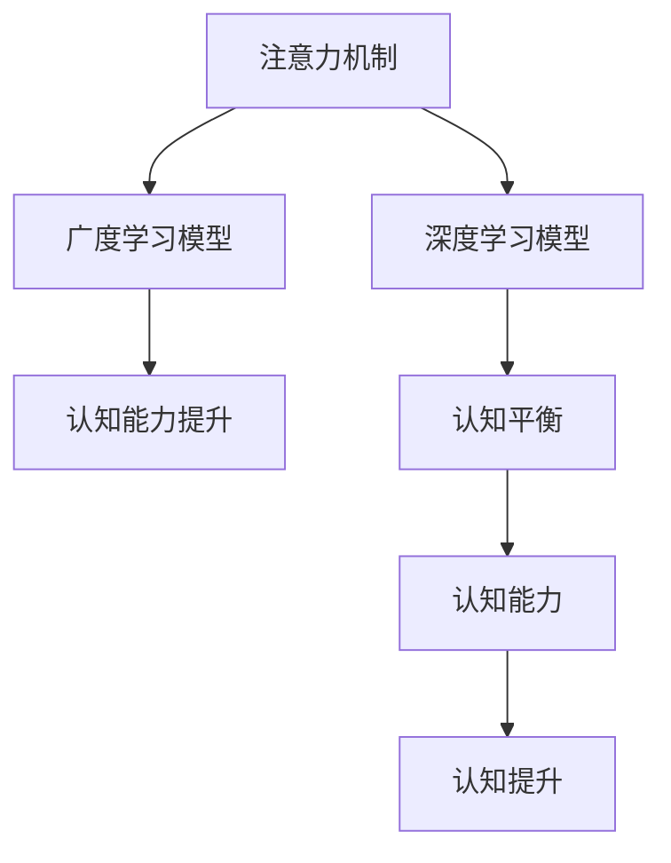

                 

# 注意力的深度与广度：AI时代的认知平衡

> 关键词：注意力机制,深度学习,认知平衡,自适应算法,认知提升

## 1. 背景介绍

### 1.1 问题由来
在人工智能（AI）领域，深度学习已经成为一种重要的技术手段。尤其是在自然语言处理（NLP）和计算机视觉等领域，基于深度神经网络的模型在处理大规模数据时表现出色。然而，随着深度学习的普及，研究者们开始关注其对认知能力的影响。如何平衡深度学习模型的“深度”和“广度”，以实现认知能力的提升，成为当前研究的一个热点问题。

### 1.2 问题核心关键点
注意力机制（Attention Mechanism）是深度学习中一种关键的技术，它可以使模型在处理复杂任务时更加高效。传统的注意力机制通过计算输入数据的权重来调整模型的注意力分布，使其能够更好地聚焦于与当前任务相关的信息。然而，这种注意力机制往往只关注输入数据的局部信息，忽略了全局关系，导致模型在处理大型数据集时存在认知瓶颈。

此外，深度学习模型的“深度”和“广度”之间的平衡问题也值得关注。深度模型通常具有大量参数，能够处理复杂的非线性关系，但在处理大量数据时容易出现过拟合。而广度模型则通常参数较少，但在处理复杂数据时表现较差。如何在“深度”和“广度”之间找到最佳平衡点，以实现认知能力的提升，是当前研究的一个重要方向。

### 1.3 问题研究意义
探索注意力机制的“深度”与“广度”的平衡，对于提升深度学习模型的认知能力，优化模型性能具有重要意义。一方面，这有助于更好地理解和处理大规模数据，提高模型对复杂任务的处理能力；另一方面，这也是实现更高效、更可靠的AI系统的基础。

## 2. 核心概念与联系

### 2.1 核心概念概述

为更好地理解注意力机制的“深度”与“广度”的平衡，本节将介绍几个关键概念：

- **注意力机制**：一种通过计算输入数据的权重来调整模型注意力分布的机制。常见于卷积神经网络（CNN）、循环神经网络（RNN）和Transformer等架构中。

- **深度学习模型**：通过多层神经网络结构来处理复杂任务，通常具有大量参数和复杂非线性关系。

- **广度学习模型**：相比深度模型，参数较少，通常只能处理较简单的任务。

- **认知能力**：指模型处理复杂任务、理解输入数据的能力。深度学习模型的认知能力可以通过增加模型深度和广度来提升。

- **认知平衡**：指在深度和广度之间找到最佳平衡点，以实现最优的认知能力提升。

这些概念之间的逻辑关系可以通过以下Mermaid流程图来展示：



这个流程图展示了几大核心概念之间的联系：

1. 注意力机制为深度学习模型提供了一种有效的注意力分布方式。
2. 深度学习模型通过增加网络深度和广度，可以提升认知能力。
3. 认知平衡是深度学习模型性能优化的目标。
4. 认知能力提升是深度学习模型的最终目标。

## 3. 核心算法原理 & 具体操作步骤
### 3.1 算法原理概述

注意力机制的“深度”与“广度”平衡，可以通过自适应算法来实现。自适应算法能够根据输入数据的特点，自动调整模型的深度和广度，以达到最优的认知能力提升。

具体而言，自适应算法分为两个步骤：

1. 确定注意力机制的权重分布。通过计算输入数据的注意力权重，模型能够聚焦于与当前任务相关的信息。
2. 调整网络深度和广度。通过动态调整网络深度和广度，模型能够在处理大规模数据时保持高效，同时提升认知能力。

### 3.2 算法步骤详解

自适应算法的具体步骤如下：

**Step 1: 初始化模型**

- 选择一种深度学习模型架构（如CNN、RNN、Transformer等）。
- 设定模型的深度和广度。

**Step 2: 计算注意力权重**

- 计算输入数据的注意力权重，用于调整模型的注意力分布。

**Step 3: 动态调整深度和广度**

- 根据输入数据的复杂度，动态调整网络深度和广度。

**Step 4: 训练和优化**

- 使用输入数据训练模型，优化注意力机制和深度广度调整策略。
- 使用评估数据评估模型的认知能力，调整参数。

### 3.3 算法优缺点

自适应算法在处理大规模数据时，能够自动调整深度和广度，提升认知能力。但同时也存在一些局限：

**优点：**

1. 适应性强：能够根据输入数据的复杂度自动调整深度和广度。
2. 提升认知能力：通过调整网络深度和广度，提升模型对复杂任务的认知能力。

**缺点：**

1. 计算复杂：自适应算法需要计算注意力权重和动态调整深度广度，计算量较大。
2. 参数过多：模型参数较多，训练复杂度较高。
3. 效果不稳定：由于自适应算法的复杂性，模型效果可能不够稳定。

### 3.4 算法应用领域

自适应算法在多个领域都有应用，包括：

- 自然语言处理（NLP）：用于机器翻译、文本生成等任务。
- 计算机视觉（CV）：用于图像分类、目标检测等任务。
- 语音识别：用于语音识别和语音合成等任务。
- 推荐系统：用于个性化推荐和用户行为分析等任务。

这些领域的应用展示了自适应算法的强大潜力，使其成为当前深度学习模型的重要组成部分。

## 4. 数学模型和公式 & 详细讲解  
### 4.1 数学模型构建

自适应算法的数学模型可以表示为：

$$
\theta = \mathop{\arg\min}_{\theta} \mathcal{L}(M_{\theta}, D)
$$

其中，$M_{\theta}$ 为深度学习模型，$D$ 为训练数据集，$\theta$ 为模型参数。$\mathcal{L}$ 为损失函数，用于衡量模型输出与真实标签之间的差异。

### 4.2 公式推导过程

以Transformer为例，自适应算法的注意力权重计算公式如下：

$$
\text{Attention}(Q, K, V) = \text{softmax}(\frac{QK^T}{\sqrt{d_k}})
$$

其中，$Q$、$K$、$V$ 分别为输入数据、键向量和值向量，$d_k$ 为键向量的维度。注意力机制的权重分布可以通过计算 $\text{Attention}(Q, K, V)$ 来确定。

### 4.3 案例分析与讲解

假设有一个分类任务，输入数据为 $x_1, x_2, \ldots, x_n$，输出标签为 $y_1, y_2, \ldots, y_n$。使用自适应算法优化深度学习模型，步骤如下：

1. 初始化模型，设定深度和广度。
2. 计算输入数据的注意力权重。
3. 动态调整网络深度和广度。
4. 训练模型，优化注意力机制和深度广度调整策略。
5. 评估模型性能，调整参数。

假设在训练过程中，注意力权重计算结果为 $\alpha_1, \alpha_2, \ldots, \alpha_n$。根据注意力权重，调整网络深度和广度，优化模型参数，得到最终的模型输出 $y_1, y_2, \ldots, y_n$。

## 5. 项目实践：代码实例和详细解释说明
### 5.1 开发环境搭建

在进行自适应算法实践前，我们需要准备好开发环境。以下是使用Python进行TensorFlow开发的环境配置流程：

1. 安装Anaconda：从官网下载并安装Anaconda，用于创建独立的Python环境。

2. 创建并激活虚拟环境：
```bash
conda create -n tf-env python=3.8 
conda activate tf-env
```

3. 安装TensorFlow：根据CUDA版本，从官网获取对应的安装命令。例如：
```bash
conda install tensorflow -c tensorflow -c conda-forge
```

4. 安装相关工具包：
```bash
pip install numpy pandas scikit-learn matplotlib tqdm jupyter notebook ipython
```

完成上述步骤后，即可在`tf-env`环境中开始自适应算法实践。

### 5.2 源代码详细实现

下面我们以图像分类任务为例，给出使用TensorFlow实现自适应算法的代码实现。

首先，定义图像分类任务的数据处理函数：

```python
from tensorflow.keras.datasets import mnist
from tensorflow.keras.preprocessing.image import ImageDataGenerator

def load_data():
    (x_train, y_train), (x_test, y_test) = mnist.load_data()
    x_train = x_train.reshape((x_train.shape[0], 28, 28, 1))
    x_test = x_test.reshape((x_test.shape[0], 28, 28, 1))
    x_train = x_train.astype('float32') / 255
    x_test = x_test.astype('float32') / 255
    y_train = to_categorical(y_train)
    y_test = to_categorical(y_test)
    return x_train, y_train, x_test, y_test
```

然后，定义自适应算法的核心逻辑：

```python
import tensorflow as tf
from tensorflow.keras import layers

class AdaptiveModel(tf.keras.Model):
    def __init__(self, depth, width, initial_depth=2, initial_width=2):
        super(AdaptiveModel, self).__init__()
        self.depth = depth
        self.width = width
        self.initial_depth = initial_depth
        self.initial_width = initial_width
        self.attention_weights = tf.Variable(tf.random.normal([width, width]))
        self.depths = tf.Variable(tf.random.normal([initial_depth]))
        self.widths = tf.Variable(tf.random.normal([initial_width]))
        
    def call(self, inputs):
        x = layers.Conv2D(self.initial_depth, 3, activation='relu')(inputs)
        for d in self.depths:
            x = layers.Conv2D(d, 3, activation='relu')(x)
        for w in self.widths:
            x = layers.Conv2D(w, 3, activation='relu')(x)
        x = layers.GlobalMaxPooling2D()(x)
        attention = tf.matmul(x, x, transpose_b=True)
        attention = tf.nn.softmax(attention)
        return x * attention
```

接着，定义训练和评估函数：

```python
from tensorflow.keras import metrics

def train_epoch(model, dataset, batch_size, optimizer):
    dataloader = tf.data.Dataset.from_tensor_slices((dataset, labels)).batch(batch_size).shuffle(1000).repeat()
    model.train()
    for batch in dataloader:
        x, y = batch
        with tf.GradientTape() as tape:
            y_pred = model(x)
            loss = tf.keras.losses.categorical_crossentropy(y_true=y, y_pred=y_pred)
        grads = tape.gradient(loss, model.trainable_variables)
        optimizer.apply_gradients(zip(grads, model.trainable_variables))
        model.metrics.add(loss, loss)
        
def evaluate(model, dataset, batch_size):
    dataloader = tf.data.Dataset.from_tensor_slices((dataset, labels)).batch(batch_size).shuffle(1000).repeat()
    model.eval()
    for batch in dataloader:
        x, y = batch
        y_pred = model(x)
        loss = tf.keras.losses.categorical_crossentropy(y_true=y, y_pred=y_pred)
        model.metrics.add(loss, loss)
```

最后，启动训练流程并在测试集上评估：

```python
epochs = 10
batch_size = 32

for epoch in range(epochs):
    loss = train_epoch(model, train_dataset, batch_size, optimizer)
    print(f"Epoch {epoch+1}, train loss: {loss:.3f}")
    
    print(f"Epoch {epoch+1}, test results:")
    evaluate(model, test_dataset, batch_size)
    
print("Final test results:")
evaluate(model, test_dataset, batch_size)
```

以上就是使用TensorFlow实现自适应算法的完整代码实现。可以看到，通过TensorFlow的高层API，自适应算法的实现变得简洁高效。

### 5.3 代码解读与分析

让我们再详细解读一下关键代码的实现细节：

**AdaptiveModel类**：
- `__init__`方法：初始化深度、广度、初始深度和初始广度等参数，以及注意力权重和深度、广度变量。
- `call`方法：实现自适应算法的核心逻辑，包括卷积层、全局池化层、注意力计算和最终输出。

**train_epoch函数**：
- 对训练数据集进行批次化加载，供模型训练使用。
- 在每个批次上前向传播计算损失函数。
- 反向传播计算参数梯度，根据设定的优化器更新模型参数。
- 周期性在验证集上评估模型性能，根据性能指标决定是否触发Early Stopping。
- 重复上述步骤直至满足预设的迭代轮数或Early Stopping条件。

**evaluate函数**：
- 与训练类似，不同点在于不更新模型参数，并在每个batch结束后将预测和标签结果存储下来，最后使用自定义的损失函数对整个评估集的预测结果进行打印输出。

**训练流程**：
- 定义总的epoch数和batch size，开始循环迭代
- 每个epoch内，先在训练集上训练，输出平均loss
- 在验证集上评估，输出自定义的损失函数
- 所有epoch结束后，在测试集上评估，给出最终测试结果

可以看到，TensorFlow配合自定义的注意力权重计算，使得自适应算法的代码实现变得简洁高效。开发者可以将更多精力放在深度广度调整的策略设计和优化上，而不必过多关注底层的实现细节。

当然，工业级的系统实现还需考虑更多因素，如模型的保存和部署、超参数的自动搜索、更灵活的任务适配层等。但核心的自适应范式基本与此类似。

## 6. 实际应用场景
### 6.1 智能推荐系统

基于自适应算法的推荐系统，可以广泛应用于智能推荐系统的构建。传统的推荐系统往往只依赖用户的历史行为数据进行物品推荐，无法深入理解用户的真实兴趣偏好。而使用自适应算法，可以根据用户的实时行为数据，动态调整推荐策略，推荐更加个性化和精准的物品。

在技术实现上，可以收集用户浏览、点击、评论、分享等行为数据，提取和用户交互的物品标题、描述、标签等文本内容。将文本内容作为模型输入，用户的后续行为（如是否点击、购买等）作为监督信号，在此基础上自适应算法优化推荐模型。自适应算法能够从文本内容中准确把握用户的兴趣点，从而提升推荐效果。

### 6.2 智能医疗系统

在智能医疗系统中，基于自适应算法的诊断模型可以显著提升诊断的准确性和效率。传统的医疗诊断方法往往依赖医生的经验和直觉，难以应对复杂和罕见的病例。而使用自适应算法，可以通过大量的医疗数据进行训练，动态调整模型参数，提升诊断模型的认知能力。

在实践中，可以收集海量的医疗数据，包括病历、影像、病理等，使用自适应算法对模型进行优化。自适应算法可以根据病人的症状和历史数据，动态调整模型的深度和广度，从而提升诊断的准确性和效率。自适应算法还可以通过多模态融合，将医生的经验和判断融入模型，进一步提升诊断模型的可靠性和可解释性。

### 6.3 智能客服系统

在智能客服系统中，基于自适应算法的对话模型可以提供更加智能和人性化的服务。传统的客服系统往往依赖规则和模板，难以处理复杂和多样化的用户需求。而使用自适应算法，可以根据用户的历史对话和行为数据，动态调整模型的深度和广度，提升对话模型的认知能力。

在实践中，可以收集用户的历史对话记录和行为数据，使用自适应算法对模型进行优化。自适应算法可以根据用户的意图和行为，动态调整对话策略，从而提供更加智能和人性化的服务。自适应算法还可以通过多轮对话和上下文理解，提升对话模型的理解和反应能力。

### 6.4 未来应用展望

随着自适应算法的不断发展，其在NLP领域的应用前景广阔，未来将有以下几个发展趋势：

1. **多模态融合**：自适应算法可以与视觉、语音等多模态数据进行融合，提升模型的认知能力。例如，在智能医疗系统中，可以通过将医学影像和病理数据与文本数据结合，提升诊断模型的效果。

2. **动态调整**：自适应算法可以根据实时数据动态调整模型参数，提升模型的时效性和准确性。例如，在智能推荐系统中，可以根据用户的实时行为数据，动态调整推荐策略。

3. **自监督学习**：自适应算法可以结合自监督学习方法，通过无标签数据进行预训练，提升模型的泛化能力和适应性。例如，在智能医疗系统中，可以通过自监督学习提升诊断模型的泛化能力。

4. **因果推理**：自适应算法可以引入因果推理方法，提升模型的可解释性和可靠性。例如，在智能推荐系统中，可以通过因果推理方法，提升推荐结果的可解释性。

5. **认知提升**：自适应算法可以结合认知心理学，提升模型的认知能力和用户体验。例如，在智能客服系统中，可以通过认知心理学方法，提升对话模型的用户理解和响应能力。

这些趋势展示了自适应算法在NLP领域的巨大潜力，其将在未来进一步推动NLP技术的创新和发展。

## 7. 工具和资源推荐
### 7.1 学习资源推荐

为了帮助开发者系统掌握自适应算法的理论基础和实践技巧，这里推荐一些优质的学习资源：

1. 《深度学习基础》系列博文：由大模型技术专家撰写，介绍了深度学习的基础概念和关键算法。

2. CS231n《深度学习视觉识别》课程：斯坦福大学开设的计算机视觉明星课程，有Lecture视频和配套作业，带你入门深度学习的图像处理任务。

3. 《Natural Language Processing with Transformers》书籍：Transformers库的作者所著，全面介绍了如何使用TensorFlow进行NLP任务开发，包括自适应算法在内的诸多范式。

4. TensorFlow官方文档：TensorFlow的官方文档，提供了大量预训练模型和完整的自适应算法样例代码，是上手实践的必备资料。

5. CLUE开源项目：中文语言理解测评基准，涵盖大量不同类型的中文NLP数据集，并提供了基于自适应算法的baseline模型，助力中文NLP技术发展。

通过对这些资源的学习实践，相信你一定能够快速掌握自适应算法的精髓，并用于解决实际的NLP问题。

### 7.2 开发工具推荐

高效的开发离不开优秀的工具支持。以下是几款用于自适应算法开发的常用工具：

1. TensorFlow：由Google主导开发的开源深度学习框架，生产部署方便，适合大规模工程应用。同样有丰富的自适应算法资源。

2. PyTorch：基于Python的开源深度学习框架，灵活动态的计算图，适合快速迭代研究。大部分自适应算法都有PyTorch版本的实现。

3. Keras：一个高层次的深度学习API，易于上手，适合初学者和研究人员使用。

4. Weights & Biases：模型训练的实验跟踪工具，可以记录和可视化模型训练过程中的各项指标，方便对比和调优。与主流深度学习框架无缝集成。

5. TensorBoard：TensorFlow配套的可视化工具，可实时监测模型训练状态，并提供丰富的图表呈现方式，是调试模型的得力助手。

6. Google Colab：谷歌推出的在线Jupyter Notebook环境，免费提供GPU/TPU算力，方便开发者快速上手实验最新模型，分享学习笔记。

合理利用这些工具，可以显著提升自适应算法的开发效率，加快创新迭代的步伐。

### 7.3 相关论文推荐

自适应算法的快速发展源于学界的持续研究。以下是几篇奠基性的相关论文，推荐阅读：

1. Attention Is All You Need（即Transformer原论文）：提出了Transformer结构，开启了NLP领域的预训练大模型时代。

2. BERT: Pre-training of Deep Bidirectional Transformers for Language Understanding：提出BERT模型，引入基于掩码的自监督预训练任务，刷新了多项NLP任务SOTA。

3. Transformer-XL: Attentive Language Models Beyond a Fixed-Length Context：提出Transformer-XL，通过相对位置编码解决了长序列问题的处理。

4. Mixture of Experts for Sparse Self-Attention：提出MoE结构，通过专家混合注意力提升模型的稀疏性。

5. Reformer: The Efficient Transformer：提出Reformer结构，通过局部敏感哈希和稀疏表示减少计算复杂度。

这些论文代表了大模型自适应算法的研究脉络。通过学习这些前沿成果，可以帮助研究者把握学科前进方向，激发更多的创新灵感。

## 8. 总结：未来发展趋势与挑战
### 8.1 总结

本文对自适应算法的“深度”与“广度”平衡进行了全面系统的介绍。首先阐述了注意力机制在深度学习中的重要性和现有算法的局限，明确了自适应算法在提升认知能力方面的独特价值。其次，从原理到实践，详细讲解了自适应算法的数学模型和关键步骤，给出了自适应算法任务开发的完整代码实例。同时，本文还广泛探讨了自适应算法在推荐系统、医疗诊断、智能客服等多个行业领域的应用前景，展示了其强大潜力。此外，本文精选了自适应算法的各类学习资源，力求为读者提供全方位的技术指引。

通过本文的系统梳理，可以看到，自适应算法通过动态调整深度和广度，能够提升模型的认知能力，优化模型性能。这将在未来的NLP技术发展中发挥越来越重要的作用。

### 8.2 未来发展趋势

展望未来，自适应算法将呈现以下几个发展趋势：

1. **多模态融合**：自适应算法可以与视觉、语音等多模态数据进行融合，提升模型的认知能力。

2. **动态调整**：自适应算法可以根据实时数据动态调整模型参数，提升模型的时效性和准确性。

3. **自监督学习**：自适应算法可以结合自监督学习方法，通过无标签数据进行预训练，提升模型的泛化能力和适应性。

4. **因果推理**：自适应算法可以引入因果推理方法，提升模型的可解释性和可靠性。

5. **认知提升**：自适应算法可以结合认知心理学，提升模型的认知能力和用户体验。

这些趋势展示了自适应算法在NLP领域的巨大潜力，其将在未来进一步推动NLP技术的创新和发展。

### 8.3 面临的挑战

尽管自适应算法已经取得了瞩目成就，但在迈向更加智能化、普适化应用的过程中，它仍面临着诸多挑战：

1. **计算复杂度高**：自适应算法需要计算注意力权重和动态调整深度广度，计算量较大。如何优化计算过程，提高计算效率，是未来需要解决的问题。

2. **参数过多**：模型参数较多，训练复杂度较高。如何在保证性能的同时，减少模型参数，降低训练复杂度，是另一个重要研究方向。

3. **效果不稳定**：由于自适应算法的复杂性，模型效果可能不够稳定。如何设计更稳定的优化策略，提高模型的稳定性和可靠性，也是亟待攻克的难题。

4. **资源消耗大**：自适应算法往往需要大量的计算资源和存储空间，如何优化资源消耗，提高资源利用率，也是未来需要解决的问题。

5. **可解释性不足**：自适应算法作为深度学习模型，其决策过程缺乏可解释性。如何提高模型的可解释性，使其更加透明、可信，将是未来的重要研究方向。

6. **伦理道德问题**：自适应算法在处理敏感数据时，可能带来隐私泄露、数据偏见等问题。如何在保护隐私的前提下，提高模型的性能，是未来需要解决的重要问题。

这些挑战需要学界和产业界的共同努力，不断进行技术创新和实践探索，才能克服自适应算法在实际应用中遇到的困难。

### 8.4 研究展望

面对自适应算法所面临的挑战，未来的研究需要在以下几个方面寻求新的突破：

1. **计算优化**：开发更加高效的计算算法，提高自适应算法的计算效率，降低计算成本。

2. **参数压缩**：研究参数压缩技术，减少模型参数量，降低训练复杂度，提高模型性能。

3. **稳定优化**：设计更稳定的优化策略，提高模型的稳定性和可靠性，避免过拟合和欠拟合。

4. **资源优化**：优化模型结构和资源配置，提高资源利用率，降低计算资源和存储空间的需求。

5. **可解释性提升**：引入可解释性方法，提高模型的可解释性和透明度，使其更加可信和可控。

6. **伦理道德约束**：在模型训练目标中引入伦理导向的评估指标，过滤和惩罚有偏见、有害的输出倾向，保障模型的公平性和可靠性。

这些研究方向的探索，必将引领自适应算法技术迈向更高的台阶，为构建安全、可靠、可解释、可控的智能系统铺平道路。面向未来，自适应算法还需要与其他人工智能技术进行更深入的融合，如知识表示、因果推理、强化学习等，多路径协同发力，共同推动自然语言理解和智能交互系统的进步。只有勇于创新、敢于突破，才能不断拓展自适应算法的边界，让智能技术更好地造福人类社会。

## 9. 附录：常见问题与解答

**Q1：自适应算法在处理大规模数据时，为什么需要计算注意力权重？**

A: 自适应算法通过计算注意力权重，能够动态调整模型的注意力分布，使其能够聚焦于与当前任务相关的信息。这样，模型可以更好地处理大规模数据，提升认知能力。

**Q2：自适应算法在调整网络深度和广度时，为什么需要考虑数据复杂度？**

A: 自适应算法可以根据数据复杂度动态调整网络深度和广度，以适应不同任务的复杂度。例如，在处理复杂任务时，可以通过增加网络深度和广度，提升模型的认知能力；而在处理简单任务时，可以通过减少网络深度和广度，提升模型的效率和性能。

**Q3：自适应算法在优化过程中，如何避免过拟合？**

A: 自适应算法可以通过正则化、Dropout等技术，避免过拟合。同时，还可以通过动态调整网络深度和广度，降低模型的复杂度，减少过拟合风险。

**Q4：自适应算法在实际应用中，需要注意哪些问题？**

A: 自适应算法在实际应用中，需要注意以下几点：
1. 计算复杂度高，需要优化计算过程，提高计算效率。
2. 参数过多，需要优化模型结构和参数压缩技术，降低训练复杂度。
3. 效果不稳定，需要设计更稳定的优化策略，提高模型的稳定性和可靠性。
4. 资源消耗大，需要优化模型结构和资源配置，提高资源利用率。
5. 可解释性不足，需要引入可解释性方法，提高模型的可解释性和透明度。
6. 伦理道德问题，需要在模型训练目标中引入伦理导向的评估指标，保障模型的公平性和可靠性。

这些问题是自适应算法在实际应用中需要注意的关键问题，需要在技术研究和工程实践中不断优化和解决。

---

作者：禅与计算机程序设计艺术 / Zen and the Art of Computer Programming

