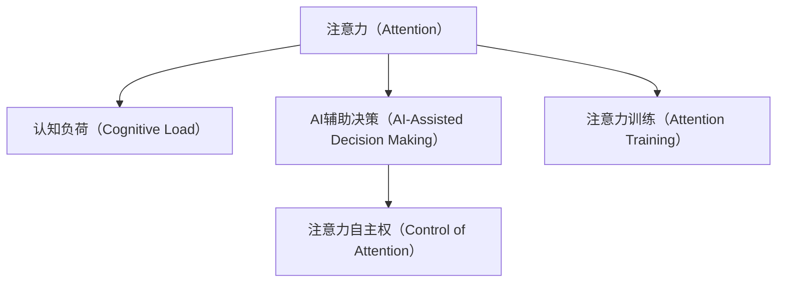

                 

# 注意力的自主权：AI时代的个人选择

在AI飞速发展的今天，我们似乎已经适应了机器接管日常生活的各个方面。从搜索信息到安排日程，从自动驾驶到智能家居，AI已经在无形中成为了我们生活中不可或缺的一部分。但在这个过程中，我们逐渐丧失了对自己注意力的控制。这篇文章将探讨AI对注意力的影响，以及我们如何重新获得对注意力的自主权。

## 1. 背景介绍

### 1.1 问题由来

在互联网时代，信息的爆炸和社交媒体的普及，使得我们的注意力变得比以往任何时候都更加分散和碎片化。随之而来的，是人们注意力的迅速下降和决策能力的减弱。AI技术的兴起，虽然在许多方面提高了我们的生活质量，但同时也带来了新的挑战：如何在使用AI技术的过程中，维持和增强自己的注意力和决策力？

### 1.2 问题核心关键点

AI对注意力的影响主要体现在以下几个方面：

1. **信息过载**：AI在自动化信息获取和处理方面提供了极大便利，但同时也导致了信息的过载，使我们难以集中注意力处理重要任务。
2. **社交媒体成瘾**：社交媒体平台通过AI算法推荐个性化的内容，使我们不自觉地陷入无限滚动的信息流中，难以自拔。
3. **决策能力弱化**：AI的决策支持系统虽然在提供数据支持方面表现出色，但过度依赖可能削弱人类的决策能力和判断力。

### 1.3 问题研究意义

在AI技术日益渗透的今天，我们不仅需要关注其带来的效率提升和便利，更应该重视其对个人注意力的潜在影响。重新掌握注意力自主权，不仅有助于我们更好地应对未来的挑战，也是实现人机协作，让人类与AI共存共荣的重要前提。

## 2. 核心概念与联系

### 2.1 核心概念概述

为了更好地理解AI对注意力的影响以及我们如何重新获得注意力的自主权，本节将介绍几个核心概念：

- **注意力（Attention）**：在AI模型中，注意力是一种机制，用于分配计算资源，选择性地关注输入数据中的某些部分，从而提高模型效率和性能。
- **认知负荷（Cognitive Load）**：指个体在信息处理过程中需要投入的认知资源，过多的认知负荷会导致注意力分散和决策力减弱。
- **AI辅助决策（AI-Assisted Decision Making）**：指利用AI技术辅助人类进行决策，包括数据分析、模拟预测和推荐系统等。
- **注意力自主权（Control of Attention）**：指个体对自己注意力的掌控能力，包括筛选信息、管理时间和自主决策等方面。
- **注意力训练（Attention Training）**：通过特定训练方法，提升个体对注意力的自主控制能力，如冥想、深度学习等。

这些核心概念之间存在紧密的联系，AI通过注意力机制改变信息处理方式，进而影响认知负荷和决策能力，最终导致注意力的变化。因此，探讨AI对注意力的影响，需要从注意力机制本身入手，同时考虑认知负荷和决策力的变化。

### 2.2 核心概念原理和架构的 Mermaid 流程图



这个流程图展示了注意力机制在AI应用中的作用，以及它如何通过影响认知负荷和辅助决策，最终影响注意力的自主权。注意力训练则是提升个体注意力自主权的重要手段。

## 3. 核心算法原理 & 具体操作步骤

### 3.1 算法原理概述

AI模型中的注意力机制通常基于自注意力（Self-Attention）和跨注意力（Cross-Attention）两种方式。自注意力机制通过计算输入数据中不同部分之间的相似度，选择性地关注那些与当前任务最为相关的部分；而跨注意力机制则允许模型在输入和输出之间进行信息交换，从而更好地理解上下文信息。

在AI辅助决策过程中，注意力机制被广泛应用于推荐系统、文本生成、图像识别等领域。通过选择合适的注意力权重，AI可以更高效地处理信息，提升决策的准确性和效率。

### 3.2 算法步骤详解

#### 3.2.1 自注意力机制

1. **输入表示**：将输入数据转化为向量表示，包括单词的嵌入（Word Embedding）和句子表示（Sentence Representation）。
2. **计算相似度**：通过矩阵乘法和点积运算，计算输入向量之间的相似度。
3. **注意力权重**：根据相似度计算注意力权重，权重越大表示该部分信息对当前任务越重要。
4. **加权求和**：将输入向量与注意力权重相乘后进行加权求和，得到当前任务的表示向量。
5. **输出表示**：将表示向量进行线性变换和激活函数处理，得到最终输出。

#### 3.2.2 跨注意力机制

1. **输入表示**：将输入数据和上下文信息都转化为向量表示。
2. **计算相似度**：通过矩阵乘法和点积运算，计算输入向量与上下文向量之间的相似度。
3. **注意力权重**：根据相似度计算注意力权重，权重越大表示该部分信息对当前任务越重要。
4. **信息交换**：将输入向量和上下文向量与注意力权重相乘后进行加权求和，得到新的表示向量。
5. **输出表示**：将表示向量进行线性变换和激活函数处理，得到最终输出。

### 3.3 算法优缺点

#### 3.3.1 优点

1. **高效信息处理**：注意力机制可以动态地选择和关注输入数据的关键部分，减少计算资源的浪费，提升信息处理的效率。
2. **增强上下文理解**：跨注意力机制可以整合上下文信息，提升模型的语境理解和推理能力。
3. **提升决策效果**：通过选择合适的注意力权重，AI可以更精准地辅助人类进行决策。

#### 3.3.2 缺点

1. **模型复杂度高**：自注意力和跨注意力机制的计算复杂度较高，需要大量的计算资源和存储空间。
2. **过度依赖数据**：注意力机制的效果很大程度上依赖于输入数据的质量和数量，对于低质量的数据可能会产生误导。
3. **难以解释**：注意力权重的选择和计算过程较为复杂，难以解释和调试，影响了AI的透明度和可解释性。

### 3.4 算法应用领域

注意力机制在AI技术中的应用领域非常广泛，涵盖多个行业和场景：

1. **自然语言处理（NLP）**：在文本生成、机器翻译、情感分析等任务中，注意力机制可以更好地理解语义和上下文信息，提升模型效果。
2. **计算机视觉（CV）**：在图像识别、目标检测、图像生成等任务中，注意力机制可以更好地关注感兴趣区域，提升模型鲁棒性。
3. **推荐系统**：在电商、社交媒体等领域，注意力机制可以更好地理解用户兴趣和行为，提升推荐效果。
4. **自动驾驶**：在自动驾驶中，注意力机制可以更好地感知道路环境和交通情况，提升驾驶安全性。
5. **医疗诊断**：在医学影像分析中，注意力机制可以更好地关注病变区域，提升诊断准确性。

## 4. 数学模型和公式 & 详细讲解 & 举例说明

### 4.1 数学模型构建

在AI模型中，注意力机制通常基于矩阵运算和向量运算进行计算。以自注意力机制为例，其数学模型可以表示为：

$$
Q = W_Q X, K = W_K X, V = W_V X
$$

其中 $X$ 为输入向量，$W_Q$、$W_K$、$W_V$ 为注意力机制的线性变换矩阵。通过矩阵乘法和点积运算，计算相似度：

$$
E = QK^T, Attention_{ij} = \frac{\exp(E_{ij})}{\sum_j \exp(E_{ij})}
$$

得到注意力权重后，进行加权求和：

$$
Output = \sum_{i} Attention_{ij} V_i
$$

### 4.2 公式推导过程

#### 4.2.1 自注意力机制

1. **输入表示**：
   $$
   X \in \mathbb{R}^{n \times d}, Q = W_Q X, K = W_K X, V = W_V X
   $$
2. **计算相似度**：
   $$
   E = QK^T \in \mathbb{R}^{n \times n}
   $$
3. **注意力权重**：
   $$
   Attention_{ij} = \frac{\exp(E_{ij})}{\sum_j \exp(E_{ij})}
   $$
4. **加权求和**：
   $$
   Output = \sum_{i} Attention_{ij} V_i
   $$

#### 4.2.2 跨注意力机制

1. **输入表示**：
   $$
   X \in \mathbb{R}^{n \times d}, Context \in \mathbb{R}^{m \times d}, Q = W_Q X, K = W_K X, V = W_V X
   $$
2. **计算相似度**：
   $$
   E = QK^T \in \mathbb{R}^{n \times m}
   $$
3. **注意力权重**：
   $$
   Attention_{ij} = \frac{\exp(E_{ij})}{\sum_j \exp(E_{ij})}
   $$
4. **信息交换**：
   $$
   Output = \sum_{j} Attention_{ij} V_j + \sum_{i} Attention_{ij} Context_j
   $$

### 4.3 案例分析与讲解

以机器翻译为例，自注意力机制可以用于编码器-解码器架构中，提升翻译效果。在编码器中，每个单词的表示向量与所有其他单词的表示向量进行相似度计算，选择与当前单词最相关的部分进行加权求和，得到编码器的最终表示向量。在解码器中，编码器的表示向量与上下文向量进行跨注意力计算，得到解码器的最终表示向量，并用于生成目标语言的单词。

## 5. 项目实践：代码实例和详细解释说明

### 5.1 开发环境搭建

为了实现AI模型的注意力机制，我们需要使用Python和深度学习框架，如TensorFlow或PyTorch。以下是搭建开发环境的步骤：

1. 安装Anaconda：从官网下载并安装Anaconda，用于创建独立的Python环境。
2. 创建并激活虚拟环境：
   ```bash
   conda create -n ai-env python=3.8 
   conda activate ai-env
   ```
3. 安装TensorFlow或PyTorch：
   ```bash
   pip install tensorflow==2.0.0 
   pip install torch torchvision torchaudio
   ```
4. 安装各类工具包：
   ```bash
   pip install numpy pandas scikit-learn matplotlib tqdm jupyter notebook ipython
   ```

完成上述步骤后，即可在`ai-env`环境中开始AI模型的开发。

### 5.2 源代码详细实现

以下是一个使用PyTorch实现自注意力机制的代码示例：

```python
import torch
import torch.nn as nn

class SelfAttention(nn.Module):
    def __init__(self, d_model, n_heads):
        super(SelfAttention, self).__init__()
        self.d_model = d_model
        self.n_heads = n_heads
        self.depth = d_model // n_heads
        
        self.wq = nn.Linear(d_model, d_model)
        self.wk = nn.Linear(d_model, d_model)
        self.wv = nn.Linear(d_model, d_model)
        self.wo = nn.Linear(d_model, d_model)
        
        self.dropout = nn.Dropout(0.1)
        
    def forward(self, x):
        batch_size = x.size(0)
        seq_len = x.size(1)
        
        # 线性变换
        Q = self.wq(x).view(batch_size, seq_len, self.n_heads, self.depth).permute(0, 2, 1, 3)
        K = self.wk(x).view(batch_size, seq_len, self.n_heads, self.depth).permute(0, 2, 1, 3)
        V = self.wv(x).view(batch_size, seq_len, self.n_heads, self.depth).permute(0, 2, 1, 3)
        
        # 计算相似度
        scores = torch.matmul(Q, K.permute(0, 1, 3, 2)) / torch.sqrt(torch.tensor(self.depth))
        
        # 计算注意力权重
        attention_weights = nn.functional.softmax(scores, dim=-1)
        
        # 加权求和
        context = torch.matmul(attention_weights, V).permute(0, 2, 1, 3).contiguous().view(batch_size, seq_len, self.d_model)
        
        # 输出表示
        x = self.wo(context) + x
        return self.dropout(x)
```

### 5.3 代码解读与分析

**SelfAttention类**：
- `__init__`方法：初始化线性变换矩阵和注意力层参数。
- `forward`方法：计算自注意力机制的输出。

**计算过程**：
- `Q`、`K`、`V`的计算：将输入向量`x`进行线性变换，得到查询向量`Q`、键向量`K`、值向量`V`。
- `scores`的计算：计算查询向量`Q`和键向量`K`的点积，得到相似度矩阵`scores`。
- `attention_weights`的计算：对相似度矩阵`scores`进行softmax操作，得到注意力权重。
- `context`的计算：将注意力权重和值向量`V`进行加权求和，得到上下文表示向量`context`。
- `x`的计算：将上下文表示向量`context`与输出线性变换矩阵`wo`进行加权求和，并加入原始输入向量`x`，得到最终的输出向量。

## 6. 实际应用场景

### 6.1 智能推荐系统

智能推荐系统是注意力机制的重要应用场景之一。通过计算用户和物品之间的相似度，推荐系统可以更准确地预测用户对物品的兴趣，提升推荐效果。在推荐系统中，自注意力机制可以用于处理用户的兴趣和行为数据，提升推荐系统的个性化和多样性。

### 6.2 语音识别

在语音识别中，注意力机制可以用于处理不同时间步的语音信号，提升模型的鲁棒性和准确性。通过计算语音信号中不同时间步的相似度，模型可以更好地理解语义和上下文信息，提升识别效果。

### 6.3 图像生成

在图像生成中，注意力机制可以用于控制生成过程的关注点，提升生成图像的质量和多样性。通过计算图像中不同区域的相似度，模型可以更好地关注生成图像的关键部分，避免不必要的细节干扰。

### 6.4 未来应用展望

随着AI技术的不断发展，注意力机制在更多领域得到了应用，推动了技术进步和产业升级。未来，注意力机制将在以下几个方面发挥更大作用：

1. **多模态学习**：将视觉、语音、文本等多种模态的信息融合，提升模型的感知能力和决策力。
2. **跨领域应用**：将注意力机制应用于更多领域，如医疗、金融、教育等，推动行业智能化转型。
3. **个性化推荐**：通过计算用户与物品之间的相似度，提供更加个性化和精准的推荐服务。
4. **自然语言处理**：在自然语言处理中，注意力机制可以更好地理解语义和上下文信息，提升模型的理解力和生成力。
5. **智能决策支持**：通过跨注意力机制，辅助人类进行更科学、更精准的决策。

## 7. 工具和资源推荐

### 7.1 学习资源推荐

为了帮助开发者系统掌握注意力机制的理论基础和实践技巧，这里推荐一些优质的学习资源：

1. 《深度学习》（Deep Learning）课程：由斯坦福大学开设的深度学习课程，涵盖注意力机制的基本概念和经典模型。
2. 《Attention is All You Need》论文：Transformer模型的原论文，详细介绍了自注意力机制的原理和应用。
3. 《Attention Mechanism in Natural Language Processing》博文：由大模型技术专家撰写，介绍了注意力机制在自然语言处理中的应用。
4. 《TensorFlow 2.0》书籍：TensorFlow 2.0的官方文档，详细介绍了注意力机制在TensorFlow中的实现。
5. 《Attention Mechanism: Theory and Practice》书籍：详细介绍了注意力机制的理论基础和实际应用。

通过对这些资源的学习实践，相信你一定能够快速掌握注意力机制的精髓，并用于解决实际的AI问题。

### 7.2 开发工具推荐

高效的开发离不开优秀的工具支持。以下是几款用于注意力机制开发的常用工具：

1. PyTorch：基于Python的开源深度学习框架，灵活动态的计算图，适合快速迭代研究。
2. TensorFlow：由Google主导开发的开源深度学习框架，生产部署方便，适合大规模工程应用。
3. TensorBoard：TensorFlow配套的可视化工具，可实时监测模型训练状态，并提供丰富的图表呈现方式。
4. Weights & Biases：模型训练的实验跟踪工具，可以记录和可视化模型训练过程中的各项指标。
5. PyTorch Lightning：轻量级的PyTorch库，提供快速原型设计和实验开发的框架。

合理利用这些工具，可以显著提升注意力机制的开发效率，加快创新迭代的步伐。

### 7.3 相关论文推荐

注意力机制在AI技术中的应用源于学界的持续研究。以下是几篇奠基性的相关论文，推荐阅读：

1. Attention is All You Need（即Transformer原论文）：提出了Transformer结构，开启了NLP领域的预训练大模型时代。
2. Multi-Head Attention: All you Need for Machine Translation（论文）：详细介绍了多头注意力机制在机器翻译中的应用。
3. Transformer-XL: Attentive Language Models Beyond a Fixed-Length Context（论文）：提出了Transformer-XL模型，可以处理变长上下文信息。
4. ALBERT: A Lite BERT for Self-supervised Learning of Language Representations（论文）：提出了ALBERT模型，大幅提升了模型训练效率和效果。
5. T5: Explainability for Attention-based Models and Masked Language Model Fine-tuning（论文）：提出了T5模型，在文本生成和推理任务中表现出色。

这些论文代表了大语言模型中的注意力机制的发展脉络。通过学习这些前沿成果，可以帮助研究者把握学科前进方向，激发更多的创新灵感。

## 8. 总结：未来发展趋势与挑战

### 8.1 总结

本文对AI模型中的注意力机制进行了全面系统的介绍。首先阐述了注意力机制在AI技术中的重要作用，明确了其在提升模型效率、理解能力和决策力方面的独特价值。其次，从原理到实践，详细讲解了注意力机制的计算过程和应用场景，给出了实现注意力机制的完整代码实例。最后，本文还探讨了注意力机制在多个实际应用场景中的潜力，展示了其广阔的发展前景。

通过本文的系统梳理，可以看到，注意力机制在AI技术中的应用日益广泛，极大地提升了信息处理的效率和效果，为AI系统的智能化和自动化提供了有力保障。未来，伴随AI技术的不断演进，注意力机制也将进一步提升模型的性能和能力，成为推动AI技术发展的关键技术。

### 8.2 未来发展趋势

展望未来，注意力机制将呈现以下几个发展趋势：

1. **多模态学习**：将视觉、语音、文本等多种模态的信息融合，提升模型的感知能力和决策力。
2. **跨领域应用**：将注意力机制应用于更多领域，如医疗、金融、教育等，推动行业智能化转型。
3. **个性化推荐**：通过计算用户与物品之间的相似度，提供更加个性化和精准的推荐服务。
4. **自然语言处理**：在自然语言处理中，注意力机制可以更好地理解语义和上下文信息，提升模型的理解力和生成力。
5. **智能决策支持**：通过跨注意力机制，辅助人类进行更科学、更精准的决策。

### 8.3 面临的挑战

尽管注意力机制在AI技术中表现出色，但在实现其全面应用的过程中，仍面临诸多挑战：

1. **模型复杂度高**：注意力机制的计算复杂度较高，需要大量的计算资源和存储空间。
2. **过度依赖数据**：注意力机制的效果很大程度上依赖于输入数据的质量和数量，对于低质量的数据可能会产生误导。
3. **难以解释**：注意力权重的选择和计算过程较为复杂，难以解释和调试，影响了AI的透明度和可解释性。
4. **跨领域适应性不足**：注意力机制在特定领域的泛化能力有待提高，需要针对具体应用进行优化。
5. **计算资源限制**：大规模注意力模型的训练和推理需要高性能计算资源，如何降低计算复杂度，优化资源利用，是一个重要研究方向。

### 8.4 研究展望

面对注意力机制面临的挑战，未来的研究需要在以下几个方面寻求新的突破：

1. **提高计算效率**：开发更高效的计算方法，如注意力剪枝、分布式训练等，降低计算复杂度。
2. **增强模型解释性**：引入可解释性方法，如特征重要性分析、注意力可视化等，提升模型的透明性和可解释性。
3. **提升跨领域适应性**：通过迁移学习、领域自适应等方法，提高注意力机制在跨领域应用中的泛化能力。
4. **多模态融合**：将视觉、语音、文本等多种模态的信息融合，提升模型的感知能力和决策力。
5. **模型压缩**：通过模型压缩技术，如量化、剪枝等，降低模型的计算复杂度和存储空间。

这些研究方向的探索，必将引领注意力机制走向更高的台阶，为构建更加智能、可靠、可解释的AI系统铺平道路。面向未来，注意力机制需要与其他AI技术进行更深入的融合，共同推动自然语言理解和智能交互系统的进步。只有勇于创新、敢于突破，才能不断拓展注意力机制的边界，让人工智能更好地造福人类社会。

## 9. 附录：常见问题与解答

**Q1: 注意力机制在推荐系统中的应用具体体现在哪些方面？**

A: 注意力机制在推荐系统中的应用主要体现在以下几个方面：
1. **用户-物品相似度计算**：通过计算用户和物品之间的相似度，推荐系统可以更准确地预测用户对物品的兴趣。
2. **特征加权**：将用户和物品的特征向量进行权重分配，提升特征的贡献度。
3. **序列建模**：在序列推荐任务中，可以动态地关注序列中的不同物品，提升推荐效果。
4. **多模态融合**：将视觉、语音、文本等多种模态的信息融合，提升推荐系统的多样性和个性化。

通过这些应用，注意力机制可以更好地理解用户和物品的特征，提升推荐系统的性能和效果。

**Q2: 注意力机制如何影响模型的决策能力？**

A: 注意力机制可以通过以下方式影响模型的决策能力：
1. **选择关键特征**：通过计算相似度，注意力机制可以选择与当前任务最为相关的特征，避免无关信息的干扰，提升决策的准确性。
2. **增强上下文理解**：跨注意力机制可以整合上下文信息，提升模型的语境理解和推理能力，从而提高决策效果。
3. **动态调整权重**：在处理动态输入时，注意力机制可以根据输入的变化，动态调整权重，提升决策的灵活性和鲁棒性。

因此，注意力机制可以通过选择关键特征、增强上下文理解和动态调整权重，提升模型的决策能力和效果。

**Q3: 注意力机制在自然语言处理中的应用有哪些？**

A: 注意力机制在自然语言处理中的应用主要体现在以下几个方面：
1. **机器翻译**：在机器翻译中，注意力机制可以更好地理解源语言和目标语言的语义关系，提升翻译效果。
2. **文本生成**：在文本生成中，注意力机制可以更好地控制生成的顺序和内容，提升生成的质量。
3. **文本分类**：在文本分类中，注意力机制可以更好地关注文本的关键部分，提升分类的准确性。
4. **问答系统**：在问答系统中，注意力机制可以更好地理解问题和上下文，提升回答的质量。
5. **情感分析**：在情感分析中，注意力机制可以更好地理解情感的细微变化，提升分析的精度。

通过这些应用，注意力机制可以更好地理解自然语言，提升模型的理解和生成能力。

**Q4: 注意力机制在实际应用中需要注意哪些问题？**

A: 在实际应用中，注意力机制需要注意以下问题：
1. **计算复杂度**：注意力机制的计算复杂度较高，需要大量的计算资源和存储空间。
2. **数据质量**：注意力机制的效果很大程度上依赖于输入数据的质量和数量，对于低质量的数据可能会产生误导。
3. **模型解释性**：注意力权重的选择和计算过程较为复杂，难以解释和调试，影响了AI的透明度和可解释性。
4. **跨领域适应性**：注意力机制在特定领域的泛化能力有待提高，需要针对具体应用进行优化。
5. **计算资源限制**：大规模注意力模型的训练和推理需要高性能计算资源，如何降低计算复杂度，优化资源利用，是一个重要研究方向。

通过这些问题，可以帮助开发者在实际应用中更好地理解和应用注意力机制。

**Q5: 注意力机制如何应用于医疗诊断？**

A: 注意力机制在医疗诊断中的应用主要体现在以下几个方面：
1. **医学影像分析**：在医学影像分析中，注意力机制可以更好地关注病变区域，提升诊断准确性。
2. **症状识别**：在症状识别中，注意力机制可以更好地理解症状的细微变化，提升诊断的精度。
3. **病历分析**：在病历分析中，注意力机制可以更好地关注病历的关键部分，提升分析的准确性。
4. **个性化治疗**：在个性化治疗中，注意力机制可以更好地理解患者的病情和治疗历史，提升治疗效果。

通过这些应用，注意力机制可以更好地理解医疗数据，提升医疗诊断和治疗的效果。

---

作者：禅与计算机程序设计艺术 / Zen and the Art of Computer Programming

