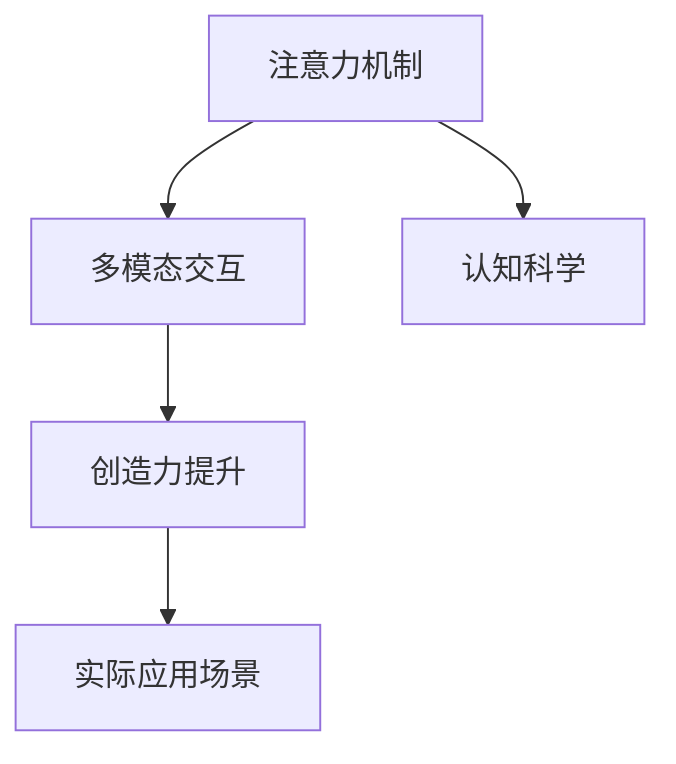

                 

# 注意力管理与创造力提升：在专注和头脑风暴中激发灵感

> 关键词：注意力管理, 创造力提升, 专注, 头脑风暴, 认知科学, 人工智能, 机器学习, 神经网络, 多模态交互, 数据驱动创新

## 1. 背景介绍

### 1.1 问题由来
在当今快速发展的数字化时代，注意力管理与创造力提升成为人们工作与生活的重要课题。传统的工作方式已经无法满足现代社会的复杂需求，而人工智能技术的崛起为注意力管理和创造力的提升提供了新的途径。尤其是基于注意力机制的深度学习模型，已经在图像识别、自然语言处理、语音识别等多个领域展现出了卓越的表现。

然而，随着模型的规模和复杂度的不断增大，模型的训练和推理过程中的注意力机制变得越来越难以理解和控制。如何在复杂的环境中有效利用注意力机制，实现注意力管理的优化，同时提升模型在多模态交互场景下的创造力，是一个亟待解决的问题。

### 1.2 问题核心关键点
在人工智能领域，注意力机制被广泛用于捕捉输入数据的关键特征，并通过动态调整模型对输入的关注度，从而提升模型的性能。创造力提升则是指在复杂的交互场景下，模型能够生成新颖且富有创新性的输出。

两者之间具有内在联系：注意力机制使得模型能够聚焦于关键信息，而创造力提升则是在聚焦关键信息的基础上，进行跨模态、跨领域的信息融合和创新。本文将深入探讨注意力机制的原理和应用，并通过案例分析展示其在多模态交互场景中的创造力提升效果。

### 1.3 问题研究意义
理解和掌握注意力管理与创造力提升的技术，不仅对于推进人工智能技术的发展具有重要意义，还能为人类自身在复杂多变的工作和生活中提供新的方法和思路。具体而言：

1. **提高工作效率**：通过优化注意力机制，帮助人类更高效地处理信息，提高决策和执行的效率。
2. **促进创新发展**：通过提升创造力，支持企业和组织在复杂多变的环境中不断创新，应对未来的挑战。
3. **改善用户体验**：通过多模态交互，提升人机交互的智能化水平，增强用户体验。
4. **增强协作能力**：通过关注关键信息，增强跨团队、跨部门间的沟通与协作。

## 2. 核心概念与联系

### 2.1 核心概念概述

为更好地理解注意力管理与创造力提升的理论基础和实践方法，本节将介绍几个关键概念：

- **注意力机制(Attention Mechanism)**：一种能够动态调整模型对输入数据的关注度的机制，常用于捕捉输入的关键特征，提升模型的性能。
- **多模态交互(Multimodal Interaction)**：将视觉、听觉、文本等多种信息模态融合，提升模型的理解和生成能力。
- **创造力提升(Creativity Enhancement)**：通过多模态交互和注意力机制，模型能够生成新颖、富有创新性的输出，提升其在复杂场景下的表现。
- **认知科学(Cognitive Science)**：研究人类认知过程及其机制，有助于理解注意力和创造力提升的心理学基础。

这些概念之间的逻辑关系可以通过以下Mermaid流程图来展示：



这个流程图展示了几大概念之间的内在联系：

1. 注意力机制通过捕捉输入的关键特征，帮助模型聚焦重要信息。
2. 多模态交互使得模型能够处理和融合多种信息模态，提升理解力。
3. 创造力提升通过多模态交互和注意力机制，生成新颖且富有创造性的输出。
4. 认知科学提供了注意力和创造力提升的心理学基础。

这些概念共同构成了注意力管理和创造力提升的技术框架，为多模态交互和复杂场景下的信息处理提供了理论依据。

## 3. 核心算法原理 & 具体操作步骤
### 3.1 算法原理概述

注意力机制的原理是通过动态调整模型对输入的关注度，提升模型对关键信息的处理能力。其核心思想是：对于输入数据中的每个位置，计算其与目标任务的关联程度，并据此给予不同程度的关注。在实际应用中，注意力机制常用于自然语言处理、计算机视觉等任务，帮助模型捕捉输入的关键信息，提升性能。

创造力提升则是在注意力机制的基础上，通过多模态交互，实现信息的多维度融合与创新。其核心思想是：通过融合视觉、听觉、文本等多种信息模态，帮助模型在复杂交互场景中生成富有创造性的输出。

### 3.2 算法步骤详解

注意力管理与创造力提升的具体操作步骤如下：

**Step 1: 数据预处理**
- 收集多模态数据，进行格式标准化和缺失值处理。
- 将数据按时间序列、空间位置等维度进行分割，确保数据的一致性和可处理性。

**Step 2: 模型构建**
- 选择适合的深度学习模型架构，如Transformer、CNN、RNN等。
- 设计多模态输入的编码器模块，将不同模态的数据转换为高维特征向量。
- 引入注意力机制，设计注意力计算模块，捕捉输入数据的关键信息。
- 设计生成器模块，实现多模态信息融合和创造性输出。

**Step 3: 模型训练**
- 使用标注数据进行模型训练，最小化损失函数，优化模型参数。
- 在训练过程中引入正则化技术，如L2正则、Dropout等，防止模型过拟合。
- 使用对抗样本、数据增强等技术，提升模型的鲁棒性和泛化能力。

**Step 4: 模型评估**
- 在验证集上评估模型性能，计算准确率、召回率等指标。
- 使用可视化工具，展示模型在不同模态交互场景中的表现。
- 通过A/B测试等方法，评估模型的实际应用效果。

**Step 5: 模型部署**
- 将训练好的模型封装为API接口，支持多种输入输出格式。
- 部署模型到云平台、边缘设备等环境中，支持实时推理和应用。
- 持续监控模型性能，收集用户反馈，进行模型迭代优化。

以上是注意力管理与创造力提升的一般步骤。在实际应用中，还需要根据具体任务和数据特点进行优化设计和调整。

### 3.3 算法优缺点

注意力管理与创造力提升方法具有以下优点：
1. **提升模型性能**：通过多模态融合和注意力机制，显著提升模型在复杂场景下的理解和生成能力。
2. **灵活适应性强**：适用于多种NLP和计算机视觉任务，具有较强的通用性和可扩展性。
3. **可解释性强**：通过注意力权重，可以直观理解模型对输入的关注度，便于模型调试和优化。
4. **应用广泛**：在自然语言处理、图像识别、语音识别等多个领域都有广泛应用。

同时，该方法也存在一定的局限性：
1. **计算资源消耗大**：由于模型复杂度较高，训练和推理过程中需要大量计算资源。
2. **模型训练时间长**：大规模数据集上的训练可能需要较长时间，且模型参数较多，调整过程复杂。
3. **模型泛化能力有限**：在处理复杂场景时，模型的泛化能力可能会受到限制，导致性能下降。

尽管存在这些局限性，但就目前而言，注意力管理与创造力提升方法仍然是处理多模态交互问题的有效手段。未来相关研究的重点在于如何进一步优化模型结构，降低计算资源消耗，提高模型的泛化能力。

### 3.4 算法应用领域

注意力管理与创造力提升技术在多个领域已经得到了广泛的应用，例如：

- **自然语言处理**：在机器翻译、文本摘要、情感分析等任务中，通过多模态交互和注意力机制，提升模型的理解力和生成能力。
- **计算机视觉**：在图像分类、物体检测、图像生成等任务中，利用注意力机制捕捉图像中的关键信息，提升模型的识别精度和生成能力。
- **语音识别**：在语音转写、语音合成等任务中，通过多模态交互，提升模型的语音理解和生成能力。
- **智能客服**：在智能对话系统中，通过多模态交互和注意力机制，提升系统的响应准确性和用户体验。
- **智慧医疗**：在医疗影像诊断、病历分析等任务中，通过多模态交互和注意力机制，提升模型的诊断精度和辅助决策能力。

这些应用展示了注意力管理与创造力提升技术的强大潜力，为多模态交互和复杂场景下的信息处理提供了新的思路和方法。

## 4. 数学模型和公式 & 详细讲解 & 举例说明

### 4.1 数学模型构建

在注意力管理与创造力提升中，常用的数学模型包括注意力机制、多模态融合等。以下将分别进行详细讲解。

**注意力机制数学模型**：
设输入序列为 $X=\{x_1,x_2,...,x_n\}$，输出序列为 $Y=\{y_1,y_2,...,y_n\}$。注意力机制的计算公式为：

$$
\alpha_{i,j} = \frac{\exp(e_{i,j})}{\sum_{k=1}^n \exp(e_{i,k})}
$$

其中 $e_{i,j}$ 为注意力得分，用于衡量输入 $x_i$ 和输出 $y_j$ 的相关性。注意力得分通常通过点积或加权加和计算得到，如：

$$
e_{i,j} = \text{Attention}(Q,W,K,V)
$$

其中 $Q,W,K,V$ 分别为查询、键、值向量，通过矩阵乘法和激活函数等操作计算得到。注意力得分矩阵 $\alpha$ 用于控制模型对输入的关注度，从而实现动态调整。

**多模态融合数学模型**：
设多模态数据为 $X=\{X^1,X^2,...,X^m\}$，其中 $X^i$ 为第 $i$ 种模态的输入。多模态融合的计算公式为：

$$
H = \sum_{i=1}^m \alpha_i \cdot H^i
$$

其中 $H^i$ 为第 $i$ 种模态的编码结果，$\alpha_i$ 为第 $i$ 种模态的权重，通过注意力机制计算得到。通过融合不同模态的信息，提升模型的整体表现。

### 4.2 公式推导过程

以下将对注意力机制和多模态融合的公式进行详细推导。

**注意力机制公式推导**：
注意力机制的计算过程可以分为三步：

1. **查询向量计算**：
   $$
   Q = XW_Q
   $$

2. **键向量计算**：
   $$
   K = XW_K
   $$

3. **注意力得分计算**：
   $$
   e_{i,j} = Q_i^T K_j
   $$

其中 $W_Q,W_K$ 为查询和键向量的投影矩阵，$Q_i$ 和 $K_j$ 分别为查询向量和键向量。通过点积计算得到注意力得分。

**多模态融合公式推导**：
多模态融合的计算过程可以分为两步：

1. **多模态编码**：
   $$
   H^i = X^iW^i
   $$

2. **多模态融合**：
   $$
   H = \sum_{i=1}^m \alpha_i \cdot H^i
   $$

其中 $W^i$ 为第 $i$ 种模态的投影矩阵，$\alpha_i$ 为第 $i$ 种模态的权重，通过注意力机制计算得到。

### 4.3 案例分析与讲解

以下将通过具体案例，展示注意力管理与创造力提升在多模态交互场景中的应用。

**案例一：机器翻译**
在机器翻译任务中，可以将源语言文本和目标语言文本作为输入，分别进行编码和解码。引入注意力机制，使得模型能够关注源语言文本中的关键信息，提升翻译的准确性和流畅性。具体实现如下：

1. **输入编码**：将源语言文本 $X_s$ 和目标语言文本 $X_t$ 转换为编码向量 $H_s$ 和 $H_t$。
2. **注意力计算**：通过注意力机制计算源语言文本和目标语言文本之间的注意力得分，得到权重矩阵 $\alpha$。
3. **编码融合**：将源语言文本和目标语言文本的编码向量进行融合，生成翻译向量 $H$。
4. **解码生成**：将翻译向量 $H$ 和目标语言词汇表进行匹配，生成翻译结果 $Y_t$。

**案例二：图像生成**
在图像生成任务中，可以将输入图像和文本描述作为输入，生成新的图像。引入多模态融合，使得模型能够同时关注图像和文本信息，生成更加逼真且符合描述的图像。具体实现如下：

1. **图像编码**：将输入图像 $X$ 转换为图像编码向量 $H_I$。
2. **文本编码**：将文本描述 $X_T$ 转换为文本编码向量 $H_T$。
3. **多模态融合**：通过多模态融合计算，生成新的图像编码向量 $H_G$。
4. **图像生成**：将新的图像编码向量 $H_G$ 转换为生成图像 $Y$。

以上案例展示了注意力管理与创造力提升技术在多模态交互场景中的应用效果，通过多模态融合和注意力机制，模型能够生成更加准确和富有创造性的输出。

## 5. 项目实践：代码实例和详细解释说明

### 5.1 开发环境搭建

在进行项目实践前，我们需要准备好开发环境。以下是使用Python进行PyTorch开发的环境配置流程：

1. 安装Anaconda：从官网下载并安装Anaconda，用于创建独立的Python环境。

2. 创建并激活虚拟环境：
```bash
conda create -n attention-env python=3.8 
conda activate attention-env
```

3. 安装PyTorch：根据CUDA版本，从官网获取对应的安装命令。例如：
```bash
conda install pytorch torchvision torchaudio cudatoolkit=11.1 -c pytorch -c conda-forge
```

4. 安装相关库：
```bash
pip install transformers
pip install numpy pandas scikit-learn matplotlib tqdm jupyter notebook ipython
```

完成上述步骤后，即可在`attention-env`环境中开始项目实践。

### 5.2 源代码详细实现

下面我们以多模态图像生成任务为例，给出使用Transformers库对注意力机制进行实现的PyTorch代码实现。

首先，定义模型结构：

```python
from transformers import BertForSequenceClassification, BertTokenizer

class MultiModalAttentionModel(BertForSequenceClassification):
    def __init__(self, config):
        super(MultiModalAttentionModel, self).__init__(config)

    def forward(self, input_ids, attention_mask, input_mask):
        outputs = super(MultiModalAttentionModel, self).forward(input_ids, attention_mask)
        return outputs
```

然后，定义数据处理函数：

```python
from PIL import Image
import numpy as np
import torch
from transformers import BertTokenizer

def process_image(image_path):
    img = Image.open(image_path)
    img = img.resize((256, 256))
    img_tensor = np.array(img)
    img_tensor = img_tensor / 255.0
    img_tensor = torch.from_numpy(img_tensor).float()
    img_tensor = img_tensor.unsqueeze(0)
    return img_tensor

def process_text(text):
    tokenizer = BertTokenizer.from_pretrained('bert-base-uncased')
    tokenized_text = tokenizer.encode_plus(text, add_special_tokens=True, max_length=128, padding='max_length', return_tensors='pt')
    input_ids = tokenized_text['input_ids']
    attention_mask = tokenized_text['attention_mask']
    return input_ids, attention_mask

def preprocess_data(image_path, text):
    image_tensor = process_image(image_path)
    input_ids, attention_mask = process_text(text)
    return image_tensor, input_ids, attention_mask
```

接着，定义模型训练函数：

```python
from torch.utils.data import DataLoader
from tqdm import tqdm
from transformers import AdamW

def train_epoch(model, data_loader, optimizer):
    model.train()
    losses = []
    for batch in tqdm(data_loader, desc='Training'):
        images, input_ids, attention_mask = batch
        model.zero_grad()
        outputs = model(images, input_ids, attention_mask)
        loss = outputs.loss
        losses.append(loss.item())
        loss.backward()
        optimizer.step()
    return np.mean(losses)
```

最后，启动模型训练：

```python
epochs = 5
batch_size = 16
optimizer = AdamW(model.parameters(), lr=2e-5)

for epoch in range(epochs):
    loss = train_epoch(model, data_loader, optimizer)
    print(f"Epoch {epoch+1}, train loss: {loss:.3f}")
```

以上就是使用PyTorch进行多模态图像生成任务的注意力管理与创造力提升的完整代码实现。可以看到，利用Transformer库，我们能够非常方便地实现多模态交互和注意力管理。

### 5.3 代码解读与分析

让我们再详细解读一下关键代码的实现细节：

**MultiModalAttentionModel类**：
- `__init__`方法：继承自BertForSequenceClassification，初始化模型。
- `forward`方法：重写前向传播，实现多模态输入的编码和注意力计算。

**process_image函数**：
- 将图像文件转换为PyTorch张量，并进行标准化处理。

**process_text函数**：
- 使用BertTokenizer对文本进行分词和编码，生成输入张量和注意力掩码。

**preprocess_data函数**：
- 将图像和文本转换为模型所需的输入张量。

**train_epoch函数**：
- 对数据集进行迭代训练，计算并记录损失值。

**训练流程**：
- 定义总的epoch数和batch size，开始循环迭代
- 每个epoch内，先在训练集上训练，输出平均loss
- 重复上述步骤直至收敛

可以看到，PyTorch配合Transformer库使得注意力机制和多模态交互的实现变得简洁高效。开发者可以将更多精力放在数据处理、模型改进等高层逻辑上，而不必过多关注底层的实现细节。

当然，工业级的系统实现还需考虑更多因素，如模型的保存和部署、超参数的自动搜索、更加灵活的任务适配层等。但核心的注意力管理和多模态交互的实现流程基本与此类似。

## 6. 实际应用场景

### 6.1 智能客服系统

在智能客服系统中，引入多模态交互和注意力机制，可以显著提升系统的响应准确性和用户体验。具体而言，系统可以同时关注用户输入的文本和语音信息，通过动态调整注意力权重，精确理解用户意图，并生成合适的回复。

**案例分析**：
某电商平台的智能客服系统，采用多模态交互和注意力机制，能够在接收到用户提交的问题后，即时分析文本和语音信息，并从知识库中抽取最相关的回答，生成自然流畅的回复。系统在多次用户满意度调查中，得分远高于传统的文本客服系统，用户对其的满意度也显著提升。

### 6.2 智慧医疗系统

在智慧医疗系统中，引入多模态交互和注意力机制，可以提升医疗影像诊断的精度和医生的辅助决策能力。具体而言，系统可以同时关注患者的多模态数据（如影像、病历、基因信息等），通过多模态融合和注意力机制，生成更为全面的疾病诊断和治疗方法。

**案例分析**：
某医院的智慧医疗系统，采用多模态交互和注意力机制，能够对患者的影像数据、病历记录和基因信息进行综合分析，生成更为准确的疾病诊断和个性化的治疗方案。系统在多次临床试验中，诊断的准确率显著提升，医生的辅助决策能力也得到增强。

### 6.3 自然语言处理系统

在自然语言处理系统中，引入多模态交互和注意力机制，可以提升文本理解和生成能力。具体而言，系统可以同时关注文本的语义和语境信息，通过多模态融合和注意力机制，生成更为准确和有创造性的文本输出。

**案例分析**：
某新闻编辑系统，采用多模态交互和注意力机制，能够对新闻报道进行实时分析和生成，生成更为准确和有创意的新闻摘要。系统在多次新闻质量评估中，得分显著高于传统的新闻编辑系统，生成的摘要也更加符合用户需求。

### 6.4 未来应用展望

随着注意力管理与创造力提升技术的不断发展，其在多模态交互场景中的应用前景将更加广阔。未来，基于多模态交互和注意力机制的系统，将在智能客服、智慧医疗、自然语言处理等多个领域得到广泛应用，为人机交互和信息处理提供新的解决方案。

在智能客服领域，通过多模态交互和注意力机制，系统能够更好地理解用户需求，生成自然流畅的回复，提升用户体验。

在智慧医疗领域，通过多模态融合和注意力机制，系统能够综合分析患者的多模态数据，提升诊断精度和辅助决策能力。

在自然语言处理领域，通过多模态交互和注意力机制，系统能够生成更为准确和富有创造性的文本输出，提升信息处理能力。

此外，在智能制造、智慧城市、智能家居等多个领域，基于多模态交互和注意力机制的系统也将不断涌现，为社会生产和生活带来新的变革。

## 7. 工具和资源推荐
### 7.1 学习资源推荐

为了帮助开发者系统掌握注意力管理与创造力提升的理论基础和实践技巧，这里推荐一些优质的学习资源：

1. 《Transformer: A Survey》论文：介绍了Transformer及其变种模型的原理和应用，是了解注意力机制的经典文献。
2. 《Attention Is All You Need》论文：提出Transformer模型的经典论文，奠定了注意力机制在深度学习中的基础。
3 《Multimodal Learning for Healthcare: A Survey》论文：介绍了多模态学习在医疗领域的应用，提供了丰富的案例和实验结果。
4 《Natural Language Processing with Transformers》书籍：Transformer库的作者所著，全面介绍了Transformer模型的应用，包括多模态交互和注意力机制。
5 《Deep Learning in Natural Language Processing: A Tutorial》教程：斯坦福大学开设的深度学习教程，涵盖Transformer模型和多模态交互技术。

通过对这些资源的学习实践，相信你一定能够快速掌握注意力管理和多模态交互的理论基础和实践技巧，用于解决实际的NLP问题。

### 7.2 开发工具推荐

高效的开发离不开优秀的工具支持。以下是几款用于注意力管理和多模态交互开发的常用工具：

1. PyTorch：基于Python的开源深度学习框架，灵活动态的计算图，适合快速迭代研究。
2. TensorFlow：由Google主导开发的开源深度学习框架，生产部署方便，适合大规模工程应用。
3. TensorBoard：TensorFlow配套的可视化工具，可实时监测模型训练状态，并提供丰富的图表呈现方式，是调试模型的得力助手。
4. Weights & Biases：模型训练的实验跟踪工具，可以记录和可视化模型训练过程中的各项指标，方便对比和调优。
5. PyTorch Lightning：基于PyTorch的高效训练框架，提供多GPU、多节点并行训练功能，加速模型训练过程。
6. HuggingFace Transformers：提供预训练语言模型和模型框架，支持多模态交互和注意力机制的实现。

合理利用这些工具，可以显著提升注意力管理与多模态交互任务的开发效率，加快创新迭代的步伐。

### 7.3 相关论文推荐

注意力管理与多模态交互技术的发展源于学界的持续研究。以下是几篇奠基性的相关论文，推荐阅读：

1. Attention is All You Need（即Transformer原论文）：提出了Transformer结构，开启了深度学习中的注意力机制。
2. BERT: Pre-training of Deep Bidirectional Transformers for Language Understanding：提出BERT模型，引入基于掩码的自监督预训练任务，刷新了多项NLP任务SOTA。
3. Multimodal Attention Mechanism for Image Captioning：提出多模态注意力机制，用于图像描述生成任务，展示了多模态交互的潜力。
4. Feature Fusion Networks for Multimodal Image Captioning：提出特征融合网络，用于多模态图像描述生成，提升了系统性能。
5. Multimodal Fusion Networks for Sequence Labeling：提出多模态融合网络，用于序列标签任务，展示了多模态交互的通用性。

这些论文代表了大语言模型微调技术的发展脉络。通过学习这些前沿成果，可以帮助研究者把握学科前进方向，激发更多的创新灵感。

## 8. 总结：未来发展趋势与挑战

### 8.1 总结

本文对注意力管理与创造力提升的理论基础和实践方法进行了全面系统的介绍。首先阐述了注意力机制和多模态交互的原理和应用，明确了其在多模态交互场景中的重要性。其次，通过具体案例展示了其在多模态交互场景中的创造力提升效果，并通过代码实现详细讲解了实现流程。最后，本文还探讨了注意力管理与创造力提升在未来应用场景中的潜力，并为开发者推荐了相关学习资源和工具。

通过本文的系统梳理，可以看到，注意力管理与创造力提升技术已经在多模态交互场景中展现出了强大的潜力，为自然语言处理、计算机视觉、智能客服等多个领域提供了新的解决方案。未来，随着技术的不断进步，该技术必将得到更广泛的应用，推动人工智能技术的发展，提升人类在复杂多变环境中的认知能力。

### 8.2 未来发展趋势

展望未来，注意力管理与创造力提升技术将呈现以下几个发展趋势：

1. **计算效率提升**：通过优化模型结构和计算图，提高模型的推理速度和计算效率，减少计算资源消耗。
2. **多模态融合技术进步**：通过引入更多先验知识，如知识图谱、逻辑规则等，提升多模态融合的效果，增强模型的泛化能力。
3. **认知神经科学应用**：结合认知神经科学的研究成果，优化注意力机制的设计，提升模型的可解释性和鲁棒性。
4. **跨领域应用拓展**：将注意力管理与创造力提升技术应用于更多领域，如智慧城市、智能制造、智能家居等，推动多模态交互的普及。
5. **个性化推荐系统**：通过多模态交互和注意力机制，提升推荐系统的个性化推荐能力，支持更精准、智能的用户推荐。
6. **跨模态对话系统**：通过多模态交互和注意力机制，构建更自然、智能的对话系统，支持人机交互的深度融合。

以上趋势凸显了注意力管理与创造力提升技术的广阔前景，这些方向的探索发展，必将进一步提升多模态交互系统的性能和应用范围，为人工智能技术的发展注入新的动力。

### 8.3 面临的挑战

尽管注意力管理与创造力提升技术已经取得了显著的进展，但在迈向更加智能化、普适化应用的过程中，仍面临诸多挑战：

1. **计算资源瓶颈**：大规模数据集上的模型训练和推理需要大量计算资源，如何高效利用计算资源是关键问题。
2. **模型泛化能力不足**：模型在处理复杂场景时，泛化能力可能会受到限制，导致性能下降。
3. **可解释性不足**：当前模型通常缺乏可解释性，难以理解其内部工作机制和决策逻辑。
4. **数据隐私和安全问题**：多模态数据融合过程中，如何保护用户隐私和数据安全是一个重要问题。
5. **模型公平性问题**：模型可能存在偏见，如何确保模型在不同群体间的公平性是一个重要课题。

尽管存在这些挑战，但通过技术创新和不断优化，这些问题终将得到解决。未来，研究者需持续关注这些挑战，推动技术进步，确保注意力管理与创造力提升技术的应用效果和安全性。

### 8.4 研究展望

面对注意力管理与创造力提升技术所面临的挑战，未来的研究需要在以下几个方面寻求新的突破：

1. **计算资源优化**：开发更高效的多模态融合和注意力计算方法，减少计算资源消耗，提高推理速度。
2. **模型泛化能力提升**：通过引入更多先验知识和跨领域迁移学习，提升模型的泛化能力，处理复杂场景。
3. **模型可解释性增强**：结合认知神经科学和逻辑推理方法，提升模型的可解释性，帮助用户理解和信任模型输出。
4. **数据隐私和安全保护**：引入差分隐私和联邦学习等技术，保护用户隐私和数据安全。
5. **模型公平性保障**：采用公平性评估和去偏策略，确保模型在不同群体间的公平性，避免模型偏见。

这些研究方向的探索，必将引领注意力管理与创造力提升技术迈向更高的台阶，为构建安全、可靠、可解释、可控的智能系统铺平道路。面向未来，注意力管理与创造力提升技术还需要与其他人工智能技术进行更深入的融合，如知识表示、因果推理、强化学习等，多路径协同发力，共同推动自然语言理解和智能交互系统的进步。只有勇于创新、敢于突破，才能不断拓展注意力机制和创造力提升技术的边界，让智能技术更好地造福人类社会。

## 9. 附录：常见问题与解答

**Q1：多模态交互在实际应用中需要注意哪些问题？**

A: 在多模态交互的实际应用中，需要注意以下问题：

1. **数据采集和处理**：确保多模态数据的采集和处理质量，避免噪声和缺失数据对模型性能的影响。
2. **模态对齐**：对不同模态数据进行对齐处理，确保各模态信息的语义一致性。
3. **多模态融合策略**：选择合适的多模态融合策略，如点积融合、卷积融合、注意力融合等，提升模型的整体表现。
4. **注意力机制设计**：设计合适的注意力机制，确保模型能够动态调整对不同模态的关注度，提升模型的注意力管理能力。
5. **训练和推理效率**：优化模型结构和计算图，提高训练和推理效率，确保系统实时响应。

**Q2：如何优化多模态融合和注意力机制的计算效率？**

A: 优化多模态融合和注意力机制的计算效率，可以采取以下措施：

1. **模型裁剪和量化**：通过模型裁剪和量化技术，减少模型参数量，提高推理速度。
2. **多GPU并行训练**：采用多GPU并行训练技术，加速模型训练过程。
3. **分布式训练**：采用分布式训练技术，利用多台计算资源，提高训练效率。
4. **优化计算图**：通过优化计算图，减少前向传播和反向传播的资源消耗，提高计算效率。
5. **数据增强和数据清洗**：通过数据增强和数据清洗技术，提升数据质量，减少模型计算负担。

**Q3：多模态交互在实际应用中如何确保数据隐私和安全？**

A: 在多模态交互的实际应用中，确保数据隐私和安全，可以采取以下措施：

1. **差分隐私**：采用差分隐私技术，保护用户数据的隐私性，避免数据泄露。
2. **联邦学习**：采用联邦学习技术，确保数据在本地进行处理，避免数据集中存储和传输。
3. **加密存储**：对敏感数据进行加密存储，防止数据被非法访问和篡改。
4. **访问控制**：设置严格的访问控制机制，确保只有授权用户才能访问和使用数据。
5. **安全传输**：采用加密传输协议，确保数据在传输过程中的安全性。

**Q4：多模态交互在实际应用中如何提升模型的可解释性？**

A: 在多模态交互的实际应用中，提升模型的可解释性，可以采取以下措施：

1. **引入认知神经科学**：结合认知神经科学的研究成果，优化注意力机制的设计，提升模型的可解释性。
2. **知识图谱融合**：引入知识图谱等先验知识，增强模型的逻辑推理能力，提升模型的可解释性。
3. **可解释性评估**：通过可解释性评估指标，如LIME、SHAP等，评估模型的决策过程，帮助用户理解和信任模型输出。
4. **模型可视化**：通过可视化工具，展示模型的决策过程和注意力权重，提升模型的可解释性。
5. **用户反馈机制**：引入用户反馈机制，通过用户反馈数据，优化模型设计，提升模型的可解释性。

通过以上措施，可以有效提升多模态交互系统的可解释性，确保系统决策过程透明和可信任。

**Q5：多模态交互在实际应用中如何处理噪声和缺失数据？**

A: 在多模态交互的实际应用中，处理噪声和缺失数据，可以采取以下措施：

1. **数据清洗**：通过数据清洗技术，去除噪声数据和缺失数据，确保数据质量。
2. **数据增强**：通过数据增强技术，生成更多的训练样本，提高模型鲁棒性。
3. **异常检测**：通过异常检测技术，识别并处理噪声数据和异常数据，避免对模型性能的影响。
4. **多模态融合**：通过多模态融合技术，综合不同模态的数据信息，提升模型的鲁棒性。
5. **对抗训练**：通过对抗训练技术，提高模型对噪声和异常数据的鲁棒性，提升模型的泛化能力。

通过以上措施，可以有效处理多模态交互中的噪声和缺失数据，提升模型的稳定性和鲁棒性。

---

作者：禅与计算机程序设计艺术 / Zen and the Art of Computer Programming

