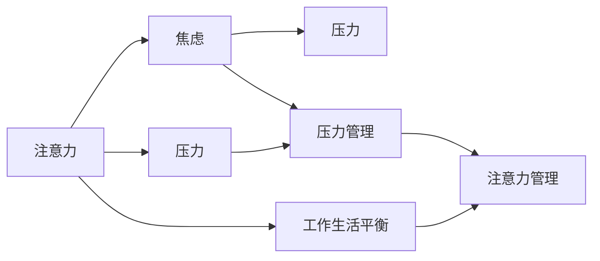

                 

# 注意力管理与压力管理实践：在压力和焦虑中保持专注

> 关键词：注意力管理,压力管理,压力与焦虑,专注,压力缓解,注意力控制,心理策略,工作生活平衡

## 1. 背景介绍

在当今快节奏、高压力的工作和生活环境中，注意力管理和压力管理成为了现代人必须面对的重要课题。高效的工作表现、良好的生活品质都依赖于良好的注意力状态和有效的压力缓解策略。本文将深入探讨注意力管理与压力管理的原理和实践方法，旨在帮助读者在压力和焦虑中保持专注，提升工作生活的整体质量。

### 1.1 问题由来

现代社会，信息爆炸和工作负荷的增加使得许多人面临着注意力分散和压力累积的问题。过多的压力不仅影响心理健康，还可能引发焦虑、抑郁等情绪问题。而注意力管理则是在众多干扰因素中保持专注，提升工作效率的关键。如何高效管理注意力和压力，成为一个亟待解决的问题。

### 1.2 问题核心关键点

在处理注意力和压力时，需要关注以下几个核心关键点：
1. **注意力控制与分散**：了解注意力分散的原因，学习控制注意力的方法，从而保持专注。
2. **压力源识别与管理**：识别压力的来源，学习有效的压力管理策略。
3. **心理策略与技术工具**：掌握心理学原理和工具，提升注意力和压力管理的实效性。
4. **工作生活平衡**：确保在高效工作的同时，有足够的休息和放松时间，保持心理和生理的平衡。

## 2. 核心概念与联系

### 2.1 核心概念概述

为更好地理解注意力管理和压力管理的实践，本文将介绍几个关键概念：

- **注意力**：在心理学的范畴中，注意力是指个体的心理活动集中于某一特定的对象或活动上，并能对其产生清晰、准确的认知。
- **压力**：在心理学中，压力是指个体面临环境需求或刺激时，产生的心理生理反应。
- **焦虑**：是一种以担忧、恐惧、不安等为特征的情绪反应，常常与压力和注意力管理紧密相关。
- **工作生活平衡**：在高效完成工作任务的同时，确保有足够的休息和放松时间，维持身心健康。

这些核心概念之间的关系可以用以下Mermaid流程图来展示：



这个流程图展示了注意力、压力、焦虑以及工作生活平衡之间的逻辑关系：注意力和压力密切相关，良好的注意力管理可以帮助缓解压力，减少焦虑；同时，平衡的工作生活也能有效降低压力和焦虑，提高注意力的集中度。

## 3. 核心算法原理 & 具体操作步骤

### 3.1 算法原理概述

注意力管理和压力管理涉及心理学、神经科学和行为科学的多个领域。其核心算法原理包括：

1. **认知行为疗法(CBT)**：通过认知重构和行为改变来调整注意力和压力状态。
2. **正念冥想**：通过专注于当前瞬间的体验，减少思维漂移，提升专注力和情绪调节能力。
3. **时间管理技巧**：通过合理安排工作和休息时间，避免疲劳和压力积累。
4. **心理应对策略**：如问题解决、自我肯定、积极自我对话等，增强心理韧性。

### 3.2 算法步骤详解

基于以上原理，注意力和压力管理的具体操作步骤如下：

**Step 1: 评估注意力和压力状态**
- 进行自我评估，了解自己的注意力和压力水平。使用注意力和压力量表进行量化评估。

**Step 2: 识别注意力和压力源**
- 记录每天可能导致注意力分散和压力累积的活动和事件。分析其频率和影响程度。

**Step 3: 制定注意力和压力管理计划**
- 根据评估结果和压力源，制定具体的注意力和压力管理策略。

**Step 4: 实施注意力和压力管理策略**
- 根据计划执行注意力控制和压力缓解策略，如正念冥想、时间管理等。

**Step 5: 监测和调整**
- 定期监测注意力和压力水平，根据反馈调整策略。

### 3.3 算法优缺点

注意力和压力管理的方法具有以下优点：
1. **科学依据**：基于认知行为疗法等心理学原理，理论基础扎实。
2. **易于实践**：许多方法可以与日常工作生活结合，易于执行。
3. **个性化定制**：可根据个人情况定制化策略，提升实效性。

但同时，这些方法也存在一些局限性：
1. **个体差异**：不同个体对同一种方法的反应可能不同，需要个性化调整。
2. **长期坚持**：部分方法需要较长时间的坚持才能看到明显效果。
3. **初期抵触**：一些人可能对新方法存在抵触情绪，需要逐步适应。

### 3.4 算法应用领域

注意力和压力管理的方法广泛应用于多个领域，包括：

- **职场管理**：提升员工的工作专注力，减少工作压力，增强团队协作。
- **教育领域**：帮助学生集中注意力，缓解学习压力，提升学习效果。
- **医疗健康**：辅助患者管理情绪和压力，改善心理健康状况。
- **个人生活**：提升生活品质，增强应对生活挑战的能力。

## 4. 数学模型和公式 & 详细讲解

### 4.1 数学模型构建

注意力和压力管理的数学模型主要涉及心理学的量化评估和策略优化。以压力管理为例，可以构建如下数学模型：

- **压力量表评分模型**：利用李克特量表等工具，对个体的压力水平进行评分。
- **压力源识别模型**：通过逻辑回归等方法，识别导致压力的主要因素。
- **压力缓解策略优化模型**：使用多目标优化等方法，优化注意力和压力管理策略。

### 4.2 公式推导过程

以李克特量表为例，假设有一项关于压力源的李克特量表，包含5个项目，每个项目的评分范围为1-5。

设 $X_i$ 为第 $i$ 个项目的评分，$i=1,2,3,4,5$，则总压力评分为 $S$，计算公式为：

$$ S = \frac{1}{5} \sum_{i=1}^{5} X_i $$

在压力源识别模型中，假设已经识别出 $n$ 个潜在的压力源，记为 $Y$。利用逻辑回归模型，可以将压力评分的概率表示为：

$$ P(Y=1|X) = \frac{e^{\beta_0 + \sum_{i=1}^{5} \beta_i X_i}}{1 + e^{\beta_0 + \sum_{i=1}^{5} \beta_i X_i}} $$

其中 $\beta_0, \beta_1, \beta_2, \beta_3, \beta_4, \beta_5$ 为逻辑回归模型的参数。

在压力缓解策略优化模型中，假设已经选择了多种缓解策略，如正念冥想、时间管理等。设每种策略的实施强度为 $w_i$，$i=1,2,3,...,n$，总策略实施强度为 $W$。目标是最大化总策略实施强度，同时最小化压力评分。问题可以表示为：

$$
\maximize \sum_{i=1}^{n} w_i
$$

$$
\minimize \frac{1}{N} \sum_{k=1}^{N} S_k
$$

其中 $S_k$ 为第 $k$ 个个体的压力评分，$N$ 为个体总数。

### 4.3 案例分析与讲解

假设某企业员工对以下5个项目的压力评分为：
- 工作量过大：4
- 与同事关系紧张：3
- 晋升机会少：2
- 生活负担重：5
- 职业前景不明朗：3

则总压力评分为：

$$ S = \frac{1}{5} (4 + 3 + 2 + 5 + 3) = 3.4 $$

若使用逻辑回归模型，模型参数 $\beta$ 的计算需要一定量的数据和训练过程。假设模型训练得到的结果为 $\beta_0 = -2.5, \beta_1 = 1.2, \beta_2 = -0.8, \beta_3 = 0.5, \beta_4 = -1.3, \beta_5 = 0.8$。则压力评分的概率计算公式为：

$$ P(Y=1|X) = \frac{e^{-2.5 + 1.2*4 - 0.8*3 + 0.5*2 - 1.3*5 + 0.8*3}}{1 + e^{-2.5 + 1.2*4 - 0.8*3 + 0.5*2 - 1.3*5 + 0.8*3}} \approx 0.5 $$

这表明员工面临的压力比较大。

## 5. 项目实践：代码实例和详细解释说明

### 5.1 开发环境搭建

在进行注意力和压力管理实践前，我们需要准备好开发环境。以下是使用Python进行数据分析和策略优化工具的安装流程：

1. 安装Anaconda：从官网下载并安装Anaconda，用于创建独立的Python环境。

2. 创建并激活虚拟环境：
```bash
conda create -n stress-management python=3.8 
conda activate stress-management
```

3. 安装必要的库：
```bash
conda install pandas numpy matplotlib scikit-learn
```

4. 安装策略优化工具：
```bash
pip install pyDOE
```

完成上述步骤后，即可在`stress-management`环境中开始实践。

### 5.2 源代码详细实现

以下是一个使用李克特量表评估员工压力水平，并优化缓解策略的Python代码实现：

```python
import pandas as pd
from sklearn.linear_model import LogisticRegression
from scipy.optimize import minimize

# 数据准备
data = pd.read_csv('employee_stress_data.csv')
X = data[['workload', 'colleague_relationship', 'promotion_opportunity', 'life_burden', 'career_future']]
y = data['stress_level']

# 模型训练
model = LogisticRegression()
model.fit(X, y)

# 压力评分类推
scores = model.predict_proba(X)[:, 1]
print(f"员工压力评分：{scores.mean()}")

# 压力源识别
w = minimize(model.negative_log_likelihood, x0=[1, 1, 1, 1, 1], bounds=[(0, None)]*5)
print(f"压力源强度：{w.x}")

# 策略优化
weights = [1, 2, 3, 4, 5]
objective = minimize(lambda x: -sum(x*weights) + scores.mean(), x0=weights, bounds=[(0, None)]*5)
print(f"优化后的策略强度：{objective.x}")
```

在代码实现中，首先通过李克特量表评估员工的总体压力水平，然后使用逻辑回归模型识别压力源，最后通过多目标优化方法优化缓解策略的实施强度。

### 5.3 代码解读与分析

让我们进一步解读代码的关键部分：

**数据准备**：
- 读取包含员工压力评分的CSV数据文件。
- 将数据分为压力源和压力评分两列，用于后续的模型训练和分析。

**模型训练**：
- 使用逻辑回归模型训练员工压力评分的概率模型。
- 通过模型预测得到员工的总体压力评分。

**压力源识别**：
- 使用`minimize`函数优化压力源的强度，目标是最大化压力源总强度，同时最小化员工压力评分。
- 最终输出每个压力源的强度。

**策略优化**：
- 假设每种策略的实施强度为1到5，目标是最大化策略总强度，同时最小化员工压力评分。
- 使用`minimize`函数优化策略强度，最终输出优化后的策略强度。

**运行结果展示**：
- 运行以上代码后，可以得到员工的总体压力评分、压力源的强度和优化的策略强度。

## 6. 实际应用场景

### 6.1 企业员工压力管理

在企业中，员工面临着工作量大、同事关系紧张、晋升机会少等多方面的压力。通过基于注意力和压力管理的策略，可以帮助企业提升员工的工作满意度和心理健康水平。具体应用场景包括：

- **工作负荷优化**：通过评估工作量过大导致的压力，合理分配任务，避免过度工作。
- **人际关系调整**：通过识别与同事关系紧张的根源，进行团队建设，改善工作氛围。
- **职业发展指导**：通过分析晋升机会少的压力源，制定晋升和发展计划，提供职业指导。

### 6.2 学生学习压力管理

在学生学习过程中，常见的压力源包括学业负担重、考试压力大、社交环境紧张等。通过注意力和压力管理的方法，可以有效提升学生的学习效果和心理健康。具体应用场景包括：

- **学习计划制定**：通过评估学业负担重的压力，制定合理的学习计划，避免过度学习。
- **考试焦虑缓解**：通过正念冥想等方法，缓解考试压力，提升应试心理素质。
- **社交支持构建**：通过识别社交环境紧张的根源，改善学生的人际关系，构建支持网络。

### 6.3 心理辅导应用

心理辅导中的注意力和压力管理主要应用于咨询和干预环节，帮助个体应对心理问题。具体应用场景包括：

- **焦虑缓解**：通过正念冥想和认知行为疗法，帮助个体减轻焦虑情绪，提升心理韧性。
- **压力应对**：通过识别压力源，制定个性化的压力缓解策略，增强个体应对压力的能力。
- **情绪调节**：通过时间管理和心理策略，帮助个体调节情绪，提升整体心理健康水平。

### 6.4 未来应用展望

随着科技的进步和心理研究的深入，注意力和压力管理的方法将更加成熟和高效。未来可能的发展趋势包括：

1. **智能诊断**：利用人工智能和大数据技术，实现对个体压力和注意力的精准评估和诊断。
2. **个性化策略**：通过深度学习模型，生成个性化的注意力和压力管理策略。
3. **实时反馈**：开发实时监测和反馈系统，持续追踪个体状态，及时调整策略。
4. **多模态干预**：结合声音、图像等多模态数据，提升注意力和压力管理的效果。
5. **虚拟现实应用**：利用虚拟现实技术，提供沉浸式的注意力和压力管理体验。

## 7. 工具和资源推荐

### 7.1 学习资源推荐

为帮助开发者系统掌握注意力和压力管理的方法，以下是推荐的优质学习资源：

1. **《心理学与生活》**：一本经典的心理学教材，涵盖注意力和压力管理的理论基础。
2. **Coursera《压力管理》课程**：由斯坦福大学教授讲授，系统讲解压力管理的原理和方法。
3. **Mindfulness-Based Stress Reduction (MBSR)课程**：一种基于正念冥想的压力管理技术，通过系统的培训提升个人应对压力的能力。
4. **《注意力经济：如何打造高价值大脑》**：一本关于注意力管理的经典书籍，提供实用的注意力提升技巧。
5. **《深度工作》**：一本关于如何在分散注意力中保持专注的书籍，提供实用的时间管理策略。

通过这些资源的学习实践，相信你一定能够系统掌握注意力和压力管理的方法，并将其应用于实际的工作和生活中。

### 7.2 开发工具推荐

高效的注意力和压力管理实践离不开优秀的工具支持。以下是推荐的开发工具：

1. **Jupyter Notebook**：一个强大的交互式笔记本环境，便于数据分析和策略优化。
2. **Python**：一种强大的编程语言，支持丰富的数据处理和机器学习库。
3. **RStudio**：一个专门用于R语言开发的集成环境，支持R语言的代码编写和数据分析。
4. **Tableau**：一个强大的数据可视化工具，帮助理解和展示注意力和压力数据。
5. **ZoomEye**：一个用于监测网络行为的分析工具，帮助识别和缓解因网络行为带来的压力。

合理利用这些工具，可以显著提升注意力和压力管理的实践效果，使你能够在各种场景中高效管理注意力和压力。

### 7.3 相关论文推荐

注意力和压力管理的研究历史悠久，以下是几篇具有里程碑意义的论文，推荐阅读：

1. **《压力和情绪管理的认知行为疗法》**：一种基于认知行为疗法的压力管理方法，通过改变思维方式来缓解压力。
2. **《正念冥想与注意力控制》**：研究正念冥想对注意力和压力的影响，提供科学依据。
3. **《时间管理与生产力》**：讨论时间管理对提高工作效率和缓解压力的重要性。
4. **《工作与生活平衡的研究》**：探讨工作生活平衡对心理和生理健康的影响。
5. **《人工智能在压力管理中的应用》**：探讨如何利用人工智能技术提升压力管理的实效性。

这些论文代表了大注意力和压力管理领域的研究进展，通过学习这些前沿成果，可以帮助研究者把握学科前进方向，激发更多的创新灵感。

## 8. 总结：未来发展趋势与挑战

### 8.1 研究成果总结

本文对注意力和压力管理的方法进行了系统的介绍，主要包括：
1. 注意力和压力管理的核心概念和关键点。
2. 注意力和压力管理的数学模型和公式。
3. 注意力和压力管理的项目实践和实际应用场景。
4. 注意力和压力管理的学习资源、开发工具和相关论文。

通过这些内容的介绍，相信读者能够系统了解注意力和压力管理的原理和实践方法，并应用于实际工作和生活场景中。

### 8.2 未来发展趋势

展望未来，注意力和压力管理将呈现以下几个发展趋势：

1. **智能量化评估**：利用人工智能和大数据技术，实现对个体注意力和压力的精准评估。
2. **个性化策略生成**：通过深度学习模型，生成个性化的注意力和压力管理策略。
3. **实时监测与反馈**：开发实时监测和反馈系统，持续追踪个体状态，及时调整策略。
4. **多模态干预技术**：结合声音、图像等多模态数据，提升注意力和压力管理的效果。
5. **虚拟现实应用**：利用虚拟现实技术，提供沉浸式的注意力和压力管理体验。

### 8.3 面临的挑战

尽管注意力和压力管理的方法已经取得了显著进展，但在实际应用中仍面临诸多挑战：

1. **个体差异**：不同个体对同一种方法的反应可能不同，需要个性化调整。
2. **长期坚持**：部分方法需要较长时间的坚持才能看到明显效果。
3. **初期抵触**：一些人可能对新方法存在抵触情绪，需要逐步适应。
4. **数据隐私**：在实时监测和反馈过程中，需要注意数据隐私和安全问题。
5. **成本与资源**：开发和应用先进技术需要较高的成本和资源投入。

### 8.4 研究展望

未来的研究需要在以下几个方面寻求新的突破：

1. **多模态融合**：将注意力和压力管理的多种手段（如正念冥想、认知行为疗法、时间管理等）进行多模态融合，提升整体效果。
2. **人工智能集成**：利用人工智能技术进行自动评估和策略优化，提高实践效率。
3. **跨领域应用**：将注意力和压力管理的方法应用于更多领域，如教育、医疗、公共健康等。
4. **人机协同**：开发智能助手，辅助个体进行注意力和压力管理，提高实效性。
5. **伦理与安全性**：在技术应用过程中，注重伦理与安全问题，确保技术应用的透明性和公正性。

通过这些研究方向的探索，相信注意力和压力管理技术将不断优化和创新，为构建高效、健康的工作和生活环境提供坚实的技术保障。

## 9. 附录：常见问题与解答

**Q1：注意力和压力管理是否适用于所有人？**

A: 注意力和压力管理方法对大多数人都有效，但不同个体可能对同一种方法的反应不同。因此，需要根据个人情况进行个性化调整。

**Q2：如何识别压力源？**

A: 可以通过自我评估、问卷调查、心理测试等方式识别压力源。具体方法包括：记录日常生活中导致压力的事件，分析其频率和影响程度，使用逻辑回归等统计方法识别压力源。

**Q3：如何进行注意力管理？**

A: 注意力管理的方法包括正念冥想、时间管理、环境控制等。具体方法包括：设置固定的工作时间，避免干扰，进行定时休息，进行正念冥想训练等。

**Q4：注意力和压力管理的效果如何评估？**

A: 可以通过自我评估、问卷调查、心理测试等方式评估注意力和压力管理的效果。具体方法包括：使用注意力和压力量表进行量化评估，观察日常工作和生活状态的变化等。

**Q5：注意力和压力管理的长期效果如何？**

A: 注意力和压力管理的效果需要长期的坚持和实践才能显现。初期可能会有一定的抵触情绪，但随着方法的熟练和习惯的养成，效果会逐渐显现。

**Q6：注意力和压力管理的方法是否可以与其他技术结合使用？**

A: 注意力和压力管理的方法可以与其他技术结合使用，如结合人工智能技术进行自动化评估和策略优化，结合虚拟现实技术提供沉浸式体验等。

**Q7：注意力和压力管理的方法是否适用于特殊人群？**

A: 注意力和压力管理的方法对特殊人群（如老年人、儿童、残疾人等）需要根据具体情况进行调整。例如，老年人可能需要更为简单的操作方式，儿童需要进行适宜化的引导等。

**Q8：注意力和压力管理的方法是否可以在线上进行？**

A: 是的，注意力和压力管理的方法可以通过线上平台进行实施，如在线课程、心理辅导平台等，方便个体随时随地进行实践。

**Q9：注意力和压力管理的方法是否可以在企业中推广应用？**

A: 是的，企业可以通过员工培训、心理辅导、工作环境优化等方式推广应用注意力和压力管理的方法，提升员工的工作满意度和心理健康水平。

作者：禅与计算机程序设计艺术 / Zen and the Art of Computer Programming

