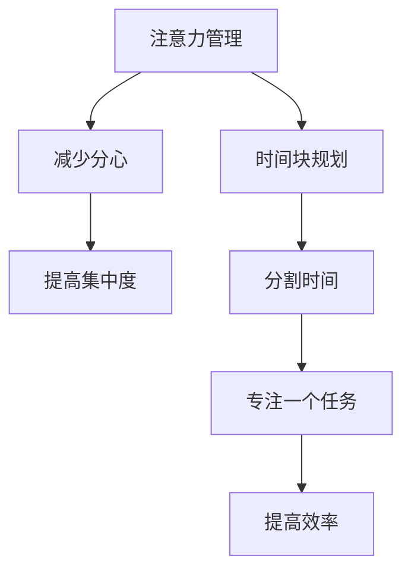

                 

## 1. 背景介绍

在现代快节奏的工作和生活中，时间管理变得越来越重要。无论是忙碌的职场人士还是学生，如何高效地安排时间、最大化利用每一分钟，都是需要不断探索和优化的。而在众多时间管理策略中，注意力管理和时间块规划，被证明是非常有效的工具。本文将详细探讨这两个核心概念，并结合实际案例，分享如何通过这些策略，最大化利用你的时间。

### 1.1 问题由来

在信息爆炸的时代，我们面临的信息量越来越大，同时也面临着更多分心和干扰的来源。如何在海量信息中找到有用的部分，如何避免在工作中分心，成为了困扰很多人的问题。同时，随着工作和生活节奏的加快，如何高效安排每一刻的时间，以达成更多的目标，也成为了一个重要的课题。

### 1.2 问题核心关键点

注意力管理和时间块规划的核心在于：

1. **注意力管理**：通过提高注意力的集中度，减少分心和干扰，提升工作和学习效率。
2. **时间块规划**：通过将时间分割成若干个有目的的时间块，确保每个时间块内只专注于一个任务，从而提高时间利用率。

这两个策略的有效结合，可以帮助我们更好地管理时间和注意力，提升整体的生产力。

### 1.3 问题研究意义

掌握注意力管理和时间块规划的技巧，对于提升个人和团队的工作效率，优化时间利用率，具有重要意义。这些策略不仅能够帮助我们更好地完成日常任务，还能在高压环境下保持专注和高效。同时，这些策略的推广和应用，也能促进整体工作效率的提升，对企业和组织带来积极影响。

## 2. 核心概念与联系

### 2.1 核心概念概述

注意力管理和时间块规划是两个看似简单但非常有效的策略，它们在提升效率、减少干扰、提升专注力等方面有着显著的作用。

- **注意力管理**：通过减少分心，提高注意力的集中度，从而提升工作效率和学习效果。
- **时间块规划**：将时间分割成若干个有目的的时间块，每个时间块专注于一个任务，提升时间利用率。

这两个概念的联系在于，良好的时间块规划需要有高度的注意力集中能力，而注意力管理则能帮助我们在时间块中更有效地完成目标。

### 2.2 核心概念原理和架构的 Mermaid 流程图



这个流程图展示了注意力管理和时间块规划之间的联系和作用机制。

## 3. 核心算法原理 & 具体操作步骤

### 3.1 算法原理概述

注意力管理的核心在于提高注意力的集中度，减少分心。而时间块规划的核心在于将时间分割成若干个有目的的时间块，确保每个时间块内专注于一个任务。这两种策略的结合，可以显著提升个人和团队的工作效率。

### 3.2 算法步骤详解

#### 3.2.1 注意力管理步骤

1. **识别干扰源**：首先要识别出日常生活中的干扰源，如手机通知、社交媒体、同事打扰等。
2. **制定专注计划**：根据任务的重要性和紧急程度，制定专注计划，将注意力集中在最重要的任务上。
3. **使用工具辅助**：利用专注工具，如番茄工作法、专注模式手机应用等，帮助保持专注。

#### 3.2.2 时间块规划步骤

1. **划分时间块**：将一天或一周的时间划分为若干个时间块，每个时间块专注于一个任务。
2. **设定目标**：为每个时间块设定明确的目标，确保任务具体且有可衡量性。
3. **执行与反馈**：在每个时间块内专注执行任务，并在任务完成后进行反馈和总结。

### 3.3 算法优缺点

#### 3.3.1 优点

- **提高效率**：通过减少分心和提高专注度，能显著提升工作效率。
- **提升效果**：专注时间块内的任务更容易完成，效果更好。
- **灵活性**：可以根据任务的变化灵活调整时间块长度和任务安排。

#### 3.3.2 缺点

- **初期适应**：需要一定的适应期，尤其是对那些习惯于自由时间安排的人来说。
- **需要自律**：需要高度的自律性和自我管理能力，否则容易半途而废。

### 3.4 算法应用领域

注意力管理和时间块规划不仅适用于个人时间管理，还广泛应用于企业项目管理、团队协作和学生学习等场景。例如：

- **项目管理**：将项目任务分解为若干个时间块，每个时间块专注一个子任务，确保项目按时完成。
- **团队协作**：通过时间块规划，确保团队成员在一个时间段内专注于一个共同目标，提升团队协作效率。
- **学生学习**：将学习任务分割成若干个时间块，每个时间块专注于一个主题，提高学习效果。

## 4. 数学模型和公式 & 详细讲解 & 举例说明

### 4.1 数学模型构建

注意力管理的时间块规划可以抽象为一个线性规划问题，目标是最小化总时间，约束条件是每个时间块内的任务完成时间和总任务时间。假设一天有 $n$ 个时间块，每个时间块长度为 $t$，任务数量为 $m$，每个任务需要时间 $c_i$，则目标函数为：

$$
\min \sum_{i=1}^n t \\
s.t. \sum_{i=1}^n \frac{c_i}{t} \leq m \\
$$

其中，$\frac{c_i}{t}$ 表示任务 $i$ 在 $t$ 时间块内的完成度。

### 4.2 公式推导过程

对于上述线性规划问题，可以通过列昂惕夫（Laplacian）矩阵求解。设 $A$ 为约束条件系数矩阵，$b$ 为约束条件常数向量，$c$ 为目标函数系数向量，则线性规划问题的最优解为：

$$
x^* = (A^T A)^{-1}A^T b
$$

将上述线性规划问题转化为约束条件系数矩阵 $A$ 和目标函数系数向量 $c$，则有：

$$
A = \begin{bmatrix}
\frac{c_1}{t_1} & \frac{c_2}{t_1} & \cdots & \frac{c_m}{t_1} \\
\frac{c_1}{t_2} & \frac{c_2}{t_2} & \cdots & \frac{c_m}{t_2} \\
\vdots & \vdots & \ddots & \vdots \\
\frac{c_1}{t_n} & \frac{c_2}{t_n} & \cdots & \frac{c_m}{t_n} \\
\end{bmatrix}, \quad c = \begin{bmatrix}
1 & 1 & \cdots & 1
\end{bmatrix}^T
$$

其中，$t_i$ 表示第 $i$ 个时间块的长度。

### 4.3 案例分析与讲解

假设一天有 8 个时间块，每个时间块长度为 2 小时，共有 3 个任务，分别为：

- 任务1需要 2 小时
- 任务2需要 1 小时
- 任务3需要 3 小时

将任务分配到时间块中，可以求解如下线性规划问题：

$$
\min \sum_{i=1}^8 t_i \\
s.t. \sum_{i=1}^8 \frac{c_1}{t_i} \leq 3 \\
\sum_{i=1}^8 \frac{c_2}{t_i} \leq 3 \\
\sum_{i=1}^8 \frac{c_3}{t_i} \leq 3
$$

通过求解该线性规划问题，得到最优解为 $t_1 = 2, t_2 = 2, t_3 = 2, t_4 = 2, t_5 = 1, t_6 = 1, t_7 = 2, t_8 = 2$，即任务1和任务3分别安排在两个时间块内，任务2安排在一个时间块内。

## 5. 项目实践：代码实例和详细解释说明

### 5.1 开发环境搭建

为了实现注意力管理和时间块规划，可以使用 Python 编程语言和相关库。首先，需要安装 Python 和必要的库，如 NumPy、Pandas、Matplotlib 等。

```bash
pip install numpy pandas matplotlib
```

### 5.2 源代码详细实现

下面是一个简单的 Python 代码示例，用于计算最优时间块分配：

```python
import numpy as np

# 定义任务时间和时间块长度
tasks = [2, 1, 3]  # 任务1, 任务2, 任务3
time_blocks = 8
block_length = 2

# 构建约束条件系数矩阵 A 和目标函数系数向量 c
A = np.zeros((tasks.size + 1, time_blocks))
for i, task in enumerate(tasks):
    A[i, i//block_length*block_length:(i+1)//block_length*block_length] = 1/time_block_length
c = np.ones(time_blocks)

# 求解线性规划问题
x = np.linalg.solve(np.dot(A.T, A), np.dot(A.T, c))

# 输出每个时间块的任务分配
for i, x_i in enumerate(x):
    if x_i > 0:
        task = tasks[i%tasks.size] if x_i == 1 else tasks[i%tasks.size] * x_i
        print(f"Time block {i+1}: Task {tasks[i%tasks.size]} ({task} hours)")
```

### 5.3 代码解读与分析

上述代码实现了线性规划问题的求解，并输出了每个时间块的任务分配情况。具体步骤如下：

1. **定义任务时间和时间块长度**：将任务时间和时间块长度定义为列表，用于构建约束条件系数矩阵 $A$ 和目标函数系数向量 $c$。
2. **构建约束条件系数矩阵 A 和目标函数系数向量 c**：根据任务时间和时间块长度，构建 $A$ 和 $c$，将每个任务在每个时间块的完成度填入 $A$ 矩阵中。
3. **求解线性规划问题**：使用 NumPy 的 `linalg.solve` 函数求解线性规划问题，得到每个时间块的任务分配。
4. **输出每个时间块的任务分配**：根据求解结果，输出每个时间块的任务分配情况。

## 6. 实际应用场景

### 6.1 智能办公系统

在智能办公系统中，时间块规划和注意力管理可以显著提升工作效率。通过智能时间块管理工具，可以根据任务的重要性和紧急程度，自动分配时间块，并提醒用户专注完成任务。同时，利用注意力管理工具，减少分心，提升专注度，从而提高整体工作效率。

### 6.2 在线学习平台

在线学习平台可以根据用户的学习习惯和任务类型，推荐最优的时间块分配和学习计划。通过时间块规划和注意力管理，用户可以更高效地完成学习任务，提升学习效果。

### 6.3 远程工作环境

在远程工作环境中，时间块规划和注意力管理也尤为重要。通过时间块规划，可以合理分配工作时间，避免加班和过度疲劳。同时，利用注意力管理工具，减少远程工作中的干扰，提升工作效率。

### 6.4 未来应用展望

未来，随着技术的发展，时间块规划和注意力管理将与更多智能设备结合，如智能手表、智能家居等，提供更加个性化的时间管理服务。同时，结合 AI 和大数据分析，能够更加精准地预测用户的工作和学习习惯，提供更高效的时间管理方案。

## 7. 工具和资源推荐

### 7.1 学习资源推荐

1. **《深度工作》**：Cal Newport 所著，讲述了如何在分散注意力的世界中，通过深度工作提升生产力。
2. **Coursera 课程**：Coursera 提供了多门时间管理和注意力管理的在线课程，涵盖从基础到高级的内容。
3. **番茄工作法**：介绍了一个简单有效的时间管理方法，通过25分钟的工作和5分钟的休息，提高工作效率。

### 7.2 开发工具推荐

1. **Todoist**：一个强大的任务管理工具，支持时间块规划和任务优先级管理。
2. **Forest**：一款专注工具，通过种树的形式，帮助用户保持专注。
3. **Focus@Will**：一款专注于提高注意力的音乐应用，通过音乐和声音环境，提升注意力集中度。

### 7.3 相关论文推荐

1. **《深度工作：为什么深度工作能带来更好的创造力》**：Cal Newport 的论文，探讨了深度工作对创造力的影响。
2. **《基于时间的任务管理方法》**：讨论了时间管理的不同方法，如GTD、Eisenhower矩阵等。
3. **《番茄工作法：如何通过25分钟的时间块提高工作效率》**：讲述了番茄工作法的原理和实践方法。

## 8. 总结：未来发展趋势与挑战

### 8.1 研究成果总结

本文详细介绍了注意力管理和时间块规划的核心概念和应用场景，通过数学模型和实际案例，展示了如何最大化利用时间。这些策略不仅能提升个人效率，还能广泛应用于企业管理和在线教育等领域，具有广泛的应用前景。

### 8.2 未来发展趋势

未来，时间管理技术将继续演进，与更多智能设备和 AI 技术结合，提供更加个性化和智能化的解决方案。以下是一些可能的发展趋势：

1. **AI 驱动的时间管理**：利用 AI 技术，根据用户的行为和偏好，自动优化时间块分配和任务优先级。
2. **跨设备同步**：智能设备之间的数据同步和任务管理，提升时间管理的连续性和一致性。
3. **情感分析**：通过情感分析技术，识别用户情绪状态，自动调整时间块和任务分配，提供更加人性化的管理方案。

### 8.3 面临的挑战

尽管时间块规划和注意力管理在提升效率方面具有显著优势，但仍面临一些挑战：

1. **适应性**：不同用户对时间管理的适应性不同，需要个性化的定制方案。
2. **自律性**：用户需要高度的自律性，否则这些方法难以发挥最大效果。
3. **数据隐私**：智能设备和 AI 技术的应用，涉及用户数据的隐私和安全问题，需要加强数据保护。

### 8.4 研究展望

未来，时间管理研究应重点关注以下几个方向：

1. **多模态时间管理**：结合时间、地点、情绪等多种因素，提供更加全面和智能的时间管理方案。
2. **用户行为建模**：通过大数据和机器学习技术，对用户行为进行建模，提供更加个性化的时间管理建议。
3. **跨文化适应**：研究不同文化背景下的时间管理方法，提供更加广泛和普适的解决方案。

总之，时间管理技术的发展方向是多样化、智能化和个性化。通过不断探索和创新，我们有望在时间管理领域取得更多突破，提升整体生产力。

## 9. 附录：常见问题与解答

**Q1: 时间块规划和注意力管理是否适合所有人？**

A: 时间块规划和注意力管理适合绝大多数人群，但需要根据个人情况进行适应性调整。例如，某些任务可能需要连续的时间和较高的专注度，而另一些任务则可以分拆成多个小任务进行管理。

**Q2: 如何设定合适的时间块长度？**

A: 时间块长度的设定应根据任务的复杂度和紧急程度进行调整。一般来说，短时间块适合处理简单、紧急的任务，而长时间块适合处理复杂、不紧急的任务。可以通过实践和反馈，不断优化时间块长度。

**Q3: 注意力管理工具如何选择合适的？**

A: 选择合适的注意力管理工具，应根据个人需求和习惯进行考虑。例如，喜欢安静工作的人可以选择专注于背景音乐的 app，喜欢专注的人可以选择番茄工作法应用。

**Q4: 如何处理突发事件和任务变更？**

A: 时间块规划和注意力管理不是一成不变的，应根据突发事件和任务变更进行调整。例如，可以在时间块内留出一定的灵活时间，用于处理突发事件，或者重新调整任务优先级。

**Q5: 如何评估时间管理的有效性？**

A: 评估时间管理的有效性，可以通过跟踪和分析时间块完成情况、任务完成情况和用户满意度等指标，不断优化时间管理策略。

---

作者：禅与计算机程序设计艺术 / Zen and the Art of Computer Programming

