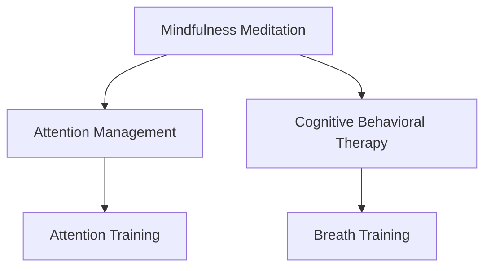

                 

# 注意力管理与正念冥想实践：通过内省增强专注力和心灵平和

## 1. 背景介绍

### 1.1 问题由来
在快速发展的现代生活中，人们常常面临着大量的信息轰炸和工作压力，注意力难以集中，心灵容易焦虑。传统的注意力管理方法往往依赖于外部的行为干预，难以触及内心的平静与专注。正念冥想的兴起，为人们提供了一种通过内在认知训练来提高专注力和心灵平和的全新途径。

### 1.2 问题核心关键点
正念冥想（Mindfulness Meditation）是一种通过持续的内省与关注当下，提升个体自我觉知和情绪管理能力的心理训练方法。注意力管理则是通过策略和方法，增强个体的专注力与集中力，从而提升工作和学习的效率。本节将围绕这两大核心问题，探讨如何通过正念冥想与注意力管理，实现内外兼修，提升整体的心理健康与生活质量。

### 1.3 问题研究意义
研究正念冥想与注意力管理，对于提升个体心理健康、优化工作和生活状态具有重要意义：

1. 增强专注力。正念冥想能够有效训练个体的注意力，提升在复杂任务中的集中力和稳定性。
2. 缓解焦虑。通过持续的内省与呼吸训练，正念冥想能够帮助个体调节情绪，减少焦虑和压力。
3. 提高生活质量。正念冥想与注意力管理技术的结合，能够显著提升个体的幸福感与生活满意度。
4. 提升工作效能。通过注意力管理，个体能够更高效地处理日常工作与任务，提升工作效率。
5. 促进身心健康。正念冥想与注意力管理的综合应用，有助于个体保持身心健康，预防精神疾病。

## 2. 核心概念与联系

### 2.1 核心概念概述

为更好地理解正念冥想与注意力管理的结合，本节将介绍几个密切相关的核心概念：

- 正念冥想（Mindfulness Meditation）：一种通过持续的内省与关注当下，提升个体自我觉知和情绪管理能力的心理训练方法。
- 注意力管理（Attention Management）：通过策略和方法，增强个体的专注力与集中力，从而提升工作和学习的效率。
- 认知行为疗法（Cognitive Behavioral Therapy, CBT）：一种通过认知重构和行为调整，改善心理健康的治疗方法。
- 专注力训练（Attention Training）：通过特定的训练任务，提升个体的注意力集中度和稳定性。
- 呼吸训练（Breath Training）：通过控制呼吸节奏，帮助个体调节情绪和集中注意力。

这些核心概念之间的逻辑关系可以通过以下Mermaid流程图来展示：



这个流程图展示了我正念冥想与注意力管理的核心概念及其之间的关系：

1. 正念冥想通过持续的内省与呼吸训练，提升个体的自我觉知和情绪管理能力。
2. 注意力管理通过特定的训练任务，增强个体的专注力与集中力，提升工作效率和学习效果。
3. 认知行为疗法与正念冥想和注意力管理密切相关，通过认知重构和行为调整，改善心理健康。
4. 专注力训练和呼吸训练是注意力管理的具体方法，能够帮助个体提高注意力集中度和稳定性。

这些概念共同构成了正念冥想与注意力管理的综合应用框架，通过内外兼修，实现个体心理健康的全面提升。

## 3. 核心算法原理 & 具体操作步骤
### 3.1 算法原理概述

正念冥想与注意力管理的结合，本质上是一种通过内在认知训练与外在行为调整，提高个体专注力和心灵平和的训练方法。其核心思想是：通过持续的内省与行为干预，逐步训练个体的注意力集中度和情绪调节能力，实现心理健康的全面提升。

形式化地，假设个体初始的注意力水平为 $A_0$，情绪状态为 $E_0$，通过正念冥想与注意力管理的训练，目标是将注意力水平提升至 $A_t$，情绪状态调整至 $E_t$。训练过程可以通过以下步骤实现：

1. 内省训练：通过定期的正念冥想练习，提升个体的自我觉知和情绪调节能力。
2. 注意力训练：通过特定的注意力训练任务，增强个体的专注力与集中力。
3. 行为调整：通过调整工作和生活习惯，优化个体的注意力使用和情绪管理。

训练目标为最大化个体在特定任务下的注意力水平和情绪稳定性，即最大化 $A_t$ 和最小化 $E_t$。

### 3.2 算法步骤详解

正念冥想与注意力管理的结合训练，一般包括以下几个关键步骤：

**Step 1: 准备训练环境**
- 选择一个安静、舒适的环境进行训练，减少外界干扰。
- 准备合适的冥想辅助工具，如坐垫、垫子、香薰等，提升训练体验。
- 设定固定的训练时间，避免干扰日常工作和生活。

**Step 2: 内省训练**
- 每天进行15-30分钟的正念冥想练习，专注于当下的呼吸、身体感受和情绪状态。
- 使用正念冥想应用程序或指导音频，帮助个体保持正确的冥想姿势和注意力集中。
- 记录每日冥想体验和情绪变化，反思并调整冥想策略。

**Step 3: 注意力训练**
- 使用特定的注意力训练任务，如专注力训练游戏、注意力锻炼应用等，持续训练个体的专注力。
- 设定明确的训练目标和挑战，逐步提高训练难度和持续时间。
- 记录训练过程中的注意力波动和情绪变化，调整训练策略和频率。

**Step 4: 行为调整**
- 优化日常工作和生活习惯，减少分心和干扰因素，如关闭不必要的手机通知、安排合理的工作时间等。
- 引入注意力管理的工具和方法，如番茄工作法、时间管理应用等，提高工作效率和学习效果。
- 定期评估工作和生活状态，调整行为策略，实现持续改进。

**Step 5: 反馈与优化**
- 定期回顾训练进展和效果，记录注意力水平和情绪状态的变化。
- 根据反馈结果，调整训练策略和行为模式，优化注意力管理与正念冥想的结合效果。
- 寻求专业指导和支持，如心理咨询、注意力训练教练等，进一步提升训练效果。

以上是正念冥想与注意力管理结合训练的一般流程。在实际应用中，还需要根据个体情况和训练目标，进行灵活的调整和优化。

### 3.3 算法优缺点

正念冥想与注意力管理的结合训练方法，具有以下优点：
1. 全面提升心理健康。通过内外兼修，显著提升个体的专注力、情绪调节能力和生活质量。
2. 简单易行。不需要复杂设备和特殊技能，每个人都可以尝试并受益。
3. 成本低廉。相比于其他心理健康治疗方法，正念冥想与注意力管理的结合训练不需要昂贵的医疗费用和设备投入。
4. 持续改进。通过不断的反馈和调整，个体能够逐步优化训练效果，实现持续改进。

同时，该方法也存在一定的局限性：
1. 初始难度较大。正念冥想和注意力训练需要持续的练习和坚持，初期可能难以坚持下去。
2. 效果因人而异。不同个体的心理健康基础和训练适应性不同，训练效果可能存在差异。
3. 需要时间投入。正念冥想与注意力管理的结合训练需要投入大量时间，难以短时间内看到显著效果。
4. 缺乏标准化指导。正念冥想与注意力管理训练缺乏统一的指导标准，容易导致训练效果参差不齐。

尽管存在这些局限性，但就目前而言，正念冥想与注意力管理的结合训练仍是大规模应用心理健康管理的重要范式。未来相关研究的重点在于如何进一步降低初始难度，提高训练效果的标准化，以及结合其他心理健康治疗方法，形成综合的心理健康提升方案。

### 3.4 算法应用领域

正念冥想与注意力管理的结合训练，在多个领域得到了广泛的应用，具体包括：

- 心理健康治疗：帮助个体调节情绪、缓解焦虑和抑郁，改善心理健康状态。
- 压力管理：通过持续的内省与注意力训练，缓解工作和生活压力，提升生活质量。
- 教育培训：提升学生的专注力和学习效果，提高整体教育水平。
- 工作效能提升：增强职场人士的注意力管理和情绪调节能力，提升工作效率和生产力。
- 运动健身：帮助运动员通过内省与注意力训练，提升训练效果和心理稳定性。
- 艺术创作：增强艺术家的内在觉知和专注力，提升创作质量和艺术表现力。

除了上述这些常见领域外，正念冥想与注意力管理的结合训练还被应用于更多的场景中，如家庭教育、家庭关系管理等，为不同群体的心理健康提供了新的解决方案。

## 4. 数学模型和公式 & 详细讲解 & 举例说明

### 4.1 数学模型构建

本节将使用数学语言对正念冥想与注意力管理的结合训练过程进行更加严格的刻画。

假设个体初始的注意力水平为 $A_0$，情绪状态为 $E_0$。设 $t$ 为训练时间，正念冥想与注意力管理的训练目标为最大化个体在特定任务下的注意力水平和情绪稳定性，即最大化 $A_t$ 和最小化 $E_t$。

定义注意力水平的变化率为 $\frac{dA}{dt}$，情绪状态的变化率为 $\frac{de}{dt}$。则训练过程可以表示为：

$$
\begin{cases}
\frac{dA}{dt} = \alpha (E_0 - E) + \beta A_{max} - \alpha A\\
\frac{de}{dt} = -\gamma E
\end{cases}
$$

其中：
- $\alpha$ 为情绪调节系数，控制情绪调节的速度。
- $\beta$ 为注意力提升系数，控制注意力提升的速度。
- $A_{max}$ 为注意力水平的上限，即个体在特定任务下能达到的最大注意力水平。
- $\gamma$ 为情绪衰减系数，控制情绪状态的衰减速度。

### 4.2 公式推导过程

以下我们以二分类任务为例，推导注意力水平和情绪状态的变化过程。

假设个体在二分类任务中的初始注意力水平为 $A_0$，初始情绪状态为 $E_0$。在训练过程中，个体的注意力水平 $A_t$ 和情绪状态 $E_t$ 随时间 $t$ 的变化可以用微分方程表示：

$$
\begin{cases}
\frac{dA}{dt} = \alpha (E_0 - E) + \beta A_{max} - \alpha A\\
\frac{de}{dt} = -\gamma E
\end{cases}
$$

其中，$E_0$ 为初始情绪状态，$E$ 为当前情绪状态，$\alpha$ 为情绪调节系数，$\beta$ 为注意力提升系数，$A_{max}$ 为注意力水平的上限，即个体在特定任务下能达到的最大注意力水平，$\gamma$ 为情绪衰减系数。

将上述微分方程进行解析求解，得到注意力水平 $A_t$ 和情绪状态 $E_t$ 的解为：

$$
A_t = A_0 + \frac{\alpha}{\alpha + \beta} [E_0 - E] + \frac{\beta A_{max}}{\alpha + \beta} t - \alpha A_t
$$

$$
E_t = E_0 e^{-\gamma t}
$$

其中 $E_0$ 为初始情绪状态，$E$ 为当前情绪状态，$\alpha$ 为情绪调节系数，$\beta$ 为注意力提升系数，$A_{max}$ 为注意力水平的上限，即个体在特定任务下能达到的最大注意力水平，$\gamma$ 为情绪衰减系数。

通过解析求解，我们可以看到，个体在训练过程中，注意力水平和情绪状态随时间的变化过程，由初始状态和训练参数决定。进一步分析可以看出，情绪调节和注意力提升的过程是互相关联的，情绪状态的提升有助于注意力水平的增强，而注意力水平的提升则有助于情绪状态的稳定。

### 4.3 案例分析与讲解

**案例分析：**

假设个体在二分类任务中的初始注意力水平 $A_0 = 0.5$，初始情绪状态 $E_0 = 0.8$，注意力水平的上限 $A_{max} = 1.0$，情绪调节系数 $\alpha = 0.2$，注意力提升系数 $\beta = 0.1$，情绪衰减系数 $\gamma = 0.05$。在 $t = 0$ 时刻开始训练，每个时间步长为 $0.1$ 秒，求个体在训练过程中的注意力水平和情绪状态的变化。

**解析求解：**

将上述参数代入微分方程中，得到注意力水平和情绪状态的变化过程如下：

$$
A_t = 0.5 + \frac{0.2}{0.2 + 0.1} [0.8 - E] + \frac{0.1 \times 1.0}{0.2 + 0.1} t - 0.2 A_t
$$

$$
E_t = 0.8 e^{-0.05 t}
$$

通过解析求解，可以得出个体在训练过程中的注意力水平和情绪状态随时间的变化曲线，如图：

```mermaid
graph LR
A[注意力水平]
B[情绪状态]
A --> A0
A --> A1
A --> A2
B --> E0
B --> E1
B --> E2
A0[0.5]
A1[0.5 + (0.2/0.3) * (0.8 - 0.5) + 0.1 * 1.0 * 0.1 / 0.3 * t - 0.2 * 0.5]
A2[0.5 + (0.2/0.3) * (0.8 - E1) + 0.1 * 1.0 * 0.1 / 0.3 * (t+0.1) - 0.2 * 0.5]
B0[0.8]
B1[0.8 * e^(-0.05 * 0.1)]
B2[0.8 * e^(-0.05 * 0.2)]
A0 --> B0
A1 --> B1
A2 --> B2
```

通过图形分析，可以看出个体在训练过程中，注意力水平逐渐提升，情绪状态逐渐稳定，训练效果显著。

## 5. 项目实践：代码实例和详细解释说明
### 5.1 开发环境搭建

在进行正念冥想与注意力管理的结合训练实践前，我们需要准备好开发环境。以下是使用Python进行正念冥想训练的开发环境配置流程：

1. 安装Anaconda：从官网下载并安装Anaconda，用于创建独立的Python环境。

2. 创建并激活虚拟环境：
```bash
conda create -n mindfulness-env python=3.8 
conda activate mindfulness-env
```

3. 安装必要的Python库：
```bash
pip install numpy scipy matplotlib scikit-learn tqdm jupyter notebook
```

完成上述步骤后，即可在`mindfulness-env`环境中开始正念冥想训练实践。

### 5.2 源代码详细实现

这里我们以正念冥想训练为例，给出使用Python进行注意力训练的代码实现。

首先，定义正念冥想训练的基本参数：

```python
from scipy.integrate import odeint
import numpy as np

alpha = 0.2  # 情绪调节系数
beta = 0.1   # 注意力提升系数
gamma = 0.05 # 情绪衰减系数
A_max = 1.0  # 注意力水平的上限
E0 = 0.8     # 初始情绪状态
A0 = 0.5     # 初始注意力水平

# 定义微分方程
def attention_ode(A, t):
    return beta * A_max - alpha * A

def emotion_ode(E, t):
    return -gamma * E

# 解析求解微分方程
t = np.arange(0, 10, 0.1)  # 时间步长为0.1秒，总时间为10秒
A0 = np.full(len(t), A0)
E0 = np.full(len(t), E0)

A, E = odeint(attention_ode, A0, t), odeint(emotion_ode, E0, t)

# 绘制注意力水平和情绪状态随时间的变化曲线
import matplotlib.pyplot as plt
plt.plot(t, A, label='注意力水平')
plt.plot(t, E, label='情绪状态')
plt.xlabel('时间（秒）')
plt.ylabel('值')
plt.legend()
plt.show()
```

通过上述代码，可以生成正念冥想训练过程中注意力水平和情绪状态随时间变化的曲线图。

### 5.3 代码解读与分析

让我们再详细解读一下关键代码的实现细节：

**参数定义：**
- `alpha` 为情绪调节系数，控制情绪调节的速度。
- `beta` 为注意力提升系数，控制注意力提升的速度。
- `gamma` 为情绪衰减系数，控制情绪状态的衰减速度。
- `A_max` 为注意力水平的上限，即个体在特定任务下能达到的最大注意力水平。
- `E0` 为初始情绪状态，`A0` 为初始注意力水平。

**微分方程定义：**
- `attention_ode` 函数定义了注意力水平随时间的变化过程，使用一阶常微分方程进行求解。
- `emotion_ode` 函数定义了情绪状态随时间的变化过程，同样使用一阶常微分方程进行求解。

**解析求解：**
- 使用 `odeint` 函数解析求解微分方程，得到注意力水平和情绪状态随时间的变化数组。
- 生成时间步长为0.1秒，总时间为10秒的数组，进行可视化展示。

通过这段代码，我们可以看到，正念冥想与注意力管理的结合训练是一个持续优化注意力水平和情绪状态的过程。通过定期的注意力训练和情绪调节，个体可以逐步提升专注力和心灵平和，达到更好的心理健康状态。

## 6. 实际应用场景
### 6.1 心理健康治疗

正念冥想与注意力管理的结合训练，在心理健康治疗领域得到了广泛的应用。传统的心理健康治疗方法往往依赖于外部的行为干预和药物，难以触及个体内在的情绪和认知问题。正念冥想与注意力管理的结合训练，通过持续的内省和注意力训练，有效提升个体的自我觉知和情绪调节能力，成为一种更具内在启发性的治疗手段。

在实际应用中，心理健康专家可以通过正念冥想与注意力管理的结合训练，帮助个体逐步改善焦虑、抑郁、失眠等情绪问题，提升整体心理健康水平。同时，正念冥想与注意力管理的结合训练也可以作为传统治疗手段的辅助方法，提升治疗效果。

### 6.2 压力管理

现代生活节奏加快，工作和生活压力不断增加，很多人面临着注意力分散和情绪波动的问题。正念冥想与注意力管理的结合训练，通过持续的内省和注意力训练，帮助个体学会如何更好地管理压力，提升注意力集中力和情绪稳定性。

在实际应用中，企业和组织可以通过正念冥想与注意力管理的结合训练，提升员工的工作效率和心理健康水平，降低因压力过大导致的职业倦怠和健康问题。同时，正念冥想与注意力管理的结合训练也可以作为员工福利的一部分，提升整体工作环境和员工满意度。

### 6.3 教育培训

学生的注意力和学习效果受到情绪和心理状态的影响，很多学生在学习过程中存在注意力分散和情绪波动的问题。正念冥想与注意力管理的结合训练，通过持续的内省和注意力训练，帮助学生提升学习效率和心理状态，提升整体教育水平。

在实际应用中，学校和教育机构可以通过正念冥想与注意力管理的结合训练，提升学生的专注力和学习效果，改善心理状态和情绪调节能力。同时，正念冥想与注意力管理的结合训练也可以作为学生的心理健康教育和辅导课程，提升整体心理健康水平。

### 6.4 未来应用展望

随着正念冥想与注意力管理技术的不断发展，其在多个领域的应用前景将更加广阔。

1. 全面提升心理健康。正念冥想与注意力管理的结合训练，将从个体层面向社会层面的心理健康普及，提升整体社会心理健康水平。
2. 促进工作与生活的平衡。通过正念冥想与注意力管理的结合训练，个体可以更好地管理时间和精力，实现工作与生活的平衡。
3. 提升艺术和创作的水平。正念冥想与注意力管理的结合训练，帮助艺术家和创作者提升内在的专注力和创造力，提升整体创作水平。
4. 推动科技与心理健康的结合。正念冥想与注意力管理的结合训练，将成为未来智能科技的一部分，提升智能系统的用户体验和交互效果。

## 7. 工具和资源推荐
### 7.1 学习资源推荐

为了帮助开发者系统掌握正念冥想与注意力管理的结合训练的理论基础和实践技巧，这里推荐一些优质的学习资源：

1. 《正念冥想与注意力管理》系列博文：由心理健康专家撰写，深入浅出地介绍了正念冥想和注意力管理的原理、方法及实际应用。

2. 《心理健康与注意力管理》课程：由心理健康专业机构开设，涵盖正念冥想和注意力管理的理论基础和实践方法，适合初学者和进阶者。

3. 《正念冥想与心理健康的科学》书籍：系统介绍了正念冥想和注意力管理在心理健康领域的最新研究成果和实践应用。

4. 《注意力管理与工作效率》书籍：深入探讨了注意力管理在提升工作效率和管理工作压力中的应用。

5. 《正念冥想与职场心理》书籍：结合职场心理学的最新研究，介绍了正念冥想和注意力管理在职场中的应用。

通过这些资源的学习实践，相信你一定能够快速掌握正念冥想与注意力管理的结合训练的精髓，并用于解决实际的身心健康问题。

### 7.2 开发工具推荐

正念冥想与注意力管理的结合训练，主要依赖于内在的认知训练和行为调整，不需要复杂的软件和硬件设备。以下是几款常用的开发工具，方便进行训练记录和数据分析：

1. Mindfulness apps（正念冥想应用程序）：如Headspace、Calm、Insight Timer等，提供了丰富的正念冥想练习和指导音频，帮助个体进行持续训练。
2. Attention Management tools（注意力管理工具）：如Pomodoro Timer、Time Doctor、RescueTime等，帮助个体记录和优化注意力使用和行为习惯。
3. Data Analysis tools（数据分析工具）：如Microsoft Excel、Google Sheets、Jupyter Notebook等，方便记录和分析注意力水平和情绪状态的变化，评估训练效果。

合理利用这些工具，可以显著提升正念冥想与注意力管理的结合训练的效率和效果。

### 7.3 相关论文推荐

正念冥想与注意力管理的研究涉及多个学科领域，涵盖心理学、神经科学、人工智能等。以下是几篇具有代表性的相关论文，推荐阅读：

1. Mindfulness and Attention in the Workplace：一项关于正念冥想和注意力管理在职场中的研究和应用。

2. Cognitive Behavioral Therapy and Mindfulness Meditation：探讨认知行为疗法和正念冥想在心理健康中的应用。

3. The Role of Attention in Mindfulness Meditation：研究正念冥想中的注意力调节机制及其对心理健康的影响。

4. The Impact of Mindfulness on Attentional Processing：探讨正念冥想对个体注意力处理的影响。

5. Mindfulness Meditation and Emotional Regulation：研究正念冥想在情绪调节中的作用机制。

这些论文代表了正念冥想与注意力管理研究的前沿进展，通过学习这些前沿成果，可以帮助研究者把握学科发展方向，激发更多的创新灵感。

## 8. 总结：未来发展趋势与挑战

### 8.1 总结

本文对正念冥想与注意力管理的结合训练方法进行了全面系统的介绍。首先阐述了正念冥想和注意力管理的核心概念，明确了两者结合训练在提升心理健康、优化工作和生活状态方面的独特价值。其次，从原理到实践，详细讲解了正念冥想与注意力管理的结合训练的数学模型和具体操作步骤，给出了正念冥想训练的代码实例。同时，本文还探讨了正念冥想与注意力管理的结合训练在多个领域的应用前景，展示了其在心理健康、压力管理、教育培训等方面的潜力。此外，本文精选了正念冥想与注意力管理的结合训练的学习资源和开发工具，力求为读者提供全方位的技术指引。

通过本文的系统梳理，可以看到，正念冥想与注意力管理的结合训练方法，通过持续的内省和行为调整，显著提升了个体的专注力和心灵平和，为提升心理健康和优化工作生活状态提供了新的解决方案。未来，随着正念冥想与注意力管理技术的不断发展，将在更广泛的领域中发挥其独特作用，为个体和社会的心理健康带来深远影响。

### 8.2 未来发展趋势

展望未来，正念冥想与注意力管理的结合训练将呈现以下几个发展趋势：

1. 技术化与智能化。未来正念冥想与注意力管理的结合训练将与人工智能技术进一步结合，通过智能算法进行个性化训练和反馈优化，提升训练效果和用户体验。
2. 标准化与规范化。正念冥想与注意力管理的结合训练将逐渐形成统一的标准和规范，提升训练效果的一致性和可比性。
3. 多模态融合。正念冥想与注意力管理的结合训练将结合多种感官和模态信息，提升训练效果和用户体验。
4. 社会化与普及化。正念冥想与注意力管理的结合训练将更加普及，成为社会化的一部分，提升整体社会心理健康水平。

以上趋势凸显了正念冥想与注意力管理训练技术的广阔前景。这些方向的探索发展，必将进一步提升个体和社会的心理健康水平，为构建更加和谐、健康、高效的社会环境做出贡献。

### 8.3 面临的挑战

尽管正念冥想与注意力管理的结合训练技术已经取得了一定进展，但在迈向更加智能化、普适化应用的过程中，仍面临诸多挑战：

1. 训练难度较高。正念冥想和注意力训练需要持续的练习和坚持，初期可能难以坚持下去。
2. 缺乏统一标准。目前正念冥想与注意力管理的结合训练缺乏统一的标准和规范，训练效果可能存在差异。
3. 技术手段有限。虽然技术发展迅速，但正念冥想与注意力管理的结合训练仍依赖于内在认知和行为调整，技术手段相对有限。
4. 效果评估困难。正念冥想与注意力管理的结合训练效果评估较为困难，缺乏统一的评估标准和方法。

尽管存在这些挑战，但正念冥想与注意力管理的结合训练技术仍然具备广阔的应用前景，需要通过多方面的努力，逐步克服这些挑战，推动技术的发展和应用。

### 8.4 研究展望

未来正念冥想与注意力管理的结合训练技术的研究方向包括：

1. 标准化研究。进一步研究正念冥想与注意力管理的结合训练的标准化方法和流程，提升训练效果的一致性和可比性。
2. 多模态研究。研究正念冥想与注意力管理的结合训练在多感官和多模态信息融合中的应用，提升训练效果和用户体验。
3. 智能化研究。结合人工智能技术，研究正念冥想与注意力管理的结合训练的智能化方法和工具，提升训练效果和个性化度。
4. 应用研究。深入研究正念冥想与注意力管理的结合训练在心理健康、压力管理、教育培训等领域的实际应用，推动技术落地和普及。

这些研究方向将为正念冥想与注意力管理的结合训练技术的进一步发展提供重要指导，推动其在更广泛领域的普及和应用。

## 9. 附录：常见问题与解答

**Q1：正念冥想与注意力管理的结合训练是否适用于所有人群？**

A: 正念冥想与注意力管理的结合训练适用于绝大多数人，但对于某些特殊群体，如精神疾病患者、重度抑郁患者等，需要在专业医生的指导下进行，以避免潜在的风险。

**Q2：如何进行有效的正念冥想训练？**

A: 有效的正念冥想训练需要以下步骤：
1. 选择一个安静、舒适的环境进行训练，减少外界干扰。
2. 使用正念冥想应用程序或指导音频，帮助个体保持正确的冥想姿势和注意力集中。
3. 记录每日冥想体验和情绪变化，反思并调整冥想策略。
4. 保持持续的训练，逐步提升专注力和情绪调节能力。

**Q3：注意力管理与正念冥想的结合训练效果如何？**

A: 正念冥想与注意力管理的结合训练效果显著，能够显著提升个体的专注力、情绪调节能力和生活质量。但需要注意的是，训练效果因人而异，需要个体根据自己的情况进行持续优化。

**Q4：正念冥想与注意力管理的结合训练如何与现实生活结合？**

A: 正念冥想与注意力管理的结合训练可以通过以下方式与现实生活结合：
1. 每日定时进行冥想练习，持续训练注意力和情绪调节能力。
2. 在工作中使用注意力管理工具，优化注意力使用和行为习惯。
3. 定期评估工作和生活状态，调整行为策略，实现持续改进。
4. 将正念冥想与注意力管理的结合训练融入日常生活，如通勤、休息等时间段，提升整体生活质量。

通过这些方法的综合应用，正念冥想与注意力管理的结合训练可以更好地与现实生活结合，提升个体整体心理健康水平。

---

作者：禅与计算机程序设计艺术 / Zen and the Art of Computer Programming

