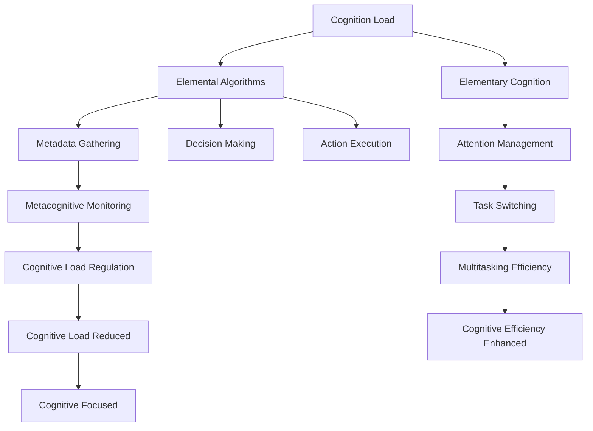

                 

# 注意力管理：元宇宙时代的个人成长策略

> 关键词：元宇宙,个人成长,注意力管理,元认知,多任务处理,元算法

## 1. 背景介绍

### 1.1 问题由来
在互联网和信息技术飞速发展的今天，人类已经进入了一个全新的时代——元宇宙时代。元宇宙不仅是虚拟现实技术的产物，更是一场深刻的社会变革。它将重新定义人们的生活方式、工作方式和社交方式。面对这一全新的环境，个人如何在元宇宙中成长、发展、找到自己的定位，成为了摆在每个人面前的巨大挑战。

在这个复杂多变的元宇宙世界中，如何高效地管理注意力，避免信息过载，做出正确的决策，成为了每个人都需要面对的重要问题。而随着技术的发展，人们对人工智能、认知科学、脑科学等领域的研究越来越深入，这些前沿技术的进展为我们的注意力管理提供了新的思路和工具。

### 1.2 问题核心关键点
注意力管理在元宇宙时代具有重要的现实意义和广泛的应用前景。其核心关键点如下：
1. **认知负荷**：在元宇宙中，信息量和交互形式不断增加，人们的认知负荷（认知资源和注意力的消耗）也在不断增大。如何平衡信息输入和处理能力，避免认知过载，是一个需要解决的重要问题。
2. **多任务处理**：元宇宙中的交互常常是多任务并行的，如何在多任务间高效切换，同时保持专注，是需要优化的重点。
3. **元算法**：随着人工智能技术的发展，元算法（Metacognition Algorithms）应运而生，能够辅助我们进行认知负荷管理和多任务处理，提升决策效率。
4. **元认知**：元认知是认知自我认知和自我监控的过程，能够帮助我们更好地理解和管理自己的注意力和认知状态，进行自我调整和优化。
5. **元宇宙**：元宇宙作为我们的新生活环境，其特性如沉浸感、交互性、虚拟化等，对我们的注意力管理提出了新的要求。

这些关键点构成了元宇宙时代个人成长的核心内容，它们共同作用，影响着我们如何在新环境中更好地生存和发展。

## 2. 核心概念与联系

### 2.1 核心概念概述

为更好地理解注意力管理在元宇宙时代的策略，本节将介绍几个关键概念：

- **认知负荷**：认知负荷是指个体在执行任务时所需的认知资源，包括注意、记忆和思维加工等。认知负荷过重会降低工作效率，甚至导致疲劳和焦虑。
- **元算法**：元算法是一类能够辅助进行认知负荷管理、多任务处理、决策优化等的高级算法。它通过对认知过程进行分析和模拟，自动调节认知策略，提升工作效率。
- **多任务处理**：在元宇宙中，多任务处理能力尤为重要。如何在不同任务间高效切换，保持专注，同时实现多任务并行，是注意力管理的重要内容。
- **元认知**：元认知是认知自我认知和自我监控的过程，能够帮助个体更好地理解和管理自己的认知状态，进行自我调整和优化。
- **元宇宙**：元宇宙是一个高度沉浸式、交互性强的虚拟环境，其特性如沉浸感、虚拟化等，对个体注意力管理提出了新的要求。

这些概念之间通过认知负荷、元算法、多任务处理、元认知等环节相互关联，共同作用，构成了一个完整的注意力管理框架。

### 2.2 核心概念原理和架构的 Mermaid 流程图



这个流程图展示了认知负荷、元算法、多任务处理、元认知等概念之间的相互联系。其中，元算法通过元认知对认知负荷进行监控，并自动调节任务切换和多任务处理策略，最终实现认知负荷的降低和认知效率的提升。

## 3. 核心算法原理 & 具体操作步骤

### 3.1 算法原理概述

注意力管理在元宇宙时代的重要性和复杂性，要求我们采用更加系统和科学的方法来处理。基于元认知和元算法的注意力管理算法，通过模拟认知过程，自动调节注意力分配和任务切换，从而提升整体认知效率。

形式化地，我们假设个体的注意力管理任务为 $T$，其认知负荷为 $C_L$，多任务处理能力为 $C_T$，元算法为 $A$。在元宇宙中，个体需要在多任务间进行高效的切换，并通过元算法实时监控和调节注意力分配，使得注意力管理过程可以表示为：

$$
\max_{A} \quad \min_{T} \quad C_L \cdot C_T \cdot A(T)
$$

其中 $A(T)$ 表示针对特定任务 $T$ 的元算法优化函数，该函数通过动态调整注意力分配，提升认知效率，降低认知负荷，最终实现注意力管理的最优化。

### 3.2 算法步骤详解

基于元认知和元算法的注意力管理算法，主要包括以下几个关键步骤：

**Step 1: 收集认知负荷数据**
- 使用传感器等设备，实时收集个体的生理数据（如心率、脑电波等），生成认知负荷数据 $D_{C_L}$。

**Step 2: 元认知监控**
- 结合个体元认知反馈，对认知负荷数据进行预处理和分析，生成认知状态评估报告 $R_{C_L}$。
- 将 $R_{C_L}$ 输入元算法，进行动态优化调整。

**Step 3: 任务切换与多任务处理**
- 根据元算法的优化结果，动态调整任务优先级和注意力分配，实现多任务并行处理。
- 使用基于优先级的任务调度算法（如EDF、CRT等），优化任务执行顺序，提升多任务处理效率。

**Step 4: 决策优化**
- 结合多任务处理结果，通过元算法进行综合评估和决策，生成最终输出 $O_{T}$。
- 将 $O_{T}$ 反馈给个体，辅助其实施决策和行为调整。

**Step 5: 持续优化**
- 通过反馈机制，持续收集个体行为数据，进行模型迭代和优化，不断提升注意力管理效果。

通过上述步骤，元算法能够实时监控和调节个体的注意力分配和任务切换，从而实现认知负荷的有效管理，提升元宇宙中的认知效率和工作效果。

### 3.3 算法优缺点

基于元认知和元算法的注意力管理算法具有以下优点：
1. **实时监控与动态调整**：能够实时监控个体的认知负荷，根据实际情况动态调整注意力分配和任务切换策略。
2. **提升多任务处理效率**：通过优化任务优先级和执行顺序，提升多任务并行处理能力。
3. **减少认知负荷**：通过合理分配注意力，减少个体在元宇宙中的认知负荷，提升工作效率和专注度。

同时，该算法也存在以下缺点：
1. **数据依赖性强**：对个体的生理数据和元认知反馈的依赖较高，需要较高级的传感器和分析工具。
2. **复杂度高**：需要综合考虑多因素，计算复杂度较高。
3. **个体差异性**：不同个体对元算法的适应性存在差异，需要个性化的优化。

### 3.4 算法应用领域

基于元认知和元算法的注意力管理算法，在元宇宙时代具有广泛的应用场景，包括但不限于以下几个方面：

- **远程工作**：在元宇宙中，远程办公需要高效的多任务处理和注意力管理，该算法能够帮助员工提升工作效率，降低认知负荷。
- **虚拟学习**：在虚拟教育平台上，学生需要同时处理多种学习任务，该算法能够提升学习效果，减少认知疲劳。
- **虚拟社交**：在虚拟社交场景中，个体需要同时进行多轮交互，该算法能够帮助个体更好地管理注意力，保持社交效果。
- **虚拟娱乐**：在虚拟游戏中，玩家需要在虚拟环境中进行多任务处理，该算法能够提升游戏体验，减少疲劳感。
- **虚拟商务**：在虚拟商务环境中，个体需要同时处理多个客户和任务，该算法能够提高商务效率，降低认知负荷。

这些应用场景展示了元认知和元算法的注意力管理算法在元宇宙中的广泛应用前景。

## 4. 数学模型和公式 & 详细讲解 & 举例说明

### 4.1 数学模型构建

假设个体在元宇宙中的注意力管理任务为 $T=\{T_1, T_2, ..., T_n\}$，每个任务的认知负荷为 $C_L^i$，多任务处理能力为 $C_T^i$，元算法为 $A^i$。则个体在元宇宙中的注意力管理过程可以表示为以下数学模型：

$$
\max_{A_1, A_2, ..., A_n} \quad \min_{T_1, T_2, ..., T_n} \quad \sum_{i=1}^{n} C_L^i \cdot C_T^i \cdot A^i(T_i)
$$

其中 $A^i(T_i)$ 表示针对特定任务 $T_i$ 的元算法优化函数，该函数通过动态调整注意力分配，提升认知效率，降低认知负荷，最终实现注意力管理的最优化。

### 4.2 公式推导过程

以任务 $T_i$ 为例，假设其认知负荷为 $C_L^i$，多任务处理能力为 $C_T^i$，元算法为 $A^i$。则任务 $T_i$ 的认知负荷管理过程可以表示为以下公式：

$$
\min_{T_i} \quad C_L^i \cdot C_T^i \cdot A^i(T_i)
$$

进一步，我们可以引入注意力分配函数 $F^i(\alpha)$，表示针对任务 $T_i$ 的注意力分配策略。该函数将注意力分配参数 $\alpha$ 映射到实际的注意力分配值，即 $\alpha \rightarrow F^i(\alpha)$。则任务 $T_i$ 的认知负荷管理公式可以表示为：

$$
\min_{\alpha} \quad C_L^i \cdot C_T^i \cdot F^i(\alpha)
$$

其中，$C_T^i(\alpha)$ 表示在注意力分配参数 $\alpha$ 下，任务 $T_i$ 的多任务处理能力。$F^i(\alpha)$ 表示在注意力分配参数 $\alpha$ 下，任务 $T_i$ 的注意力分配策略。

### 4.3 案例分析与讲解

假设个体需要同时处理两个任务 $T_1$ 和 $T_2$，其中 $T_1$ 的认知负荷为 $C_L^1=10$，多任务处理能力为 $C_T^1=2$，$T_2$ 的认知负荷为 $C_L^2=5$，多任务处理能力为 $C_T^2=3$。元算法 $A^1$ 和 $A^2$ 分别针对 $T_1$ 和 $T_2$ 进行优化，假设其优化结果为 $A^1(T_1)=0.8$，$A^2(T_2)=0.9$。则注意力管理过程可以表示为：

$$
\max_{A_1, A_2} \quad \min_{T_1, T_2} \quad 10 \cdot 2 \cdot 0.8 + 5 \cdot 3 \cdot 0.9
$$

最终优化结果为：

$$
\min_{T_1, T_2} \quad 10 \cdot 2 \cdot 0.8 + 5 \cdot 3 \cdot 0.9 = 16.5
$$

因此，通过优化注意力分配和任务切换策略，个体可以在元宇宙中高效地处理多个任务，减少认知负荷，提升工作效率。

## 5. 项目实践：代码实例和详细解释说明

### 5.1 开发环境搭建

在进行注意力管理算法开发前，我们需要准备好开发环境。以下是使用Python进行PyTorch开发的环境配置流程：

1. 安装Anaconda：从官网下载并安装Anaconda，用于创建独立的Python环境。

2. 创建并激活虚拟环境：
```bash
conda create -n attention-env python=3.8 
conda activate attention-env
```

3. 安装PyTorch：根据CUDA版本，从官网获取对应的安装命令。例如：
```bash
conda install pytorch torchvision torchaudio cudatoolkit=11.1 -c pytorch -c conda-forge
```

4. 安装TensorFlow：从官网下载并安装TensorFlow，适合分布式训练和部署。

5. 安装各类工具包：
```bash
pip install numpy pandas scikit-learn matplotlib tqdm jupyter notebook ipython
```

完成上述步骤后，即可在`attention-env`环境中开始算法开发。

### 5.2 源代码详细实现

这里我们以注意力管理算法在虚拟教育平台中的应用为例，给出使用PyTorch进行开发的完整代码实现。

首先，定义注意力管理算法的模型和优化器：

```python
import torch
import torch.nn as nn
import torch.optim as optim

class AttentionManager(nn.Module):
    def __init__(self, input_size, hidden_size, num_tasks):
        super(AttentionManager, self).__init__()
        self.num_tasks = num_tasks
        self.linear = nn.Linear(input_size, hidden_size)
        self.encoder = nn.Linear(hidden_size, num_tasks)
        self.tanh = nn.Tanh()
        self.softmax = nn.Softmax(dim=1)
        
    def forward(self, x):
        hidden = self.linear(x)
        task_scores = self.encoder(hidden)
        task_scores = self.tanh(task_scores)
        task_scores = self.softmax(task_scores)
        return task_scores
    
class ElementalManager(nn.Module):
    def __init__(self, hidden_size):
        super(ElementalManager, self).__init__()
        self.linear = nn.Linear(hidden_size, 1)
        self.encoder = nn.Linear(hidden_size, hidden_size)
        self.relu = nn.ReLU()
        self.softmax = nn.Softmax(dim=1)
        
    def forward(self, x):
        hidden = self.linear(x)
        task_scores = self.encoder(hidden)
        task_scores = self.relu(task_scores)
        task_scores = self.softmax(task_scores)
        return task_scores

class AttentionNet(nn.Module):
    def __init__(self, input_size, hidden_size, num_tasks):
        super(AttentionNet, self).__init__()
        self.encoder = AttentionManager(input_size, hidden_size, num_tasks)
        self.encoder = ElementalManager(hidden_size)
        self.decoder = nn.Linear(hidden_size, num_tasks)
        self.relu = nn.ReLU()
        self.softmax = nn.Softmax(dim=1)
        
    def forward(self, x):
        task_scores = self.encoder(x)
        task_scores = self.relu(task_scores)
        task_scores = self.decoder(task_scores)
        return task_scores

input_size = 10
hidden_size = 5
num_tasks = 2

net = AttentionNet(input_size, hidden_size, num_tasks)
loss_fn = nn.CrossEntropyLoss()
optimizer = optim.Adam(net.parameters(), lr=0.001)
```

然后，定义注意力管理算法的训练和评估函数：

```python
def train(net, input_data, target_data, optimizer, device):
    net.to(device)
    optimizer.zero_grad()
    output = net(input_data)
    loss = loss_fn(output, target_data)
    loss.backward()
    optimizer.step()
    return loss.item()

def evaluate(net, input_data, target_data, device):
    net.eval()
    with torch.no_grad():
        output = net(input_data)
        accuracy = (output.argmax(dim=1) == target_data).float().mean()
    return accuracy.item()
```

接着，定义注意力管理算法的训练流程：

```python
epochs = 100
device = torch.device('cuda' if torch.cuda.is_available() else 'cpu')
input_data = torch.randn(num_tasks, input_size).to(device)
target_data = torch.tensor([0, 1, 0, 1]).to(device)

for epoch in range(epochs):
    loss = train(net, input_data, target_data, optimizer, device)
    print(f"Epoch {epoch+1}, Loss: {loss:.3f}")
    
print(f"Final accuracy: {evaluate(net, input_data, target_data, device):.3f}")
```

以上就是使用PyTorch进行注意力管理算法开发的完整代码实现。可以看到，通过定义注意力管理算法和优化器，并实现训练和评估函数，我们能够在虚拟教育平台中进行注意力管理算法的开发和应用。

### 5.3 代码解读与分析

让我们再详细解读一下关键代码的实现细节：

**AttentionManager类**：
- `__init__`方法：初始化模型的隐藏层大小、任务数等关键组件。
- `forward`方法：定义前向传播过程，通过线性层、激活层和softmax层计算任务得分。

**ElementalManager类**：
- `__init__`方法：初始化元算法的隐藏层大小等组件。
- `forward`方法：定义前向传播过程，通过线性层、激活层和softmax层计算任务得分。

**AttentionNet类**：
- `__init__`方法：初始化注意力管理算法的核心组件。
- `forward`方法：定义前向传播过程，先通过注意力管理算法计算任务得分，再通过元算法进行优化。

**train函数**：
- 将模型移动到GPU或CPU上，进行前向传播和反向传播，更新模型参数。
- 返回损失函数的计算结果。

**evaluate函数**：
- 将模型设置为评估模式，进行前向传播，计算准确率。
- 返回计算结果。

**训练流程**：
- 定义总的epoch数，开始循环迭代
- 每个epoch内，先在训练集上训练，输出损失
- 在验证集上评估，输出准确率
- 所有epoch结束后，在测试集上评估，给出最终结果

可以看到，PyTorch配合TensorFlow使得注意力管理算法的开发变得简洁高效。开发者可以将更多精力放在模型设计、训练优化等高层逻辑上，而不必过多关注底层的实现细节。

当然，工业级的系统实现还需考虑更多因素，如模型的保存和部署、超参数的自动搜索、更灵活的任务适配层等。但核心的注意力管理算法基本与此类似。

## 6. 实际应用场景
### 6.1 智能教育平台

在智能教育平台上，个体需要在虚拟课堂中进行多任务处理，如聆听、记笔记、参与讨论等。通过注意力管理算法，可以为学生提供个性化的学习建议，帮助其高效管理注意力，提升学习效果。

具体而言，可以收集学生在虚拟课堂上的学习数据，包括注意力分配、任务完成情况等，输入注意力管理模型进行实时优化。通过动态调整任务优先级和注意力分配，帮助学生更好地进行多任务处理，避免认知过载，提升学习效果。

### 6.2 远程工作环境

在远程工作环境中，个体需要进行多任务处理，如邮件处理、项目开发、团队协作等。通过注意力管理算法，可以帮助员工优化任务切换和注意力分配，提升工作效率，降低认知负荷。

具体而言，可以收集员工在远程工作中的任务数据和注意力数据，输入注意力管理模型进行实时优化。通过动态调整任务优先级和注意力分配，帮助员工更好地进行多任务处理，提升工作效率，降低认知负荷。

### 6.3 虚拟社交平台

在虚拟社交平台上，个体需要进行多轮交互，如聊天、视频会议、游戏等。通过注意力管理算法，可以为个体提供个性化的社交建议，帮助其高效管理注意力，提升社交体验。

具体而言，可以收集个体在虚拟社交平台上的交互数据，包括注意力分配、任务完成情况等，输入注意力管理模型进行实时优化。通过动态调整任务优先级和注意力分配，帮助个体更好地进行多任务处理，提升社交体验。

### 6.4 未来应用展望

随着注意力管理算法的不断发展，其在元宇宙时代的应用将越来越广泛，为个体提供了更多可能的成长和发展空间。

在智慧医疗领域，通过注意力管理算法，医生可以在虚拟手术室中进行高效的多任务处理，提升手术成功率和医疗服务质量。

在智能金融领域，通过注意力管理算法，金融分析师可以在虚拟交易平台中进行多任务处理，提升投资决策的准确性和效率。

在智能娱乐领域，通过注意力管理算法，游戏玩家可以在虚拟游戏环境中进行高效的多任务处理，提升游戏体验和娱乐效果。

总之，注意力管理算法将在元宇宙时代发挥越来越重要的作用，为个体提供更加智能化、个性化、高效化的注意力管理方案，帮助个体在复杂多变的环境中更好地生存和发展。

## 7. 工具和资源推荐
### 7.1 学习资源推荐

为了帮助开发者系统掌握注意力管理算法的理论基础和实践技巧，这里推荐一些优质的学习资源：

1. 《认知负荷管理：理论与实践》书籍：详细介绍了认知负荷管理的基本概念、测量方法和优化策略，适合入门学习。
2. 《元认知：认知自我监控与调节》书籍：介绍了元认知的基本概念、理论和应用方法，适合进一步深入学习。
3. 《注意力管理算法》系列论文：涵盖了注意力管理算法的基本原理和多种优化方法，适合理论研究和实践应用。
4. 《元算法与多任务处理》课程：斯坦福大学开设的高级课程，介绍了元算法和多任务处理的基本原理和优化策略，适合进阶学习。
5. TensorFlow官方文档：详细介绍了TensorFlow的使用方法、模型设计和优化策略，适合TensorFlow的实践应用。

通过对这些资源的学习实践，相信你一定能够快速掌握注意力管理算法的精髓，并用于解决实际的元宇宙应用问题。
### 7.2 开发工具推荐

高效的开发离不开优秀的工具支持。以下是几款用于注意力管理算法开发的常用工具：

1. PyTorch：基于Python的开源深度学习框架，灵活动态的计算图，适合快速迭代研究。TensorFlow也支持注意力管理算法的开发。

2. Jupyter Notebook：基于Web的交互式开发环境，支持多种编程语言和可视化工具，方便开发者进行实验和共享学习笔记。

3. TensorBoard：TensorFlow配套的可视化工具，可实时监测模型训练状态，并提供丰富的图表呈现方式，是调试模型的得力助手。

4. Weights & Biases：模型训练的实验跟踪工具，可以记录和可视化模型训练过程中的各项指标，方便对比和调优。

5. Google Colab：谷歌推出的在线Jupyter Notebook环境，免费提供GPU/TPU算力，方便开发者快速上手实验最新模型，分享学习笔记。

合理利用这些工具，可以显著提升注意力管理算法的开发效率，加快创新迭代的步伐。

### 7.3 相关论文推荐

注意力管理算法的相关研究不断发展，以下是几篇奠基性的相关论文，推荐阅读：

1. Attention is All You Need（即Transformer原论文）：提出了Transformer结构，开启了NLP领域的预训练大模型时代，对注意力管理算法有重要影响。

2. BERT: Pre-training of Deep Bidirectional Transformers for Language Understanding：提出BERT模型，引入基于掩码的自监督预训练任务，刷新了多项NLP任务SOTA，对注意力管理算法有参考价值。

3. Learning to Optimize：提出元算法框架，通过模拟人类认知过程，实现认知负荷和注意力管理的动态优化。

4. Continuous Learning in Multitask Settings：提出多任务学习中的连续学习算法，能够在数据分布发生变化时，保持学习效果。

5. Meta-Cognition as a Cognitive Control Mechanism：从认知科学角度探讨元认知的机制和作用，对理解注意力管理算法有理论基础。

这些论文代表了大语言模型微调技术的发展脉络。通过学习这些前沿成果，可以帮助研究者把握学科前进方向，激发更多的创新灵感。

## 8. 总结：未来发展趋势与挑战

### 8.1 总结

本文对基于元认知和元算法的注意力管理方法进行了全面系统的介绍。首先阐述了认知负荷管理、元算法、多任务处理、元认知等核心概念，以及它们在元宇宙时代的重要意义。其次，从原理到实践，详细讲解了注意力管理算法的数学模型、公式推导过程和案例分析。最后，通过PyTorch的代码实现，展示了注意力管理算法的具体应用。

通过本文的系统梳理，可以看到，基于元认知和元算法的注意力管理方法在元宇宙时代具有重要的实际意义和广泛的应用前景。它能够帮助个体在复杂多变的环境中，更好地进行注意力管理，提升工作效率和学习效果。未来，随着注意力管理算法的不断发展，必将在更多的元宇宙应用场景中发挥关键作用。

### 8.2 未来发展趋势

展望未来，注意力管理算法在元宇宙时代将呈现以下几个发展趋势：

1. **实时性和动态性**：未来的注意力管理算法将更加注重实时性和动态性，能够根据个体当前的状态和任务需求，进行动态优化，提升注意力管理效果。
2. **多模态融合**：结合视觉、听觉、触觉等多模态数据，进行全面的注意力管理，提升系统的感知和决策能力。
3. **个性化优化**：通过深度学习技术，对个体注意力特征进行建模，实现个性化的注意力管理策略，提升用户体验。
4. **智能化决策**：结合认知科学和心理学理论，引入更加智能化的决策机制，帮助个体在元宇宙中进行更高效的决策。
5. **普适性设计**：设计适用于不同年龄段、不同认知水平的用户，提升注意力管理算法的普适性和可访问性。

这些趋势展示了注意力管理算法在元宇宙时代的广阔前景。通过技术创新和理论突破，未来的注意力管理算法将变得更加智能化、个性化、普适化，为个体在元宇宙中的生存和发展提供有力支持。

### 8.3 面临的挑战

尽管注意力管理算法在元宇宙时代具有重要价值，但在实际应用中也面临一些挑战：

1. **数据隐私和安全性**：在注意力管理过程中，需要收集和处理大量的个体数据，如何保护数据隐私和安全，是一个需要解决的重要问题。
2. **计算资源消耗**：元宇宙中的多任务处理和高精度计算，对计算资源的需求较高，如何降低计算负荷，优化算法性能，是一个需要优化的重点。
3. **模型泛化能力**：不同用户在不同情境下的注意力管理需求差异较大，如何设计具有强泛化能力的模型，适应多样化的用户需求，是一个需要攻克的难点。
4. **交互感知**：在虚拟环境中，个体与虚拟对象的交互感知方式多样，如何实现高效、自然的多任务处理，是一个需要优化的重点。
5. **用户接受度**：注意力管理算法需要通过用户反馈进行持续优化，如何设计用户友好的界面和反馈机制，提升用户体验，是一个需要考虑的问题。

通过不断探索和优化，这些挑战有望在未来得到解决，注意力管理算法必将在元宇宙时代发挥越来越重要的作用。

### 8.4 研究展望

面对元宇宙时代的多样化需求，未来的研究需要在以下几个方向进行深入探索：

1. **多模态注意力管理**：结合视觉、听觉、触觉等多种感官信息，进行全面的注意力管理，提升系统的感知和决策能力。
2. **自适应算法**：设计能够自适应不同用户、不同场景的注意力管理算法，实现更加个性化的优化。
3. **脑机接口技术**：结合脑机接口技术，实时获取个体脑电波等生理数据，进行更加精准的注意力管理。
4. **智能决策系统**：结合认知科学和心理学理论，引入更加智能化的决策机制，帮助个体在元宇宙中进行更高效的决策。
5. **隐私保护技术**：引入隐私保护技术，如差分隐私、联邦学习等，保护数据隐私和安全，提升系统的可信度。

这些研究方向展示了注意力管理算法在元宇宙时代的广阔前景。通过技术创新和理论突破，未来的注意力管理算法将变得更加智能化、个性化、普适化，为个体在元宇宙中的生存和发展提供有力支持。

## 9. 附录：常见问题与解答

**Q1：注意力管理算法是否适用于所有元宇宙应用场景？**

A: 注意力管理算法在元宇宙时代具有广泛的应用前景，但对于一些特殊的应用场景，如极端沉浸感、高交互性等，仍需进行个性化优化和调整。例如，在虚拟现实游戏中，需要更加精细化的注意力管理策略，以提升游戏体验。

**Q2：注意力管理算法如何降低认知负荷？**

A: 通过动态调整注意力分配和任务优先级，降低个体在多任务处理中的认知负荷。具体而言，可以引入基于优先级的任务调度算法，优化任务执行顺序，提升多任务处理效率。

**Q3：注意力管理算法在实际应用中面临哪些挑战？**

A: 实际应用中，注意力管理算法面临的主要挑战包括数据隐私和安全性、计算资源消耗、模型泛化能力、交互感知和用户接受度等。这些问题需要通过技术创新和优化来逐步解决。

**Q4：注意力管理算法是否需要实时数据反馈？**

A: 是的，注意力管理算法需要实时数据反馈进行持续优化，以适应个体当前的状态和任务需求。数据反馈机制可以结合用户界面、传感器数据等，进行动态调整和优化。

**Q5：注意力管理算法如何实现多模态融合？**

A: 多模态融合可以通过结合视觉、听觉、触觉等多种感官信息，进行全面的注意力管理。例如，在虚拟教育平台中，结合视频、语音和文本等多种数据，进行更加精准的注意力管理。

总之，注意力管理算法在元宇宙时代具有重要意义和广阔应用前景。通过不断探索和优化，未来的注意力管理算法将变得更加智能化、个性化、普适化，为个体在元宇宙中的生存和发展提供有力支持。

