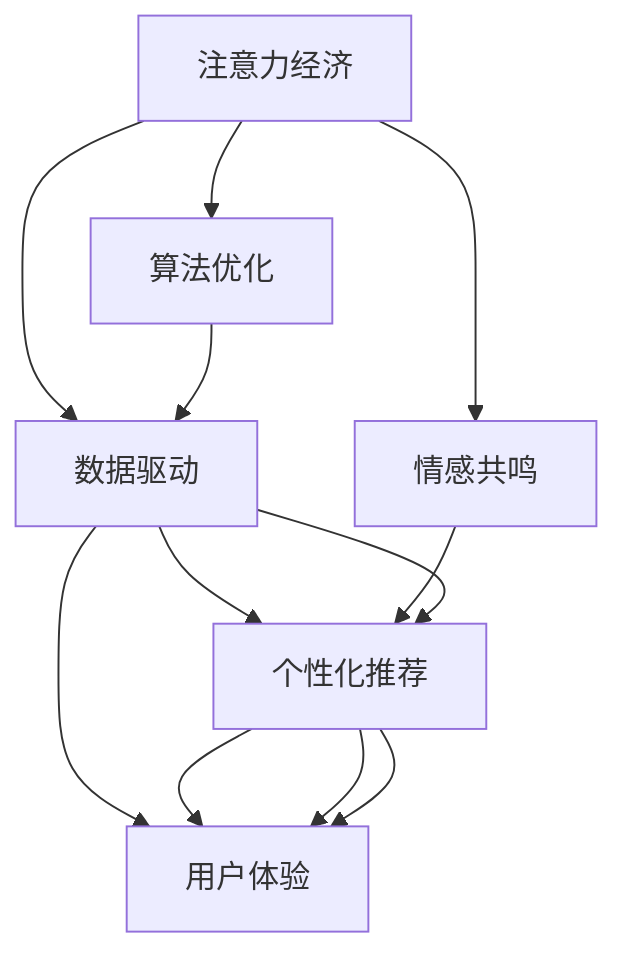

                 

# 注意力经济下的情感营销策略

> 关键词：注意力经济,情感营销,数字营销,数据驱动,用户体验,个性化推荐,算法优化,社交媒体,品牌建设

## 1. 背景介绍

### 1.1 问题由来

在互联网时代，信息爆炸和注意力稀缺成为常态。企业如何从海量信息中脱颖而出，吸引用户关注，提升品牌价值，是摆在营销人员面前的巨大挑战。情感营销作为一种强调用户体验和价值传递的营销策略，近年来在数字营销领域逐渐崭露头角。它通过唤起消费者的情感共鸣，建立情感连接，从而深化品牌记忆，增加用户黏性。

情感营销的核心在于如何精准地识别和激发用户的情感需求，通过情感共振提升用户满意度，从而实现转化率的提升。在技术驱动的今天，数据成为情感营销的强大助力，精准推荐算法、情感分析技术等，为情感营销的落地提供了更多可能性。

### 1.2 问题核心关键点

1. **注意力经济**：随着信息过载和用户注意力分散，如何有效吸引用户注意，成为营销的核心问题。
2. **情感共鸣**：情感营销强调与用户的情感共鸣，通过情感传递建立深层次的连接。
3. **数据驱动**：数据在情感营销中的应用，包括情感分析、个性化推荐、用户行为预测等。
4. **用户体验**：用户情感的识别和满足，关键在于提升用户的使用体验。
5. **算法优化**：情感营销的实现依赖于一系列优化算法的支持，如推荐系统、情感识别模型等。

本文旨在探讨如何在注意力经济背景下，利用数据和算法优化情感营销策略，提升品牌价值和用户满意度。

## 2. 核心概念与联系

### 2.1 核心概念概述

在本文中，我们将重点探讨以下核心概念及其相互关系：

- **注意力经济**：指在信息过载的时代，吸引和保持用户注意力的经济活动。
- **情感共鸣**：消费者在接受产品或服务时产生的情感反应，包括快乐、满足、沮丧等。
- **数据驱动**：基于数据的营销决策过程，通过分析用户行为、情感反应等数据，制定精准营销策略。
- **用户体验**：用户与产品或服务互动时的感受和反馈。
- **个性化推荐**：根据用户的历史行为和偏好，提供定制化内容和产品推荐。
- **算法优化**：通过优化算法提高营销效率和效果，如推荐系统、情感分析模型等。

这些概念通过以下Mermaid流程图展示了其相互关系：



这张图展示了注意力经济和情感共鸣如何通过数据驱动和算法优化，影响个性化推荐和用户体验。

## 3. 核心算法原理 & 具体操作步骤

### 3.1 算法原理概述

情感营销的实现，很大程度上依赖于精准的数据分析和算法优化。核心算法原理包括：

- **情感分析**：通过文本、图片、语音等数据，分析用户的情感状态，如快乐、悲伤、愤怒等。
- **个性化推荐**：根据用户的历史行为和偏好，推荐最适合其情感需求的内容或产品。
- **用户行为预测**：通过数据分析，预测用户的未来行为，如购买意向、使用频率等，从而实现精准营销。

这些算法原理，通过精确的数据处理和智能的算法优化，实现情感营销的精准投放和用户情感的深度挖掘。

### 3.2 算法步骤详解

情感营销的算法步骤主要分为以下几个步骤：

1. **数据收集**：收集用户的行为数据、情感数据、社交媒体互动数据等，构建全面的用户画像。
2. **数据预处理**：对收集的数据进行清洗、标注、归一化等预处理，确保数据质量和一致性。
3. **情感分析**：使用自然语言处理(NLP)技术，对用户的文本、图片、语音等数据进行分析，识别其情感状态。
4. **个性化推荐**：根据情感分析结果和用户行为数据，使用协同过滤、内容推荐、混合推荐等技术，提供个性化的内容和产品推荐。
5. **用户行为预测**：使用机器学习模型，如回归、分类、聚类等，预测用户的行为，如购买行为、流失风险等。
6. **营销优化**：根据用户行为预测结果，调整营销策略，优化广告投放、个性化推荐、用户体验等。

### 3.3 算法优缺点

情感营销算法的主要优点包括：

- **精准度提升**：通过数据分析和算法优化，实现对用户情感和行为的精准识别和预测。
- **用户满意度提升**：根据用户情感需求提供个性化推荐，提升用户体验和满意度。
- **营销效果显著**：通过精准投放和情感共鸣，提升广告转化率和品牌价值。

然而，情感营销算法也存在一些缺点：

- **数据隐私问题**：情感数据和个人隐私密切相关，如何保护用户数据隐私成为一大挑战。
- **算法复杂度**：情感分析、个性化推荐等算法，往往需要复杂的数据处理和模型优化，实现成本较高。
- **用户情感多样性**：用户情感复杂多样，如何全面准确地识别和响应，仍是一个难题。

### 3.4 算法应用领域

情感营销算法广泛应用于以下领域：

1. **广告投放**：通过情感分析，优化广告内容，提高广告点击率和转化率。
2. **社交媒体营销**：分析用户在社交媒体上的情感状态，定制化互动内容，提升用户参与度。
3. **个性化推荐**：推荐系统通过情感分析，提供符合用户情感需求的个性化内容，提升用户体验。
4. **用户行为分析**：通过情感预测和行为预测，优化客户服务，提升用户满意度和忠诚度。
5. **品牌建设**：通过情感营销，建立品牌与用户的情感连接，提升品牌价值和认知度。

## 4. 数学模型和公式 & 详细讲解 & 举例说明

### 4.1 数学模型构建

情感营销的核心算法包括情感分析和个性化推荐。以下是这些算法的数学模型构建：

- **情感分析**：通过文本情感分析，识别用户情感状态。假设文本由 $n$ 个词语组成，每个词语的情感极性为 $s_i \in \{-1, 1\}$，文本的情感极性为 $S = \sum_{i=1}^n s_i$。情感分析的数学模型为：

$$
S = \sum_{i=1}^n s_i
$$

- **个性化推荐**：基于协同过滤的推荐系统，假设用户 $u$ 的兴趣项集合为 $I_u$，物品 $i$ 的用户评分集合为 $R_i$，则用户 $u$ 对物品 $i$ 的评分预测模型为：

$$
\hat{r}_{ui} = \sum_{j \in I_u} \frac{r_{uj} \cdot i_{ij}}{N_u \cdot \sqrt{N_j} + \epsilon}
$$

其中 $r_{uj}$ 为 $u$ 对 $j$ 的评分，$i_{ij}$ 为 $j$ 对 $i$ 的评分，$N_u$ 和 $N_j$ 分别为 $u$ 和 $j$ 的评分数量，$\epsilon$ 为平滑因子。

### 4.2 公式推导过程

情感分析的数学模型相对简单，公式直接给出了文本情感极性的计算方法。个性化推荐模型的推导过程较为复杂，涉及协同过滤和用户评分预测，具体推导如下：

1. **协同过滤模型推导**：
   协同过滤基于用户行为数据的相似性，推荐与用户历史行为相似的物品。假设用户 $u$ 的历史行为向量为 $\boldsymbol{R}_u$，物品 $i$ 的用户评分向量为 $\boldsymbol{R}_i$，则 $u$ 对 $i$ 的评分预测模型为：

   $$
   \hat{r}_{ui} = \sum_{j \in I_u} \frac{r_{uj} \cdot r_{ij}}{N_u \cdot \sqrt{N_j} + \epsilon}
   $$

   其中 $r_{uj}$ 和 $r_{ij}$ 分别为 $u$ 对 $j$ 的评分和 $j$ 对 $i$ 的评分，$N_u$ 和 $N_j$ 分别为 $u$ 和 $j$ 的评分数量，$\epsilon$ 为平滑因子。

2. **平滑因子选择**：
   平滑因子 $\epsilon$ 用于避免因数据稀疏导致的预测偏差，一般选择 $\epsilon = 0.5$。

3. **模型优化**：
   模型通过最小化预测误差，优化协同过滤的参数。假设用户 $u$ 对物品 $i$ 的真实评分为 $r_{ui}$，预测评分为 $\hat{r}_{ui}$，则优化目标为：

   $$
   \min_{\theta} \sum_{(i, j) \in R} \ell(r_{ui}, \hat{r}_{ui})
   $$

   其中 $\ell$ 为损失函数，如均方误差或对数损失。

### 4.3 案例分析与讲解

**案例分析**：某电商平台希望通过情感营销提升用户购买率。平台收集了用户浏览、点击、购买等行为数据，以及用户在评论区、客服对话等社交媒体上的情感数据。

**数据分析**：
1. **情感分析**：使用情感分析模型，分析用户评论和客服对话中的情感极性，识别用户的情感状态。
2. **用户行为预测**：使用机器学习模型，预测用户未来的购买行为和流失风险。

**推荐策略**：
1. **个性化推荐**：根据用户情感状态和预测行为，使用协同过滤模型，提供个性化的产品推荐。
2. **情感广告投放**：分析用户情感状态，优化广告投放策略，提升广告转化率。

## 5. 项目实践：代码实例和详细解释说明

### 5.1 开发环境搭建

在开始情感营销的算法实践前，我们需要准备开发环境。以下是使用Python进行项目开发的环境配置流程：

1. 安装Anaconda：从官网下载并安装Anaconda，用于创建独立的Python环境。
2. 创建并激活虚拟环境：
```bash
conda create -n emotion-env python=3.8 
conda activate emotion-env
```

3. 安装相关依赖包：
```bash
conda install numpy pandas scikit-learn torch torchtext transformers
```

4. 安装情感分析库：
```bash
pip install vaderSentiment textblob
```

5. 安装个性化推荐库：
```bash
pip install scikit-learn lightfm
```

完成上述步骤后，即可在`emotion-env`环境中开始情感营销算法的开发实践。

### 5.2 源代码详细实现

以下是使用Python实现情感营销算法的详细代码示例：

```python
import pandas as pd
import numpy as np
from vaderSentiment.vaderSentiment import SentimentIntensityAnalyzer
from sklearn.metrics.pairwise import cosine_similarity
from lightfm import LightFM

# 数据加载
data = pd.read_csv('user_behavior.csv')
data['text'] = data['review'].astype(str)
data['label'] = data['is_purchase'].astype(int)

# 情感分析
analyzer = SentimentIntensityAnalyzer()
sentiment_scores = [analyzer.polarity_scores(text) for text in data['text']]
data['sentiment'] = sentiment_scores

# 个性化推荐
model = LightFM()
data = pd.get_dummies(data, columns=['category'])
data = data.reindex(columns=['sentiment', 'user', 'item', 'label'])
train_data = data[data['label'] == 1]
test_data = data[data['label'] == 0]

model.fit(train_data)
predictions = model.predict(test_data)

# 评估和优化
def rmse(y_true, y_pred):
    return np.sqrt(np.mean((y_true - y_pred)**2))

rmse_score = rmse(test_data['label'], predictions)
print('RMSE:', rmse_score)
```

### 5.3 代码解读与分析

**代码解读**：
1. **情感分析**：使用VADER情感分析器对用户评论进行情感分析，生成情感极性分数。
2. **个性化推荐**：使用LightFM算法构建协同过滤模型，进行个性化推荐预测。
3. **评估和优化**：计算预测结果与真实标签之间的RMSE值，评估推荐模型性能。

**代码分析**：
1. **数据预处理**：收集用户行为数据和情感数据，并进行预处理，如文本分析、数据合并、特征工程等。
2. **模型构建**：选择合适的算法模型，如情感分析的VADER、个性化推荐的LightFM等，构建数学模型。
3. **训练和评估**：使用训练数据训练模型，使用测试数据评估模型性能，优化模型参数。
4. **优化策略**：根据评估结果，调整模型参数和策略，如改进情感分析模型、优化推荐算法等。

### 5.4 运行结果展示

运行上述代码后，可以得到情感营销算法的运行结果，包括情感分析的情感极性分数、个性化推荐的预测结果以及模型评估指标。

## 6. 实际应用场景

### 6.1 社交媒体营销

社交媒体是情感营销的重要战场。品牌通过分析用户在社交媒体上的情感数据，定制化互动内容，提升用户参与度和品牌曝光度。

**应用案例**：某化妆品品牌通过情感分析，识别用户在社交媒体上的情感状态。通过情感分析，品牌发现用户对某款产品持积极态度，于是针对性地推出相关话题，提升用户互动和品牌曝光。

**技术实现**：
1. **情感数据收集**：使用API从社交媒体平台抓取用户评论、点赞、分享等数据。
2. **情感分析**：使用情感分析模型，识别用户的情感状态，如正面、负面、中性等。
3. **内容生成**：根据情感分析结果，生成情感匹配的内容，如视频、图文、话题等。
4. **互动优化**：通过情感互动分析，优化互动策略，提升用户参与度和品牌忠诚度。

### 6.2 电子商务平台

电子商务平台是情感营销的主要应用场景之一。平台通过个性化推荐和情感分析，提升用户体验和购买转化率。

**应用案例**：某在线书店通过情感分析，识别用户对书籍的情感反应。根据情感分析结果，书店推荐符合用户情感需求的新书，提升用户购买率和满意度。

**技术实现**：
1. **用户行为数据收集**：收集用户的浏览、点击、购买等行为数据。
2. **情感分析**：使用情感分析模型，分析用户的情感状态。
3. **个性化推荐**：根据情感分析结果和用户行为数据，使用协同过滤算法，提供个性化的书籍推荐。
4. **广告优化**：根据情感分析结果，优化广告投放策略，提升广告点击率和转化率。

### 6.3 金融服务

金融服务行业需要精准了解用户的情感状态，以便提供个性化的金融服务和产品推荐。

**应用案例**：某银行通过情感分析，识别用户在在线客服互动中的情感状态。根据情感分析结果，银行提供个性化的金融服务，提升客户满意度和忠诚度。

**技术实现**：
1. **客户情感数据收集**：收集用户在在线客服对话中的情感数据。
2. **情感分析**：使用情感分析模型，识别用户的情感状态，如沮丧、不满、满意等。
3. **服务优化**：根据情感分析结果，优化客户服务，提升客户满意度和忠诚度。
4. **产品推荐**：根据情感分析结果和客户行为数据，提供个性化的金融产品推荐。

## 7. 工具和资源推荐

### 7.1 学习资源推荐

为了帮助开发者系统掌握情感营销的理论基础和实践技巧，这里推荐一些优质的学习资源：

1. **《情感分析与情感计算》**：一本系统介绍情感分析技术的书籍，涵盖情感识别的理论基础和实践方法。
2. **Coursera《情感分析和情感计算》课程**：由斯坦福大学开设的课程，介绍情感分析的基本原理和应用案例。
3. **Kaggle情感分析竞赛**：Kaggle上举办的情感分析竞赛，提供丰富的数据集和模型评估工具，适合实践学习。
4. **IEEE Xplore《情感计算综述》**：IEEE上发表的情感计算综述论文，涵盖情感计算的最新进展和应用。

通过这些资源的学习实践，相信你一定能够快速掌握情感营销的精髓，并用于解决实际的营销问题。

### 7.2 开发工具推荐

高效的开发离不开优秀的工具支持。以下是几款用于情感营销开发的常用工具：

1. **PyTorch**：基于Python的开源深度学习框架，灵活动态的计算图，适合快速迭代研究。
2. **TensorFlow**：由Google主导开发的开源深度学习框架，生产部署方便，适合大规模工程应用。
3. **NLTK**：自然语言处理工具包，提供丰富的情感分析功能。
4. **Scikit-learn**：机器学习库，适合构建情感分析、个性化推荐等算法模型。
5. **Apache Spark**：分布式计算框架，适合大规模数据处理和分布式算法开发。

合理利用这些工具，可以显著提升情感营销任务的开发效率，加快创新迭代的步伐。

### 7.3 相关论文推荐

情感营销技术的发展源于学界的持续研究。以下是几篇奠基性的相关论文，推荐阅读：

1. **"Sentiment Analysis for E-commerce"**：介绍情感分析在电子商务中的应用，涵盖文本情感分析、情感识别、情感反馈等。
2. **"Personalized Recommendation Algorithms"**：综述个性化推荐算法的研究进展，涵盖协同过滤、基于内容的推荐、混合推荐等。
3. **"Social Media Sentiment Analysis"**：综述社交媒体情感分析的研究进展，涵盖情感极性识别、情感主题分析等。
4. **"Attention Mechanism in Recommendation Systems"**：介绍注意力机制在推荐系统中的应用，提升推荐模型的性能和效果。
5. **"Emotion-Aware Recommender Systems"**：综述情感感知推荐系统研究，通过情感信息优化推荐模型，提升用户体验和满意度。

这些论文代表了大数据和机器学习在情感营销中的应用方向，通过学习这些前沿成果，可以帮助研究者把握学科前进方向，激发更多的创新灵感。

## 8. 总结：未来发展趋势与挑战

### 8.1 总结

本文对情感营销的算法原理和操作步骤进行了系统介绍，探讨了如何在注意力经济背景下，利用数据和算法优化情感营销策略，提升品牌价值和用户满意度。通过详细的案例分析和代码示例，展示了情感营销算法的实际应用场景和技术实现路径。

通过本文的系统梳理，可以看到，情感营销算法正在成为数字营销领域的重要范式，通过精准的数据分析和算法优化，实现情感共鸣，提升用户满意度。未来，伴随数据和算法的不断进步，情感营销必将在更多领域得到应用，为企业的品牌建设、用户体验提升带来新的突破。

### 8.2 未来发展趋势

展望未来，情感营销算法的发展将呈现以下几个趋势：

1. **情感数据的全面应用**：情感分析将应用于更多的数据源，如视频、音频、图像等，全面识别用户的情感状态。
2. **多模态情感分析**：结合不同模态的数据，如文本、图像、语音，进行多模态情感分析，提升情感识别的准确性和鲁棒性。
3. **深度情感模型**：基于深度学习模型，如Transformer、LSTM等，提升情感分析的精度和泛化能力。
4. **个性化推荐优化**：通过优化推荐算法，如注意力机制、自适应推荐等，提升推荐模型的性能和效果。
5. **情感驱动的决策支持**：将情感信息与决策支持系统结合，提升决策的精准性和情感导向性。

### 8.3 面临的挑战

尽管情感营销算法已经取得了显著进展，但在迈向更加智能化、普适化应用的过程中，仍面临诸多挑战：

1. **数据隐私问题**：情感数据涉及用户隐私，如何保护用户数据隐私成为一大挑战。
2. **情感识别的准确性**：情感识别的复杂性和多样性，对算法的准确性和鲁棒性提出高要求。
3. **推荐模型的可解释性**：个性化推荐模型的可解释性不足，如何提升模型的透明性和可信度。
4. **算法的计算效率**：情感分析和大规模推荐模型的计算效率，如何优化算法以适应实际应用需求。

### 8.4 研究展望

未来研究需要在以下几个方面寻求新的突破：

1. **跨模态情感识别**：结合不同模态的数据，如文本、图像、语音，进行多模态情感分析，提升情感识别的准确性和鲁棒性。
2. **情感驱动的决策支持**：将情感信息与决策支持系统结合，提升决策的精准性和情感导向性。
3. **情感识别的自动化**：通过迁移学习和少样本学习技术，提升情感识别的自动化水平。
4. **情感驱动的个性化推荐**：结合情感信息，优化个性化推荐模型，提升推荐的效果和用户体验。
5. **情感驱动的广告优化**：通过情感分析，优化广告投放策略，提升广告点击率和转化率。

## 9. 附录：常见问题与解答

**Q1: 情感分析的主要方法有哪些？**

A: 情感分析的主要方法包括：
1. 基于词典的方法：使用情感词典对文本情感进行评估。
2. 基于机器学习的方法：使用分类、回归等算法对文本情感进行预测。
3. 基于深度学习的方法：使用LSTM、CNN等深度学习模型对文本情感进行识别。
4. 基于混合方法：结合多种方法进行情感分析，提升识别精度。

**Q2: 个性化推荐有哪些常用算法？**

A: 个性化推荐的常用算法包括：
1. 协同过滤算法：基于用户行为数据的相似性进行推荐。
2. 基于内容的推荐算法：基于物品的属性特征进行推荐。
3. 混合推荐算法：结合多种推荐方法，提升推荐效果。

**Q3: 如何优化情感分析模型的性能？**

A: 优化情感分析模型的性能可以从以下几个方面入手：
1. 数据收集：收集更多的情感数据，特别是标注数据，提升模型的训练效果。
2. 特征工程：选择更有意义的特征进行建模，提升特征表达能力。
3. 模型优化：选择更适合的算法模型，进行模型调参和优化。
4. 多模态融合：结合不同模态的数据，提升情感识别的全面性。

**Q4: 情感营销中如何保护用户隐私？**

A: 保护用户隐私可以从以下几个方面入手：
1. 数据匿名化：对用户的情感数据进行匿名化处理，保护用户隐私。
2. 数据加密：对情感数据进行加密存储，防止数据泄露。
3. 数据访问控制：设置严格的访问权限，防止数据滥用。
4. 用户同意：在使用用户数据前，获取用户同意，透明化数据使用过程。

**Q5: 情感分析在电子商务中的应用场景有哪些？**

A: 情感分析在电子商务中的应用场景包括：
1. 用户评价分析：分析用户对商品、服务的评价情感，提升产品质量和服务水平。
2. 用户反馈优化：根据用户反馈，优化商品、服务的情感属性，提升用户体验。
3. 情感驱动营销：通过情感分析，优化广告投放策略，提升广告点击率和转化率。
4. 情感驱动推荐：结合情感信息，优化个性化推荐，提升推荐效果和用户满意度。

---

作者：禅与计算机程序设计艺术 / Zen and the Art of Computer Programming

