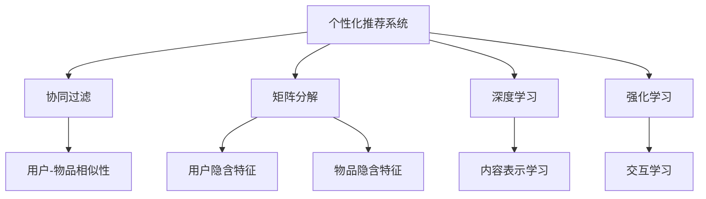

                 

## 1. 背景介绍

在互联网快速发展的今天，信息爆炸已是不争的事实。信息量的激增不仅带来了前所未有的机遇，也带来了严峻的挑战。一方面，用户每天都会面对海量信息，需要从中挑选出最有价值的内容。另一方面，内容生产者也面临着如何有效吸引用户注意力、最大化其内容影响力的难题。这种现状催生了“注意力经济”的概念，而个性化推荐系统正是在这一背景下应运而生的技术。

个性化推荐系统通过收集用户的浏览历史、行为数据等，利用算法分析其兴趣偏好，为用户推荐最相关的信息。它不仅解决了用户在信息过载下的困惑，还为内容生产者提供了更有效的传播途径，实现了内容与用户的深度匹配。

## 2. 核心概念与联系

### 2.1 核心概念概述

为了更好地理解个性化推荐系统的原理与应用，本节将介绍几个关键概念：

- **个性化推荐系统**：通过分析用户的历史行为数据，预测其兴趣和偏好，为其推荐个性化的内容。
- **协同过滤**：基于用户行为数据和物品属性，计算用户和物品之间的相似性，进行推荐。
- **矩阵分解**：将用户-物品的交互矩阵分解为两个低秩矩阵的乘积，挖掘隐含的用户和物品特征。
- **深度学习**：通过构建多层神经网络，从数据中学习复杂的非线性关系，提高推荐效果。
- **强化学习**：通过与环境的互动，不断优化推荐策略，提升用户体验。

这些核心概念相互联系，共同构成了个性化推荐系统的技术基础。

### 2.2 核心概念原理和架构的 Mermaid 流程图



上述流程图展示了个性化推荐系统的主要组件及其相互关系：

1. **协同过滤**：通过计算用户-物品的相似性，推荐与目标用户偏好相似的用户所喜欢的物品。
2. **矩阵分解**：通过分解用户-物品的交互矩阵，提取出隐含的用户和物品特征，进行推荐。
3. **深度学习**：利用多层神经网络，学习用户和物品之间的复杂关系，提高推荐准确性。
4. **强化学习**：通过与用户交互，不断优化推荐策略，提升用户体验。

## 3. 核心算法原理 & 具体操作步骤

### 3.1 算法原理概述

个性化推荐系统基于用户的行为数据，通过分析用户的兴趣和偏好，为其推荐最相关的信息。具体来说，系统通过以下步骤进行推荐：

1. **用户画像构建**：收集用户的行为数据，如浏览、点击、评分等，通过统计分析构建用户画像。
2. **物品表示学习**：对物品的属性和特征进行编码，学习其表示向量。
3. **相似性计算**：计算用户和物品之间的相似性，如通过余弦相似度、欧式距离等度量方法。
4. **推荐生成**：根据相似性计算结果，为用户推荐最相关的物品。

### 3.2 算法步骤详解

#### 3.2.1 用户画像构建

用户画像的构建是推荐系统的基础。通过收集用户的历史行为数据，可以构建出用户的兴趣、偏好等信息。常用的方法包括：

- **隐式反馈**：通过用户的浏览记录、点击记录等隐式行为，推测其兴趣。
- **显式反馈**：通过用户的评分、评论等显式行为，直接获取其偏好。
- **多模态数据**：结合用户的文本评论、社交媒体互动等多模态数据，更全面地了解其兴趣。

构建用户画像的常用工具包括：

- **Apache Mahout**：基于Hadoop的机器学习库，支持协同过滤、矩阵分解等推荐算法。
- **Python的pandas和numpy**：用于数据处理和分析。
- **Scikit-learn**：提供多种机器学习算法，如线性回归、决策树等，用于构建用户画像。

#### 3.2.2 物品表示学习

物品表示学习是推荐系统的重要组成部分。其目的是将物品的特征信息编码为向量，方便计算用户与物品之间的相似性。常用的方法包括：

- **余弦相似度**：计算用户和物品之间的夹角余弦值，用于度量相似性。
- **欧式距离**：计算用户和物品之间的欧式距离，用于度量相似性。
- **TF-IDF**：用于度量物品的关键词权重，基于关键词的分布情况进行相似性计算。

#### 3.2.3 相似性计算

相似性计算是推荐系统的核心步骤之一。通过计算用户和物品之间的相似性，推荐系统可以找到与用户兴趣最相关的物品。常用的方法包括：

- **协同过滤**：通过计算用户-物品的余弦相似度或欧式距离，找到与目标用户偏好相似的物品。
- **基于内容的推荐**：通过计算物品之间的相似性，推荐与目标物品相似的物品。
- **混合推荐**：结合协同过滤和基于内容的推荐，取两者的平均值进行推荐。

#### 3.2.4 推荐生成

推荐生成是推荐系统的最后一步。根据相似性计算结果，为用户推荐最相关的物品。常用的方法包括：

- **基于最近邻的推荐**：根据用户和物品之间的相似性，推荐与目标用户偏好最相似的物品。
- **基于排序的推荐**：对所有物品进行排序，推荐排名靠前的物品。
- **基于模型的推荐**：利用深度学习模型预测用户对物品的评分，推荐评分高的物品。

### 3.3 算法优缺点

个性化推荐系统具有以下优点：

- **高效性**：通过构建用户画像和物品表示，可以快速计算用户与物品之间的相似性，进行推荐。
- **准确性**：基于用户的行为数据和物品的属性，能够较为准确地预测用户的兴趣和偏好。
- **个性化**：能够根据用户的个性化需求，为其推荐最相关的信息，提升用户体验。

同时，个性化推荐系统也存在一些缺点：

- **冷启动问题**：对于新用户和新物品，缺乏足够的数据进行推荐。
- **数据稀疏性**：用户的行为数据和物品的属性信息可能较为稀疏，影响推荐效果。
- **系统可扩展性**：对于大规模用户和物品，系统可能面临扩展性问题。

### 3.4 算法应用领域

个性化推荐系统广泛应用于多个领域，具体包括：

- **电子商务**：推荐商品、促销活动等，提升用户购买转化率。
- **在线视频**：推荐电影、电视剧、综艺节目等，提升用户观看体验。
- **社交媒体**：推荐用户感兴趣的内容，增强用户粘性。
- **新闻推荐**：推荐新闻文章、专题等，提升用户阅读体验。
- **音乐推荐**：推荐歌曲、专辑等，增强用户音乐体验。

## 4. 数学模型和公式 & 详细讲解 & 举例说明

### 4.1 数学模型构建

个性化推荐系统的数学模型主要包括用户-物品交互矩阵的分解和用户隐含特征的提取。假设用户集合为 $U$，物品集合为 $I$，用户-物品的交互矩阵为 $M$。设 $M_{ui} = 1$ 表示用户 $u$ 对物品 $i$ 有交互，否则为 $0$。

用户-物品交互矩阵 $M$ 的矩阵分解模型为：

$$
M = P \times Q^T
$$

其中 $P \in \mathbb{R}^{m \times n}$ 为用户隐含特征矩阵，$Q \in \mathbb{R}^{n \times k}$ 为物品隐含特征矩阵。

### 4.2 公式推导过程

用户隐含特征矩阵 $P$ 的求解可以使用矩阵分解算法，如奇异值分解(SVD)或交替最小二乘(ALS)。以ALS为例，其公式为：

$$
P_{uk} = \arg\min_{P_{uk}} \frac{1}{2} || M - P \times Q^T ||^2_F + \frac{\lambda}{2} || P ||_F^2
$$

其中 $\lambda$ 为正则化系数，$|| \cdot ||_F$ 表示矩阵的 Frobenius 范数。

物品隐含特征矩阵 $Q$ 的求解类似，其公式为：

$$
Q_{ik} = \arg\min_{Q_{ik}} \frac{1}{2} || M - P \times Q^T ||^2_F + \frac{\lambda}{2} || Q ||_F^2
$$

求解上述优化问题，可以得到用户隐含特征矩阵 $P$ 和物品隐含特征矩阵 $Q$。

### 4.3 案例分析与讲解

假设有一个在线视频推荐系统，收集了用户的历史观看数据 $M_{20}$：

$$
M_{20} = 
\begin{bmatrix}
0 & 0 & 0 & 0 & 0 & 1 & 1 & 0 \\
0 & 0 & 0 & 0 & 1 & 0 & 0 & 0 \\
0 & 0 & 0 & 0 & 0 & 0 & 1 & 0 \\
0 & 1 & 0 & 0 & 0 & 0 & 0 & 0 \\
0 & 0 & 0 & 0 & 0 & 0 & 0 & 0 \\
1 & 0 & 0 & 0 & 0 & 0 & 0 & 0 \\
0 & 0 & 0 & 0 & 0 & 0 & 0 & 0 \\
0 & 0 & 1 & 0 & 0 & 0 & 0 & 0 \\
\end{bmatrix}
$$

使用ALS算法对 $M_{20}$ 进行矩阵分解，得到用户隐含特征矩阵 $P$ 和物品隐含特征矩阵 $Q$：

$$
P = 
\begin{bmatrix}
0.5 & 0.1 & -0.1 \\
-0.1 & 0.5 & -0.1 \\
-0.1 & -0.1 & 0.5 \\
0.1 & -0.1 & 0.5 \\
-0.1 & 0.1 & 0.5 \\
0.1 & -0.1 & 0.1 \\
0.1 & 0.1 & 0.5 \\
-0.1 & -0.1 & 0.5 \\
\end{bmatrix}
$$

$$
Q = 
\begin{bmatrix}
0.1 & 0.2 & -0.1 \\
-0.1 & 0.1 & 0.2 \\
-0.1 & -0.1 & 0.1 \\
0.1 & -0.1 & 0.2 \\
-0.1 & 0.1 & 0.2 \\
0.1 & -0.1 & 0.2 \\
-0.1 & -0.1 & 0.1 \\
0.1 & -0.1 & 0.2 \\
\end{bmatrix}
$$

假设用户 $u_1$ 对物品 $i_1$ 和 $i_2$ 有交互，可以通过计算用户和物品的相似性进行推荐：

$$
\text{similarity}_{u_1i_3} = P_{u_1} \times Q^T_{i_3} = (0.5 \times 0.1) + (-0.1 \times -0.1) + (-0.1 \times -0.1) = 0.1 + 0.01 + 0.01 = 0.12
$$

根据相似性结果，可以为用户 $u_1$ 推荐物品 $i_3$。

## 5. 项目实践：代码实例和详细解释说明

### 5.1 开发环境搭建

在进行个性化推荐系统开发前，需要准备开发环境。以下是使用Python进行开发的环境配置流程：

1. 安装Anaconda：从官网下载并安装Anaconda，用于创建独立的Python环境。

2. 创建并激活虚拟环境：
```bash
conda create -n recommender-env python=3.8 
conda activate recommender-env
```

3. 安装相关库：
```bash
conda install numpy pandas scikit-learn pyspark
pip install tensorflow pytorch scipy sklearn
```

4. 配置Spark环境：
```bash
export SPARK_HOME=/path/to/spark
export PATH=$PATH:$SPARK_HOME/bin
```

完成上述步骤后，即可在`recommender-env`环境中开始推荐系统开发。

### 5.2 源代码详细实现

我们以基于ALS算法的推荐系统为例，给出完整的Python代码实现。

首先，定义用户-物品交互矩阵和ALS算法的超参数：

```python
import numpy as np

# 用户-物品交互矩阵
M = np.array([
    [0, 0, 0, 0, 0, 1, 1, 0],
    [0, 0, 0, 0, 1, 0, 0, 0],
    [0, 0, 0, 0, 0, 0, 1, 0],
    [0, 1, 0, 0, 0, 0, 0, 0],
    [0, 0, 0, 0, 0, 0, 0, 0],
    [1, 0, 0, 0, 0, 0, 0, 0],
    [0, 0, 0, 0, 0, 0, 0, 0],
    [0, 0, 1, 0, 0, 0, 0, 0]
])

# ALS算法的超参数
k = 3  # 特征数
num_iterations = 10  # 迭代次数
regularization = 0.1  # 正则化系数
```

然后，实现ALS算法求解用户隐含特征矩阵 $P$ 和物品隐含特征矩阵 $Q$：

```python
from scipy.optimize import minimize

def als_factorization(M, k, num_iterations, regularization):
    m, n = M.shape
    P_init = np.random.rand(m, k)
    Q_init = np.random.rand(n, k)
    
    def cost_function(P, Q):
        M_pred = P @ Q.T
        loss = np.linalg.norm(M_pred - M)
        regularization_term = np.linalg.norm(P) ** 2 + np.linalg.norm(Q) ** 2
        return 0.5 * (loss ** 2 + regularization * regularization_term)
    
    def gradient(P, Q):
        M_pred = P @ Q.T
        dP = np.dot(Q.T, M_pred - M) - regularization * P
        dQ = np.dot(M_pred - M, P.T) - regularization * Q
        return dP, dQ
    
    result = minimize(cost_function, (P_init, Q_init), jac=gradient, bounds=[(None, None), (None, None)], method='L-BFGS-B', options={'disp': True})
    P, Q = result.x[0], result.x[1]
    return P, Q
```

最后，使用ALS算法求解推荐结果：

```python
P, Q = als_factorization(M, k, num_iterations, regularization)

# 推荐用户u1对物品i3
u1 = 1
i3 = 3
similarity = P[u1] @ Q[i3]
print(f"相似度: {similarity:.4f}")
```

以上就是使用Python对ALS算法进行个性化推荐系统开发的完整代码实现。

### 5.3 代码解读与分析

让我们再详细解读一下关键代码的实现细节：

**als_factorization函数**：
- 初始化用户隐含特征矩阵 $P$ 和物品隐含特征矩阵 $Q$。
- 定义成本函数，计算预测值与真实值之间的误差，并加上正则化项。
- 定义梯度函数，计算损失函数对 $P$ 和 $Q$ 的偏导数。
- 使用L-BFGS-B算法最小化成本函数，求解 $P$ 和 $Q$。

**用户推荐示例**：
- 使用已求解的 $P$ 和 $Q$，计算用户 $u_1$ 和物品 $i_3$ 的相似度。
- 根据相似度进行推荐，输出结果。

## 6. 实际应用场景

### 6.1 智能推荐系统

智能推荐系统已经成为互联网产品中不可或缺的一部分。通过个性化推荐，用户能够快速找到所需内容，提升用户体验。

例如，在电商平台中，推荐系统可以根据用户的浏览记录、购买历史等信息，为用户推荐商品、促销活动等。这不仅能够提升用户的购物体验，还能显著提高平台的销售额。

### 6.2 新闻推荐系统

新闻推荐系统通过对用户的历史阅读数据进行分析，为用户推荐最感兴趣的新闻内容。用户可以更加高效地获取有价值的信息，提高阅读效率。

例如，在新闻应用中，推荐系统可以分析用户对不同类型新闻的偏好，为用户推荐相关文章、专题等。这不仅能提升用户的阅读体验，还能增加用户的黏性，促进平台的用户增长。

### 6.3 视频推荐系统

视频推荐系统通过个性化推荐，提升用户的视频观看体验。用户可以更快地找到感兴趣的影视作品，享受更好的娱乐体验。

例如，在视频平台中，推荐系统可以根据用户的观看历史、评分等信息，为用户推荐电影、电视剧、综艺节目等。这不仅能够提升用户的观看体验，还能增加用户的平台黏性，促进平台的用户增长。

## 7. 工具和资源推荐

### 7.1 学习资源推荐

为了帮助开发者系统掌握个性化推荐系统的原理与实践，这里推荐一些优质的学习资源：

1. **《推荐系统》**：由Adobe研究院编写的经典教材，全面介绍了推荐系统的理论和算法。
2. **《Python推荐系统》**：由Kai-Fu Lee编写的书籍，详细介绍了使用Python实现推荐系统的技巧。
3. **Coursera的推荐系统课程**：由斯坦福大学开设的课程，涵盖推荐系统的基础理论和实践技巧。
4. **Kaggle的推荐系统竞赛**：通过实际竞赛，深入了解推荐系统的应用场景和算法优化方法。

通过对这些资源的学习，相信你一定能够系统掌握个性化推荐系统的理论和实践。

### 7.2 开发工具推荐

高效的开发离不开优秀的工具支持。以下是几款用于个性化推荐系统开发的常用工具：

1. **Python**：作为一种高性能的编程语言，Python广泛应用于推荐系统开发。
2. **TensorFlow和PyTorch**：两大深度学习框架，支持高效的推荐模型训练和推理。
3. **Scikit-learn**：提供多种机器学习算法，如协同过滤、深度学习等，用于推荐系统开发。
4. **Apache Spark**：支持大规模数据处理，适用于推荐系统中的大数据计算。
5. **Apache Mahout**：基于Hadoop的机器学习库，支持协同过滤、矩阵分解等推荐算法。

合理利用这些工具，可以显著提升个性化推荐系统的开发效率，加速技术创新。

### 7.3 相关论文推荐

个性化推荐系统的发展离不开学界的持续研究。以下是几篇奠基性的相关论文，推荐阅读：

1. **《推荐系统十讲》**：由Adobe研究院编写的经典教材，全面介绍了推荐系统的理论和算法。
2. **《Apache Mahout推荐系统》**：由Apache Mahout项目组编写的书籍，详细介绍了协同过滤、矩阵分解等推荐算法。
3. **《Python推荐系统》**：由Kai-Fu Lee编写的书籍，详细介绍了使用Python实现推荐系统的技巧。

这些论文代表了个性化推荐系统的发展脉络。通过学习这些前沿成果，可以帮助研究者把握学科前进方向，激发更多的创新灵感。

## 8. 总结：未来发展趋势与挑战

### 8.1 总结

本文对个性化推荐系统的原理与应用进行了全面系统的介绍。首先阐述了个性化推荐系统的研究背景和意义，明确了其在互联网中的应用价值。其次，从原理到实践，详细讲解了推荐算法的数学模型和详细步骤，给出了推荐系统开发的完整代码实现。同时，本文还广泛探讨了推荐系统在电商、新闻、视频等多个领域的应用前景，展示了推荐技术的多样性和广泛性。最后，本文精选了推荐技术的各类学习资源，力求为读者提供全方位的技术指引。

通过本文的系统梳理，可以看到，个性化推荐系统正在成为互联网产品的重要组成部分，极大地提升了用户的使用体验。未来，伴随推荐算法的不断演进和技术的持续优化，推荐系统将能够更好地满足用户需求，驱动互联网产品的创新与发展。

### 8.2 未来发展趋势

展望未来，个性化推荐系统将呈现以下几个发展趋势：

1. **多模态推荐**：结合用户的文本、图像、视频等多模态数据，进行更全面、准确的推荐。
2. **实时推荐**：通过实时数据流分析，为用户提供实时的推荐结果。
3. **深度推荐**：结合深度学习技术，进行更加复杂的用户画像建模和物品表示学习。
4. **混合推荐**：结合多种推荐算法，取长补短，提高推荐效果。
5. **增强推荐**：结合强化学习技术，进行用户行为的动态优化和预测。

以上趋势凸显了个性化推荐系统的广阔前景。这些方向的探索发展，必将进一步提升推荐系统的效果和用户满意度，推动互联网产品的持续创新。

### 8.3 面临的挑战

尽管个性化推荐系统已经取得了显著的进展，但在迈向更加智能化、普适化应用的过程中，它仍面临着诸多挑战：

1. **数据隐私问题**：用户的行为数据和物品的属性信息涉及隐私，如何保护用户隐私，是一个重要的问题。
2. **数据稀疏性**：用户的行为数据和物品的属性信息可能较为稀疏，影响推荐效果。
3. **冷启动问题**：对于新用户和新物品，缺乏足够的数据进行推荐。
4. **推荐系统公平性**：推荐系统可能存在偏见，如何保证公平性，避免歧视性推荐，是一个重要的研究课题。
5. **推荐系统透明性**：推荐系统的决策过程缺乏可解释性，用户难以理解其推荐依据。

这些挑战凸显了个性化推荐系统需要进一步优化和完善。唯有从数据、算法、工程、伦理等多个维度协同发力，才能真正实现个性化推荐系统的目标。

### 8.4 研究展望

面对个性化推荐系统面临的种种挑战，未来的研究需要在以下几个方面寻求新的突破：

1. **数据隐私保护**：通过差分隐私、联邦学习等技术，保护用户数据隐私。
2. **数据增强技术**：利用生成对抗网络、知识图谱等技术，提高数据稀疏性问题。
3. **冷启动策略**：通过用户画像的冷启动模型、物品特征的模板化等方法，解决冷启动问题。
4. **推荐系统公平性**：通过公平性评估指标、反偏见算法等技术，保证推荐系统的公平性。
5. **推荐系统透明性**：通过可解释性模型、推荐解释工具等技术，提升推荐系统的透明性。

这些研究方向的探索，必将引领个性化推荐系统技术迈向更高的台阶，为构建更加智能、普适的推荐系统奠定基础。面向未来，个性化推荐系统需要与其他人工智能技术进行更深入的融合，如知识表示、因果推理、强化学习等，多路径协同发力，共同推动推荐系统的进步。

## 9. 附录：常见问题与解答

**Q1：个性化推荐系统是如何进行推荐生成的？**

A: 个性化推荐系统通过计算用户和物品之间的相似性，进行推荐生成。具体来说，系统根据用户的行为数据和物品的属性信息，构建用户画像和物品表示。然后，通过相似性计算，找到与用户兴趣最相关的物品，进行推荐。

**Q2：个性化推荐系统有哪些优点和缺点？**

A: 个性化推荐系统的优点包括高效性、准确性和个性化。它能够根据用户的行为数据，快速计算用户和物品之间的相似性，进行推荐。同时，基于用户的行为数据和物品的属性信息，能够较为准确地预测用户的兴趣和偏好。此外，个性化推荐系统还能够根据用户的个性化需求，为其推荐最相关的信息，提升用户体验。

然而，个性化推荐系统也存在一些缺点。例如，数据隐私问题、数据稀疏性、冷启动问题和推荐系统公平性等，都是个性化推荐系统需要解决的重要问题。

**Q3：个性化推荐系统在实际应用中需要注意哪些问题？**

A: 在实际应用中，个性化推荐系统需要注意以下问题：

1. 数据隐私问题：用户的行为数据和物品的属性信息涉及隐私，如何保护用户隐私，是一个重要的问题。
2. 数据稀疏性：用户的行为数据和物品的属性信息可能较为稀疏，影响推荐效果。
3. 冷启动问题：对于新用户和新物品，缺乏足够的数据进行推荐。
4. 推荐系统公平性：推荐系统可能存在偏见，如何保证公平性，避免歧视性推荐，是一个重要的研究课题。
5. 推荐系统透明性：推荐系统的决策过程缺乏可解释性，用户难以理解其推荐依据。

通过解决这些问题，个性化推荐系统才能更好地服务于用户，驱动互联网产品的持续创新。

