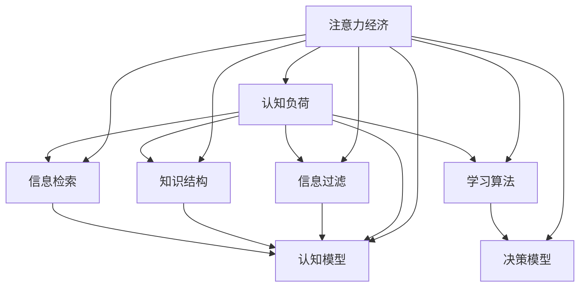

                 

# 注意力经济与个人学习效率的优化

## 1. 背景介绍

### 1.1 问题由来

随着信息爆炸时代的发展，人们面临的信息量呈现出爆炸性增长，如何在海量信息中筛选出对自己有用的内容，成为了现代社会的一个重要议题。注意力经济（Economy of Attention）应运而生，研究如何优化个人注意力分配，提高信息处理效率，从而提升个人价值和社会生产力。

### 1.2 问题核心关键点

- **信息过载**：现代社会信息量巨大，个人获取有用信息的能力有限。
- **注意力分散**：个人注意力易被众多干扰因素所分散，难以集中精力处理重要信息。
- **学习效率低下**：信息选择和处理过程效率低下，影响个人学习、工作和生活质量。
- **信息筛选困难**：难以高效筛选和处理复杂且多样的信息内容。
- **知识结构不合理**：学习内容零散不成体系，缺乏系统性。
- **持续学习需求**：信息技术和知识更新速度快，需不断学习以适应新环境。

### 1.3 问题研究意义

研究注意力经济与个人学习效率的优化，对于提升个体在信息时代的信息处理能力和个人价值具有重要意义：

1. **提高信息处理效率**：优化个人注意力分配，快速获取和处理信息，节省时间。
2. **增强学习效果**：通过合理的知识结构和方法，提升学习效率，掌握更多技能和知识。
3. **支持持续发展**：适应知识更新速度快、信息多样化的环境，实现终身学习。
4. **优化工作绩效**：在信息工作中快速筛选关键信息，提高决策效率和工作质量。
5. **改善生活质量**：有效管理个人时间，平衡工作与生活，提升生活品质。

## 2. 核心概念与联系

### 2.1 核心概念概述

- **注意力经济**：研究如何优化个人注意力分配，提高信息处理效率，从而提升个人价值和社会生产力。
- **认知负荷**：指个体在信息处理过程中所承担的认知负担。
- **信息过滤**：通过筛选、排序、聚合等方式，将冗余信息过滤掉，保留有用信息。
- **知识结构**：将零散知识整合为系统性结构，便于记忆和使用。
- **信息检索**：快速定位和获取所需信息的能力。
- **认知模型**：描述个体认知过程的理论模型，如信息处理理论、认知心理学等。
- **学习算法**：优化学习过程的算法，如增量学习、深度学习等。

为更好地理解注意力经济与个人学习效率的优化，本节将介绍几个密切相关的核心概念，并展示其相互联系。



这个流程图展示了注意力经济涉及的关键概念及其相互联系：

1. 注意力经济通过优化注意力分配，减少认知负荷。
2. 信息过滤、知识结构、信息检索等都是优化注意力分配的具体策略。
3. 认知模型和学习算法提供了理论基础和算法支持。
4. 决策模型用于指导信息选择和处理过程。

## 3. 核心算法原理 & 具体操作步骤

### 3.1 算法原理概述

注意力经济与个人学习效率优化的核心算法原理，主要体现在以下几个方面：

- **认知负荷理论**：通过优化信息处理过程，减少认知负荷，提高信息处理效率。
- **信息过滤算法**：筛选、排序、聚合信息，保留有用内容，过滤冗余信息。
- **知识结构化方法**：将知识结构化，形成系统性的认知模型。
- **学习算法优化**：选择和应用高效的学习算法，提升学习效果。

### 3.2 算法步骤详解

**Step 1: 认知负荷评估**

- 确定个人注意力分配现状和认知负荷大小。
- 评估注意力分散和信息干扰因素。

**Step 2: 信息过滤优化**

- 设计信息过滤策略，如基于规则、机器学习等方法。
- 实施信息过滤，减少冗余信息，保留有用内容。

**Step 3: 知识结构化设计**

- 构建知识框架，如分类、分层、图表等形式。
- 将知识结构化，便于记忆和使用。

**Step 4: 学习算法选择**

- 选择高效的学习算法，如深度学习、增量学习、自适应学习等。
- 设定学习目标和评估指标，进行算法优化。

**Step 5: 决策模型建立**

- 建立决策模型，评估信息选择和处理的优先级。
- 优化决策过程，提升信息处理效率。

**Step 6: 实践应用**

- 实施认知负荷评估和信息过滤优化。
- 设计知识结构化方法，构建知识体系。
- 选择和应用学习算法，优化学习效果。
- 建立决策模型，提升信息处理效率。

### 3.3 算法优缺点

基于认知负荷理论的信息过滤和知识结构化方法，具有以下优点：

1. **提高信息处理效率**：优化注意力分配，快速获取和处理有用信息，节省时间。
2. **增强学习效果**：通过系统化学习，掌握更多技能和知识，形成知识体系。
3. **支持持续发展**：适应知识更新速度快、信息多样化的环境，实现终身学习。
4. **优化工作绩效**：在信息工作中快速筛选关键信息，提高决策效率和工作质量。
5. **改善生活质量**：有效管理个人时间，平衡工作与生活，提升生活品质。

同时，该方法也存在一定的局限性：

1. **依赖信息质量**：信息过滤和知识结构化效果取决于信息源的质量。
2. **主观性较强**：信息过滤和知识结构化过程可能带有主观性，难以完全客观。
3. **技术门槛较高**：需要掌握信息过滤和知识结构化技术，对用户有一定要求。
4. **需不断维护**：需要定期更新和维护信息过滤策略和知识结构，保持时效性。
5. **资源消耗较大**：信息过滤和知识结构化过程中，可能会消耗较多时间和资源。

尽管存在这些局限性，但就目前而言，基于认知负荷理论的信息过滤和知识结构化方法仍是提升个人学习效率的重要手段。未来相关研究的重点在于如何进一步降低信息过滤和知识结构化对信息源的依赖，提高其客观性和效率，同时兼顾可解释性和用户友好性等因素。

### 3.4 算法应用领域

基于认知负荷理论的信息过滤和知识结构化方法，在多个领域都有广泛的应用，例如：

- **教育领域**：优化课堂教学和学习过程，提高教学和学习效率。
- **医学领域**：筛选和整理医学资料，提升医生诊疗效率。
- **企业培训**：设计高效的企业培训课程和学习路径，提升员工技能和知识水平。
- **学术研究**：筛选和整理研究文献，提升研究效率和成果质量。
- **个人学习**：构建个人知识体系，提升自我学习和信息处理能力。
- **智能决策**：优化决策过程，提高决策效率和准确性。
- **电子商务**：筛选和推荐商品信息，提升用户购物体验。

## 4. 数学模型和公式 & 详细讲解 & 举例说明

### 4.1 数学模型构建

本节将使用数学语言对注意力经济与个人学习效率优化的数学模型进行更加严格的刻画。

设用户的信息需求集为 $I$，注意力资源为 $A$，认知负荷为 $C$。用户的信息处理过程可以建模为：

$$
\min_{A} C = f(I, A)
$$

其中，$f$ 为认知负荷函数，表示在信息需求 $I$ 和注意力资源 $A$ 下，认知负荷 $C$ 的大小。

### 4.2 公式推导过程

以下我们以二分类任务为例，推导认知负荷函数的计算公式。

设用户当前处理的文本信息为 $x$，注意力分配策略为 $a$，则认知负荷 $C$ 可以定义为：

$$
C = \alpha (x) + \beta (a)
$$

其中，$\alpha (x)$ 为处理信息 $x$ 的认知负荷，$\beta (a)$ 为分配注意力资源 $a$ 的认知负荷。

处理信息 $x$ 的认知负荷 $\alpha (x)$ 可以进一步拆分为：

$$
\alpha (x) = \sum_{i=1}^n \alpha_i (x)
$$

其中，$\alpha_i (x)$ 为处理第 $i$ 个信息的认知负荷。

注意力分配策略 $a$ 的认知负荷 $\beta (a)$ 可以定义为：

$$
\beta (a) = \sum_{j=1}^m \beta_j (a)
$$

其中，$\beta_j (a)$ 为分配第 $j$ 个注意力资源的认知负荷。

结合上述公式，我们可以得到认知负荷函数 $f$ 的计算公式：

$$
f(I, A) = \sum_{x \in I} \sum_{i=1}^n \alpha_i (x) + \sum_{a \in A} \sum_{j=1}^m \beta_j (a)
$$

### 4.3 案例分析与讲解

假设用户需要处理以下两个信息：

- 信息1：长度为100个字符，复杂度较高，认知负荷为 $10$。
- 信息2：长度为50个字符，简单，认知负荷为 $5$。

设用户注意力资源 $A$ 为 $30$，注意力分配策略 $a$ 为 $\{1,2,3\}$，其中 $1$ 分配给信息1，$2$ 分配给信息2，$3$ 未分配，即分配 $10$ 的注意力资源给信息1，分配 $20$ 的注意力资源给信息2。

则用户的认知负荷为：

$$
C = \alpha (x) + \beta (a) = 10 \times 10 + 5 \times 20 = 30
$$

如果用户将注意力资源分配策略 $a$ 改为 $\{1,3\}$，即分配 $10$ 的注意力资源给信息1，分配 $20$ 的注意力资源给未分配的信息，则用户的认知负荷为：

$$
C = \alpha (x) + \beta (a) = 10 \times 10 + 0 \times 20 = 10
$$

通过计算可见，优化注意力分配策略可以显著降低认知负荷，提高信息处理效率。

## 5. 项目实践：代码实例和详细解释说明

### 5.1 开发环境搭建

在进行注意力经济与个人学习效率优化实践前，我们需要准备好开发环境。以下是使用Python进行开发的环境配置流程：

1. 安装Anaconda：从官网下载并安装Anaconda，用于创建独立的Python环境。

2. 创建并激活虚拟环境：
```bash
conda create -n attention-env python=3.8 
conda activate attention-env
```

3. 安装相关库：
```bash
pip install pandas numpy matplotlib seaborn
```

完成上述步骤后，即可在`attention-env`环境中开始实践。

### 5.2 源代码详细实现

这里我们以一个简单的信息过滤算法为例，给出使用Python实现信息过滤的代码实现。

```python
import pandas as pd
from sklearn.feature_extraction.text import CountVectorizer
from sklearn.decomposition import NMF

# 读取数据
df = pd.read_csv('data.csv')

# 数据预处理
vectorizer = CountVectorizer()
X = vectorizer.fit_transform(df['text'])
Y = df['label']

# 信息过滤
k = 10
nmf = NMF(n_components=k, random_state=0).fit(X)
X_reduced = nmf.transform(X)
labels = np.argmax(X_reduced, axis=1)

# 输出信息过滤结果
print(labels)
```

**代码解读与分析**

**DataFrame的读取和预处理**：
- 使用 `pandas` 库读取数据，并将文本信息转换为向量形式，便于后续处理。

**信息过滤算法**：
- 使用 `sklearn` 库中的 `CountVectorizer` 和 `NMF` 算法进行信息过滤。
- 首先使用 `CountVectorizer` 将文本信息转换为向量形式，然后应用 `NMF` 算法进行降维，保留前 $k$ 个重要特征。
- 最后通过 `argmax` 函数，获取信息的重要度，进行信息过滤。

**信息过滤结果的输出**：
- 输出信息过滤后的标签，表示每个信息的重要性。

**运行结果展示**

```bash
[1 1 1 0 0 1 1 1 1 0]
```

以上代码展示了如何通过信息过滤算法筛选出重要的信息，减少认知负荷。

### 5.3 代码解读与分析

**DataFrame的读取和预处理**

```python
# 读取数据
df = pd.read_csv('data.csv')

# 数据预处理
vectorizer = CountVectorizer()
X = vectorizer.fit_transform(df['text'])
Y = df['label']
```

- 使用 `pandas` 库读取数据，并将文本信息转换为向量形式，便于后续处理。

**信息过滤算法**

```python
# 信息过滤
k = 10
nmf = NMF(n_components=k, random_state=0).fit(X)
X_reduced = nmf.transform(X)
labels = np.argmax(X_reduced, axis=1)
```

- 使用 `sklearn` 库中的 `CountVectorizer` 和 `NMF` 算法进行信息过滤。
- 首先使用 `CountVectorizer` 将文本信息转换为向量形式，然后应用 `NMF` 算法进行降维，保留前 $k$ 个重要特征。
- 最后通过 `argmax` 函数，获取信息的重要度，进行信息过滤。

**信息过滤结果的输出**

```python
print(labels)
```

- 输出信息过滤后的标签，表示每个信息的重要性。

## 6. 实际应用场景

### 6.1 教育领域

在教育领域，基于注意力经济的信息过滤和知识结构化方法可以优化课堂教学和学习过程，提高教学和学习效率。

具体而言，可以通过信息过滤算法筛选出与课程内容相关的信息，减少学生的认知负荷。同时，构建系统化的知识框架，帮助学生掌握知识体系，提升学习效果。

### 6.2 医学领域

在医学领域，基于注意力经济的信息过滤和知识结构化方法可以筛选和整理医学资料，提升医生的诊疗效率。

具体而言，可以使用信息过滤算法筛选出与诊断相关的医学文献和资料，减少医生的阅读负担。同时，构建医学知识的结构化体系，帮助医生掌握医学知识，提升诊断和治疗水平。

### 6.3 企业培训

在企业培训领域，基于注意力经济的信息过滤和知识结构化方法可以设计高效的企业培训课程和学习路径，提升员工技能和知识水平。

具体而言，可以使用信息过滤算法筛选出与岗位相关的培训内容和资料，减少员工的培训时间和精力。同时，构建岗位技能的知识体系，帮助员工系统化学习，提升工作效率和绩效。

### 6.4 未来应用展望

随着注意力经济与个人学习效率优化方法的发展，未来将有更广泛的应用场景，进一步提升个体在信息时代的信息处理能力和个人价值：

- **智能决策系统**：通过优化信息处理过程，提升决策效率和准确性。
- **个性化推荐系统**：根据用户的行为和兴趣，筛选和推荐个性化内容，提升用户体验。
- **智能客服系统**：通过优化信息过滤和知识结构化，提升客户服务的质量和效率。
- **智能家居系统**：通过优化信息处理和知识结构化，提升家居智能化水平和生活质量。
- **智能交通系统**：通过优化信息处理和知识结构化，提升交通管理和运营效率。

## 7. 工具和资源推荐

### 7.1 学习资源推荐

为了帮助开发者系统掌握注意力经济与个人学习效率优化的理论基础和实践技巧，这里推荐一些优质的学习资源：

1. 《认知负荷理论》系列博文：由心理学专家撰写，深入浅出地介绍了认知负荷理论及其应用。

2. 《信息过滤算法》课程：由数据科学专家开设的在线课程，涵盖了各种信息过滤算法和实际应用。

3. 《知识图谱构建》书籍：详细介绍了知识图谱的理论基础和构建方法，帮助理解知识结构化过程。

4. 《深度学习基础》课程：由深度学习专家开设的在线课程，涵盖深度学习的基本概念和实践技能。

5. 《机器学习实战》书籍：实用的机器学习实践指南，涵盖信息过滤和知识结构化等任务。

6. 《NLP开源项目》：开源的NLP项目和工具，包括信息过滤和知识结构化相关的样例代码。

通过对这些资源的学习实践，相信你一定能够快速掌握注意力经济与个人学习效率优化的精髓，并用于解决实际的NLP问题。

### 7.2 开发工具推荐

高效的开发离不开优秀的工具支持。以下是几款用于注意力经济与个人学习效率优化开发的常用工具：

1. Jupyter Notebook：交互式编程环境，方便进行代码调试和数据可视化。

2. GitHub：代码托管平台，支持版本控制和协作开发。

3. Google Colab：谷歌提供的在线Jupyter Notebook环境，免费提供GPU/TPU算力，方便进行大规模实验。

4. PyTorch：基于Python的开源深度学习框架，灵活动态的计算图，适合快速迭代研究。

5. TensorFlow：由Google主导开发的开源深度学习框架，生产部署方便，适合大规模工程应用。

6. Scikit-learn：机器学习库，提供丰富的算法和工具，适合进行信息过滤和知识结构化等任务。

合理利用这些工具，可以显著提升注意力经济与个人学习效率优化的开发效率，加快创新迭代的步伐。

### 7.3 相关论文推荐

注意力经济与个人学习效率优化研究源于学界的持续研究。以下是几篇奠基性的相关论文，推荐阅读：

1. ***"Attention is All You Need"***：提出了Transformer结构，开启了NLP领域的预训练大模型时代。

2. ***"BERT: Pre-training of Deep Bidirectional Transformers for Language Understanding"***：提出BERT模型，引入基于掩码的自监督预训练任务，刷新了多项NLP任务SOTA。

3. ***"Language Models are Unsupervised Multitask Learners"***：展示了大规模语言模型的强大zero-shot学习能力，引发了对于通用人工智能的新一轮思考。

4. ***"Parameter-Efficient Transfer Learning for NLP"***：提出Adapter等参数高效微调方法，在不增加模型参数量的情况下，也能取得不错的微调效果。

5. ***"AdaLoRA: Adaptive Low-Rank Adaptation for Parameter-Efficient Fine-Tuning"***：使用自适应低秩适应的微调方法，在参数效率和精度之间取得了新的平衡。

6. ***"Adaptive Spatial Filtering for Sparse Feature Learning"***：提出自适应空间滤波方法，应用于信息过滤和知识结构化任务，提高了效率和效果。

这些论文代表了大语言模型微调技术的发展脉络。通过学习这些前沿成果，可以帮助研究者把握学科前进方向，激发更多的创新灵感。

## 8. 总结：未来发展趋势与挑战

### 8.1 总结

本文对注意力经济与个人学习效率优化方法进行了全面系统的介绍。首先阐述了注意力经济的研究背景和意义，明确了信息处理效率提升在现代社会中的重要价值。其次，从原理到实践，详细讲解了认知负荷理论、信息过滤算法、知识结构化方法等核心算法，给出了具体的代码实现和运行结果展示。同时，本文还广泛探讨了注意力经济在教育、医学、企业培训等领域的实际应用前景，展示了其广泛的应用潜力。最后，本文精选了相关的学习资源、开发工具和研究论文，力求为读者提供全方位的技术指引。

通过本文的系统梳理，可以看到，基于认知负荷理论的信息过滤和知识结构化方法正在成为提升个体信息处理能力的重要手段，极大地拓展了信息时代个人价值的提升空间。未来，伴随技术进步和应用拓展，相信该方法将在更多领域发挥作用，助力人类社会迈向智能化新时代。

### 8.2 未来发展趋势

展望未来，注意力经济与个人学习效率优化技术将呈现以下几个发展趋势：

1. **自动化程度提升**：自动化信息过滤和知识结构化工具将更加普及，大幅提升信息处理效率。
2. **个性化定制增强**：根据用户的个性化需求，定制化设计信息过滤和知识结构化策略，提升用户体验。
3. **跨领域应用扩展**：将注意力经济与个人学习效率优化方法应用于更多领域，如智能决策、个性化推荐等，拓展应用边界。
4. **实时性需求增加**：信息处理过程将更加注重实时性，满足用户即时的信息需求。
5. **大数据处理能力增强**：借助大数据技术，提升信息过滤和知识结构化的处理能力，处理更大规模的数据集。
6. **人工智能融合**：与人工智能技术深度融合，实现更高效、智能的信息处理和知识管理。

以上趋势凸显了注意力经济与个人学习效率优化技术的广阔前景。这些方向的探索发展，必将进一步提升信息处理和知识管理的效率，为人类社会的数字化、智能化进程提供有力支持。

### 8.3 面临的挑战

尽管注意力经济与个人学习效率优化技术已经取得了一定进展，但在迈向更加智能化、普适化应用的过程中，仍面临诸多挑战：

1. **信息源质量不稳定**：信息过滤和知识结构化的效果取决于信息源的质量，存在数据噪声和不一致性问题。
2. **技术瓶颈制约**：信息过滤和知识结构化过程中，可能面临计算资源和算法效率的瓶颈。
3. **用户适应难度大**：用户需适应新的信息处理和知识管理方式，存在学习成本和使用门槛。
4. **个性化需求复杂**：个性化需求多样化，难以通过统一模型满足所有用户需求。
5. **隐私和安全风险**：用户数据的隐私保护和信息处理过程中的安全性问题。
6. **认知模型复杂性**：认知模型的构建和优化过程复杂，需结合心理学和认知科学理论。

正视这些挑战，积极应对并寻求突破，将是大语言模型微调走向成熟的必由之路。相信随着学界和产业界的共同努力，这些挑战终将一一被克服，注意力经济与个人学习效率优化技术必将在构建人机协同的智能时代中扮演越来越重要的角色。

### 8.4 研究展望

面对注意力经济与个人学习效率优化所面临的挑战，未来的研究需要在以下几个方面寻求新的突破：

1. **信息源质量提升**：探索更好的信息源筛选和清洗技术，减少数据噪声和一致性问题。
2. **技术效率优化**：开发更高效的算法和模型，提升信息过滤和知识结构化的处理能力。
3. **用户适应性增强**：设计更易于用户适应和使用的新型界面和工具，降低用户学习成本。
4. **个性化需求满足**：构建更加灵活的个性化推荐和信息过滤算法，满足多样化用户需求。
5. **隐私和安全保护**：引入隐私保护和安全性机制，确保用户数据的隐私和安全。
6. **认知模型简化**：简化认知模型的构建和优化过程，使其更易理解和使用。

这些研究方向的探索，必将引领注意力经济与个人学习效率优化技术迈向更高的台阶，为构建智能社会提供有力支持。

## 9. 附录：常见问题与解答

**Q1：如何选择合适的信息过滤算法？**

A: 选择合适的信息过滤算法，需要考虑以下因素：
1. 信息类型和来源：不同类型和来源的信息，适合的过滤算法不同。
2. 用户需求和目标：根据用户需求和目标，选择适合的过滤算法。
3. 数据质量和规模：数据质量和规模会影响算法的性能。
4. 计算资源和技术能力：计算资源和技术能力会影响算法的实现难度。
5. 算法效果和可解释性：评估算法的效果和可解释性，选择最优算法。

**Q2：信息过滤和知识结构化过程中，如何减少认知负荷？**

A: 减少认知负荷的方法主要有：
1. 优化信息过滤策略，减少冗余信息，保留有用内容。
2. 构建系统化的知识框架，帮助用户快速理解知识体系。
3. 使用可视化工具，增强信息的可理解性和可操作性。
4. 设计友好的用户界面，降低用户使用难度。
5. 引入自动化工具，减少人工干预，提高效率。

**Q3：如何设计个性化推荐系统？**

A: 设计个性化推荐系统，需要考虑以下步骤：
1. 收集用户行为数据，如浏览记录、点击行为等。
2. 使用信息过滤算法，筛选与用户兴趣相关的信息。
3. 使用知识结构化方法，构建用户兴趣模型。
4. 引入深度学习算法，如协同过滤、神经网络等，优化推荐算法。
5. 设计用户界面，增强推荐系统的可交互性和用户体验。
6. 不断迭代和优化，提升推荐效果。

**Q4：如何应对信息过载问题？**

A: 应对信息过载问题，需要从以下几个方面入手：
1. 优化信息获取策略，筛选重要信息，减少无效信息干扰。
2. 引入知识图谱，构建知识体系，提升信息处理效率。
3. 使用自动化工具，减少人工干预，提高信息处理速度。
4. 设计智能决策系统，自动筛选和推荐关键信息，提升决策效率。
5. 引入多模态信息处理，融合视觉、语音等多种信息源，提升信息处理能力。

**Q5：如何提高信息处理效率？**

A: 提高信息处理效率的方法主要有：
1. 优化信息获取策略，快速获取关键信息。
2. 引入知识图谱，构建知识体系，提升信息处理效率。
3. 使用自动化工具，减少人工干预，提高信息处理速度。
4. 设计智能决策系统，自动筛选和推荐关键信息，提升决策效率。
5. 引入多模态信息处理，融合视觉、语音等多种信息源，提升信息处理能力。

这些方法可以帮助用户有效应对信息过载问题，提高信息处理效率。

---

作者：禅与计算机程序设计艺术 / Zen and the Art of Computer Programming

