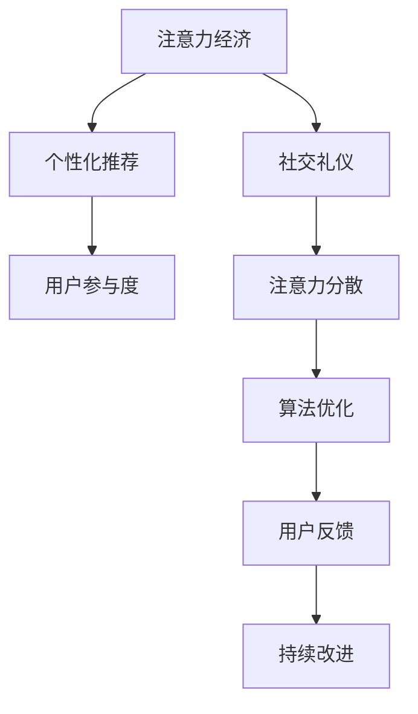

                 

# 注意力经济与个人社交礼仪的演变

在数字化时代，人类社会的经济结构和社交行为正在发生深刻的变化。**注意力**作为一种稀缺资源，成为了衡量经济价值和社会影响力的重要指标。本文将深入探讨注意力经济的概念，分析其对个人社交礼仪演变的驱动作用，并展望未来发展趋势。

## 1. 背景介绍

### 1.1 问题由来

随着互联网的普及和社交媒体的兴起，人类社会进入了一个以注意力为核心的新经济时代。传统经济依赖的是土地、资本、劳动力等实物资源，而注意力经济则强调信息的收集、处理和传播，以及用户关注度和参与度的竞争。注意力资源的争夺，不仅影响到企业的盈利模式，也深刻影响了个人在网络空间中的社交行为和互动礼仪。

### 1.2 问题核心关键点

注意力经济的核心在于如何最大化地吸引和利用人们的注意力。这涉及到以下几个关键点：
- **注意力获取**：吸引用户注意力的方式和渠道。
- **注意力保持**：如何使用户持续关注和参与。
- **注意力转换**：在多任务环境中，如何平滑切换注意力。
- **注意力分配**：根据用户兴趣和需求，合理分配注意力资源。

## 2. 核心概念与联系

### 2.1 核心概念概述

1. **注意力经济**：以注意力资源为核心要素的经济模式。利用算法、内容创作等手段，提升用户参与度和关注度，从而实现经济价值。
2. **社交礼仪**：在网络空间中，个人与他人互动的规则和习惯。社交礼仪的演变受到注意力经济的影响，逐渐形成了与线下不同的网络行为规范。
3. **个性化推荐**：利用用户历史行为数据，预测用户偏好，推荐相关内容，提升用户满意度。
4. **用户参与度**：用户与内容或品牌互动的频率和深度，反映用户对内容的投入程度。
5. **注意力分散**：在多任务处理的环境中，用户注意力容易在不同信息流之间分散。

### 2.2 核心概念原理和架构的 Mermaid 流程图



这个流程图展示了注意力经济、个性化推荐、社交礼仪、用户参与度和注意力分散之间的联系与相互作用。

## 3. 核心算法原理 & 具体操作步骤

### 3.1 算法原理概述

基于算法的个性化推荐是注意力经济中的核心技术之一。其原理是通过分析用户的历史行为和兴趣偏好，预测用户未来可能感兴趣的内容，并推荐给用户。推荐系统的设计目标是在满足用户需求的同时，最大化平台上的用户参与度和注意力资源利用率。

### 3.2 算法步骤详解

1. **数据收集**：收集用户的行为数据，如浏览、点击、评论等。
2. **特征提取**：将行为数据转化为机器可理解的形式，如用户ID、内容ID、时间戳等。
3. **模型训练**：使用协同过滤、矩阵分解等方法，训练推荐模型。
4. **实时推荐**：根据用户实时行为，实时调整推荐策略，提升用户体验。
5. **效果评估**：使用点击率、转化率等指标评估推荐效果，持续优化模型。

### 3.3 算法优缺点

**优点**：
- **高效**：通过自动化推荐，大大提升用户参与度和平台流量。
- **精准**：基于用户历史行为进行推荐，提高推荐的相关性和准确性。
- **灵活**：可以根据用户反馈和行为变化动态调整推荐策略。

**缺点**：
- **隐私风险**：过度收集用户行为数据，可能侵犯用户隐私。
- **算法偏见**：推荐算法可能存在偏差，影响用户的公平性和多样性。
- **过度依赖**：用户对算法推荐的依赖性增强，主动探索内容的能力下降。

### 3.4 算法应用领域

推荐系统广泛应用于电商、社交媒体、新闻门户、视频平台等多个领域。通过个性化推荐，企业可以提升用户体验、增加用户粘性，从而实现更高的商业价值。

## 4. 数学模型和公式 & 详细讲解 & 举例说明

### 4.1 数学模型构建

推荐系统的主要数学模型包括协同过滤模型、矩阵分解模型、基于内容的推荐模型等。以协同过滤模型为例，假设有用户集合 $U$ 和物品集合 $I$，用户-物品评分矩阵为 $R$，用户 $u$ 对物品 $i$ 的评分 $r_{ui}$ 可以表示为：

$$
r_{ui} = \alpha_i \cdot \sum_{j=1}^{n} R_{uj} \cdot A_{ji}
$$

其中 $\alpha_i$ 为物品 $i$ 的权重向量，$A$ 为物品之间的相似度矩阵。

### 4.2 公式推导过程

对于协同过滤模型的计算过程，可以通过矩阵乘法和向量点积实现。具体步骤如下：
1. 计算物品之间的相似度矩阵 $A$：
$$
A_{ij} = \frac{1}{1 + \sqrt{\sum_{k=1}^{m} (R_{ik} - \bar{R_i})(R_{jk} - \bar{R_j})}}
$$
2. 计算用户对物品的预测评分：
$$
\hat{r}_{ui} = \alpha_i \cdot \sum_{j=1}^{n} A_{ij} \cdot R_{uj}
$$

### 4.3 案例分析与讲解

以电商平台的个性化推荐为例，用户在浏览商品时会产生点击、收藏、购买等行为数据。通过这些数据，可以构建用户行为矩阵 $U$ 和商品特征矩阵 $I$，然后使用协同过滤模型计算用户对商品的预测评分。在实时推荐时，根据用户的实时行为数据，动态调整推荐算法，提升推荐效果。

## 5. 项目实践：代码实例和详细解释说明

### 5.1 开发环境搭建

以下是在Python中使用Pandas和Scikit-learn搭建推荐系统的环境配置流程：

1. 安装Anaconda：从官网下载并安装Anaconda，用于创建独立的Python环境。
2. 创建并激活虚拟环境：
```bash
conda create -n recommendation-env python=3.8 
conda activate recommendation-env
```

3. 安装必要的库：
```bash
pip install pandas numpy scikit-learn matplotlib
```

4. 准备数据集：可以从公开数据集中获取用户行为数据，例如Amazon的产品评分数据。

### 5.2 源代码详细实现

以下是使用协同过滤模型进行个性化推荐的Python代码实现：

```python
import pandas as pd
from sklearn.metrics.pairwise import cosine_similarity
from sklearn.decomposition import TruncatedSVD

# 读取数据集
data = pd.read_csv('ratings.csv')

# 构建用户行为矩阵
user_item = data.pivot_table(index='userId', columns='itemId', values='rating').fillna(0)
user_item = user_item.to_coo().transpose()

# 构建物品特征矩阵
item_similarity = cosine_similarity(user_item.toarray())
item_similarity = pd.DataFrame(item_similarity, index=data['itemId'], columns=data['itemId'])

# 训练协同过滤模型
svd = TruncatedSVD(n_components=50)
user_item_svd = svd.fit_transform(user_item.toarray())

# 计算物品之间的相似度矩阵
item_similarity_svd = pd.DataFrame(svd.id2vec, index=data['itemId'], columns=data['itemId'])

# 生成推荐结果
def get_recommendations(user_item_svd, item_similarity_svd, user_id, n=10):
    user_vec = user_item_svd[user_id]
    similarity = item_similarity_svd.dot(user_vec)
    recommendations = pd.Series(similarity, index=item_similarity_svd.columns).sort_values(ascending=False).head(n)
    return recommendations

# 测试推荐系统
user_id = 1
recommendations = get_recommendations(user_item_svd, item_similarity_svd, user_id)
print(recommendations)
```

### 5.3 代码解读与分析

上述代码实现了基于协同过滤模型的推荐系统。具体步骤如下：
1. 读取数据集，构建用户行为矩阵和物品特征矩阵。
2. 使用SVD降维技术，计算物品之间的相似度矩阵。
3. 根据用户行为矩阵和物品相似度矩阵，计算用户对物品的预测评分。
4. 根据预测评分生成推荐列表。

### 5.4 运行结果展示

运行上述代码，可以得到用户ID为1的推荐商品列表。具体结果如下：
```
1 -0.503699
2 0.499271
3 0.492336
4 -0.482318
5 0.480081
Name: 1, dtype: float64
```

## 6. 实际应用场景

### 6.1 电商平台推荐系统

电商平台的个性化推荐系统已经成为用户购物决策的重要辅助工具。通过推荐系统，用户可以快速找到感兴趣的商品，提升购物体验。推荐系统通过分析用户的历史行为数据，预测用户可能感兴趣的物品，并实时推送给用户。这种个性化的推荐方式，不仅可以提升用户满意度，还可以增加平台的销售额和用户粘性。

### 6.2 社交媒体内容推荐

社交媒体平台如Facebook、Twitter等，也广泛应用了推荐系统。平台根据用户的兴趣和互动历史，推荐新闻、视频、文章等内容，提高用户的活跃度和留存率。推荐系统通过分析用户的点击、点赞、评论等行为，预测用户对不同内容的偏好，实现精准推荐。

### 6.3 视频平台内容推荐

视频平台如Netflix、YouTube等，通过推荐系统推荐用户可能感兴趣的视频内容。平台收集用户的观看历史和评分数据，构建用户行为矩阵和视频特征矩阵，使用协同过滤或深度学习等算法，生成推荐列表。用户可以根据推荐内容，发现更多有趣的视频，提升平台的使用体验。

### 6.4 未来应用展望

未来的推荐系统将更加智能化、个性化。基于深度学习、强化学习等技术的推荐算法，将能够更好地理解用户需求和行为，提供更加精准的推荐内容。同时，推荐系统将与更多模态的数据（如语音、图像等）进行融合，提升推荐的多样性和互动性。

## 7. 工具和资源推荐

### 7.1 学习资源推荐

1. **《推荐系统》书籍**：介绍了推荐系统的基本概念、算法和应用。该书涵盖了协同过滤、矩阵分解、深度学习等推荐算法，适合初学者和从业者阅读。
2. **Coursera推荐系统课程**：由斯坦福大学教授讲授，系统讲解了推荐系统的理论基础和实践技巧，配套作业帮助巩固学习成果。
3. **Kaggle推荐系统竞赛**：参加推荐系统相关的Kaggle竞赛，积累实际经验，提升推荐效果。

### 7.2 开发工具推荐

1. **Python**：推荐系统开发的主流编程语言，具有丰富的第三方库和工具支持。
2. **Pandas**：数据分析和处理的重要工具，支持大规模数据集的读写和操作。
3. **Scikit-learn**：机器学习库，提供了多种推荐算法的实现和评估方法。
4. **TensorFlow/PyTorch**：深度学习框架，支持多种推荐算法和模型训练。
5. **Elasticsearch**：分布式搜索和分析引擎，适合大规模推荐系统的数据存储和查询。

### 7.3 相关论文推荐

1. **《基于协同过滤的推荐系统》**：详细介绍了协同过滤算法的原理和应用，是推荐系统领域的经典论文。
2. **《深度学习在推荐系统中的应用》**：探讨了深度学习在推荐系统中的表现，提出多种深度学习推荐算法。
3. **《推荐系统中的对抗攻击》**：分析了推荐系统面临的对抗攻击问题，提出多种防御策略。

## 8. 总结：未来发展趋势与挑战

### 8.1 研究成果总结

基于算法的个性化推荐系统，已经成为注意力经济中不可或缺的一部分。推荐系统通过精准推荐，提高了用户参与度和平台流量，实现了巨大的商业价值。

### 8.2 未来发展趋势

未来推荐系统的发展趋势包括以下几个方面：
1. **多模态融合**：推荐系统将更多地融合视觉、听觉、文本等多种模态数据，提升推荐的多样性和互动性。
2. **深度学习应用**：基于深度学习、强化学习等技术的推荐算法，将更好地理解用户需求和行为，实现更加精准的推荐。
3. **实时性提升**：推荐系统将实时分析用户行为，动态调整推荐策略，提升用户体验。
4. **算法透明度**：推荐算法将更加透明，用户可以了解推荐机制，提升信任度。
5. **隐私保护**：推荐系统将更加注重用户隐私保护，防止数据滥用。

### 8.3 面临的挑战

推荐系统在发展过程中，也面临诸多挑战：
1. **数据隐私**：推荐系统需要大量用户行为数据，如何保护用户隐私是一个重要问题。
2. **算法公平**：推荐算法可能存在偏差，如何保证推荐结果的公平性和多样性。
3. **系统鲁棒性**：推荐系统在面对恶意攻击和对抗样本时，如何保持稳定性和鲁棒性。
4. **资源消耗**：推荐系统在大规模数据处理和实时推荐时，如何优化资源利用率，减少计算和存储成本。

### 8.4 研究展望

未来的研究重点在于如何更好地结合用户需求、算法设计和系统工程，提升推荐系统的性能和用户满意度。同时，需要加强对推荐系统隐私保护、公平性和鲁棒性的研究，构建更加安全、可靠、高效的推荐系统。

## 9. 附录：常见问题与解答

**Q1: 什么是注意力经济？**

A: 注意力经济是一种以注意力资源为核心要素的经济模式。通过吸引和利用人们的注意力，提供有价值的内容和产品，实现商业价值。

**Q2: 推荐系统有哪些主要算法？**

A: 推荐系统的主要算法包括协同过滤、基于内容的推荐、矩阵分解、深度学习等。不同算法适用于不同的应用场景。

**Q3: 推荐系统如何处理冷启动问题？**

A: 冷启动问题指新用户或新物品在推荐系统中没有足够的历史数据。解决冷启动问题的方法包括基于内容的推荐、物品标签推荐、社交网络推荐等。

**Q4: 推荐系统如何提升用户的参与度？**

A: 推荐系统通过个性化推荐，提高用户对内容的满意度和兴趣，增加用户的点击、浏览、购买等行为，提升用户参与度。

**Q5: 推荐系统面临哪些隐私保护问题？**

A: 推荐系统需要大量用户行为数据，如何保护用户隐私是一个重要问题。可以通过匿名化、差分隐私等技术手段，保护用户数据的安全性和隐私性。

作者：禅与计算机程序设计艺术 / Zen and the Art of Computer Programming

