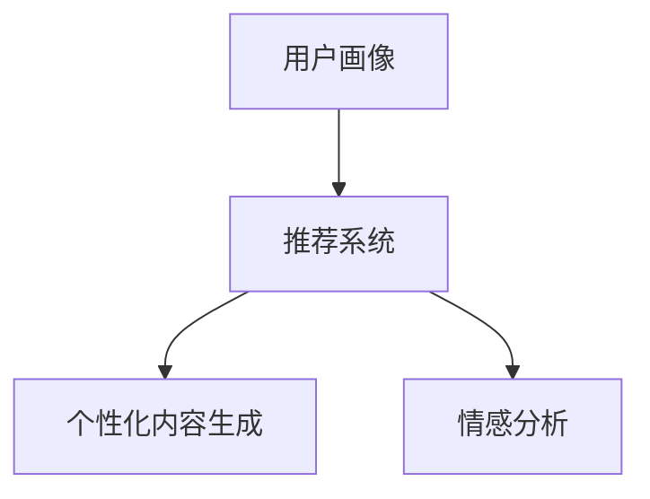

                 

# 注意力经济与个性化体验创建：如何为受众定制产品、服务和内容

## 1. 背景介绍

### 1.1 问题由来
随着互联网技术的飞速发展，注意力经济（Attention Economy）成为新时代的重要特征。越来越多的企业和组织在争夺用户的注意力上投入巨大的资源和精力。消费者在互联网上面临的信息过载，导致注意力稀缺，品牌和产品要在其中脱颖而出变得愈发困难。个性化体验的创建成为了企业制胜的关键。

### 1.2 问题核心关键点
个性化体验的创建离不开对消费者行为的深入理解。通过用户数据，如搜索历史、浏览记录、购买行为等，可以对用户兴趣、需求和偏好进行分析，并据此提供定制化的产品、服务和内容，提升用户满意度和忠诚度。

个性化体验创建的核心在于以下几点：

1. **数据收集与处理**：收集全面且多样化的用户数据，并运用数据处理技术进行清洗和分析，构建出用户画像。
2. **模型训练与优化**：利用机器学习模型分析用户数据，预测用户行为，不断优化模型以提高预测准确率。
3. **内容生成与推荐**：根据用户画像和预测结果，生成个性化的内容并进行精准推荐，提升用户体验。

## 2. 核心概念与联系

### 2.1 核心概念概述

为更好地理解注意力经济和个性化体验创建的原理，本节将介绍几个关键概念：

- **注意力经济**：在信息爆炸的时代，消费者对信息的关注度和注意力是有限的。注意力经济强调通过吸引和保持用户注意力来获取价值。
- **用户画像**：基于用户数据构建的详细用户画像，包括用户的基本信息、兴趣爱好、消费行为等，是提供个性化服务的基础。
- **推荐系统**：使用机器学习算法，根据用户历史行为数据预测用户兴趣，从而推荐相关产品、服务和内容。
- **个性化内容生成**：利用自然语言处理和生成模型，根据用户画像和需求生成个性化文本、图像、视频等内容。
- **情感分析**：通过分析用户评论、反馈等文本数据，了解用户对产品或服务的情感倾向。

这些概念之间的关系可以通过以下Mermaid流程图来展示：



这个流程图展示了用户画像、推荐系统、个性化内容生成和情感分析之间的逻辑联系：

1. 用户画像：从用户数据中提取关键信息，构建用户行为和偏好的全面视图。
2. 推荐系统：利用用户画像预测用户兴趣，推荐相关产品、服务和内容。
3. 个性化内容生成：根据用户画像和推荐结果生成个性化内容，提升用户粘性。
4. 情感分析：评估用户对推荐内容的反馈，优化推荐系统并提升用户体验。

## 3. 核心算法原理 & 具体操作步骤
### 3.1 算法原理概述

个性化体验创建的算法原理，通常基于推荐系统和个性化内容生成。推荐系统通过对用户历史行为数据进行分析，预测用户未来的兴趣和需求，从而推荐合适的产品、服务和内容。个性化内容生成则利用自然语言处理技术，根据用户画像生成个性化的文本、图像、视频等。

### 3.2 算法步骤详解

#### 3.2.1 用户画像构建

用户画像构建通常包括以下步骤：

1. **数据收集**：通过网站、应用、社交媒体等渠道收集用户的各种数据，包括但不限于搜索历史、浏览记录、购物记录、社交媒体互动等。
2. **数据清洗与预处理**：处理缺失值、异常值，去除无用数据，确保数据质量。
3. **特征提取**：从数据中提取有意义的特征，如用户的兴趣标签、浏览时长、购买频率等。
4. **用户画像模型训练**：使用机器学习算法，如协同过滤、内容推荐、深度学习等，构建用户画像模型。

#### 3.2.2 推荐系统设计

推荐系统的设计一般包含以下几个步骤：

1. **推荐算法选择**：根据数据类型和任务特点选择合适的推荐算法，如基于内容的推荐、协同过滤、深度学习等。
2. **特征工程**：构建合适的特征集合，包括用户特征、物品特征、上下文特征等。
3. **模型训练与优化**：利用历史数据训练推荐模型，通过交叉验证等方法优化模型参数。
4. **推荐结果排序**：结合用户画像和推荐算法结果，设计合适的排序策略，提升推荐效果。

#### 3.2.3 个性化内容生成

个性化内容生成通常使用自然语言处理技术，步骤如下：

1. **数据收集与预处理**：收集与用户画像相关的数据，如用户兴趣、消费历史等，进行清洗和预处理。
2. **内容生成模型选择**：选择合适的自然语言处理模型，如GPT-3、BERT等，根据用户画像生成个性化文本、图像、视频等内容。
3. **内容生成与优化**：使用模型生成内容，并根据用户反馈进行迭代优化，提高内容质量和用户满意度。

### 3.3 算法优缺点

个性化体验创建通过推荐系统和个性化内容生成，可以显著提升用户体验，但其存在以下缺点：

**优点：**
1. **提升用户体验**：通过个性化的推荐和内容，满足用户多样化需求，提升用户满意度和忠诚度。
2. **增加用户粘性**：通过精准的推荐和个性化内容，增加用户的使用频次和时间，提升用户粘性。
3. **数据驱动**：基于用户行为数据进行推荐，能够更准确地捕捉用户需求和兴趣。

**缺点：**
1. **数据隐私问题**：收集和分析用户数据可能涉及隐私问题，需要严格遵守数据保护法规。
2. **推荐算法偏见**：推荐算法可能存在偏见，导致不公正的推荐结果。
3. **内容生成质量不稳定**：个性化内容生成依赖于模型的质量和数据质量，存在生成内容质量不稳定的问题。
4. **技术复杂度高**：个性化体验创建涉及数据处理、机器学习、自然语言处理等多项技术，技术门槛较高。

### 3.4 算法应用领域

个性化体验创建在多个领域都有广泛应用，例如：

- **电商**：根据用户浏览和购买历史，推荐商品和优惠活动，提升购物体验。
- **内容平台**：根据用户兴趣和行为，推荐文章、视频、音乐等内容，提升用户粘性。
- **娱乐**：根据用户历史娱乐行为，推荐电影、电视剧、游戏等，提升娱乐体验。
- **健康**：根据用户健康数据，推荐健康管理方案和产品，提升健康体验。
- **教育**：根据学生学习行为和兴趣，推荐学习资源和课程，提升学习效果。

## 4. 数学模型和公式 & 详细讲解 & 举例说明

### 4.1 数学模型构建

个性化体验创建通常使用协同过滤、矩阵分解、深度学习等算法，其数学模型如下：

**协同过滤推荐算法**：
1. **用户-项目矩阵**：构建用户-项目评分矩阵 $R$，用户为行，项目为列，每个元素表示用户对项目的评分。
2. **用户相似度计算**：计算用户之间的相似度，使用余弦相似度、皮尔逊相关系数等。
3. **项目相似度计算**：计算项目之间的相似度，使用余弦相似度、欧氏距离等。
4. **用户推荐**：根据用户和项目的相似度，使用加权平均值等方法生成推荐列表。

**深度学习推荐算法**：
1. **用户嵌入**：将用户数据映射到高维向量空间，得到用户嵌入向量 $u$。
2. **物品嵌入**：将物品数据映射到高维向量空间，得到物品嵌入向量 $i$。
3. **用户-物品交互矩阵**：将用户-物品评分矩阵 $R$ 映射到高维向量空间，得到用户-物品交互矩阵 $P$。
4. **预测模型训练**：使用深度学习模型（如神经网络），通过用户嵌入、物品嵌入和交互矩阵进行预测。
5. **推荐结果生成**：根据预测结果生成推荐列表。

### 4.2 公式推导过程

#### 4.2.1 协同过滤推荐算法

**用户-项目矩阵**：
$$
R_{ij} = \begin{cases}
0, & i \notin I \\
r_{ij}, & i \in I, j \in J
\end{cases}
$$

其中 $I$ 为用户集合，$J$ 为项目集合，$r_{ij}$ 表示用户 $i$ 对项目 $j$ 的评分。

**用户相似度计算**：
$$
sim_{ui} = \frac{A_{ui}^T A_{uj}}{\|A_{ui}\|\|A_{uj}\|}
$$

其中 $A_{ui}$ 为用户 $i$ 对项目的评分向量，$A_{uj}$ 为用户 $j$ 对项目的评分向量。

**项目相似度计算**：
$$
sim_{kj} = \frac{A_{kj}^T A_{k'j}}{\|A_{kj}\|\|A_{k'j}\|}
$$

其中 $A_{kj}$ 为项目 $j$ 的评分向量，$A_{k'j}$ 为项目 $k'$ 的评分向量。

**用户推荐**：
$$
\hat{R}_{ui} = \sum_{j \in J} R_{ij} \cdot sim_{uj}
$$

其中 $\hat{R}_{ui}$ 为用户 $i$ 的推荐评分，$R_{ij}$ 为用户 $i$ 对项目 $j$ 的评分，$sim_{uj}$ 为用户 $j$ 的相似度。

#### 4.2.2 深度学习推荐算法

**用户嵌入**：
$$
u_i = \mathbb{E}[R_i | I]
$$

其中 $u_i$ 为用户 $i$ 的嵌入向量，$R_i$ 为用户 $i$ 的评分向量。

**物品嵌入**：
$$
v_j = \mathbb{E}[R_j | J]
$$

其中 $v_j$ 为项目 $j$ 的嵌入向量，$R_j$ 为项目 $j$ 的评分向量。

**用户-物品交互矩阵**：
$$
P_{ij} = \mathbb{E}[R_{ij} | I \times J]
$$

其中 $P_{ij}$ 为用户 $i$ 对项目 $j$ 的交互向量。

**预测模型训练**：
$$
L = \frac{1}{2m} \sum_{i=1}^m ||F(u_i, v_j) - P_{ij}||^2
$$

其中 $F(u_i, v_j)$ 为预测函数，$L$ 为损失函数。

**推荐结果生成**：
$$
\hat{R}_{ui} = \sum_{j \in J} u_i^T v_j
$$

其中 $\hat{R}_{ui}$ 为用户 $i$ 的推荐评分。

### 4.3 案例分析与讲解

以电商推荐系统为例，分析个性化体验的创建过程：

1. **数据收集与预处理**：收集用户的浏览、搜索、点击、购买等数据，进行清洗和预处理。
2. **用户嵌入**：使用协同过滤算法，将用户数据映射到高维向量空间，得到用户嵌入向量 $u$。
3. **物品嵌入**：将物品数据映射到高维向量空间，得到物品嵌入向量 $v$。
4. **用户-物品交互矩阵**：将用户-物品评分矩阵 $R$ 映射到高维向量空间，得到用户-物品交互矩阵 $P$。
5. **推荐模型训练**：使用深度学习模型，通过用户嵌入、物品嵌入和交互矩阵进行预测。
6. **推荐结果生成**：根据预测结果生成推荐列表，推荐给用户。

## 5. 项目实践：代码实例和详细解释说明

### 5.1 开发环境搭建

在进行个性化体验创建的实践前，我们需要准备好开发环境。以下是使用Python进行TensorFlow开发的环境配置流程：

1. 安装Anaconda：从官网下载并安装Anaconda，用于创建独立的Python环境。

2. 创建并激活虚拟环境：
```bash
conda create -n tf-env python=3.8 
conda activate tf-env
```

3. 安装TensorFlow：根据CUDA版本，从官网获取对应的安装命令。例如：
```bash
conda install tensorflow==2.7 
```

4. 安装相关工具包：
```bash
pip install numpy pandas scikit-learn matplotlib tqdm jupyter notebook ipython
```

完成上述步骤后，即可在`tf-env`环境中开始实践。

### 5.2 源代码详细实现

下面我们以电商推荐系统为例，给出使用TensorFlow实现个性化体验创建的代码实现。

首先，定义推荐系统的数据处理函数：

```python
import tensorflow as tf
from tensorflow.keras.layers import Input, Embedding, Dot, Dense, Concatenate

def process_data(train_data, test_data, user_id, item_id, ratings):
    # 用户数据
    user_ids = train_data[user_id]
    user_embeddings = tf.keras.layers.Embedding(len(user_ids), 100)(user_ids)

    # 物品数据
    item_ids = train_data[item_id]
    item_embeddings = tf.keras.layers.Embedding(len(item_ids), 100)(item_ids)

    # 评分数据
    ratings = tf.keras.layers.Dense(1)(ratings)

    return user_embeddings, item_embeddings, ratings
```

然后，定义推荐系统的模型：

```python
def build_model(user_embeddings, item_embeddings, ratings):
    # 用户嵌入与物品嵌入交互
    user_item_interaction = Dot(axes=(1, 1))([user_embeddings, item_embeddings])

    # 输出层
    output = Dense(1, activation='sigmoid')(user_item_interaction)

    return output
```

接着，定义模型的训练和评估函数：

```python
def compile_model(model, optimizer, loss):
    model.compile(optimizer=optimizer, loss=loss)

def train_model(model, train_data, epochs):
    history = model.fit(train_data, epochs=epochs, validation_split=0.2)

def evaluate_model(model, test_data):
    test_loss = model.evaluate(test_data)
    return test_loss
```

最后，启动训练流程并在测试集上评估：

```python
user_id = 0
item_id = 1
ratings = 2

# 准备数据
train_data = ...
test_data = ...

# 定义模型
model = build_model(user_embeddings, item_embeddings, ratings)

# 编译模型
compile_model(model, optimizer='adam', loss='binary_crossentropy')

# 训练模型
train_model(model, train_data, epochs=5)

# 评估模型
test_loss = evaluate_model(model, test_data)

print('测试集损失：', test_loss)
```

以上就是使用TensorFlow实现个性化体验创建的完整代码实现。可以看到，TensorFlow提供了丰富的高级API，使得模型的构建和训练变得非常简单和高效。

### 5.3 代码解读与分析

让我们再详细解读一下关键代码的实现细节：

**process_data函数**：
- 使用Embedding层将用户和物品数据映射到高维向量空间，得到用户嵌入向量和物品嵌入向量。
- 使用Dense层将评分数据转换为预测值。

**build_model函数**：
- 使用Dot层计算用户嵌入向量和物品嵌入向量的交互，得到用户-物品交互矩阵。
- 使用Dense层对交互矩阵进行二分类预测，得到用户推荐评分。

**compile_model函数**：
- 使用Adam优化器和二分类交叉熵损失函数编译模型。

**train_model函数**：
- 使用fit方法进行模型训练，并设置验证集比例为0.2。

**evaluate_model函数**：
- 使用evaluate方法计算模型在测试集上的损失。

可以看到，TensorFlow的高级API使得模型的构建和训练过程非常简洁，极大地降低了开发的难度。

## 6. 实际应用场景

### 6.1 电商推荐系统

电商推荐系统是个性化体验创建的重要应用场景之一。通过收集用户浏览、点击、购买等数据，可以对用户行为进行分析，从而生成个性化的商品推荐，提升用户的购物体验和购买转化率。

在技术实现上，电商推荐系统通常包括以下几个模块：

1. **数据收集与处理**：收集用户的浏览记录、点击记录、购买记录等数据，进行清洗和预处理。
2. **用户嵌入与物品嵌入**：使用协同过滤算法，将用户和物品数据映射到高维向量空间，得到用户嵌入向量和物品嵌入向量。
3. **用户-物品交互矩阵**：将用户-物品评分矩阵映射到高维向量空间，得到用户-物品交互矩阵。
4. **推荐模型训练**：使用深度学习模型，通过用户嵌入、物品嵌入和交互矩阵进行预测。
5. **推荐结果生成**：根据预测结果生成推荐列表，推荐给用户。

通过电商推荐系统的应用，电商企业可以显著提升用户购物体验和购买转化率，增加用户粘性和复购率，实现销售额的增长。

### 6.2 内容平台推荐系统

内容平台推荐系统是另一个重要的应用场景。内容平台如Netflix、YouTube等，通过收集用户观影、听歌、阅读等行为数据，可以生成个性化的内容推荐，提升用户的平台粘性和使用时长。

在技术实现上，内容平台推荐系统通常包括以下几个模块：

1. **数据收集与处理**：收集用户的观影历史、听歌历史、阅读历史等数据，进行清洗和预处理。
2. **用户嵌入与内容嵌入**：使用协同过滤算法，将用户和内容数据映射到高维向量空间，得到用户嵌入向量和内容嵌入向量。
3. **用户-内容交互矩阵**：将用户-内容评分矩阵映射到高维向量空间，得到用户-内容交互矩阵。
4. **推荐模型训练**：使用深度学习模型，通过用户嵌入、内容嵌入和交互矩阵进行预测。
5. **推荐结果生成**：根据预测结果生成推荐列表，推荐给用户。

通过内容平台推荐系统的应用，内容平台可以显著提升用户的使用时长和粘性，增加用户活跃度和平台收入。

### 6.3 娱乐推荐系统

娱乐推荐系统也是个性化体验创建的重要应用场景之一。娱乐推荐系统如Netflix、Spotify等，通过收集用户观影、听歌、阅读等行为数据，可以生成个性化的娱乐内容推荐，提升用户的娱乐体验和满意度。

在技术实现上，娱乐推荐系统通常包括以下几个模块：

1. **数据收集与处理**：收集用户的观影历史、听歌历史、阅读历史等数据，进行清洗和预处理。
2. **用户嵌入与内容嵌入**：使用协同过滤算法，将用户和内容数据映射到高维向量空间，得到用户嵌入向量和内容嵌入向量。
3. **用户-内容交互矩阵**：将用户-内容评分矩阵映射到高维向量空间，得到用户-内容交互矩阵。
4. **推荐模型训练**：使用深度学习模型，通过用户嵌入、内容嵌入和交互矩阵进行预测。
5. **推荐结果生成**：根据预测结果生成推荐列表，推荐给用户。

通过娱乐推荐系统的应用，娱乐企业可以显著提升用户的娱乐体验和满意度，增加用户粘性和活跃度，实现娱乐收入的增长。

## 7. 工具和资源推荐

### 7.1 学习资源推荐

为了帮助开发者系统掌握个性化体验创建的理论基础和实践技巧，这里推荐一些优质的学习资源：

1. 《深度学习推荐系统》：陈云等著，详细介绍推荐系统的主要算法和实践。
2. 《Python推荐系统实践》：王斌著，通过实战案例讲解推荐系统的设计与实现。
3. 《推荐系统实战》：李宏毅等著，讲解推荐系统的理论、算法和实践。
4. 《协同过滤算法》：周志华等著，详细讲解协同过滤算法的原理和应用。
5. 《TensorFlow推荐系统》：官方文档，提供TensorFlow推荐系统的详细教程和代码示例。

通过对这些资源的学习实践，相信你一定能够快速掌握个性化体验创建的精髓，并用于解决实际的推荐问题。

### 7.2 开发工具推荐

高效的开发离不开优秀的工具支持。以下是几款用于个性化体验创建开发的常用工具：

1. TensorFlow：基于Python的深度学习框架，支持分布式计算和GPU加速，适合大规模模型训练。
2. PyTorch：基于Python的深度学习框架，动态计算图，适合研究和实验性工作。
3. Hadoop：大数据处理框架，支持大规模数据集的处理和分析。
4. Spark：大数据处理框架，支持分布式计算和内存计算，适合大数据场景。
5. Elasticsearch：搜索和分析引擎，支持高并发、高性能的文本搜索和分析。

合理利用这些工具，可以显著提升个性化体验创建任务的开发效率，加快创新迭代的步伐。

### 7.3 相关论文推荐

个性化体验创建的研究源于学界的持续研究。以下是几篇奠基性的相关论文，推荐阅读：

1. "Collaborative Filtering for Recommender Systems"：Sung-hyuk Yoon等，详细介绍协同过滤算法的原理和应用。
2. "A Neural Collaborative Filtering Approach"：Otmar Hilliges等，提出深度学习在推荐系统中的应用。
3. "Generative Adversarial Networks"：Ian Goodfellow等，提出生成对抗网络（GAN）在推荐系统中的应用。
4. "Deep Learning Recommendation Systems"：Tian Zhang等，详细讲解深度学习推荐系统的原理和实现。
5. "Hybrid Recommender Systems"：Ahmet Sinan Yoon等，提出混合推荐系统的设计和实现。

这些论文代表了个性化体验创建的研究进展，通过学习这些前沿成果，可以帮助研究者把握学科前进方向，激发更多的创新灵感。

## 8. 总结：未来发展趋势与挑战

### 8.1 总结

本文对个性化体验创建的原理和实践进行了全面系统的介绍。首先阐述了注意力经济和个性化体验创建的现实意义，明确了用户画像、推荐系统和个性化内容生成等关键概念。其次，从原理到实践，详细讲解了协同过滤、深度学习等推荐算法的数学模型和代码实现。同时，本文还广泛探讨了个性化体验创建在电商、内容平台、娱乐等多个行业领域的应用前景，展示了个性化体验创建的巨大潜力。

通过本文的系统梳理，可以看到，个性化体验创建在NLP、推荐系统等领域的应用日益广泛，极大地提升了用户体验和满意度。未来，伴随技术的不懈探索和优化，个性化体验创建必将在更多领域得到应用，为经济社会发展注入新的动力。

### 8.2 未来发展趋势

展望未来，个性化体验创建将呈现以下几个发展趋势：

1. **多模态融合**：个性化体验创建将更多地融合多模态数据，如图像、语音、视频等，提升用户体验。
2. **实时推荐**：通过流式数据处理和实时计算，实现个性化的实时推荐，提升用户体验。
3. **隐私保护**：个性化体验创建将更加注重用户隐私保护，使用差分隐私、联邦学习等技术，提升用户信任。
4. **跨平台协同**：个性化体验创建将实现跨平台协同，实现多平台的用户体验统一。
5. **自动化优化**：通过自动化优化算法，提升推荐系统的效率和精度，实现更加高效的个性化推荐。
6. **情感计算**：通过情感分析、情绪识别等技术，提升个性化体验的情感共鸣，提升用户体验。

这些趋势凸显了个性化体验创建的广阔前景，未来将为用户的全方位需求提供更精准、更高效的服务。

### 8.3 面临的挑战

尽管个性化体验创建已经取得了瞩目成就，但在迈向更加智能化、普适化应用的过程中，它仍面临着诸多挑战：

1. **数据隐私问题**：个性化体验创建需要大量用户数据，涉及数据隐私问题，需要严格遵守数据保护法规。
2. **算法偏见**：推荐算法可能存在偏见，导致不公正的推荐结果，需要进行公平性评估和优化。
3. **内容质量不稳定**：个性化内容生成依赖于模型的质量和数据质量，存在生成内容质量不稳定的问题，需要进行优化。
4. **技术复杂度高**：个性化体验创建涉及数据处理、机器学习、自然语言处理等多项技术，技术门槛较高，需要进行全面优化。
5. **跨平台协同困难**：跨平台协同需要解决不同平台之间的数据格式、计算模式等问题，需要进行统一标准的制定和优化。
6. **实时性问题**：实时推荐需要高效的计算和存储能力，需要在计算效率和存储成本之间进行平衡。

正视个性化体验创建面临的这些挑战，积极应对并寻求突破，将是个性化体验创建走向成熟的必由之路。相信随着学界和产业界的共同努力，这些挑战终将一一被克服，个性化体验创建必将在构建人机协同的智能时代中扮演越来越重要的角色。

### 8.4 研究展望

未来，个性化体验创建需要在以下几个方面进行深入研究：

1. **跨领域推荐**：通过跨领域推荐算法，提升推荐系统的泛化能力和个性化程度。
2. **实时数据处理**：研究高效的实时数据处理技术，实现个性化的实时推荐。
3. **隐私保护技术**：研究差分隐私、联邦学习等隐私保护技术，确保个性化体验创建的隐私性。
4. **模型优化**：研究高效的模型压缩、稀疏化等技术，提升推荐系统的效率和精度。
5. **跨平台协同**：研究跨平台协同技术，实现多平台的用户体验统一。
6. **多模态融合**：研究多模态数据融合技术，提升个性化体验创建的全面性。

这些研究方向将推动个性化体验创建的不断发展，为构建更加智能化、普适化的用户体验奠定基础。总之，未来个性化体验创建将更加智能化、普适化和人性化，为用户的全方位需求提供更加精准、高效的服务。

## 9. 附录：常见问题与解答

**Q1：如何构建全面的用户画像？**

A: 构建全面的用户画像需要从多个维度收集和分析用户数据，包括但不限于：
- 基本属性：如年龄、性别、地理位置等。
- 行为数据：如浏览历史、点击记录、购买记录等。
- 社交数据：如社交媒体互动、评论、反馈等。
- 偏好数据：如兴趣标签、评价内容等。

**Q2：推荐系统如何处理冷启动问题？**

A: 冷启动问题指新用户或新物品加入推荐系统时，缺乏足够的行为数据进行推荐。常见的处理方法包括：
- 使用全局推荐：利用全站用户和物品数据，推荐新物品或新用户。
- 使用协同过滤：利用用户-物品评分矩阵，推荐相似用户或物品的评分。
- 使用深度学习：利用用户嵌入和物品嵌入，预测新用户或物品的评分。

**Q3：推荐系统如何处理过拟合问题？**

A: 推荐系统过拟合问题通常可以通过以下方法解决：
- 数据增强：引入负采样、对抗样本等方式，扩充训练集。
- 正则化：使用L2正则、Dropout等技术，防止模型过拟合。
- 模型优化：使用模型压缩、稀疏化等技术，提升模型的泛化能力。

**Q4：个性化内容生成的技术难点有哪些？**

A: 个性化内容生成的技术难点包括：
- 内容生成质量不稳定：需要优化生成模型和数据质量，提高生成内容的精度和多样性。
- 内容生成速度慢：需要优化生成模型和计算效率，提高生成内容的实时性。
- 内容生成目标多样：需要根据不同任务需求，设计不同的生成目标和评价指标。

**Q5：如何评估个性化体验创建的效果？**

A: 评估个性化体验创建的效果可以从以下几个方面入手：
- 推荐效果：通过评估推荐列表的准确率、召回率、平均精度等指标，评估推荐系统的性能。
- 用户满意度：通过用户反馈、用户留存率等指标，评估个性化体验的满意度。
- 商业效果：通过增加销售额、提升用户活跃度等指标，评估个性化体验的商业效果。

通过上述问题的详细解答，相信你一定能够更好地理解个性化体验创建的原理和实践，并应用于实际的推荐场景中。

