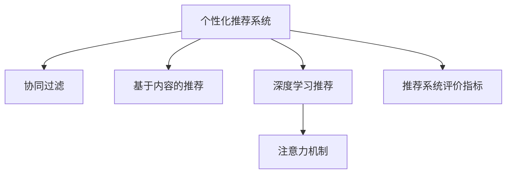

                 

## 1. 背景介绍

### 1.1 问题由来
随着互联网技术的迅猛发展，信息爆炸已成为一个普遍现象。用户在海量信息中寻找所需内容变得越来越困难。为解决这一问题，个性化推荐系统应运而生，旨在通过智能算法为用户推荐最相关、最有价值的信息。

个性化推荐系统不仅可以显著提升用户体验，还能带动内容创作者的曝光度和收入，进而促进整个内容生态的健康发展。但随之而来的，是越来越多的注意力被用户有限的注意力资源所“消耗”，形成了“注意力经济”。

### 1.2 问题核心关键点
个性化推荐的核心在于如何高效地利用用户的注意力资源，提供定制、有针对性的内容，从而最大化用户的满意度和参与度。这不仅需要精确理解用户偏好，还需要高效利用大数据、机器学习等技术手段，实现动态推荐。

目前，常用的个性化推荐算法包括基于协同过滤、基于内容、基于深度学习等范式，其中基于深度学习的推荐算法因其高精度、高泛化能力，成为研究的热点。本文将聚焦于基于深度学习的个性化推荐算法，系统性地介绍其原理与实践。

### 1.3 问题研究意义
个性化推荐系统在电商、社交媒体、视频平台等众多场景中得到了广泛应用，极大提升了用户粘性和平台流量。但现有推荐算法仍面临诸多挑战，如冷启动问题、数据稀疏性、模型泛化能力不足等。

深入研究个性化推荐算法，不仅有助于解决这些现有问题，还能推动算法在更多领域中的应用，如智慧医疗、智慧教育、智慧城市等，助力各行各业数字化转型升级，提升社会经济效率。

## 2. 核心概念与联系

### 2.1 核心概念概述

为更好地理解个性化推荐系统，本节将介绍几个核心概念：

- **个性化推荐系统**：利用用户行为数据、内容特征等，通过智能算法为用户推荐相关内容的系统。
- **协同过滤**：基于用户和物品间的相似度进行推荐，分为基于用户的协同过滤和基于物品的协同过滤。
- **基于内容的推荐**：通过分析物品内容的特征，推测用户可能感兴趣的内容。
- **深度学习推荐**：利用深度神经网络模型，学习用户与物品间的复杂关系，提升推荐精度。
- **注意力机制**：通过学习不同特征的重要性权重，提高模型的精准度和泛化能力。
- **推荐系统评价指标**：用于衡量推荐系统性能的指标，如准确率、召回率、F1-score等。

这些概念之间的逻辑关系可以通过以下Mermaid流程图来展示：



这个流程图展示了个性化推荐系统的核心概念及其之间的关系：

1. 个性化推荐系统通过协同过滤、基于内容的推荐、深度学习推荐等多种算法，为用户提供个性化推荐。
2. 深度学习推荐和注意力机制是当前推荐系统的重要技术手段，能够进一步提升推荐效果。
3. 推荐系统评价指标用于衡量推荐系统的性能，是评估和优化推荐算法的重要依据。

## 3. 核心算法原理 & 具体操作步骤
### 3.1 算法原理概述

个性化推荐系统的核心原理是通过学习用户和物品之间的复杂关系，预测用户对物品的兴趣，从而实现个性化推荐。其中，深度学习推荐算法因其高效的特征学习能力和泛化能力，成为当前的研究热点。

深度学习推荐模型通常由两部分组成：用户嵌入和物品嵌入。通过将用户和物品映射到高维空间，计算它们之间的距离（相似度），可以推断出用户对物品的兴趣程度。具体来说，深度学习推荐算法包含以下步骤：

1. 数据预处理：将用户和物品的原始数据转化为模型可用的数值形式。
2. 特征抽取：通过神经网络自动学习用户和物品的特征表示。
3. 相似度计算：计算用户和物品之间的相似度。
4. 排序预测：通过相似度计算，预测用户对物品的排序。

### 3.2 算法步骤详解

#### 3.2.1 数据预处理

数据预处理是推荐系统的第一步，主要涉及数据清洗、特征提取和归一化等操作。以电商推荐系统为例，预处理流程如下：

1. **数据清洗**：去除无效数据、缺失数据、异常值等。
2. **特征提取**：将用户的性别、年龄、地区、历史行为等转化为数值特征，以便模型处理。
3. **归一化**：将特征值缩放到0-1或-1-1之间，便于模型训练。

#### 3.2.2 特征抽取

特征抽取是深度学习推荐算法中最为关键的一步。当前常用的特征抽取方法包括：

- **基于矩阵分解的特征提取**：将用户与物品间的交互矩阵分解成低秩矩阵，提取用户和物品的隐向量。
- **基于神经网络的特征抽取**：通过多层神经网络自动学习用户和物品的特征表示。

#### 3.2.3 相似度计算

相似度计算是推荐算法中衡量用户和物品相似度的重要步骤。常用的相似度计算方法有：

- **余弦相似度**：计算两个向量间的夹角余弦值，衡量它们之间的相似度。
- **欧式距离**：计算两个向量之间的欧式距离，衡量它们之间的相似度。
- **改进的余弦相似度**：如Pearson相关系数、Spearman秩相关系数等，进一步提升相似度计算的精准度。

#### 3.2.4 排序预测

排序预测是推荐算法的最后一步，通过计算用户和物品之间的相似度，生成用户对物品的排序。常用的排序预测方法有：

- **基于矩阵分解的排序预测**：通过矩阵乘法计算用户和物品之间的相似度，生成排序结果。
- **基于神经网络的排序预测**：通过神经网络模型学习用户和物品之间的关系，生成排序结果。

### 3.3 算法优缺点

深度学习推荐算法具有以下优点：

1. 精度高：深度学习算法能够学习到复杂的多层次关系，提升推荐精度。
2. 泛化能力强：深度学习模型具有较强的泛化能力，能够适应不同领域和数据集的推荐任务。
3. 可解释性差：深度学习模型通常被视为黑盒模型，难以解释其内部工作机制。
4. 计算量大：深度学习模型需要大量的数据和计算资源，训练和推理成本较高。
5. 不透明性：深度学习模型的参数空间复杂，难以优化和调试。

### 3.4 算法应用领域

基于深度学习的推荐算法广泛应用于电商、视频平台、新闻推荐等众多领域，具体应用场景包括：

- **电商推荐**：推荐用户感兴趣的商品，提高用户购买率。
- **视频推荐**：推荐用户喜爱的视频内容，提升用户观看时长。
- **新闻推荐**：推荐用户感兴趣的新闻内容，增加平台点击率。
- **广告推荐**：推荐用户可能感兴趣的广告，提高广告转化率。

## 4. 数学模型和公式 & 详细讲解
### 4.1 数学模型构建

假设用户-物品交互矩阵为 $U \in \mathbb{R}^{m \times n}$，其中 $m$ 为物品数量，$n$ 为用户数量，$U_{ij}$ 表示用户 $i$ 对物品 $j$ 的评分。

推荐模型的目标是最小化预测误差，即：

$$
\min_{\theta} \frac{1}{N} \sum_{i=1}^m \sum_{j=1}^n \left(U_{ij} - \hat{U}_{ij}\right)^2
$$

其中 $\hat{U}_{ij}$ 为预测的评分，$\theta$ 为模型参数。

常用的深度学习推荐模型包括：

- **矩阵分解模型**：将用户-物品交互矩阵分解为低秩矩阵 $X$ 和 $Y$，$X \in \mathbb{R}^{m \times k}$，$Y \in \mathbb{R}^{n \times k}$，其中 $k$ 为隐向量维度。
- **基于神经网络的推荐模型**：通过多层神经网络学习用户和物品的特征表示，如神经矩阵分解（NeuMF）、深度协同过滤（DeepCF）等。

### 4.2 公式推导过程

以矩阵分解模型为例，推导如下：

1. 将用户-物品交互矩阵 $U$ 分解为低秩矩阵 $X$ 和 $Y$：

$$
U = XY
$$

2. 通过 $X$ 和 $Y$ 计算预测评分 $\hat{U}$：

$$
\hat{U} = X \times Y^T
$$

3. 损失函数为均方误差损失：

$$
\mathcal{L} = \frac{1}{N} \sum_{i=1}^m \sum_{j=1}^n \left(U_{ij} - \hat{U}_{ij}\right)^2
$$

4. 求导更新模型参数：

$$
\frac{\partial \mathcal{L}}{\partial X} = 2(Y^T - XY^T)Y
$$

$$
\frac{\partial \mathcal{L}}{\partial Y} = 2(X^TY - XY^TY)
$$

通过上述过程，可以不断优化模型参数，提升推荐精度。

### 4.3 案例分析与讲解

以Netflix推荐系统为例，分析其实现细节：

1. **数据预处理**：去除无效数据、缺失数据，将用户和物品的特征进行归一化。
2. **特征抽取**：将用户和物品的原始数据进行矩阵分解，得到用户和物品的隐向量。
3. **相似度计算**：计算用户和物品之间的余弦相似度，生成相似度矩阵。
4. **排序预测**：通过相似度矩阵计算用户对物品的排序，生成推荐列表。

## 5. 项目实践：代码实例和详细解释说明
### 5.1 开发环境搭建

在进行推荐系统开发前，我们需要准备好开发环境。以下是使用Python进行TensorFlow开发的环境配置流程：

1. 安装Anaconda：从官网下载并安装Anaconda，用于创建独立的Python环境。

2. 创建并激活虚拟环境：
```bash
conda create -n tf-env python=3.8 
conda activate tf-env
```

3. 安装TensorFlow：根据CUDA版本，从官网获取对应的安装命令。例如：
```bash
conda install tensorflow tensorflow-gpu=cuda11.1 -c conda-forge
```

4. 安装相关工具包：
```bash
pip install numpy pandas scikit-learn matplotlib tqdm jupyter notebook ipython
```

完成上述步骤后，即可在`tf-env`环境中开始推荐系统开发。

### 5.2 源代码详细实现

这里我们以TensorFlow实现的电影推荐系统为例，给出完整的代码实现：

```python
import tensorflow as tf
import numpy as np
import pandas as pd

# 准备数据
ratings_df = pd.read_csv('ratings.csv')
movie_df = pd.read_csv('movies.csv')

# 数据清洗和预处理
# 略

# 构建模型
tf.keras.layers.InputLayer(input_shape=(len(movie_df.columns),))
user_features = tf.keras.layers.Dense(32, activation='relu')(inputs)
item_features = tf.keras.layers.Dense(32, activation='relu')(inputs)
similarity = tf.keras.layers.Dot(axes=(1, 1))([user_features, item_features])
predictions = tf.keras.layers.Dense(1, activation='sigmoid')(similarity)

# 编译模型
model = tf.keras.Model(inputs=inputs, outputs=predictions)
model.compile(optimizer='adam', loss='binary_crossentropy', metrics=['accuracy'])

# 训练模型
model.fit(x_train, y_train, epochs=10, batch_size=64, validation_data=(x_test, y_test))

# 推荐预测
user_input = np.array([[1, 2, 3]])
predictions = model.predict(user_input)
recommendations = movie_df[movie_df['genre'].isin(np.where(predictions > 0.5, True, False)[:, 1])['genre'].tolist()]
```

### 5.3 代码解读与分析

让我们再详细解读一下关键代码的实现细节：

**数据准备**：
- 使用Pandas加载用户评分和电影信息数据集。
- 对数据进行清洗和预处理，去除无效数据、缺失值等。

**模型构建**：
- 使用TensorFlow定义输入层，输入电影特征。
- 通过两个全连接层学习用户和物品的特征表示。
- 通过点积计算用户和物品之间的相似度。
- 使用sigmoid激活函数输出预测评分。

**模型编译和训练**：
- 定义模型的优化器、损失函数和评估指标。
- 使用fit方法训练模型，指定训练集和验证集。

**推荐预测**：
- 定义用户输入数据。
- 使用模型进行预测，生成推荐列表。

**注意**：
- 在实际应用中，推荐系统的设计需要考虑更多的因素，如用户行为数据、物品属性等。
- 模型的训练和优化需要根据具体任务进行参数调优和超参数搜索。
- 推荐系统还需要考虑冷启动、数据稀疏性等问题，需要进行多次迭代和优化。

## 6. 实际应用场景

### 6.1 电子商务推荐

电子商务平台可以通过个性化推荐系统提升用户体验和转化率。用户在平台上浏览商品时，推荐系统会根据用户的浏览历史、购买历史、评分等信息，实时生成个性化推荐列表，引导用户发现更多感兴趣的商品。

以亚马逊为例，亚马逊推荐系统通过收集用户的浏览、点击、购买等行为数据，生成用户画像，并通过神经网络模型计算用户和商品之间的相似度，实现个性化推荐。推荐系统不仅能提升用户的购物体验，还能显著增加平台销售额。

### 6.2 视频平台推荐

视频平台如Netflix、YouTube等，通过推荐系统为用户推荐感兴趣的视频内容，增加用户观看时长。推荐系统可以根据用户的历史观看记录、评分、标签等，生成个性化推荐列表，推荐用户可能感兴趣的视频内容。

以Netflix为例，Netflix推荐系统通过收集用户的行为数据，利用深度神经网络模型计算用户和视频之间的相似度，生成推荐列表。推荐系统能显著提高用户的观看时长，增加平台的用户粘性。

### 6.3 新闻推荐

新闻平台如今日头条、搜狐新闻等，通过推荐系统为用户推荐感兴趣的新闻内容，增加平台点击率和用户停留时间。推荐系统可以根据用户的历史阅读记录、点击行为等，生成个性化推荐列表，推荐用户可能感兴趣的新闻内容。

以今日头条为例，今日头条推荐系统通过收集用户的行为数据，利用深度神经网络模型计算用户和新闻之间的相似度，生成推荐列表。推荐系统能显著提高用户的阅读量，增加平台的用户粘性。

### 6.4 未来应用展望

随着推荐技术的不断发展，基于深度学习的推荐系统将在更多领域得到应用，为各行各业带来变革性影响。

在智慧医疗领域，个性化推荐系统可以推荐合适的医疗方案，提升诊疗效率和效果。在智慧教育领域，个性化推荐系统可以推荐合适的学习资源，提升学习效果和用户体验。在智慧城市治理中，个性化推荐系统可以推荐合适的公共服务，提升城市管理水平和居民满意度。

此外，在企业生产、社会治理、文娱传媒等众多领域，基于深度学习的推荐系统也将不断涌现，为传统行业数字化转型升级提供新的技术路径。相信随着技术的日益成熟，推荐系统将在更广阔的应用领域大放异彩，推动智能化社会的全面发展。

## 7. 工具和资源推荐
### 7.1 学习资源推荐

为了帮助开发者系统掌握深度学习推荐算法的理论基础和实践技巧，这里推荐一些优质的学习资源：

1. 《推荐系统实战》书籍：该书全面介绍了推荐系统的设计、开发和优化，包括协同过滤、深度学习等多种推荐算法。
2. 《深度学习与推荐系统》课程：由清华大学开设的在线课程，涵盖深度学习推荐算法的理论基础和实践应用。
3. 《TensorFlow官方文档》：TensorFlow的官方文档，提供了丰富的推荐算法实现和代码示例，是上手实践的必备资料。
4. Kaggle推荐竞赛数据集：Kaggle上的推荐竞赛数据集，包含多种推荐任务的样例数据和开源模型，适合深入学习和实践。
5. Arxiv推荐论文库：Arxiv上的推荐系统相关论文，包含深度学习推荐算法的前沿研究成果和创新思路。

通过对这些资源的学习实践，相信你一定能够快速掌握深度学习推荐算法的精髓，并用于解决实际的推荐问题。

### 7.2 开发工具推荐

高效的开发离不开优秀的工具支持。以下是几款用于深度学习推荐系统开发的常用工具：

1. TensorFlow：由Google主导开发的开源深度学习框架，生产部署方便，适合大规模工程应用。
2. PyTorch：基于Python的开源深度学习框架，灵活动态的计算图，适合快速迭代研究。
3. Scikit-learn：Python机器学习库，提供了丰富的推荐算法实现，易于使用。
4. H2O：商业化的机器学习平台，提供多种推荐算法和优化工具，适合企业级应用。
5. Spark：Apache的分布式计算框架，支持大规模推荐系统的分布式训练和推理。

合理利用这些工具，可以显著提升深度学习推荐系统的开发效率，加快创新迭代的步伐。

### 7.3 相关论文推荐

深度学习推荐技术的发展源于学界的持续研究。以下是几篇奠基性的相关论文，推荐阅读：

1. Neural Collaborative Filtering（NeuMF论文）：提出了基于矩阵分解的深度学习推荐算法，刷新了多项推荐任务SOTA。
2. Deep Factorization Machines：提出深度因子机模型，利用神经网络进行特征融合，提升了推荐精度。
3. Attention Is All You Need：提出了注意力机制，提升了深度学习推荐算法的表现力和泛化能力。
4. Factorization Machines：提出因子机模型，通过低秩分解学习用户和物品之间的关系，提升了推荐精度。
5. Deep Matrix Factorization：提出深度矩阵分解模型，结合矩阵分解和神经网络，提升了推荐精度。

这些论文代表了大规模深度学习推荐算法的研究脉络。通过学习这些前沿成果，可以帮助研究者把握学科前进方向，激发更多的创新灵感。

## 8. 总结：未来发展趋势与挑战
### 8.1 研究成果总结

本文对基于深度学习的个性化推荐算法进行了全面系统的介绍。首先阐述了个性化推荐系统的研究背景和意义，明确了推荐算法在提升用户体验、增加平台流量方面的重要价值。其次，从原理到实践，详细讲解了深度学习推荐算法的数学模型、公式推导和实际应用。最后，本文广泛探讨了推荐算法在电子商务、视频平台、新闻推荐等多个场景中的应用前景，展示了推荐范式的巨大潜力。

通过本文的系统梳理，可以看到，基于深度学习的推荐算法已经在多个领域取得了显著效果，推动了推荐系统的发展和应用。未来，伴随深度学习技术的不断演进，推荐系统必将在更多领域得到应用，为各行各业数字化转型升级带来新的技术动力。

### 8.2 未来发展趋势

展望未来，深度学习推荐系统将呈现以下几个发展趋势：

1. 个性化推荐模型的复杂度将进一步提高。随着数据量的增长和算力的提升，模型将能够学习到更深层次、更复杂的用户和物品关系，提升推荐精度。
2. 推荐系统的实时性将进一步提升。通过分布式计算和模型压缩等技术，推荐系统将能够实时生成个性化推荐，提升用户体验。
3. 推荐系统的跨领域泛化能力将进一步增强。深度学习推荐系统将能够处理跨领域、跨模态的推荐任务，提升推荐系统的通用性和可扩展性。
4. 推荐系统的可解释性将进一步提高。通过引入可解释性技术和工具，推荐系统将能够提供更加透明、可信的推荐结果。
5. 推荐系统的智能化将进一步提升。通过结合多模态数据和多任务学习技术，推荐系统将能够更加全面地理解用户需求，提供更加精准的推荐。

### 8.3 面临的挑战

尽管深度学习推荐系统已经取得了显著成就，但在迈向更加智能化、普适化应用的过程中，它仍面临着诸多挑战：

1. 数据隐私和安全问题。用户数据的安全和隐私保护是推荐系统的核心问题，如何在保障用户隐私的前提下，实现精准推荐，需要进一步探索。
2. 冷启动问题。新用户和新物品的推荐准确率较低，如何在数据稀疏的情况下，提高推荐精度，需要进一步研究。
3. 模型泛化能力不足。推荐系统在不同场景和数据集上的泛化能力有限，如何在多领域、多模态数据上实现高效的推荐，需要进一步优化。
4. 资源消耗高。深度学习推荐系统需要大量的数据和计算资源，如何在降低资源消耗的前提下，提升推荐精度，需要进一步优化。
5. 推荐系统的公平性问题。推荐系统可能会存在偏见和歧视，如何消除偏见，提升公平性，需要进一步研究。

### 8.4 研究展望

面对深度学习推荐系统所面临的挑战，未来的研究需要在以下几个方面寻求新的突破：

1. 探索更好的数据隐私保护机制。通过联邦学习、差分隐私等技术，实现用户数据的安全保护和隐私保护。
2. 研究更加高效的冷启动策略。利用先验知识和数据增强等技术，提升新用户和新物品的推荐准确率。
3. 优化推荐模型的泛化能力。通过多任务学习、跨领域迁移学习等技术，提升推荐模型的泛化能力。
4. 优化推荐系统的资源消耗。通过模型压缩、分布式训练等技术，降低推荐系统的资源消耗。
5. 消除推荐系统的偏见和歧视。通过公平性约束、对抗训练等技术，提升推荐系统的公平性和透明性。

这些研究方向的探索，必将引领深度学习推荐系统迈向更高的台阶，为构建安全、可靠、可解释、可控的推荐系统铺平道路。面向未来，深度学习推荐系统还需要与其他人工智能技术进行更深入的融合，如知识表示、因果推理、强化学习等，多路径协同发力，共同推动推荐技术的进步。只有勇于创新、敢于突破，才能不断拓展推荐系统的边界，让推荐系统更好地服务人类社会。

## 9. 附录：常见问题与解答

**Q1: 推荐系统有哪些常见的推荐算法？**

A: 推荐系统的推荐算法种类繁多，主要包括：

- 协同过滤算法：基于用户-物品交互矩阵，利用相似度计算推荐。
- 基于内容的推荐算法：利用物品特征，推测用户兴趣。
- 深度学习推荐算法：利用神经网络模型，学习用户和物品的复杂关系。

这些算法各有优缺点，需根据具体场景选择适用算法。

**Q2: 推荐系统的评价指标有哪些？**

A: 推荐系统的评价指标包括：

- 准确率（Precision）：推荐结果中实际正例的比例。
- 召回率（Recall）：实际正例中推荐结果的比例。
- F1-score：准确率和召回率的调和平均数，综合评价推荐效果。
- AUC（Area Under Curve）：ROC曲线下的面积，用于评估推荐系统的分类性能。

这些指标能够帮助评估推荐系统的性能，指导算法优化。

**Q3: 推荐系统的训练和优化需要考虑哪些因素？**

A: 推荐系统的训练和优化需要考虑以下因素：

- 数据质量：数据清洗、特征工程等是推荐系统训练的基础。
- 模型选择：选择合适的推荐算法和模型结构，确保训练效果。
- 超参数调优：通过网格搜索、随机搜索等方法，优化模型参数。
- 评估指标：根据具体任务选择适合的评估指标，指导模型优化。
- 模型验证：使用交叉验证等方法，验证模型性能。

通过全面考虑这些因素，可以提升推荐系统的训练效果和性能。

**Q4: 推荐系统在落地部署时需要注意哪些问题？**

A: 推荐系统在落地部署时需要注意以下问题：

- 模型优化：通过模型压缩、剪枝等技术，优化模型大小和推理速度。
- 系统稳定性：通过负载均衡、缓存等技术，保障系统稳定性。
- 数据安全：通过数据脱敏、加密等技术，保障数据安全。
- 用户反馈：通过A/B测试等方法，收集用户反馈，优化推荐算法。

通过解决这些问题，可以实现推荐系统的平稳运行和用户满意度的提升。

**Q5: 推荐系统的可解释性如何提升？**

A: 推荐系统的可解释性可以通过以下方法提升：

- 模型可视化：通过可视化技术，展示模型内部结构和学习过程。
- 特征重要性分析：通过特征重要性排序，分析模型学习到的关键特征。
- 用户反馈收集：通过用户反馈，理解模型决策过程，优化推荐算法。
- 开源社区合作：与开源社区合作，共享和交流推荐系统的研究成果。

通过这些方法，可以提升推荐系统的可解释性和可信度，增强用户信任。

