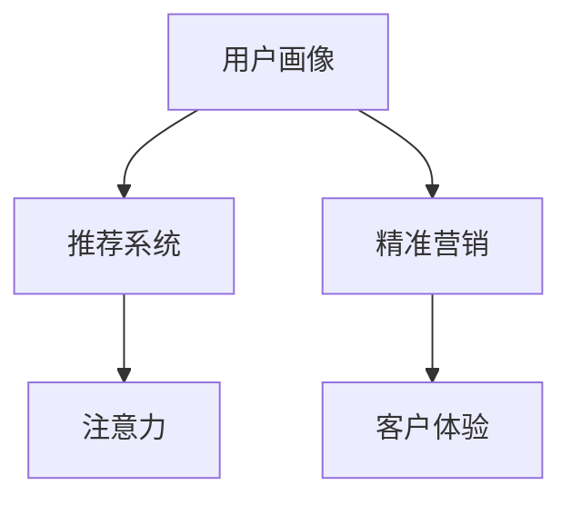

                 

## 1. 背景介绍

### 1.1 问题由来

在数字化时代的浪潮中，企业越来越依赖数据驱动的策略来提升市场竞争力和客户满意度。然而，面对海量用户数据，传统的"一刀切"营销策略已经难以满足用户的个性化需求，无法精准触达不同层次的用户群体。为此，注意力经济（Attention Economy）应运而生，通过精准的用户画像和个性化推荐，最大化地吸引和利用用户的注意力，提升品牌价值和用户粘性。

### 1.2 问题核心关键点

注意力经济的核心在于利用人工智能技术，通过深度学习和推荐系统，挖掘和理解用户行为模式和偏好，实现针对用户的个性化营销策略。具体而言，以下关键点构成了注意力经济与个性化营销的核心内容：

- 用户画像：基于用户行为数据、社交网络数据、地理信息等，构建详尽且真实准确的用户画像，为个性化营销提供基础。
- 推荐系统：通过机器学习算法，对用户行为进行建模，实现内容推荐和商品推荐，引导用户进行互动和消费。
- 精准营销：根据用户画像和推荐结果，定制个性化广告和活动，提升用户转化率和品牌认知度。
- 客户体验：通过优化界面设计、互动方式、服务质量等，提升用户满意度和品牌忠诚度。

通过这些关键技术，企业可以在有限的注意力资源中，最大化地吸引用户注意力，实现高效精准的营销策略，带来可观的经济价值。

## 2. 核心概念与联系

### 2.1 核心概念概述

为更好地理解注意力经济与个性化营销策略，我们首先定义几个核心概念：

- **用户画像(User Profiling)**：通过收集和分析用户的行为数据、社交网络数据、地理位置等，构建详尽且真实准确的用户画像，为个性化推荐和营销策略提供基础。

- **推荐系统(Recommendation System)**：利用机器学习算法，对用户行为进行建模，推荐符合用户兴趣的内容和商品，提升用户满意度和转化率。

- **注意力(Attention)**：用户注意力的获取和利用，是企业提升品牌价值和用户粘性的关键。通过精准的用户画像和推荐结果，可以更好地吸引和利用用户的注意力，提升营销效果。

- **个性化营销(Personalized Marketing)**：针对不同用户的行为特征和偏好，定制个性化广告和活动，提升用户转化率和品牌忠诚度。

这些概念之间的逻辑关系可以通过以下Mermaid流程图来展示：



这个流程图展示了用户画像、推荐系统、精准营销和客户体验之间的联系，以及注意力经济中关键技术的相互作用。

## 3. 核心算法原理 & 具体操作步骤

### 3.1 算法原理概述

基于注意力经济的个性化营销策略，本质上是一个机器学习驱动的决策优化过程。其核心思想是通过用户画像和行为数据的建模，构建用户兴趣和行为的预测模型，进而实现内容的精准推荐和个性化广告的投放。

具体而言，注意力经济与个性化营销策略包括以下几个步骤：

1. **用户画像构建**：利用用户的历史行为数据、社交网络数据、地理位置等，构建详尽且真实准确的用户画像，作为个性化推荐的基础。
2. **推荐模型训练**：基于用户画像和行为数据，构建推荐模型，预测用户对不同内容的兴趣度，实现内容的个性化推荐。
3. **精准营销策略**：根据推荐结果，定制个性化广告和活动，提升用户转化率和品牌忠诚度。
4. **客户体验优化**：通过优化界面设计、互动方式、服务质量等，提升用户满意度和品牌忠诚度。

这些步骤中，用户画像和推荐模型是实现个性化营销的核心技术，而精准营销和客户体验优化则是保证策略实施效果的关键环节。

### 3.2 算法步骤详解

#### 3.2.1 用户画像构建

用户画像构建是个性化推荐和营销策略的基础。以下是构建用户画像的详细步骤：

1. **数据收集**：收集用户的历史行为数据（如点击、浏览、购买记录）、社交网络数据（如好友、粉丝、互动行为）、地理位置数据（如IP地址、GPS坐标）等，获取全面且准确的用户信息。

2. **数据预处理**：对收集到的数据进行清洗、归一化、去重等处理，去除噪声数据，确保数据的准确性和完整性。

3. **特征工程**：提取和构建用户画像的关键特征，如兴趣标签、行为序列、社交关系等，形成用户特征向量。

4. **聚类分析**：使用聚类算法（如K-means、GMM）对用户进行分组，构建不同用户群体的特征描述，形成用户画像。

5. **画像更新**：实时更新用户画像，确保用户画像的时效性和准确性，提升个性化推荐的效果。

#### 3.2.2 推荐模型训练

推荐模型训练是实现个性化推荐的核心步骤。以下是推荐模型训练的详细步骤：

1. **选择算法**：根据数据特征和推荐场景，选择合适的推荐算法，如协同过滤、内容推荐、深度学习等。

2. **数据准备**：准备推荐模型的训练数据，通常包括用户画像数据、物品特征数据、行为记录数据等。

3. **模型训练**：使用训练数据对推荐模型进行训练，优化模型的参数，提升模型的准确性和泛化能力。

4. **模型评估**：使用验证集对训练好的模型进行评估，选择性能最优的模型进行推广。

5. **模型优化**：根据评估结果，对模型进行调优，提升模型的推荐精度和效率。

#### 3.2.3 精准营销策略

精准营销策略是实现个性化推荐的核心目标。以下是精准营销策略的详细步骤：

1. **内容选择**：根据用户画像和推荐结果，选择符合用户兴趣和需求的内容，如文章、视频、商品等。

2. **广告投放**：将精选的内容进行个性化广告投放，通过多种渠道（如社交媒体、搜索引擎、邮件等）触达用户。

3. **活动设计**：设计符合用户兴趣和需求的营销活动，如优惠券、限时折扣、用户互动等，提升用户转化率。

4. **效果评估**：通过用户反馈、转化率、点击率等指标，评估营销活动的效果，优化策略。

#### 3.2.4 客户体验优化

客户体验优化是实现个性化营销的重要保障。以下是客户体验优化的详细步骤：

1. **界面设计**：设计符合用户习惯和需求的界面，提升用户的交互体验。

2. **互动方式**：设计多种互动方式（如聊天机器人、用户反馈机制），增强用户的参与感。

3. **服务质量**：提升服务质量，如快速响应、准确解答、隐私保护等，提升用户的满意度和忠诚度。

### 3.3 算法优缺点

#### 3.3.1 算法优点

基于注意力经济的个性化营销策略具有以下优点：

1. **精准度高**：通过用户画像和推荐模型，可以精准预测用户需求，实现内容的个性化推荐。
2. **用户粘性高**：通过优化客户体验，提升用户的满意度和忠诚度，增加用户粘性。
3. **营销效率高**：通过精准营销策略，提升广告投放和活动设计的效率，降低营销成本。
4. **数据驱动**：基于数据驱动的决策优化过程，可以持续优化和提升营销效果。

#### 3.3.2 算法缺点

基于注意力经济的个性化营销策略也存在以下缺点：

1. **隐私问题**：用户画像的构建和使用涉及大量敏感数据，可能引发隐私保护问题。
2. **数据依赖性强**：推荐系统的性能依赖于数据的质量和多样性，数据不足可能影响推荐效果。
3. **计算资源需求高**：用户画像和推荐模型的训练需要大量计算资源，成本较高。
4. **模型复杂度高**：复杂度高的推荐模型可能导致过拟合，影响泛化能力。
5. **用户干预高**：用户画像和推荐模型的构建需要人工干预，数据收集和处理环节复杂。

尽管存在这些缺点，但通过合理的设计和优化，这些问题可以得到有效解决。未来，随着技术进步和数据隐私保护的完善，基于注意力经济的个性化营销策略将越来越成熟，带来更大的市场价值。

### 3.4 算法应用领域

基于注意力经济的个性化营销策略，已经在多个领域得到了广泛应用，例如：

1. **电商推荐**：通过用户画像和行为数据的建模，实现商品的精准推荐，提升用户购买转化率。
2. **内容推荐**：如视频平台、新闻网站等，通过用户画像和兴趣模型，实现内容的个性化推荐，提升用户使用体验。
3. **社交网络**：如微博、微信等，通过用户画像和社交网络数据的分析，实现用户互动和广告投放的精准化。
4. **在线广告**：通过用户画像和推荐模型，实现广告的精准投放，提升广告效果和用户体验。
5. **金融服务**：如银行、保险等，通过用户画像和行为数据的分析，实现个性化的金融服务和产品推荐。

除了上述这些经典领域外，基于注意力经济的个性化营销策略还被创新性地应用到更多场景中，如医疗、旅游、教育等，为各行业带来了变革性影响。随着技术的不断进步和应用的深入，相信基于注意力经济的个性化营销策略将带来更多的商业价值和社会影响。

## 4. 数学模型和公式 & 详细讲解 & 举例说明

### 4.1 数学模型构建

本节将使用数学语言对注意力经济与个性化营销策略进行更加严格的刻画。

假设用户画像为 $X=\{x_1, x_2, ..., x_n\}$，每个用户画像的特征向量为 $x_i \in \mathbb{R}^d$。推荐模型的预测结果为 $Y=\{y_1, y_2, ..., y_m\}$，每个预测结果的向量表示为 $y_i \in \mathbb{R}^k$。

定义用户画像和预测结果之间的相似度为 $S(X, Y) \in \mathbb{R}$，通常使用余弦相似度或欧几里得距离等方法计算。推荐模型的损失函数为：

$$
\mathcal{L}(X, Y) = \frac{1}{N} \sum_{i=1}^N \min(\mathcal{L}_i, \beta)
$$

其中 $\mathcal{L}_i$ 为第 $i$ 个用户画像和推荐结果的损失，$\beta$ 为损失的上限，避免损失过大导致模型失效。

### 4.2 公式推导过程

以下我们以协同过滤推荐算法为例，推导推荐模型的损失函数及其梯度计算公式。

假设协同过滤算法使用的是基于用户相似度的推荐方法，设用户 $i$ 和 $j$ 的相似度为 $s_{ij}$。推荐模型预测用户 $i$ 对商品 $k$ 的评分 $r_{ik}$。则推荐模型的损失函数可以表示为：

$$
\mathcal{L}_i = \frac{1}{M} \sum_{k=1}^M (r_{ik} - \hat{r}_{ik})^2
$$

其中 $\hat{r}_{ik}$ 为协同过滤算法预测的用户 $i$ 对商品 $k$ 的评分。

将损失函数对 $\hat{r}_{ik}$ 求导，得到梯度公式：

$$
\frac{\partial \mathcal{L}_i}{\partial \hat{r}_{ik}} = -2(r_{ik} - \hat{r}_{ik})
$$

根据链式法则，梯度公式可以进一步推导为：

$$
\frac{\partial \mathcal{L}_i}{\partial s_{ij}} = \frac{\partial \mathcal{L}_i}{\partial \hat{r}_{ik}} \frac{\partial \hat{r}_{ik}}{\partial s_{ij}}
$$

其中 $\frac{\partial \hat{r}_{ik}}{\partial s_{ij}}$ 可以通过协同过滤算法求解，具体推导过程可以参考相关算法文献。

### 4.3 案例分析与讲解

#### 4.3.1 协同过滤推荐算法

协同过滤推荐算法是推荐系统中常用的方法之一。其核心思想是通过计算用户之间的相似度，找到与目标用户兴趣相近的其他用户，根据这些用户的偏好推荐商品。

协同过滤算法有两种主要类型：基于用户的协同过滤和基于物品的协同过滤。基于用户的协同过滤通过计算用户之间的相似度，为用户推荐相似用户喜欢的商品。基于物品的协同过滤通过计算物品之间的相似度，为用户推荐与喜欢物品相似的其他物品。

协同过滤算法的优点在于其简单高效，不需要显式的用户特征，可以直接使用用户行为数据。但协同过滤算法也存在数据稀疏性问题，即用户对某些商品的评分不足，导致推荐精度下降。

为了解决这一问题，协同过滤算法可以通过用户和物品的协同矩阵进行求解，采用矩阵分解等方法，对稀疏矩阵进行填补和优化。同时，为了提高推荐精度，协同过滤算法还可以引入更多用户行为特征（如评分变化、时间序列等），进一步提升推荐效果。

#### 4.3.2 深度学习推荐算法

深度学习推荐算法通过神经网络对用户行为数据进行建模，实现更加精准的推荐。其核心思想是通过神经网络对用户画像和行为数据的特征进行编码，构建用户兴趣和行为的预测模型。

深度学习推荐算法主要有两种类型：基于矩阵分解的深度学习推荐和基于序列建模的深度学习推荐。基于矩阵分解的深度学习推荐通过神经网络对用户和物品的协同矩阵进行建模，实现推荐。基于序列建模的深度学习推荐通过神经网络对用户行为序列进行建模，实现推荐。

深度学习推荐算法的优点在于其可以处理大量用户行为数据，同时能够学习更深层次的特征表示，提升推荐精度。但深度学习推荐算法也存在过拟合问题，需要大量的标注数据进行训练。

为了解决过拟合问题，深度学习推荐算法可以通过正则化技术、dropout等方法进行优化。同时，为了提高推荐效果，深度学习推荐算法还可以引入更多的特征（如用户画像、物品特征等），进一步提升推荐精度。

## 5. 项目实践：代码实例和详细解释说明

### 5.1 开发环境搭建

在进行个性化营销策略的开发实践前，我们需要准备好开发环境。以下是使用Python进行开发的环境配置流程：

1. 安装Anaconda：从官网下载并安装Anaconda，用于创建独立的Python环境。

2. 创建并激活虚拟环境：
```bash
conda create -n marketing-env python=3.8 
conda activate marketing-env
```

3. 安装PyTorch：根据CUDA版本，从官网获取对应的安装命令。例如：
```bash
conda install pytorch torchvision torchaudio cudatoolkit=11.1 -c pytorch -c conda-forge
```

4. 安装TensorFlow：
```bash
conda install tensorflow -c conda-forge
```

5. 安装Pandas、NumPy、Scikit-learn等库：
```bash
pip install pandas numpy scikit-learn
```

完成上述步骤后，即可在`marketing-env`环境中开始开发实践。

### 5.2 源代码详细实现

这里我们以电商推荐系统为例，使用协同过滤算法实现用户行为的个性化推荐。

首先，定义协同过滤算法的类：

```python
from sklearn.metrics.pairwise import cosine_similarity
import numpy as np

class CollaborativeFiltering:
    def __init__(self, ratings, similarity='cosine'):
        self.ratings = ratings
        self.similarity = similarity
        
        self.user_profiles = {}
        self.item_profiles = {}
        self.similarity_matrix = None
        
    def fit(self):
        # 计算用户和物品的相似度矩阵
        self.similarity_matrix = cosine_similarity(self.ratings)
        
        # 计算用户和物品的特征向量
        self.user_profiles = {}
        self.item_profiles = {}
        for user, items in self.ratings.items():
            user_profile = np.mean(self.similarity_matrix[user], axis=1)
            self.user_profiles[user] = user_profile
            item_profile = np.mean(self.similarity_matrix[:, user], axis=0)
            self.item_profiles[user] = item_profile
        
    def predict(self, user, items):
        user_profile = self.user_profiles[user]
        item_profiles = self.item_profiles
        preds = np.zeros_like(items)
        for item in items:
            preds[item] = np.dot(user_profile, item_profiles[item])
        return preds
```

然后，定义电商推荐系统的接口：

```python
from flask import Flask, request, jsonify

app = Flask(__name__)

class RecommendationSystem:
    def __init__(self):
        self.filter = CollaborativeFiltering(ratings)
        
    def predict(self, user, items):
        preds = self.filter.predict(user, items)
        return preds.tolist()
        
@app.route('/recommend', methods=['POST'])
def recommend():
    data = request.get_json()
    user = data['user']
    items = data['items']
    
    preds = self.predict(user, items)
    return jsonify(preds)
    
if __name__ == '__main__':
    app.run(debug=True)
```

在用户向推荐系统发起请求时，推荐系统通过获取用户ID和商品ID，调用推荐算法进行预测，返回推荐结果。

### 5.3 代码解读与分析

让我们再详细解读一下关键代码的实现细节：

**CollaborativeFiltering类**：
- `__init__`方法：初始化协同过滤算法的输入数据和相似度计算方法。
- `fit`方法：计算用户和物品的相似度矩阵，并计算用户和物品的特征向量。
- `predict`方法：根据用户画像和物品特征向量，计算物品的预测评分。

**RecommendationSystem类**：
- `__init__`方法：初始化推荐系统，并实例化协同过滤算法。
- `predict`方法：根据用户ID和商品ID，调用协同过滤算法进行预测。
- `recommend`方法：接收用户ID和商品ID，调用预测方法，并返回推荐结果。

**RecommendationSystem接口**：
- `/recommend`接口：接收用户ID和商品ID，调用推荐系统进行预测，并返回推荐结果。

可以看到，通过Python和相关库的简单封装，协同过滤算法可以很容易地实现电商推荐系统的开发。开发者可以将更多精力放在数据处理、算法优化等高层逻辑上，而不必过多关注底层的实现细节。

当然，工业级的系统实现还需考虑更多因素，如推荐结果的缓存、实时性、用户反馈等。但核心的个性化推荐算法基本与此类似。

## 6. 实际应用场景

### 6.1 电商推荐

电商推荐系统是注意力经济与个性化营销策略的主要应用场景之一。通过用户行为数据的建模和推荐算法的应用，电商推荐系统可以为用户提供个性化的商品推荐，提升用户购买转化率和满意度。

在实际应用中，电商推荐系统通常会收集用户的浏览、点击、购买等行为数据，利用协同过滤算法、深度学习推荐算法等进行建模和推荐。推荐系统可以根据用户的行为特征和历史购买记录，精准预测用户对不同商品的兴趣度，实现商品的个性化推荐。

电商推荐系统的成功案例包括亚马逊、淘宝等电商平台。这些平台通过用户的点击、浏览、购买等行为数据，构建详尽且真实准确的用户画像，实现商品的精准推荐，极大提升了用户购买转化率和满意度。

### 6.2 内容推荐

内容推荐系统是注意力经济与个性化营销策略的另一重要应用场景。通过用户行为数据的建模和推荐算法的应用，内容推荐系统可以为用户提供个性化的内容推荐，提升用户使用体验。

在实际应用中，内容推荐系统通常会收集用户的浏览、观看、点赞等行为数据，利用协同过滤算法、深度学习推荐算法等进行建模和推荐。推荐系统可以根据用户的兴趣偏好和行为特征，精准预测用户对不同内容的兴趣度，实现内容的个性化推荐。

内容推荐系统的成功案例包括Netflix、YouTube等平台。这些平台通过用户的观看记录、评分等行为数据，构建详尽且真实准确的用户画像，实现内容的精准推荐，极大提升了用户的使用体验。

### 6.3 社交网络

社交网络平台是注意力经济与个性化营销策略的重要应用场景。通过用户行为数据的建模和推荐算法的应用，社交网络平台可以为用户提供个性化的社交互动和广告推荐，提升用户粘性和广告效果。

在实际应用中，社交网络平台通常会收集用户的互动、点赞、分享等行为数据，利用协同过滤算法、深度学习推荐算法等进行建模和推荐。推荐系统可以根据用户的兴趣偏好和行为特征，精准预测用户对不同广告和互动内容的兴趣度，实现广告的精准投放和社交互动的个性化推荐。

社交网络平台的成功案例包括Facebook、微信等平台。这些平台通过用户的互动行为数据，构建详尽且真实准确的用户画像，实现广告和社交互动的精准推荐，极大提升了用户粘性和广告效果。

### 6.4 未来应用展望

随着注意力经济与个性化营销策略的不断发展，其在更多领域得到应用，为传统行业带来变革性影响。

在智慧医疗领域，通过用户行为数据的建模和推荐算法的应用，医疗推荐系统可以为患者提供个性化的诊疗建议和治疗方案，提升患者满意度和治疗效果。

在智能教育领域，通过用户行为数据的建模和推荐算法的应用，教育推荐系统可以为学生提供个性化的学习资源和课程推荐，提升学习效果和教育质量。

在智慧城市治理中，通过用户行为数据的建模和推荐算法的应用，智能推荐系统可以为城市居民提供个性化的服务推荐，提升城市管理和居民生活质量。

此外，在企业生产、社会治理、文娱传媒等众多领域，基于注意力经济的个性化营销策略也将不断涌现，为各行业带来变革性影响。相信随着技术的不断进步和应用的深入，基于注意力经济的个性化营销策略将带来更多的商业价值和社会影响。

## 7. 工具和资源推荐

### 7.1 学习资源推荐

为了帮助开发者系统掌握注意力经济与个性化营销策略的理论基础和实践技巧，这里推荐一些优质的学习资源：

1. 《深度学习理论与实践》系列博文：由大模型技术专家撰写，深入浅出地介绍了深度学习理论、算法和实践技巧，涵盖了个性化推荐、注意力机制等内容。

2. CS229《机器学习》课程：斯坦福大学开设的经典课程，涵盖机器学习基础理论和实践方法，包括推荐系统、注意力机制等内容。

3. 《推荐系统：基础与实践》书籍：推荐系统的经典著作，详细介绍了推荐算法、数据处理和系统实现等方方面面的内容，是学习推荐系统的必读书籍。

4. 《深度学习在推荐系统中的应用》系列课程：由Google、Facebook等公司开设的推荐系统课程，深入浅出地介绍了推荐系统理论和实践方法，涵盖协同过滤、深度学习推荐等内容。

5. Kaggle平台：推荐系统相关的数据集和竞赛，可以帮助开发者实践推荐算法的优化和评估，提升算法效果。

通过对这些资源的学习实践，相信你一定能够快速掌握注意力经济与个性化营销策略的精髓，并用于解决实际的个性化推荐问题。

### 7.2 开发工具推荐

高效的开发离不开优秀的工具支持。以下是几款用于个性化推荐系统开发的常用工具：

1. TensorFlow：由Google主导开发的深度学习框架，功能强大，支持分布式计算，适合大规模工程应用。

2. PyTorch：由Facebook主导开发的深度学习框架，灵活高效，适合快速迭代研究。

3. scikit-learn：开源机器学习库，提供丰富的算法实现和评估工具，适合数据处理和模型构建。

4. Spark：开源大数据处理框架，支持大规模数据处理和并行计算，适合推荐系统的工程实现。

5. Elasticsearch：开源搜索引擎，支持快速索引和查询，适合个性化推荐系统的实时查询需求。

合理利用这些工具，可以显著提升个性化推荐系统的开发效率，加快创新迭代的步伐。

### 7.3 相关论文推荐

注意力经济与个性化营销策略的研究源于学界的持续研究。以下是几篇奠基性的相关论文，推荐阅读：

1. BPR: Bayesian Personalized Ranking from Pairwise Data（即BPR算法）：提出了基于对数几率损失函数的双边排名算法，是协同过滤推荐算法的经典方法之一。

2. Matrix Factorization Techniques for Recommender Systems：总结了矩阵分解方法在推荐系统中的应用，提出了奇异值分解、低秩矩阵分解等经典方法。

3. Factorization Machines for Predictive Response to Treatment：提出了因子机模型（FM），用于处理高维稀疏数据，提升推荐系统的准确性和泛化能力。

4. Deep Learning for Recommender Systems: A Survey and Applications：总结了深度学习在推荐系统中的应用，提出了深度神经网络、深度置信网络、深度强化学习等方法。

5. Attention Is All You Need：提出了自注意力机制，为深度学习推荐系统提供了新的思路，实现了更加精准的推荐。

这些论文代表了大数据推荐系统的发展脉络。通过学习这些前沿成果，可以帮助研究者把握学科前进方向，激发更多的创新灵感。

## 8. 总结：未来发展趋势与挑战

### 8.1 总结

本文对注意力经济与个性化营销策略进行了全面系统的介绍。首先阐述了注意力经济的核心思想和个性化营销的应用场景，明确了基于用户画像和推荐模型的核心技术。其次，从原理到实践，详细讲解了推荐算法的数学模型和实现方法，给出了电商推荐系统的完整代码实例。同时，本文还广泛探讨了推荐系统在电商、内容推荐、社交网络等领域的实际应用，展示了注意力经济与个性化营销策略的巨大潜力。最后，本文精选了推荐系统的各类学习资源，力求为读者提供全方位的技术指引。

通过本文的系统梳理，可以看到，基于注意力经济的个性化营销策略已经在多个领域得到了广泛应用，为各行业带来了变革性影响。未来，随着技术的不断进步和应用的深入，基于注意力经济的个性化营销策略将带来更多的商业价值和社会影响。

### 8.2 未来发展趋势

展望未来，个性化推荐技术将呈现以下几个发展趋势：

1. **多模态推荐**：结合文本、图像、音频等多模态数据，构建更加全面的用户画像，实现跨模态推荐。

2. **深度强化学习**：通过深度强化学习算法，优化推荐系统的决策过程，实现更加智能化的推荐。

3. **实时推荐系统**：结合流式计算和实时数据处理技术，实现实时的个性化推荐，提升用户体验。

4. **联邦学习**：通过联邦学习技术，实现用户隐私保护和模型联邦化，提升推荐系统的泛化能力和鲁棒性。

5. **模型压缩与加速**：通过模型压缩和加速技术，降低推荐系统的计算成本，提升推荐效率。

6. **元学习**：通过元学习技术，快速适应新数据和新任务，提升推荐系统的迁移能力。

这些趋势凸显了个性化推荐技术的广阔前景。这些方向的探索发展，必将进一步提升推荐系统的性能和应用范围，为人工智能技术在各行各业的应用带来新的突破。

### 8.3 面临的挑战

尽管个性化推荐技术已经取得了显著成果，但在迈向更加智能化、普适化应用的过程中，仍面临诸多挑战：

1. **数据隐私问题**：用户行为数据的收集和处理涉及大量敏感信息，如何保护用户隐私，避免数据泄露，是一个重要问题。

2. **数据冷启动问题**：新用户的用户画像和行为数据不足，导致推荐精度下降，需要新的方法来解决数据冷启动问题。

3. **模型泛化能力**：推荐模型在处理新数据和新任务时，容易出现过拟合问题，需要进一步提高模型的泛化能力。

4. **计算资源需求**：推荐系统的训练和推理需要大量的计算资源，如何优化计算资源的使用，是一个重要问题。

5. **用户干预高**：用户画像和推荐模型的构建需要人工干预，数据收集和处理环节复杂，如何自动化处理和优化，是一个重要问题。

尽管存在这些挑战，但通过合理的设计和优化，这些问题可以得到有效解决。未来，随着技术的进步和应用的深入，个性化推荐技术将越来越成熟，带来更大的市场价值和社会影响。

### 8.4 研究展望

面对个性化推荐技术所面临的挑战，未来的研究需要在以下几个方面寻求新的突破：

1. **基于用户生成内容（UGC）的推荐**：通过用户生成的内容（如评论、评分等），构建更加丰富和真实准确的用户画像，提升推荐精度。

2. **社交网络数据的应用**：结合社交网络数据，构建更加全面的用户画像，实现跨社交平台的推荐。

3. **多领域数据融合**：结合不同领域的用户行为数据，构建更加全面和通用的用户画像，提升推荐系统的泛化能力和鲁棒性。

4. **实时推荐系统的优化**：结合流式计算和实时数据处理技术，优化实时推荐系统的算法和架构，提升推荐效率和用户体验。

5. **个性化推荐系统的自适应**：通过自适应学习技术，不断更新和优化推荐系统的参数和模型，提升推荐系统的迁移能力和鲁棒性。

这些研究方向的探索，必将引领个性化推荐技术迈向更高的台阶，为构建高效精准的个性化推荐系统铺平道路。

## 9. 附录：常见问题与解答

**Q1：个性化推荐系统是否适用于所有业务场景？**

A: 个性化推荐系统在大多数业务场景中都能取得不错的效果，特别是对于用户多样性高、数据量大的业务场景。但对于一些特定场景，如新闻、医疗等，仅仅依靠用户行为数据可能难以获得理想的推荐效果。此时需要在特定领域数据上进行进一步预处理和建模，才能实现良好的推荐。

**Q2：如何避免推荐系统中的推荐马太效应？**

A: 推荐系统中的推荐马太效应指的是，推荐系统倾向于推荐用户已经喜欢过的商品，导致用户陷入“信息茧房”。为避免这一问题，可以采取以下措施：

1. **多样性约束**：在推荐算法中加入多样性约束，确保推荐结果的多样性，避免推荐过少或过多的相似商品。

2. **新颖性推荐**：在推荐算法中加入新颖性推荐机制，推荐用户可能感兴趣的新商品，避免陷入推荐马太效应。

3. **动态调整**：根据用户反馈和行为数据，动态调整推荐算法和模型，提升推荐结果的多样性和新颖性。

**Q3：如何衡量个性化推荐系统的性能？**

A: 衡量个性化推荐系统的性能通常使用以下指标：

1. **准确率（Accuracy）**：推荐系统预测结果与真实结果的一致程度，准确率越高，推荐效果越好。

2. **召回率（Recall）**：推荐系统预测的正样本中，真实正样本的比例，召回率越高，推荐系统发现正样本的能力越强。

3. **F1分数（F1 Score）**：综合考虑准确率和召回率，衡量推荐系统的整体性能。

4. **点击率（Click-Through Rate, CTR）**：用户点击推荐结果的比例，CTR越高，推荐效果越好。

5. **转化率（Conversion Rate）**：用户根据推荐结果完成购买或使用的比例，转化率越高，推荐效果越好。

通过综合使用这些指标，可以全面评估推荐系统的性能，并进行优化。

**Q4：如何优化个性化推荐系统的计算资源使用？**

A: 优化个性化推荐系统的计算资源使用，可以从以下几个方面进行：

1. **模型压缩**：通过模型压缩技术，减小模型参数量，提升模型推理效率。

2. **分布式计算**：结合分布式计算技术，实现大规模数据的高效处理和推理。

3. **缓存技术**：使用缓存技术，减少重复计算，提升推荐系统响应速度。

4. **算法优化**：优化推荐算法的计算图，减少计算量，提升推荐系统效率。

通过这些措施，可以显著提升个性化推荐系统的计算资源使用效率，降低计算成本。

**Q5：个性化推荐系统的应用场景有哪些？**

A: 个性化推荐系统在以下场景中得到了广泛应用：

1. **电商推荐**：通过用户行为数据的建模，实现商品的个性化推荐，提升用户购买转化率。

2. **内容推荐**：如视频平台、新闻网站等，通过用户行为数据的建模，实现内容的个性化推荐，提升用户使用体验。

3. **社交网络**：如微博、微信等，通过用户行为数据的建模，实现广告和社交互动的个性化推荐，提升用户粘性和广告效果。

4. **金融服务**：如银行、保险等，通过用户行为数据的建模，实现个性化的金融服务和产品推荐。

5. **智慧医疗**：通过用户行为数据的建模，实现个性化的诊疗建议和治疗方案推荐，提升患者满意度和治疗效果。

6. **智能教育**：通过用户行为数据的建模，实现个性化的学习资源和课程推荐，提升学习效果和教育质量。

除了上述这些经典领域外，基于个性化推荐系统的应用还拓展到了更多场景，如智慧城市治理、智慧旅游、智慧传媒等，为各行业带来了变革性影响。

**Q6：如何应对个性化推荐系统中的用户隐私问题？**

A: 个性化推荐系统中的用户隐私问题主要涉及用户行为数据的收集和使用。为应对这一问题，可以采取以下措施：

1. **数据匿名化**：对用户行为数据进行匿名化处理，去除敏感信息，保护用户隐私。

2. **数据加密**：对用户行为数据进行加密存储和传输，确保数据安全。

3. **用户控制权**：允许用户对其行为数据进行控制，如数据共享、删除等，增强用户隐私保护。

4. **隐私保护算法**：使用隐私保护算法（如差分隐私、联邦学习等），确保用户隐私在数据处理和使用过程中不被泄露。

通过这些措施，可以有效应对个性化推荐系统中的用户隐私问题，保护用户隐私。

**Q7：个性化推荐系统如何应对冷启动问题？**

A: 个性化推荐系统中的冷启动问题指的是，新用户或新商品在初始阶段，用户画像和商品特征数据不足，导致推荐精度下降。为应对这一问题，可以采取以下措施：

1. **冷启动模型**：使用冷启动推荐模型（如基于内容的推荐、基于社交网络的推荐等），解决新用户和新商品的推荐问题。

2. **混合推荐算法**：结合多种推荐算法，如协同过滤推荐、内容推荐、混合推荐等，解决冷启动问题。

3. **数据扩充**：通过用户行为数据的扩充和采集，增加新用户和新商品的特征数据，提升推荐精度。

4. **用户行为引导**：通过引导新用户生成更多的行为数据，增加新用户的特征数据，提升推荐精度。

通过这些措施，可以有效应对个性化推荐系统中的冷启动问题，提升推荐精度。

---

作者：禅与计算机程序设计艺术 / Zen and the Art of Computer Programming

