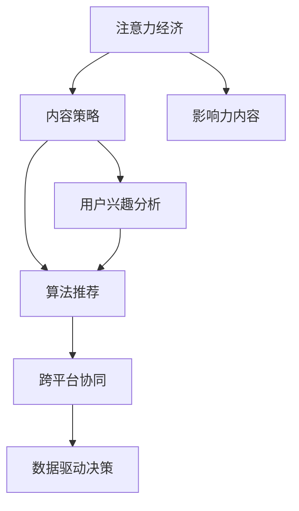

                 

# 注意力经济与内容策略规划与实践：为受众创建有影响力的内容

> 关键词：注意力经济,内容策略,影响力内容,用户参与,数据驱动

## 1. 背景介绍

### 1.1 问题由来
随着互联网的发展，注意力经济日益成为信息时代的核心。海量的内容洪流冲击着用户的注意力资源，如何吸引并保持用户关注，成为品牌和企业竞争的关键。传统内容营销通过内容传播获得关注，但面对海量信息，效果往往不尽如人意。而基于数据分析和算法推荐的内容策略，能够精准匹配用户兴趣，提升内容影响力。

### 1.2 问题核心关键点
注意力经济与内容策略规划实践的核心在于：利用数据分析和算法推荐技术，精确地为用户提供个性化的内容推荐，提升用户参与度和内容影响力，实现品牌价值最大化。具体关键点包括：

1. **用户兴趣分析**：通过数据分析挖掘用户兴趣和行为模式，构建精准的用户画像。
2. **内容匹配推荐**：利用算法推荐技术，将合适的内容推荐给目标用户，提升用户满意度。
3. **内容效果评估**：通过指标评估内容推荐的实际效果，及时调整优化内容策略。
4. **跨平台协同**：在多个平台和渠道上协同推广内容，形成统一的品牌形象。
5. **数据驱动决策**：依托数据驱动，实时调整内容策略，灵活应对市场变化。

### 1.3 问题研究意义
内容策略的成功实施，对于提升品牌价值、增强用户粘性、提升营销效果具有重要意义：

1. **提升用户参与度**：通过精准匹配内容，使用户对品牌的认知和情感连接更强，增强用户参与度。
2. **提高内容影响力**：使内容能够更广泛传播，提升品牌的知名度和美誉度。
3. **优化广告ROI**：提高广告转化率，优化广告投放效果，提升投资回报率。
4. **促进用户转化**：通过个性化的内容推荐，引导用户完成购买或注册等关键行为。
5. **数据驱动决策**：使内容策略更科学、更高效，提升决策精准性。

## 2. 核心概念与联系

### 2.1 核心概念概述

为更好地理解注意力经济与内容策略规划实践，本节将介绍几个密切相关的核心概念：

- **注意力经济**：指在信息过载的时代，通过吸引和保持用户注意力，获取经济价值的过程。注意力经济的核心在于内容的分发和传播。
- **内容策略**：指企业通过内容来达成目标，包括内容的类型、主题、风格、发布频率等策略规划。
- **影响力内容**：指能够引发用户情感共鸣，推动品牌传播，提升用户参与度的内容。
- **用户兴趣分析**：通过数据挖掘和分析，识别用户兴趣和行为模式，构建用户画像。
- **算法推荐**：基于用户行为数据，使用机器学习算法为用户推荐合适的内容。
- **跨平台协同**：在多个平台和渠道上协同推广内容，形成统一的品牌形象。
- **数据驱动决策**：通过数据监控和分析，实时调整内容策略，优化效果。

这些核心概念之间的逻辑关系可以通过以下Mermaid流程图来展示：



这个流程图展示了的核心概念及其之间的关系：

1. 注意力经济通过内容分发和传播吸引用户。
2. 内容策略规划为内容的分发和传播提供方向。
3. 影响力内容通过精准匹配，提升用户参与度。
4. 用户兴趣分析通过数据挖掘，构建用户画像。
5. 算法推荐基于用户画像，实现个性化推荐。
6. 跨平台协同提升内容传播效果，形成统一品牌形象。
7. 数据驱动决策实时调整内容策略，优化效果。

这些概念共同构成了注意力经济与内容策略规划的完整框架，助力企业实现内容营销的最大价值。

## 3. 核心算法原理 & 具体操作步骤

### 3.1 算法原理概述

注意力经济与内容策略规划实践的核心算法原理基于数据分析和算法推荐。其核心思想是通过用户行为数据的分析，构建精准的用户画像，使用算法推荐技术，将合适的内容精准匹配给目标用户。

形式化地，假设用户集合为 $U$，内容集合为 $C$，用户对内容的互动数据为 $I$，内容策略为 $P$。则目标是通过分析 $I$ 和 $P$，找到最优的内容推荐策略 $R$，使得：

$$
R = \mathop{\arg\min}_{R} \mathcal{L}(R,I,P)
$$

其中 $\mathcal{L}$ 为用户参与度损失函数，衡量内容推荐对用户参与度的影响。用户参与度可以通过点击率、转化率、停留时间等指标衡量。

### 3.2 算法步骤详解

注意力经济与内容策略规划实践的一般步骤如下：

**Step 1: 收集和整理数据**
- 收集用户与内容的互动数据，包括点击、浏览、点赞、评论等。
- 整理和清洗数据，去除异常值和噪声，保证数据质量。

**Step 2: 用户兴趣分析**
- 使用聚类、分类等算法对用户进行分类，识别不同用户群体。
- 提取用户的行为特征，如浏览历史、点击偏好、活跃时间等，构建用户画像。

**Step 3: 内容标签和推荐模型**
- 对内容进行标签标注，提取内容的关键特征，如关键词、标签、主题等。
- 选择适合的推荐算法，如协同过滤、基于内容的推荐、深度学习等。

**Step 4: 模型训练与调参**
- 根据用户画像和内容标签，训练推荐模型。
- 使用交叉验证、网格搜索等方法，调整模型参数，优化性能。

**Step 5: 推荐与评估**
- 将训练好的模型应用于实时推荐系统中，为用户推荐内容。
- 使用A/B测试、指标监控等方法，评估推荐效果。

**Step 6: 迭代优化**
- 根据评估结果，不断调整模型和策略，优化推荐效果。
- 实时监控数据，及时发现和解决推荐中的问题。

### 3.3 算法优缺点

注意力经济与内容策略规划实践的算法有以下优点：
1. 精准高效：基于数据驱动，能够精准匹配用户兴趣，提升推荐效果。
2. 可扩展性强：算法可应用于多渠道、多平台的内容推荐。
3. 实时动态：实时监控和调整推荐策略，提高用户体验。
4. 量化可控：通过指标评估推荐效果，数据驱动决策。

同时，该方法也存在一些局限性：
1. 数据隐私：需要收集用户行为数据，涉及隐私问题。
2. 数据质量：数据质量低、不完整，可能影响推荐效果。
3. 算法复杂：复杂的推荐算法可能导致模型难以解释，难以优化。
4. 推荐冷启动：新用户和冷启动内容难以获得推荐。
5. 多样性问题：过度个性化可能导致推荐内容过于集中，缺乏多样性。

尽管存在这些局限性，但就目前而言，基于数据和算法推荐的内容策略仍是提升内容影响力的主要手段。未来相关研究将进一步关注数据隐私、模型可解释性、冷启动等问题，使内容推荐更加科学、透明、高效。

### 3.4 算法应用领域

注意力经济与内容策略规划实践已经广泛应用于多个领域，包括但不限于：

- **电商推荐**：通过推荐个性化商品，提升用户购买意愿，提高转化率。
- **社交媒体内容**：通过推荐相关文章、视频，增加用户互动，提升内容曝光。
- **在线教育**：根据用户学习行为推荐个性化课程，提升学习效果。
- **新闻内容推荐**：为用户推荐相关新闻、专题，增加用户粘性。
- **视频平台**：推荐用户感兴趣的视频内容，提高观看时长。

除了上述这些主要应用领域，内容推荐策略还在广告投放、智能家居、健康医疗等领域得到了广泛应用，为各行各业带来了巨大的商业价值。

## 4. 数学模型和公式 & 详细讲解 & 举例说明

### 4.1 数学模型构建

本节将使用数学语言对基于注意力经济的内容推荐过程进行严格刻画。

假设用户集合为 $U$，内容集合为 $C$，用户与内容的互动数据为 $I$，内容策略为 $P$。定义推荐模型为 $f:U \rightarrow C$，表示为每个用户推荐一个内容。

目标是通过最小化用户参与度损失函数，找到最优推荐模型 $f$：

$$
f = \mathop{\arg\min}_{f} \mathcal{L}(f,I,P)
$$

其中 $\mathcal{L}$ 为用户参与度损失函数，可以表示为用户对推荐内容的满意度。假设用户对内容 $c \in C$ 的满意度为 $S(c)$，则：

$$
\mathcal{L}(f,I,P) = \frac{1}{N} \sum_{u \in U} \sum_{c \in C} I(u,c) \log S(f(u))
$$

在实践中，我们通常使用梯度下降等优化算法来近似求解上述最优化问题。设 $\eta$ 为学习率，则参数的更新公式为：

$$
\theta \leftarrow \theta - \eta \nabla_{\theta}\mathcal{L}(\theta) - \eta\lambda\theta
$$

其中 $\nabla_{\theta}\mathcal{L}(\theta)$ 为损失函数对参数 $\theta$ 的梯度，可通过反向传播算法高效计算。

### 4.2 公式推导过程

以下我们以协同过滤算法为例，推导其计算公式。

假设用户 $u$ 对内容 $c$ 的评分 $r_{u,c}$ 已知，可以构建用户-内容评分矩阵 $R$：

$$
R = \begin{bmatrix}
    r_{1,1} & r_{1,2} & \cdots & r_{1,C} \\
    r_{2,1} & r_{2,2} & \cdots & r_{2,C} \\
    \vdots & \vdots & \ddots & \vdots \\
    r_{U,1} & r_{U,2} & \cdots & r_{U,C}
\end{bmatrix}
$$

协同过滤算法通过矩阵分解，找到用户-内容的隐向量表示 $U$ 和 $V$：

$$
R \approx UV^T
$$

其中 $U \in \mathbb{R}^{U \times k}, V \in \mathbb{R}^{C \times k}$，$k$ 为隐向量维度。

用户 $u$ 对内容 $c$ 的预测评分 $r'_{u,c}$ 可以表示为：

$$
r'_{u,c} = \mathbf{u} \cdot \mathbf{v}_c
$$

其中 $\mathbf{u} = U_u, \mathbf{v}_c = V_c$。

最终，推荐模型 $f$ 为用户 $u$ 推荐内容 $c$，即选择预测评分 $r'_{u,c}$ 最大的内容作为推荐。

### 4.3 案例分析与讲解

以电商平台的个性化商品推荐为例，具体步骤如下：

1. 收集用户购买历史和浏览行为数据，构建用户行为矩阵 $R$。
2. 对用户和商品进行聚类，构建用户和商品的隐向量表示 $U$ 和 $V$。
3. 通过矩阵乘法，计算用户 $u$ 对商品 $c$ 的预测评分 $r'_{u,c}$。
4. 选择预测评分最高的商品作为推荐。

假设用户 $u=1$ 对商品 $c=1$ 的评分已知，用户 $u=1$ 对商品 $c=2$ 的预测评分计算如下：

$$
r'_{1,2} = \mathbf{u}_1 \cdot \mathbf{v}_2 = (U_1) \cdot (V_2)
$$

其中 $U_1$ 和 $V_2$ 分别为用户 $1$ 和商品 $2$ 的隐向量表示。通过上述计算，平台可以为用户 $1$ 推荐预测评分最高的商品 $c$。

## 5. 项目实践：代码实例和详细解释说明

### 5.1 开发环境搭建

在进行内容推荐实践前，我们需要准备好开发环境。以下是使用Python进行PyTorch开发的环境配置流程：

1. 安装Anaconda：从官网下载并安装Anaconda，用于创建独立的Python环境。

2. 创建并激活虚拟环境：
```bash
conda create -n pytorch-env python=3.8 
conda activate pytorch-env
```

3. 安装PyTorch：根据CUDA版本，从官网获取对应的安装命令。例如：
```bash
conda install pytorch torchvision torchaudio cudatoolkit=11.1 -c pytorch -c conda-forge
```

4. 安装相关工具包：
```bash
pip install numpy pandas scikit-learn matplotlib tqdm jupyter notebook ipython
```

完成上述步骤后，即可在`pytorch-env`环境中开始内容推荐实践。

### 5.2 源代码详细实现

这里我们以协同过滤算法为例，给出使用PyTorch进行内容推荐的PyTorch代码实现。

首先，定义用户行为数据和内容数据：

```python
import numpy as np
import pandas as pd
from sklearn.decomposition import TruncatedSVD
from scipy.sparse import coo_matrix

# 用户行为数据
user_ids = [1, 2, 3, 4, 5]
item_ids = [1, 2, 3, 4, 5, 6]
ratings = [5, 4, 5, 1, 5, 3, 2, 5, 4, 3]
df = pd.DataFrame({'user_id': user_ids, 'item_id': item_ids, 'rating': ratings})

# 内容数据
item_names = ['商品1', '商品2', '商品3', '商品4', '商品5', '商品6']
df['item_name'] = item_names
```

接着，构建用户行为矩阵并训练协同过滤模型：

```python
# 构建用户行为矩阵
user_item_matrix = df.pivot_table(index='user_id', columns='item_id', values='rating')

# 构建稀疏矩阵
data = user_item_matrix.values.ravel()
row = user_item_matrix.index.values.ravel()
col = user_item_matrix.columns.values.ravel()
sparse_matrix = coo_matrix((data, (row, col)), shape=(len(user_item_matrix.index), len(user_item_matrix.columns)))

# 使用TruncatedSVD进行矩阵分解
svd = TruncatedSVD(n_components=2, random_state=42)
U = svd.fit_transform(sparse_matrix).T
V = svd.components_

# 计算预测评分
user_scores = (user_item_matrix.values * V)
predicted_ratings = np.dot(user_scores, U.T)
```

最后，使用预测评分为用户推荐内容：

```python
# 选择预测评分最高的内容进行推荐
top_3_recommendations = predicted_ratings.argmax(axis=1)[:3]
for user, items in zip(df['user_id'], top_3_recommendations):
    print(f"用户 {user} 推荐内容：{df.loc[user, df['item_id'] == items]['item_name'].values}")
```

以上就是使用PyTorch对协同过滤算法进行内容推荐的完整代码实现。可以看到，通过Sympy和Scikit-learn的封装，代码实现相对简洁，能够快速上手实践。

### 5.3 代码解读与分析

让我们再详细解读一下关键代码的实现细节：

**用户行为数据处理**：
- 定义用户行为数据，包括用户ID、商品ID、评分。
- 将数据存储为pandas DataFrame，方便处理和分析。

**用户行为矩阵构建**：
- 使用pandas的pivot_table函数构建用户-商品评分矩阵。
- 使用Scipy的coo_matrix函数将稀疏矩阵转换为Scipy矩阵，方便后续处理。

**协同过滤模型训练**：
- 使用Scikit-learn的TruncatedSVD进行矩阵分解，得到用户和商品的隐向量表示。
- 计算用户对商品的预测评分，得到预测评分矩阵。

**内容推荐实现**：
- 通过预测评分矩阵，选择预测评分最高的内容作为推荐。
- 根据用户行为数据和预测评分矩阵，生成推荐结果。

通过上述代码实现，我们能够快速地使用协同过滤算法进行内容推荐，实践内容策略规划的效果。

当然，在工业级的系统实现中，还需要考虑更多因素，如模型的参数高效优化、用户行为数据的实时采集和处理、推荐结果的多样性控制等。但核心的算法实现基本与此类似。

## 6. 实际应用场景

### 6.1 电商平台推荐系统

电商平台的推荐系统通过分析用户的历史购买和浏览行为，为用户推荐个性化商品，提升用户购买意愿，增加销售转化率。推荐系统已经成为电商行业的标配，大幅提升了用户体验和商家收益。

在技术实现上，可以基于协同过滤、基于内容的推荐、深度学习等多种方法，结合用户画像和行为数据，进行精准推荐。推荐系统不仅提升用户体验，还能帮助商家优化库存，提升库存周转率，减少运营成本。

### 6.2 社交媒体内容推荐

社交媒体平台通过推荐相关文章、视频、评论等内容，增加用户互动，提升内容曝光。例如，抖音通过推荐算法，为用户推荐热门视频和相关推荐内容，增加用户粘性，提高平台活跃度。

在技术实现上，可以使用协同过滤、基于兴趣的推荐、深度学习等方法，结合用户画像和行为数据，进行个性化推荐。内容推荐能够增加用户互动，提高平台流量，增强用户粘性。

### 6.3 在线教育内容推荐

在线教育平台通过推荐个性化课程，提升学习效果。例如，Coursera通过推荐算法，为用户推荐相关课程，帮助用户快速找到适合自己的课程，提高学习效率。

在技术实现上，可以使用协同过滤、基于兴趣的推荐、深度学习等方法，结合用户学习行为数据，进行个性化推荐。推荐系统不仅能够提升学习效果，还能帮助平台增加课程曝光，提高用户转化率。

### 6.4 新闻内容推荐

新闻平台通过推荐相关新闻、专题，增加用户粘性。例如，今日头条通过推荐算法，为用户推荐相关新闻，增加用户互动，提高平台流量。

在技术实现上，可以使用协同过滤、基于兴趣的推荐、深度学习等方法，结合用户阅读行为数据，进行个性化推荐。推荐系统不仅能够提升用户粘性，还能增加平台流量，提高广告转化率。

### 6.5 视频平台内容推荐

视频平台通过推荐相关视频内容，提高观看时长。例如，Netflix通过推荐算法，为用户推荐相关视频，增加用户观看时长，提升平台收入。

在技术实现上，可以使用协同过滤、基于兴趣的推荐、深度学习等方法，结合用户观看行为数据，进行个性化推荐。推荐系统不仅能够提升观看时长，还能提高平台收入，增加用户粘性。

## 7. 工具和资源推荐

### 7.1 学习资源推荐

为了帮助开发者系统掌握内容推荐技术，这里推荐一些优质的学习资源：

1. **《推荐系统实战》**：陈鸿儒、张福柱著，全面介绍了推荐系统的理论基础和实际应用。
2. **《深度学习推荐系统》**：豆瓣评分9.3，介绍了深度学习在推荐系统中的应用。
3. **《机器学习基础》**：周志华著，介绍了机器学习的基本原理和算法，是学习内容推荐技术的必备基础。
4. **《算法竞赛入门经典》**：郝伟著，介绍了算法竞赛中常用的算法和数据结构，对于数据处理和算法实现非常实用。
5. **Kaggle推荐系统竞赛**：提供了丰富的推荐系统竞赛数据集和代码，是提升推荐系统技能的绝佳途径。

通过学习这些资源，相信你一定能够快速掌握内容推荐技术的精髓，并用于解决实际的推荐问题。

### 7.2 开发工具推荐

高效的开发离不开优秀的工具支持。以下是几款用于内容推荐开发的常用工具：

1. **PyTorch**：基于Python的开源深度学习框架，灵活动态的计算图，适合快速迭代研究。
2. **TensorFlow**：由Google主导开发的开源深度学习框架，生产部署方便，适合大规模工程应用。
3. **Scikit-learn**：Python的机器学习库，提供了多种常用的机器学习算法和工具，适合快速原型开发。
4. **SciPy**：Python的科学计算库，提供了多种科学计算工具，适合数据处理和科学计算。
5. **Pandas**：Python的数据分析库，提供了丰富的数据处理和分析工具，适合数据清洗和预处理。
6. **Numpy**：Python的数值计算库，提供了高效的数值计算工具，适合矩阵运算和科学计算。
7. **Scikit-learn**：Python的机器学习库，提供了多种常用的机器学习算法和工具，适合快速原型开发。

合理利用这些工具，可以显著提升内容推荐任务的开发效率，加快创新迭代的步伐。

### 7.3 相关论文推荐

内容推荐技术的发展源于学界的持续研究。以下是几篇奠基性的相关论文，推荐阅读：

1. **《协同过滤推荐系统》**：Goldberg Y., Pei J., Rihintanont P. 2000。详细介绍了协同过滤推荐系统的基本原理和算法实现。
2. **《基于内容的推荐系统》**：Resheff N., Shani D. 2006。介绍了基于内容的推荐系统及其优化方法。
3. **《深度学习在推荐系统中的应用》**：He Y., Guo B. 2017。介绍了深度学习在推荐系统中的应用，取得了良好的推荐效果。
4. **《个性化推荐系统》**：Wu D., Zhang Z., Liu X., et al. 2019。介绍了个性化推荐系统的发展历程和优化方法。
5. **《基于多源数据的推荐系统》**：Hu Q., Zhang L., Choi E., et al. 2016。介绍了多源数据在推荐系统中的应用，提高了推荐效果。

这些论文代表了大规模推荐系统的研究脉络。通过学习这些前沿成果，可以帮助研究者把握学科前进方向，激发更多的创新灵感。

## 8. 总结：未来发展趋势与挑战

### 8.1 总结

本文对基于注意力经济的内容策略规划与实践进行了全面系统的介绍。首先阐述了内容策略规划的背景和意义，明确了内容推荐在提升品牌价值、增强用户粘性、优化广告ROI等方面的重要价值。其次，从原理到实践，详细讲解了内容推荐算法的核心步骤和关键细节，给出了内容推荐任务开发的完整代码实例。同时，本文还广泛探讨了内容推荐在电商、社交、教育等多个行业领域的应用前景，展示了内容推荐技术的广阔应用空间。

通过本文的系统梳理，可以看到，基于数据和算法推荐的内容策略已成为内容营销的重要手段，能够精准匹配用户兴趣，提升用户参与度和内容影响力，实现品牌价值最大化。未来，伴随推荐算法的持续演进和数据驱动决策的深入应用，内容推荐技术必将进一步提升用户体验和品牌价值，推动内容营销的发展。

### 8.2 未来发展趋势

展望未来，内容推荐技术将呈现以下几个发展趋势：

1. **个性化与多样化**：推荐系统将更加注重个性化和多样性，避免内容过于集中，提升用户体验。
2. **跨模态推荐**：结合视觉、语音、文本等多模态数据，进行跨模态推荐，提升推荐效果。
3. **实时动态**：实时监控和调整推荐策略，提高推荐效果和用户体验。
4. **智能风控**：引入风控模型，避免恶意广告和不当内容，保障推荐系统的安全性。
5. **数据隐私保护**：重视用户隐私保护，使用差分隐私等技术，确保数据安全。
6. **模型可解释性**：开发更易解释的推荐模型，提升推荐系统的透明性和可信度。
7. **模型公平性**：引入公平性约束，避免推荐偏差，保障推荐系统的公正性。

这些趋势将进一步提升推荐系统的智能化和安全性，推动内容推荐技术的不断进步。

### 8.3 面临的挑战

尽管内容推荐技术已经取得了显著进展，但在迈向更加智能化、普适化应用的过程中，它仍面临着诸多挑战：

1. **数据质量问题**：推荐系统依赖高质量的数据，数据质量不高可能导致推荐效果差。
2. **数据隐私问题**：用户行为数据涉及隐私，数据采集和使用需要合法合规。
3. **模型复杂性**：推荐模型往往较为复杂，模型调参和优化难度大。
4. **推荐冷启动**：新用户和冷启动内容难以获得推荐。
5. **推荐多样性**：过度个性化可能导致推荐内容过于集中，缺乏多样性。
6. **公平性和透明度**：推荐模型可能存在推荐偏见，需要进一步优化和透明化。

尽管存在这些挑战，但伴随技术不断进步，这些难题将逐步得到解决。内容推荐技术将继续推动内容营销的发展，为用户带来更好的体验。

### 8.4 研究展望

面对内容推荐面临的诸多挑战，未来的研究需要在以下几个方面寻求新的突破：

1. **数据质量提升**：提升数据采集和处理质量，确保数据的多样性和完整性。
2. **推荐模型优化**：开发更高效、更可解释的推荐模型，提升推荐效果。
3. **跨模态融合**：结合视觉、语音、文本等多模态数据，提升推荐效果。
4. **实时动态调整**：实时监控和调整推荐策略，提高推荐效果。
5. **模型公平性约束**：引入公平性约束，避免推荐偏见，提升推荐系统的公正性。
6. **隐私保护技术**：开发隐私保护技术，确保用户数据安全。
7. **智能风控模型**：引入风控模型，保障推荐系统的安全性。

这些研究方向将引领内容推荐技术的不断进步，为内容推荐系统的智能化、普适化应用提供坚实的基础。面向未来，内容推荐技术需要与其他人工智能技术进行更深入的融合，如知识表示、因果推理、强化学习等，多路径协同发力，共同推动内容推荐系统的发展。

## 9. 附录：常见问题与解答

**Q1：内容推荐系统如何处理新用户和冷启动内容？**

A: 对于新用户和冷启动内容，内容推荐系统通常采用以下策略：

1. **协同过滤**：使用协同过滤算法，基于用户已有行为数据，推荐相似用户或商品。
2. **基于内容的推荐**：提取内容的关键词、标签、风格等特征，推荐相似内容。
3. **深度学习**：使用深度学习模型，学习用户和内容的表示，推荐相似用户或内容。
4. **初始化策略**：使用基线模型或随机初始化，为新用户和冷启动内容提供初步推荐。

这些策略能够帮助内容推荐系统克服新用户和冷启动内容的难题，提升推荐效果。

**Q2：如何评估内容推荐系统的推荐效果？**

A: 内容推荐系统的推荐效果可以通过以下指标进行评估：

1. **点击率**：用户点击推荐内容的比率。
2. **转化率**：用户完成关键行为（如购买、注册等）的比率。
3. **准确率**：推荐内容与用户真实行为的一致性。
4. **召回率**：推荐内容覆盖目标用户的比例。
5. **覆盖率**：推荐内容的多样性和新颖性。

通过监控这些指标，可以实时调整推荐策略，优化推荐效果。

**Q3：推荐系统如何避免恶意广告和不当内容？**

A: 推荐系统通常通过以下方式避免恶意广告和不当内容：

1. **风控模型**：使用风控模型，识别和过滤掉恶意广告和不当内容。
2. **用户投诉**：建立用户投诉机制，及时处理用户投诉，过滤掉有害内容。
3. **人工审核**：通过人工审核，确保推荐内容的安全性。
4. **推荐算法约束**：引入公平性和透明性约束，避免推荐偏见。

这些措施能够保障推荐系统的安全性，确保用户内容体验。

**Q4：推荐系统的数据隐私问题如何解决？**

A: 推荐系统的数据隐私问题通常通过以下方式解决：

1. **差分隐私**：使用差分隐私技术，保障用户数据的匿名性和隐私性。
2. **数据加密**：对用户数据进行加密处理，保障数据安全。
3. **用户授权**：获取用户授权，明确告知用户数据使用情况。
4. **隐私政策**：制定隐私政策，确保用户数据的使用合法合规。

这些措施能够保障用户数据隐私，增强推荐系统的信任度和安全性。

**Q5：推荐系统的推荐多样性问题如何解决？**

A: 推荐系统的推荐多样性问题通常通过以下方式解决：

1. **多样性约束**：在推荐算法中加入多样性约束，避免推荐内容过于集中。
2. **跨模态融合**：结合视觉、语音、文本等多模态数据，增加推荐内容的多样性。
3. **用户兴趣扩展**：通过个性化推荐，扩大用户兴趣范围。
4. **内容多样化**：增加内容的多样性，避免内容单一。

这些措施能够提升推荐内容的多样性，增强用户体验。

通过本文的系统梳理，可以看到，基于注意力经济的内容推荐已成为内容营销的重要手段，能够精准匹配用户兴趣，提升用户参与度和内容影响力，实现品牌价值最大化。未来，伴随推荐算法的持续演进和数据驱动决策的深入应用，内容推荐技术必将进一步提升用户体验和品牌价值，推动内容营销的发展。

---

作者：禅与计算机程序设计艺术 / Zen and the Art of Computer Programming

