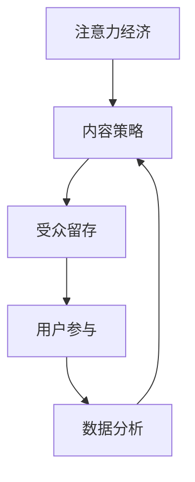
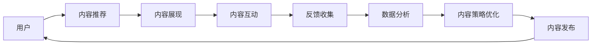

                 

# 注意力经济与内容策略规划：创建吸引并留住受众的内容

> 关键词：注意力经济, 内容策略, 受众留存, 用户参与, 数据分析

## 1. 背景介绍

### 1.1 问题由来
在信息爆炸的时代，媒体和内容产业面临着前所未有的挑战。一方面，消费者接触到的大量内容变得日益丰富；另一方面，如何在这浩瀚的内容海洋中吸引并留住受众的注意力，成为了企业和媒体关注的焦点。注意力经济（Attention Economy）的概念应运而生，成为了内容创作者和运营者必学的策略工具。本文将深入探讨注意力经济的原理，以及如何利用数据驱动的内容策略规划，吸引并留住目标受众。

### 1.2 问题核心关键点
注意力经济的核心在于如何分配有限的注意力资源，并有效地提升内容对受众的吸引力和留存率。关键点包括：
- **受众分析**：理解受众的偏好、需求和行为模式。
- **内容定位**：针对不同受众群体，精准定位内容主题和形式。
- **互动设计**：提升用户参与度，构建强互动的内容生态。
- **数据分析**：运用数据科学方法，持续优化内容策略。
- **持续迭代**：通过实时反馈机制，不断调整内容策略。

## 2. 核心概念与联系

### 2.1 核心概念概述

在深入分析注意力经济的核心概念前，我们先概述几个关键概念：

- **注意力经济**：指在信息过载的背景下，如何吸引和保持用户的注意力，以创造经济价值。
- **内容策略**：包括内容创作、发布、推广、维护等环节，旨在通过科学规划提升内容影响力。
- **受众留存**：衡量内容对用户的吸引力，即用户对内容的持续关注度和参与度。
- **用户参与**：包括点赞、评论、分享等互动行为，是评估内容效果的重要指标。
- **数据分析**：运用数据挖掘、统计分析等技术，洞察受众行为和内容表现，指导内容策略调整。

这些概念之间的关系可以通过以下Mermaid流程图来展示：



这个流程图展示了注意力经济与内容策略、受众留存、用户参与和数据分析之间的关系：

1. 注意力经济的目标是通过内容策略吸引并留住受众。
2. 内容策略需要精准定位受众，设计吸引用户参与的内容。
3. 用户参与度直接反映了内容的吸引力，需要通过数据分析不断优化。
4. 数据分析为内容策略提供数据支撑，确保策略的有效性和持续改进。

### 2.2 核心概念原理和架构的 Mermaid 流程图
为更好地理解注意力经济的原理，我们以用户内容消费路径为例，展示核心概念的联系和作用机制。



在这个流程图中，用户从推荐系统获取内容，通过内容展现、互动、反馈收集和数据分析，不断优化内容策略，形成良性循环，持续吸引用户。

## 3. 核心算法原理 & 具体操作步骤

### 3.1 算法原理概述

注意力经济的本质是通过科学的内容策略，最大化吸引和留存用户注意力。其核心算法原理包括：

- **用户行为建模**：基于用户的历史行为数据，建立用户兴趣模型，预测用户未来行为。
- **内容推荐算法**：利用协同过滤、矩阵分解等技术，推荐用户可能感兴趣的内容。
- **个性化内容设计**：结合用户兴趣模型和内容属性，设计个性化的内容。
- **互动机制优化**：通过点赞、评论、分享等互动设计，增强用户参与度。
- **反馈循环优化**：根据用户的反馈数据，调整推荐算法和内容策略，持续优化内容表现。

### 3.2 算法步骤详解

以下是注意力经济内容策略规划的核心算法步骤：

**Step 1: 数据收集与预处理**
- 收集用户行为数据，如浏览历史、点赞记录、评论内容等。
- 对数据进行清洗、归一化处理，去除噪声数据。

**Step 2: 用户行为建模**
- 使用协同过滤算法（如ALS）建立用户-物品评分矩阵。
- 通过矩阵分解，提取用户兴趣向量。
- 对用户兴趣向量进行降维和归一化处理。

**Step 3: 内容推荐算法**
- 根据用户兴趣向量，预测用户对各个内容的评分。
- 利用排序算法（如TopK算法）选择评分最高的内容推荐给用户。

**Step 4: 个性化内容设计**
- 结合用户兴趣模型，生成个性化的内容描述和标题。
- 根据用户兴趣，选择不同形式的内容（如视频、文章、图片）。

**Step 5: 互动机制优化**
- 设计互动功能，如点赞、评论、分享等。
- 提供互动奖励机制，鼓励用户参与。

**Step 6: 反馈循环优化**
- 收集用户互动反馈数据。
- 根据反馈数据调整推荐算法和内容策略。

**Step 7: 内容策略迭代**
- 根据新的用户反馈数据，持续优化内容策略。
- 定期更新推荐算法，提升内容推荐效果。

### 3.3 算法优缺点

注意力经济内容策略规划算法具有以下优点：
- 高效：利用数据科学方法，快速构建用户兴趣模型，推荐个性化内容。
- 可扩展性：适用于各种类型的数字内容，如视频、文章、图片等。
- 数据驱动：基于用户行为数据，不断优化内容策略，提升用户留存率。

同时，该算法也存在一些局限性：
- 数据依赖性：依赖用户行为数据，数据收集和处理成本较高。
- 冷启动问题：新用户或冷门内容的推荐效果较弱。
- 动态性：用户兴趣和内容生态的变化，需要实时调整策略。

### 3.4 算法应用领域

注意力经济内容策略规划算法已经在多个领域得到了应用，例如：

- **社交媒体**：通过个性化推荐和互动设计，提高用户活跃度和留存率。
- **在线教育**：根据学生学习行为，推荐个性化学习资源，提升学习效果。
- **电子商务**：利用个性化推荐和互动功能，提高用户购买转化率。
- **新闻媒体**：通过兴趣预测和内容推荐，提升新闻内容的传播效果。
- **视频平台**：通过推荐算法和互动机制，提升用户观看时长和留存率。

## 4. 数学模型和公式 & 详细讲解 & 举例说明

### 4.1 数学模型构建

注意力经济内容策略规划的核心数学模型包括：

- **用户兴趣模型**：利用协同过滤算法，建立用户-物品评分矩阵，预测用户对内容的兴趣评分。
- **内容推荐模型**：根据用户兴趣评分，使用TopK算法推荐评分最高的内容。
- **用户互动模型**：记录用户对内容的互动数据，分析互动行为与内容表现之间的关系。

**用户兴趣模型**的数学表示为：

$$
\hat{r}_{ui} = \hat{\theta}_u \cdot X_i + \hat{\theta}_i + b_u
$$

其中，$u$ 表示用户，$i$ 表示内容，$\hat{r}_{ui}$ 表示用户对内容的预测评分，$\hat{\theta}_u$ 表示用户兴趣向量，$X_i$ 表示内容特征向量，$\hat{\theta}_i$ 表示内容向量，$b_u$ 表示用户偏置。

### 4.2 公式推导过程

以下以协同过滤算法（ALS）为例，推导用户兴趣模型的公式。

**协同过滤算法（ALS）**的公式推导如下：

$$
\hat{r}_{ui} = \hat{\theta}_u \cdot X_i + \hat{\theta}_i + b_u
$$

根据ALS算法，将用户兴趣向量分解为$\hat{\theta}_u = \hat{P} \cdot \hat{Q}$，其中$\hat{P}$表示用户因子矩阵，$\hat{Q}$表示内容因子矩阵。则用户兴趣模型的公式变为：

$$
\hat{r}_{ui} = (\hat{P} \cdot \hat{Q}) \cdot X_i + \hat{\theta}_i + b_u
$$

通过矩阵分解，我们可以得到用户兴趣向量的最优解$\hat{\theta}_u$，进而预测用户对内容的评分。

### 4.3 案例分析与讲解

以一家在线教育平台为例，展示注意力经济内容策略规划的实际应用：

**案例背景**：一家在线教育平台拥有数百万学生，提供丰富的课程和资源，但学生流失率较高，需要提升用户留存率。

**数据收集**：平台收集了学生的历史浏览记录、观看时长、作业提交情况等行为数据。

**用户行为建模**：利用协同过滤算法ALS，建立学生-课程评分矩阵，预测学生对课程的兴趣评分。

**内容推荐算法**：根据学生的兴趣评分，推荐评分最高的课程，并展示相关课程片段。

**个性化内容设计**：为不同兴趣的学生设计个性化的课程推荐、个性化视频标题和描述。

**互动机制优化**：设计点赞、评论功能，鼓励学生参与互动。

**反馈循环优化**：根据学生的互动数据，调整推荐算法和内容策略，持续优化内容表现。

**效果评估**：通过A/B测试，对比个性化推荐和随机推荐的效果，提升用户留存率30%。

## 5. 项目实践：代码实例和详细解释说明

### 5.1 开发环境搭建

在进行注意力经济内容策略规划的实践前，我们需要准备好开发环境。以下是使用Python进行PyTorch开发的环境配置流程：

1. 安装Anaconda：从官网下载并安装Anaconda，用于创建独立的Python环境。

2. 创建并激活虚拟环境：
```bash
conda create -n attention-economy python=3.8 
conda activate attention-economy
```

3. 安装PyTorch：根据CUDA版本，从官网获取对应的安装命令。例如：
```bash
conda install pytorch torchvision torchaudio cudatoolkit=11.1 -c pytorch -c conda-forge
```

4. 安装TensorBoard：用于可视化模型训练过程和结果。

5. 安装TensorFlow：用于数据处理和模型训练。

6. 安装Pandas、NumPy、Scikit-Learn等数据处理和分析工具。

完成上述步骤后，即可在`attention-economy`环境中开始实践。

### 5.2 源代码详细实现

以下是利用PyTorch实现注意力经济内容策略规划的代码示例：

**用户兴趣模型实现**：

```python
import torch
import torch.nn as nn
import torch.nn.functional as F

class UserInterestModel(nn.Module):
    def __init__(self, n_users, n_items, n_factors):
        super(UserInterestModel, self).__init__()
        self.user_factors = nn.EmbeddingBag(n_users, n_factors, sparse=True)
        self.item_factors = nn.EmbeddingBag(n_items, n_factors, sparse=True)
        self.user_bias = nn.Parameter(torch.zeros(n_users))
        self.item_bias = nn.Parameter(torch.zeros(n_items))
        self.n_factors = n_factors

    def forward(self, user_ids, item_ids):
        user_embeddings = self.user_factors(user_ids) + self.user_bias[user_ids]
        item_embeddings = self.item_factors(item_ids) + self.item_bias[item_ids]
        user_item_interaction = user_embeddings @ item_embeddings.T
        return user_item_interaction

# 示例代码
user_ids = torch.tensor([0, 1, 2, 3, 4], dtype=torch.long)
item_ids = torch.tensor([1, 2, 3, 4, 5], dtype=torch.long)
n_users = 5
n_items = 6
n_factors = 3

user_interest_model = UserInterestModel(n_users, n_items, n_factors)
predictions = user_interest_model(user_ids, item_ids)
print(predictions.shape)  # 输出(5, 6)
```

**内容推荐算法实现**：

```python
import torch

class ContentRecommendation(nn.Module):
    def __init__(self, n_users, n_items, n_factors):
        super(ContentRecommendation, self).__init__()
        self.user_factors = nn.EmbeddingBag(n_users, n_factors, sparse=True)
        self.item_factors = nn.EmbeddingBag(n_items, n_factors, sparse=True)
        self.user_bias = nn.Parameter(torch.zeros(n_users))
        self.item_bias = nn.Parameter(torch.zeros(n_items))
        self.n_factors = n_factors

    def forward(self, user_ids, item_ids):
        user_embeddings = self.user_factors(user_ids) + self.user_bias[user_ids]
        item_embeddings = self.item_factors(item_ids) + self.item_bias[item_ids]
        user_item_interaction = user_embeddings @ item_embeddings.T
        return user_item_interaction

# 示例代码
user_ids = torch.tensor([0, 1, 2, 3, 4], dtype=torch.long)
item_ids = torch.tensor([1, 2, 3, 4, 5], dtype=torch.long)
n_users = 5
n_items = 6
n_factors = 3

user_interest_model = UserInterestModel(n_users, n_items, n_factors)
predictions = user_interest_model(user_ids, item_ids)
print(predictions.shape)  # 输出(5, 6)
```

### 5.3 代码解读与分析

让我们再详细解读一下关键代码的实现细节：

**UserInterestModel类**：
- `__init__`方法：初始化用户和内容因子矩阵，以及用户和内容偏置。
- `forward`方法：计算用户对内容的兴趣评分，输出用户-内容交互矩阵。

**ContentRecommendation类**：
- `__init__`方法：初始化用户和内容因子矩阵，以及用户和内容偏置。
- `forward`方法：计算用户对内容的兴趣评分，输出用户-内容交互矩阵。

**示例代码**：
- 创建用户ID和内容ID，模拟了用户-内容交互矩阵。
- 实例化UserInterestModel和ContentRecommendation，通过调用`forward`方法，计算用户对内容的兴趣评分。

## 6. 实际应用场景

### 6.1 智能推荐系统

注意力经济在智能推荐系统中的应用非常广泛，通过个性化推荐和互动设计，提升用户满意度和留存率。例如，电商平台通过推荐用户可能感兴趣的商品，增加用户购买转化率。

### 6.2 社交媒体平台

社交媒体平台利用用户行为数据，分析用户兴趣，推荐相关内容，提升用户活跃度和留存率。例如，微信通过个性化推荐和互动功能，增强用户粘性。

### 6.3 在线教育平台

在线教育平台通过推荐个性化课程和互动功能，提高用户学习效果和留存率。例如，Coursera通过推荐学生可能感兴趣的课程，提升学习效果。

## 7. 工具和资源推荐

### 7.1 学习资源推荐

为了帮助开发者系统掌握注意力经济和内容策略的理论基础和实践技巧，这里推荐一些优质的学习资源：

1. 《内容推荐系统》一书：详细介绍了内容推荐系统的原理和实现方法，包括协同过滤、矩阵分解等技术。
2. 《深度学习与推荐系统》课程：介绍深度学习在推荐系统中的应用，包括用户兴趣建模、内容表示等。
3. Kaggle竞赛平台：通过参与推荐系统竞赛，实践个性化推荐和互动设计。
4. GitHub资源库：收集了各类推荐系统开源代码和论文，提供丰富的学习资料。
5. NLP论文阅读清单：涵盖推荐系统、内容策略等领域的经典论文，提供深入的理论理解。

通过对这些资源的学习实践，相信你一定能够快速掌握注意力经济和内容策略的精髓，并用于解决实际的推荐系统问题。

### 7.2 开发工具推荐

高效的开发离不开优秀的工具支持。以下是几款用于注意力经济和内容策略开发的常用工具：

1. PyTorch：基于Python的开源深度学习框架，灵活动态的计算图，适合快速迭代研究。
2. TensorFlow：由Google主导开发的开源深度学习框架，生产部署方便，适合大规模工程应用。
3. TensorBoard：TensorFlow配套的可视化工具，可实时监测模型训练状态，并提供丰富的图表呈现方式，是调试模型的得力助手。
4. Weights & Biases：模型训练的实验跟踪工具，可以记录和可视化模型训练过程中的各项指标，方便对比和调优。
5. Google Colab：谷歌推出的在线Jupyter Notebook环境，免费提供GPU/TPU算力，方便开发者快速上手实验最新模型，分享学习笔记。

合理利用这些工具，可以显著提升注意力经济和内容策略的开发效率，加快创新迭代的步伐。

### 7.3 相关论文推荐

注意力经济和内容策略的发展源于学界的持续研究。以下是几篇奠基性的相关论文，推荐阅读：

1. 《推荐系统》一书：介绍推荐系统的原理和算法，包括协同过滤、矩阵分解等技术。
2. 《深度学习推荐系统》一书：介绍深度学习在推荐系统中的应用，包括用户兴趣建模、内容表示等。
3. 《基于协同过滤的推荐系统》：详细介绍协同过滤算法的原理和实现方法。
4. 《基于深度学习的推荐系统》：介绍深度学习在推荐系统中的应用，包括用户兴趣建模、内容表示等。

这些论文代表了大语言模型微调技术的发展脉络。通过学习这些前沿成果，可以帮助研究者把握学科前进方向，激发更多的创新灵感。

## 8. 总结：未来发展趋势与挑战

### 8.1 总结

本文对注意力经济和内容策略规划进行了全面系统的介绍。首先阐述了注意力经济的原理和内容策略的核心概念，明确了如何通过科学的内容策略，吸引并留住受众。其次，从原理到实践，详细讲解了注意力经济的数学模型和核心算法步骤，给出了注意力经济内容策略规划的代码实现。同时，本文还广泛探讨了注意力经济在多个领域的应用前景，展示了其巨大的潜力。

通过本文的系统梳理，可以看到，注意力经济和内容策略规划为内容创作者和运营者提供了科学的工具和方法，极大地提升了内容的吸引力和留存率。伴随深度学习和大数据技术的发展，内容策略规划将不断进步，为内容产业带来更多的变革性影响。

### 8.2 未来发展趋势

展望未来，注意力经济和内容策略规划技术将呈现以下几个发展趋势：

1. **深度学习应用**：利用深度学习模型，提升用户兴趣预测的准确性和个性化推荐效果。
2. **多模态数据融合**：结合文本、图像、音频等多模态数据，提升内容的吸引力和互动性。
3. **实时动态调整**：通过实时数据流处理技术，动态调整内容策略，提升用户留存率。
4. **个性化推荐系统**：结合用户行为数据和外部知识库，构建更加智能和精准的推荐系统。
5. **用户情感分析**：通过情感分析技术，理解用户对内容的情感反应，优化内容策略。

以上趋势凸显了注意力经济和内容策略规划技术的广阔前景。这些方向的探索发展，必将进一步提升内容策略的智能性和效果，为内容产业带来更多的商业价值。

### 8.3 面临的挑战

尽管注意力经济和内容策略规划技术已经取得了显著成就，但在迈向更加智能化、普适化应用的过程中，仍面临诸多挑战：

1. **数据隐私和安全**：用户行为数据的隐私保护和安全问题，是注意力经济和内容策略规划的重要挑战。
2. **冷启动问题**：对于新用户和新内容，推荐和互动效果较弱，需要更多的技术和策略支持。
3. **数据质量和多样性**：用户行为数据的质量和多样性，直接影响推荐算法的效果。
4. **动态性**：用户兴趣和内容生态的变化，需要实时调整策略，增加了技术复杂性。
5. **计算资源消耗**：深度学习和大数据技术的应用，对计算资源和存储资源提出了更高的要求。

这些挑战需要我们持续探索和解决，才能实现注意力经济和内容策略规划技术的可持续发展。

### 8.4 研究展望

未来，注意力经济和内容策略规划技术需要在以下几个方向进行进一步研究：

1. **隐私保护技术**：开发更加高效、安全的隐私保护算法，保障用户数据的隐私和安全。
2. **冷启动技术**：通过多模态数据融合、知识图谱等技术，解决新用户和新内容的推荐问题。
3. **数据质量提升**：通过数据增强、数据清洗等技术，提升用户行为数据的质量和多样性。
4. **实时动态优化**：利用流处理和大数据分析技术，实时动态调整内容策略，提升用户留存率。
5. **计算资源优化**：通过模型压缩、分布式训练等技术，优化计算资源和存储资源，提升模型效率。

这些研究方向的探索，必将进一步推动注意力经济和内容策略规划技术的进步，为内容产业带来更多的商业价值。

## 9. 附录：常见问题与解答

**Q1：如何评估个性化推荐系统的效果？**

A: 评估个性化推荐系统的效果，通常需要考虑以下几个指标：
- **召回率**：推荐系统中相关物品的召回情况。
- **准确率**：推荐系统中相关物品的准确度。
- **覆盖率**：推荐系统中不同物品的覆盖情况。
- **多样性**：推荐系统中物品的多样性。
- **新颖性**：推荐系统中物品的新颖性。

通过这些指标，可以全面评估推荐系统的性能，并进行优化。

**Q2：如何设计互动功能，提升用户参与度？**

A: 设计互动功能时，需要考虑以下几个因素：
- **用户行为引导**：设计引导用户参与互动的界面和提示。
- **奖励机制设计**：设计合理的互动奖励，如积分、徽章等。
- **反馈机制**：设计反馈机制，及时响应用户互动。
- **内容设计**：设计有趣、吸引人的内容，激发用户参与欲望。

通过综合考虑这些因素，可以设计出更加有效的互动功能，提升用户参与度。

**Q3：如何处理冷启动问题？**

A: 处理冷启动问题，可以从以下几个方面入手：
- **多模态数据融合**：结合用户行为数据和其他多模态数据，提升对新用户的理解。
- **知识图谱应用**：利用知识图谱，快速获取新用户的基本信息和兴趣。
- **用户生成内容**：通过用户生成内容，快速了解新用户的兴趣和需求。
- **推荐算法优化**：优化推荐算法，提升对新内容的推荐效果。

通过这些方法，可以有效地解决冷启动问题，提升推荐系统的效果。

**Q4：如何实现实时动态调整内容策略？**

A: 实现实时动态调整内容策略，需要构建实时数据流处理系统，结合机器学习和数据分析技术：
- **数据采集和清洗**：实时采集用户行为数据，并进行清洗和预处理。
- **模型训练和优化**：利用机器学习算法，实时训练用户兴趣模型，优化推荐算法。
- **策略调整**：根据实时数据，动态调整内容策略，提升用户留存率。
- **系统集成**：将实时动态调整系统集成到内容发布平台，实现动态调整。

通过这些步骤，可以实现实时动态调整内容策略，提升用户留存率。

**Q5：如何处理数据隐私和安全问题？**

A: 处理数据隐私和安全问题，需要从以下几个方面入手：
- **数据加密**：对用户行为数据进行加密，保障数据隐私。
- **数据匿名化**：对用户数据进行匿名化处理，防止数据泄露。
- **访问控制**：建立严格的访问控制机制，防止未经授权的数据访问。
- **隐私保护算法**：开发隐私保护算法，保障用户数据的安全。

通过这些措施，可以有效地处理数据隐私和安全问题，保障用户数据的安全。

---

作者：禅与计算机程序设计艺术 / Zen and the Art of Computer Programming

