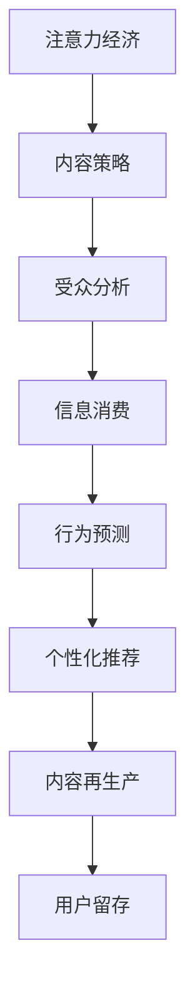

                 

# 注意力经济与内容策略：如何创建吸引并留住受众的信息

> 关键词：注意力经济,内容策略,受众分析,信息消费,数据驱动,行为预测,个性化推荐,内容再生产,用户留存

## 1. 背景介绍

### 1.1 问题由来
在信息爆炸的时代，全球范围内的注意力成为一种稀缺资源。如何在海量信息中吸引并留住受众，成为企业与内容创作者必须面对的挑战。通过研究注意力经济和内容策略，本文将深入探讨如何利用数据驱动的方法，创建具备吸引力和粘性的信息内容，从而实现受众的持续关注与互动。

### 1.2 问题核心关键点
- 注意力经济：在信息过载的环境中，注意力成为经济活动的重要资源。有效的注意力分配可以带来更高的经济收益。
- 内容策略：通过数据分析与算法，创建高质量、个性化、互动性强的内容，吸引并留住受众。
- 受众分析：利用大数据技术，分析受众的行为和偏好，指导内容创作与推荐。
- 信息消费：研究受众的信息获取行为，预测其内容需求，优化信息消费体验。
- 行为预测：运用机器学习模型，预测受众的行为变化，实现精准的个性化推荐。
- 个性化推荐：通过分析受众的历史行为数据，提供符合其兴趣偏好的内容，提升用户满意度。
- 内容再生产：通过优化内容的生产流程，提高内容的生产效率与质量，保持内容的持续更新与创新。
- 用户留存：通过多样化的互动手段，增强用户对内容的粘性，实现用户长期留存。

## 2. 核心概念与联系

### 2.1 核心概念概述

为更好地理解注意力经济与内容策略的核心理念，本节将介绍几个关键概念及其相互关系：

- 注意力经济（Attention Economy）：在信息过载的环境下，注意力成为一种稀缺资源，能够创造经济价值。有效的注意力分配可以带来更高的商业效益。

- 内容策略（Content Strategy）：通过数据分析与算法，创建高质量、个性化、互动性强的内容，吸引并留住受众。

- 受众分析（Audience Analysis）：利用大数据技术，分析受众的行为和偏好，指导内容创作与推荐。

- 信息消费（Information Consumption）：研究受众的信息获取行为，预测其内容需求，优化信息消费体验。

- 行为预测（Behavioral Prediction）：运用机器学习模型，预测受众的行为变化，实现精准的个性化推荐。

- 个性化推荐（Personalized Recommendation）：通过分析受众的历史行为数据，提供符合其兴趣偏好的内容，提升用户满意度。

- 内容再生产（Content Reproduction）：通过优化内容的生产流程，提高内容的生产效率与质量，保持内容的持续更新与创新。

- 用户留存（User Retention）：通过多样化的互动手段，增强用户对内容的粘性，实现用户长期留存。

这些核心概念之间存在复杂的联系，共同构成了注意力经济与内容策略的框架。通过理解这些概念，我们可以更好地把握内容创作的逻辑与流程，实现内容在受众中的广泛传播与影响力提升。

### 2.2 核心概念原理和架构的 Mermaid 流程图



这个流程图展示了注意力经济与内容策略的核心概念及其相互关系：

1. 注意力经济是整个策略的基础，通过吸引并留住受众的注意力，实现商业价值的最大化。
2. 内容策略是实现注意力经济的重要手段，通过高质量、个性化、互动性强的内容，吸引受众的关注。
3. 受众分析是内容策略的基石，通过分析受众的行为和偏好，指导内容的创作与推荐。
4. 信息消费是关注点之一，通过研究受众的信息获取行为，预测其内容需求，优化信息消费体验。
5. 行为预测是核心技术之一，通过机器学习模型，预测受众的行为变化，实现精准的个性化推荐。
6. 个性化推荐是内容策略的重要组成部分，通过分析受众的历史行为数据，提供符合其兴趣偏好的内容。
7. 内容再生产是保持内容持续更新的关键，通过优化内容的生产流程，提高内容的生产效率与质量。
8. 用户留存是最终的关注目标，通过多样化的互动手段，增强用户对内容的粘性。

这些概念相互作用，共同构成了完整的内容策略与注意力经济体系，助力内容创作者和企业在信息时代取得成功。

## 3. 核心算法原理 & 具体操作步骤

### 3.1 算法原理概述

注意力经济与内容策略的核心算法原理主要基于数据驱动与机器学习。具体而言，通过对受众的行为数据进行分析与预测，指导内容的创作与推荐，从而实现吸引并留住受众的目标。

本节将从以下几个方面详细阐述核心算法原理：

- 受众行为数据采集与预处理
- 内容推荐模型的构建与训练
- 个性化推荐算法的优化与改进
- 内容再生产流程的优化
- 用户留存策略的制定与实施

### 3.2 算法步骤详解

#### 3.2.1 受众行为数据采集与预处理

1. **数据采集**：
   - 采集受众的浏览、点击、搜索、购买等行为数据，获取其信息消费行为的全貌。
   - 数据源包括社交媒体、电商平台、搜索引擎等平台的用户互动记录。

2. **数据清洗**：
   - 清洗缺失、异常数据，去除噪声。
   - 通过数据标准化、归一化等技术，确保数据的一致性和可比性。

3. **特征提取**：
   - 从行为数据中提取有意义的特征，如访问时间、停留时长、点击深度、购买金额等。
   - 利用文本分析、图像识别等技术，提取内容的文本、图像特征。

4. **数据存储与管理**：
   - 使用数据仓库、大数据平台等技术，实现数据的集中存储与管理。
   - 采用分布式计算框架，实现大数据的实时处理与分析。

#### 3.2.2 内容推荐模型的构建与训练

1. **模型选择**：
   - 选择合适的推荐算法，如协同过滤、基于内容的推荐、深度学习等。
   - 基于模型的复杂度、实时性、精度等需求，选择合适的算法。

2. **模型训练**：
   - 使用历史行为数据，训练推荐模型。
   - 采用交叉验证、超参数调优等技术，确保模型的高效与精确。

3. **模型评估**：
   - 使用AUC、RMSE、NDCG等指标，评估模型的性能。
   - 根据评估结果，对模型进行迭代优化。

#### 3.2.3 个性化推荐算法的优化与改进

1. **多维度推荐**：
   - 结合内容、用户、环境等多维度的信息，提升推荐的精准度。
   - 引入社交网络、地理信息等外部因素，增强推荐的丰富度。

2. **动态推荐**：
   - 实时更新模型参数，及时调整推荐内容。
   - 采用在线学习、增量学习等技术，实现动态推荐。

3. **协同过滤**：
   - 基于用户的历史行为数据，找到兴趣相似的用户，推荐相似内容。
   - 通过矩阵分解等技术，实现高维稀疏数据的处理与推荐。

4. **混合推荐**：
   - 结合基于内容的推荐和协同过滤，取长补短，提升推荐效果。
   - 通过模型融合、集成学习等技术，优化推荐算法。

#### 3.2.4 内容再生产流程的优化

1. **内容生成与编辑**：
   - 利用自动生成技术，生成初步内容。
   - 引入人工编辑，提高内容的创意与质量。

2. **内容审核与发布**：
   - 建立严格的内容审核机制，确保内容合规与质量。
   - 使用A/B测试等方法，优化内容发布策略。

3. **内容再利用**：
   - 通过内容复用、交叉发布等手段，提高内容的价值。
   - 结合用户反馈，不断改进内容质量。

#### 3.2.5 用户留存策略的制定与实施

1. **互动设计**：
   - 设计多样化的互动方式，如评论、点赞、分享等，增强用户粘性。
   - 提供用户反馈机制，及时响应用户需求。

2. **奖励机制**：
   - 设立积分、优惠券等奖励机制，激励用户持续互动。
   - 通过游戏化设计，提升用户参与度。

3. **社区建设**：
   - 构建用户社区，形成用户间的良性互动。
   - 利用用户生成内容（UGC），丰富社区内容。

### 3.3 算法优缺点

#### 3.3.1 优点

1. **高精度与个性化**：
   - 通过机器学习模型，实现高精度的个性化推荐，满足用户多样化需求。

2. **实时性与动态性**：
   - 实时更新推荐内容，及时响应用户变化，提高用户体验。

3. **数据驱动与可解释性**：
   - 基于数据驱动的方法，提供可解释的推荐理由，增强用户信任。

4. **跨平台与泛化能力**：
   - 跨平台的数据整合与推荐，提升内容的泛化能力。

#### 3.3.2 缺点

1. **数据隐私与安全**：
   - 数据采集与存储可能涉及用户隐私，需严格遵守法律法规。

2. **模型复杂性**：
   - 复杂模型可能导致计算开销大、实时性不足。

3. **冷启动问题**：
   - 新用户或少数据用户可能面临推荐质量较低的问题。

4. **内容质量控制**：
   - 自动生成内容质量控制难度大，需要人工干预。

### 3.4 算法应用领域

基于注意力经济与内容策略的推荐算法，在以下领域具有广泛的应用：

- **电商推荐**：为电商平台的商品推荐，提高转化率和用户满意度。
- **视频推荐**：为视频网站的内容推荐，提升观看时长和用户粘性。
- **新闻推荐**：为用户推荐感兴趣的新闻文章，提升阅读体验。
- **音乐推荐**：为用户推荐适合的音乐，提升音乐播放量。
- **社交媒体推荐**：为用户推荐社交媒体内容，增加用户活跃度。

这些推荐算法在大数据、深度学习等技术的支持下，已广泛应用于各行业，提升用户体验与业务效益。

## 4. 数学模型和公式 & 详细讲解 & 举例说明

### 4.1 数学模型构建

本节将使用数学语言对基于注意力经济与内容策略的推荐算法进行严格刻画。

记受众的浏览行为数据为 $D=\{(x_i,y_i)\}_{i=1}^N$，其中 $x_i$ 为浏览内容，$y_i$ 为浏览时间（单位：分钟）。

定义推荐模型为 $f(x)$，目标是最小化平均推荐误差：

$$
\mathcal{L}(f)=\frac{1}{N}\sum_{i=1}^N ||f(x_i)-y_i||^2
$$

其中，$||\cdot||$ 为欧几里得范数。

### 4.2 公式推导过程

假设 $f(x)$ 为线性回归模型，则有：

$$
f(x)=\theta^Tx
$$

其中，$\theta$ 为模型参数。

通过最小二乘法求解最优参数：

$$
\theta=(X^TX)^{-1}X^Ty
$$

其中，$X$ 为特征矩阵，$y$ 为标签向量。

在实际应用中，可以采用正则化等技术，避免过拟合，提高模型的泛化能力。

### 4.3 案例分析与讲解

#### 4.3.1 电商推荐

1. **数据采集**：
   - 从电商平台获取用户的历史浏览、购买行为数据。
   - 包括商品名称、类别、价格等信息。

2. **特征提取**：
   - 提取商品特征，如价格、销量、评价等。
   - 提取用户特征，如年龄、性别、购买偏好等。

3. **模型训练**：
   - 使用线性回归模型，训练推荐模型。
   - 引入L2正则化，防止过拟合。

4. **模型评估**：
   - 使用AUC、RMSE等指标，评估推荐效果。
   - 根据评估结果，调整模型参数。

#### 4.3.2 视频推荐

1. **数据采集**：
   - 从视频网站获取用户的观看行为数据。
   - 包括视频标题、类别、时长等信息。

2. **特征提取**：
   - 提取视频特征，如时长、播放量、评分等。
   - 提取用户特征，如观看偏好、历史评分等。

3. **模型训练**：
   - 使用协同过滤算法，训练推荐模型。
   - 采用矩阵分解等技术，处理高维稀疏数据。

4. **模型评估**：
   - 使用NDCG、RMSE等指标，评估推荐效果。
   - 根据评估结果，优化模型参数。

#### 4.3.3 新闻推荐

1. **数据采集**：
   - 从新闻平台获取用户的历史阅读行为数据。
   - 包括文章标题、类别、发布时间等信息。

2. **特征提取**：
   - 提取文章特征，如标题、类别、发布时间等。
   - 提取用户特征，如阅读偏好、阅读时长等。

3. **模型训练**：
   - 使用深度学习模型，如CNN、RNN等，训练推荐模型。
   - 引入多任务学习等技术，优化模型性能。

4. **模型评估**：
   - 使用点击率、阅读时间等指标，评估推荐效果。
   - 根据评估结果，调整模型参数。

## 5. 项目实践：代码实例和详细解释说明

### 5.1 开发环境搭建

在进行项目实践前，我们需要准备好开发环境。以下是使用Python进行TensorFlow开发的Python环境配置流程：

1. 安装Anaconda：从官网下载并安装Anaconda，用于创建独立的Python环境。

2. 创建并激活虚拟环境：
```bash
conda create -n tensorflow-env python=3.8 
conda activate tensorflow-env
```

3. 安装TensorFlow：根据CUDA版本，从官网获取对应的安装命令。例如：
```bash
conda install tensorflow tensorflow-cpu=2.7 -c conda-forge
```

4. 安装必要的Python库：
```bash
pip install numpy pandas scikit-learn matplotlib tensorflow
```

完成上述步骤后，即可在`tensorflow-env`环境中开始项目实践。

### 5.2 源代码详细实现

这里我们以电商推荐为例，给出使用TensorFlow进行推荐模型的PyTorch代码实现。

首先，定义数据处理函数：

```python
import pandas as pd
import numpy as np

def load_data(file_path):
    data = pd.read_csv(file_path)
    features = data[['price', 'sales', 'rating']]
    labels = data['category']
    return features, labels
```

然后，定义模型函数：

```python
from tensorflow.keras.models import Sequential
from tensorflow.keras.layers import Dense

def build_model(input_dim, hidden_dim, output_dim):
    model = Sequential()
    model.add(Dense(hidden_dim, input_dim=input_dim, activation='relu'))
    model.add(Dense(output_dim, activation='softmax'))
    return model
```

接着，定义训练与评估函数：

```python
from tensorflow.keras.metrics import MeanSquaredError

def train_model(model, features, labels, batch_size, epochs):
    model.compile(optimizer='adam', loss='mse', metrics=[MeanSquaredError()])
    model.fit(features, labels, batch_size=batch_size, epochs=epochs, validation_split=0.2)
    return model

def evaluate_model(model, features, labels, batch_size):
    model.evaluate(features, labels, batch_size=batch_size)
```

最后，启动训练流程并在测试集上评估：

```python
file_path = 'data.csv'
features, labels = load_data(file_path)

hidden_dim = 128
input_dim = features.shape[1]
output_dim = len(set(labels))

model = build_model(input_dim, hidden_dim, output_dim)
model = train_model(model, features, labels, batch_size=64, epochs=10)
evaluate_model(model, features, labels, batch_size=64)
```

以上就是使用TensorFlow对电商推荐模型进行训练的完整代码实现。可以看到，利用TensorFlow的强大封装，我们可以用相对简洁的代码实现复杂的深度学习模型。

### 5.3 代码解读与分析

让我们再详细解读一下关键代码的实现细节：

**load_data函数**：
- 从指定文件中读取数据。
- 提取特征与标签，并进行必要的数据清洗。

**build_model函数**：
- 定义模型结构，包括输入层、隐藏层、输出层等。
- 使用Dense层实现全连接网络。
- 设置激活函数和损失函数。

**train_model函数**：
- 编译模型，设置优化器、损失函数和评估指标。
- 使用fit函数进行模型训练，设置批量大小和训练轮数。
- 使用validation_split参数进行模型验证。

**evaluate_model函数**：
- 使用evaluate函数评估模型性能。
- 设置批量大小，获取模型损失和评估指标。

**训练流程**：
- 加载数据，定义模型参数。
- 调用train_model函数训练模型，输出训练结果。
- 在测试集上调用evaluate_model函数评估模型性能。

可以看到，TensorFlow使得深度学习模型的实现变得简洁高效。开发者可以将更多精力放在数据处理、模型改进等高层逻辑上，而不必过多关注底层的实现细节。

当然，工业级的系统实现还需考虑更多因素，如模型的保存和部署、超参数的自动搜索、更灵活的任务适配层等。但核心的推荐范式基本与此类似。

## 6. 实际应用场景

### 6.1 电商推荐

基于注意力经济与内容策略的电商推荐系统，可以显著提升电商平台的转化率和用户满意度。

1. **推荐算法**：
   - 利用用户的历史浏览和购买数据，生成个性化推荐列表。
   - 结合商品的热门度和用户偏好，动态调整推荐内容。

2. **用户互动**：
   - 提供商品评价、用户反馈机制，增强用户粘性。
   - 设计优惠券、积分奖励等互动活动，提升用户参与度。

3. **个性化服务**：
   - 根据用户的浏览记录，提供个性化商品推荐。
   - 结合用户画像，提供定制化的服务与促销活动。

### 6.2 视频推荐

基于注意力经济与内容策略的视频推荐系统，可以大幅提升视频网站的观看时长和用户粘性。

1. **推荐算法**：
   - 利用用户的观看历史和评分数据，生成个性化推荐列表。
   - 结合视频的播放量和用户评分，动态调整推荐内容。

2. **用户互动**：
   - 提供视频播放时长、评分反馈机制，增强用户粘性。
   - 设计评论、点赞等互动活动，提升用户参与度。

3. **个性化服务**：
   - 根据用户的观看记录，提供个性化视频推荐。
   - 结合用户画像，提供定制化的视频内容和推荐策略。

### 6.3 新闻推荐

基于注意力经济与内容策略的新闻推荐系统，可以提升用户的新闻阅读体验和平台流量。

1. **推荐算法**：
   - 利用用户的历史阅读记录和评分数据，生成个性化推荐列表。
   - 结合新闻的热门度和用户偏好，动态调整推荐内容。

2. **用户互动**：
   - 提供新闻评论、用户反馈机制，增强用户粘性。
   - 设计新闻分享、点赞等互动活动，提升用户参与度。

3. **个性化服务**：
   - 根据用户的阅读记录，提供个性化新闻推荐。
   - 结合用户画像，提供定制化的新闻内容和推荐策略。

### 6.4 未来应用展望

随着注意力经济与内容策略的不断发展，推荐系统将在更多领域得到应用，为各行各业带来变革性影响。

在智慧医疗领域，基于推荐算法的信息推荐，可以提升医疗服务的智能化水平，辅助医生诊疗，加速新药开发进程。

在智能教育领域，推荐系统可应用于作业批改、学情分析、知识推荐等方面，因材施教，促进教育公平，提高教学质量。

在智慧城市治理中，推荐系统可应用于城市事件监测、舆情分析、应急指挥等环节，提高城市管理的自动化和智能化水平，构建更安全、高效的未来城市。

此外，在企业生产、社会治理、文娱传媒等众多领域，推荐系统也将不断涌现，为各行各业带来新的技术路径和业务价值。

## 7. 工具和资源推荐
### 7.1 学习资源推荐

为了帮助开发者系统掌握注意力经济与内容策略的理论基础和实践技巧，这里推荐一些优质的学习资源：

1. 《深度学习》系列书籍：由多位深度学习领域的专家合著，系统介绍了深度学习的基本概念和应用实践。

2. CS229《机器学习》课程：斯坦福大学开设的机器学习经典课程，有Lecture视频和配套作业，带你入门机器学习领域的基本概念和经典算法。

3. 《Recommender Systems: The Textbook》书籍：系统介绍了推荐系统的理论基础和实际应用，涵盖协同过滤、基于内容的推荐、深度学习等多种推荐算法。

4. Kaggle竞赛平台：提供大量推荐系统的竞赛数据集和竞赛任务，练习推荐算法的设计与优化。

5. Coursera《机器学习》课程：提供多个领域的推荐系统课程，涵盖数据采集、特征工程、模型训练等多个环节。

通过对这些资源的学习实践，相信你一定能够快速掌握注意力经济与内容策略的精髓，并用于解决实际的推荐问题。
### 7.2 开发工具推荐

高效的开发离不开优秀的工具支持。以下是几款用于推荐系统开发的常用工具：

1. TensorFlow：由Google主导开发的开源深度学习框架，生产部署方便，适合大规模工程应用。

2. PyTorch：基于Python的开源深度学习框架，灵活动态的计算图，适合快速迭代研究。

3. scikit-learn：开源的Python机器学习库，包含多种推荐算法和模型评估工具。

4. H2O.ai：提供高度自动化的机器学习平台，支持多种推荐算法，适合快速开发推荐系统。

5. RapidMiner：提供图形化界面和自动化的数据处理与分析工具，适合数据探索与推荐系统设计。

6. KNIME：开源的数据集成与分析工具，支持多种推荐算法和数据流处理，适合推荐系统的开发与测试。

合理利用这些工具，可以显著提升推荐系统的开发效率，加快创新迭代的步伐。

### 7.3 相关论文推荐

注意力经济与内容策略的研究源于学界的持续研究。以下是几篇奠基性的相关论文，推荐阅读：

1. "Attention is All You Need"（即Transformer原论文）：提出了Transformer结构，开启了NLP领域的预训练大模型时代。

2. "Deep Collaborative Filtering"：提出了协同过滤算法，是推荐系统领域的重要基础算法。

3. "The BellKor TV-Show Recommendation System"：介绍了一个实际应用的推荐系统，展示了推荐算法在视频推荐中的应用效果。

4. "Personalized Recommendation Algorithms for E-commerce"：详细介绍了电商推荐系统的算法与实现。

5. "A Survey of Recommender Systems"：对推荐系统的发展历程和未来方向进行了系统性的回顾。

这些论文代表了大规模推荐系统的研究进展，通过学习这些前沿成果，可以帮助研究者把握学科前进方向，激发更多的创新灵感。

## 8. 总结：未来发展趋势与挑战

### 8.1 总结

本文对基于注意力经济与内容策略的推荐方法进行了全面系统的介绍。首先阐述了注意力经济与内容策略的研究背景和意义，明确了推荐算法在吸引并留住受众方面的独特价值。其次，从原理到实践，详细讲解了推荐算法的数学模型和关键步骤，给出了推荐任务开发的完整代码实例。同时，本文还广泛探讨了推荐算法在电商、视频、新闻等多个领域的应用前景，展示了推荐范式的巨大潜力。此外，本文精选了推荐技术的各类学习资源，力求为读者提供全方位的技术指引。

通过本文的系统梳理，可以看到，基于注意力经济与内容策略的推荐方法正在成为推荐系统的重要范式，极大地拓展了推荐算法的应用边界，催生了更多的落地场景。受益于大规模数据、深度学习等技术的快速发展，推荐系统必将在更广阔的领域大放异彩。

### 8.2 未来发展趋势

展望未来，注意力经济与内容策略的推荐技术将呈现以下几个发展趋势：

1. **多模态推荐**：结合文本、图像、视频等多模态数据，提升推荐的丰富性和精准度。

2. **实时推荐**：利用流式数据处理技术，实现实时推荐，提升用户体验。

3. **跨平台推荐**：打破不同平台之间的数据壁垒，实现跨平台推荐，提升内容的泛化能力。

4. **多目标推荐**：综合考虑多个目标（如转化率、观看时长、阅读深度等），实现多目标推荐。

5. **用户隐私保护**：引入隐私保护技术，确保用户数据的匿名性和安全性。

6. **个性化服务**：结合用户画像和行为数据，提供个性化推荐和服务。

7. **推荐系统的公平性与透明性**：确保推荐系统的公平性与透明性，减少偏见与歧视。

这些趋势凸显了推荐系统技术的发展方向，相信未来的推荐系统将能够更好地适应用户需求，提升信息消费的体验和满意度。

### 8.3 面临的挑战

尽管推荐系统技术已经取得了瞩目成就，但在迈向更加智能化、普适化应用的过程中，仍面临诸多挑战：

1. **数据隐私与安全**：推荐系统的数据采集与存储可能涉及用户隐私，需严格遵守法律法规。

2. **模型复杂性与效率**：复杂推荐模型可能导致计算开销大、实时性不足。

3. **冷启动问题**：新用户或少数据用户可能面临推荐质量较低的问题。

4. **内容质量控制**：自动生成内容质量控制难度大，需要人工干预。

5. **公平性与透明性**：推荐系统的公平性与透明性仍需进一步提升，避免偏见与歧视。

6. **用户体验**：如何在提升推荐准确性的同时，减少对用户体验的干扰。

7. **技术迭代**：推荐系统的技术迭代速度快，需持续关注最新研究进展，及时更新优化算法。

这些挑战需要学界和业界共同努力，才能实现推荐系统的全面优化与升级。唯有不断创新与优化，才能真正实现推荐系统的广泛应用与普及。

### 8.4 研究展望

面对推荐系统面临的诸多挑战，未来的研究需要在以下几个方面寻求新的突破：

1. **引入更多先验知识**：将符号化的先验知识，如知识图谱、逻辑规则等，与推荐模型进行巧妙融合，增强推荐系统的解释性与合理性。

2. **开发更高效的推荐算法**：结合计算图优化、分布式计算等技术，提高推荐算法的计算效率与实时性。

3. **引入因果推断与公平性优化**：利用因果推断方法，识别推荐系统的因果机制，优化推荐过程的公平性与透明性。

4. **结合多目标优化**：综合考虑多个目标，实现多目标推荐，提升推荐系统的实用性和用户体验。

5. **引入跨模态融合技术**：结合图像、视频等多模态数据，提升推荐系统的丰富性与精准度。

6. **引入深度学习与强化学习**：结合深度学习与强化学习技术，提高推荐系统的学习能力与适应性。

7. **引入实时推荐与跨平台推荐**：利用流式数据处理技术，实现实时推荐，提升推荐系统的实时性与用户体验。

8. **引入用户隐私保护与公平性优化**：结合隐私保护技术与公平性优化算法，提升推荐系统的安全性与公平性。

这些研究方向将引领推荐系统技术的持续演进，为推荐系统带来更多创新与突破。相信未来的推荐系统必将在各领域中发挥更加重要的作用，推动信息消费的智能化与个性化。

## 9. 附录：常见问题与解答

**Q1：注意力经济与内容策略的推荐算法是否适用于所有领域？**

A: 注意力经济与内容策略的推荐算法在电商、视频、新闻等多个领域已得到广泛应用，并取得了显著效果。但不同领域的推荐需求、数据特点和技术要求各不相同，需要针对性地设计推荐算法。例如，电商推荐侧重于个性化商品推荐，视频推荐侧重于内容相关性推荐，新闻推荐侧重于个性化新闻推荐。

**Q2：如何提高推荐算法的精准度？**

A: 提高推荐算法的精准度需要从多个方面入手：

1. **特征工程**：提取有意义的特征，如商品价格、评分、用户画像等。

2. **模型选择**：选择合适的推荐算法，如协同过滤、基于内容的推荐、深度学习等。

3. **模型训练**：使用历史数据训练推荐模型，并利用交叉验证、超参数调优等技术，优化模型性能。

4. **模型评估**：使用AUC、RMSE、NDCG等指标，评估模型性能。

5. **模型优化**：利用在线学习、增量学习等技术，实现动态推荐。

6. **模型融合**：采用模型融合、集成学习等技术，提升推荐效果。

7. **数据质量控制**：确保数据的高质量与完整性，减少数据噪声。

8. **用户反馈机制**：引入用户反馈机制，及时调整推荐内容。

**Q3：推荐算法如何处理冷启动问题？**

A: 冷启动问题是推荐算法中的一个重要挑战，主要指新用户或少数据用户面临推荐质量较低的问题。以下是一些处理冷启动问题的方法：

1. **利用用户兴趣调查**：通过调查问卷等方式获取用户的兴趣信息，提高推荐的准确性。

2. **利用用户行为预测**：根据用户的历史行为数据，预测其兴趣和需求，提供个性化推荐。

3. **引入基于内容的推荐**：利用商品的特征信息，提供基于内容的推荐，解决数据稀疏问题。

4. **引入混合推荐**：结合基于内容的推荐和协同过滤，提高推荐效果。

5. **引入增量学习**：利用新数据不断更新模型参数，实现动态推荐。

**Q4：推荐系统如何保护用户隐私？**

A: 推荐系统在数据采集与存储过程中，需严格遵守用户隐私保护法律法规，如GDPR、CCPA等。以下是一些保护用户隐私的方法：

1. **数据匿名化**：对用户数据进行匿名化处理，防止用户身份信息泄露。

2. **数据加密**：对用户数据进行加密处理，防止数据被非法获取。

3. **用户控制权**：赋予用户数据控制权，让用户能够选择是否共享数据。

4. **数据最小化**：仅收集必要的数据，减少数据泄露风险。

5. **隐私保护技术**：采用差分隐私、联邦学习等技术，保护用户隐私。

6. **透明度与公平性**：提高推荐系统的透明度与公平性，增强用户信任。

**Q5：推荐系统如何提升用户体验？**

A: 提升用户体验需要从多个方面入手：

1. **个性化推荐**：根据用户的历史行为数据，提供个性化推荐，满足用户多样化需求。

2. **实时推荐**：利用流式数据处理技术，实现实时推荐，提升用户体验。

3. **用户互动**：提供多样化的互动方式，如评论、点赞、分享等，增强用户粘性。

4. **用户体验设计**：优化界面设计，提升用户体验。

5. **用户反馈机制**：引入用户反馈机制，及时调整推荐内容。

6. **多目标推荐**：综合考虑多个目标（如转化率、观看时长、阅读深度等），实现多目标推荐。

**Q6：推荐系统如何应对多模态数据？**

A: 应对多模态数据，可以从以下几个方面入手：

1. **数据融合**：将不同模态的数据进行融合，提升数据的丰富性。

2. **多模态特征提取**：从不同模态的数据中提取有意义的特征，如文本特征、图像特征、视频特征等。

3. **多模态推荐算法**：利用多模态特征，设计多模态推荐算法，提升推荐效果。

4. **多任务学习**：结合多模态数据，设计多任务学习模型，提升模型的泛化能力。

5. **模型融合**：采用模型融合、集成学习等技术，提高多模态数据的推荐效果。

**Q7：推荐系统如何确保公平性与透明性？**

A: 确保推荐系统的公平性与透明性需要从以下几个方面入手：

1. **数据采集公平性**：确保数据采集的公平性，避免数据偏见。

2. **模型公平性**：设计公平性的推荐模型，避免偏见与歧视。

3. **算法透明性**：提高推荐算法的透明性，让用户了解推荐过程。

4. **用户反馈机制**：引入用户反馈机制，及时调整推荐内容。

5. **公平性优化**：利用公平性优化算法，提升推荐系统的公平性。

6. **隐私保护与透明性**：结合隐私保护技术与透明性设计，增强用户信任。

**Q8：推荐系统如何利用深度学习与强化学习？**

A: 利用深度学习与强化学习，可以从以下几个方面入手：

1. **深度学习模型**：利用深度学习模型，提升推荐系统的学习能力与精度。

2. **深度学习特征提取**：利用深度学习技术，提取有意义的特征，提升推荐的丰富性与精准度。

3. **深度学习推荐算法**：设计深度学习推荐算法，提升推荐效果。

4. **强化学习推荐**：利用强化学习技术，优化推荐过程，提升推荐系统的性能。

5. **深度学习与强化学习融合**：结合深度学习与强化学习技术，提高推荐系统的学习能力与适应性。

**Q9：推荐系统如何利用实时数据处理技术？**

A: 利用实时数据处理技术，可以从以下几个方面入手：

1. **流式数据处理**：利用流式数据处理技术，实现实时推荐，提升用户体验。

2. **实时数据采集**：实时采集用户行为数据，实现动态推荐。

3. **实时模型更新**：实时更新模型参数，实现动态推荐。

4. **实时性能优化**：利用流式计算框架，优化推荐算法的性能。

5. **实时数据可视化**：实时可视化推荐效果，提升推荐系统的可操作性。

**Q10：推荐系统如何结合用户画像与行为数据？**

A: 结合用户画像与行为数据，可以从以下几个方面入手：

1. **用户画像构建**：构建详细的用户画像，了解用户兴趣与需求。

2. **行为数据分析**：分析用户的行为数据，了解用户行为模式。

3. **用户画像与行为数据融合**：结合用户画像与行为数据，提供个性化推荐。

4. **用户画像与行为数据优化**：利用用户画像与行为数据，优化推荐策略。

**Q11：推荐系统如何实现多目标推荐？**

A: 实现多目标推荐需要从以下几个方面入手：

1. **多目标优化**：综合考虑多个目标（如转化率、观看时长、阅读深度等），实现多目标推荐。

2. **多目标模型**：设计多目标优化模型，提升推荐效果。

3. **多目标特征提取**：提取多目标特征，提升推荐效果。

4. **多目标特征融合**：结合多目标特征，设计多目标推荐算法。

5. **多目标评估**：使用多目标评估指标，评估推荐效果。

**Q12：推荐系统如何利用大数据技术？**

A: 利用大数据技术，可以从以下几个方面入手：

1. **大数据存储**：利用大数据平台，实现数据的集中存储与管理。

2. **大数据分析**：利用大数据分析技术，提升推荐系统的准确性。

3. **大数据计算**：利用分布式计算框架，提升推荐算法的计算效率。

4. **大数据实时处理**：利用流式计算框架，实现实时推荐。

5. **大数据可视化**：利用数据可视化技术，展示推荐效果。

**Q13：推荐系统如何处理用户行为数据？**

A: 处理用户行为数据需要从以下几个方面入手：

1. **数据清洗**：清洗缺失、异常数据，去除噪声。

2. **特征提取**：从行为数据中提取有意义的特征，如访问时间、停留时长、点击深度、购买金额等。

3. **数据建模**：使用机器学习模型，建模用户行为。

4. **数据优化**：利用数据优化技术，提升推荐效果。

5. **数据融合**：将不同来源的行为数据进行融合，提升数据的丰富性。

**Q14：推荐系统如何提高推荐算法效率？**

A: 提高推荐算法效率需要从以下几个方面入手：

1. **特征工程**：提取有意义的特征，提升推荐的准确性。

2. **模型选择**：选择合适的推荐算法，提升推荐效率。

3. **模型优化**：利用模型优化技术，提升推荐效率。

4. **实时处理**：利用流式数据处理技术，实现实时推荐。

5. **分布式计算**：利用分布式计算框架，提升推荐算法的计算效率。

6. **增量学习**：利用增量学习技术，实现动态推荐。

7. **模型融合**：采用模型融合、集成学习等技术，提高推荐效果。

**Q15：推荐系统如何利用用户反馈机制？**

A: 利用用户反馈机制，可以从以下几个方面入手：

1. **反馈数据采集**：实时采集用户的反馈数据，了解用户需求与偏好。

2. **反馈数据处理**：清洗、处理用户反馈数据，提取有意义的特征。

3. **反馈数据建模**：使用机器学习模型，建模用户反馈数据。

4. **反馈数据优化**：利用数据优化技术，提升反馈数据的质量。

5. **反馈数据融合**：将反馈数据与其他数据进行融合，提升推荐效果。

6. **反馈数据驱动**：利用反馈数据驱动推荐策略，提升推荐效果。

7. **反馈数据可视化**：利用数据可视化技术，展示反馈数据。

**Q16：推荐系统如何处理数据稀疏问题？**

A: 处理数据稀疏问题需要从以下几个方面入手：

1. **数据扩充**：利用数据扩充技术，丰富数据集。

2. **协同过滤**：利用协同过滤算法，处理数据稀疏问题。

3. **基于内容的推荐**：利用商品的特征信息，提供基于内容的推荐。

4. **矩阵分解**：利用矩阵分解技术，处理高维稀疏数据。

5. **混合推荐**：结合基于内容的推荐和协同过滤，提高推荐效果。

**Q17：推荐系统如何利用跨平台数据？**

A: 利用跨平台数据，可以从以下几个方面入手：

1. **数据集成**：将不同平台的数据进行集成，提升数据的丰富性。

2. **数据融合**：将不同来源的数据进行融合，提升数据的丰富性。

3. **跨平台推荐**：结合跨平台数据，设计跨平台推荐算法。

4. **跨平台特征提取**：从不同平台的数据中提取有意义的特征，提升推荐的丰富性与精准度。

5. **跨平台模型训练**：利用跨平台数据，训练推荐模型。

**Q18：推荐系统如何结合多任务学习？**

A: 结合多任务学习，可以从以下几个方面入手：

1. **多任务模型**：设计多任务优化模型，提升推荐效果。

2. **多任务特征提取**：提取多任务特征，提升推荐效果。

3. **多任务数据融合**：将不同任务的数据进行融合，提升数据的丰富性。

4. **多任务评估**：使用多任务评估指标，评估推荐效果。

5. **多任务优化**：利用多任务优化技术，提升推荐效果。

**Q19：推荐系统如何利用深度学习与强化学习？**

A: 利用深度学习与强化学习，可以从以下几个方面入手：

1. **深度学习模型**：利用深度学习模型，提升推荐系统的学习能力与精度。

2. **深度学习特征提取**：利用深度学习技术，提取有意义的特征，提升推荐的丰富性与精准度。

3. **深度学习推荐算法**：设计深度学习推荐算法，提升推荐效果。

4. **强化学习推荐**：利用强化学习技术，优化推荐过程，提升推荐系统的性能。

5. **深度学习与强化学习融合**：结合深度学习与强化学习技术，提高推荐系统的学习能力与适应性。

**Q20：推荐系统如何利用实时数据处理技术？**

A: 利用实时数据处理技术，可以从以下几个方面入手：

1. **流式数据处理**：利用流式数据处理技术，实现实时推荐，提升用户体验。

2. **实时数据采集**：实时采集用户行为数据，实现动态推荐。

3. **实时模型更新**：实时更新模型参数，实现动态推荐。

4. **实时性能优化**：利用流式计算框架，优化推荐算法的性能。


