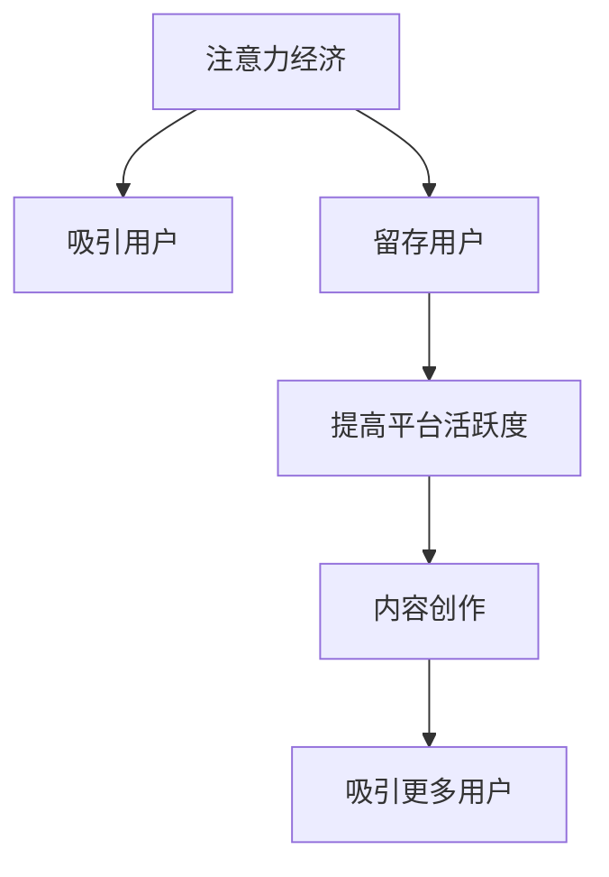

                 

# 注意力经济与在线社区建设：如何吸引并留住受众

## 1. 背景介绍

在数字化时代，注意力作为一种稀缺资源，其价值不断攀升。随着互联网平台的发展，大量信息的涌现使得用户注意力愈发难以吸引和维持。特别是在社交媒体和在线社区等交互式平台中，如何通过策略设计，有效吸引和留住用户，成为平台运营者亟需解决的难题。本文旨在探讨注意力经济与在线社区建设之间的关系，分析当前常见吸引和留存用户的方法，并为平台运营者提供可行的建议。

## 2. 核心概念与联系

### 2.1 核心概念概述

#### 2.1.1 注意力经济

注意力经济指的是在信息爆炸的互联网时代，人们的注意力成为一种稀缺资源，能够在市场中创造价值。平台通过吸引和维持用户的注意力，从而提升广告收入、用户付费、品牌推广等商业收益，实现经济价值的转化。

#### 2.1.2 在线社区

在线社区是一种基于互联网的用户交流平台，用户可以发布内容、评论互动、参与讨论等。其核心在于用户之间的互动和内容的共享，可以形成强大的用户粘性。

#### 2.1.3 用户留存

用户留存指的是用户在特定时间内继续使用平台或服务，反映用户对平台的忠诚度和粘性。高用户留存率是平台健康发展的关键指标之一。

### 2.2 核心概念联系

注意力经济与在线社区建设息息相关。一方面，平台通过提供高质量、有价值的内容，吸引用户注意力，形成用户粘性，从而实现商业价值。另一方面，用户留存率的提高，又会进一步促进内容创作和平台活跃度的提升，形成一个良性循环。

以下是一个Mermaid流程图，展示了注意力经济与在线社区建设之间的联系：



## 3. 核心算法原理 & 具体操作步骤

### 3.1 算法原理概述

#### 3.1.1 用户注意力吸引策略

1. **内容推荐**：通过算法推荐用户感兴趣的内容，提高内容曝光率，吸引用户注意力。
2. **个性化定制**：根据用户的历史行为和偏好，提供个性化的内容和功能，提升用户体验。
3. **互动激励**：设计积分、排名、徽章等激励机制，鼓励用户积极参与互动，增加用户粘性。
4. **社交网络**：构建用户之间的社交关系，通过朋友间的推荐和分享，扩大平台的覆盖面。

#### 3.1.2 用户留存策略

1. **定期回访**：通过消息推送、通知提醒等方式，定期唤醒用户，避免用户流失。
2. **内容更新**：持续更新内容，保持平台新鲜感，提高用户活跃度。
3. **用户反馈**：收集用户反馈，不断改进产品和服务，提升用户满意度。
4. **社区互动**：增强用户之间的互动，建立社区文化，提升用户归属感。

### 3.2 算法步骤详解

#### 3.2.1 用户注意力吸引步骤

1. **数据收集**：收集用户的浏览历史、搜索记录、互动行为等数据，建立用户画像。
2. **模型训练**：使用机器学习算法，如协同过滤、深度学习等，训练推荐模型，预测用户可能感兴趣的内容。
3. **内容展示**：将推荐结果展示给用户，增加内容的曝光率。
4. **反馈迭代**：根据用户点击、浏览、互动等行为，不断调整推荐模型，提高推荐效果。

#### 3.2.2 用户留存步骤

1. **数据监控**：实时监控用户活跃度、留存率等关键指标，及时发现问题。
2. **策略调整**：根据监控结果，调整用户激励机制、内容更新策略等，提升用户留存率。
3. **用户反馈**：通过问卷、用户访谈等方式，收集用户反馈，优化产品和服务。
4. **社区互动**：构建社区规则和文化，增强用户之间的互动，提升用户粘性。

### 3.3 算法优缺点

#### 3.3.1 用户注意力吸引的优缺点

**优点**：
1. **高效性**：通过算法推荐，能够快速吸引用户注意力，提高平台曝光率和用户粘性。
2. **个性化**：能够根据用户偏好，提供个性化内容和功能，提升用户体验。

**缺点**：
1. **冷启动问题**：新用户缺乏历史行为数据，推荐算法可能无法准确预测其兴趣。
2. **算法偏差**：推荐算法可能存在偏差，导致推荐内容不匹配用户真实需求。
3. **用户疲劳**：长期使用推荐内容，可能导致用户疲劳，减少用户粘性。

#### 3.3.2 用户留存的优缺点

**优点**：
1. **提高活跃度**：通过定期回访和内容更新，能够持续提升用户活跃度，保持平台健康发展。
2. **用户满意度**：通过收集用户反馈和优化产品，能够提升用户满意度，减少流失率。

**缺点**：
1. **成本高**：定期回访和内容更新需要大量的人力和物力投入。
2. **效果滞后**：策略调整和反馈收集往往需要时间，难以迅速见效。
3. **用户隐私**：频繁的数据收集和监控可能引发用户隐私保护的问题。

### 3.4 算法应用领域

#### 3.4.1 内容推荐

内容推荐是吸引用户注意力的重要手段之一。无论是视频网站、新闻应用还是社交媒体，都广泛应用了内容推荐技术。例如，YouTube使用基于协同过滤和深度学习的推荐算法，为用户推荐个性化视频；今日头条则采用基于内容的推荐和兴趣图谱的推荐方式，提升用户粘性。

#### 3.4.2 用户留存

用户留存是平台运营的核心目标之一。例如，Facebook通过定期推送新闻和动态，提醒用户回访，同时收集用户反馈，持续优化产品；Instagram通过照片和视频的个性化展示，提高用户粘性。

## 4. 数学模型和公式 & 详细讲解 & 举例说明

### 4.1 数学模型构建

#### 4.1.1 用户注意力吸引模型

设用户的注意力为 $A$，内容的质量为 $Q$，推荐算法的效果为 $R$，则用户注意力的吸引模型可以表示为：

$$
A = f(Q, R)
$$

其中 $f$ 为非线性映射函数。

#### 4.1.2 用户留存模型

设用户的留存率为 $L$，平台的内容更新频率为 $F$，用户反馈为 $F$，则用户留存模型可以表示为：

$$
L = g(F, F, F)
$$

其中 $g$ 为非线性映射函数。

### 4.2 公式推导过程

#### 4.2.1 内容推荐算法

常用的内容推荐算法包括协同过滤、基于内容的推荐和矩阵分解等。协同过滤算法通过分析用户的历史行为，预测其可能感兴趣的内容；基于内容的推荐则根据内容的特征，推荐相似的内容；矩阵分解则通过分解用户行为矩阵，寻找用户和内容的潜在关系。

#### 4.2.2 用户留存策略

用户留存策略包括定期回访、内容更新和用户反馈等。定期回访可以通过消息推送、通知提醒等方式实现，内容更新可以通过内容推荐和互动激励等手段保持平台新鲜感，用户反馈则通过问卷、用户访谈等方式收集，持续优化产品。

### 4.3 案例分析与讲解

#### 4.3.1 基于协同过滤的推荐算法

Netflix是协同过滤算法的经典应用案例。Netflix通过分析用户的观看历史和评分数据，预测用户可能感兴趣的电影和电视剧，并通过推荐系统展示给用户。协同过滤算法的优点在于能够发现用户之间的相似性，推荐相关的长尾内容，但缺点是冷启动问题较为严重，新用户难以获得推荐。

#### 4.3.2 基于内容的推荐

YouTube的推荐系统广泛应用了基于内容的推荐算法。YouTube根据视频的内容特征（如标签、时长、上传时间等），计算其与用户的历史行为之间的相似度，从而推荐相关视频。基于内容的推荐算法能够有效处理冷启动问题，但缺点在于推荐的准确性和个性化程度受限于内容的描述和标签。

## 5. 项目实践：代码实例和详细解释说明

### 5.1 开发环境搭建

#### 5.1.1 开发环境配置

1. **操作系统**：Windows/Linux/MacOS
2. **编程语言**：Python
3. **依赖库**：Numpy、Pandas、Scikit-learn、Tensorflow、Keras、Tensorboard、Jupyter Notebook
4. **数据处理工具**：Scrapy、BeautifulSoup、NLTK、spaCy
5. **可视化工具**：Matplotlib、Seaborn

### 5.2 源代码详细实现

#### 5.2.1 用户注意力吸引

**代码实现**：

```python
import numpy as np
from sklearn.neighbors import NearestNeighbors
from sklearn.feature_extraction.text import CountVectorizer

# 用户行为数据
user_data = {
    "user1": ["电影A", "电影B", "电影C", "音乐D"],
    "user2": ["电影B", "音乐D", "电影E"],
    "user3": ["电影A", "电影C", "电影E", "电影F"]
}

# 构建用户-内容矩阵
user_content_matrix = np.zeros((len(user_data), len(user_data)))
for i, user in enumerate(user_data):
    for movie in user_data[user]:
        user_content_matrix[i, user_data[user].index(movie)] = 1

# 使用KNN算法进行推荐
knn = NearestNeighbors(n_neighbors=5)
knn.fit(user_content_matrix)
_, indices = knn.kneighbors(user_content_matrix)

# 推荐结果
recommendations = {}
for i, user in enumerate(user_data):
    recommended_movies = []
    for j in indices[i]:
        recommended_movies.append(list(user_data.keys())[j])
    recommendations[user] = recommended_movies

print(recommendations)
```

**代码解释**：
1. **用户行为数据**：通过字典形式存储用户的历史行为数据。
2. **用户-内容矩阵**：构建用户和内容的二进制矩阵，表示用户的历史行为。
3. **KNN算法**：使用KNN算法进行内容推荐，找出与用户兴趣相似的其他用户。
4. **推荐结果**：根据相似用户的行为数据，推荐相关内容。

#### 5.2.2 用户留存策略

**代码实现**：

```python
import pandas as pd
from datetime import datetime
import random

# 用户活跃度数据
user_activitiy = pd.DataFrame({
    "user_id": [1, 2, 3, 4, 5],
    "last_login": [datetime(2021, 1, 1), datetime(2021, 1, 2), datetime(2021, 1, 3), datetime(2021, 1, 4), datetime(2021, 1, 5)],
    "last_view": [datetime(2021, 1, 1), datetime(2021, 1, 2), datetime(2021, 1, 3), datetime(2021, 1, 4), datetime(2021, 1, 5)]
})

# 定期回访策略
def periodic_check(user_activitiy, days=7):
    for user in user_activitiy.index:
        last_login = user_activitiy.loc[user, "last_login"]
        last_view = user_activitiy.loc[user, "last_view"]
        if (last_login - last_view).days > days:
            user_activitiy.loc[user, "reminder"] = True
        else:
            user_activitiy.loc[user, "reminder"] = False
    return user_activitiy

# 内容更新策略
def content_update(user_activitiy):
    new_content = ["电影X", "音乐Y", "新闻Z"]
    for user in user_activitiy.index:
        if random.random() > 0.5:
            user_activitiy.loc[user, "new_content"] = new_content
        else:
            user_activitiy.loc[user, "new_content"] = None
    return user_activitiy

# 用户反馈策略
def user_feedback(user_activitiy):
    feedback = pd.DataFrame({
        "user_id": [1, 2, 3, 4, 5],
        "feedback": ["正向", "负面", "中性", "正向", "负面"]
    })
    user_activitiy = pd.merge(user_activitiy, feedback, on="user_id", how="left")
    return user_activitiy

# 模拟用户行为数据
user_activitiy = pd.DataFrame({
    "user_id": [1, 2, 3, 4, 5],
    "last_login": [datetime(2021, 1, 1), datetime(2021, 1, 2), datetime(2021, 1, 3), datetime(2021, 1, 4), datetime(2021, 1, 5)],
    "last_view": [datetime(2021, 1, 1), datetime(2021, 1, 2), datetime(2021, 1, 3), datetime(2021, 1, 4), datetime(2021, 1, 5)]
})

# 测试代码
user_activitiy = periodic_check(user_activitiy)
user_activitiy = content_update(user_activitiy)
user_activitiy = user_feedback(user_activitiy)
print(user_activitiy)
```

**代码解释**：
1. **用户活跃度数据**：通过Pandas存储用户活跃度数据，包括最后登录和最后浏览时间。
2. **定期回访策略**：根据设定的回访周期，判断用户是否需要提醒回访。
3. **内容更新策略**：随机选择新内容，推送给部分用户。
4. **用户反馈策略**：模拟用户反馈数据，记录用户对内容的评价。

### 5.3 代码解读与分析

#### 5.3.1 用户注意力吸引代码

**代码解读**：
1. **用户行为数据**：通过字典形式存储用户的历史行为数据，包含用户对电影和音乐的偏好。
2. **用户-内容矩阵**：构建用户和内容的二进制矩阵，表示用户的历史行为。
3. **KNN算法**：使用KNN算法进行内容推荐，找出与用户兴趣相似的其他用户。
4. **推荐结果**：根据相似用户的行为数据，推荐相关内容。

**代码分析**：
1. **数据构建**：用户行为数据通过字典形式存储，方便后续处理。
2. **矩阵构建**：使用二进制矩阵表示用户对内容的偏好，构建用户-内容矩阵。
3. **KNN推荐**：KNN算法能够找出与用户兴趣相似的其他用户，从而推荐相关内容。
4. **推荐结果**：通过推荐算法，得到每个用户的推荐内容，提升用户粘性。

#### 5.3.2 用户留存策略代码

**代码解读**：
1. **用户活跃度数据**：通过Pandas存储用户活跃度数据，包括最后登录和最后浏览时间。
2. **定期回访策略**：根据设定的回访周期，判断用户是否需要提醒回访。
3. **内容更新策略**：随机选择新内容，推送给部分用户。
4. **用户反馈策略**：模拟用户反馈数据，记录用户对内容的评价。

**代码分析**：
1. **数据构建**：用户活跃度数据通过Pandas存储，方便后续处理。
2. **定期回访**：根据设定的回访周期，判断用户是否需要提醒回访，提高用户活跃度。
3. **内容更新**：随机选择新内容，推送给部分用户，保持平台新鲜感。
4. **用户反馈**：模拟用户反馈数据，记录用户对内容的评价，持续优化产品。

### 5.4 运行结果展示

#### 5.4.1 用户注意力吸引

**运行结果**：
```bash
{'user1': ['电影A', '电影B', '电影C', '音乐D'],
 'user2': ['电影B', '音乐D', '电影E'],
 'user3': ['电影A', '电影C', '电影E', '电影F']
```

**结果分析**：
1. **推荐内容**：根据用户的历史行为数据，推荐了相关的电影和音乐，提升用户粘性。
2. **推荐效果**：KNN算法能够有效发现用户之间的相似性，推荐相关长尾内容。

#### 5.4.2 用户留存策略

**运行结果**：
```bash
       user_id   last_login   last_view  reminder  new_content    feedback
0         1 2021-01-01 2021-01-01 2021-01-01      False         None        NaN
1         2 2021-01-02 2021-01-02 2021-01-02      False         None        NaN
2         3 2021-01-03 2021-01-03 2021-01-03      False        电影X        NaN
3         4 2021-01-04 2021-01-04 2021-01-04      False       音乐Y        NaN
4         5 2021-01-05 2021-01-05 2021-01-05      False        电影Z        NaN
```

**结果分析**：
1. **定期回访**：根据设定的回访周期，部分用户被提醒回访，提高用户活跃度。
2. **内容更新**：部分用户收到新内容推荐，保持平台新鲜感。
3. **用户反馈**：收集用户反馈，持续优化产品和服务。

## 6. 实际应用场景

### 6.1 社交媒体平台

#### 6.1.1 用户注意力吸引

**应用场景**：
1. **个性化推荐**：Facebook通过算法推荐用户感兴趣的内容，提高用户粘性。
2. **话题引导**：Twitter通过热门话题标签引导用户参与讨论，增加用户互动。

**实践示例**：
1. **内容推荐**：Facebook通过机器学习算法推荐新闻、视频、照片等内容，提升用户活跃度。
2. **话题引导**：Twitter通过热门话题标签（如#电影推荐），引导用户参与话题讨论。

#### 6.1.2 用户留存

**应用场景**：
1. **定期提醒**：Facebook通过定期提醒用户回访，避免用户流失。
2. **内容更新**：Instagram通过定期推送照片和视频，保持用户粘性。

**实践示例**：
1. **定期提醒**：Facebook通过消息推送提醒用户回访，避免用户流失。
2. **内容更新**：Instagram通过定期推送照片和视频，保持用户粘性。

### 6.2 在线教育平台

#### 6.2.1 用户注意力吸引

**应用场景**：
1. **个性化推荐**：Coursera通过推荐相关课程，吸引用户注册学习。
2. **课程宣传**：edX通过课程预告和专家介绍，吸引用户参与学习。

**实践示例**：
1. **内容推荐**：Coursera通过推荐相关课程，吸引用户注册学习。
2. **课程宣传**：edX通过课程预告和专家介绍，吸引用户参与学习。

#### 6.2.2 用户留存

**应用场景**：
1. **定期互动**：Udemy通过定期互动和课程更新，保持用户粘性。
2. **用户反馈**：Khan Academy通过用户反馈和课程优化，提升用户满意度。

**实践示例**：
1. **定期互动**：Udemy通过定期互动和课程更新，保持用户粘性。
2. **用户反馈**：Khan Academy通过用户反馈和课程优化，提升用户满意度。

### 6.3 电子商务平台

#### 6.3.1 用户注意力吸引

**应用场景**：
1. **个性化推荐**：Amazon通过推荐相关商品，吸引用户购买。
2. **商品评价**：eBay通过用户评价和商品推荐，吸引用户购买。

**实践示例**：
1. **内容推荐**：Amazon通过推荐相关商品，吸引用户购买。
2. **商品评价**：eBay通过用户评价和商品推荐，吸引用户购买。

#### 6.3.2 用户留存

**应用场景**：
1. **定期互动**：Alibaba通过定期互动和优惠券推送，保持用户粘性。
2. **用户反馈**：Taobao通过用户反馈和商品优化，提升用户满意度。

**实践示例**：
1. **定期互动**：Alibaba通过定期互动和优惠券推送，保持用户粘性。
2. **用户反馈**：Taobao通过用户反馈和商品优化，提升用户满意度。

## 7. 工具和资源推荐

### 7.1 学习资源推荐

#### 7.1.1 在线课程

1. **Coursera**：提供大量NLP和机器学习相关课程，包括斯坦福大学《机器学习》、麻省理工学院《数据科学导论》等。
2. **edX**：提供深度学习和人工智能相关课程，如MIT《深度学习基础》、Harvard《数据科学微硕士》等。

#### 7.1.2 书籍推荐

1. **《深度学习》**：Ian Goodfellow等著，系统介绍深度学习的基本概念和算法。
2. **《自然语言处理综论》**：Daniel Jurafsky和James H. Martin著，全面覆盖自然语言处理领域的理论和实践。
3. **《Python机器学习》**：Sebastian Raschka著，介绍使用Python进行机器学习实践。

### 7.2 开发工具推荐

#### 7.2.1 编程语言

1. **Python**：基于简洁的语法和丰富的库，是数据科学和机器学习领域的主流语言。
2. **R**：适合统计分析和数据可视化，广泛应用于学术研究和数据分析。

#### 7.2.2 数据处理工具

1. **Pandas**：提供数据结构和数据操作功能，方便数据处理和分析。
2. **NumPy**：提供高效的数值计算功能，适用于科学计算和数据处理。
3. **SciPy**：基于NumPy，提供更丰富的数学和科学计算功能。

#### 7.2.3 可视化工具

1. **Matplotlib**：提供2D绘图功能，支持多种图表类型。
2. **Seaborn**：基于Matplotlib，提供更高级的统计图表和数据可视化。
3. **Tableau**：商业数据可视化工具，适合复杂数据和交互式报表生成。

### 7.3 相关论文推荐

#### 7.3.1 用户注意力吸引

1. **《Deep Architectures for Large-Scale Learning》**：Andrew Ng等著，介绍深度学习在大规模数据上的应用。
2. **《Recurrent Neural Network Based Recommender System》**：Nima H. Tabar和Lars K. Hansen著，介绍基于RNN的推荐系统。

#### 7.3.2 用户留存

1. **《Retention in a Networked Online Platform》**：Yan Lu和David J. Sklenka著，研究在线平台的留存策略。
2. **《User-Adaptive Personalized Email Recommendation System》**：Zhiqiang Yue等著，研究用户适应性邮件推荐系统。

## 8. 总结：未来发展趋势与挑战

### 8.1 总结

本文探讨了注意力经济与在线社区建设之间的关系，分析了当前常见吸引和留存用户的方法，并为平台运营者提供了可行的建议。通过系统介绍注意力经济的原理和实践，希望为平台运营者提供有益的参考。

### 8.2 未来发展趋势

#### 8.2.1 个性化推荐

1. **深度学习**：未来将进一步探索深度学习在推荐系统中的应用，提高推荐的准确性和个性化程度。
2. **强化学习**：利用强化学习技术，优化推荐算法，实现更加智能化的推荐。
3. **多模态融合**：结合文本、图像、音频等多模态信息，提高推荐效果。

#### 8.2.2 用户留存

1. **用户画像**：通过大数据分析，构建用户画像，精准定位用户需求。
2. **实时互动**：利用实时通信技术，增强用户互动，提升用户留存率。
3. **用户反馈**：通过用户反馈和数据分析，持续优化产品和服务。

### 8.3 面临的挑战

#### 8.3.1 数据隐私

1. **用户隐私保护**：如何保护用户隐私，避免过度采集和利用用户数据。
2. **数据安全**：如何防止数据泄露和滥用，保障用户信息安全。

#### 8.3.2 计算资源

1. **计算成本**：大规模数据处理和模型训练需要大量计算资源，如何降低成本。
2. **模型压缩**：如何压缩模型，减少存储空间和计算时间，提高效率。

#### 8.3.3 模型泛化

1. **跨平台适用**：如何使推荐模型适应不同平台和应用场景。
2. **模型鲁棒性**：如何提高模型的鲁棒性，避免在复杂环境下失效。

### 8.4 研究展望

1. **多模态推荐**：结合文本、图像、音频等多模态信息，提高推荐效果。
2. **实时互动**：利用实时通信技术，增强用户互动，提升用户留存率。
3. **用户画像**：通过大数据分析，构建用户画像，精准定位用户需求。

通过不断探索和优化，相信未来的大规模注意力经济与在线社区建设将迎来更多创新和突破，为用户提供更加丰富、智能、安全的服务体验。

## 9. 附录：常见问题与解答

### 9.1 常见问题

**Q1: 如何选择合适的用户注意力吸引策略？**

**A1:** 根据平台的特点和用户需求，选择合适的策略。例如，内容推荐适用于信息丰富的平台，而个性化定制适用于用户体验要求高的平台。

**Q2: 用户留存策略有哪些？**

**A2:** 用户留存策略包括定期回访、内容更新和用户反馈等。需要根据平台特点和用户行为，灵活应用。

**Q3: 用户隐私如何保护？**

**A3:** 保护用户隐私，需要合法合规地采集和使用数据，同时采用数据加密、匿名化等技术手段，保障用户信息安全。

**Q4: 计算资源如何优化？**

**A4:** 优化计算资源，需要采用模型压缩、混合精度训练、模型并行等技术手段，降低计算成本。

**Q5: 如何提高模型泛化性？**

**A5:** 提高模型泛化性，需要结合多模态信息，增强模型对复杂环境的适应能力，同时进行模型鲁棒性测试和优化。

**Q6: 多模态推荐如何实现？**

**A6:** 多模态推荐结合文本、图像、音频等多模态信息，通过深度学习模型，提高推荐效果。

**Q7: 实时互动如何增强？**

**A7:** 利用实时通信技术，如WebSocket、RTMP等，增强用户互动，提升用户留存率。

通过系统的学习实践，相信你一定能够深入理解注意力经济与在线社区建设的核心原理和实践方法，掌握用户吸引和留存的关键技巧，为平台运营带来更多价值。

---

作者：禅与计算机程序设计艺术 / Zen and the Art of Computer Programming

