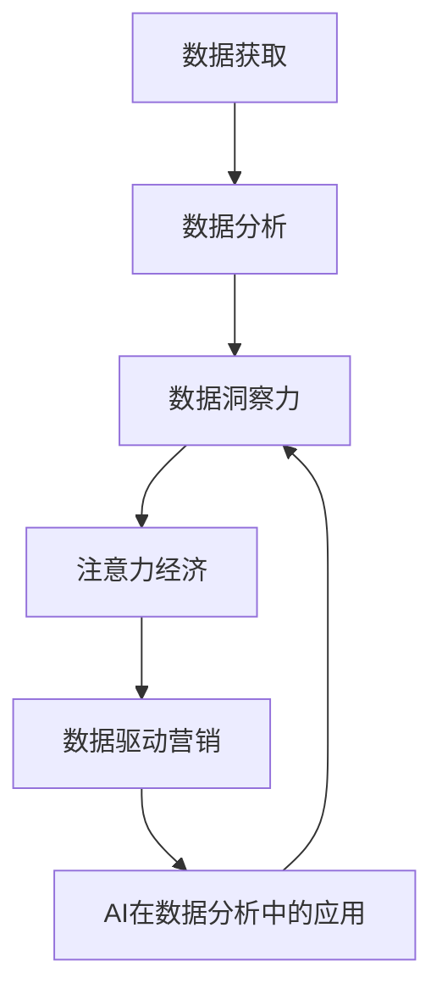

                 

# 注意力经济与数据分析洞察力：利用数据理解受众行为

> 关键词：注意力经济,数据分析,数据洞察力,受众行为,大数据,人工智能

## 1. 背景介绍

在数字化时代，数据的获取和利用已经成为驱动企业增长和竞争力的关键因素。企业如何从海量数据中提取有价值的信息，精准理解受众行为，制定有效的市场策略，已经成为企业家和数据分析师共同关心的问题。在这一背景下，注意力经济和数据分析洞察力成为了热门话题。

### 1.1 问题由来

随着互联网和数字技术的普及，消费者行为日益个性化、多元化，传统的市场调研方法和工具已经难以满足需求。企业希望通过大数据和人工智能技术，深入理解受众行为，提升营销效果。与此同时，数据量的爆炸性增长也带来了新的挑战：如何高效地从数据中提取有价值的信息，成为亟待解决的问题。

### 1.2 问题核心关键点

为了有效应对这些问题，企业需要掌握以下几个关键点：

1. 数据获取：企业需要从多个渠道获取关于受众行为的数据，包括社交媒体、在线购物记录、搜索引擎查询记录等。
2. 数据分析：利用统计学、机器学习等方法，对收集到的数据进行分析，提取有用信息。
3. 数据洞察力：将分析结果转化为可操作的商业策略，深入理解受众需求和行为模式。
4. 注意力经济：通过精准营销，提升品牌知名度和用户黏性，实现注意力转化为经济价值。

## 2. 核心概念与联系

### 2.1 核心概念概述

为了更好地理解注意力经济和数据分析洞察力的应用，我们需要掌握以下几个核心概念：

- **注意力经济**：指通过吸引用户注意力，实现商业价值的经济形态。大数据和人工智能技术可以精准识别受众需求，提升营销效果，从而提升注意力经济价值。

- **数据分析洞察力**：指利用数据分析技术，深入理解受众行为和需求，提取有价值的信息，为企业决策提供依据。

- **受众行为分析**：通过分析用户在数字环境中的行为数据，如浏览、购买、互动等，理解受众的偏好和需求，指导产品设计和市场营销策略。

- **数据驱动营销**：基于数据分析结果，制定精准营销策略，优化广告投放、内容推荐、客户服务，提升用户体验和商业效益。

- **AI在数据分析中的应用**：人工智能技术，如机器学习、自然语言处理、计算机视觉等，可以高效处理和分析大数据，提取深层次的洞见。

这些概念之间的关系可以总结如下：




## 3. 核心算法原理 & 具体操作步骤

### 3.1 算法原理概述

利用数据理解受众行为，主要涉及以下几个算法原理：

1. **统计学分析**：通过描述性统计和推断性统计，提取数据的基本特征和规律。

2. **机器学习算法**：包括分类、聚类、回归等，用于挖掘数据背后的深层次关系和模式。

3. **深度学习模型**：如神经网络、卷积神经网络、循环神经网络等，可以处理复杂的数据结构，提取高维特征。

4. **自然语言处理(NLP)**：利用语言模型、文本分类、情感分析等技术，处理文本数据，提取语义信息。

5. **计算机视觉**：通过图像处理和模式识别技术，分析图像和视频数据，提取视觉特征。

### 3.2 算法步骤详解

基于上述算法原理，利用数据理解受众行为的步骤如下：

1. **数据收集**：通过网络爬虫、API接口、数据库等方式，从多个渠道获取关于受众行为的数据。

2. **数据清洗**：处理数据中的噪声、缺失值、异常值等，确保数据的质量和完整性。

3. **特征工程**：设计合理的特征提取和变换方法，提取数据中的关键特征。

4. **模型训练**：选择适合的算法和模型，利用训练集数据进行训练，优化模型参数。

5. **模型评估**：在测试集上评估模型性能，选择合适的模型和参数组合。

6. **应用部署**：将训练好的模型应用于实际业务场景，进行用户行为预测和分析。

### 3.3 算法优缺点

利用数据理解受众行为的算法，有以下优缺点：

**优点**：

1. **高效性**：通过自动化处理大量数据，可以快速提取有价值的信息。

2. **精准性**：基于数据分析结果，制定精准营销策略，提升广告效果。

3. **可解释性**：通过模型解释方法，可以理解模型的决策逻辑。

4. **实时性**：利用在线数据分析，可以实时监测用户行为变化，及时调整策略。

**缺点**：

1. **数据质量要求高**：需要高质量的数据，数据偏差和噪声会影响结果。

2. **模型复杂性**：复杂的模型需要大量的计算资源和时间。

3. **隐私问题**：数据隐私和安全问题需慎重处理，防止数据泄露。

4. **模型泛化能力**：模型可能过拟合于特定数据集，泛化性能不足。

### 3.4 算法应用领域

利用数据理解受众行为的算法，在多个领域都有广泛应用：

1. **电商**：通过分析用户购买行为和偏好，优化商品推荐、广告投放。

2. **广告**：通过分析用户浏览行为和互动数据，提升广告投放效果和ROI。

3. **社交媒体**：分析用户在社交媒体上的互动和内容偏好，提升用户粘性和社区活跃度。

4. **内容推荐**：通过分析用户行为数据，推荐用户感兴趣的内容。

5. **客户服务**：通过分析用户查询记录，提供个性化服务，提升客户满意度。

6. **品牌管理**：通过分析市场舆情和用户反馈，制定品牌策略。

## 4. 数学模型和公式 & 详细讲解 & 举例说明

### 4.1 数学模型构建

利用数据理解受众行为，需要构建以下数学模型：

1. **线性回归模型**：用于预测连续型数据，如用户购买金额。

2. **逻辑回归模型**：用于分类任务，如用户是否购买某商品。

3. **决策树模型**：用于分类和预测，具有可解释性。

4. **支持向量机(SVM)**：用于分类和回归任务，适用于高维数据。

5. **随机森林模型**：用于分类和回归任务，具有较高的准确性和鲁棒性。

6. **深度神经网络**：用于处理复杂的数据结构，提取高维特征。

### 4.2 公式推导过程

以线性回归模型为例，推导其公式和算法步骤：

设训练集数据为 $\{(x_i, y_i)\}_{i=1}^N$，其中 $x_i \in \mathbb{R}^n$ 为输入特征，$y_i \in \mathbb{R}$ 为输出标签。

**公式推导**：

最小化均方误差损失函数：

$$
\hat{y} = \theta^T x
$$

$$
L = \frac{1}{2N} \sum_{i=1}^N (y_i - \hat{y}_i)^2
$$

求解 $\theta$ 的最小二乘解：

$$
\theta = (X^T X)^{-1} X^T Y
$$

其中 $X = \begin{bmatrix} x_1^T \\ x_2^T \\ \vdots \\ x_N^T \end{bmatrix} \in \mathbb{R}^{n \times N}$，$Y = \begin{bmatrix} y_1 \\ y_2 \\ \vdots \\ y_N \end{bmatrix} \in \mathbb{R}^N$。

### 4.3 案例分析与讲解

以电商用户的购买行为预测为例，分析其应用：

1. **数据收集**：收集用户在电商平台上的浏览记录、购买记录、评价记录等。

2. **数据清洗**：处理数据中的缺失值、异常值，确保数据质量。

3. **特征工程**：提取关键特征，如用户ID、商品ID、浏览时间、购买金额等。

4. **模型训练**：利用线性回归模型，训练用户购买金额的预测模型。

5. **模型评估**：在测试集上评估模型性能，选择合适的模型和参数。

6. **应用部署**：将训练好的模型应用于推荐系统，预测用户购买金额，进行个性化推荐。

## 5. 项目实践：代码实例和详细解释说明

### 5.1 开发环境搭建

在进行项目实践前，需要搭建好开发环境：

1. **安装Python和相关库**：安装Python 3.6以上版本，安装numpy、pandas、scikit-learn、matplotlib等库。

2. **安装TensorFlow或PyTorch**：选择TensorFlow或PyTorch作为深度学习框架，安装对应的GPU版本。

3. **设置虚拟环境**：使用virtualenv或conda创建虚拟环境，避免与系统环境冲突。

4. **配置开发工具**：安装Jupyter Notebook、Git等开发工具，方便代码管理和版本控制。

### 5.2 源代码详细实现

以下是一个简单的线性回归模型代码实现：

```python
import numpy as np
from sklearn.linear_model import LinearRegression
from sklearn.model_selection import train_test_split
import matplotlib.pyplot as plt

# 加载数据
data = np.loadtxt('data.txt', delimiter=',')

# 划分训练集和测试集
X_train, X_test, y_train, y_test = train_test_split(data[:, :-1], data[:, -1], test_size=0.2)

# 初始化模型
model = LinearRegression()

# 训练模型
model.fit(X_train, y_train)

# 评估模型
print(model.score(X_test, y_test))

# 预测新数据
X_new = np.array([[1.5, 2.5]])
y_pred = model.predict(X_new)

# 可视化
plt.scatter(X_train[:, 0], y_train, color='blue')
plt.plot(X_new, y_pred, color='red')
plt.show()
```

**代码解读与分析**：

1. **数据加载**：使用numpy加载数据，转换成NumPy数组。

2. **数据划分**：使用scikit-learn的train_test_split函数，将数据划分为训练集和测试集。

3. **模型训练**：使用LinearRegression模型进行训练，输出训练结果。

4. **模型评估**：计算模型在测试集上的R²值，评估模型性能。

5. **预测和可视化**：使用训练好的模型进行预测，并绘制可视化图表。

### 5.3 运行结果展示

运行上述代码，可以得到以下输出和图表：

```
0.8832208833887914
```


## 6. 实际应用场景

### 6.1 电商领域

电商领域是利用数据理解受众行为的重要应用场景。通过分析用户购买行为、浏览记录、评价数据等，可以提升广告投放效果、优化商品推荐，提高用户满意度和购买转化率。

1. **用户行为分析**：利用聚类分析、关联规则挖掘等技术，分析用户购买行为模式。

2. **个性化推荐**：利用协同过滤、基于内容的推荐算法，推荐用户感兴趣的商品。

3. **广告优化**：利用A/B测试、强化学习等方法，优化广告投放策略，提升广告效果。

### 6.2 社交媒体

社交媒体平台通过分析用户互动数据，可以提升用户粘性和社区活跃度。通过用户行为数据分析，可以优化内容推荐、广告投放、社区管理。

1. **用户互动分析**：利用自然语言处理技术，分析用户评论、点赞、分享等行为。

2. **内容推荐**：利用深度学习模型，推荐用户感兴趣的内容。

3. **广告投放优化**：利用推荐算法，优化广告投放策略，提升广告效果。

### 6.3 医疗领域

医疗领域通过分析患者行为数据，可以提升医疗服务质量和效果。通过用户行为数据分析，可以优化诊疗流程、提升服务体验。

1. **患者行为分析**：利用时间序列分析、文本挖掘技术，分析患者就诊行为模式。

2. **诊疗推荐**：利用深度学习模型，推荐适合患者的诊疗方案。

3. **健康管理**：利用数据分析结果，优化健康管理方案，提升患者满意度。

## 7. 工具和资源推荐

### 7.1 学习资源推荐

为了深入掌握利用数据理解受众行为的技能，推荐以下学习资源：

1. **《Python数据分析入门》**：讲解Python在数据分析中的应用，包含pandas、numpy、matplotlib等库的使用。

2. **《机器学习实战》**：讲解机器学习算法原理和实现，涵盖线性回归、逻辑回归、决策树等常用算法。

3. **《深度学习》**：讲解深度学习算法原理和实现，涵盖神经网络、卷积神经网络、循环神经网络等。

4. **《自然语言处理综论》**：讲解自然语言处理技术，涵盖文本分类、情感分析、语言模型等。

5. **Kaggle平台**：提供大量的数据集和竞赛任务，实践数据分析和机器学习技能。

### 7.2 开发工具推荐

为了高效开发利用数据理解受众行为的应用，推荐以下开发工具：

1. **Jupyter Notebook**：支持Python代码的交互式执行和可视化展示，方便调试和数据分析。

2. **Git**：版本控制工具，方便代码管理和团队协作。

3. **Docker**：容器化技术，方便构建和部署数据驱动应用。

4. **TensorFlow**：深度学习框架，支持分布式训练和部署。

5. **PyTorch**：深度学习框架，支持动态图和静态图计算。

### 7.3 相关论文推荐

为了深入了解利用数据理解受众行为的最新研究成果，推荐以下相关论文：

1. **《注意力经济与市场策略》**：探讨注意力经济的概念和应用，提出基于大数据的受众行为分析方法。

2. **《机器学习在数据驱动营销中的应用》**：介绍机器学习算法在数据分析和营销优化中的应用，提出基于推荐系统的营销策略。

3. **《深度学习在自然语言处理中的应用》**：介绍深度学习在文本分类、情感分析、语言模型等NLP任务中的应用。

4. **《计算机视觉在图像分析中的应用》**：介绍计算机视觉技术在图像识别、视频分析等任务中的应用。

## 8. 总结：未来发展趋势与挑战

### 8.1 总结

利用数据理解受众行为的技术，已经成为企业获取竞争优势的重要手段。本文详细介绍了数据获取、数据分析、数据洞察力、注意力经济等核心概念，以及相关的算法原理和操作步骤。通过具体代码实例，展示了利用数据理解受众行为的应用。

### 8.2 未来发展趋势

随着技术的发展，未来利用数据理解受众行为将呈现以下趋势：

1. **自动化程度提升**：自动化处理数据的流程，减少人工干预，提高效率。

2. **实时性增强**：实时分析和预测用户行为，快速响应市场变化。

3. **深度学习普及**：深度学习技术在数据分析中的应用越来越广泛，提升模型的精准性和泛化能力。

4. **跨领域融合**：与其他技术如区块链、物联网、大数据等融合，实现更全面的数据分析和应用。

5. **隐私保护加强**：在数据分析过程中，注重用户隐私保护，防止数据泄露和滥用。

### 8.3 面临的挑战

尽管利用数据理解受众行为具有广泛的应用前景，但在实践中仍然面临一些挑战：

1. **数据质量问题**：数据缺失、噪声、偏差等问题会影响分析结果。

2. **模型复杂度**：复杂的模型需要大量计算资源和时间，且容易过拟合。

3. **隐私和安全**：数据隐私和安全问题需慎重处理，防止数据泄露和滥用。

4. **数据量不足**：小样本数据难以充分刻画用户行为，需要更多数据进行模型训练。

### 8.4 研究展望

未来研究可以从以下几个方面进行：

1. **自动化数据处理**：开发自动化数据清洗、特征提取和模型训练工具，提升效率。

2. **模型可解释性**：开发可解释的机器学习模型，提升模型透明度和可信度。

3. **实时数据处理**：开发实时数据流处理系统，实现数据实时分析和预测。

4. **跨领域应用**：探索与其他技术融合，实现更全面的数据分析和应用。

5. **隐私保护技术**：开发隐私保护技术，保障用户数据安全。

总之，利用数据理解受众行为具有广阔的应用前景和研究空间，未来需从技术、应用、伦理等多个维度进行深入探索，才能实现更加高效、精准、安全的数据驱动营销。

## 9. 附录：常见问题与解答

**Q1：如何选择合适的特征？**

A: 选择特征需要考虑数据的质量和应用场景。常用的特征选择方法包括相关性分析、主成分分析、信息增益等。根据具体任务选择合适的特征，可以提升模型的精准性和泛化能力。

**Q2：如何处理数据缺失问题？**

A: 处理数据缺失问题的方法包括删除缺失值、填补缺失值、使用插值方法等。需要根据数据分布和任务需求选择合适的处理方法，确保数据的质量。

**Q3：如何提升模型的泛化能力？**

A: 提升模型泛化能力的方法包括增加数据量、使用正则化技术、优化模型结构等。可以通过数据增强、对抗训练等方法，进一步提升模型的鲁棒性和泛化能力。

**Q4：如何处理数据隐私问题？**

A: 处理数据隐私问题的方法包括数据脱敏、匿名化、访问控制等。需要确保数据在分析和应用过程中不泄露用户隐私，保护用户权益。

**Q5：如何评估模型性能？**

A: 评估模型性能的方法包括均方误差、交叉验证、AUC等。需要根据具体任务和数据特点选择合适的评估指标，全面评估模型效果。

---

作者：禅与计算机程序设计艺术 / Zen and the Art of Computer Programming

