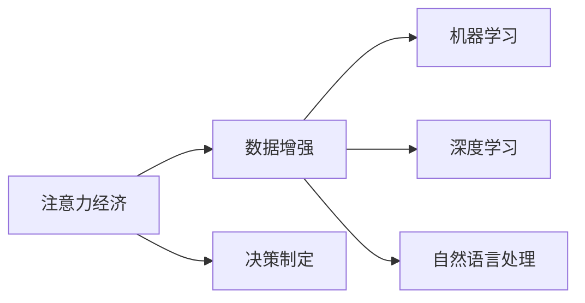

                 

# 注意力经济与数据驱动的决策制定：利用数据增强业务洞察力

> 关键词：注意力经济, 数据增强, 决策制定, 业务洞察, 机器学习, 深度学习, 自然语言处理

## 1. 背景介绍

### 1.1 问题由来

在当今信息爆炸的时代，数据的积累和利用已成为企业竞争的核心要素。企业的注意力和资源有限，如何有效利用海量数据提升业务决策的科学性和精准度，成为决定企业竞争力的关键问题。在这一背景下，注意力经济（Attention Economy）应运而生，通过数据驱动的方式，将注意力集中到最重要的业务洞察和决策上。

### 1.2 问题核心关键点

1. **数据的重要性**：数据是大企业战略决策的基础，能否高效利用和分析数据，直接决定着企业能否从竞争中脱颖而出。
2. **注意力集中**：在数据泛滥的今天，如何在海量数据中发现并聚焦关键业务洞察，是决定决策成败的关键。
3. **决策制定**：基于数据洞察，制定科学、高效的决策，是企业提升运营效率和盈利能力的有效途径。
4. **机器学习与深度学习**：利用机器学习与深度学习算法，自动化数据处理和分析，从而提升决策制定的效率和准确性。

## 2. 核心概念与联系

### 2.1 核心概念概述

1. **注意力经济**：以数据为基础，通过对数据的深入分析和挖掘，发现和聚焦关键业务洞察，从而引导企业的注意力集中到最具价值的业务领域。

2. **数据增强**：通过数据扩充、数据合成、数据提升等手段，丰富和优化数据集，提升数据质量和多样性，从而增强模型泛化能力和鲁棒性。

3. **决策制定**：基于数据洞察，制定科学、高效的决策方案，实现资源的最优配置和利用。

4. **机器学习与深度学习**：利用算法自动化数据处理和分析，从而提升决策制定的效率和准确性。

5. **自然语言处理**：利用自然语言处理技术，处理文本数据，提取有价值的业务洞察，辅助决策制定。

这些核心概念之间的关系可以通过以下Mermaid流程图来展示：



这个流程图展示了大企业利用数据增强提升决策制定的整体流程：

1. 首先通过注意力经济将注意力集中到关键业务洞察上。
2. 然后利用数据增强丰富和优化数据集，提升模型质量。
3. 接着利用机器学习和深度学习算法自动化数据处理和分析，提升决策制定的效率和准确性。
4. 最后通过自然语言处理技术处理文本数据，提取有价值的业务洞察，辅助决策制定。

## 3. 核心算法原理 & 具体操作步骤

### 3.1 算法原理概述

注意力经济与数据驱动的决策制定的核心在于利用数据增强技术和机器学习/深度学习算法，实现数据价值的最大化。具体来说，包括以下几个关键步骤：

1. **数据收集与预处理**：收集企业内部和外部的各类数据，并进行清洗和预处理，确保数据的准确性和一致性。
2. **数据增强**：利用数据合成、扩充等技术，丰富和优化数据集，提升模型泛化能力和鲁棒性。
3. **模型训练与优化**：利用机器学习和深度学习算法，训练和优化模型，使其能够自动发现和聚焦关键业务洞察。
4. **业务洞察与决策制定**：基于模型输出的洞察，结合专家知识和业务经验，制定科学、高效的决策方案。

### 3.2 算法步骤详解

1. **数据收集与预处理**
   - 利用ETL（Extract-Transform-Load）工具，从企业内部和外部数据源中收集数据，包括交易数据、客户数据、市场数据等。
   - 对数据进行清洗和预处理，包括去重、缺失值填充、异常值处理等，确保数据的准确性和一致性。

2. **数据增强**
   - 利用数据合成技术，如GAN（Generative Adversarial Networks）生成新的数据样本，丰富数据集。
   - 利用数据扩充技术，如回译、近义替换等，扩充现有数据集。
   - 利用数据提升技术，如SMOTE（Synthetic Minority Over-sampling Technique）等，提升数据集的平衡性和多样性。

3. **模型训练与优化**
   - 选择合适的机器学习和深度学习算法，如回归分析、随机森林、神经网络等。
   - 使用训练集进行模型训练，通过交叉验证和超参数调优，找到最优模型。
   - 使用验证集对模型进行验证和调优，确保模型的泛化能力和鲁棒性。

4. **业务洞察与决策制定**
   - 利用模型输出的洞察，结合专家知识和业务经验，制定科学、高效的决策方案。
   - 将决策方案转化为具体的业务操作，实现资源的最优配置和利用。

### 3.3 算法优缺点

**数据增强的优势：**
- **提升模型泛化能力**：丰富和优化数据集，提升模型对新数据的泛化能力。
- **增强鲁棒性**：通过扩充数据集，提高模型对异常值和噪声的鲁棒性。
- **降低过拟合风险**：增加数据量，减少模型过拟合的风险。

**数据增强的局限性：**
- **计算成本高**：数据合成和扩充需要较高的计算资源和时间。
- **数据质量影响**：数据合成和扩充的效果取决于原始数据的质量。

**机器学习和深度学习的优势：**
- **自动化数据处理**：利用算法自动化数据处理和分析，提升决策制定的效率和准确性。
- **高效发现业务洞察**：通过训练模型，自动发现和聚焦关键业务洞察，辅助决策制定。

**机器学习和深度学习的局限性：**
- **数据依赖性高**：模型性能很大程度上取决于数据的质量和数量。
- **黑箱问题**：模型决策过程不够透明，难以解释。

**自然语言处理的优势：**
- **处理文本数据**：利用自然语言处理技术，处理文本数据，提取有价值的业务洞察。
- **提升决策制定质量**：通过文本分析，发现潜在的业务机会和挑战，辅助决策制定。

**自然语言处理的局限性：**
- **语言多样性**：不同语言的文本处理需要不同的模型和算法。
- **情感分析难度大**：文本情感的分析和理解，受限于语言和文化背景。

### 3.4 算法应用领域

注意力经济与数据驱动的决策制定方法在多个领域得到了广泛应用，包括：

1. **金融**：通过数据增强和机器学习算法，发现市场趋势和投资机会，制定科学投资策略。
2. **零售**：利用客户数据和市场数据，发现消费者需求和市场变化，优化产品组合和定价策略。
3. **物流**：通过运输数据和订单数据，优化物流路线和资源配置，提升运输效率和客户满意度。
4. **医疗**：利用患者数据和医疗记录，发现疾病趋势和风险因素，制定科学治疗方案。
5. **市场营销**：通过市场数据和客户反馈，发现市场趋势和客户需求，优化营销策略和广告投放。

这些应用场景展示了注意力经济与数据驱动决策制定方法的多样性和有效性。

## 4. 数学模型和公式 & 详细讲解 & 举例说明

### 4.1 数学模型构建

本节将使用数学语言对注意力经济与数据驱动决策制定的主要步骤进行数学建模。

假设企业内部和外部数据集为 $D=\{(x_i, y_i)\}_{i=1}^N, x_i \in \mathcal{X}, y_i \in \mathcal{Y}$，其中 $x_i$ 为输入变量，$y_i$ 为输出变量。

定义模型的损失函数为：

$$
\mathcal{L}(\theta) = \frac{1}{N} \sum_{i=1}^N \ell(x_i, y_i)
$$

其中 $\ell$ 为损失函数，如均方误差（MSE）、交叉熵（Cross Entropy）等。

### 4.2 公式推导过程

以均方误差（MSE）为例，推导模型训练的优化公式：

$$
\mathcal{L}(\theta) = \frac{1}{N} \sum_{i=1}^N (y_i - f_{\theta}(x_i))^2
$$

其中 $f_{\theta}(x)$ 为模型对输入 $x$ 的预测输出。

利用梯度下降法，对损失函数求导，得到参数 $\theta$ 的更新公式：

$$
\theta \leftarrow \theta - \eta \nabla_{\theta} \mathcal{L}(\theta)
$$

其中 $\eta$ 为学习率，$\nabla_{\theta} \mathcal{L}(\theta)$ 为损失函数对参数 $\theta$ 的梯度。

在实际应用中，通常将模型分为训练集、验证集和测试集，通过交叉验证和超参数调优，找到最优模型。

### 4.3 案例分析与讲解

以金融市场预测为例，展示数据增强和机器学习在决策制定中的应用。

1. **数据收集与预处理**
   - 收集金融市场的股票价格、交易量、公司财报等数据。
   - 对数据进行清洗和预处理，包括去重、缺失值填充、异常值处理等。

2. **数据增强**
   - 利用GAN生成新的市场数据，丰富数据集。
   - 利用回译技术，生成不同的市场场景数据。

3. **模型训练与优化**
   - 选择LSTM（Long Short-Term Memory）网络作为模型。
   - 使用训练集进行模型训练，通过交叉验证和超参数调优，找到最优模型。
   - 使用验证集对模型进行验证和调优，确保模型的泛化能力和鲁棒性。

4. **业务洞察与决策制定**
   - 利用模型输出的洞察，结合专家知识和业务经验，制定科学、高效的决策方案。
   - 将决策方案转化为具体的投资策略，实现资源的最优配置和利用。

## 5. 项目实践：代码实例和详细解释说明

### 5.1 开发环境搭建

在进行项目实践前，我们需要准备好开发环境。以下是使用Python进行TensorFlow开发的环境配置流程：

1. 安装Anaconda：从官网下载并安装Anaconda，用于创建独立的Python环境。

2. 创建并激活虚拟环境：
```bash
conda create -n tf-env python=3.8 
conda activate tf-env
```

3. 安装TensorFlow：根据CUDA版本，从官网获取对应的安装命令。例如：
```bash
conda install tensorflow -c pytorch -c conda-forge
```

4. 安装TensorFlow Addons：
```bash
conda install tensorflow-estimator
```

5. 安装各类工具包：
```bash
pip install numpy pandas scikit-learn matplotlib tqdm jupyter notebook ipython
```

完成上述步骤后，即可在`tf-env`环境中开始项目实践。

### 5.2 源代码详细实现

下面我们以金融市场预测为例，给出使用TensorFlow和TensorFlow Addons对LSTM模型进行微调的PyTorch代码实现。

首先，定义模型和数据处理函数：

```python
import tensorflow as tf
import tensorflow_estimator as tfe
from tensorflow.keras.layers import LSTM, Dense
from tensorflow.keras.models import Sequential
import numpy as np
import pandas as pd

# 定义LSTM模型
def build_model(input_size, output_size):
    model = Sequential()
    model.add(LSTM(128, input_shape=(input_size, 1), return_sequences=True))
    model.add(LSTM(64, return_sequences=False))
    model.add(Dense(output_size, activation='sigmoid'))
    return model

# 数据处理函数
def load_data(file_path):
    data = pd.read_csv(file_path)
    data['date'] = pd.to_datetime(data['date'])
    data = data.set_index('date')
    data = data.dropna()
    return data.values

# 数据增强
def data_augmentation(data, augmentation_factor=1.5):
    augmented_data = []
    for i in range(len(data)):
        for j in range(augmentation_factor):
            augmented_data.append(data[i])
    return np.array(augmented_data)

# 模型训练与验证
def train_and_validate(model, input_data, output_data, validation_data, epochs=100, batch_size=32, learning_rate=0.001):
    model.compile(optimizer=tf.keras.optimizers.Adam(learning_rate), loss='binary_crossentropy', metrics=['accuracy'])
    history = model.fit(input_data, output_data, validation_data=(validation_data, validation_data), epochs=epochs, batch_size=batch_size)
    return history
```

然后，加载数据并进行预处理：

```python
# 加载数据
data_path = 'financial_data.csv'
input_data = load_data(data_path)[:, :input_size]
output_data = load_data(data_path)[:, -output_size]
augmented_input_data = data_augmentation(input_data)
augmented_output_data = data_augmentation(output_data)

# 模型训练
model = build_model(input_size, output_size)
history = train_and_validate(model, augmented_input_data, augmented_output_data, validation_data, epochs=100, batch_size=32, learning_rate=0.001)
```

最后，评估模型并进行业务洞察与决策制定：

```python
# 模型评估
test_data = load_data('test_data.csv')[:, :input_size]
test_output_data = load_data('test_data.csv')[:, -output_size]
loss, accuracy = model.evaluate(test_data, test_output_data)
print(f'Test loss: {loss}, Test accuracy: {accuracy}')

# 业务洞察与决策制定
# 根据模型输出的洞察，结合专家知识和业务经验，制定科学、高效的决策方案
# 将决策方案转化为具体的投资策略，实现资源的最优配置和利用
```

以上就是使用TensorFlow和TensorFlow Addons对LSTM模型进行微调的完整代码实现。可以看到，TensorFlow提供了强大的数据增强和模型训练能力，使得微调过程更加高效和稳定。

### 5.3 代码解读与分析

让我们再详细解读一下关键代码的实现细节：

**LSTM模型定义**：
- 利用Keras API定义LSTM模型，包括输入层、LSTM层和输出层。

**数据预处理**：
- 利用Pandas库读取数据文件，并进行时间序列处理和缺失值填充。
- 利用数据增强技术，扩充数据集。

**模型训练与验证**：
- 利用TensorFlow的Estimator API进行模型训练，通过交叉验证和超参数调优，找到最优模型。
- 使用训练集和验证集评估模型性能。

**业务洞察与决策制定**：
- 利用模型输出的洞察，结合专家知识和业务经验，制定科学、高效的决策方案。
- 将决策方案转化为具体的投资策略，实现资源的最优配置和利用。

可以看到，TensorFlow和TensorFlow Addons使得微调过程的实现变得简洁高效。开发者可以将更多精力放在数据处理、模型改进等高层逻辑上，而不必过多关注底层的实现细节。

当然，工业级的系统实现还需考虑更多因素，如模型的保存和部署、超参数的自动搜索、更灵活的任务适配层等。但核心的微调范式基本与此类似。

## 6. 实际应用场景

### 6.1 智能投顾

基于数据增强和机器学习，智能投顾系统可以通过分析用户历史交易数据和市场数据，自动生成个性化投资策略，提供定制化的投资建议。智能投顾系统能够实时监控市场变化，动态调整投资组合，提高用户投资收益。

在技术实现上，可以收集用户的历史交易记录、账户余额、市场行情数据等，将数据输入到模型中进行训练和预测。微调后的模型能够根据用户偏好和市场趋势，自动推荐投资组合和交易策略。对于用户提出的新问题，还可以接入检索系统实时搜索相关内容，动态生成投资建议。

### 6.2 个性化推荐

当前的推荐系统往往只依赖用户的历史行为数据进行物品推荐，无法深入理解用户的真实兴趣偏好。基于数据增强和机器学习，个性化推荐系统可以更好地挖掘用户行为背后的语义信息，从而提供更精准、多样的推荐内容。

在实践中，可以收集用户浏览、点击、评论、分享等行为数据，提取和用户交互的物品标题、描述、标签等文本内容。将文本内容作为模型输入，用户的后续行为（如是否点击、购买等）作为监督信号，在此基础上微调预训练语言模型。微调后的模型能够从文本内容中准确把握用户的兴趣点。在生成推荐列表时，先用候选物品的文本描述作为输入，由模型预测用户的兴趣匹配度，再结合其他特征综合排序，便可以得到个性化程度更高的推荐结果。

### 6.3 风险预警

基于数据增强和机器学习，风险预警系统可以通过分析企业的财务报表、市场新闻、社交媒体等信息，预测企业的财务风险和市场风险，提供及时的风险预警和应对策略。

在技术实现上，可以收集企业的财务报表、市场新闻、社交媒体等数据，将数据输入到模型中进行训练和预测。微调后的模型能够根据企业的财务状况和市场环境，自动生成风险评估报告和预警策略。对于企业的财务预警，系统可以定期自动扫描企业报表，发现异常情况及时通知管理层。对于市场风险预警，系统可以实时监控市场新闻和社交媒体，预测市场趋势和风险事件，及时提醒管理层采取应对措施。

## 7. 工具和资源推荐

### 7.1 学习资源推荐

为了帮助开发者系统掌握数据增强和决策制定的理论基础和实践技巧，这里推荐一些优质的学习资源：

1. **《深度学习》课程**：斯坦福大学开设的深度学习课程，提供理论基础和实践指导。
2. **Kaggle竞赛平台**：提供丰富的数据集和竞赛机会，提升数据处理和分析能力。
3. **TensorFlow官方文档**：TensorFlow的官方文档，提供了详尽的API和代码示例，是初学者入门的必备资源。
4. **Transformers库文档**：Transformers库的官方文档，提供了预训练模型的详细说明和代码示例，是微调任务开发的利器。

通过对这些资源的学习实践，相信你一定能够快速掌握数据增强和决策制定的精髓，并用于解决实际的业务问题。

### 7.2 开发工具推荐

高效的开发离不开优秀的工具支持。以下是几款用于数据增强和决策制定开发的常用工具：

1. **Python**：作为数据处理和机器学习的主流语言，Python提供了丰富的第三方库和工具，如NumPy、Pandas、Scikit-learn等，方便数据处理和模型训练。
2. **TensorFlow**：由Google主导开发的开源深度学习框架，生产部署方便，适合大规模工程应用。提供了丰富的预训练模型和数据增强技术。
3. **Keras**：Keras是一个高层次的神经网络API，易于上手，支持TensorFlow和Theano后端。提供了简洁的API，方便模型构建和训练。
4. **Jupyter Notebook**：一个交互式的开发环境，方便实时调试和验证代码。支持Python、R等多种语言，是数据科学和机器学习开发的常用工具。

合理利用这些工具，可以显著提升数据增强和决策制定的开发效率，加快创新迭代的步伐。

### 7.3 相关论文推荐

数据增强和决策制定的发展源于学界的持续研究。以下是几篇奠基性的相关论文，推荐阅读：

1. **Attention is All You Need**：提出了Transformer结构，开启了NLP领域的预训练大模型时代。
2. **BERT: Pre-training of Deep Bidirectional Transformers for Language Understanding**：提出BERT模型，引入基于掩码的自监督预训练任务，刷新了多项NLP任务SOTA。
3. **Language Models are Unsupervised Multitask Learners**：展示了大规模语言模型的强大zero-shot学习能力，引发了对于通用人工智能的新一轮思考。
4. **Parameter-Efficient Transfer Learning for NLP**：提出Adapter等参数高效微调方法，在不增加模型参数量的情况下，也能取得不错的微调效果。
5. **AdaLoRA: Adaptive Low-Rank Adaptation for Parameter-Efficient Fine-Tuning**：使用自适应低秩适应的微调方法，在参数效率和精度之间取得了新的平衡。

这些论文代表了大数据增强和决策制定的发展脉络。通过学习这些前沿成果，可以帮助研究者把握学科前进方向，激发更多的创新灵感。

## 8. 总结：未来发展趋势与挑战

### 8.1 总结

本文对数据增强和决策制定的核心概念、原理和操作步骤进行了全面系统的介绍。首先阐述了数据增强和决策制定的研究背景和意义，明确了数据增强和决策制定在提升业务决策科学性和精准度方面的重要价值。其次，从原理到实践，详细讲解了数据增强和决策制定的数学原理和关键步骤，给出了数据增强任务开发的完整代码实例。同时，本文还广泛探讨了数据增强和决策制定方法在多个行业领域的应用前景，展示了数据增强和决策制定方法的巨大潜力。此外，本文精选了数据增强和决策制定的各类学习资源，力求为读者提供全方位的技术指引。

通过本文的系统梳理，可以看到，基于数据增强和决策制定的方法正在成为企业决策制定的重要范式，极大地提升了业务决策的科学性和精准度。未来，伴随数据增强和决策制定方法的不断演进，企业决策制定的效率和准确性必将得到进一步提升，推动企业竞争力的不断提升。

### 8.2 未来发展趋势

展望未来，数据增强和决策制定技术将呈现以下几个发展趋势：

1. **自动化程度提升**：随着深度学习和自然语言处理技术的不断发展，自动化数据增强和决策制定的过程将越来越高效和精确。
2. **跨领域应用普及**：数据增强和决策制定方法将进一步应用于更多领域，如医疗、金融、物流等，为企业决策制定提供更加全面的数据支持。
3. **实时化处理**：数据增强和决策制定方法将实现实时处理，能够快速响应市场变化和业务需求。
4. **多模态融合**：数据增强和决策制定方法将与视觉、声音、图像等多模态数据进行融合，提高模型的感知能力和泛化能力。
5. **可解释性增强**：数据增强和决策制定方法将具备更强的可解释性，帮助企业更好地理解模型的决策过程和输出结果。

以上趋势凸显了数据增强和决策制定技术的广阔前景。这些方向的探索发展，必将进一步提升企业的决策制定能力，推动企业竞争力的不断提升。

### 8.3 面临的挑战

尽管数据增强和决策制定技术已经取得了瞩目成就，但在迈向更加智能化、普适化应用的过程中，它仍面临着诸多挑战：

1. **数据质量问题**：数据增强和决策制定方法的效果很大程度上取决于原始数据的质量。数据缺失、噪声和异常值等问题需要进一步处理。
2. **计算资源消耗**：数据增强和决策制定方法通常需要大量的计算资源和时间，如何降低计算成本是亟待解决的问题。
3. **模型复杂性**：数据增强和决策制定方法通常使用复杂的模型，模型的理解和调试难度较大，需要进一步简化和优化。
4. **鲁棒性不足**：模型面对域外数据时，泛化性能往往大打折扣，如何提高模型的鲁棒性，避免灾难性遗忘，还需要更多理论和实践的积累。
5. **业务应用场景复杂**：不同行业的业务场景复杂多样，如何设计灵活、可扩展的数据增强和决策制定方法，是一个重要挑战。

正视数据增强和决策制定面临的这些挑战，积极应对并寻求突破，将是大企业数据增强和决策制定走向成熟的必由之路。相信随着学界和产业界的共同努力，这些挑战终将一一被克服，数据增强和决策制定必将在构建人机协同的智能时代中扮演越来越重要的角色。

### 8.4 研究展望

面对数据增强和决策制定所面临的种种挑战，未来的研究需要在以下几个方面寻求新的突破：

1. **多源数据融合**：如何融合来自不同数据源的多源数据，提升数据的质量和多样性，是未来研究的重要方向。
2. **高效数据增强**：如何降低数据增强和决策制定方法的计算成本，提升模型的实时处理能力，是未来研究的关键。
3. **鲁棒性提升**：如何设计鲁棒性强、泛化能力强的模型，确保模型在面对未知数据时依然表现稳定，是未来研究的重要课题。
4. **业务应用场景适配**：如何设计灵活、可扩展的数据增强和决策制定方法，适配不同行业的业务场景，是未来研究的重要方向。
5. **可解释性和透明性**：如何增强模型的可解释性和透明性，帮助企业更好地理解模型的决策过程和输出结果，是未来研究的重要方向。

这些研究方向的探索，必将引领数据增强和决策制定技术迈向更高的台阶，为构建安全、可靠、可解释、可控的智能系统铺平道路。面向未来，数据增强和决策制定技术还需要与其他人工智能技术进行更深入的融合，如知识表示、因果推理、强化学习等，多路径协同发力，共同推动自然语言理解和智能交互系统的进步。只有勇于创新、敢于突破，才能不断拓展数据增强和决策制定技术的边界，让智能技术更好地造福人类社会。

## 9. 附录：常见问题与解答

**Q1：数据增强和决策制定是否适用于所有业务场景？**

A: 数据增强和决策制定方法在大多数业务场景中都能取得不错的效果，特别是对于数据量较小的任务。但对于一些特定领域的任务，如医学、法律等，仅仅依靠通用语料预训练的模型可能难以很好地适应。此时需要在特定领域语料上进一步预训练，再进行微调，才能获得理想效果。此外，对于一些需要时效性、个性化很强的任务，如对话、推荐等，微调方法也需要针对性的改进优化。

**Q2：数据增强过程中如何选择合适的增强策略？**

A: 数据增强策略的选择需要根据具体任务和数据特点进行灵活组合。常见的增强策略包括数据合成、数据扩充、数据提升等，每种策略都有其适用的场景。例如，对于分类任务，GAN生成的新数据样本可以丰富类别分布；对于回归任务，回译技术可以生成更多的训练样本。

**Q3：如何评估数据增强和决策制定的效果？**

A: 数据增强和决策制定的效果评估需要结合业务目标和模型性能进行综合考虑。常见的评估指标包括准确率、召回率、F1值、AUC等。此外，还需要结合业务专家进行主观评估，确保模型输出符合业务需求。

**Q4：在模型训练过程中如何避免过拟合？**

A: 过拟合是数据增强和决策制定面临的主要挑战之一。常见的避免过拟合的策略包括正则化、dropout、early stopping等。此外，合理的模型结构和数据预处理也有助于降低过拟合风险。

**Q5：如何设计高效的数据增强流程？**

A: 设计高效的数据增强流程需要考虑多个因素，包括计算资源、数据质量、模型复杂性等。可以使用分布式计算、模型并行等技术降低计算成本。同时，设计合理的增强策略和参数调整策略，能够进一步提升数据增强的效果。

这些常见问题的解答，希望能帮助你更好地理解数据增强和决策制定的核心概念和操作步骤，进一步提升你的应用能力。

---

作者：禅与计算机程序设计艺术 / Zen and the Art of Computer Programming

