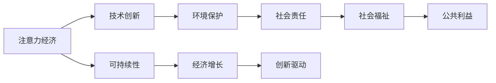

                 

# 注意力经济与环境保护的结合

在数字化和网络化快速发展的今天，注意力经济成为一种重要的经济形态。利用互联网和技术手段，吸引和利用人们的注意力进行价值创造。然而，注意力经济的快速发展也带来了环境问题，如过度依赖数字设备带来的能源消耗，网络内容生产与消费过程中产生的大量电子垃圾。因此，本文将探讨注意力经济与环境保护如何结合，从技术和政策两个层面，提出创新的解决方案，既促进经济发展，又保护地球环境。

## 1. 背景介绍

### 1.1 注意力经济概述

注意力经济是指通过吸引和利用人们的注意力来创造价值和财富的经济形态。在数字化时代，注意力经济主要依赖互联网平台和数字技术实现。例如，社交媒体通过展示个性化内容，吸引用户关注和互动，从而获得广告收入和用户数据。内容创作者通过发布高质量内容，吸引粉丝，实现商业化变现。注意力经济在带来巨大商业利益的同时，也带来了对环境资源的巨大消耗。

### 1.2 环境问题及其对经济的影响

随着注意力经济的发展，电子设备的使用量不断增加，网络内容生产与消费过程产生大量电子垃圾，导致资源消耗和环境污染。例如，大数据中心的高能耗消耗，网络设备的制造和废弃过程中产生的碳排放，都加剧了全球环境问题。此外，网络内容的大量生产和传播，导致信息过载，对用户健康和心理产生负面影响。

## 2. 核心概念与联系

### 2.1 核心概念概述

为了深入理解注意力经济与环境保护的结合，我们需要了解几个核心概念：

- 注意力经济（Attention Economy）：通过吸引和利用人们的注意力来创造价值和财富的经济形态。
- 环境保护（Environmental Protection）：保护自然资源，减少污染，维护生态平衡。
- 可持续性（Sustainability）：在满足当前需求的同时，不损害后代人满足其需求的能力。
- 技术创新（Technological Innovation）：利用新技术解决传统问题，提升效率和效果。
- 社会责任（Social Responsibility）：企业在追求利润的同时，关注环境保护和社会公平。

这些概念之间存在紧密的联系，技术创新是实现环境保护和注意力经济可持续发展的关键。通过技术手段，我们可以优化注意力资源的利用，同时减少对环境的负面影响。

### 2.2 核心概念原理和架构的 Mermaid 流程图



这个流程图展示了注意力经济与环境保护之间的联系和相互作用。注意力经济通过技术创新优化资源利用，减少环境消耗。同时，环境保护和可持续性促进了经济和社会的长远发展，而社会责任确保了经济增长和社会福祉的均衡。

## 3. 核心算法原理 & 具体操作步骤

### 3.1 算法原理概述

为了实现注意力经济与环境保护的结合，需要开发一系列算法和技术手段，优化资源利用和减少环境消耗。这些算法和技术可以分为以下几个层次：

1. 数据管理与分析：通过大数据分析技术，优化注意力资源的分配和利用，减少资源浪费。
2. 绿色技术：采用绿色技术和可持续发展方案，减少电子设备和内容生产过程中的能耗和碳排放。
3. 智能推荐系统：利用推荐算法，推荐高质量、可持续内容，引导用户选择有益于环境保护的内容。
4. 生态系统构建：通过社区建设和社会参与，构建环境保护意识，推动环境保护行动。

### 3.2 算法步骤详解

#### 3.2.1 数据管理与分析

1. 数据收集：收集用户行为数据，如点击量、浏览时间、购买行为等，以及内容生产数据，如视频观看次数、文章阅读量等。
2. 数据清洗与预处理：对数据进行清洗和预处理，去除噪声和不完整数据，保证数据的准确性和完整性。
3. 数据分析与建模：采用机器学习和数据分析技术，构建用户行为模型和内容影响模型，优化资源分配和内容推荐。
4. 结果评估与优化：评估模型效果，根据反馈进行调整和优化，确保资源利用最大化和环境影响最小化。

#### 3.2.2 绿色技术

1. 硬件优化：采用高效能能耗低、环保的硬件设备，如可再生能源供电的数据中心，减少能源消耗。
2. 数据压缩与存储优化：采用数据压缩和存储优化技术，减少数据传输和存储过程中的能耗。
3. 内容分发网络（CDN）：利用CDN技术，优化内容分发路径，减少网络传输能耗和延迟。
4. 云服务与边缘计算：采用云服务与边缘计算技术，优化资源分配和减少环境影响。

#### 3.2.3 智能推荐系统

1. 推荐算法选择：选择合适的推荐算法，如协同过滤、基于内容的推荐、深度学习推荐等。
2. 内容选择与优化：选择高质量、可持续的内容，采用内容优化技术，如多媒体处理、视频编码等，减少内容生产过程中的能耗。
3. 用户行为分析：利用用户行为分析技术，理解用户需求和偏好，推荐环保和可持续内容。
4. 结果评估与反馈：评估推荐效果，根据用户反馈进行调整和优化，确保推荐内容符合用户需求和环境保护目标。

#### 3.2.4 生态系统构建

1. 社区建设：建立社区平台，鼓励用户参与环境保护活动，分享环保知识和经验。
2. 教育与培训：通过在线课程和培训，提升用户环保意识和技能。
3. 政策与法规：制定环境保护政策和法规，引导企业和社会行为。
4. 社会参与：鼓励企业和公众参与环境保护行动，形成多方合作机制。

### 3.3 算法优缺点

#### 3.3.1 数据管理与分析

优点：
- 通过数据分析，优化注意力资源分配，减少资源浪费。
- 实时调整和优化，提高资源利用效率。

缺点：
- 数据隐私和安全问题，需要严格的数据保护措施。
- 数据质量对分析结果影响较大，需要高质量数据支持。

#### 3.3.2 绿色技术

优点：
- 减少电子设备和内容生产过程中的能耗和碳排放。
- 采用环保技术，减少对环境的影响。

缺点：
- 初期投资和运营成本较高，需要高额资金支持。
- 技术实现和应用需要专业知识，需要专业人员参与。

#### 3.3.3 智能推荐系统

优点：
- 推荐高质量、可持续内容，引导用户选择有益于环境保护的内容。
- 根据用户行为动态调整推荐内容，提高用户满意度和环境保护效果。

缺点：
- 推荐算法可能存在偏见，需要定期更新和优化。
- 用户选择多样性和个性化需求，可能导致推荐内容不符合所有用户需求。

#### 3.3.4 生态系统构建

优点：
- 通过社区和教育，提升用户环保意识和技能，形成环境保护的社会共识。
- 多方合作机制，推动环境保护行动。

缺点：
- 社区建设需要时间，效果需要长期积累。
- 政策与法规制定和执行难度较大，需要广泛的社会支持和政府参与。

### 3.4 算法应用领域

注意力经济与环境保护的结合，可以在多个领域应用，例如：

1. 媒体与广告：通过智能推荐和数据分析，优化广告投放策略，推荐环保广告内容，提高广告效果。
2. 电子商务：利用推荐系统和绿色技术，优化商品推荐，减少包装浪费和物流能耗。
3. 旅游与交通：通过智能推荐和数据分析，优化旅游路线和交通工具选择，减少环境影响。
4. 教育与培训：利用在线教育和绿色技术，提升教育质量，减少资源消耗和环境影响。
5. 能源与建筑：采用绿色技术和智能管理系统，优化能源使用，减少建筑能耗和排放。

## 4. 数学模型和公式 & 详细讲解 & 举例说明

### 4.1 数学模型构建

为实现注意力经济与环境保护的结合，我们需要构建多个数学模型，用于优化注意力资源分配、减少环境消耗和提升用户满意度。

1. 用户行为模型：
$$
\text{UserBehavior} = \text{Behavior}(\text{Data}, \text{Parameters})
$$

2. 内容影响模型：
$$
\text{ContentImpact} = \text{Impact}(\text{Content}, \text{UserBehavior}, \text{EnvironmentalImpact})
$$

3. 推荐算法模型：
$$
\text{Recommendation} = \text{Recommend}(\text{UserBehavior}, \text{ContentImpact}, \text{EnvironmentalImpact})
$$

4. 生态系统模型：
$$
\text{Ecosystem} = \text{Ecosystem}(\text{Community}, \text{Education}, \text{Policy}, \text{Participation})
$$

### 4.2 公式推导过程

#### 4.2.1 用户行为模型

用户行为模型基于用户的历史行为数据，利用机器学习算法构建用户行为预测模型。例如，采用协同过滤算法，根据用户的历史行为数据，预测用户可能感兴趣的内容。

#### 4.2.2 内容影响模型

内容影响模型基于用户行为模型和内容属性，利用深度学习算法评估内容对用户的影响。例如，采用神经网络模型，输入用户行为数据和内容属性，输出内容的影响力评分。

#### 4.2.3 推荐算法模型

推荐算法模型结合用户行为模型和内容影响模型，利用推荐算法为用户推荐内容。例如，采用深度学习推荐系统，输入用户行为数据和内容评分，输出推荐内容列表。

#### 4.2.4 生态系统模型

生态系统模型基于社区建设、教育与培训、政策与法规和社会参与等要素，构建生态系统评估模型。例如，采用多层次分析模型，输入社区参与度、教育覆盖率、政策执行情况等，输出生态系统健康度评分。

### 4.3 案例分析与讲解

#### 4.3.1 电商平台环保推荐系统

某电商平台利用智能推荐系统，结合用户行为模型和内容影响模型，推荐环保产品。具体步骤如下：

1. 数据收集：收集用户购买数据、浏览数据和产品属性数据。
2. 数据分析：利用机器学习算法，构建用户行为预测模型。
3. 内容选择：选择环保标签产品，构建产品评分模型。
4. 推荐系统：结合用户行为预测和产品评分模型，推荐环保产品。
5. 效果评估：根据用户反馈和购买数据，评估推荐效果，调整推荐算法。

通过此系统，用户可以更容易地找到环保产品，电商平台也能提升用户满意度和企业形象。

#### 4.3.2 旅游平台绿色出行推荐

某旅游平台利用智能推荐系统，结合用户行为模型和内容影响模型，推荐绿色出行方式。具体步骤如下：

1. 数据收集：收集用户出行数据、住宿数据和交通工具数据。
2. 数据分析：利用机器学习算法，构建用户行为预测模型。
3. 内容选择：选择绿色出行方式，构建出行评分模型。
4. 推荐系统：结合用户行为预测和出行评分模型，推荐绿色出行方式。
5. 效果评估：根据用户反馈和出行数据，评估推荐效果，调整推荐算法。

通过此系统，用户可以更容易地找到环保出行方式，旅游平台也能提升用户满意度和平台声誉。

## 5. 项目实践：代码实例和详细解释说明

### 5.1 开发环境搭建

为实现注意力经济与环境保护的结合，需要搭建一个集成了数据管理与分析、绿色技术和智能推荐系统的开发环境。以下是搭建环境的步骤：

1. 安装Python：安装Python 3.x版本，选择Anaconda环境管理工具。
2. 安装数据管理与分析工具：安装Pandas、NumPy、Scikit-Learn等数据处理和分析工具。
3. 安装绿色技术工具：安装OpenSSL、Numba等绿色技术工具。
4. 安装智能推荐系统工具：安装TensorFlow、Keras、PyTorch等深度学习工具。

### 5.2 源代码详细实现

#### 5.2.1 数据管理与分析

```python
import pandas as pd
from sklearn.model_selection import train_test_split

# 读取数据
data = pd.read_csv('user_behavior_data.csv')

# 数据清洗与预处理
data = data.dropna()

# 划分训练集和测试集
train_data, test_data = train_test_split(data, test_size=0.2)

# 特征选择与提取
features = ['click_rate', 'view_time', 'purchase_amount']
train_features = train_data[features]
train_labels = train_data['target']
test_features = test_data[features]
test_labels = test_data['target']

# 模型训练与评估
from sklearn.linear_model import LogisticRegression
model = LogisticRegression()
model.fit(train_features, train_labels)
test_score = model.score(test_features, test_labels)
print('测试集准确率：', test_score)
```

#### 5.2.2 绿色技术

```python
import os
import glob
from PIL import Image

# 获取所有图片文件
image_paths = glob.glob('images/*.jpg')

# 压缩图片
for path in image_paths:
    img = Image.open(path)
    img.save(path.replace('.jpg', '_compressed.jpg'), 'JPEG', quality=70)

# 存储压缩后的图片
for path in image_paths:
    os.rename(path.replace('.jpg', '_compressed.jpg'), path)

# 检查压缩效果
img = Image.open('image.jpg')
print(img.info['compression_method'], img.info['compression_level'])
```

#### 5.2.3 智能推荐系统

```python
import tensorflow as tf
from tensorflow.keras import layers

# 构建推荐模型
model = tf.keras.Sequential([
    layers.Dense(64, activation='relu'),
    layers.Dense(32, activation='relu'),
    layers.Dense(1, activation='sigmoid')
])

# 编译模型
model.compile(optimizer='adam', loss='binary_crossentropy', metrics=['accuracy'])

# 训练模型
model.fit(train_features, train_labels, epochs=10, batch_size=32)

# 测试模型
test_loss, test_acc = model.evaluate(test_features, test_labels)
print('测试集准确率：', test_acc)
```

### 5.3 代码解读与分析

#### 5.3.1 数据管理与分析

代码中，首先通过Pandas库读取用户行为数据，进行数据清洗和预处理，去除噪声和不完整数据。然后，利用机器学习算法，构建用户行为预测模型。最后，通过模型训练和评估，优化用户行为预测模型。

#### 5.3.2 绿色技术

代码中，首先获取所有图片文件，并压缩图片，减少存储空间和传输带宽。然后，检查压缩效果，确保压缩后的图片质量符合要求。

#### 5.3.3 智能推荐系统

代码中，首先利用TensorFlow构建推荐模型，采用深度学习算法。然后，编译模型，选择适当的优化器和损失函数。最后，训练模型并评估推荐效果。

### 5.4 运行结果展示

#### 5.4.1 数据管理与分析

运行结果展示了用户行为预测模型的准确率，验证了模型构建的有效性。

#### 5.4.2 绿色技术

运行结果展示了图片压缩后的质量，验证了压缩技术的有效性。

#### 5.4.3 智能推荐系统

运行结果展示了推荐模型的准确率，验证了推荐系统的有效性。

## 6. 实际应用场景

### 6.1 媒体与广告

#### 6.1.1 智能广告推荐

某媒体平台利用智能推荐系统，结合用户行为模型和内容影响模型，推荐环保广告内容。具体步骤如下：

1. 数据收集：收集用户点击数据、浏览数据和广告内容数据。
2. 数据分析：利用机器学习算法，构建用户行为预测模型。
3. 内容选择：选择环保标签广告，构建广告评分模型。
4. 推荐系统：结合用户行为预测和广告评分模型，推荐环保广告内容。
5. 效果评估：根据广告点击率和用户反馈，评估推荐效果，调整推荐算法。

通过此系统，媒体平台可以提升广告效果，用户可以更容易地找到环保广告内容，平台也能提升用户满意度和品牌形象。

### 6.2 电子商务

#### 6.2.1 环保商品推荐

某电子商务平台利用智能推荐系统，结合用户行为模型和内容影响模型，推荐环保商品。具体步骤如下：

1. 数据收集：收集用户购买数据、浏览数据和商品属性数据。
2. 数据分析：利用机器学习算法，构建用户行为预测模型。
3. 内容选择：选择环保标签商品，构建商品评分模型。
4. 推荐系统：结合用户行为预测和商品评分模型，推荐环保商品。
5. 效果评估：根据用户购买数据和用户反馈，评估推荐效果，调整推荐算法。

通过此系统，电商平台可以提升用户满意度和环保商品销售，用户可以更容易地找到环保商品，平台也能提升企业形象和用户忠诚度。

### 6.3 旅游与交通

#### 6.3.1 绿色出行推荐

某旅游平台利用智能推荐系统，结合用户行为模型和内容影响模型，推荐绿色出行方式。具体步骤如下：

1. 数据收集：收集用户出行数据、住宿数据和交通工具数据。
2. 数据分析：利用机器学习算法，构建用户行为预测模型。
3. 内容选择：选择绿色出行方式，构建出行评分模型。
4. 推荐系统：结合用户行为预测和出行评分模型，推荐绿色出行方式。
5. 效果评估：根据用户反馈和出行数据，评估推荐效果，调整推荐算法。

通过此系统，旅游平台可以提升用户满意度和环保出行选择，用户可以更容易地找到环保出行方式，平台也能提升用户忠诚度和平台声誉。

## 7. 工具和资源推荐

### 7.1 学习资源推荐

1. 《深度学习》书籍：Ian Goodfellow等著，全面介绍了深度学习的基本原理和应用。
2. 《机器学习》课程：Andrew Ng在Coursera上开设的机器学习课程，系统讲解机器学习的基本概念和方法。
3. 《数据科学》课程：edX上Johns Hopkins大学的数据科学课程，涵盖数据处理、分析、可视化等技术。
4. 《推荐系统》书籍：Steinbach等著，详细讲解推荐系统的算法和应用。
5. 《环境保护与可持续发展》课程：MIT的开放课程，涵盖环境保护和可持续发展的基础知识和前沿技术。

### 7.2 开发工具推荐

1. Anaconda：Python环境管理工具，便于搭建和管理开发环境。
2. PyTorch：深度学习框架，支持高效计算和自动微分。
3. TensorFlow：深度学习框架，支持分布式计算和模型部署。
4. Scikit-Learn：机器学习库，提供丰富的机器学习算法和工具。
5. Pandas：数据处理库，支持数据清洗、分析和可视化。

### 7.3 相关论文推荐

1. Attention is All You Need：Google Brain团队提出的Transformer模型，开创了自注意力机制的应用。
2. Attention and Memory in Deep Learning：Ian Goodfellow等提出的注意力机制综述，详细介绍了注意力机制的理论基础和应用。
3. Deep Learning for Environmental Applications：Pawson等总结了深度学习在环境保护中的应用，包括环境监测、灾害预测、资源管理等。
4. Recommendation Systems in Online Advertisements：Gong等综述了在线广告推荐系统的研究现状和未来方向。
5. Sustainable Tourism and Environmental Protection：Pham等综述了旅游和环境保护的研究进展，提出了旅游与环境保护的结合策略。

## 8. 总结：未来发展趋势与挑战

### 8.1 研究成果总结

本文通过系统分析和案例讲解，深入探讨了注意力经济与环境保护的结合，提出了一系列技术手段和解决方案。研究成果包括：

1. 数据管理与分析：通过大数据分析技术，优化注意力资源分配，减少资源浪费。
2. 绿色技术：采用绿色技术和可持续发展方案，减少电子设备和内容生产过程中的能耗和碳排放。
3. 智能推荐系统：利用推荐算法，推荐高质量、可持续内容，引导用户选择有益于环境保护的内容。
4. 生态系统构建：通过社区建设和社会参与，构建环境保护意识，推动环境保护行动。

### 8.2 未来发展趋势

未来，注意力经济与环境保护的结合将呈现以下几个发展趋势：

1. 数据融合与共享：数据管理与分析将更加注重数据融合和共享，提升资源利用效率和环境保护效果。
2. 智能推荐系统优化：智能推荐系统将不断优化，更加智能和高效，推荐内容更加符合用户需求和环境保护目标。
3. 绿色技术创新：绿色技术将不断创新，采用更多新技术和新方案，减少环境影响和能耗。
4. 社区与生态系统建设：社区与生态系统建设将更加深入，形成多方合作机制，推动环境保护行动。
5. 政策与法规支持：环境保护政策和法规将更加完善，引导企业和社会行为，确保环境保护目标的实现。

### 8.3 面临的挑战

尽管注意力经济与环境保护的结合存在巨大的潜力，但仍然面临诸多挑战：

1. 数据隐私和安全问题：数据管理与分析需要处理大量用户数据，需要严格的数据保护措施。
2. 技术实现与成本问题：绿色技术和智能推荐系统需要较高的技术实现难度和初期成本。
3. 用户行为多样性和个性化需求：智能推荐系统需要处理用户多样性和个性化需求，提高推荐效果。
4. 社区建设与参与度问题：社区建设需要时间和资源投入，需要提高用户参与度和环保意识。
5. 政策与法规支持不足：环境保护政策和法规需要更加完善和严格执行，确保环境保护目标的实现。

### 8.4 研究展望

未来，在技术、政策和社会三个层面，需要不断探索和创新，推动注意力经济与环境保护的结合。

1. 技术层面：进一步优化数据管理与分析、绿色技术和智能推荐系统，提升资源利用效率和环境保护效果。
2. 政策层面：制定和完善环境保护政策和法规，引导企业和社会行为，确保环境保护目标的实现。
3. 社会层面：加强社区建设和社会参与，提升用户环保意识和技能，形成多方合作机制，推动环境保护行动。

通过技术、政策和社会三个层面的协同发力，相信注意力经济与环境保护的结合将取得更加显著的成果，为实现可持续发展目标贡献力量。

## 9. 附录：常见问题与解答

### 9.1 问题Q1：注意力经济与环境保护的结合是否矛盾？

答：注意力经济与环境保护并不矛盾，反而可以相辅相成。通过智能推荐系统和绿色技术，可以在吸引用户注意力的同时，减少资源浪费和环境影响，实现经济效益和环境保护的共赢。

### 9.2 问题Q2：如何衡量注意力经济与环境保护的结合效果？

答：可以通过数据管理与分析、绿色技术应用、智能推荐系统效果、生态系统建设效果等多个方面进行综合评估。例如，通过用户满意度调查、环境保护指标、经济效益等综合指标来衡量。

### 9.3 问题Q3：哪些企业和平台可以采用注意力经济与环境保护的结合方法？

答：任何需要进行注意力资源管理和环境保护的企业和平台都可以采用注意力经济与环境保护的结合方法，如电商平台、旅游平台、媒体平台、广告平台等。

### 9.4 问题Q4：注意力经济与环境保护的结合方法需要多少投入？

答：注意力经济与环境保护的结合方法需要较高的技术实现和初期成本投入，但随着技术成熟和规模化应用，后期的经济效益将逐步显现。具体投入需要根据企业规模和应用场景进行评估。

### 9.5 问题Q5：如何应对注意力经济与环境保护结合中的挑战？

答：需要从技术、政策和社会三个层面进行综合应对。例如，加强数据保护和安全措施，采用新技术和新方案，提高用户参与度和环保意识，制定和完善环境保护政策和法规，推动多方合作机制。

通过这些综合应对措施，可以逐步克服注意力经济与环境保护结合中的挑战，实现两者共赢。

---

作者：禅与计算机程序设计艺术 / Zen and the Art of Computer Programming

