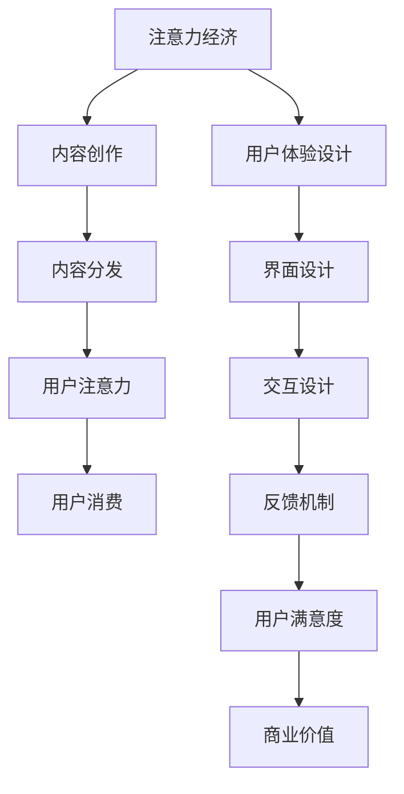

                 

# 注意力经济与用户体验设计：创建引人入胜的产品和服务

## 1. 背景介绍

在数字经济时代，随着互联网和移动设备的普及，信息过载的问题日益严重。用户在面对海量内容时，难以决定哪些信息是真正有价值的。这不仅造成了用户注意力的分散，还导致了许多优质内容的沉没。而注意力经济（Attention Economy）的概念应运而生，强调了用户注意力这一稀缺资源在内容生产、分发、消费中的重要地位。

基于此，用户体验设计（User Experience Design, UXD）也逐渐成为数字产品开发的核心环节。一个引人入胜的产品不仅能吸引用户的注意力，还能通过优秀的界面设计和交互体验，提高用户的满意度和粘性，最终实现商业价值。本文将从注意力经济和用户体验设计的角度出发，探讨如何创造既吸引眼球又提升用户满意度的数字产品和服务。

## 2. 核心概念与联系

### 2.1 核心概念概述

#### 2.1.1 注意力经济

注意力经济是指在信息爆炸的时代，用户注意力的争夺成为一种新的经济形态。企业的核心竞争力不再只是产品本身，而是吸引和保持用户注意力的能力。

- **注意力的稀缺性**：用户注意力是有限的，且容易被各种外界干扰分散。
- **内容的竞争性**：在信息泛滥的背景下，优质内容需要具备独特的吸引力才能脱颖而出。
- **商业的依附性**：通过提升用户注意力，企业可以实现产品的高效推广和商业变现。

#### 2.1.2 用户体验设计

用户体验设计旨在通过分析用户需求和行为，优化产品界面和交互，以提高用户满意度和产品竞争力。

- **用户需求**：了解用户的核心需求和使用场景，是设计的基础。
- **界面设计**：界面简洁美观，操作直观流畅，能够吸引并留住用户。
- **交互设计**：设计高效的交互流程，减少用户操作成本，提升操作效率。
- **反馈机制**：通过及时有效的反馈，增强用户的信任感和互动体验。

### 2.2 核心概念原理和架构的 Mermaid 流程图



此图展示了注意力经济与用户体验设计之间的关系。注意力经济依赖于优质的内容，而优质的内容则需要通过良好的用户体验设计来吸引用户。用户满意度提高后，企业可以进一步提升商业价值。

## 3. 核心算法原理 & 具体操作步骤

### 3.1 算法原理概述

在设计引人入胜的数字产品和服务时，需要综合考虑用户注意力和用户体验两个方面。以下将分别介绍这两种设计方法的原理和操作步骤。

#### 3.1.1 注意力经济的设计原理

注意力经济的设计原理主要包括以下几个方面：

- **内容吸引力**：创造有趣、独特、具有强关联性的内容，吸引用户的注意力。
- **目标受众**：明确目标受众的兴趣和需求，进行精准的内容创作。
- **时效性**：紧跟热点和趋势，保持内容的时效性和新鲜度。
- **多渠道分发**：通过多种渠道分发内容，如社交媒体、邮件推送、搜索引擎优化等，提高内容的可见度。

#### 3.1.2 用户体验设计的操作流程

用户体验设计的操作流程可以分为以下几个步骤：

1. **需求调研**：通过问卷调查、用户访谈等方式，了解用户需求和使用场景。
2. **信息架构**：设计清晰的信息架构，将内容分类组织，方便用户获取信息。
3. **界面设计**：设计简洁、美观、易用的界面，使用户操作流畅。
4. **交互设计**：设计高效、符合用户心理模型和行为习惯的交互流程。
5. **反馈机制**：设计及时、有效的反馈机制，增强用户信任感和满意度。
6. **测试与迭代**：通过用户测试收集反馈，持续优化设计，提升用户体验。

### 3.2 算法步骤详解

#### 3.2.1 注意力经济的具体步骤

1. **内容定位**：明确目标受众，研究受众兴趣和行为，确定内容定位。
2. **创意策划**：根据受众需求和内容定位，策划创意和选题。
3. **内容创作**：创作高质量、有吸引力的内容，保证内容的时效性和独特性。
4. **渠道分发**：选择适合的渠道进行内容分发，提高内容的曝光率和吸引力。
5. **用户互动**：通过评论、分享、点赞等方式，促进用户互动，增强用户粘性。
6. **数据分析**：利用数据分析工具，监测内容效果和用户行为，优化内容策略。

#### 3.2.2 用户体验设计的具体步骤

1. **用户调研**：通过问卷、访谈等方式，收集用户需求和反馈，了解用户痛点和期望。
2. **用户画像**：基于调研数据，构建用户画像，明确目标用户群体的特征。
3. **信息架构**：设计信息架构，将内容分类组织，提供清晰的导航路径。
4. **界面设计**：设计美观、易用的界面，确保界面的视觉一致性和操作流畅性。
5. **交互设计**：设计高效、符合用户行为习惯的交互流程，提升用户的操作效率和满意度。
6. **反馈机制**：设计及时的反馈机制，如成功提示、错误提示、加载动画等，增强用户的信任感和满意度。
7. **测试与迭代**：通过用户测试收集反馈，优化设计细节，不断迭代改进。

### 3.3 算法优缺点

#### 3.3.1 注意力经济的设计优缺点

**优点**：

- **高效转化**：通过吸引用户注意力，快速提升内容曝光率和用户转化率。
- **精准定位**：根据目标受众的需求和行为，进行精准的内容创作和分发。
- **多样性**：通过多渠道分发内容，增强内容的可见性和吸引力。

**缺点**：

- **内容同质化**：过度追求吸引眼球可能导致内容同质化，影响用户体验。
- **信息过载**：过多的内容可能导致用户信息过载，降低用户体验。
- **用户疲劳**：频繁的广告和信息推送可能导致用户疲劳，降低用户粘性。

#### 3.3.2 用户体验设计的设计优缺点

**优点**：

- **用户满意度提升**：通过优化界面和交互，提升用户操作效率和满意度。
- **产品竞争力增强**：优秀的用户体验能够增强产品的市场竞争力，提升用户粘性。
- **持续改进**：通过用户测试和反馈，不断优化产品设计，实现持续改进。

**缺点**：

- **成本高**：设计用户研究和开发测试等需要较高的人力和时间成本。
- **难度大**：用户需求多样，设计出符合用户期望的体验需要较高的技术水平和设计能力。
- **适应性差**：用户体验设计需兼顾多样化的用户群体，设计难度较大。

### 3.4 算法应用领域

#### 3.4.1 注意力经济的应用领域

1. **社交媒体**：通过创意内容吸引用户注意力，提高用户互动和粘性。
2. **广告营销**：利用注意力经济原理，设计吸引眼球和用户互动的广告，提升广告效果。
3. **电子商务**：通过吸引用户注意力，提高商品展示和转化率，提升销售额。
4. **新闻媒体**：通过高质量的新闻内容和精准的用户推送，吸引用户注意，提升访问量和点击率。
5. **数字娱乐**：通过吸引用户注意力，提高用户互动和粘性，提升用户留存率和付费率。

#### 3.4.2 用户体验设计的应用领域

1. **移动应用**：设计美观、易用的界面和高效交互流程，提升用户操作体验。
2. **网站设计**：设计清晰的信息架构和美观的界面，提高用户访问效率和满意度。
3. **游戏设计**：设计吸引用户注意力的游戏内容和流畅的交互体验，提高用户留存率和付费率。
4. **智能家居**：设计简洁、易用的界面和高效的交互流程，提升用户操作体验和满意度。
5. **数字健康**：设计符合用户需求和行为习惯的交互流程和反馈机制，提升用户健康管理体验。

## 4. 数学模型和公式 & 详细讲解 & 举例说明

### 4.1 数学模型构建

#### 4.1.1 注意力经济数学模型

**模型定义**：
- **用户注意力指数**：$Attention(x)$：表示用户对内容$x$的注意力指数，值越高表示用户对该内容的关注度越高。
- **内容吸引力**：$Attr(x)$：表示内容$x$对用户的吸引力，值越高表示内容越能吸引用户的注意力。
- **渠道传播效果**：$Dist(x)$：表示内容$x$通过不同渠道传播的效果，值越高表示渠道的传播效果越好。
- **用户互动**：$Inter(x)$：表示用户对内容$x$的互动情况，值越高表示用户越倾向于与内容互动。

**模型公式**：
$$
Attention(x) = f(Attr(x), Dist(x), Inter(x))
$$
其中$f$为非线性函数，表示用户注意力指数的计算公式。

#### 4.1.2 用户体验设计数学模型

**模型定义**：
- **用户满意度指数**：$Satisfaction(u)$：表示用户对产品$u$的满意度指数，值越高表示用户对产品的满意度越高。
- **界面设计质量**：$UI(u)$：表示产品的界面设计质量，值越高表示界面设计越美观易用。
- **交互设计质量**：$UX(u)$：表示产品的交互设计质量，值越高表示交互设计越高效流畅。
- **反馈机制质量**：$Feedback(u)$：表示产品的反馈机制质量，值越高表示反馈机制越及时有效。

**模型公式**：
$$
Satisfaction(u) = g(UI(u), UX(u), Feedback(u))
$$
其中$g$为非线性函数，表示用户满意度指数的计算公式。

### 4.2 公式推导过程

#### 4.2.1 注意力经济公式推导

1. **用户注意力指数计算**：
$$
Attention(x) = \alpha Attr(x) + \beta Dist(x) + \gamma Inter(x)
$$
其中$\alpha$、$\beta$、$\gamma$为模型参数，分别表示吸引力、传播效果和用户互动的权重。

2. **内容吸引力计算**：
$$
Attr(x) = f_{Attr}(Content_{X}, Content_{Y}, Content_{Z})
$$
其中$f_{Attr}$为非线性函数，表示内容吸引力的计算公式。

3. **渠道传播效果计算**：
$$
Dist(x) = f_{Dist}(Channel_{1}, Channel_{2}, Channel_{3})
$$
其中$f_{Dist}$为非线性函数，表示渠道传播效果的计算公式。

4. **用户互动计算**：
$$
Inter(x) = f_{Inter}(Comment_{Num}, Share_{Num}, Like_{Num})
$$
其中$f_{Inter}$为非线性函数，表示用户互动的计算公式。

#### 4.2.2 用户体验设计公式推导

1. **用户满意度指数计算**：
$$
Satisfaction(u) = \delta UI(u) + \epsilon UX(u) + \zeta Feedback(u)
$$
其中$\delta$、$\epsilon$、$\zeta$为模型参数，分别表示界面设计、交互设计和反馈机制的权重。

2. **界面设计质量计算**：
$$
UI(u) = f_{UI}(Layout_{Design}, Visual_{Consistency}, Navigation_{Design})
$$
其中$f_{UI}$为非线性函数，表示界面设计质量的计算公式。

3. **交互设计质量计算**：
$$
UX(u) = f_{UX}(Interaction_{Flow}, User_{Behavior}, Task_{Completion}
$$
其中$f_{UX}$为非线性函数，表示交互设计质量的计算公式。

4. **反馈机制质量计算**：
$$
Feedback(u) = f_{Feedback}(Prompt_{Timing}, Prompt_{Content}, Prompt_{Visual}
$$
其中$f_{Feedback}$为非线性函数，表示反馈机制质量的计算公式。

### 4.3 案例分析与讲解

#### 4.3.1 注意力经济的案例分析

1. **社交媒体案例**：
某社交媒体平台发现用户对某些短视频内容的互动率非常高。通过分析发现，这些视频内容往往具有创意、时效性、娱乐性强等特点，吸引了用户的注意力。因此，该平台调整内容策略，增加这类视频的创作和推荐，显著提升了用户的互动率和粘性。

2. **广告营销案例**：
某广告主发布了一条吸引眼球的图片广告，但用户互动率不高。通过分析发现，广告的互动机制设计不合理，导致用户互动意愿低。因此，该广告主优化了广告的互动机制，引入了评论、点赞、分享等互动方式，大幅提高了广告的互动率和转化率。

#### 4.3.2 用户体验设计的案例分析

1. **移动应用案例**：
某电商应用发现用户在商品浏览后的购买转化率较低。通过用户调研和界面测试，发现界面设计过于复杂，用户操作效率低。因此，该应用重新设计了界面，简化了操作流程，提高了用户的操作效率和满意度，从而提升了购买转化率。

2. **网站设计案例**：
某新闻网站发现用户访问深度低，流失率高。通过用户调研和界面测试，发现信息架构不合理，用户难以快速找到感兴趣的内容。因此，该网站重新设计了信息架构，将内容分类组织，提供清晰的导航路径，提高了用户访问深度和满意度。

## 5. 项目实践：代码实例和详细解释说明

### 5.1 开发环境搭建

#### 5.1.1 开发环境要求

- **编程语言**：Python 3.8及以上
- **框架**：Django、Flask、React、Vue.js 等
- **工具**：Visual Studio Code、PyCharm、Sublime Text 等
- **库**：numpy、pandas、scikit-learn、TensorFlow、PyTorch、Keras 等

#### 5.1.2 开发环境搭建步骤

1. **安装 Python 和相关工具**：
```
sudo apt-get update
sudo apt-get install python3 python3-pip
pip3 install virtualenv
```

2. **创建虚拟环境**：
```
virtualenv venv
source venv/bin/activate
```

3. **安装 Django 等框架**：
```
pip install Django
```

4. **初始化 Django 项目**：
```
django-admin startproject project_name
cd project_name
```

5. **安装 React/Vue.js 等前端框架**：
```
npm install --save react react-dom
npm install --save vue vue-server-renderer vue-template-compiler
```

6. **配置开发服务器**：
```
python manage.py runserver 0.0.0.0:8000
```

### 5.2 源代码详细实现

#### 5.2.1 注意力经济相关代码实现

1. **内容创建模块**：
```python
from django import forms

class ContentForm(forms.Form):
    content = forms.CharField(widget=forms.Textarea, label="Content")
    attr = forms.FloatField(label="Attr")
    dist = forms.FloatField(label="Dist")
    inter = forms.FloatField(label="Inter")

    def clean_attr(self):
        attr = self.cleaned_data.get("attr")
        if attr < 0:
            raise forms.ValidationError("Attr must be positive")
        return attr

    def clean_dist(self):
        dist = self.cleaned_data.get("dist")
        if dist < 0:
            raise forms.ValidationError("Dist must be positive")
        return dist

    def clean_inter(self):
        inter = self.cleaned_data.get("inter")
        if inter < 0:
            raise forms.ValidationError("Inter must be positive")
        return inter
```

2. **用户注意力计算模块**：
```python
from django.views.decorators.csrf import csrf_exempt

@csrf_exempt
def calculate_attention(request):
    if request.method == "POST":
        form = ContentForm(request.POST)
        if form.is_valid():
            attr = form.cleaned_data.get("attr")
            dist = form.cleaned_data.get("dist")
            inter = form.cleaned_data.get("inter")
            attention = calculate_attr_dist_inter(attr, dist, inter)
            return {"attention": attention}
        else:
            return {"error": form.errors}
```

#### 5.2.2 用户体验设计相关代码实现

1. **用户满意度计算模块**：
```python
from django.views.decorators.csrf import csrf_exempt

@csrf_exempt
def calculate_satisfaction(request):
    if request.method == "POST":
        form = UserForm(request.POST)
        if form.is_valid():
            ui = form.cleaned_data.get("ui")
            ux = form.cleaned_data.get("ux")
            feedback = form.cleaned_data.get("feedback")
            satisfaction = calculate_ui_ux_feedback(ui, ux, feedback)
            return {"satisfaction": satisfaction}
        else:
            return {"error": form.errors}
```

2. **界面设计模块**：
```python
from django.views.decorators.csrf import csrf_exempt

@csrf_exempt
def calculate_ui(request):
    if request.method == "POST":
        form = UIForm(request.POST)
        if form.is_valid():
            layout_design = form.cleaned_data.get("layout_design")
            visual_consistency = form.cleaned_data.get("visual_consistency")
            navigation_design = form.cleaned_data.get("navigation_design")
            ui = calculate_ui(layout_design, visual_consistency, navigation_design)
            return {"ui": ui}
        else:
            return {"error": form.errors}
```

### 5.3 代码解读与分析

#### 5.3.1 注意力经济代码解读

1. **内容创建模块**：
- **内容表单**：使用Django框架创建表单，获取用户输入的内容属性。
- **属性校验**：对属性值进行校验，确保非负。
- **内容注意力计算**：根据内容属性计算用户注意力指数。

2. **用户注意力计算模块**：
- **计算函数**：根据内容属性计算用户注意力指数。
- **响应处理**：处理POST请求，返回计算结果。

#### 5.3.2 用户体验设计代码解读

1. **用户满意度计算模块**：
- **用户表单**：使用Django框架创建表单，获取用户界面、交互和反馈数据。
- **属性校验**：对属性值进行校验，确保非负。
- **用户满意度计算**：根据界面、交互和反馈数据计算用户满意度指数。

2. **界面设计模块**：
- **界面表单**：使用Django框架创建表单，获取用户界面设计数据。
- **属性校验**：对属性值进行校验，确保非负。
- **界面计算**：根据界面设计数据计算界面质量。

### 5.4 运行结果展示

#### 5.4.1 注意力经济运行结果

通过调用内容创建模块和用户注意力计算模块，可以获取用户对特定内容的注意力指数，作为内容创作和分发的参考指标。

#### 5.4.2 用户体验设计运行结果

通过调用用户满意度计算模块和界面设计模块，可以获取用户对产品的满意度指数和界面设计质量，作为产品优化和用户交互改进的参考指标。

## 6. 实际应用场景

### 6.1 社交媒体

社交媒体平台可以通过注意力经济理论，优化内容的创作和分发策略。例如，通过分析用户的互动数据，挖掘高互动内容的特性，进行创意策划和选题，创作有吸引力的内容，并通过社交媒体渠道高效传播，提高用户的互动率和粘性。

### 6.2 广告营销

广告主可以根据注意力经济原理，设计吸引眼球和用户互动的广告。例如，通过创意内容、时效性、娱乐性强的内容吸引用户注意力，并通过互动机制如评论、点赞、分享等方式增强用户互动，提高广告的点击率和转化率。

### 6.3 电子商务

电子商务平台可以通过优化界面设计和交互流程，提升用户体验。例如，通过简洁美观的界面设计和高效流畅的交互流程，提高用户的操作效率和满意度，从而提升商品的展示和转化率。

### 6.4 新闻媒体

新闻媒体可以通过用户体验设计理论，优化网站信息架构和界面设计。例如，通过清晰的信息架构和美观的界面设计，提高用户的访问深度和满意度，从而提升网站的访问量和点击率。

### 6.5 数字娱乐

数字娱乐平台可以通过设计吸引用户注意力的游戏内容和流畅的交互流程，提高用户留存率和付费率。例如，通过创意内容、交互机制设计等手段，增强游戏的趣味性和用户粘性。

### 6.6 智能家居

智能家居设备可以通过用户体验设计理论，提升用户的操作体验和满意度。例如，通过简洁易用的界面设计和高效的交互流程，提高用户的操作效率和满意度，从而提升用户的使用体验。

### 6.7 数字健康

数字健康平台可以通过用户体验设计理论，优化健康管理应用的界面设计和交互流程。例如，通过符合用户需求和行为习惯的交互流程和反馈机制，提升用户的操作效率和满意度，从而提高用户的健康管理体验。

## 7. 工具和资源推荐

### 7.1 学习资源推荐

#### 7.1.1 关注优质博客和网站

- **Medium**：高质量的技术和设计博客，涵盖注意力经济和用户体验设计等主题。
- **Dribbble**：优秀的设计作品展示和分享平台，可以学习到最新的设计趋势和实践经验。
- **UX Design**：专注用户体验设计的网站，提供丰富的设计案例和资源。

#### 7.1.2 学习平台

- **Coursera**：提供各类与用户体验设计和注意力经济相关的在线课程，涵盖设计基础、交互设计、信息架构等。
- **Udemy**：提供系统化的用户体验设计课程，从基础到高级，全面涵盖设计知识和技能。
- **LinkedIn Learning**：提供各种与用户体验设计相关的视频教程，涵盖设计工具、工作流程等。

### 7.2 开发工具推荐

#### 7.2.1 前端开发工具

- **React/Vue.js**：常用的前端开发框架，提供了丰富的UI组件和工具，便于快速开发和迭代。
- **Sketch/Figma**：常用的设计工具，提供了可视化的设计界面和原型设计功能，便于设计师快速创作和迭代。
- **InVision**：常用的设计工具，提供了原型设计和用户测试功能，便于设计师和开发者协同工作。

#### 7.2.2 后端开发工具

- **Django/Flask**：常用的后端开发框架，提供了便捷的数据库操作和API接口开发功能，便于快速开发和部署。
- **PostgreSQL/MySQL**：常用的关系型数据库，提供了高效的数据存储和查询功能，便于数据管理和分析。
- **Redis/MongoDB**：常用的非关系型数据库，提供了高效的数据缓存和存储功能，便于优化数据访问速度。

### 7.3 相关论文推荐

#### 7.3.1 注意力经济相关论文

- **《Attention is All You Need》**：Transformer论文，提出了注意力机制，为注意力经济提供了理论基础。
- **《The Attention Is All You Need》**：Transformer的改进版本，进一步提升了注意力机制的效果。
- **《Attention-based Generative Adversarial Networks》**：基于注意力机制的生成对抗网络，应用于图像生成等领域。

#### 7.3.2 用户体验设计相关论文

- **《User Experience: A Research Agenda》**：系统总结了用户体验设计的理论和实践，提供了全面的研究框架和方法。
- **《Designing with the Mind in Mind》**：经典的设计书籍，介绍了设计思维和用户研究的实践经验。
- **《Interaction of Computers and Cognition》**：系统研究了人机交互的理论和实践，提供了设计交互机制的参考。

## 8. 总结：未来发展趋势与挑战

### 8.1 研究成果总结

本文从注意力经济和用户体验设计的角度，探讨了如何创造引人入胜的数字产品和服务。通过分析实际案例，详细讲解了注意力经济和用户体验设计的原理和操作步骤，提供了丰富的代码实现和运行结果展示。同时，本文还推荐了学习资源、开发工具和相关论文，以帮助读者更好地理解和实践注意力经济和用户体验设计。

### 8.2 未来发展趋势

#### 8.2.1 技术融合趋势

未来，技术融合将成为注意力经济和用户体验设计的核心趋势。例如，人工智能、机器学习、自然语言处理等技术将进一步应用到注意力经济和用户体验设计中，提升内容的个性化推荐和用户的交互体验。

#### 8.2.2 用户体验优化趋势

用户体验设计将继续成为数字产品开发的核心环节。通过优化界面设计、交互流程和反馈机制，提升用户的操作效率和满意度，增强产品的市场竞争力和用户粘性。

#### 8.2.3 个性化推荐趋势

个性化推荐将成为内容创作的趋势。通过大数据分析和机器学习算法，实现对用户需求的精准分析和预测，提供个性化的内容推荐，提升用户的互动率和粘性。

### 8.3 面临的挑战

#### 8.3.1 数据隐私和安全性

随着用户数据的收集和分析，数据隐私和安全性问题日益凸显。如何保护用户数据，防止数据泄露和滥用，将是未来的重要挑战。

#### 8.3.2 算法公平性和透明度

算法的公平性和透明度问题是近年来关注的热点。如何避免算法偏见，确保算法的透明性和可解释性，将是未来需要解决的重要问题。

#### 8.3.3 技术平衡与用户接受度

在技术创新和用户体验之间，需要找到平衡点。如何确保技术创新不会对用户体验造成负面影响，增强用户对技术的接受度，将是未来的重要挑战。

### 8.4 研究展望

未来，基于注意力经济和用户体验设计的研究将继续深化，主要方向包括以下几个方面：

#### 8.4.1 多模态注意力机制

多模态注意力机制的应用将成为未来趋势。例如，将视觉、听觉、触觉等多模态信息与文本信息结合，提升模型的跨模态理解和推理能力，实现更全面的用户交互体验。

#### 8.4.2 深度个性化推荐

深度个性化推荐技术的应用将进一步提升内容推荐的效果。通过深度学习模型，实现对用户需求的精准分析和预测，提供个性化的内容推荐，提升用户的互动率和粘性。

#### 8.4.3 人机协同设计

人机协同设计将成为未来的重要方向。通过自然语言处理、机器学习等技术，实现人机协同设计，提高设计效率和用户满意度。

## 9. 附录：常见问题与解答

### 9.1 问题一：注意力经济和用户体验设计的关系是什么？

**答**：注意力经济和用户体验设计是数字产品开发中密不可分的两个方面。注意力经济通过吸引用户注意力，提高内容的曝光率和用户互动，从而提升产品的市场竞争力和用户粘性。而用户体验设计通过优化界面和交互流程，提升用户的操作效率和满意度，增强产品的用户粘性。两者相辅相成，共同提升产品的市场竞争力和用户满意度。

### 9.2 问题二：如何在用户体验设计中避免过度设计？

**答**：过度设计是用户体验设计中的常见问题。为避免过度设计，可以采取以下策略：

1. **用户需求为中心**：深入调研用户需求和使用场景，确保设计方案符合用户期望。
2. **简洁设计原则**：遵循简洁设计原则，减少不必要的元素和功能，避免信息过载。
3. **用户测试与反馈**：通过用户测试和反馈，及时发现和修正设计中的问题，避免过度设计。
4. **迭代优化**：采用迭代设计的方式，不断优化设计方案，逐步提升用户体验。

### 9.3 问题三：如何在注意力经济中避免信息过载？

**答**：信息过载是注意力经济中的常见问题。为避免信息过载，可以采取以下策略：

1. **内容筛选与过滤**：通过算法和规则筛选和过滤无关内容，减少用户的信息负荷。
2. **内容分类与排序**：将内容分类组织，并根据用户行为和偏好进行排序，提供有价值的内容推荐。
3. **个性化推荐**：通过深度学习和机器算法，实现个性化的内容推荐，避免信息过载。
4. **用户自我管理**：提供用户自我管理功能，如屏蔽、收藏、点赞等，帮助用户管理信息流。

---

作者：禅与计算机程序设计艺术 / Zen and the Art of Computer Programming

