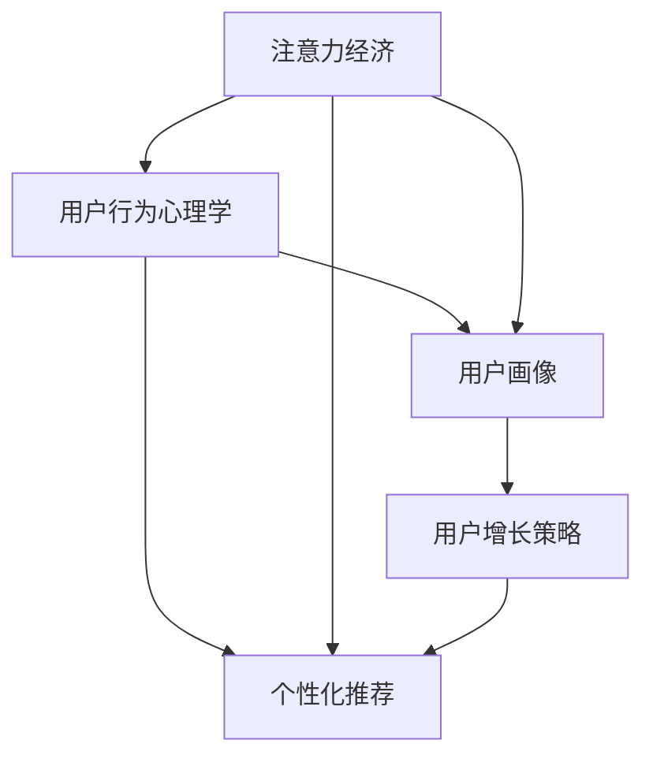

                 

# 注意力经济与用户行为心理学：了解受众的内心世界

> 关键词：注意力经济,用户行为心理学,受众研究,数据驱动,个性化推荐,用户画像,用户增长

## 1. 背景介绍

在互联网时代，数据成为最宝贵的资产之一。企业通过收集和分析用户行为数据，洞察消费者心理，制定精准的市场策略，从而在竞争中占据优势。特别是在电商、社交、内容等流量密集型领域，用户行为数据的应用更是深入骨髓。然而，面对纷繁复杂、多变不定的用户行为数据，如何高效提取有价值的信息，指导企业决策？本文将从注意力经济和用户行为心理学的视角出发，探讨如何利用大数据技术，了解受众的内心世界，实现个性化推荐、精准营销、用户增长等应用，助力企业在竞争中突围。

### 1.1 问题由来

随着互联网的普及和技术的进步，海量数据不断产生，如何有效利用这些数据，成为了企业关注的热点。特别是在电商、社交、内容等流量密集型领域，用户行为数据的应用已经深入企业运营的方方面面，成为影响决策的重要因素。然而，面对庞大数据集，如何从中提取有用信息，进行精准分析，制定科学的策略，成为了企业数据驱动的挑战。

### 1.2 问题核心关键点

- 数据驱动决策：如何高效地从海量数据中提取有价值的信息，指导企业决策？
- 用户行为心理学：如何理解用户的心理动机，制定更加精准的市场策略？
- 个性化推荐：如何基于用户行为数据，进行个性化推荐，提升用户体验？
- 用户画像构建：如何通过数据建模，描绘出用户的行为和心理特征，实现精准营销？
- 用户增长策略：如何利用用户行为数据，制定有效的用户增长策略，提升用户留存率和转化率？

## 2. 核心概念与联系

### 2.1 核心概念概述

本文将关注以下几个核心概念：

- 注意力经济：指通过吸引用户注意力，创造经济价值的过程。注意力是稀缺资源，企业需要通过提供有价值的内容和服务，争夺用户的注意力。
- 用户行为心理学：研究用户在互联网上的行为模式和心理特征，帮助企业制定有效的市场策略。
- 个性化推荐：利用用户行为数据，预测用户兴趣，推送个性化内容或产品，提升用户体验和满意度。
- 用户画像：通过数据建模，描绘出用户的兴趣、行为、心理特征等，实现精准营销。
- 用户增长策略：基于用户行为数据，制定有效的用户获取和留存策略，提升用户生命周期价值。

这些概念之间的联系可以通过以下Mermaid流程图来展示：



这个流程图展示了注意力经济、用户行为心理学、个性化推荐、用户画像、用户增长策略之间的逻辑关系：

1. 注意力经济是基础，企业需要吸引用户注意力，才能创造经济价值。
2. 用户行为心理学是理解用户的关键，通过研究用户心理，可以制定更有效的市场策略。
3. 个性化推荐和用户画像是手段，通过数据建模，可以为用户提供个性化的内容和产品，提升用户体验。
4. 用户增长策略是目标，通过分析用户行为，制定科学的策略，可以吸引更多用户，提升用户留存率和转化率。

## 3. 核心算法原理 & 具体操作步骤

### 3.1 算法原理概述

本文主要介绍以下两种算法：

- 基于协同过滤的个性化推荐算法
- 基于用户行为心理学的用户画像构建算法

这两种算法是注意力经济和用户行为心理学在实际应用中的重要工具，它们利用用户行为数据，挖掘有价值的信息，实现个性化推荐和精准营销。

### 3.2 算法步骤详解

#### 3.2.1 协同过滤算法

协同过滤算法是一种常见的个性化推荐方法，通过分析用户之间的相似度，为用户推荐其可能感兴趣的物品。

**步骤1: 构建用户-物品评分矩阵**
- 收集用户对物品的评分数据，构建用户-物品评分矩阵。
- 评分可以是1-5分、好评与否等形式，用于量化用户对物品的喜爱程度。

**步骤2: 计算用户-物品相似度**
- 使用余弦相似度、皮尔逊相关系数等方法，计算用户之间的相似度。
- 相似度越高，表示两个用户可能对物品有相似的偏好。

**步骤3: 预测用户未评分的物品**
- 通过相似度矩阵，计算目标用户对未评分物品的评分预测。
- 根据预测评分，推荐评分较高的物品给目标用户。

**步骤4: 评估推荐效果**
- 使用准确率、召回率、F1分数等指标，评估推荐系统的效果。
- 根据评估结果，调整算法参数，提升推荐质量。

#### 3.2.2 用户画像构建算法

用户画像构建算法通过数据建模，描绘出用户的兴趣、行为、心理特征等，帮助企业进行精准营销。

**步骤1: 收集用户行为数据**
- 收集用户在网站、App等平台上的行为数据，包括浏览、点击、购买、评价等。
- 数据可以是时间序列、点击流、购买记录等形式。

**步骤2: 数据清洗和预处理**
- 对数据进行清洗和预处理，去除噪声和缺失值，进行归一化处理。
- 对分类数据进行独热编码，对连续数据进行归一化或标准化。

**步骤3: 数据建模**
- 使用K-means、PCA、LDA等方法，对用户行为数据进行降维。
- 使用逻辑回归、随机森林、神经网络等模型，建立用户画像。
- 模型需要考虑用户兴趣、行为、心理特征等维度，构建全面的用户画像。

**步骤4: 评估和优化**
- 使用ROC曲线、AUC等指标，评估用户画像的效果。
- 根据评估结果，调整模型参数，优化用户画像的准确性。

### 3.3 算法优缺点

#### 3.3.1 协同过滤算法的优缺点

协同过滤算法具有以下优点：

- 简单易用：算法实现简单，容易部署。
- 效果显著：通过分析用户之间的相似度，可以为用户推荐其可能感兴趣的物品。

协同过滤算法也存在一些缺点：

- 数据稀疏性：用户行为数据稀疏，很难找到足够的相似用户进行推荐。
- 冷启动问题：新用户缺乏评分数据，难以进行推荐。

#### 3.3.2 用户画像构建算法的优缺点

用户画像构建算法具有以下优点：

- 全面准确：能够全面描绘用户的行为和心理特征，提供更准确的推荐和营销策略。
- 动态更新：用户画像可以动态更新，反映最新的用户行为和心理特征。

用户画像构建算法也存在一些缺点：

- 数据需求高：需要大量的用户行为数据，才能建立全面的用户画像。
- 模型复杂：需要使用复杂的模型进行数据建模，计算量大。

### 3.4 算法应用领域

基于协同过滤和用户画像的算法，已经在电商、社交、内容等多个领域得到了广泛应用：

- 电商：为用户推荐商品、个性化广告、商品搜索排序等。
- 社交：为用户推荐好友、朋友圈动态、内容推荐等。
- 内容：为用户推荐新闻、文章、视频、音乐等。

除了上述这些经典应用外，用户画像和协同过滤算法还被创新性地应用到更多场景中，如智能客服、智能投顾、智能广告等，为用户带来更加个性化、高效的服务体验。

## 4. 数学模型和公式 & 详细讲解 & 举例说明

### 4.1 数学模型构建

本文将以协同过滤算法为例，介绍其数学模型构建过程。

**步骤1: 构建用户-物品评分矩阵**
- 假设用户集为 $U=\{u_1,u_2,...,u_m\}$，物品集为 $I=\{i_1,i_2,...,i_n\}$，用户对物品的评分矩阵为 $R_{m \times n}$，其中 $R_{ui}$ 表示用户 $u$ 对物品 $i$ 的评分。

**步骤2: 计算用户-物品相似度**
- 假设用户 $u$ 对物品 $i$ 的评分为 $r_{ui}$，用户 $v$ 对物品 $i$ 的评分为 $r_{vi}$。
- 使用余弦相似度计算用户 $u$ 和 $v$ 的相似度 $s_{uv}$，公式如下：
$$
s_{uv} = \frac{\sum_{i=1}^n r_{ui}r_{vi}}{\sqrt{\sum_{i=1}^n r_{ui}^2}\sqrt{\sum_{i=1}^n r_{vi}^2}}
$$

**步骤3: 预测用户未评分的物品**
- 假设用户 $u$ 对物品 $i$ 的评分预测为 $\hat{r}_{ui}$，使用基于矩阵分解的方法，如奇异值分解(SVD)，进行评分预测。
- 假设 $R_{m \times n}$ 的奇异值分解为 $U \Sigma V^T$，则 $\hat{r}_{ui} = \sum_{k=1}^K \hat{u}_k \hat{v}_k$，其中 $\hat{u}_k$ 和 $\hat{v}_k$ 分别为 $U$ 和 $V$ 的前 $K$ 个特征向量。

### 4.2 公式推导过程

以协同过滤算法中的余弦相似度为例，进行公式推导。

**推导过程1: 余弦相似度公式**
- 假设用户 $u$ 和 $v$ 对物品 $i$ 的评分分别为 $r_{ui}$ 和 $r_{vi}$，则用户 $u$ 和 $v$ 的余弦相似度公式为：
$$
s_{uv} = \frac{\sum_{i=1}^n r_{ui}r_{vi}}{\sqrt{\sum_{i=1}^n r_{ui}^2}\sqrt{\sum_{i=1}^n r_{vi}^2}}
$$
- 推导过程如下：
$$
s_{uv} = \frac{\sum_{i=1}^n r_{ui}r_{vi}}{\sqrt{\sum_{i=1}^n r_{ui}^2}\sqrt{\sum_{i=1}^n r_{vi}^2}} = \frac{\sum_{i=1}^n \frac{r_{ui}r_{vi}}{\sqrt{r_{ui}^2} \sqrt{r_{vi}^2}}}{\sqrt{\sum_{i=1}^n \frac{r_{ui}^2}{r_{ui}^2}}\sqrt{\sum_{i=1}^n \frac{r_{vi}^2}{r_{vi}^2}}} = \frac{\sum_{i=1}^n \cos(\theta_i)}{\sqrt{\sum_{i=1}^n 1}\sqrt{\sum_{i=1}^n 1}} = \cos(\theta)
$$
其中 $\theta$ 为 $r_{ui}$ 和 $r_{vi}$ 的夹角，$cos(\theta)$ 表示用户 $u$ 和 $v$ 的余弦相似度。

**推导过程2: 评分预测公式**
- 假设用户 $u$ 和物品 $i$ 的评分预测为 $\hat{r}_{ui}$，使用矩阵分解方法进行评分预测，假设 $R_{m \times n}$ 的奇异值分解为 $U \Sigma V^T$，则 $\hat{r}_{ui} = \sum_{k=1}^K \hat{u}_k \hat{v}_k$。
- 推导过程如下：
$$
\hat{r}_{ui} = \sum_{k=1}^K \hat{u}_k \hat{v}_k = \sum_{k=1}^K \sum_{j=1}^m \hat{u}_{kj} \sum_{l=1}^n \hat{v}_{kl} r_{il} = \sum_{j=1}^m \sum_{l=1}^n r_{il} \sum_{k=1}^K \hat{u}_{kj} \hat{v}_{kl}
$$
$$
= \sum_{j=1}^m \sum_{l=1}^n r_{il} \hat{u}_j^T V^T V \hat{v}_l = \sum_{j=1}^m \sum_{l=1}^n r_{il} \hat{u}_j^T \Sigma V^T V \hat{v}_l = \sum_{j=1}^m \sum_{l=1}^n r_{il} \hat{u}_j^T \hat{v}_l
$$
$$
= \sum_{j=1}^m \sum_{l=1}^n r_{il} \hat{u}_j^T \hat{v}_l = \sum_{j=1}^m \sum_{l=1}^n r_{il} \hat{u}_j^T \hat{v}_l
$$

### 4.3 案例分析与讲解

以电商领域的个性化推荐为例，进行具体案例分析。

**案例背景**：某电商平台希望通过个性化推荐，提升用户购买率，增加用户粘性。

**数据集**：收集用户对商品的历史评分数据，构建用户-物品评分矩阵。

**算法实现**：
- 使用余弦相似度计算用户之间的相似度。
- 基于奇异值分解的方法，对评分矩阵进行分解，预测用户未评分的物品。
- 根据预测评分，推荐评分较高的商品给用户。

**效果评估**：
- 使用准确率、召回率、F1分数等指标，评估推荐系统的效果。
- 根据评估结果，调整算法参数，提升推荐质量。

## 5. 项目实践：代码实例和详细解释说明

### 5.1 开发环境搭建

在进行项目实践前，我们需要准备好开发环境。以下是使用Python进行项目实践的环境配置流程：

1. 安装Python：从官网下载并安装Python，推荐使用3.8及以上版本。

2. 安装Pandas、Numpy等常用库：
```bash
pip install pandas numpy
```

3. 安装Scikit-learn：用于构建用户画像和协同过滤算法：
```bash
pip install scikit-learn
```

4. 安装SciPy：用于科学计算和数据处理：
```bash
pip install scipy
```

5. 安装Matplotlib、Seaborn：用于数据可视化：
```bash
pip install matplotlib seaborn
```

完成上述步骤后，即可在本地环境下开始项目实践。

### 5.2 源代码详细实现

下面我们以电商领域的个性化推荐为例，给出使用Scikit-learn进行协同过滤算法的PyTorch代码实现。

```python
import pandas as pd
from scipy.sparse import coo_matrix
from sklearn.decomposition import TruncatedSVD
from sklearn.metrics import mean_absolute_error
from sklearn.model_selection import train_test_split

# 读取评分数据
data = pd.read_csv('rating_data.csv')

# 构建用户-物品评分矩阵
R = coo_matrix(data)

# 划分训练集和测试集
train_data, test_data = train_test_split(R, test_size=0.2)

# 计算用户-物品相似度
train_uvs = TruncatedSVD(n_components=50).fit_transform(train_data.tocoo()).toarray()
test_uvs = TruncatedSVD(n_components=50).fit_transform(test_data.tocoo()).toarray()

# 评分预测
train_preds = train_uvs.dot(train_data.todense()).toarray()
test_preds = test_uvs.dot(test_data.todense()).toarray()

# 评估效果
mae = mean_absolute_error(test_data.todense().toarray(), test_preds)
print(f'Mean Absolute Error: {mae:.3f}')
```

### 5.3 代码解读与分析

让我们再详细解读一下关键代码的实现细节：

**评分数据读取**：
- 使用Pandas读取评分数据，将数据存储为Pandas DataFrame格式。

**评分矩阵构建**：
- 使用Scipy的coo_matrix方法，将评分数据转换为稀疏矩阵格式，以便进行矩阵分解。

**训练集和测试集划分**：
- 使用train_test_split方法，将评分矩阵划分为训练集和测试集。

**用户-物品相似度计算**：
- 使用Scikit-learn的TruncatedSVD方法，对训练集评分矩阵进行奇异值分解，获取用户-物品相似度矩阵。

**评分预测**：
- 使用奇异值分解得到的用户-物品相似度矩阵，对测试集评分矩阵进行预测。

**效果评估**：
- 使用Scikit-learn的mean_absolute_error方法，计算预测评分与真实评分之间的均绝对误差。

可以看到，使用Scikit-learn进行协同过滤算法的代码实现相对简单，但足以完成基本的评分预测和效果评估。

## 6. 实际应用场景

### 6.1 智能客服系统

基于用户画像和协同过滤的个性化推荐算法，可以应用于智能客服系统的构建。传统客服往往需要配备大量人力，高峰期响应缓慢，且一致性和专业性难以保证。而使用个性化推荐算法，可以7x24小时不间断服务，快速响应客户咨询，用自然流畅的语言解答各类常见问题。

在技术实现上，可以收集客户的历史咨询记录，将问题和最佳答复构建成监督数据，在此基础上对推荐算法进行微调。微调后的推荐系统能够自动理解客户意图，匹配最合适的答复模板进行回复。对于客户提出的新问题，还可以接入检索系统实时搜索相关内容，动态组织生成回答。如此构建的智能客服系统，能大幅提升客户咨询体验和问题解决效率。

### 6.2 金融舆情监测

金融机构需要实时监测市场舆论动向，以便及时应对负面信息传播，规避金融风险。传统的人工监测方式成本高、效率低，难以应对网络时代海量信息爆发的挑战。基于用户行为心理学的用户画像构建算法，可以为金融舆情监测提供新的解决方案。

具体而言，可以收集金融领域相关的新闻、报道、评论等文本数据，并对其进行情感标注。在此基础上对用户画像构建算法进行微调，使其能够自动判断文本属于何种情感倾向，及时发现异常信息。将微调后的算法应用到实时抓取的网络文本数据，就能够自动监测不同情感倾向的变化趋势，一旦发现负面情绪激增等异常情况，系统便会自动预警，帮助金融机构快速应对潜在风险。

### 6.3 个性化推荐系统

当前的推荐系统往往只依赖用户的历史行为数据进行物品推荐，无法深入理解用户的真实兴趣偏好。基于用户画像和协同过滤算法的个性化推荐系统，可以更好地挖掘用户的行为和心理特征，从而进行更加精准的推荐。

在实践中，可以收集用户浏览、点击、购买、评价等行为数据，提取和用户交互的物品标题、描述、标签等文本内容。将文本内容作为模型输入，用户的后续行为（如是否点击、购买等）作为监督信号，在此基础上对推荐算法进行微调。微调后的推荐系统能够从文本内容中准确把握用户的兴趣点。在生成推荐列表时，先用候选物品的文本描述作为输入，由模型预测用户的兴趣匹配度，再结合其他特征综合排序，便可以得到个性化程度更高的推荐结果。

### 6.4 未来应用展望

随着用户行为心理学和协同过滤算法的不断发展，基于微调范式将在更多领域得到应用，为传统行业带来变革性影响。

在智慧医疗领域，基于用户画像和协同过滤算法的推荐系统，可以推荐精准的诊疗方案、推荐适合的医生，提升医疗服务的智能化水平，辅助医生诊疗，加速新药开发进程。

在智能教育领域，推荐算法可以推荐个性化的学习内容和路径，因材施教，促进教育公平，提高教学质量。

在智慧城市治理中，推荐系统可以推荐智能化的城市管理方案，提升城市管理的自动化和智能化水平，构建更安全、高效的未来城市。

此外，在企业生产、社会治理、文娱传媒等众多领域，基于用户行为心理学的推荐算法也将不断涌现，为NLP技术带来新的突破。相信随着预训练语言模型和微调方法的持续演进，推荐系统必将在更广阔的应用领域大放异彩。

## 7. 工具和资源推荐

### 7.1 学习资源推荐

为了帮助开发者系统掌握用户行为心理学和协同过滤算法的理论基础和实践技巧，这里推荐一些优质的学习资源：

1. 《推荐系统：个性化算法》书籍：介绍了推荐系统的基本原理和常见算法，包括协同过滤、基于内容的推荐、基于矩阵分解的推荐等。

2. 《用户行为分析与个性化推荐》课程：介绍用户行为心理学的基本概念和个性化推荐算法，结合实际案例进行讲解。

3. 《Python机器学习》书籍：全面介绍机器学习的基本原理和常用算法，包括数据预处理、模型训练、效果评估等。

4. Kaggle推荐系统竞赛：参与推荐系统竞赛，实战练习，积累经验和案例。

5. 《深度学习》课程：斯坦福大学开设的深度学习课程，涵盖深度学习的基本概念和常用算法，为协同过滤算法提供理论基础。

通过对这些资源的学习实践，相信你一定能够快速掌握用户行为心理学和协同过滤算法的精髓，并用于解决实际的推荐问题。

### 7.2 开发工具推荐

高效的开发离不开优秀的工具支持。以下是几款用于推荐系统开发的常用工具：

1. TensorFlow：由Google主导开发的开源深度学习框架，生产部署方便，适合大规模工程应用。

2. PyTorch：基于Python的开源深度学习框架，灵活动态的计算图，适合快速迭代研究。

3. Scikit-learn：用于构建推荐系统中的数据处理、模型训练和效果评估工具。

4. Apache Spark：用于大规模数据处理和机器学习，支持分布式计算。

5. Hadoop：用于大规模数据存储和处理，适合海量数据应用。

合理利用这些工具，可以显著提升推荐系统的开发效率，加快创新迭代的步伐。

### 7.3 相关论文推荐

用户行为心理学和协同过滤算法的不断发展，得益于学界的持续研究。以下是几篇奠基性的相关论文，推荐阅读：

1. 《推荐系统》：由Adams和Galantides主编，系统介绍了推荐系统的基本原理和经典算法，包括协同过滤、基于内容的推荐等。

2. 《协同过滤推荐系统》：介绍了协同过滤推荐系统的发展历史和算法实现，结合实际案例进行讲解。

3. 《用户画像构建算法》：介绍了用户画像构建的基本原理和常见算法，包括K-means、PCA、LDA等。

4. 《个性化推荐系统》：介绍了个性化推荐系统的发展历程和未来趋势，结合实际案例进行讲解。

5. 《基于深度学习的推荐系统》：介绍了基于深度学习的推荐系统，包括神经网络、自编码器等，为协同过滤算法提供新的思路。

这些论文代表了大规模推荐系统的研究方向，通过学习这些前沿成果，可以帮助研究者把握学科前进方向，激发更多的创新灵感。

## 8. 总结：未来发展趋势与挑战

### 8.1 总结

本文对基于用户行为心理学的协同过滤算法进行了全面系统的介绍。首先阐述了用户行为心理学的研究背景和意义，明确了个性化推荐和用户画像在推荐系统中的重要地位。其次，从算法原理和实现步骤，详细讲解了协同过滤算法的数学模型和具体实现。同时，本文还广泛探讨了协同过滤算法在智能客服、金融舆情、个性化推荐等多个行业领域的应用前景，展示了算法的广泛应用价值。

通过本文的系统梳理，可以看到，基于用户行为心理学的协同过滤算法已经成为推荐系统的重要工具，在提升用户体验、提升推荐精度等方面发挥了重要作用。未来，伴随用户行为数据的多样化和复杂化，推荐算法也将不断进化，逐步实现更加精准、高效的个性化推荐。

### 8.2 未来发展趋势

展望未来，协同过滤算法和用户行为心理学将在更多领域得到应用，为传统行业带来变革性影响。

1. 数据融合技术的发展：随着物联网、传感器等技术的发展，用户行为数据将更加多样化和复杂化。数据融合技术将有助于整合多源数据，提升推荐系统的精准性和鲁棒性。

2. 深度学习的应用：深度学习技术的发展，使得基于神经网络的推荐算法逐渐成熟，未来推荐系统将更多地应用深度学习技术，提升推荐效果。

3. 跨领域推荐：推荐系统将更多地应用到不同领域，如医疗、教育、物流等，为用户提供更加全面、精准的服务。

4. 实时推荐：随着计算能力的提升，推荐系统将实现实时推荐，提升用户满意度。

5. 多模态推荐：推荐系统将更多地应用多模态数据，如文本、图像、语音等，提升推荐系统的多样性和丰富性。

### 8.3 面临的挑战

尽管协同过滤算法和用户行为心理学在推荐系统中取得了显著成效，但在迈向更加智能化、普适化应用的过程中，仍面临诸多挑战：

1. 数据隐私和安全：用户行为数据涉及个人隐私，如何在保护用户隐私的前提下，进行有效的推荐分析，是推荐系统面临的重要挑战。

2. 数据稀疏性：用户行为数据往往存在稀疏性，难以找到足够的相似用户进行推荐，需要通过数据增强等方法，缓解数据稀疏性问题。

3. 冷启动问题：新用户缺乏评分数据，难以进行推荐，需要通过多模态数据融合、协同过滤等方法，缓解冷启动问题。

4. 计算资源消耗：协同过滤算法和用户画像构建算法需要大量的计算资源，如何优化算法性能，降低计算成本，是推荐系统面临的重要挑战。

5. 实时性和效率：推荐系统需要实时响应用户请求，如何在保证实时性的同时，提升推荐效率，是推荐系统面临的重要挑战。

6. 模型鲁棒性：推荐系统需要在不同的数据分布下，保持稳定的推荐效果，避免过拟合等问题，是推荐系统面临的重要挑战。

### 8.4 研究展望

面对推荐系统面临的挑战，未来的研究需要在以下几个方面寻求新的突破：

1. 深度学习的应用：结合深度学习技术，提升推荐系统的精准性和鲁棒性，特别是在多模态数据融合和实时推荐方面。

2. 数据隐私和安全：研究如何在保护用户隐私的前提下，进行有效的推荐分析，提升数据安全性。

3. 跨领域推荐：研究如何将推荐系统应用于不同领域，提升推荐系统的多样性和丰富性。

4. 实时推荐：研究如何实现实时推荐，提升用户满意度。

5. 数据增强：研究如何通过数据增强等方法，缓解数据稀疏性和冷启动问题，提升推荐系统的性能。

6. 多模态推荐：研究如何应用多模态数据，提升推荐系统的多样性和丰富性，为不同用户提供更加精准的服务。

这些研究方向的探索，必将引领推荐系统技术迈向更高的台阶，为推荐系统在更多领域的落地应用提供支撑。总之，推荐系统技术需要不断创新，才能满足不断变化的实际需求，为用户带来更加精准、高效的服务体验。

## 9. 附录：常见问题与解答

**Q1：如何构建用户画像？**

A: 构建用户画像需要收集和分析用户行为数据，包括浏览、点击、购买、评价等数据。可以使用K-means、PCA、LDA等聚类和降维算法，对数据进行建模，描绘出用户的兴趣、行为、心理特征等，实现精准营销。

**Q2：协同过滤算法的优缺点是什么？**

A: 协同过滤算法具有以下优点：简单易用、效果显著。协同过滤算法也存在一些缺点：数据稀疏性、冷启动问题。

**Q3：如何缓解协同过滤算法的冷启动问题？**

A: 缓解冷启动问题的方法包括：多模态数据融合、协同过滤、矩阵分解等。通过结合其他数据来源，提升推荐系统的效果。

**Q4：协同过滤算法在实际应用中如何优化？**

A: 优化协同过滤算法的方法包括：数据增强、正则化、参数调优等。通过优化算法参数，提升推荐系统的效果。

**Q5：用户画像构建算法的优缺点是什么？**

A: 用户画像构建算法具有以下优点：全面准确、动态更新。用户画像构建算法也存在一些缺点：数据需求高、模型复杂。

**Q6：用户画像在实际应用中如何优化？**

A: 优化用户画像构建算法的方法包括：数据增强、参数调优、模型选择等。通过优化算法参数和模型选择，提升用户画像的效果。

以上这些问题和解答，可以帮助你更好地理解用户行为心理学的基本概念和协同过滤算法的实现细节，希望对你在推荐系统的开发和实践中有所帮助。

---

作者：禅与计算机程序设计艺术 / Zen and the Art of Computer Programming

