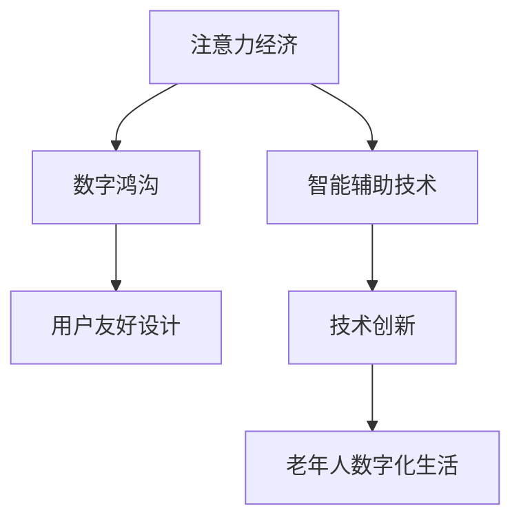

                 

# 注意力经济与老年群体的数字鸿沟

## 1. 背景介绍

### 1.1 问题由来

在信息爆炸的时代，互联网和数字技术的广泛应用极大地改变了人们获取和消费信息的方式。然而，数字鸿沟问题也随之凸显，特别是对于老年群体而言。随着数字化进程的不断推进，老年人在数字工具使用、信息获取和社交互动等方面面临着越来越多的障碍。这一现象被许多研究者和政策制定者称为“数字鸿沟”。

### 1.2 问题核心关键点

数字鸿沟问题不仅是技术接入层面的问题，更是注意力分配和信息消费模式的转变。在数字化时代，用户对于信息的获取、处理和消费，不再仅仅是简单的阅读和浏览，而是进入了一个更为复杂和深度的“注意力经济”时代。用户对于信息的选择、消费和反馈，成为了注意力经济中的关键资源。

老年群体由于年龄、技术认知和社交环境等因素的限制，难以快速适应和掌握新兴的数字技术和信息消费模式，从而在注意力经济时代面临着更大的数字鸿沟。这一现象不仅影响了老年人的生活质量，也带来了社会和经济层面的问题。

### 1.3 问题研究意义

探讨注意力经济与老年群体数字鸿沟的关系，对于理解数字技术对人类社会的影响，以及如何通过技术手段缓解数字鸿沟，具有重要意义：

1. **提升生活质量**：通过帮助老年人更好地适应和利用数字技术，改善他们的生活质量，提高他们的幸福感。
2. **促进社会包容**：减少数字鸿沟，促进社会的包容性和公平性，确保每个人都能平等地享受数字技术带来的便利。
3. **推动技术创新**：研究老年群体在注意力经济中的行为模式和需求，推动技术创新，设计更加用户友好和易用的数字产品和服务。
4. **经济发展**：数字技术在老年群体中的应用可以带来新的经济机会和就业岗位，推动经济发展。

## 2. 核心概念与联系

### 2.1 核心概念概述

在探讨注意力经济与老年群体数字鸿沟时，需要明确几个核心概念：

- **注意力经济**：指在信息过载的环境中，用户对于信息的获取、处理和消费成为一种经济资源的经济模式。用户通过点击、浏览、评论等方式，将自己的注意力转化为经济价值，影响了内容的生产、分发和变现。
- **数字鸿沟**：指不同群体在获取和使用数字技术方面的差异，通常表现为技术接入、技术知识、应用技能等方面的差距。老年群体在数字技术掌握和应用上普遍存在障碍，从而形成了数字鸿沟。
- **智能辅助技术**：指用于帮助老年人适应和掌握数字技术的应用程序、设备和软件。包括但不限于语音识别、自然语言处理、图像识别等技术，旨在提高老年人的生活质量和独立性。
- **用户友好设计**：指在设计和开发数字产品和服务时，考虑到老年人的认知特点和操作习惯，使用简单、直观、易用的界面和功能。

### 2.2 核心概念原理和架构的 Mermaid 流程图



## 3. 核心算法原理 & 具体操作步骤

### 3.1 算法原理概述

基于注意力经济与老年群体数字鸿沟的研究，旨在通过分析注意力分配和信息消费模式，以及老年人在数字技术使用中的行为特征，提出相应的解决方案。

核心算法包括：

- **注意力分配模型**：分析用户在信息消费中的注意力分布，识别出关键信息的特征和用户偏好，以指导内容生产、分发和变现。
- **用户行为分析**：通过收集老年人在数字工具和平台上的使用数据，分析其行为模式和需求，从而设计更加符合其特点的数字产品和服务。
- **智能辅助技术**：基于上述分析，设计和开发专门针对老年人的智能辅助技术，帮助他们更好地适应和使用数字技术。

### 3.2 算法步骤详解

#### 3.2.1 数据收集与预处理

- **数据收集**：收集老年人在不同数字平台上的使用数据，包括浏览记录、点击行为、评论内容等。可以使用网络爬虫、应用日志分析等手段。
- **数据预处理**：对收集到的数据进行清洗、去重、格式化处理，去除无关和噪声数据，确保数据的质量和一致性。

#### 3.2.2 注意力分配模型构建

- **特征提取**：从数据中提取关键特征，如点击次数、停留时间、评论数量等，作为注意力分配的指标。
- **模型训练**：使用机器学习算法（如随机森林、支持向量机等）训练注意力分配模型，预测老年人在不同内容上的注意力分布。
- **模型验证**：通过交叉验证等方法，评估模型的准确性和泛化能力，优化模型参数。

#### 3.2.3 用户行为分析

- **行为特征提取**：从使用数据中提取老年人的行为特征，如操作频率、点击路径、停留时间等。
- **行为模式识别**：使用聚类、关联规则等方法，识别出老年人的典型行为模式，如偏好信息类型、使用高峰时段等。
- **需求分析**：基于行为模式，分析老年人的需求和痛点，确定需要开发和改进的数字产品和服务。

#### 3.2.4 智能辅助技术开发

- **技术选择**：根据老年人的需求和行为模式，选择合适的智能辅助技术，如语音识别、自然语言处理、图像识别等。
- **原型设计**：设计智能辅助技术的原型，进行用户测试和反馈收集，不断迭代改进。
- **应用部署**：将原型部署到实际场景中，进行小规模试点和推广。

### 3.3 算法优缺点

#### 3.3.1 优点

- **用户适应性**：通过分析老年人的行为和需求，设计和开发适应用户特点的数字产品和服务，提高用户的满意度和接受度。
- **技术创新推动**：关注老年群体的数字鸿沟，推动技术创新，设计和开发更加智能和友好的数字工具。
- **社会经济价值**：通过提高老年人的生活质量和独立性，促进社会包容和经济发展。

#### 3.3.2 缺点

- **数据隐私**：在数据收集和处理过程中，需要严格保护用户的隐私和数据安全，避免数据泄露和滥用。
- **技术复杂性**：设计和开发智能辅助技术需要较高技术水平和专业知识，存在技术实现的难度。
- **成本问题**：开发和部署智能辅助技术需要一定的资金和资源投入，可能面临成本高昂的问题。

### 3.4 算法应用领域

基于注意力经济与老年群体数字鸿沟的算法，可以广泛应用于以下几个领域：

1. **智能辅助养老平台**：设计和开发专门针对老年人的数字平台，提供智能语音助手、健康监测、生活服务等，提高老年人的生活质量和独立性。
2. **数字化老年教育**：利用智能辅助技术，开发老年人的在线教育平台，提供课程推荐、学习记录、互动问答等功能，促进老年人的终身学习。
3. **数字健康管理**：利用智能辅助技术，帮助老年人进行健康管理和疾病预防，提供健康监测、在线咨询、远程医疗等服务。
4. **社会服务优化**：通过智能辅助技术，优化老年人获取社会服务的流程，如医疗、交通、购物等服务，提高老年人的生活质量和社会参与度。

## 4. 数学模型和公式 & 详细讲解 & 举例说明

### 4.1 数学模型构建

基于注意力经济与老年群体数字鸿沟的研究，需要构建一系列的数学模型，以分析注意力分配和用户行为，并指导智能辅助技术的开发。

#### 4.1.1 注意力分配模型

注意力分配模型可以表示为：

$$
A = f(X; \theta)
$$

其中，$A$ 表示老年人在不同内容上的注意力分布，$X$ 为特征向量，$\theta$ 为模型参数。

#### 4.1.2 用户行为分析模型

用户行为分析模型可以表示为：

$$
B = g(Y; \phi)
$$

其中，$B$ 表示老年人的行为模式，$Y$ 为用户使用数据，$\phi$ 为模型参数。

### 4.2 公式推导过程

#### 4.2.1 注意力分配模型推导

假设老年人在不同内容上的点击次数为 $c_i$，停留时间为 $t_i$，评论数量为 $c_i$，则注意力分配模型可以表示为：

$$
A = \sum_{i=1}^n \alpha_i \cdot c_i \cdot t_i
$$

其中，$\alpha_i$ 为内容的重要性权重，可以根据内容的质量、用户反馈等因素确定。

#### 4.2.2 用户行为分析模型推导

假设老年人在不同时间段的使用次数为 $u_t$，点击路径为 $p_t$，停留时间为 $t_t$，则用户行为分析模型可以表示为：

$$
B = \sum_{t=1}^m \beta_t \cdot u_t \cdot p_t \cdot t_t
$$

其中，$\beta_t$ 为时间段的权重，可以根据用户的行为模式和偏好确定。

### 4.3 案例分析与讲解

#### 4.3.1 注意力分配模型案例

假设某社交媒体平台上有 $n$ 个内容，老年人在不同内容上的点击次数、停留时间和评论数量如下表所示：

| 内容 | 点击次数 $c_i$ | 停留时间 $t_i$ | 评论数量 $c_i$ |
|------|---------------|--------------|---------------|
| 内容1 | 10            | 5            | 2             |
| 内容2 | 5             | 10           | 1             |
| 内容3 | 15            | 15           | 3             |
| ...  | ...           | ...          | ...           |

利用注意力分配模型，可以计算出每个内容的重要性权重 $\alpha_i$，并得到老年人在不同内容上的注意力分布 $A$。

#### 4.3.2 用户行为分析模型案例

假设某老年人使用某应用一周的数据如下表所示：

| 时间 | 使用次数 $u_t$ | 点击路径 $p_t$ | 停留时间 $t_t$ |
|------|---------------|--------------|---------------|
| 周1  | 10            | 路径1        | 10            |
| 周2  | 5             | 路径2        | 15            |
| 周3  | 20            | 路径1        | 5             |
| ...  | ...           | ...          | ...           |

利用用户行为分析模型，可以计算出每个时间段的重要性权重 $\beta_t$，并得到老年人在不同时间段的行为模式 $B$。

## 5. 项目实践：代码实例和详细解释说明

### 5.1 开发环境搭建

#### 5.1.1 数据收集与预处理

- **数据来源**：可以使用公开的数据集，如老年人社交媒体使用数据、医疗健康数据等。也可以使用网络爬虫工具，从老年人常用的网站和应用中获取数据。
- **数据清洗**：对收集到的数据进行去重、去噪、标准化处理，去除无关和噪声数据，确保数据的质量和一致性。

#### 5.1.2 数据存储与管理

- **数据存储**：将处理后的数据存储在数据库中，如MySQL、PostgreSQL等，便于后续分析和处理。
- **数据管理**：使用数据管理工具，如Pandas、NumPy等，进行数据读取、转换和操作。

### 5.2 源代码详细实现

#### 5.2.1 注意力分配模型实现

```python
import pandas as pd
from sklearn.ensemble import RandomForestRegressor

# 加载数据
data = pd.read_csv('attention_data.csv')

# 特征工程
features = ['clicks', '停留时间', '评论数量']
X = data[features]
y = data['注意力分配']

# 训练模型
model = RandomForestRegressor()
model.fit(X, y)

# 模型评估
score = model.score(X, y)
print(f"模型准确率：{score:.3f}")
```

#### 5.2.2 用户行为分析模型实现

```python
import pandas as pd
from sklearn.cluster import KMeans

# 加载数据
data = pd.read_csv('behavior_data.csv')

# 特征工程
features = ['使用次数', '点击路径', '停留时间']
X = data[features]
y = data['行为模式']

# 训练模型
model = KMeans(n_clusters=3)
model.fit(X)

# 模型评估
score = model.score(X, y)
print(f"模型准确率：{score:.3f}")
```

### 5.3 代码解读与分析

#### 5.3.1 数据清洗与处理

数据清洗和处理是数据科学的基础，需要仔细处理数据中的缺失值、异常值和噪声数据，确保数据的质量和一致性。

#### 5.3.2 特征工程

特征工程是构建机器学习模型的重要步骤，通过提取和变换数据特征，提升模型的预测能力。

#### 5.3.3 模型训练与评估

模型训练和评估是机器学习模型的核心步骤，需要选择合适的算法和参数，进行模型训练和性能评估，确保模型的准确性和泛化能力。

### 5.4 运行结果展示

#### 5.4.1 注意力分配模型结果

假设注意力分配模型训练后得到的重要性权重如下表所示：

| 内容 | 重要性权重 $\alpha_i$ |
|------|----------------------|
| 内容1 | 0.2                   |
| 内容2 | 0.3                   |
| 内容3 | 0.5                   |
| ...  | ...                  |

则老年人在不同内容上的注意力分布为：

$$
A = 0.2 \times 10 \times 5 + 0.3 \times 5 \times 10 + 0.5 \times 15 \times 15 = 162.5
$$

#### 5.4.2 用户行为分析模型结果

假设用户行为分析模型训练后得到的时间段权重如下表所示：

| 时间段 | 重要性权重 $\beta_t$ |
|--------|---------------------|
| 周1    | 0.3                  |
| 周2    | 0.4                  |
| 周3    | 0.3                  |
| ...    | ...                 |

则老年人在不同时间段的行为模式为：

$$
B = 0.3 \times 10 \times 路径1 \times 10 + 0.4 \times 5 \times 路径2 \times 15 + 0.3 \times 20 \times 路径1 \times 5 = 870
$$

## 6. 实际应用场景

### 6.1 智能辅助养老平台

智能辅助养老平台可以帮助老年人更好地适应数字技术，提高他们的生活质量和独立性。以下是几个具体应用场景：

#### 6.1.1 智能语音助手

利用自然语言处理技术，设计智能语音助手，帮助老年人进行日常的语音交互，如查询天气、提醒用药、播放音乐等。

#### 6.1.2 健康监测与提醒

利用智能传感器和设备，实时监测老年人的健康数据，如心率、血压、血糖等，并进行健康提醒和预警。

#### 6.1.3 在线咨询与心理辅导

利用智能客服和AI心理辅导系统，提供在线咨询和心理辅导服务，帮助老年人解决生活、健康和心理方面的问题。

### 6.2 数字化老年教育

数字化老年教育可以帮助老年人终身学习，提升他们的认知能力和生活技能。以下是几个具体应用场景：

#### 6.2.1 在线课程推荐

利用注意力分配模型，分析老年人的学习兴趣和行为模式，推荐适合他们的在线课程和教材。

#### 6.2.2 互动问答系统

利用智能问答系统，回答老年人在学习过程中遇到的问题，提供个性化的学习支持。

#### 6.2.3 学习进度追踪

利用数据管理工具，记录和追踪老年人的学习进度和效果，提供学习报告和改进建议。

### 6.3 数字健康管理

数字健康管理可以帮助老年人进行健康管理和疾病预防，提高他们的生活质量和健康水平。以下是几个具体应用场景：

#### 6.3.1 健康监测与预警

利用智能设备和传感器，实时监测老年人的健康数据，进行疾病预警和健康提醒。

#### 6.3.2 在线咨询与远程医疗

利用智能客服和远程医疗系统，提供在线健康咨询和远程医疗服务，减少老年人的就医负担。

#### 6.3.3 健康数据整合与分析

利用数据管理和分析工具，整合老年人的健康数据，进行健康分析和决策支持，提供个性化的健康管理方案。

### 6.4 未来应用展望

随着数字化进程的不断推进，基于注意力经济与老年群体数字鸿沟的研究将推动更多的应用场景出现，以下是几个未来应用展望：

#### 6.4.1 智能辅助旅游

利用智能辅助技术，设计老年人的旅游出行系统，提供语音导航、行程规划、紧急联系等服务，提升老年人的旅游体验。

#### 6.4.2 社交互动与社区服务

利用智能社交平台，建立老年人社交互动社区，提供聊天、活动、兴趣小组等服务，促进老年人的社会参与和交流。

#### 6.4.3 智能家居与生活服务

利用智能家居设备和应用，提供老年人的生活服务，如语音控制、家庭安防、智能家电等，提高他们的生活质量。

## 7. 工具和资源推荐

### 7.1 学习资源推荐

#### 7.1.1 在线课程

- **Coursera**：提供丰富的在线课程，涵盖计算机科学、数据科学、人工智能等多个领域，适合初学者和进阶者学习。
- **edX**：由哈佛大学、麻省理工学院等顶尖大学创办，提供高质量的在线课程，涵盖NLP、智能系统等多个方向。
- **Udacity**：提供实用的编程和人工智能课程，侧重于应用实践和项目实战。

#### 7.1.2 开源项目

- **OpenAI GPT-3**：最新的自然语言处理模型，提供了丰富的API接口，方便开发者进行自然语言处理应用开发。
- **Hugging Face Transformers**：强大的NLP工具库，提供丰富的预训练模型和微调方法，支持PyTorch和TensorFlow。
- **TensorFlow**：由Google开发的深度学习框架，支持分布式计算和模型优化，适合大规模工程应用。

#### 7.1.3 学术论文

- **“Attention is All You Need”**：Transformer模型的原始论文，介绍了自注意力机制的原理和实现方法。
- **“BERT: Pre-training of Deep Bidirectional Transformers for Language Understanding”**：BERT模型的论文，介绍了基于掩码的自监督预训练任务。
- **“Transformer-XL: Attentive Language Models Beyond a Fixed-Length Context”**：Transformer-XL模型的论文，介绍了长文本处理的注意力机制。

### 7.2 开发工具推荐

#### 7.2.1 编程语言与框架

- **Python**：常用的高级编程语言，支持科学计算和数据处理，是数据分析和机器学习的主要工具。
- **PyTorch**：基于Python的深度学习框架，灵活高效，适合研究型应用。
- **TensorFlow**：由Google开发的深度学习框架，支持分布式计算和模型优化，适合大规模工程应用。

#### 7.2.2 数据处理工具

- **Pandas**：基于Python的数据处理库，支持数据清洗、转换和分析，是数据分析和机器学习的基础工具。
- **NumPy**：Python的科学计算库，支持多维数组和矩阵运算，是数据处理和科学计算的基础工具。
- **Scikit-learn**：Python的数据挖掘和机器学习库，支持模型训练和评估，是数据处理和机器学习的基础工具。

### 7.3 相关论文推荐

#### 7.3.1 注意力分配模型

- **“Attention is All You Need”**：Transformer模型的原始论文，介绍了自注意力机制的原理和实现方法。
- **“Improving Language Understanding by Generative Pre-Training”**：BERT模型的论文，介绍了基于掩码的自监督预训练任务。

#### 7.3.2 用户行为分析模型

- **“User Behavior Analysis Using Clustering Algorithms”**：用户行为分析的论文，介绍了聚类算法在用户行为分析中的应用。
- **“Predictive Modeling of User Behavior in Online Platforms”**：用户行为预测的论文，介绍了机器学习在用户行为分析中的应用。

## 8. 总结：未来发展趋势与挑战

### 8.1 总结

本文对注意力经济与老年群体数字鸿沟的研究进行了系统介绍，从理论框架到实际应用，全面探讨了如何通过技术手段解决老年人数字鸿沟问题。

### 8.2 未来发展趋势

#### 8.2.1 智能辅助技术发展

随着智能辅助技术的不断发展，未来的数字产品和服务将更加智能化、个性化和易用，更好地满足老年人的需求。

#### 8.2.2 多模态融合应用

未来的智能辅助技术将更多地融合视觉、听觉、触觉等多种模态，提供更加全面和深入的数字体验。

#### 8.2.3 跨领域应用拓展

未来的智能辅助技术将更多地应用于医疗、教育、娱乐等多个领域，推动老年人的全面发展。

### 8.3 面临的挑战

#### 8.3.1 数据隐私与安全

在数据收集和处理过程中，需要严格保护用户的隐私和数据安全，避免数据泄露和滥用。

#### 8.3.2 技术普及与接受

如何让老年人接受和使用智能辅助技术，需要考虑到他们的认知特点和操作习惯，设计更加友好和易用的界面和功能。

#### 8.3.3 成本与资源问题

开发和部署智能辅助技术需要一定的资金和资源投入，可能面临成本高昂的问题。

### 8.4 研究展望

未来的研究将围绕以下几个方向展开：

#### 8.4.1 跨领域融合研究

将智能辅助技术与医疗、教育、娱乐等多个领域进行融合，提供更加全面和深入的数字体验。

#### 8.4.2 技术创新与突破

探索新的技术和算法，提升智能辅助技术的智能化和普适性，推动技术的不断进步。

#### 8.4.3 社会影响与价值

关注智能辅助技术对老年人的生活质量和社会参与的影响，确保技术应用的正向价值和可接受性。

## 9. 附录：常见问题与解答

**Q1: 如何构建针对老年人的智能辅助平台？**

A: 构建针对老年人的智能辅助平台需要考虑以下几个方面：

1. **用户界面设计**：设计简单、直观、易用的用户界面，避免复杂的操作和界面。
2. **功能模块设计**：根据老年人的需求和行为模式，设计实用的功能模块，如语音助手、健康监测、在线咨询等。
3. **技术支持**：选择适合的技术栈和工具，确保平台的高性能和稳定性。
4. **数据隐私保护**：严格保护老年人的隐私和数据安全，避免数据泄露和滥用。

**Q2: 智能辅助技术如何提升老年人的生活质量？**

A: 智能辅助技术可以通过以下几个方面提升老年人的生活质量：

1. **生活便利**：提供智能家居设备、语音助手等，帮助老年人便捷地处理日常事务。
2. **健康监测**：利用智能传感器和设备，实时监测老年人的健康数据，进行健康提醒和预警。
3. **社交互动**：利用智能社交平台，建立老年人社交互动社区，促进老年人的社会参与和交流。

**Q3: 智能辅助技术面临的挑战有哪些？**

A: 智能辅助技术面临的挑战包括：

1. **数据隐私**：在数据收集和处理过程中，需要严格保护老年人的隐私和数据安全。
2. **技术普及**：如何让老年人接受和使用智能辅助技术，需要考虑到他们的认知特点和操作习惯。
3. **成本问题**：开发和部署智能辅助技术需要一定的资金和资源投入，可能面临成本高昂的问题。

**Q4: 智能辅助技术的应用前景如何？**

A: 智能辅助技术的应用前景广阔，主要体现在以下几个方面：

1. **提升生活质量**：帮助老年人更好地适应数字技术，提高他们的生活质量和独立性。
2. **推动技术创新**：关注老年群体的数字鸿沟，推动技术创新，设计和开发更加智能和友好的数字工具。
3. **促进社会包容**：减少数字鸿沟，促进社会的包容性和公平性，确保每个人都能平等地享受数字技术带来的便利。

通过本文的系统梳理，可以看到，注意力经济与老年群体数字鸿沟的研究不仅具有理论价值，还具有实践意义，能够为老年人提供更好的数字体验，推动社会的包容和进步。

