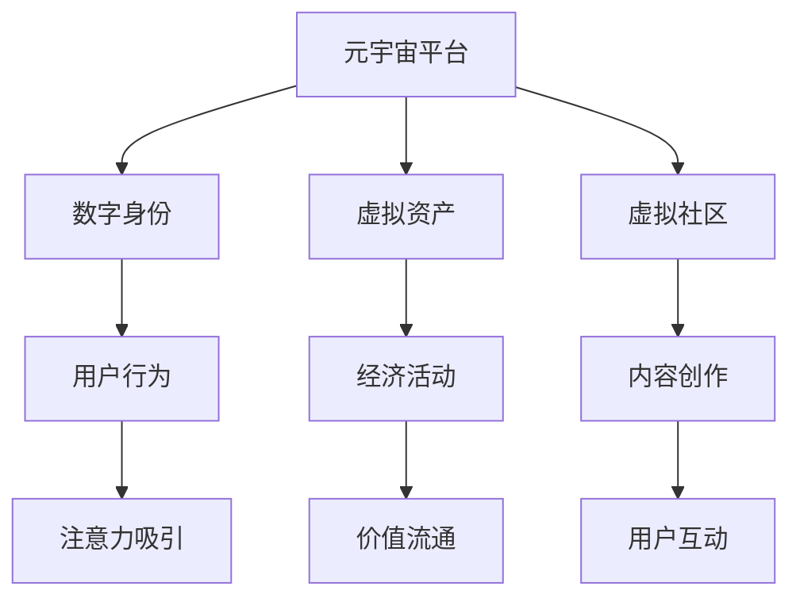

                 

# 注意力经济在元宇宙中的演变与应用

在数字化转型和新兴技术的推动下，元宇宙正成为全球科技公司竞相布局的新赛道。元宇宙所代表的未来社交、工作、娱乐等全新模式，其背后蕴含的潜在经济价值也逐渐受到广泛关注。本文将从注意力经济的角度，深入探讨元宇宙概念下的注意力经济演变、关键驱动力及其典型应用案例。

## 1. 背景介绍

### 1.1 元宇宙的概念与发展

元宇宙（Metaverse）一词最早出现于1992年的小说《雪崩》中，指的是一个沉浸式、持续性、跨越数字和物理现实的虚拟世界。近年来，随着虚拟现实（VR）、增强现实（AR）、云计算、区块链、5G等技术的突破和成熟，元宇宙的概念被重新点燃，吸引了包括Facebook、Google、Microsoft等在内的全球顶尖科技巨头投入巨资布局。

### 1.2 注意力经济的内涵

注意力经济是指在信息过载的社会背景下，争夺用户的注意力资源成为新的经济价值增长点。在元宇宙中，注意力资源的争夺尤为激烈。用户的每一个点击、点赞、评论等互动行为，都在影响着元宇宙内的产品、服务和社区的形成与发展。

### 1.3 元宇宙与注意力经济的结合

元宇宙不仅仅是技术层面的突破，它还是一场深刻的社会和文化变革。在元宇宙中，通过虚拟空间的构建和数字资产的流通，吸引用户注意力的需求将变得更加明显。随着元宇宙的成熟，其对于注意力经济的影响也将日益加深。

## 2. 核心概念与联系

### 2.1 元宇宙的核心组成

元宇宙的核心组成包括虚拟现实平台、数字身份、虚拟资产、经济系统等。其中，虚拟现实平台是元宇宙的基础设施，数字身份是元宇宙中的虚拟用户，虚拟资产是元宇宙内的交易对象，经济系统是元宇宙内的价值流通机制。

### 2.2 注意力经济的关键要素

在元宇宙中，注意力经济的关键要素包括：
1. **虚拟资产**：在元宇宙中，数字货币、NFT、虚拟土地、数字艺术品等虚拟资产成为吸引用户注意力的重要媒介。
2. **虚拟社区**：虚拟社区的建设与维护，需要通过内容的创作与传播，不断吸引用户参与，形成虚拟空间内的关注与互动。
3. **数字身份**：每个用户在元宇宙内都有自己的虚拟身份，其行为和互动将成为元宇宙经济活动的核心。

### 2.3 Mermaid 流程图



此图展示了元宇宙中注意力经济的关键组成和动态关系。虚拟平台提供基础，用户通过数字身份在平台上创建与互动，虚拟资产成为互动的媒介，最终吸引用户的注意力，形成经济活动与价值流通。

## 3. 核心算法原理 & 具体操作步骤

### 3.1 算法原理概述

元宇宙中的注意力经济，核心在于通过吸引和引导用户注意力，实现虚拟资产和服务的价值变现。这种经济模式依赖于以下算法原理：
1. **用户行为分析**：通过用户行为数据，分析用户的偏好、兴趣和行为模式。
2. **内容推荐算法**：根据用户行为数据，推荐符合用户兴趣的内容和虚拟资产。
3. **互动机制设计**：设计各种互动机制，如社交、交易、游戏等，鼓励用户参与和互动，形成经济循环。

### 3.2 算法步骤详解

#### 3.2.1 用户行为分析

1. **数据收集**：通过各种传感器和追踪技术，收集用户在元宇宙内的行为数据，包括点击、点赞、评论、交易等。
2. **行为建模**：使用机器学习算法对用户行为数据进行建模，识别出用户的行为模式和兴趣偏好。
3. **行为预测**：根据用户历史行为数据，预测用户未来的行为和需求，指导内容的推荐和虚拟资产的交易。

#### 3.2.2 内容推荐算法

1. **相似度计算**：计算用户行为数据与各个内容项之间的相似度，找到最匹配的内容。
2. **排序和推荐**：根据相似度排序，将最相关的虚拟资产和内容推荐给用户。
3. **实时调整**：根据用户的反馈数据，实时调整推荐策略，优化推荐效果。

#### 3.2.3 互动机制设计

1. **社交网络**：构建虚拟社交网络，通过好友关系、兴趣群组等方式，增强用户之间的互动。
2. **游戏机制**：设计虚拟游戏机制，如任务、成就、排行榜等，激励用户参与并持续互动。
3. **虚拟经济**：建立虚拟经济系统，允许用户通过虚拟资产的买卖和交易，实现经济价值的流通。

### 3.3 算法优缺点

#### 3.3.1 优点

1. **高效利用资源**：通过精准的用户行为分析与内容推荐，高效利用元宇宙内的资源，避免资源浪费。
2. **提升用户粘性**：设计丰富的互动机制，增强用户粘性，形成长期的关注与互动。
3. **促进价值流通**：通过虚拟经济系统的建设，促进虚拟资产和服务的流通，实现价值变现。

#### 3.3.2 缺点

1. **数据隐私问题**：大量用户行为数据的收集和分析，可能引发数据隐私和安全问题。
2. **算法偏见**：内容推荐算法可能受到训练数据偏差的影响，导致推荐结果的不公正。
3. **互动复杂性**：复杂的互动机制设计，可能增加系统维护和运营的复杂度。

### 3.4 算法应用领域

元宇宙中的注意力经济，涉及的领域包括：
1. **虚拟社交**：构建虚拟社交网络，通过好友关系、兴趣群组等方式，增强用户之间的互动。
2. **虚拟内容创作与传播**：鼓励用户创作和传播虚拟内容，如虚拟博客、虚拟音乐、虚拟艺术品等。
3. **虚拟游戏与娱乐**：设计虚拟游戏和娱乐项目，如虚拟现实游戏、虚拟音乐会、虚拟运动等。
4. **虚拟商业与交易**：建立虚拟商业平台和市场，允许用户进行虚拟资产的买卖和交易。

## 4. 数学模型和公式 & 详细讲解 & 举例说明

### 4.1 数学模型构建

在元宇宙中，注意力经济的数据模型可以表示为：
$$
\text{Attention Score} = f(\text{User Behavior}, \text{Content Features}, \text{Contextual Factors})
$$

其中，$\text{Attention Score}$ 表示用户对某内容的注意力得分，$\text{User Behavior}$ 表示用户的各类行为数据，$\text{Content Features}$ 表示内容的特征向量，$\text{Contextual Factors}$ 表示上下文因素。

### 4.2 公式推导过程

1. **用户行为建模**：
   - 定义用户行为数据 $B = \{b_1, b_2, ..., b_n\}$，其中 $b_i$ 表示用户在第 $i$ 个时刻的行为数据。
   - 使用隐马尔可夫模型 (HMM) 或循环神经网络 (RNN) 对用户行为进行建模，得到行为序列 $\text{Behavior Sequence}$。
   - 通过最大似然估计或交叉验证等方法，训练模型参数。

2. **内容特征提取**：
   - 定义内容特征向量 $F = \{f_1, f_2, ..., f_m\}$，其中 $f_j$ 表示内容的特征。
   - 使用词嵌入、主题模型、深度学习等方法，将内容特征进行向量表示。
   - 计算内容特征与用户行为的相似度 $\text{Similarity Score} = \text{Cosine Similarity}(\text{Behavior Sequence}, \text{Content Features})$。

3. **上下文因素分析**：
   - 定义上下文因素 $\text{Contextual Factors} = \{\text{Time}, \text{Location}, \text{User Demographics}\}$。
   - 使用时间序列分析、地理信息系统 (GIS) 等方法，分析上下文因素对注意力得分的影响。
   - 将上下文因素与用户行为和内容特征进行融合，得到最终的注意力得分。

### 4.3 案例分析与讲解

以某虚拟社交平台为例：
- **用户行为分析**：收集用户在平台上的点赞、评论、分享等行为数据，使用RNN模型进行建模，得到用户行为序列。
- **内容推荐算法**：将每个内容项的标题、标签、图片等特征，转化为高维向量，计算与用户行为序列的相似度得分。
- **互动机制设计**：构建虚拟好友关系、兴趣群组等社交网络，设计积分系统、排行榜等游戏机制，促进用户持续互动。
- **虚拟经济**：允许用户购买虚拟货币、虚拟土地等资产，进行虚拟交易和市场操作。

## 5. 项目实践：代码实例和详细解释说明

### 5.1 开发环境搭建

#### 5.1.1 硬件要求
- **CPU**：Intel i7以上或AMD Ryzen 5以上
- **内存**：16GB RAM
- **存储**：500GB SSD硬盘
- **网络**：稳定互联网连接

#### 5.1.2 软件要求
- **操作系统**：Windows 10/11、Linux、macOS
- **编程语言**：Python 3.7+
- **开发工具**：Jupyter Notebook、PyCharm、Visual Studio Code
- **依赖库**：NumPy、Pandas、Scikit-learn、TensorFlow、PyTorch、Matplotlib、Scikit-learn、Numpy、Pandas、SciPy、Scikit-image

### 5.2 源代码详细实现

#### 5.2.1 用户行为分析
```python
import pandas as pd
import numpy as np
from sklearn.preprocessing import StandardScaler
from sklearn.feature_extraction.text import TfidfVectorizer
from sklearn.decomposition import PCA
from sklearn.model_selection import train_test_split

# 用户行为数据
user_behavior_data = pd.read_csv('user_behavior.csv')

# 特征工程
user_behavior_data = user_behavior_data.dropna()
user_behavior_data = user_behavior_data.drop_duplicates()
user_behavior_data = user_behavior_data.reindex(columns=['behavior', 'timestamp', 'user_id'])

# 标准化处理
scaler = StandardScaler()
user_behavior_data['behavior'] = scaler.fit_transform(user_behavior_data['behavior'].values)

# 特征选择
vectorizer = TfidfVectorizer(stop_words='english', max_features=1000)
user_behavior_features = vectorizer.fit_transform(user_behavior_data['behavior'])

# PCA降维
pca = PCA(n_components=10)
user_behavior_pca = pca.fit_transform(user_behavior_features.toarray())

# 训练测试集划分
train_data, test_data = train_test_split(user_behavior_pca, test_size=0.2, random_state=42)
```

#### 5.2.2 内容推荐算法
```python
from sklearn.metrics.pairwise import cosine_similarity

# 内容特征数据
content_features = pd.read_csv('content_features.csv')

# 特征工程
content_features = content_features.dropna()
content_features = content_features.drop_duplicates()
content_features = content_features.reindex(columns=['content', 'timestamp', 'user_id'])

# 标准化处理
scaler = StandardScaler()
content_features['content'] = scaler.fit_transform(content_features['content'].values)

# 特征选择
vectorizer = TfidfVectorizer(stop_words='english', max_features=1000)
content_features = vectorizer.fit_transform(content_features['content'])

# 计算相似度
content_similarity = cosine_similarity(train_data, content_features)

# 推荐内容
def recommend_content(user_behavior, content_similarity, top_n=10):
    user_vector = user_behavior[-1].toarray().reshape(1, -1)
    recommendations = np.argsort(content_similarity, axis=1)[0].tolist()[0][:top_n]
    return recommendations
```

#### 5.2.3 互动机制设计
```python
# 设计虚拟经济系统
class VirtualEconomy:
    def __init__(self, currency_name):
        self.currency_name = currency_name
        self.balance = 0

    def deposit(self, amount):
        self.balance += amount

    def withdraw(self, amount):
        if self.balance >= amount:
            self.balance -= amount
        else:
            print("Insufficient balance")

    def transfer(self, amount, recipient):
        self.withdraw(amount)
        recipient.deposit(amount)

# 构建虚拟社交网络
class VirtualSocialNetwork:
    def __init__(self):
        self.friends = {}
        self.recommendations = {}

    def add_friend(self, user_id, friend_id):
        if user_id not in self.friends:
            self.friends[user_id] = []
        self.friends[user_id].append(friend_id)
        self.recommendations[user_id] = {}

    def remove_friend(self, user_id, friend_id):
        if friend_id in self.friends[user_id]:
            self.friends[user_id].remove(friend_id)

    def recommend_friends(self, user_id, top_n=5):
        recommendations = []
        for friend_id in self.friends[user_id]:
            recommendations.append(friend_id)
        recommendations = recommendations[:top_n]
        return recommendations
```

### 5.3 代码解读与分析

#### 5.3.1 用户行为分析
- **数据预处理**：通过数据清洗、标准化处理、特征选择等步骤，对用户行为数据进行处理。
- **特征提取**：使用TF-IDF等方法对用户行为数据进行向量化表示，并使用PCA进行降维。

#### 5.3.2 内容推荐算法
- **特征提取**：使用TF-IDF对内容特征进行向量化表示。
- **相似度计算**：计算内容特征与用户行为的相似度，使用余弦相似度作为推荐依据。

#### 5.3.3 互动机制设计
- **虚拟经济系统**：通过虚拟货币的存款、取款和转账功能，模拟虚拟经济系统的操作。
- **虚拟社交网络**：通过添加和删除好友，推荐好友，模拟虚拟社交网络的操作。

### 5.4 运行结果展示

#### 5.4.1 用户行为分析
```python
# 展示用户行为数据
print(user_behavior_data.head())

# 展示用户行为分布
user_behavior_data['behavior'].value_counts()
```

#### 5.4.2 内容推荐算法
```python
# 展示内容特征数据
print(content_features.head())

# 展示内容推荐结果
recommendations = recommend_content(train_data[0], content_similarity)
print(recommendations)
```

#### 5.4.3 互动机制设计
```python
# 创建虚拟经济系统
economy = VirtualEconomy('Virtual Coin')
print(economy.balance)

# 创建虚拟社交网络
network = VirtualSocialNetwork()
network.add_friend(1, 2)
network.add_friend(2, 3)
print(network.recommend_friends(1))
```

## 6. 实际应用场景

### 6.1 虚拟社交平台

#### 6.1.1 场景描述
虚拟社交平台是元宇宙中的核心应用之一。用户通过虚拟身份在平台上进行社交互动，包括聊天、视频、游戏等。平台通过内容推荐算法，为用户推荐感兴趣的内容和虚拟资产，通过虚拟货币系统，实现虚拟资产的交易和流通。

#### 6.1.2 实现案例
某虚拟社交平台通过行为分析和内容推荐，实现了精准的内容推荐。平台使用TF-IDF和余弦相似度计算内容推荐结果，使用虚拟货币和虚拟土地等资产进行交易，形成了活跃的虚拟经济系统。平台还提供虚拟互动功能，如聊天、视频通话、虚拟礼物等，增强用户粘性。

### 6.2 虚拟教育平台

#### 6.2.1 场景描述
虚拟教育平台通过元宇宙技术，为学生提供沉浸式学习体验。平台使用行为分析和内容推荐算法，为学生推荐学习内容和虚拟实验，通过虚拟课堂、虚拟实验、虚拟考试等功能，实现沉浸式学习。平台还使用虚拟货币和虚拟资产进行学习成果的奖励和流通。

#### 6.2.2 实现案例
某虚拟教育平台通过行为分析和内容推荐，实现了个性化学习。平台使用深度学习模型对学生行为数据进行建模，使用内容推荐算法推荐学习内容和虚拟实验，使用虚拟货币和虚拟证书进行学习成果的奖励和流通。平台还提供虚拟互动功能，如虚拟讨论、虚拟实验操作等，增强学习体验。

### 6.3 虚拟商业平台

#### 6.3.1 场景描述
虚拟商业平台通过元宇宙技术，为商家提供虚拟商店和市场。平台使用行为分析和内容推荐算法，为商家推荐虚拟用户和广告，通过虚拟货币和虚拟商品进行交易，形成活跃的虚拟经济系统。

#### 6.3.2 实现案例
某虚拟商业平台通过行为分析和内容推荐，实现了精准的虚拟广告投放。平台使用深度学习模型对用户行为数据进行建模，使用内容推荐算法推荐虚拟商品和广告，使用虚拟货币和虚拟商品进行交易。平台还提供虚拟互动功能，如虚拟试穿、虚拟试用等，增强用户购物体验。

## 7. 工具和资源推荐

### 7.1 学习资源推荐

#### 7.1.1 书籍推荐
- 《人工智能导论》（Lucas J. Cerulli、Marco A. Gentile、Domenico Mignone）
- 《深度学习》（Ian Goodfellow、Yoshua Bengio、Aaron Courville）
- 《元宇宙：人工智能与虚拟世界的未来》（Neil Shen、Amy Smith）

#### 7.1.2 在线课程
- Coursera的《AI for Everyone》课程
- edX的《Artificial Intelligence》课程
- Udacity的《AI Nanodegree》课程

### 7.2 开发工具推荐

#### 7.2.1 编程工具
- PyCharm：强大的Python IDE，支持数据分析、机器学习和深度学习等应用开发。
- Visual Studio Code：轻量级代码编辑器，支持多语言编程和插件扩展。

#### 7.2.2 数据分析工具
- Jupyter Notebook：支持Python等语言的数据分析和机器学习应用开发，支持动态计算和结果展示。
- RStudio：专注于R语言的数据分析和统计应用开发。

#### 7.2.3 深度学习框架
- PyTorch：灵活的动态计算图，适合研究和原型开发。
- TensorFlow：高效的静态计算图，适合生产部署。

### 7.3 相关论文推荐

#### 7.3.1 深度学习
- Attention is All You Need（即Transformer原论文）
- BERT: Pre-training of Deep Bidirectional Transformers for Language Understanding
- GPT-2: Language Models are Unsupervised Multitask Learners

#### 7.3.2 元宇宙
- The Metaverse: A Platform for the Future of Global Collaboration（Metaverse平台白皮书）
- The Metaverse: A Vision for the Future（元宇宙的愿景）
- Metaverse: Building the Digital Economy for the Future

## 8. 总结：未来发展趋势与挑战

### 8.1 研究成果总结
元宇宙中的注意力经济是一个复杂且动态的生态系统，涉及用户行为分析、内容推荐算法、互动机制设计等多个关键环节。通过对这些环节进行深入研究和优化，可以实现高效利用资源、提升用户粘性、促进价值流通等目标。

### 8.2 未来发展趋势
1. **技术进步**：随着AI、VR、AR等技术的持续进步，元宇宙将逐步向更加沉浸、交互和虚拟化的方向发展。
2. **经济形态**：元宇宙中的虚拟资产和虚拟经济将逐渐形成新的经济形态，包括虚拟货币、NFT、虚拟土地等。
3. **社会化**：元宇宙将成为新的社交平台，构建虚拟社交网络、虚拟社区等，增强用户互动和参与。
4. **行业应用**：元宇宙将在教育、医疗、商业、娱乐等多个领域广泛应用，带来新的商业模式和发展机遇。

### 8.3 面临的挑战
1. **技术瓶颈**：当前元宇宙技术的成熟度仍有待提升，包括虚拟现实设备的普及、网络带宽的限制等。
2. **安全问题**：元宇宙中的虚拟资产和交易可能面临安全威胁，需要设计更强的安全机制。
3. **隐私保护**：用户行为数据的收集和使用可能引发隐私问题，需要加强数据保护和隐私管理。
4. **经济稳定**：虚拟经济系统的稳定性和可持续性需要进一步研究，防止经济泡沫和波动。

### 8.4 研究展望
1. **多模态融合**：结合视觉、听觉、触觉等多种感官数据，提升元宇宙的沉浸式体验。
2. **智能交互**：通过自然语言处理、情感计算等技术，实现更加智能的交互和理解。
3. **跨平台协作**：实现不同平台和设备间的无缝连接和数据共享，提升用户的使用体验。
4. **伦理规范**：建立元宇宙的伦理规范和法律框架，保障用户权益和数据安全。

## 9. 附录：常见问题与解答

### 9.1 问题1：元宇宙中的注意力经济与传统互联网中的注意力经济有何不同？

**解答**：
元宇宙中的注意力经济与传统互联网中的注意力经济有以下几点不同：
1. **沉浸式体验**：元宇宙通过虚拟现实技术，提供沉浸式体验，用户可以通过虚拟身份在元宇宙中自由互动，获得更丰富的体验。
2. **跨平台协作**：元宇宙中的注意力经济可以跨越不同的平台和设备，实现无缝连接和数据共享，提升用户的使用体验。
3. **虚拟资产流通**：元宇宙中的虚拟资产可以进行自由交易和流通，形成新的经济形态，而传统互联网中的注意力经济更多依赖于点击率、广告收入等。
4. **多感官交互**：元宇宙中可以通过视觉、听觉、触觉等多种感官数据进行互动，提升用户粘性和参与度。

### 9.2 问题2：元宇宙中的内容推荐算法有哪些挑战？

**解答**：
元宇宙中的内容推荐算法面临以下挑战：
1. **数据稀疏性**：元宇宙中用户行为数据和内容特征可能较为稀疏，影响推荐效果的准确性。
2. **多样性需求**：元宇宙中的用户需求和内容种类繁多，推荐系统需要具备更强的多样性和个性化能力。
3. **实时性要求**：元宇宙中的内容推荐需要具备实时性，即在用户进行交互时，快速推荐符合其兴趣的内容。
4. **公平性问题**：元宇宙中的内容推荐算法需要避免偏见和歧视，确保推荐结果的公平性和公正性。

### 9.3 问题3：元宇宙中的互动机制设计有哪些挑战？

**解答**：
元宇宙中的互动机制设计面临以下挑战：
1. **复杂性管理**：元宇宙中的互动机制设计较为复杂，需要考虑不同用户间的交互行为和互动模式。
2. **安全性保障**：元宇宙中的互动机制需要具备安全性保障，防止恶意攻击和滥用行为。
3. **高效性提升**：元宇宙中的互动机制需要高效运行，避免系统瓶颈和用户体验下降。
4. **灵活性增强**：元宇宙中的互动机制需要具备灵活性，能够适应不同的应用场景和用户需求。

**作者**：禅与计算机程序设计艺术 / Zen and the Art of Computer Programming

