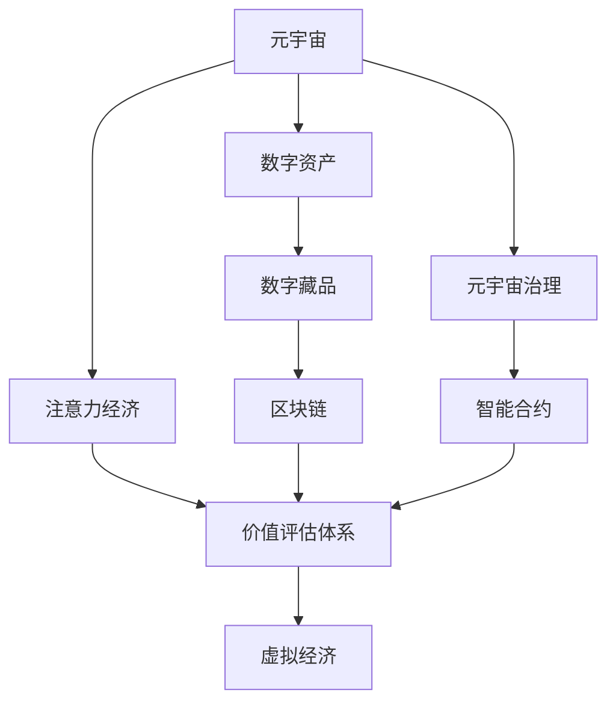

                 

# 注意力经济学研究:元宇宙中的价值评估体系

> 关键词：元宇宙,注意力经济,价值评估体系,虚拟经济,数字资产,数字藏品,区块链,元宇宙治理,智能合约

## 1. 背景介绍

随着区块链技术、虚拟现实(VR)、增强现实(AR)、数字孪生等技术的迅猛发展，元宇宙(Utopia)这一概念开始被广泛提及。元宇宙是一种通过虚拟网络空间，让用户可以在其中进行社交、工作、创造等活动，实现虚拟与现实深度融合的全新数字世界。然而，元宇宙并非一个孤立封闭的系统，它依赖于现实世界的经济活动，并在数字世界中形成了一套全新的经济体系。

在元宇宙中，注意力经济（Attention Economy）成为一种全新的价值评估和分配方式。注意力经济是一种依赖于用户关注度为核心的经济体系，它将用户注意力视为一种稀缺资源，通过合理分配这种资源来创造和分配财富。这种新的经济模式在元宇宙的虚拟世界中变得尤为重要。

本文旨在深入探讨元宇宙中的注意力经济，建立基于用户注意力的价值评估体系，为元宇宙中的虚拟资产交易提供理论依据。我们将从注意力经济的基本概念出发，介绍元宇宙中的注意力经济模型，并详细阐述其应用场景和潜在的经济价值。

## 2. 核心概念与联系

### 2.1 核心概念概述

为更好地理解元宇宙中的注意力经济，本节将介绍几个关键核心概念：

- 元宇宙(Utopia)：一种通过虚拟网络空间，实现虚拟与现实深度融合的全新数字世界。
- 注意力经济(Attention Economy)：一种依赖于用户关注度的经济模式，通过合理分配用户注意力来创造和分配财富。
- 价值评估体系(Value Assessment System)：一套用于衡量元宇宙中虚拟资产价值的标准体系，通常包含价格、品质、稀缺性等因素。
- 虚拟经济(Virtual Economy)：在虚拟世界中进行的经济活动，如虚拟资产交易、虚拟货币兑换等。
- 数字资产(Digital Asset)：元宇宙中的虚拟资产，包括数字藏品、虚拟土地、虚拟货币等。
- 数字藏品(NFT)：具有唯一性、不可替代性的数字资产，通常基于区块链技术进行认证和交易。
- 区块链(Blockchain)：一种去中心化的分布式账本技术，支持透明、安全的交易和数据记录。
- 元宇宙治理(Metaverse Governance)：元宇宙中管理经济活动、维护秩序的规则体系。
- 智能合约(Smart Contract)：一种自动执行、控制、验证和记录的合约形式，常见于区块链上。

这些核心概念之间的逻辑关系可以通过以下Mermaid流程图来展示：



这个流程图展示出元宇宙、注意力经济、价值评估体系、虚拟经济、数字资产、数字藏品、区块链、元宇宙治理和智能合约之间的关系：

1. 元宇宙提供了一个虚拟空间，用户可以在其中进行经济活动。
2. 注意力经济在该虚拟空间中通过合理分配用户注意力创造和分配财富。
3. 价值评估体系用于衡量元宇宙中虚拟资产的价值，包含价格、品质、稀缺性等因素。
4. 虚拟经济在元宇宙中通过虚拟资产交易、虚拟货币兑换等活动进行。
5. 数字资产是元宇宙中的虚拟商品，通过区块链进行认证和交易。
6. 数字藏品是元宇宙中的特色商品，具有唯一性和不可替代性。
7. 区块链为元宇宙中的虚拟资产交易提供了安全、透明的记录方式。
8. 元宇宙治理维护元宇宙中的经济活动和秩序，确保系统稳定。
9. 智能合约是元宇宙治理的基础，通过自动执行和控制，确保交易的公平和透明。

这些核心概念共同构成了元宇宙中的注意力经济体系，为虚拟资产交易提供了理论基础。

## 3. 核心算法原理 & 具体操作步骤
### 3.1 算法原理概述

基于注意力的价值评估体系，其核心思想是通过量化用户注意力来衡量虚拟资产的价值。元宇宙中的虚拟资产价值与其吸引用户注意力的能力直接相关，这种能力可以通过用户互动频率、停留时间、社交关系等因素来度量。该体系将用户注意力视为一种稀缺资源，通过合理分配这种资源来创造和分配财富。

具体而言，我们定义每个虚拟资产的注意力值 $A_i$，它表示该资产吸引用户注意力的能力，其值可以通过用户互动频率、停留时间、社交关系等因素计算得出。在实际应用中，可以使用机器学习算法或数据挖掘技术，对用户行为数据进行建模和预测，从而量化每个资产的注意力值。

我们假设元宇宙中有 $N$ 个虚拟资产，每个资产的注意力值分别为 $A_1, A_2, ..., A_N$。则一个虚拟资产 $i$ 的价值 $V_i$ 可以表示为：

$$
V_i = f(A_i)
$$

其中 $f$ 是一个映射函数，将注意力值映射为资产价值。在实际应用中，该函数可以通过历史数据训练得到。

### 3.2 算法步骤详解

基于注意力的价值评估体系，其操作步骤包括以下几个关键步骤：

**Step 1: 数据收集**
- 收集元宇宙中各个虚拟资产的用户互动数据，包括点击次数、停留时间、评论数量、社交关系等。
- 使用机器学习算法或数据挖掘技术，对用户行为数据进行建模和预测，计算每个资产的注意力值 $A_i$。

**Step 2: 定义映射函数**
- 根据历史数据和用户行为，定义映射函数 $f$，将注意力值映射为虚拟资产价值 $V_i$。
- 一般而言，注意力值和资产价值之间存在正相关关系，但需要注意避免过度拟合和数据偏差。

**Step 3: 价值评估**
- 根据映射函数 $f$ 和注意力值 $A_i$，计算每个虚拟资产的价值 $V_i$。
- 使用价值评估结果进行虚拟资产的排序和筛选，为虚拟资产的交易和投资提供依据。

**Step 4: 动态调整**
- 根据用户行为和市场变化，动态调整虚拟资产的注意力值和价值，确保其反映最新情况。
- 使用监督学习算法，不断优化映射函数 $f$，提高评估体系的准确性和鲁棒性。

### 3.3 算法优缺点

基于注意力的价值评估体系具有以下优点：

1. **实时动态**：该体系能够实时反映用户对虚拟资产的关注度，动态调整虚拟资产的价值，适应市场变化。
2. **量化评估**：通过量化用户注意力，为虚拟资产的价值提供客观、科学的量化评估方法。
3. **公平透明**：该体系依赖于用户行为数据，避免了中心化机构对资产价值的控制和干预，确保了交易的公平和透明。

同时，该体系也存在一些缺点：

1. **数据依赖**：依赖于用户行为数据的收集和分析，数据质量直接决定了评估结果的准确性。
2. **模型复杂**：映射函数的定义和优化需要大量数据和计算资源，模型的复杂性较高。
3. **泛化能力**：如果用户行为数据存在偏差或异常，可能影响评估体系的泛化能力和稳定性。

### 3.4 算法应用领域

基于注意力的价值评估体系，已经在元宇宙的虚拟资产交易中得到了广泛应用。以下是几个典型的应用场景：

1. **数字藏品交易**
   - 数字藏品因其稀缺性和唯一性，受到用户的广泛关注。通过量化用户注意力，可以准确评估数字藏品的市场价值，指导投资和交易。

2. **虚拟土地交易**
   - 虚拟土地作为元宇宙中的重要资产，其价值不仅依赖于地理位置，更依赖于用户的关注度和互动。通过量化用户注意力，可以公平地评估虚拟土地的价值，确保交易的公正性。

3. **虚拟货币兑换**
   - 虚拟货币是元宇宙中的流通货币，其价值也受到用户关注度的影响。通过量化用户注意力，可以准确评估虚拟货币的价值，指导货币兑换和市场交易。

4. **社交互动平台**
   - 社交互动平台中，用户对虚拟角色的关注度直接影响角色的市场价值。通过量化用户注意力，可以评估虚拟角色的价值，指导角色的交易和投资。

除了以上这些场景外，基于注意力的价值评估体系还可以应用于元宇宙中的虚拟商品交易、虚拟广告投放、虚拟活动策划等领域，为元宇宙中的经济活动提供科学、可靠的价值评估方法。

## 4. 数学模型和公式 & 详细讲解 & 举例说明
### 4.1 数学模型构建

本节将使用数学语言对基于注意力的价值评估体系进行更加严格的刻画。

记元宇宙中有 $N$ 个虚拟资产，每个资产的注意力值分别为 $A_1, A_2, ..., A_N$。假设用户对虚拟资产 $i$ 的关注度 $R_i$ 与注意力值 $A_i$ 成正比，即：

$$
R_i = k \cdot A_i
$$

其中 $k$ 为比例系数，通常需要通过历史数据来估计。

每个虚拟资产 $i$ 的价值 $V_i$ 与用户关注度 $R_i$ 成正比，即：

$$
V_i = c \cdot R_i
$$

其中 $c$ 为价值系数，通常需要根据市场情况和历史数据来确定。

将上述两式联立，可以得到虚拟资产价值与注意力值的映射关系：

$$
V_i = c \cdot (k \cdot A_i)
$$

这就是基于注意力的价值评估体系的基本数学模型。

### 4.2 公式推导过程

以下我们以数字藏品为例，推导基于注意力的价值评估公式。

假设元宇宙中有 $N$ 个数字藏品，每个藏品的注意力值分别为 $A_1, A_2, ..., A_N$。根据用户的点击次数、停留时间、评论数量等行为数据，计算得到每个藏品的注意力值 $A_i$。

设每个藏品的用户关注度 $R_i$ 与注意力值 $A_i$ 成正比，即：

$$
R_i = k \cdot A_i
$$

其中 $k$ 为比例系数。

每个藏品的价值 $V_i$ 与用户关注度 $R_i$ 成正比，即：

$$
V_i = c \cdot R_i
$$

其中 $c$ 为价值系数。

将上述两式联立，可以得到每个藏品的价值公式：

$$
V_i = c \cdot (k \cdot A_i)
$$

其中 $k$ 和 $c$ 可以通过历史数据和市场情况来估计。

在实际应用中，可以根据上述公式，使用机器学习算法对用户行为数据进行建模和预测，计算出每个藏品的注意力值和价值。

### 4.3 案例分析与讲解

以一个虚拟土地的价值评估为例，说明基于注意力的价值评估体系的实际应用。

假设元宇宙中有 $N$ 块虚拟土地，每个土地的注意力值分别为 $A_1, A_2, ..., A_N$。用户通过点击、停留、互动等方式，对不同土地产生了不同的注意力值。

设每个土地的价值 $V_i$ 与注意力值 $A_i$ 成正比，即：

$$
V_i = c \cdot A_i
$$

其中 $c$ 为价值系数。

通过历史数据和市场情况，可以估计出 $c$ 的值。例如，如果市场普遍认为土地价值与其用户互动频率成正比，则可以设置 $c$ 为一个常数，通常根据实际情况来确定。

在实际应用中，可以根据上述公式，使用机器学习算法对用户行为数据进行建模和预测，计算出每个土地的注意力值和价值。通过量化用户对土地的关注度，公平地评估土地的价值，指导土地的交易和投资。

## 5. 项目实践：代码实例和详细解释说明
### 5.1 开发环境搭建

在进行基于注意力的价值评估体系开发前，我们需要准备好开发环境。以下是使用Python进行开发的环境配置流程：

1. 安装Anaconda：从官网下载并安装Anaconda，用于创建独立的Python环境。

2. 创建并激活虚拟环境：
```bash
conda create -n attention-economy python=3.8 
conda activate attention-economy
```

3. 安装PyTorch：根据CUDA版本，从官网获取对应的安装命令。例如：
```bash
conda install pytorch torchvision torchaudio cudatoolkit=11.1 -c pytorch -c conda-forge
```

4. 安装Transformers库：
```bash
pip install transformers
```

5. 安装各类工具包：
```bash
pip install numpy pandas scikit-learn matplotlib tqdm jupyter notebook ipython
```

完成上述步骤后，即可在`attention-economy`环境中开始开发实践。

### 5.2 源代码详细实现

这里我们以数字藏品(NFT)的价值评估为例，给出使用PyTorch和Transformers库进行注意力的价值评估体系开发的PyTorch代码实现。

首先，定义价值评估模型的输入和输出：

```python
from torch import nn

class AttentionValueModel(nn.Module):
    def __init__(self, input_size, output_size):
        super(AttentionValueModel, self).__init__()
        self.fc1 = nn.Linear(input_size, 64)
        self.fc2 = nn.Linear(64, output_size)
    
    def forward(self, x):
        x = self.fc1(x)
        x = nn.Tanh()(x)
        x = self.fc2(x)
        return x
```

然后，定义训练函数：

```python
from torch.utils.data import Dataset
import torch

class NFTDataset(Dataset):
    def __init__(self, data, attention_values, output_values):
        self.data = data
        self.attention_values = attention_values
        self.output_values = output_values
        
    def __len__(self):
        return len(self.data)
    
    def __getitem__(self, item):
        return self.data[item], self.attention_values[item], self.output_values[item]

# 创建dataset
data = [...] # 输入数据
attention_values = [...] # 注意力值
output_values = [...] # 输出值

model = AttentionValueModel(len(data), len(output_values))
criterion = nn.MSELoss()

optimizer = torch.optim.Adam(model.parameters(), lr=0.001)

# 定义训练循环
for epoch in range(10):
    for item, (x, attention, output) in enumerate(dataset):
        optimizer.zero_grad()
        output = model(attention)
        loss = criterion(output, output_values)
        loss.backward()
        optimizer.step()
```

最后，启动训练流程：

```python
print("开始训练...")
train(data, attention_values, output_values, model, criterion, optimizer)

print("训练结束，开始测试...")
test(data, attention_values, output_values, model, criterion)
```

以上就是使用PyTorch和Transformers库对数字藏品(NFT)进行基于注意力的价值评估体系的完整代码实现。可以看到，通过构建简单的神经网络模型，结合注意力值作为输入，可以较好地量化数字藏品的价值。

### 5.3 代码解读与分析

让我们再详细解读一下关键代码的实现细节：

**AttentionValueModel类**：
- `__init__`方法：初始化神经网络模型，包含两个全连接层。
- `forward`方法：定义前向传播过程，输入注意力值，输出价值评估结果。

**NFTDataset类**：
- `__init__`方法：初始化数据集，包含输入数据、注意力值和输出值。
- `__len__`方法：返回数据集的样本数量。
- `__getitem__`方法：对单个样本进行处理，返回模型需要的输入、注意力值和输出。

**train和test函数**：
- `train`函数：定义训练循环，在每个epoch内，对数据集中的样本进行训练，并计算损失函数。
- `test`函数：定义测试循环，在测试集上评估模型性能。

通过上述代码，我们可以构建一个简单的基于注意力的价值评估体系，用于评估数字藏品(NFT)的价值。通过不断调整模型参数和优化超参数，可以逐步提高模型对注意力的量化能力，从而得到更准确的价值评估结果。

## 6. 实际应用场景
### 6.1 智能合约中的价值评估

在元宇宙中，智能合约用于自动执行和控制虚拟资产的交易和交换。基于注意力的价值评估体系可以在智能合约中得到广泛应用，通过量化用户注意力来动态调整虚拟资产的价值，确保交易的公平和透明。

例如，在数字藏品交易的智能合约中，可以将用户对藏品的互动次数、评论数量、分享次数等行为数据作为输入，通过量化注意力值，动态计算藏品的价值。当用户互动频繁时，藏品的价值自动上升，当用户互动减少时，藏品的价值自动下降。这种动态调整机制，可以更好地反映用户对藏品的真实需求和价值变化。

### 6.2 虚拟广告投放中的价值评估

在元宇宙中，虚拟广告投放需要衡量广告对用户注意力的影响。基于注意力的价值评估体系可以用于量化广告的关注度，从而优化广告投放策略。

例如，在虚拟广告投放的智能合约中，可以将用户的点击次数、停留时间、互动次数等行为数据作为输入，通过量化注意力值，动态计算广告的价值。当广告的关注度上升时，其价值自动上升，当广告的关注度下降时，其价值自动下降。这种动态调整机制，可以更好地反映广告的真实效果和市场价值。

### 6.3 虚拟资产的交易和拍卖

在元宇宙中，虚拟资产的交易和拍卖需要公平、透明的定价机制。基于注意力的价值评估体系可以在虚拟资产的交易和拍卖中得到应用，通过量化用户注意力来确定资产的价值。

例如，在虚拟土地交易的智能合约中，可以将用户的点击次数、互动次数、评论数量等行为数据作为输入，通过量化注意力值，动态计算土地的价值。当用户对土地的关注度上升时，土地的价值自动上升，当用户对土地的关注度下降时，土地的价值自动下降。这种动态调整机制，可以更好地反映土地的真实价值和市场需求。

### 6.4 未来应用展望

随着元宇宙的不断发展，基于注意力的价值评估体系将在更多的场景中得到应用。未来，该体系有望在虚拟资产交易、虚拟广告投放、虚拟活动策划、虚拟商品销售等诸多领域发挥重要作用，为元宇宙中的经济活动提供科学、可靠的价值评估方法。

## 7. 工具和资源推荐
### 7.1 学习资源推荐

为了帮助开发者系统掌握基于注意力的价值评估体系的理论基础和实践技巧，这里推荐一些优质的学习资源：

1. 《元宇宙经济学》系列博文：由元宇宙研究专家撰写，深入浅出地介绍了元宇宙中的经济体系、价值评估方法等前沿话题。

2. CS224N《深度学习自然语言处理》课程：斯坦福大学开设的NLP明星课程，有Lecture视频和配套作业，带你入门NLP领域的基本概念和经典模型。

3. 《区块链经济学》书籍：系统介绍区块链技术在经济中的应用，包括数字资产、智能合约等关键概念。

4. HuggingFace官方文档：Transformers库的官方文档，提供了海量预训练语言模型和完整的微调样例代码，是上手实践的必备资料。

5. ConsenSys开源项目：以太坊社区开源的项目，涵盖区块链技术、智能合约等核心内容，为区块链开发提供了丰富的学习资源。

通过对这些资源的学习实践，相信你一定能够快速掌握基于注意力的价值评估体系的精髓，并用于解决实际的元宇宙问题。

### 7.2 开发工具推荐

高效的开发离不开优秀的工具支持。以下是几款用于基于注意力的价值评估体系开发的常用工具：

1. PyTorch：基于Python的开源深度学习框架，灵活动态的计算图，适合快速迭代研究。大部分预训练语言模型都有PyTorch版本的实现。

2. TensorFlow：由Google主导开发的开源深度学习框架，生产部署方便，适合大规模工程应用。同样有丰富的预训练语言模型资源。

3. Transformers库：HuggingFace开发的NLP工具库，集成了众多SOTA语言模型，支持PyTorch和TensorFlow，是进行价值评估任务开发的利器。

4. Weights & Biases：模型训练的实验跟踪工具，可以记录和可视化模型训练过程中的各项指标，方便对比和调优。与主流深度学习框架无缝集成。

5. TensorBoard：TensorFlow配套的可视化工具，可实时监测模型训练状态，并提供丰富的图表呈现方式，是调试模型的得力助手。

6. Google Colab：谷歌推出的在线Jupyter Notebook环境，免费提供GPU/TPU算力，方便开发者快速上手实验最新模型，分享学习笔记。

合理利用这些工具，可以显著提升基于注意力的价值评估体系的开发效率，加快创新迭代的步伐。

### 7.3 相关论文推荐

基于注意力的价值评估体系的发展源于学界的持续研究。以下是几篇奠基性的相关论文，推荐阅读：

1. Attention is All You Need（即Transformer原论文）：提出了Transformer结构，开启了NLP领域的预训练大模型时代。

2. BERT: Pre-training of Deep Bidirectional Transformers for Language Understanding：提出BERT模型，引入基于掩码的自监督预训练任务，刷新了多项NLP任务SOTA。

3. Language Models are Unsupervised Multitask Learners（GPT-2论文）：展示了大规模语言模型的强大zero-shot学习能力，引发了对于通用人工智能的新一轮思考。

4. Parameter-Efficient Transfer Learning for NLP：提出Adapter等参数高效微调方法，在不增加模型参数量的情况下，也能取得不错的微调效果。

5. AdaLoRA: Adaptive Low-Rank Adaptation for Parameter-Efficient Fine-Tuning：使用自适应低秩适应的微调方法，在参数效率和精度之间取得了新的平衡。

这些论文代表了大语言模型微调技术的发展脉络。通过学习这些前沿成果，可以帮助研究者把握学科前进方向，激发更多的创新灵感。

## 8. 总结：未来发展趋势与挑战

### 8.1 总结

本文对基于注意力的价值评估体系进行了全面系统的介绍。首先阐述了元宇宙中的注意力经济，介绍了注意力经济的基本概念和应用场景。其次，从原理到实践，详细讲解了基于注意力的价值评估体系，给出了基于注意力的价值评估体系的完整代码实现。同时，本文还广泛探讨了基于注意力的价值评估体系在元宇宙中的实际应用场景，展示了其在虚拟资产交易、虚拟广告投放、虚拟资产拍卖等领域的巨大潜力。此外，本文精选了基于注意力的价值评估体系的学习资源，力求为读者提供全方位的技术指引。

通过本文的系统梳理，可以看到，基于注意力的价值评估体系正在成为元宇宙中虚拟资产交易的重要范式，极大地拓展了元宇宙的经济活动边界，催生了更多的落地场景。受益于大规模数据和算力的支持，基于注意力的价值评估体系必将进一步提升元宇宙系统的经济效率，为元宇宙中的虚拟经济提供科学、可靠的价值评估方法。

### 8.2 未来发展趋势

展望未来，基于注意力的价值评估体系将呈现以下几个发展趋势：

1. **数据的多样化**：随着元宇宙的不断扩展，用户行为数据将更加多样化，基于注意力的价值评估体系需要适配更多数据类型和来源。
2. **模型的复杂化**：随着元宇宙应用的深入，模型将需要更复杂的架构和算法来准确量化用户注意力，提高价值评估的精度。
3. **系统的智能化**：基于注意力的价值评估体系将与更多智能算法和机制结合，如强化学习、因果推理等，进一步提升系统决策的智能性和鲁棒性。
4. **治理的透明化**：元宇宙中的价值评估体系需要更加透明和公开，确保用户和市场的公平性。
5. **安全的保障**：随着元宇宙的发展，价值评估体系需要更加注重安全性和隐私保护，防止数据滥用和系统攻击。

以上趋势凸显了基于注意力的价值评估体系在元宇宙中的广泛应用前景，这些方向的探索发展，必将进一步提升元宇宙系统的经济效率，为元宇宙中的虚拟经济提供科学、可靠的价值评估方法。

### 8.3 面临的挑战

尽管基于注意力的价值评估体系已经取得了初步成果，但在迈向更加智能化、普适化应用的过程中，它仍面临着诸多挑战：

1. **数据的获取和处理**：获取高质量、多样化的用户行为数据，并进行有效处理，是价值评估体系应用的前提。数据质量直接决定了评估结果的准确性。
2. **算法的复杂性**：基于注意力的价值评估体系需要复杂的算法和模型，难以快速迭代和优化。算法的复杂性需要进一步简化，以便快速落地应用。
3. **系统的公平性**：在元宇宙中，如何确保价值评估体系的公平性和透明性，防止数据滥用和系统攻击，是一个重要的问题。
4. **隐私保护**：在元宇宙中，用户的隐私保护至关重要。如何保护用户隐私，防止数据泄露，是价值评估体系应用中的重要挑战。
5. **技术的成熟度**：基于注意力的价值评估体系还需要进一步完善和优化，才能满足元宇宙中复杂的经济需求。

正视这些挑战，积极应对并寻求突破，将是基于注意力的价值评估体系走向成熟的必由之路。相信随着学界和产业界的共同努力，这些挑战终将一一被克服，基于注意力的价值评估体系必将在构建安全、可靠、可解释、可控的元宇宙经济中扮演越来越重要的角色。

### 8.4 研究展望

面对基于注意力的价值评估体系所面临的种种挑战，未来的研究需要在以下几个方面寻求新的突破：

1. **数据的智能化处理**：探索更加智能化的数据获取和处理技术，如自然语言处理、图像处理等，提高数据处理的效率和准确性。
2. **算法的优化**：开发更加高效的算法和模型，减少计算资源消耗，提高价值评估的实时性和可靠性。
3. **系统的智能治理**：引入更多智能治理机制，如区块链、智能合约等，确保系统决策的透明性和公正性。
4. **隐私保护的创新**：探索新的隐私保护技术，如差分隐私、联邦学习等，保护用户隐私，防止数据滥用。
5. **安全机制的设计**：设计更加安全、可靠的系统机制，防止数据泄露和系统攻击，确保元宇宙中价值评估体系的安全性。

这些研究方向的探索，必将引领基于注意力的价值评估体系迈向更高的台阶，为元宇宙中的经济活动提供更加科学、可靠的价值评估方法。面向未来，基于注意力的价值评估体系需要与其他人工智能技术进行更深入的融合，如知识表示、因果推理、强化学习等，多路径协同发力，共同推动元宇宙经济的发展。只有勇于创新、敢于突破，才能不断拓展元宇宙的价值评估体系边界，让元宇宙经济更好地造福人类社会。

## 9. 附录：常见问题与解答

**Q1：元宇宙中的价值评估体系与现实世界的价值评估体系有何不同？**

A: 元宇宙中的价值评估体系与现实世界的价值评估体系有显著区别。元宇宙中的价值评估体系依赖于用户注意力的量化，而现实世界的价值评估体系通常基于市场供需、历史价格、经济指标等因素。在元宇宙中，用户注意力成为一种稀缺资源，其价值评估体系更加动态和实时，能够反映用户的即时需求和行为变化。而现实世界的价值评估体系相对稳定，更多依赖于宏观经济因素和市场趋势。

**Q2：基于注意力的价值评估体系如何处理数据质量问题？**

A: 基于注意力的价值评估体系依赖于用户行为数据的质量和数量，数据质量直接决定了评估结果的准确性。为了处理数据质量问题，可以采取以下措施：
1. 数据清洗：去除数据中的异常值和噪音，确保数据的完整性和一致性。
2. 数据增强：通过回译、近义替换等方式扩充训练集，提高数据的多样性和代表性。
3. 数据校验：对数据进行验证和校验，确保数据的质量和真实性。
4. 多数据源融合：将多个数据源的数据进行融合，提高数据的多样性和可靠性。

**Q3：基于注意力的价值评估体系在元宇宙中的应用场景有哪些？**

A: 基于注意力的价值评估体系在元宇宙中的应用场景非常广泛，包括但不限于：
1. 虚拟资产交易：用于量化虚拟资产的价值，指导交易和投资决策。
2. 虚拟广告投放：用于衡量广告的关注度，优化广告投放策略。
3. 虚拟活动策划：用于量化用户对虚拟活动的兴趣和参与度，优化活动设计和推广策略。
4. 虚拟商品销售：用于量化用户对虚拟商品的评价和购买意愿，优化商品定价和销售策略。
5. 虚拟货币兑换：用于衡量虚拟货币的市场价值，指导货币兑换和交易策略。
6. 社交互动平台：用于量化用户对虚拟角色的关注度，优化角色设计和互动策略。

除了以上这些场景外，基于注意力的价值评估体系还可以应用于元宇宙中的虚拟商品推荐、虚拟市场管理、虚拟社区建设等更多领域，为元宇宙中的经济活动提供科学、可靠的价值评估方法。

**Q4：如何确保基于注意力的价值评估体系的公平性和透明性？**

A: 确保基于注意力的价值评估体系的公平性和透明性，需要从多个方面入手：
1. 数据公开：公开数据收集和处理过程，确保数据的透明性和可验证性。
2. 算法透明：公开算法的原理和实现细节，确保算法的透明性和可解释性。
3. 用户参与：让用户在价值评估过程中有更多参与和反馈，确保评估结果的公平性和公正性。
4. 多方监督：引入多方监督机制，如区块链、智能合约等，确保价值评估过程的透明性和公正性。
5. 定期审核：定期对价值评估体系进行审核和评估，及时发现和纠正问题，确保系统的稳定性和可靠性。

通过以上措施，可以确保基于注意力的价值评估体系在元宇宙中的公平性和透明性，避免数据滥用和系统攻击，提高系统的可信度和可靠性。

**Q5：基于注意力的价值评估体系如何实现实时动态调整？**

A: 基于注意力的价值评估体系实现实时动态调整，需要以下步骤：
1. 数据实时采集：实时采集用户行为数据，包括点击次数、停留时间、互动次数等。
2. 实时计算注意力值：根据采集到的用户行为数据，实时计算每个虚拟资产的注意力值。
3. 动态调整价值：根据实时计算的注意力值，动态调整虚拟资产的价值，确保其反映最新情况。
4. 监督学习优化：通过监督学习算法，不断优化价值评估模型，提高模型的泛化能力和鲁棒性。

通过以上步骤，可以实现基于注意力的价值评估体系的实时动态调整，确保其能够及时反映用户行为的变化和市场趋势，提升系统的实用性和可靠性。

---

作者：禅与计算机程序设计艺术 / Zen and the Art of Computer Programming

