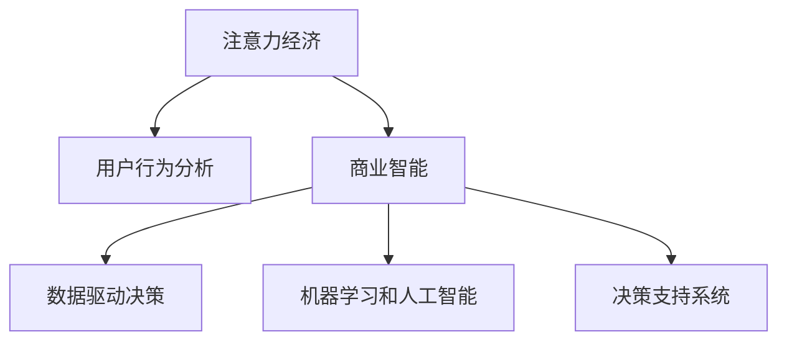
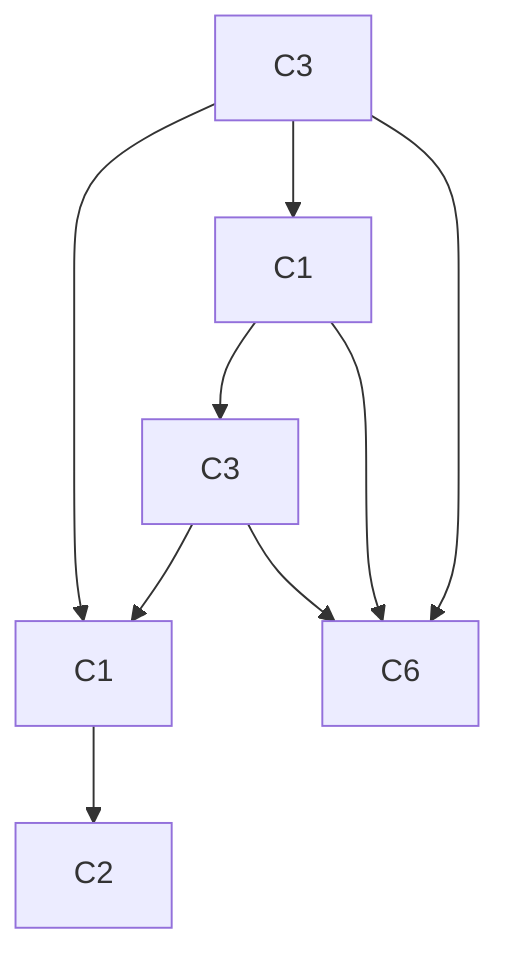

                 

# 注意力经济对企业决策过程的影响

> 关键词：注意力经济,企业决策,数据驱动,用户行为分析,商业智能,机器学习,人工智能,决策支持系统

## 1. 背景介绍

### 1.1 问题由来
随着信息时代的到来，人类社会的注意力资源日益稀缺，如何高效获取和利用注意力成为企业关注的焦点。这不仅关乎市场份额，更是影响企业竞争力的关键。传统的决策模式以经验为主导，依赖专家直觉，但在信息爆炸、数据复杂的环境下，这种模式显然无法满足现代企业决策的需求。

因此，企业决策过程中引入注意力经济的概念变得尤为重要。通过分析用户行为数据，捕捉消费者注意力焦点，企业能够更精准地理解市场需求，制定有效的市场策略。这不仅有助于提升产品销量，还能优化用户体验，增强品牌忠诚度。

### 1.2 问题核心关键点
注意力经济对企业决策过程的影响主要体现在以下几个方面：

- **用户行为分析**：通过数据分析工具，企业可以深入理解用户的行为习惯和偏好，从而制定更具针对性的营销策略。
- **资源优化配置**：利用注意力模型，企业能够更有效地配置资源，如广告投放、内容制作等，确保投资回报率最大化。
- **决策辅助支持**：引入机器学习和人工智能技术，为企业提供实时的数据驱动决策支持，提升决策的科学性和准确性。
- **品牌建设和维护**：通过分析消费者注意力分布，企业可以制定更具战略性的品牌建设策略，提升品牌影响力。

理解这些关键点，对于构建高效的企业决策体系至关重要。

### 1.3 问题研究意义
在信息时代，注意力资源成为企业竞争的关键。通过引入注意力经济的概念和方法，企业能够实现更科学、精准的决策，从而在激烈的市场竞争中占据有利位置。具体意义包括：

- **提升决策准确性**：通过数据分析，减少决策中的主观因素，提升决策的科学性和客观性。
- **优化资源配置**：确保资源被投放到最有价值的领域，最大化投资回报率。
- **增强品牌影响力**：精确捕捉消费者注意力，制定更具战略性的品牌建设策略。
- **加速创新进程**：通过数据分析，快速识别市场趋势和消费者需求，加速产品和服务创新。

本文将深入探讨注意力经济如何影响企业决策过程，并通过具体案例分析，展示其潜在的商业价值。

## 2. 核心概念与联系

### 2.1 核心概念概述

为更好地理解注意力经济对企业决策的影响，本节将介绍几个密切相关的核心概念：

- **注意力经济**：指在信息过载的环境下，企业如何通过分析用户注意力分布，优化资源配置，提升产品和服务价值的过程。
- **用户行为分析**：通过数据分析工具，理解用户的行为模式、偏好和需求，为产品和服务设计提供依据。
- **商业智能(BI)**：将数据转化为智能决策的工具，帮助企业从大量数据中提取有价值的信息，指导业务决策。
- **数据驱动决策**：基于数据分析和机器学习模型的决策方法，强调决策的客观性和科学性。
- **机器学习和人工智能**：利用算法和模型，自动化处理和分析大量数据，辅助企业进行高效决策。
- **决策支持系统(DSS)**：通过整合数据、算法和专家知识，为决策提供支持的系统。

这些核心概念之间的逻辑关系可以通过以下Mermaid流程图来展示：



这个流程图展示了几大核心概念之间的逻辑关系：

1. 注意力经济通过用户行为分析，捕捉消费者的注意力焦点。
2. 商业智能将用户行为数据转化为智能决策工具，辅助企业进行科学决策。
3. 数据驱动决策和机器学习/人工智能方法为商业智能提供技术支持，提升决策效率和准确性。
4. 决策支持系统整合了数据、算法和专家知识，提供全方位的决策支持。

这些概念共同构成了企业决策的逻辑框架，为企业提供了从数据分析到决策执行的全面解决方案。

## 3. 核心算法原理 & 具体操作步骤
### 3.1 算法原理概述

注意力经济对企业决策的影响，主要通过用户行为数据分析来实现。核心算法包括用户行为建模、注意力焦点捕捉、决策辅助等步骤。

### 3.2 算法步骤详解

**Step 1: 数据收集与预处理**
- 收集用户行为数据，如浏览记录、购买行为、社交媒体互动等。
- 对数据进行清洗和预处理，去除噪声和异常值，保证数据质量。

**Step 2: 用户行为建模**
- 使用聚类、分类等机器学习算法，对用户行为数据进行建模，识别出不同用户群体。
- 通过时间序列分析等方法，捕捉用户行为的变化趋势。

**Step 3: 注意力焦点捕捉**
- 利用信息检索、推荐系统等技术，分析用户注意力分布。
- 通过情感分析等方法，捕捉用户对产品或服务的情感倾向。

**Step 4: 决策辅助支持**
- 将注意力分析结果和用户行为数据整合，构建决策支持系统。
- 利用机器学习算法，预测用户行为和市场趋势，辅助企业进行决策。

### 3.3 算法优缺点

注意力经济在企业决策中的应用，具有以下优点：

1. **提升决策准确性**：通过数据驱动的方法，减少决策中的主观因素，提升决策的科学性和客观性。
2. **优化资源配置**：利用注意力模型，企业能够更有效地配置资源，确保投资回报率最大化。
3. **增强品牌影响力**：精确捕捉消费者注意力，制定更具战略性的品牌建设策略。
4. **加速创新进程**：通过数据分析，快速识别市场趋势和消费者需求，加速产品和服务创新。

同时，该方法也存在一定的局限性：

1. **数据质量依赖**：决策效果依赖于数据的质量和全面性，数据缺失或不准确会影响分析结果。
2. **算法复杂性**：构建决策支持系统需要复杂的算法和模型，对技术要求较高。
3. **隐私保护**：在分析用户数据时，需要严格遵守隐私保护法规，确保用户数据安全。

尽管存在这些局限性，但就目前而言，注意力经济在企业决策中的应用仍具有重要意义。未来相关研究的重点在于如何进一步降低算法复杂性，提高决策效率，同时兼顾隐私保护和数据质量。

### 3.4 算法应用领域

注意力经济对企业决策的影响，广泛适用于各个行业，具体包括：

- **零售业**：通过分析用户购物行为，优化库存管理、定价策略和促销活动。
- **金融业**：利用用户交易数据，预测市场趋势，制定投资和风险管理策略。
- **媒体行业**：分析用户观看行为，优化内容推荐和广告投放策略。
- **旅游业**：通过用户旅游行为分析，提升旅游产品和服务质量，优化营销策略。
- **电信业**：分析用户使用习惯，优化网络资源配置，提升用户满意度。

## 4. 数学模型和公式 & 详细讲解 & 举例说明（备注：数学公式请使用latex格式，latex嵌入文中独立段落使用 $$，段落内使用 $)
### 4.1 数学模型构建

本节将使用数学语言对注意力经济对企业决策的影响进行更加严格的刻画。

记用户行为数据为 $D=\{x_i\}_{i=1}^N$，其中 $x_i$ 为第 $i$ 个用户的浏览记录、购买记录等。目标是对用户群体进行聚类，识别出注意力焦点，并预测用户行为。

定义用户行为聚类模型为 $K$-means算法，目标函数为：

$$
\min_{\mathbf{C},\mathbf{W}} \sum_{i=1}^N\sum_{k=1}^K (x_i - \mathbf{C}_k)^2\mathbf{W}_{ik}
$$

其中 $\mathbf{C}$ 为聚类中心，$\mathbf{W}$ 为权重矩阵。在训练过程中，通过迭代更新 $\mathbf{C}$ 和 $\mathbf{W}$ 参数，使得聚类结果最小化上述目标函数。

### 4.2 公式推导过程

以用户聚类模型为例，推导其目标函数的优化过程。

记聚类中心为 $\mathbf{C}=[\mathbf{c}_1, \mathbf{c}_2, ..., \mathbf{c}_K]$，权重矩阵为 $\mathbf{W}=[\mathbf{w}_1, \mathbf{w}_2, ..., \mathbf{w}_K]$。目标函数可以重写为：

$$
\min_{\mathbf{C},\mathbf{W}} \sum_{i=1}^N \sum_{k=1}^K (\mathbf{x}_i - \mathbf{c}_k)^2 \mathbf{w}_{ik}
$$

令 $\mathbf{M}=\sum_{i=1}^N \mathbf{x}_i\mathbf{w}_{ik}$，则目标函数变为：

$$
\min_{\mathbf{C},\mathbf{W}} \sum_{k=1}^K ||\mathbf{M}-\mathbf{c}_k||^2_F + \sum_{i=1}^N \mathbf{w}_{ik}
$$

其中 $||.||_F$ 表示矩阵的 Frobenius 范数。对 $\mathbf{C}$ 和 $\mathbf{W}$ 分别求导，得：

$$
\frac{\partial \mathcal{L}}{\partial \mathbf{C}} = \sum_{k=1}^K \mathbf{M} - \sum_{i=1}^N \mathbf{x}_i \mathbf{w}_{ik}
$$

$$
\frac{\partial \mathcal{L}}{\partial \mathbf{W}} = -\sum_{i=1}^N \mathbf{x}_i - \sum_{k=1}^K \mathbf{c}_k
$$

根据上述导数，更新 $\mathbf{C}$ 和 $\mathbf{W}$ 参数，即完成了用户聚类模型的训练。

### 4.3 案例分析与讲解

假设某电商平台通过用户浏览记录和购买行为数据，使用 K-means 算法对用户进行聚类。设用户数为 $N=1000$，聚类数为 $K=3$。通过训练，得到聚类中心 $\mathbf{C}=[\mathbf{c}_1, \mathbf{c}_2, \mathbf{c}_3]$ 和权重矩阵 $\mathbf{W}=[\mathbf{w}_1, \mathbf{w}_2, \mathbf{w}_3]$。

具体步骤如下：
1. 随机初始化聚类中心 $\mathbf{C}^{(0)}$ 和权重矩阵 $\mathbf{W}^{(0)}$。
2. 重复迭代 $T$ 次，每次更新 $\mathbf{C}$ 和 $\mathbf{W}$：
   - 根据当前聚类中心 $\mathbf{C}^{(t)}$ 计算权重矩阵 $\mathbf{W}^{(t)}$。
   - 更新聚类中心 $\mathbf{C}^{(t+1)}$。
3. 得到最终聚类结果和权重矩阵。

以用户聚类为例，绘制聚类结果和权重矩阵，可以看出用户主要分为三种类型，权重矩阵显示了不同类型用户在总用户中的占比。



## 5. 项目实践：代码实例和详细解释说明
### 5.1 开发环境搭建

在进行注意力经济对企业决策影响的实践前，我们需要准备好开发环境。以下是使用Python进行K-means聚类的环境配置流程：

1. 安装Anaconda：从官网下载并安装Anaconda，用于创建独立的Python环境。

2. 创建并激活虚拟环境：
```bash
conda create -n clustering-env python=3.8 
conda activate clustering-env
```

3. 安装必要的Python包：
```bash
conda install numpy scipy scikit-learn
```

4. 安装Jupyter Notebook：
```bash
conda install jupyterlab
```

完成上述步骤后，即可在`clustering-env`环境中开始项目实践。

### 5.2 源代码详细实现

下面以用户聚类为例，给出使用K-means算法进行聚类的Python代码实现。

首先，定义K-means聚类函数：

```python
from sklearn.cluster import KMeans
import numpy as np

def kmeans_clustering(data, k):
    model = KMeans(n_clusters=k, random_state=42)
    model.fit(data)
    return model.labels_, model.cluster_centers_

# 数据准备
data = np.random.randn(1000, 2)  # 生成随机数据
k = 3  # 聚类数

labels, centers = kmeans_clustering(data, k)
```

接着，可视化聚类结果：

```python
import matplotlib.pyplot as plt

plt.scatter(data[:, 0], data[:, 1], c=labels, s=50, cmap='viridis')
plt.scatter(centers[:, 0], centers[:, 1], c='red', s=200, marker='x')
plt.show()
```

最后，展示聚类结果和权重矩阵：

```python
print(f"聚类结果：{labels}")
print(f"聚类中心：\n{centers}")
```

以上就是使用K-means算法进行用户聚类的完整代码实现。可以看到，通过K-means聚类，我们能够将用户分为不同类型，并计算出不同类型用户的权重。这些信息可以用于优化资源配置、制定用户行为预测等。

### 5.3 代码解读与分析

让我们再详细解读一下关键代码的实现细节：

**K-means函数定义**：
- 使用`sklearn.cluster.KMeans`库定义K-means聚类模型。
- `n_clusters`参数指定聚类数，`random_state`参数设置随机种子，确保结果的可重复性。
- `fit`方法进行聚类训练，返回聚类标签和聚类中心。

**数据准备**：
- 生成随机数据集，每行代表一个用户，两列为用户特征。
- 聚类数`k`根据具体应用场景设定，这里我们设定为3。

**聚类结果可视化**：
- 使用`matplotlib`库绘制散点图，将不同类型用户标记为不同的颜色。
- 在聚类中心绘制红色叉号，表示聚类中心的位置。

**结果展示**：
- 输出聚类标签和聚类中心，用于后续的决策支持。

可以看到，通过K-means聚类，我们可以有效地将用户分为不同类型，并计算出不同类型用户的权重。这些信息可以用于优化资源配置、制定用户行为预测等，从而为企业的决策提供支持。

## 6. 实际应用场景
### 6.1 零售业

在零售业中，企业通过分析用户购物行为，优化库存管理、定价策略和促销活动。具体应用如下：

**案例1: 库存管理优化**

某电商平台通过K-means聚类，将用户分为高频用户、中频用户和低频用户三类。根据不同类型用户的购买频率，优化库存管理和补货策略。对于高频用户，提前准备充足的库存；对于中频用户，根据购买周期进行补货；对于低频用户，减少库存占用，避免积压。

**案例2: 个性化推荐**

通过聚类和注意力分析，电商平台能够精确捕捉用户对不同商品的注意力分布。结合用户的购买历史和浏览记录，为用户提供个性化的商品推荐，提高用户满意度和转化率。

**案例3: 促销活动设计**

通过用户聚类和注意力分析，电商平台能够识别出不同类型用户的偏好和需求。针对不同用户群体，设计有针对性的促销活动，提升活动效果和用户参与度。

### 6.2 金融业

在金融业中，企业利用用户交易数据，预测市场趋势，制定投资和风险管理策略。具体应用如下：

**案例1: 市场趋势预测**

某金融机构通过K-means聚类，将用户分为保守型、平衡型和激进型三类。结合用户交易数据和市场动态，预测不同类型用户的投资偏好和风险承受能力。通过模型训练，预测未来市场趋势，制定相应的投资策略。

**案例2: 风险管理**

通过用户聚类和注意力分析，金融机构能够识别出高风险用户和潜在风险事件。结合用户交易行为和市场动态，制定风险预警和应对策略，降低潜在风险。

### 6.3 媒体行业

在媒体行业，企业通过分析用户观看行为，优化内容推荐和广告投放策略。具体应用如下：

**案例1: 内容推荐**

某视频平台通过K-means聚类，将用户分为不同兴趣群体。结合用户观看历史和注意力分布，为用户推荐个性化内容，提高用户观看体验和粘性。

**案例2: 广告投放**

通过用户聚类和注意力分析，视频平台能够识别出不同类型用户的观看偏好和注意力焦点。结合广告素材和用户数据，制定有针对性的广告投放策略，提升广告效果和用户参与度。

### 6.4 未来应用展望

随着注意力经济的发展，未来将有更多行业引入数据驱动的决策方法。以下是对未来应用场景的展望：

**智能制造**

在智能制造领域，企业通过分析设备运行数据和工人操作行为，优化生产流程和设备维护策略。通过用户行为建模和注意力分析，预测设备故障和工人操作失误，提前采取措施，降低生产成本和事故风险。

**智慧城市**

在智慧城市治理中，通过分析市民的出行行为和社交媒体互动，优化交通管理和城市规划。结合市民的偏好和注意力焦点，制定智能交通信号、公共设施布局等策略，提升城市管理效率和市民满意度。

**农业**

在农业生产中，通过分析土壤数据和作物生长行为，优化种植方案和病虫害防治策略。结合传感器数据和用户行为分析，预测作物生长趋势和病虫害风险，提前采取措施，提高农业生产效率和产量。

## 7. 工具和资源推荐
### 7.1 学习资源推荐

为了帮助开发者系统掌握注意力经济对企业决策的影响，这里推荐一些优质的学习资源：

1. 《机器学习实战》（Hands-On Machine Learning with Scikit-Learn, Keras, and TensorFlow）：斯坦福大学教授开发的经典机器学习教材，涵盖机器学习基础和实际应用案例，包括K-means聚类算法。

2. Coursera《数据科学专业证书》课程：由斯坦福大学和IBM联合开发的课程，涵盖数据科学基础和高级应用，包括用户行为分析、机器学习模型等。

3. Kaggle平台：提供丰富的数据集和竞赛活动，通过实践项目提升数据处理和建模能力，深入理解注意力经济对企业决策的影响。

4. Udacity《人工智能纳米学位》课程：提供系统学习人工智能技术的机会，涵盖机器学习、深度学习、自然语言处理等多个领域，为未来的职业发展奠定坚实基础。

5. Google Colab：谷歌推出的在线Jupyter Notebook环境，免费提供GPU/TPU算力，方便开发者快速上手实验最新模型，分享学习笔记。

通过对这些资源的学习实践，相信你一定能够快速掌握注意力经济对企业决策的影响，并用于解决实际的商业问题。

### 7.2 开发工具推荐

高效的开发离不开优秀的工具支持。以下是几款用于注意力经济对企业决策影响开发的常用工具：

1. Python：编程语言，灵活易用，适合数据处理和机器学习建模。

2. K-means算法库：`scikit-learn`库中的`KMeans`类，提供丰富的聚类参数和优化方法，适合解决用户行为聚类问题。

3. Jupyter Notebook：交互式编程环境，支持代码实现和结果展示，适合进行数据分析和可视化。

4. Google Colab：提供免费的GPU和TPU资源，方便开发者进行模型训练和实验，支持代码实现和结果展示。

5. TensorFlow：开源机器学习框架，支持深度学习和分布式计算，适合构建复杂的决策支持系统。

6. PyTorch：深度学习框架，支持动态计算图和高效优化，适合进行复杂的机器学习建模。

合理利用这些工具，可以显著提升注意力经济对企业决策影响的应用开发效率，加速创新迭代的步伐。

### 7.3 相关论文推荐

注意力经济对企业决策的影响，在学界和业界都有广泛研究。以下是几篇奠基性的相关论文，推荐阅读：

1. "A Survey on K-means Clustering Algorithm"（《K-means聚类算法综述》）：总结了K-means聚类的原理、算法变种和应用案例，适合理解聚类技术的基本原理。

2. "Clustering using K-means algorithm: A comprehensive review"（《使用K-means算法进行聚类：全面回顾》）：详细介绍了K-means聚类的优缺点和应用场景，适合深入理解聚类算法的局限性和优化方法。

3. "Data-Driven Business Intelligence: The Economics of Attention"（《数据驱动的商业智能：注意力经济》）：探讨了注意力经济在企业决策中的应用，适合理解数据驱动决策的实际效果和影响。

4. "Attention Is All You Need"（《Attention is All You Need》）：Transformer模型的原始论文，奠定了注意力机制在自然语言处理中的基础，适合理解注意力机制的基本原理和应用。

5. "BERT: Pre-training of Deep Bidirectional Transformers for Language Understanding"（《BERT: 基于双向Transformer的深度预训练语言理解》）：BERT模型的原始论文，介绍了预训练语言模型在自然语言处理中的应用，适合理解预训练语言模型的原理和效果。

这些论文代表了大规模用户行为分析和注意力经济研究的最新进展，通过学习这些前沿成果，可以帮助研究者把握学科前进方向，激发更多的创新灵感。

## 8. 总结：未来发展趋势与挑战
### 8.1 总结

本文对注意力经济对企业决策的影响进行了全面系统的介绍。首先阐述了注意力经济在现代企业决策中的重要性和实际应用，明确了用户行为分析、商业智能、数据驱动决策等关键概念。其次，从原理到实践，详细讲解了K-means聚类算法的数学原理和具体实现步骤，给出了代码实例和详细解释说明。同时，本文还广泛探讨了注意力经济在零售、金融、媒体等行业的实际应用场景，展示了其潜在的商业价值。此外，本文精选了注意力经济领域的学习资源、开发工具和相关论文，力求为读者提供全方位的技术指引。

通过本文的系统梳理，可以看到，注意力经济在企业决策中的应用前景广阔，能够通过数据分析和机器学习技术，提升决策的科学性和准确性。未来，伴随技术的不断进步和算法的优化，注意力经济必将进一步拓展其应用范围，成为企业决策过程中不可或缺的重要工具。

### 8.2 未来发展趋势

展望未来，注意力经济的发展趋势主要体现在以下几个方面：

1. **技术进步**：随着机器学习和人工智能技术的不断进步，注意力经济的实现将更加高效和智能化。未来的聚类算法和注意力模型将具备更强的自适应能力和鲁棒性。

2. **多模态数据融合**：除了文本数据，未来的注意力经济还将拓展到图像、视频、音频等多模态数据。通过多模态数据的整合，模型能够更全面地理解用户行为和需求，提升决策的准确性和全面性。

3. **个性化和定制化**：未来企业将更加注重个性化和定制化的决策方案。通过更精准的用户行为分析，提供更具针对性的产品和服务，满足用户的个性化需求。

4. **实时性和动态性**：未来的决策支持系统将具备更高的实时性和动态性，能够快速响应市场变化和用户需求，提供实时的决策支持和优化建议。

5. **智能决策系统**：通过整合机器学习、人工智能和大数据分析技术，未来的企业决策系统将更加智能和高效，能够自动生成决策方案，并提供多场景下的优化建议。

### 8.3 面临的挑战

尽管注意力经济在企业决策中的应用前景广阔，但在实际落地过程中，仍面临诸多挑战：

1. **数据质量问题**：数据的质量直接影响注意力经济的效果。数据缺失、噪声和不一致等问题，可能导致决策结果不准确。

2. **算法复杂性**：构建高效的决策支持系统，需要复杂的算法和模型，对技术要求较高，开发和维护成本较高。

3. **隐私保护**：在分析用户数据时，需要严格遵守隐私保护法规，确保用户数据安全，避免数据泄露和滥用。

4. **跨领域适应性**：不同行业的用户行为和决策需求存在较大差异，单一的注意力经济模型难以应对复杂多变的场景。

5. **模型解释性**：机器学习模型的决策过程往往缺乏可解释性，难以满足监管和用户对决策透明度的要求。

6. **实时性和响应速度**：实时决策系统需要高效率的算法和高效的计算资源，以满足快速响应的需求。

这些挑战需要在技术创新和实践优化中不断克服，才能实现注意力经济在企业决策中的全面应用。

### 8.4 研究展望

未来，注意力经济在企业决策中的应用将更加深入和广泛，以下是对未来研究方向的展望：

1. **多模态数据分析**：未来企业将引入多模态数据分析技术，整合图像、视频、音频等多种数据，提升决策的全面性和准确性。

2. **智能决策系统**：结合机器学习、人工智能和大数据分析技术，构建更加智能和高效的决策支持系统，支持实时决策和动态优化。

3. **跨领域应用**：开发适用于不同行业的通用注意力经济模型，提升模型的跨领域适应性和可扩展性。

4. **模型解释性**：提升机器学习模型的可解释性，增强决策过程的透明度和可信度。

5. **隐私保护**：研究如何在保障用户隐私的前提下，实现高效的数据分析和管理。

6. **实时性优化**：优化计算资源和算法设计，提升决策系统的响应速度和实时性。

通过在这些方向的探索研究，相信注意力经济将进一步拓展其应用边界，成为企业决策过程中不可或缺的重要工具。面向未来，需要进一步推动技术的进步和优化，才能实现注意力经济在更广泛领域的应用。

## 9. 附录：常见问题与解答

**Q1：注意力经济对企业决策的影响有哪些？**

A: 注意力经济通过分析用户行为数据，捕捉消费者注意力焦点，企业能够更精准地理解市场需求，制定有效的市场策略。具体影响包括：

1. **提升决策准确性**：通过数据驱动的方法，减少决策中的主观因素，提升决策的科学性和客观性。
2. **优化资源配置**：利用注意力模型，企业能够更有效地配置资源，确保投资回报率最大化。
3. **增强品牌影响力**：精确捕捉消费者注意力，制定更具战略性的品牌建设策略。
4. **加速创新进程**：通过数据分析，快速识别市场趋势和消费者需求，加速产品和服务创新。

**Q2：注意力经济在实际应用中需要注意哪些问题？**

A: 注意力经济在实际应用中需要注意以下几个问题：

1. **数据质量问题**：数据的质量直接影响注意力经济的效果。数据缺失、噪声和不一致等问题，可能导致决策结果不准确。
2. **算法复杂性**：构建高效的决策支持系统，需要复杂的算法和模型，对技术要求较高，开发和维护成本较高。
3. **隐私保护**：在分析用户数据时，需要严格遵守隐私保护法规，确保用户数据安全，避免数据泄露和滥用。
4. **跨领域适应性**：不同行业的用户行为和决策需求存在较大差异，单一的注意力经济模型难以应对复杂多变的场景。
5. **模型解释性**：机器学习模型的决策过程往往缺乏可解释性，难以满足监管和用户对决策透明度的要求。
6. **实时性和响应速度**：实时决策系统需要高效率的算法和高效的计算资源，以满足快速响应的需求。

**Q3：如何构建高效的注意力经济对企业决策的支持系统？**

A: 构建高效的注意力经济对企业决策的支持系统，需要以下步骤：

1. **数据收集与预处理**：收集用户行为数据，如浏览记录、购买行为、社交媒体互动等，对数据进行清洗和预处理，去除噪声和异常值，保证数据质量。
2. **用户行为建模**：使用聚类、分类等机器学习算法，对用户行为数据进行建模，识别出不同用户群体。
3. **注意力焦点捕捉**：利用信息检索、推荐系统等技术，分析用户注意力分布。
4. **决策辅助支持**：将注意力分析结果和用户行为数据整合，构建决策支持系统。
5. **模型优化与评估**：使用模型评估指标，如准确率、召回率、F1值等，对模型效果进行评估和优化。

**Q4：注意力经济在哪些行业有应用前景？**

A: 注意力经济在多个行业具有广泛的应用前景，具体包括：

1. **零售业**：通过分析用户购物行为，优化库存管理、定价策略和促销活动。
2. **金融业**：利用用户交易数据，预测市场趋势，制定投资和风险管理策略。
3. **媒体行业**：通过分析用户观看行为，优化内容推荐和广告投放策略。
4. **智能制造**：通过分析设备运行数据和工人操作行为，优化生产流程和设备维护策略。
5. **智慧城市**：通过分析市民的出行行为和社交媒体互动，优化交通管理和城市规划。

**Q5：注意力经济在实际应用中需要注意哪些挑战？**

A: 注意力经济在实际应用中需要注意以下几个挑战：

1. **数据质量问题**：数据的质量直接影响注意力经济的效果。数据缺失、噪声和不一致等问题，可能导致决策结果不准确。
2. **算法复杂性**：构建高效的决策支持系统，需要复杂的算法和模型，对技术要求较高，开发和维护成本较高。
3. **隐私保护**：在分析用户数据时，需要严格遵守隐私保护法规，确保用户数据安全，避免数据泄露和滥用。
4. **跨领域适应性**：不同行业的用户行为和决策需求存在较大差异，单一的注意力经济模型难以应对复杂多变的场景。
5. **模型解释性**：机器学习模型的决策过程往往缺乏可解释性，难以满足监管和用户对决策透明度的要求。
6. **实时性和响应速度**：实时决策系统需要高效率的算法和高效的计算资源，以满足快速响应的需求。

通过以上问题的解答，希望能够帮助读者更好地理解和应用注意力经济对企业决策的影响。

