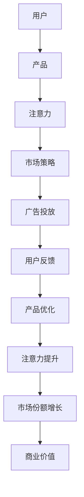

                 

# 注意力经济对企业组织结构的影响

在数字化和信息化的浪潮下，全球经济格局正在发生根本性变化。特别是大数据和人工智能技术的应用，使注意力成为了一种宝贵的资源，企业组织结构也随之发生了深刻变革。本文将探讨注意力经济的背景、核心概念，以及其对企业组织结构的具体影响。

## 1. 背景介绍

### 1.1 数字化转型

数字化转型是当前企业发展的核心方向，通过大数据、云计算、物联网等技术的应用，企业能够实现信息的高效采集、存储和处理。然而，在数字化浪潮中，信息洪流使得企业需要面对“信息过载”的挑战，即信息量激增，但真正有价值的信息反而难以被及时识别和处理。

### 1.2 注意力经济兴起

在这样的背景下，注意力经济应运而生。注意力经济是指，在信息过载的环境下，企业需要以用户的注意力为资本，通过精准的市场定位、优质的产品和服务，吸引并保持用户的注意力，以实现商业价值的最大化。

## 2. 核心概念与联系

### 2.1 核心概念概述

注意力经济的核心在于如何有效分配和管理注意力资源，以实现商业目标。以下是几个关键概念：

- **注意力**：用户的关注点，是企业获得市场份额的关键。
- **注意力分配**：如何合理分配注意力资源，确保重要信息能够被优先处理。
- **注意力经济**：基于注意力资源的经济活动，如社交媒体营销、广告投放等。
- **用户注意力**：用户在使用产品或服务时的注意程度和持续度，直接影响用户满意度。

这些概念之间通过以下方式相联系：

- 用户注意力是注意力经济的核心，影响企业的市场策略和产品设计。
- 注意力分配是实现用户注意力的关键，通过优化产品体验和营销手段，提升用户注意力。
- 注意力经济通过吸引和保持用户注意力，创造商业价值。

### 2.2 核心概念原理和架构的 Mermaid 流程图



这个流程图展示了注意力经济的基本流程：用户通过产品吸引注意力，通过市场策略和广告投放保持注意力，用户反馈促使产品优化，进而提升注意力，最终实现市场份额和商业价值的增长。

## 3. 核心算法原理 & 具体操作步骤

### 3.1 算法原理概述

注意力经济的核心算法是注意力分配算法，即如何通过优化算法，将有限的注意力资源分配给最有价值的信息或任务。这里的“价值”可以是点击率、转化率、用户停留时间等关键指标。

注意力分配算法通常基于以下几个原理：

- **个性化推荐**：通过分析用户的兴趣和行为数据，推荐最相关的信息，提升用户满意度。
- **动态调整**：根据实时数据和用户反馈，动态调整注意力分配策略，确保信息的时效性和准确性。
- **强化学习**：通过不断优化算法，逐步提升注意力分配的精确度，实现自动化的最优分配。

### 3.2 算法步骤详解

以下是一个典型的注意力分配算法的详细步骤：

**Step 1: 数据收集**
- 收集用户行为数据，如浏览记录、点击行为、购买记录等。
- 收集系统数据，如页面访问量、广告点击率等。

**Step 2: 特征提取**
- 对用户行为数据和系统数据进行特征提取，生成用户兴趣模型和系统资源模型。
- 通过特征工程，构建用户行为与注意力价值的相关性矩阵。

**Step 3: 注意力模型训练**
- 选择合适的算法模型，如协同过滤、深度学习等，对用户行为和系统数据进行训练，生成注意力分配模型。
- 对模型进行评估和优化，确保其准确性和实时性。

**Step 4: 注意力分配**
- 将注意力分配模型应用于实时数据流，计算每个信息和任务的注意力权重。
- 根据注意力权重进行信息优先级排序，优先处理最重要和最紧急的信息。

**Step 5: 反馈与优化**
- 收集用户的反馈数据，如点击率、转化率等，评估注意力分配的效果。
- 根据反馈数据，调整注意力分配模型，持续优化注意力分配策略。

### 3.3 算法优缺点

#### 3.3.1 优点

- **提升效率**：通过精准的注意力分配，提升信息处理的效率和效果。
- **个性化服务**：根据用户行为和兴趣，提供个性化的推荐和服务，提升用户满意度。
- **动态优化**：根据实时数据和用户反馈，动态调整注意力分配策略，保持最优状态。

#### 3.3.2 缺点

- **数据依赖**：算法的准确性和效果高度依赖于数据的质量和完整性。
- **复杂度较高**：算法模型训练和优化需要较高的计算资源和专业技能。
- **隐私问题**：在收集和处理用户数据时，需要注意隐私保护和数据安全。

### 3.4 算法应用领域

注意力分配算法在多个领域中得到了广泛应用，如：

- **电商**：通过个性化推荐和动态调整，提升用户体验和销售转化率。
- **社交媒体**：通过精准的广告投放和内容推送，提升用户粘性和平台活跃度。
- **金融**：通过实时监控和动态调整，保障交易安全和用户权益。
- **医疗**：通过智能诊断和个性化治疗，提高医疗服务质量和效率。

## 4. 数学模型和公式 & 详细讲解 & 举例说明

### 4.1 数学模型构建

注意力分配模型通常基于矩阵分解和深度学习技术，构建用户行为与系统资源的相关性矩阵，并映射到注意力权重向量。

假设用户行为数据为 $X$，系统数据为 $Y$，注意力分配模型为 $W$，则注意力分配问题可以表示为：

$$
\min_{W} \| XW - Y \|
$$

其中 $W$ 为注意力分配权重矩阵，$\| \cdot \|$ 表示矩阵的范数。

### 4.2 公式推导过程

以协同过滤算法为例，其基本思想是通过分析用户与物品的共现数据，推断用户对物品的评分预测，并根据预测评分进行推荐。协同过滤算法的核心公式为：

$$
\hat{I} = \alpha \frac{I^T}{\sqrt{I^T I} + \epsilon} + (1 - \alpha) \frac{J^T}{\sqrt{J^T J} + \epsilon}
$$

其中 $I$ 和 $J$ 分别表示用户对物品的评分矩阵和物品的评分向量，$\alpha$ 为正则化参数，$\epsilon$ 为避免除以零的小数。

### 4.3 案例分析与讲解

假设某电商平台的个性化推荐系统，收集了用户浏览商品的历史数据和点击行为，构建了用户兴趣模型 $U$ 和商品资源模型 $P$。通过矩阵分解算法，得到用户兴趣与商品资源的协方差矩阵 $C$。进一步计算得到注意力分配权重矩阵 $W$，从而得到每个商品的推荐权重。

## 5. 项目实践：代码实例和详细解释说明

### 5.1 开发环境搭建

为进行注意力分配算法的项目实践，需要以下开发环境：

- Python：作为编程语言，需要安装Pandas、NumPy、Scikit-learn等数据科学库。
- TensorFlow或PyTorch：作为深度学习框架，需要安装TensorFlow或PyTorch，并配置好GPU加速。
- Jupyter Notebook：作为交互式编程环境，便于快速迭代实验。

### 5.2 源代码详细实现

以下是一个基于TensorFlow的注意力分配算法的Python代码实现：

```python
import tensorflow as tf
import numpy as np
import pandas as pd

# 加载用户行为数据和商品数据
user_data = pd.read_csv('user_behavior.csv')
item_data = pd.read_csv('item_data.csv')

# 构建用户兴趣模型和商品资源模型
user_interest = pd.DataFrame(user_data['user_id'].value_counts()).T.to_numpy()
item_resources = pd.DataFrame(item_data['item_id'].value_counts()).T.to_numpy()

# 计算协方差矩阵
C = np.dot(user_interest, item_resources.T)

# 定义注意力分配模型
W = tf.Variable(tf.random.normal([len(user_interest), len(item_resources)]))

# 计算注意力权重矩阵
attention_weights = tf.nn.softmax(tf.matmul(user_interest, W), axis=1)

# 计算推荐权重
recommendation_weights = tf.matmul(item_resources, attention_weights)

# 训练模型
with tf.GradientTape() as tape:
    loss = tf.reduce_mean(tf.square(recommendation_weights - item_resources))
gradients = tape.gradient(loss, W)
optimizer = tf.optimizers.Adam()
optimizer.apply_gradients(zip(gradients, W))

# 输出推荐权重
print(recommendation_weights)
```

### 5.3 代码解读与分析

代码首先加载用户行为数据和商品数据，构建用户兴趣模型和商品资源模型。然后通过计算协方差矩阵，得到用户兴趣与商品资源的协方差矩阵 $C$。接着定义注意力分配模型 $W$，并计算注意力权重矩阵 $attention_weights$。最后通过训练模型，更新注意力分配权重，并输出推荐权重。

## 6. 实际应用场景

### 6.1 电商个性化推荐

电商平台的个性化推荐系统，通过分析用户的历史浏览、点击、购买行为，计算每个商品对每个用户的注意力权重，实现精准推荐，提升用户体验和销售额。

### 6.2 社交媒体内容推送

社交媒体平台通过分析用户的点赞、评论、分享行为，计算每个内容对每个用户的注意力权重，进行智能推送，提高用户粘性和平台活跃度。

### 6.3 金融交易监控

金融交易平台通过实时监控用户的交易数据，计算每个交易事件对每个用户的注意力权重，进行动态预警和风险管理，保障用户交易安全。

### 6.4 医疗智能诊断

医疗平台通过分析病人的就诊记录和医生诊断结果，计算每个症状对每个病人的注意力权重，进行智能诊断和治疗推荐，提高医疗服务质量和效率。

## 7. 工具和资源推荐

### 7.1 学习资源推荐

为了深入理解注意力经济和注意力分配算法，以下是一些推荐的资源：

1. 《数据科学与机器学习》书籍：详细介绍数据科学和机器学习的基础知识，涵盖数据预处理、特征工程、模型训练等环节。
2. TensorFlow官方文档：提供详细的TensorFlow教程和示例代码，适合初学者入门。
3. Coursera深度学习课程：由斯坦福大学教授Andrew Ng主讲，深入浅出地讲解深度学习的基础理论和实践技巧。
4. Kaggle数据科学竞赛平台：提供大量的数据集和竞赛题目，适合实战练习和经验积累。

### 7.2 开发工具推荐

以下是一些推荐的开发工具：

1. Jupyter Notebook：作为交互式编程环境，适合快速迭代和实验。
2. PyCharm：作为Python IDE，支持自动补全、代码调试等功能，提升开发效率。
3. TensorFlow和PyTorch：作为深度学习框架，提供高效的计算图和模型训练功能。
4. TensorBoard：作为TensorFlow配套的可视化工具，帮助开发者监控模型训练状态。

### 7.3 相关论文推荐

以下是一些推荐的关注论文：

1. Attention is All You Need：提出Transformer模型，是注意力机制的重要里程碑。
2. Large-Scale Parallel Implicit Collaborative Filtering：提出Parafac模型，解决大规模协同过滤问题。
3. Matrix Factorization Techniques for Recommender Systems：详细介绍矩阵分解算法的理论基础和应用实践。
4. Deep Collaborative Filtering with Tensorflow：提供基于TensorFlow的协同过滤算法实现，适合实战练习。

## 8. 总结：未来发展趋势与挑战

### 8.1 研究成果总结

本文系统探讨了注意力经济和注意力分配算法的基本原理和应用场景。通过理论分析和技术实现，展示了注意力分配算法在电商、社交媒体、金融、医疗等多个领域的实际应用。

### 8.2 未来发展趋势

未来，注意力经济和注意力分配算法将呈现以下趋势：

1. 算法融合：更多算法融合技术将被应用于注意力分配，如深度学习与协同过滤的结合，提升模型的精确度和鲁棒性。
2. 实时化处理：随着实时计算和大数据技术的发展，注意力分配将能够实时处理海量数据，提升信息的时效性和准确性。
3. 跨领域应用：注意力分配算法将更多应用于跨领域的场景，如智能家居、智能交通等，实现全面智能化。

### 8.3 面临的挑战

尽管注意力分配算法已经取得一定的成果，但在实际应用中也面临以下挑战：

1. 数据质量和隐私保护：数据质量和隐私问题是注意力分配算法面临的主要挑战，需要加强数据清洗和隐私保护。
2. 计算资源限制：大规模数据集和复杂模型需要大量的计算资源，如何优化算法，降低计算成本，是一个重要的研究方向。
3. 动态变化：用户行为和市场环境是动态变化的，如何适应变化，保持算法的稳定性和有效性，是一个关键问题。

### 8.4 研究展望

未来，针对以上挑战，需要从以下几个方面进行深入研究：

1. 数据质量提升：通过数据清洗、数据增强等技术，提升数据质量和完整性。
2. 计算效率优化：通过模型压缩、并行计算等技术，降低计算资源消耗，提升计算效率。
3. 模型动态化：通过自适应学习、强化学习等技术，提升模型对动态变化的适应性。
4. 跨模态融合：将视觉、语音、文本等多模态数据融合，提升信息的全面性和准确性。

## 9. 附录：常见问题与解答

**Q1: 如何优化注意力分配算法？**

A: 优化注意力分配算法可以从以下几个方面入手：

1. 数据预处理：通过数据清洗、特征工程等技术，提升数据质量和完整性。
2. 算法融合：结合多种算法，如协同过滤、深度学习等，提升算法的精确度和鲁棒性。
3. 实时计算：通过分布式计算、流计算等技术，实现实时处理海量数据，提升信息的时效性和准确性。
4. 模型压缩：通过模型剪枝、量化等技术，降低模型复杂度，提升计算效率。

**Q2: 注意力分配算法在电商推荐中有什么优势？**

A: 在电商推荐中，注意力分配算法具有以下优势：

1. 个性化推荐：通过分析用户行为数据，生成个性化推荐，提升用户体验和销售转化率。
2. 动态调整：根据实时数据和用户反馈，动态调整推荐策略，提高推荐效果。
3. 效果评估：通过设置点击率、转化率等指标，评估推荐效果，实现闭环优化。

**Q3: 注意力分配算法在医疗诊断中有哪些应用？**

A: 在医疗诊断中，注意力分配算法可以有以下应用：

1. 智能诊断：通过分析病人的就诊记录和医生诊断结果，计算每个症状对每个病人的注意力权重，进行智能诊断和治疗推荐。
2. 病例分析：通过分析大量病例数据，计算每个症状对每个病人的注意力权重，进行病例分析和治疗方案优化。
3. 风险预警：通过实时监控病人的健康数据，计算每个症状对每个病人的注意力权重，进行风险预警和动态调整。

---

作者：禅与计算机程序设计艺术 / Zen and the Art of Computer Programming

