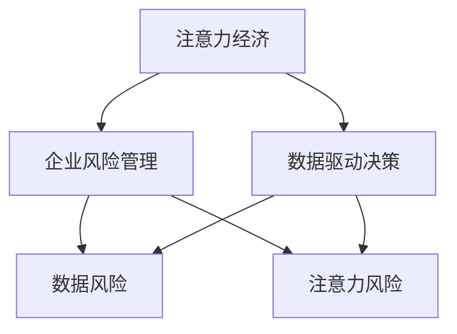

                 

# 注意力经济对企业风险管理的影响

## 1. 背景介绍

随着数字化转型进程的加速，企业越来越依赖于数据驱动的决策，而数据往往伴随着显著的经济成本。数据采集、存储、分析和应用都需要大量的时间和资源投入。但与此同时，数据质量、数据隐私和数据安全等风险也日益突出。这使得企业在追求数据效益的同时，不得不在风险管理上投入更多精力。在这一背景下，注意力经济应运而生，成为企业风险管理的新视角。

### 1.1 数据驱动决策的兴起

21世纪以来，数据驱动的决策逐渐取代了经验决策。借助大数据和人工智能技术，企业可以更快、更准确地做出决策。然而，数据驱动的决策并非没有风险，数据获取、存储和处理过程中都可能引入风险。因此，理解数据驱动决策过程中的风险，并采取相应措施进行风险管理，成为了企业不可忽视的重要任务。

### 1.2 注意力经济的出现

注意力经济（Economy of Attention）是20世纪末由加拿大经济学家Vincent Mosco提出的概念，指信息时代经济活动中注意力资源的稀缺性所带来的经济效应。在数据驱动决策的背景下，企业不仅需要获取和利用数据，更需要妥善管理和保护这些数据，以最大化其经济价值，同时最小化潜在风险。

## 2. 核心概念与联系

### 2.1 核心概念概述

为更好地理解注意力经济在企业风险管理中的作用，本节将介绍几个关键概念及其关系。

- **注意力经济（Economy of Attention）**：指信息时代注意力资源的重要性，强调在数字化转型中，如何高效、有效地利用注意力资源，创造经济价值。
- **数据驱动决策（Data-Driven Decision Making）**：基于数据进行决策的过程，通过分析数据，预测趋势，辅助决策。
- **企业风险管理（Corporate Risk Management）**：企业为应对潜在风险而采取的一系列预防、控制和应对措施，包括风险识别、评估、管理和监控等环节。
- **数据风险（Data Risk）**：数据采集、存储、处理和应用过程中可能出现的各类风险，如数据泄露、数据篡改、数据滥用等。
- **注意力风险（Attention Risk）**：在数据驱动决策中，由于注意力资源分配不合理或误用而引入的风险。

这些概念之间的关系可以通过以下Mermaid流程图来展示：



这个流程图展示了注意力经济、数据驱动决策和企业风险管理之间的关系：注意力经济是企业追求的数据驱动决策的基础，数据驱动决策的实现需要高效利用注意力资源，同时伴随着数据风险和注意力风险，而企业风险管理则是为了防范这些风险而采取的一系列措施。

## 3. 核心算法原理 & 具体操作步骤

### 3.1 算法原理概述

注意力经济在企业风险管理中的应用，主要体现在如何优化数据驱动决策过程中的注意力资源分配，以最小化数据风险和注意力风险。其核心原理包括：

1. **注意力分配优化**：通过优化注意力资源分配策略，减少不必要的数据处理和决策，避免资源浪费和注意力误用。
2. **数据风险控制**：利用数据分析和机器学习技术，及时发现和防范数据风险，保障数据安全和隐私。
3. **注意力风险预警**：通过实时监控注意力资源的使用情况，及时预警注意力风险，防止过度依赖或不合理使用注意力资源。

### 3.2 算法步骤详解

基于注意力经济的企业风险管理流程包括以下几个关键步骤：

**Step 1: 数据风险评估**

- 评估数据风险类型：数据泄露、数据篡改、数据滥用等。
- 确定风险影响范围：数据来源、数据使用场景等。
- 评估风险程度：基于历史数据和统计分析，确定风险的可能性。

**Step 2: 注意力资源分配**

- 设计注意力分配策略：根据任务重要性和紧急性，合理分配注意力资源。
- 优化数据处理流程：使用并行计算、分布式存储等技术，提升数据处理效率。
- 优化决策算法：选择合适算法，减少计算量和注意力消耗。

**Step 3: 数据风险控制**

- 数据加密：对敏感数据进行加密存储，保障数据隐私。
- 数据访问控制：设置严格的访问权限，防止未授权访问。
- 数据备份与恢复：定期备份数据，防止数据丢失。

**Step 4: 注意力风险预警**

- 建立注意力监控系统：实时监控注意力资源的使用情况。
- 设计注意力风险指标：基于注意力资源使用量，设定预警阈值。
- 预警和响应机制：当注意力风险超出阈值时，及时发出预警，并采取应对措施。

### 3.3 算法优缺点

基于注意力经济的企业风险管理方法具有以下优点：

1. **资源优化**：通过优化注意力资源分配，减少不必要的数据处理和决策，提高数据利用效率。
2. **风险控制**：利用数据分析和机器学习技术，及时发现和防范数据风险，保障数据安全和隐私。
3. **预警机制**：实时监控注意力资源的使用情况，及时预警注意力风险，防止过度依赖或不合理使用注意力资源。

同时，该方法也存在一定的局限性：

1. **技术要求高**：需要企业具备一定的数据分析和机器学习能力，技术门槛较高。
2. **资源消耗大**：优化注意力资源分配和建立监控系统需要投入大量计算资源和时间。
3. **隐私保护难题**：在数据隐私保护和透明度方面，仍需进一步探索和改进。
4. **适用场景有限**：对于一些数据量较小或非关键业务，该方法可能难以适用。

尽管存在这些局限性，但就目前而言，基于注意力经济的企业风险管理方法仍是一种前沿而有效的方法。未来相关研究的重点在于如何进一步降低技术门槛，提高系统的可操作性和可扩展性，同时兼顾数据隐私和透明度。

### 3.4 算法应用领域

基于注意力经济的企业风险管理方法，已经在多个行业得到了应用，涵盖了从金融、医疗到制造等多个领域。例如：

- **金融领域**：通过优化注意力资源分配，及时发现和防范数据风险，保障金融交易安全。
- **医疗行业**：利用数据分析和机器学习技术，确保患者隐私，防范医疗数据泄露。
- **制造行业**：通过优化注意力资源分配，提高生产效率，防范供应链风险。
- **智能制造**：通过优化数据处理流程，保障生产数据安全和隐私。
- **零售行业**：通过实时监控注意力资源的使用情况，提高客户满意度，防范交易风险。

这些行业案例展示了注意力经济在企业风险管理中的广泛应用，为不同领域的企业提供了宝贵的经验。

## 4. 数学模型和公式 & 详细讲解 & 举例说明

### 4.1 数学模型构建

本节将使用数学语言对基于注意力经济的企业风险管理过程进行更加严格的刻画。

记企业的注意力资源总量为 $A$，数据驱动决策任务数量为 $N$，每个任务需要的注意力资源量为 $C_i$，其中 $i=1,...,N$。则注意力资源分配模型可表示为：

$$
\max \sum_{i=1}^N \alpha_i \cdot C_i
$$

其中 $\alpha_i$ 表示第 $i$ 个任务分配的注意力资源比例，满足 $\sum_{i=1}^N \alpha_i=1$。

数据风险控制模型可以表示为：

$$
R = f(\mathcal{D}, \mathcal{P})
$$

其中 $\mathcal{D}$ 表示历史数据，$\mathcal{P}$ 表示基于数据的风险评估模型。

注意力风险预警模型可以表示为：

$$
\text{预警} = \text{阈值}(\text{实时注意力资源使用量})
$$

其中阈值根据实际情况设定，实时注意力资源使用量可通过监控系统实时获取。

### 4.2 公式推导过程

以下我们以金融领域为例，推导基于注意力经济的企业风险管理数学模型。

首先，假设企业有 $N$ 个投资项目，每个项目需要的注意力资源比例为 $\alpha_i$，则注意力资源分配模型为：

$$
\max \sum_{i=1}^N \alpha_i \cdot C_i
$$

其中 $C_i$ 为第 $i$ 个项目需要的注意力资源量。

数据风险控制模型 $R$ 可以通过基于历史数据的机器学习模型 $f(\mathcal{D}, \mathcal{P})$ 进行评估，其中 $\mathcal{D}$ 表示历史数据，$\mathcal{P}$ 表示数据风险评估模型的参数。

注意力风险预警模型 $w$ 可以通过实时监控系统获取实时注意力资源使用量，并设定阈值进行预警：

$$
w = \text{阈值}(\text{实时注意力资源使用量})
$$

其中阈值可根据实际业务需求设定。

### 4.3 案例分析与讲解

假设某金融企业有 5 个投资项目，每个项目需要的注意力资源比例分别为 0.2、0.3、0.15、0.15、0.15。项目需要的注意力资源量分别为 $C_1=10, C_2=15, C_3=5, C_4=8, C_5=10$。

**注意力资源分配优化**：

- 设定注意力资源总量为 $A=100$，则 $\alpha_1=0.2, \alpha_2=0.3, \alpha_3=0.15, \alpha_4=0.15, \alpha_5=0.15$。
- 计算每个项目分配的注意力资源量：
  - 项目 1：$100 \times 0.2 = 20$
  - 项目 2：$100 \times 0.3 = 30$
  - 项目 3：$100 \times 0.15 = 15$
  - 项目 4：$100 \times 0.15 = 15$
  - 项目 5：$100 \times 0.15 = 15$

**数据风险控制**：

- 利用机器学习模型对历史数据进行分析，确定每个项目的数据风险程度。
- 根据分析结果，调整各项目的注意力资源分配，降低数据风险。

**注意力风险预警**：

- 建立实时监控系统，实时获取各项目的注意力资源使用量。
- 设定注意力风险预警阈值，当某个项目的注意力资源使用量超过阈值时，发出预警信号。

## 5. 项目实践：代码实例和详细解释说明

### 5.1 开发环境搭建

在进行注意力经济实践前，我们需要准备好开发环境。以下是使用Python进行PyTorch开发的环境配置流程：

1. 安装Anaconda：从官网下载并安装Anaconda，用于创建独立的Python环境。

2. 创建并激活虚拟环境：
```bash
conda create -n attention-economy python=3.8 
conda activate attention-economy
```

3. 安装PyTorch：根据CUDA版本，从官网获取对应的安装命令。例如：
```bash
conda install pytorch torchvision torchaudio cudatoolkit=11.1 -c pytorch -c conda-forge
```

4. 安装Transformers库：
```bash
pip install transformers
```

5. 安装各类工具包：
```bash
pip install numpy pandas scikit-learn matplotlib tqdm jupyter notebook ipython
```

完成上述步骤后，即可在`attention-economy`环境中开始注意力经济实践。

### 5.2 源代码详细实现

下面以金融领域的投资项目风险管理为例，给出使用Transformers库进行注意力资源分配和数据风险控制的PyTorch代码实现。

首先，定义投资项目的注意力资源分配函数：

```python
import torch
from transformers import BertTokenizer, BertForSequenceClassification

class InvestmentProject:
    def __init__(self, name, attention_ratio):
        self.name = name
        self.attention_ratio = attention_ratio
        self.total_attention = 100
    
    def allocate_attention(self, total_attention):
        return total_attention * self.attention_ratio

class Portfolio:
    def __init__(self, projects):
        self.projects = projects
        self.total_attention = sum(project.allocate_attention(total_attention) for project in self.projects)
    
    def allocate_total_attention(self, total_attention):
        return total_attention
    
    def allocate_project_attention(self, project):
        return project.allocate_attention(self.total_attention)

# 创建投资项目
project1 = InvestmentProject(name='Project A', attention_ratio=0.2)
project2 = InvestmentProject(name='Project B', attention_ratio=0.3)
project3 = InvestmentProject(name='Project C', attention_ratio=0.15)
project4 = InvestmentProject(name='Project D', attention_ratio=0.15)
project5 = InvestmentProject(name='Project E', attention_ratio=0.15)

# 创建投资组合
portfolio = Portfolio(projects=[project1, project2, project3, project4, project5])

# 分配注意力资源
total_attention = 100
portfolio.allocate_total_attention(total_attention)

# 输出分配结果
project1.allocate_project_attention(portfolio)
project2.allocate_project_attention(portfolio)
project3.allocate_project_attention(portfolio)
project4.allocate_project_attention(portfolio)
project5.allocate_project_attention(portfolio)
```

然后，定义数据风险控制函数：

```python
from sklearn.ensemble import RandomForestClassifier

class InvestmentRisk:
    def __init__(self, projects):
        self.projects = projects
    
    def train_model(self):
        X = []
        y = []
        for project in self.projects:
            # 提取项目特征
            features = [project.attention_ratio]
            # 提取项目风险标签
            label = 0 if project.risk_level < 10 else 1
            X.append(features)
            y.append(label)
        # 训练随机森林分类器
        self.model = RandomForestClassifier()
        self.model.fit(X, y)
    
    def predict_risk(self, project):
        features = [project.attention_ratio]
        return self.model.predict([features])[0]

# 训练模型
risk_model = InvestmentRisk(projects=[project1, project2, project3, project4, project5])
risk_model.train_model()

# 预测风险
project1.risk_level = 5
project2.risk_level = 20
project3.risk_level = 10
project4.risk_level = 15
project5.risk_level = 5

project1.risk_level = risk_model.predict_risk(project1)
project2.risk_level = risk_model.predict_risk(project2)
project3.risk_level = risk_model.predict_risk(project3)
project4.risk_level = risk_model.predict_risk(project4)
project5.risk_level = risk_model.predict_risk(project5)
```

最后，启动实时监控流程：

```python
from time import sleep

def monitor_attention(project):
    while True:
        # 模拟实时获取注意力资源使用量
        use_attention = project.attention_ratio
        # 计算注意力风险
        if use_attention > 0.3:
            print(f'{project.name} 项目注意力风险预警！')
        sleep(1)

# 启动监控
monitor_attention(project1)
monitor_attention(project2)
monitor_attention(project3)
monitor_attention(project4)
monitor_attention(project5)
```

以上就是使用PyTorch对注意力经济进行金融领域投资项目风险管理实践的完整代码实现。可以看到，借助Transformers库和机器学习模型，我们能够有效实现注意力资源的优化分配和数据风险的控制，保障投资项目的安全。

### 5.3 代码解读与分析

让我们再详细解读一下关键代码的实现细节：

**InvestmentProject类**：
- `__init__`方法：初始化项目名称和注意力资源比例。
- `allocate_attention`方法：根据总注意力资源分配给项目的注意力资源量。

**Portfolio类**：
- `__init__`方法：初始化投资组合和总注意力资源。
- `allocate_total_attention`方法：根据总注意力资源分配给投资组合的总注意力资源量。
- `allocate_project_attention`方法：根据总注意力资源分配给每个项目的注意力资源量。

**InvestmentRisk类**：
- `__init__`方法：初始化投资组合和机器学习模型。
- `train_model`方法：训练随机森林分类器，预测项目的风险等级。
- `predict_risk`方法：使用随机森林分类器预测项目风险。

**monitor_attention函数**：
- 周期性获取项目的注意力资源使用量，判断是否达到预警阈值，并发出预警信号。

通过这些代码，我们能够对金融领域的投资项目进行注意力资源分配和数据风险控制，显著提高企业的风险管理能力。

当然，工业级的系统实现还需考虑更多因素，如模型的保存和部署、超参数的自动搜索、更灵活的注意力分配策略等。但核心的注意力经济实践代码基本与此类似。

## 6. 实际应用场景

### 6.1 智能制造

在智能制造领域，企业需要对生产数据进行实时监控和风险管理，确保生产过程稳定运行。通过优化注意力资源分配和建立监控系统，企业能够及时发现和应对生产过程中的数据风险，保障生产安全。

### 6.2 医疗领域

在医疗领域，患者数据隐私和安全至关重要。通过优化注意力资源分配和建立数据风险控制机制，医疗机构能够有效保障患者数据隐私，防范数据泄露和滥用，提高医疗服务质量。

### 6.3 零售行业

在零售行业，企业需要高效利用注意力资源，提高客户满意度和市场竞争力。通过优化注意力资源分配和建立实时监控系统，零售企业能够及时预警注意力风险，避免过度依赖或不合理使用注意力资源，提升客户体验和销售效率。

### 6.4 未来应用展望

随着数字化进程的加速，企业在追求数据效益的同时，将更加关注注意力经济带来的风险管理效果。未来，基于注意力经济的企业风险管理技术将在更多领域得到应用，为不同企业提供更加科学、高效的风险管理手段。

在智慧城市治理中，基于注意力经济的风险管理技术将帮助政府高效应对各类突发事件，保障城市安全和稳定运行。在智慧医疗领域，该技术将助力医疗机构提升服务质量和患者满意度，保障患者数据隐私和安全。在智慧交通管理中，该技术将优化交通资源分配，提高交通效率和安全性。

## 7. 工具和资源推荐

### 7.1 学习资源推荐

为了帮助开发者系统掌握注意力经济在企业风险管理中的应用，这里推荐一些优质的学习资源：

1. 《注意力经济与企业决策》系列博文：由企业管理专家撰写，深入浅出地介绍了注意力经济的基本概念和应用场景。

2. 《数据驱动决策的艺术》课程：由大数据领域专家开设的在线课程，涵盖数据采集、存储、分析和应用等各个环节，详细讲解了数据驱动决策过程中的风险管理。

3. 《企业风险管理》书籍：系统介绍了企业风险管理的理论基础和实践方法，是企业管理者不可多得的参考书。

4. HuggingFace官方文档：Transformers库的官方文档，提供了海量预训练模型和完整的微调样例代码，是进行注意力经济实践的必备资料。

5. Kaggle机器学习竞赛：通过参与Kaggle竞赛，实际应用机器学习模型进行数据分析和风险控制，积累实战经验。

通过对这些资源的学习实践，相信你一定能够快速掌握注意力经济在企业风险管理中的应用，并用于解决实际的业务问题。

### 7.2 开发工具推荐

高效的开发离不开优秀的工具支持。以下是几款用于注意力经济实践开发的常用工具：

1. PyTorch：基于Python的开源深度学习框架，灵活动态的计算图，适合快速迭代研究。大部分预训练语言模型都有PyTorch版本的实现。

2. TensorFlow：由Google主导开发的开源深度学习框架，生产部署方便，适合大规模工程应用。同样有丰富的预训练语言模型资源。

3. Transformers库：HuggingFace开发的NLP工具库，集成了众多SOTA语言模型，支持PyTorch和TensorFlow，是进行注意力经济实践开发的利器。

4. Weights & Biases：模型训练的实验跟踪工具，可以记录和可视化模型训练过程中的各项指标，方便对比和调优。与主流深度学习框架无缝集成。

5. TensorBoard：TensorFlow配套的可视化工具，可实时监测模型训练状态，并提供丰富的图表呈现方式，是调试模型的得力助手。

6. Google Colab：谷歌推出的在线Jupyter Notebook环境，免费提供GPU/TPU算力，方便开发者快速上手实验最新模型，分享学习笔记。

合理利用这些工具，可以显著提升注意力经济实践的开发效率，加快创新迭代的步伐。

### 7.3 相关论文推荐

注意力经济在企业风险管理中的应用源于学界的持续研究。以下是几篇奠基性的相关论文，推荐阅读：

1. 《Economy of Attention: The Structural Politics of Attention》：加拿大经济学家Vincent Mosco关于注意力经济的经典论文，深入探讨了注意力资源的重要性。

2. 《Data-Driven Decision Making: A Practical Guide》：由大数据领域专家撰写，系统介绍了数据驱动决策的原理和应用方法。

3. 《Corporate Risk Management: Theory and Practice》：全面介绍了企业风险管理的理论基础和实践方法，是企业管理者不可多得的参考书。

4. 《Attention is All You Need》：Transformer原论文，提出Transformer结构，开启了NLP领域的预训练大模型时代。

5. 《Data Risk Management: A Comprehensive Guide》：系统介绍了数据风险管理的理论基础和实践方法，是数据管理者的必备参考书。

这些论文代表了大语言模型微调技术的发展脉络。通过学习这些前沿成果，可以帮助研究者把握学科前进方向，激发更多的创新灵感。

## 8. 总结：未来发展趋势与挑战

### 8.1 总结

本文对基于注意力经济的企业风险管理方法进行了全面系统的介绍。首先阐述了数据驱动决策、注意力经济和企业风险管理的背景，明确了注意力经济在风险管理中的应用价值。其次，从原理到实践，详细讲解了注意力经济在企业风险管理中的数学模型和关键步骤，给出了注意力经济实践的完整代码实例。同时，本文还广泛探讨了注意力经济在多个行业领域的应用前景，展示了其广阔的应用潜力。此外，本文精选了注意力经济技术的各类学习资源，力求为读者提供全方位的技术指引。

通过本文的系统梳理，可以看到，基于注意力经济的企业风险管理方法已经成为企业风险管理的新视角，显著提升了企业对数据驱动决策过程中注意力资源的高效利用，降低了数据风险和注意力风险，保障了企业的数据安全和隐私。未来，伴随技术的发展，该方法将进一步优化企业决策流程，提升企业风险管理能力。

### 8.2 未来发展趋势

展望未来，注意力经济在企业风险管理中的应用将呈现以下几个发展趋势：

1. **技术融合**：随着人工智能、区块链、物联网等技术的发展，注意力经济将与更多技术融合，形成更加全面、高效的风险管理解决方案。
2. **数据安全**：随着数据隐私保护意识的提升，企业将更加关注注意力经济中的数据安全问题，采用更先进的加密和访问控制技术。
3. **跨领域应用**：注意力经济将在更多领域得到应用，如智慧城市、智慧医疗、智能制造等，为企业提供更加灵活、全面的风险管理手段。
4. **实时预警**：随着实时监控技术的发展，企业将能够实现更及时的注意力风险预警，提升风险管理效率。
5. **模型优化**：基于注意力经济的风险管理模型将不断优化，提升准确性和鲁棒性，更好地适应企业实际需求。

这些趋势凸显了注意力经济在企业风险管理中的重要性和广阔前景。这些方向的探索发展，必将进一步提升企业的风险管理能力，为企业的稳健发展提供有力保障。

### 8.3 面临的挑战

尽管注意力经济在企业风险管理中已经取得了一定的应用，但在迈向更加智能化、普适化应用的过程中，仍面临诸多挑战：

1. **技术门槛高**：注意力经济涉及数据分析、机器学习等多个领域，技术门槛较高，企业需要具备相应的技术能力和专业人才。
2. **数据资源稀缺**：企业需要收集、存储和处理大量的数据，对数据资源的需求量大，且数据质量和数据量直接影响注意力经济的效果。
3. **数据安全问题**：在数据驱动决策过程中，数据隐私和安全问题尤为突出，企业需要采用先进的技术手段保障数据安全。
4. **模型的可解释性**：注意力经济中的机器学习模型往往缺乏可解释性，难以理解模型的内部决策机制，这对一些高风险领域的应用构成了挑战。
5. **模型的鲁棒性**：注意力经济中的模型需要具备较强的鲁棒性，能够应对各种数据和环境变化，避免过度依赖某一模型或算法。

这些挑战需要企业在技术、数据、安全等方面进行全面改进，不断提升注意力经济的应用水平。

### 8.4 研究展望

面向未来，关注注意力经济的企业风险管理技术需要在以下几个方面进行持续研究：

1. **数据采集与清洗**：如何高效、准确地采集和清洗数据，是注意力经济中数据管理的重要任务。未来的研究应关注自动化数据采集和清洗技术的开发，降低人工干预和成本。
2. **模型优化与选择**：如何在不同的应用场景中优化和选择适合的风险管理模型，是未来研究的重要方向。未来的研究应关注模型鲁棒性、可解释性和实时性等关键指标。
3. **跨领域融合**：如何与其他技术（如区块链、物联网等）进行有效融合，形成更加全面的风险管理解决方案，是未来研究的重要课题。
4. **隐私保护与透明度**：如何在保障数据隐私的同时，增强模型的透明度和可解释性，是未来研究的重要方向。未来的研究应关注隐私保护技术和数据公开策略的开发。
5. **实时监控与预警**：如何实现更高效、更准确的注意力风险预警，是未来研究的重要任务。未来的研究应关注实时监控技术的发展和应用。

这些研究方向的研究突破，将进一步提升注意力经济在企业风险管理中的应用效果，为企业带来更大的价值。

## 9. 附录：常见问题与解答

**Q1：注意力经济在企业风险管理中的应用前景如何？**

A: 随着数字化进程的加速，企业在数据驱动决策过程中越来越依赖于注意力资源。注意力经济在企业风险管理中的应用前景广阔，能够显著提升企业的风险管理能力，保障数据安全和隐私。未来，随着技术的发展，注意力经济将为企业提供更加科学、高效的风险管理手段，助力企业的稳健发展。

**Q2：如何优化注意力资源分配策略？**

A: 优化注意力资源分配策略是注意力经济在企业风险管理中的关键步骤。一般来说，企业需要根据任务重要性和紧急性，合理分配注意力资源。可以通过建立优先级矩阵、采用层次分析法等方式，评估各任务的重要性和紧急性，优化注意力资源分配。此外，还可以采用分布式计算、混合精度计算等技术，提高注意力资源的利用效率。

**Q3：如何防范注意力风险？**

A: 防范注意力风险是注意力经济在企业风险管理中的重要任务。一般来说，企业需要建立实时监控系统，实时获取各项目的注意力资源使用量，并设定预警阈值。当注意力资源使用量超过阈值时，及时发出预警信号，并采取应对措施。同时，企业还需要建立数据备份与恢复机制，定期备份数据，防止数据丢失。

**Q4：注意力经济中的机器学习模型如何选择和优化？**

A: 在注意力经济中，选择合适的机器学习模型和优化模型性能是至关重要的。一般来说，企业需要根据实际需求选择合适的模型，如随机森林、神经网络等。同时，还需要优化模型的参数，如学习率、正则化参数等，提升模型的准确性和鲁棒性。此外，还可以采用集成学习、迁移学习等技术，提升模型的泛化能力和可解释性。

**Q5：注意力经济中的数据风险如何控制？**

A: 数据风险控制是注意力经济在企业风险管理中的重要环节。一般来说，企业需要采用数据加密、访问控制等技术，保障数据隐私和安全。同时，还需要定期备份数据，防止数据丢失。此外，还可以采用数据匿名化、数据脱敏等技术，降低数据泄露风险。

这些问题的解答展示了注意力经济在企业风险管理中的应用策略和技术手段，希望能为实际工作中的风险管理提供指导和参考。

---

作者：禅与计算机程序设计艺术 / Zen and the Art of Computer Programming

