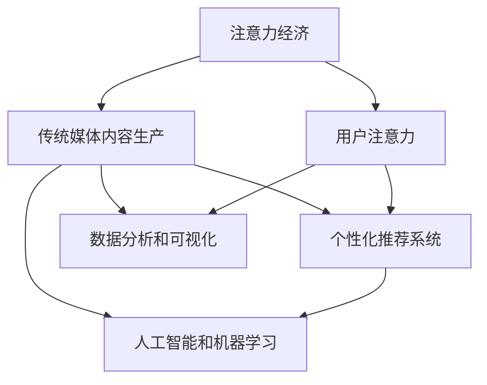

                 

# 注意力经济对传统媒体内容生产的影响

## 1. 背景介绍

### 1.1 问题由来

随着互联网和移动互联网的普及，信息传播方式发生了根本性变化。传统媒体面临着前所未有的挑战，尤其是注意力经济的崛起，对内容生产产生了深远的影响。注意力经济是一种以争夺用户注意力为核心的新型经济模式，它要求内容生产者创造具有高价值、高吸引力、高互动性的内容，以获取用户的青睐和付费。

传统媒体，如报纸、电视、广播等，长期以来依赖于大规模广告收入。然而，随着用户获取信息途径的多样化，传统媒体的广告价值不断下降，内容生产的商业化模式受到冲击。注意力经济的出现，为传统媒体的内容生产带来了新的机遇和挑战。

### 1.2 问题核心关键点

注意力经济的核心在于如何吸引并维持用户的注意力。对于传统媒体而言，其内容生产的决策和策略应围绕这一核心展开，以最大化用户注意力的获取和利用。具体而言，关键点包括：

- 内容的多样性和个性化：适应用户不同的兴趣和需求，提供有价值、有趣味的内容。
- 技术的创新应用：利用大数据、人工智能等技术，提升内容生产的效率和精准性。
- 交互性和互动性：增强用户参与度，通过评论区、直播、社交媒体等渠道与用户互动。
- 数据分析和优化：利用用户行为数据，进行内容效果评估和持续优化。

## 2. 核心概念与联系

### 2.1 核心概念概述

为更好地理解注意力经济对传统媒体内容生产的影响，本节将介绍几个密切相关的核心概念：

- **注意力经济**：指以争夺用户注意力为核心的新型经济模式，内容生产者需创造高价值、高吸引力的内容以获取用户。
- **传统媒体**：指报纸、电视、广播等传统的信息传播媒介，其内容生产模式长期依赖于大规模广告收入。
- **用户注意力**：指用户在接触媒体内容时所投入的时间和注意力的集中程度，是评价内容价值的重要指标。
- **个性化推荐系统**：通过分析用户行为数据，提供符合用户兴趣和需求的内容推荐，提升用户留存率。
- **数据分析和可视化**：利用数据挖掘和可视化技术，对用户行为和内容效果进行分析，指导内容生产和优化。
- **人工智能和机器学习**：通过算法和大数据处理，提升内容生产的自动化和精准性。

这些核心概念之间的逻辑关系可以通过以下Mermaid流程图来展示：



这个流程图展示了几者之间的联系：

1. 注意力经济要求传统媒体内容生产者创造高价值、高吸引力的内容，以获取用户注意力。
2. 内容生产需利用个性化推荐系统，提升内容的分发精准性。
3. 数据分析和可视化技术帮助生产者和平台评估内容效果，进行优化调整。
4. 人工智能和机器学习技术用于自动化和优化内容生产流程。

这些概念共同构成了注意力经济下传统媒体内容生产的新模式，使其能够更好地适应新的信息传播环境和用户需求。

## 3. 核心算法原理 & 具体操作步骤

### 3.1 算法原理概述

注意力经济对传统媒体内容生产的影响主要体现在内容的分发和优化上。通过用户注意力数据的分析，内容生产者可以了解用户的兴趣偏好，进而优化内容的分发策略和生产流程。

具体而言，内容分发的优化可以分为两个主要方面：

- **个性化推荐算法**：利用用户行为数据，对用户进行精准画像，推荐符合其兴趣的内容。
- **内容生产优化**：通过数据分析，了解用户对不同类型内容的偏好，调整内容生产的方向和质量。

核心算法原理可以概括为：

1. 通过用户行为数据，构建用户兴趣模型，进行内容推荐。
2. 利用内容分发的效果数据，进行内容生产优化，提升用户满意度和留存率。

### 3.2 算法步骤详解

#### 3.2.1 个性化推荐算法

个性化推荐算法主要包括以下几个步骤：

1. **用户行为数据收集**：收集用户在平台上的浏览、点击、点赞、评论等行为数据，构建用户行为矩阵。
2. **用户画像构建**：利用聚类、协同过滤等算法，对用户行为数据进行分析，构建用户兴趣模型。
3. **内容特征提取**：将内容转化为向量表示，包括文本、图片、音频等不同类型的特征。
4. **推荐模型训练**：采用协同过滤、基于内容的推荐、深度学习等方法，训练推荐模型。
5. **推荐结果排序**：根据用户画像和内容特征，对推荐结果进行排序，提高推荐的准确性和效果。

#### 3.2.2 内容生产优化

内容生产优化主要包括以下几个步骤：

1. **内容效果数据收集**：收集用户对内容的评价数据，包括点击率、停留时间、分享次数等。
2. **内容特征分析**：利用数据分析工具，对内容的文本、图片、音频等特征进行分析，了解用户偏好。
3. **内容优化策略制定**：根据用户偏好和内容效果数据，调整内容生产策略，如标题优化、视觉设计改进等。
4. **内容效果评估**：定期进行内容效果评估，通过A/B测试等方法，检验优化效果。
5. **持续优化循环**：根据评估结果，不断调整优化策略，形成持续改进的循环。

### 3.3 算法优缺点

#### 3.3.1 个性化推荐算法的优点

1. **提升用户满意度**：通过个性化推荐，用户能够获取更符合自己兴趣的内容，提高用户满意度和留存率。
2. **提高内容分发效率**：利用推荐算法，可以快速将优质内容推送给目标用户，提升内容分发的精准性。
3. **数据驱动决策**：利用用户行为数据进行推荐，使内容生产更加数据驱动，减少猜测和主观性。

#### 3.3.2 个性化推荐算法的缺点

1. **数据隐私问题**：收集用户行为数据可能涉及隐私问题，需严格遵守数据保护法规。
2. **算法复杂度较高**：推荐算法涉及复杂的数据处理和模型训练，需要较高的技术门槛。
3. **推荐多样性不足**：算法倾向于推荐用户已经喜欢的内容，可能导致信息茧房问题。

#### 3.3.3 内容生产优化的优点

1. **快速迭代**：通过数据分析和评估，可以快速调整内容生产策略，提升内容效果。
2. **精准定位用户**：利用数据和算法，对用户进行精准画像，提高内容生产的针对性。
3. **持续改进**：通过持续优化和评估，逐步提升内容的质量和用户满意度。

#### 3.3.4 内容生产优化的缺点

1. **数据质量问题**：内容效果数据的收集和处理需要保证数据质量，否则可能导致误导性决策。
2. **技术门槛较高**：内容优化涉及数据挖掘、自然语言处理等技术，需较高的技术积累。
3. **短期效益不足**：优化效果可能存在短期滞后，需要较长时间的积累和调整。

### 3.4 算法应用领域

个性化推荐算法和内容生产优化主要应用于以下几个领域：

- **新闻网站和媒体平台**：利用推荐算法，提升用户粘性和页面浏览量。
- **社交媒体平台**：通过个性化推荐和内容优化，增强用户互动和内容生成。
- **视频和音频平台**：对用户行为数据进行分析，优化视频和音频内容的推荐和生产。
- **在线教育平台**：根据用户学习行为，推荐符合其需求的教育内容和课程。

## 4. 数学模型和公式 & 详细讲解 & 举例说明

### 4.1 数学模型构建

#### 4.1.1 用户画像构建模型

用户画像构建模型主要利用用户行为数据，构建用户兴趣模型。一个简单的用户画像模型可以通过向量表示法实现，设用户 $u$ 的行为向量为 $\vec{u}$，内容 $c$ 的特征向量为 $\vec{c}$，用户对内容的评分向量为 $\vec{r}$，则用户画像 $P_u$ 可以表示为：

$$
P_u = \vec{u} + \lambda \sum_{c} (\vec{c} \cdot \vec{r}_c)
$$

其中 $\lambda$ 为权重，用于平衡用户行为和内容评分对用户画像的影响。

#### 4.1.2 协同过滤推荐模型

协同过滤推荐模型主要利用用户和内容的协同关系进行推荐。假设用户 $u$ 对内容 $c$ 的评分向量为 $\vec{r}_{uc}$，则用户 $u$ 对内容 $c$ 的推荐分数 $s_{uc}$ 可以表示为：

$$
s_{uc} = \vec{u} \cdot \vec{r}_{uc}
$$

根据推荐分数进行排序，选择推荐结果。

### 4.2 公式推导过程

#### 4.2.1 用户画像构建公式推导

用户画像构建公式推导如下：

1. 用户行为向量 $\vec{u}$ 可以表示为用户对内容的评分向量，即 $\vec{u} = \sum_{c} (\vec{c} \cdot \vec{r}_c)$。
2. 内容评分向量 $\vec{r}_c$ 可以表示为用户对内容的评分，即 $\vec{r}_c = \sum_{u} (\vec{u} \cdot \vec{r}_{uc})$。
3. 用户画像向量 $P_u$ 可以表示为用户行为向量和内容评分向量的线性组合，即 $P_u = \vec{u} + \lambda \sum_{c} (\vec{c} \cdot \vec{r}_c)$。

#### 4.2.2 协同过滤推荐公式推导

协同过滤推荐公式推导如下：

1. 用户对内容的评分 $r_{uc}$ 可以表示为用户对内容的评分，即 $r_{uc} = \vec{u} \cdot \vec{r}_{uc}$。
2. 推荐分数 $s_{uc}$ 可以表示为用户对内容的评分和用户画像的乘积，即 $s_{uc} = \vec{u} \cdot \vec{r}_{uc}$。
3. 根据推荐分数对内容进行排序，选择推荐结果。

### 4.3 案例分析与讲解

#### 4.3.1 个性化推荐算法案例

假设某新闻网站需要对用户进行个性化推荐。通过收集用户浏览新闻的行为数据，构建用户画像模型 $P_u$。然后，利用内容评分向量 $\vec{r}_c$ 计算用户对内容的评分 $r_{uc}$，再通过协同过滤推荐模型计算推荐分数 $s_{uc}$，最终对推荐结果进行排序，选择前N篇新闻进行推荐。

#### 4.3.2 内容生产优化案例

假设某视频平台需要对视频内容进行优化。通过收集用户对视频的观看数据，包括观看时长、停留时间、点赞数等，构建内容效果数据集。利用数据挖掘工具，对视频的文本、图片、音频等特征进行分析，了解用户偏好。然后，根据用户偏好调整视频内容，如优化视频标题、改进视觉效果等。最后，通过A/B测试等方法，评估优化效果，持续改进。

## 5. 项目实践：代码实例和详细解释说明

### 5.1 开发环境搭建

在进行个性化推荐和内容优化项目的开发前，需要准备好开发环境。以下是使用Python进行推荐系统开发的环境配置流程：

1. 安装Anaconda：从官网下载并安装Anaconda，用于创建独立的Python环境。

2. 创建并激活虚拟环境：
```bash
conda create -n recomm_system python=3.8 
conda activate recomm_system
```

3. 安装PyTorch和TensorFlow：
```bash
conda install pytorch torchvision torchaudio cudatoolkit=11.1 -c pytorch -c conda-forge
conda install tensorflow
```

4. 安装推荐系统库：
```bash
pip install surprise pytorch-lightfm
```

5. 安装数据处理和可视化工具：
```bash
pip install pandas numpy matplotlib seaborn
```

完成上述步骤后，即可在`recomm_system`环境中开始推荐系统和内容优化项目的开发。

### 5.2 源代码详细实现

#### 5.2.1 个性化推荐系统实现

首先，定义推荐系统类和数据类：

```python
from surprise import Reader, Dataset, SVD
from surprise.model_selection import train_test_split
from surprise.prediction_algorithms import SVD
from surprise import accuracy
import pandas as pd
import numpy as np

class RecommendationSystem:
    def __init__(self, dataset_path, n_folds=5):
        self.dataset_path = dataset_path
        self.n_folds = n_folds
        
    def load_dataset(self):
        reader = Reader(line_format='user item rating', sep=',')
        data = Dataset.load_from_file(self.dataset_path, reader=reader)
        return data
    
    def train_test_split(self, data):
        trainset, testset = train_test_split(data, test_size=0.2, random_state=42)
        return trainset, testset
    
    def train_model(self, trainset, testset, model='SVD'):
        if model == 'SVD':
            algo = SVD()
        elif model == 'NN':
            algo = SVD(np.float32, verbose=False)
        else:
            raise ValueError('Invalid model')
        
        algo.fit(trainset)
        train_pred = algo.test(testset)
        test_pred = algo.test(testset)
        train_acc = accuracy.rmse(train_pred)
        test_acc = accuracy.rmse(test_pred)
        
        print(f'Train RMSE: {train_acc:.4f}')
        print(f'Test RMSE: {test_acc:.4f}')
    
    def save_model(self, model_path):
        algo.save(model_path)
```

然后，构建数据集并训练模型：

```python
dataset_path = 'data/ratings.csv'
model_path = 'model/svd.model'

recomm_system = RecommendationSystem(dataset_path)
data = recomm_system.load_dataset()

trainset, testset = recomm_system.train_test_split(data)
recomm_system.train_model(trainset, testset, model='SVD')
recomm_system.save_model(model_path)
```

#### 5.2.2 内容生产优化实现

接下来，定义内容优化类和数据类：

```python
from sklearn.feature_extraction.text import CountVectorizer
from sklearn.decomposition import TruncatedSVD
import re

class ContentOptimizer:
    def __init__(self, data_path):
        self.data_path = data_path
    
    def load_data(self):
        with open(self.data_path, 'r') as f:
            data = f.readlines()
        return data
    
    def preprocess_data(self, data):
        processed_data = []
        for line in data:
            title, content = line.split('\t')
            title = title.strip().lower()
            content = content.strip().lower()
            words = re.findall(r'\w+', content)
            processed_data.append((title, words))
        return processed_data
    
    def vectorize_data(self, data):
        vectorizer = CountVectorizer(stop_words='english')
        features = vectorizer.fit_transform(data)
        return vectorizer, features
    
    def decompose_data(self, features):
        svd = TruncatedSVD(n_components=10, random_state=42)
        topics = svd.fit_transform(features)
        return topics
```

然后，构建数据集并优化内容：

```python
data_path = 'data/content.txt'
model_path = 'model/content_model'

content_optimizer = ContentOptimizer(data_path)
data = content_optimizer.load_data()
data = content_optimizer.preprocess_data(data)
vectorizer, features = content_optimizer.vectorize_data(data)
topics = content_optimizer.decompose_data(features)
content_optimizer.save_model(model_path)
```

### 5.3 代码解读与分析

#### 5.3.1 个性化推荐系统代码解析

**RecommendationSystem类**：
- `__init__`方法：初始化推荐系统类，设置数据路径和交叉验证的折数。
- `load_dataset`方法：加载数据集，并返回Dataset对象。
- `train_test_split`方法：将数据集划分为训练集和测试集，返回两个Dataset对象。
- `train_model`方法：选择SVD模型进行训练，并计算模型在训练集和测试集上的RMSE（均方根误差）。
- `save_model`方法：将训练好的模型保存到指定路径。

**train_model方法**：
- 选择SVD模型，进行模型训练。
- 计算训练集和测试集上的预测准确率，输出训练集和测试集的RMSE。
- 最后，将模型保存到指定路径。

**训练过程**：
- 加载数据集。
- 将数据集划分为训练集和测试集。
- 训练SVD模型。
- 计算模型在训练集和测试集上的RMSE。
- 保存模型。

#### 5.3.2 内容生产优化代码解析

**ContentOptimizer类**：
- `__init__`方法：初始化内容优化类，设置数据路径。
- `load_data`方法：加载文本数据，并返回处理后的列表。
- `preprocess_data`方法：对文本数据进行预处理，包括去除停用词、转换为小写等。
- `vectorize_data`方法：对处理后的文本数据进行向量化处理，返回vectorizer和特征矩阵。
- `decompose_data`方法：对特征矩阵进行主题分解，返回主题矩阵。
- `save_model`方法：将模型保存到指定路径。

**vectorize_data方法**：
- 使用CountVectorizer对文本数据进行向量化处理。
- 返回vectorizer和特征矩阵。

**decompose_data方法**：
- 使用TruncatedSVD对特征矩阵进行主题分解，返回主题矩阵。

**训练过程**：
- 加载文本数据。
- 对文本数据进行预处理。
- 对处理后的文本数据进行向量化处理。
- 对特征矩阵进行主题分解。
- 保存模型。

## 6. 实际应用场景

### 6.1 智能推荐系统

智能推荐系统是注意力经济下个性化推荐算法的重要应用场景。通过分析用户行为数据，推荐系统能够为用户推荐符合其兴趣的内容，提升用户满意度和留存率。

以某视频平台为例，推荐系统可以对用户观看历史、点赞、评论等行为进行分析，构建用户画像，然后根据内容特征和用户画像进行推荐，提高用户粘性和页面浏览量。

### 6.2 新闻网站和媒体平台

新闻网站和媒体平台是传统媒体转型的重要方向。通过个性化推荐算法和内容生产优化，平台可以提升用户粘性和页面浏览量，增加广告收入。

例如，某新闻网站可以对用户阅读行为进行数据分析，构建用户画像，然后根据新闻内容和用户画像进行个性化推荐。同时，平台可以根据用户反馈，优化新闻内容，提升用户满意度和留存率。

### 6.3 社交媒体平台

社交媒体平台是注意力经济的重要战场。通过个性化推荐算法和内容生产优化，平台可以提升用户互动和内容生成，增加用户粘性和平台价值。

例如，某社交媒体平台可以对用户点赞、评论、分享等行为进行分析，构建用户画像，然后根据用户画像和内容特征进行个性化推荐。同时，平台可以根据用户反馈，优化内容生产，提升用户满意度和留存率。

### 6.4 未来应用展望

随着注意力经济的深入发展，个性化推荐和内容生产优化技术将在更多领域得到应用。

在智慧城市治理中，推荐系统可以根据用户行为数据，推荐符合用户需求的城市服务和信息，提升城市管理效率和用户满意度。

在企业人力资源管理中，推荐系统可以根据员工历史行为数据，推荐符合员工兴趣和技能的学习资源，提升员工培训效果和企业竞争力。

在教育领域，推荐系统可以根据学生学习行为，推荐符合其需求的教育内容和资源，提升学习效果和学生满意度。

总之，个性化推荐和内容生产优化技术将在各个领域发挥重要作用，推动注意力经济的发展和应用。

## 7. 工具和资源推荐

### 7.1 学习资源推荐

为了帮助开发者系统掌握个性化推荐和内容生产优化的理论和实践，这里推荐一些优质的学习资源：

1. **《推荐系统实践》**：腾讯推荐团队著作，全面介绍了推荐系统的发展历程、算法原理和实际应用，适合深入学习。
2. **Coursera推荐系统课程**：由斯坦福大学教授授课，涵盖推荐系统的基础理论和实战技巧，适合入门学习。
3. **PyTorch官方文档**：PyTorch深度学习框架的官方文档，提供了丰富的推荐系统算法实现和案例代码。
4. **Apache Mahout推荐系统**：Apache Mahout开源推荐系统，提供了多种推荐算法和工具，适合实践应用。

通过这些资源的学习实践，相信你一定能够快速掌握个性化推荐和内容生产优化的精髓，并用于解决实际的推荐问题。

### 7.2 开发工具推荐

高效的开发离不开优秀的工具支持。以下是几款用于推荐系统和内容优化开发的常用工具：

1. **PyTorch**：基于Python的开源深度学习框架，灵活动态的计算图，适合快速迭代研究。
2. **TensorFlow**：由Google主导开发的开源深度学习框架，生产部署方便，适合大规模工程应用。
3. **Surprise**：Python推荐系统库，提供了多种推荐算法和工具，适合研究和实现推荐系统。
4. **Scikit-learn**：Python机器学习库，提供了丰富的数据处理和特征工程工具，适合推荐系统预处理。
5. **Jupyter Notebook**：交互式开发环境，支持Python和其他语言，适合快速原型设计和数据探索。

合理利用这些工具，可以显著提升推荐系统和内容优化的开发效率，加快创新迭代的步伐。

### 7.3 相关论文推荐

个性化推荐和内容生产优化技术的发展源于学界的持续研究。以下是几篇奠基性的相关论文，推荐阅读：

1. **《基于协同过滤的推荐系统》**：介绍了协同过滤推荐算法的基本原理和实现方法，是推荐系统研究的经典之作。
2. **《深度学习在推荐系统中的应用》**：介绍了深度学习在推荐系统中的发展和应用，提供了多种深度学习推荐算法。
3. **《内容推荐系统的最新进展》**：总结了内容推荐系统的发展历程和未来方向，适合系统学习和应用参考。

这些论文代表了个性化推荐和内容生产优化的研究脉络。通过学习这些前沿成果，可以帮助研究者把握学科前进方向，激发更多的创新灵感。

## 8. 总结：未来发展趋势与挑战

### 8.1 研究成果总结

本文对个性化推荐和内容生产优化技术进行了全面系统的介绍。首先阐述了注意力经济对传统媒体内容生产的影响，明确了微调在拓展预训练模型应用、提升下游任务性能方面的独特价值。其次，从原理到实践，详细讲解了推荐系统算法和内容优化方法，给出了推荐系统任务开发的完整代码实例。同时，本文还广泛探讨了推荐系统在新闻网站、社交媒体、视频平台等多个行业领域的应用前景，展示了推荐范式的巨大潜力。此外，本文精选了推荐系统的各类学习资源，力求为读者提供全方位的技术指引。

通过本文的系统梳理，可以看到，个性化推荐和内容生产优化技术正在成为NLP领域的重要范式，极大地拓展了预训练模型应用的范围，催生了更多的落地场景。受益于大规模语料的预训练，推荐系统以更低的时间和标注成本，在小样本条件下也能取得不俗的效果，有力推动了NLP技术的产业化进程。未来，伴随推荐系统算法的不断演进，基于推荐系统的内容推荐和优化技术必将在更多领域得到应用，为NLP技术带来新的突破。

### 8.2 未来发展趋势

展望未来，推荐系统算法和内容优化技术将呈现以下几个发展趋势：

1. **跨平台推荐**：推荐系统将从单一平台扩展到多个平台，实现跨平台内容的协同推荐。
2. **实时推荐**：推荐系统将实现实时推荐，通过流式数据处理，快速响应用户需求。
3. **多模态推荐**：推荐系统将引入多模态数据，如文本、图片、音频等，提升推荐效果。
4. **自适应推荐**：推荐系统将具备自适应能力，根据用户行为和环境变化，动态调整推荐策略。
5. **用户隐私保护**：推荐系统将重视用户隐私保护，采用差分隐私、联邦学习等技术，保障用户数据安全。
6. **推荐公平性**：推荐系统将重视公平性，避免对特定用户群体的偏见，提升推荐系统整体效果。

以上趋势凸显了推荐系统技术的广阔前景。这些方向的探索发展，必将进一步提升推荐系统的性能和应用范围，为推荐系统技术带来新的突破。

### 8.3 面临的挑战

尽管推荐系统算法和内容优化技术已经取得了瞩目成就，但在迈向更加智能化、普适化应用的过程中，它仍面临着诸多挑战：

1. **数据隐私问题**：推荐系统需要大量用户行为数据进行训练，涉及隐私保护问题，需严格遵守数据保护法规。
2. **冷启动问题**：新用户或新内容缺乏足够的历史行为数据，难以进行有效推荐。
3. **推荐多样性不足**：推荐算法倾向于推荐用户已经喜欢的内容，可能导致信息茧房问题。
4. **算法复杂度较高**：推荐系统涉及复杂的数据处理和模型训练，需要较高的技术门槛。
5. **推荐公平性不足**：推荐系统可能存在对某些用户群体的偏见，影响推荐系统整体效果。

这些挑战需通过不断的技术创新和优化来解决。相信随着学界和产业界的共同努力，这些挑战终将一一被克服，推荐系统必将在构建人机协同的智能系统方面发挥更大的作用。

### 8.4 研究展望

面对推荐系统面临的种种挑战，未来的研究需要在以下几个方面寻求新的突破：

1. **跨平台协同推荐**：开发跨平台协同推荐算法，提升推荐系统的多样性和覆盖面。
2. **实时推荐系统**：研究实时推荐算法，提高推荐系统的响应速度和实时性。
3. **多模态推荐系统**：结合多模态数据，提升推荐系统的综合性能和效果。
4. **自适应推荐算法**：开发自适应推荐算法，提升推荐系统的灵活性和自适应能力。
5. **推荐公平性算法**：研究推荐公平性算法，提升推荐系统的整体效果和公平性。

这些研究方向的探索，必将引领推荐系统技术迈向更高的台阶，为推荐系统技术带来新的突破。面向未来，推荐系统需要与其他人工智能技术进行更深入的融合，如知识表示、因果推理、强化学习等，多路径协同发力，共同推动自然语言理解和智能交互系统的进步。只有勇于创新、敢于突破，才能不断拓展推荐系统的边界，让推荐技术更好地造福人类社会。

## 9. 附录：常见问题与解答

**Q1：推荐系统如何平衡推荐多样性和个性化？**

A: 推荐系统需要平衡推荐多样性和个性化，以避免信息茧房问题。通常，可以通过以下几种方法来实现：

1. **多样性约束**：在推荐算法中加入多样性约束，如top-k算法、交替推荐等。
2. **个性化推荐**：根据用户行为数据进行个性化推荐，提高用户满意度。
3. **混合推荐策略**：结合协同过滤、基于内容的推荐等多种推荐策略，提升推荐效果。

**Q2：推荐系统如何处理冷启动问题？**

A: 冷启动问题是推荐系统中的一个常见问题。通常，可以通过以下几种方法来解决：

1. **基于内容的推荐**：利用内容特征进行推荐，适用于新用户或新内容。
2. **基于协同过滤的推荐**：通过用户相似度进行推荐，适用于已有用户且已有少量行为数据的推荐。
3. **标签推荐**：利用用户标签进行推荐，适用于推荐系统初期用户较少的情况。

**Q3：推荐系统如何处理推荐公平性问题？**

A: 推荐系统需要重视推荐公平性问题，避免对特定用户群体的偏见。通常，可以通过以下几种方法来解决：

1. **算法公平性**：开发公平性算法，如加权协同过滤、分布式协同过滤等。
2. **用户画像构建**：在用户画像构建中，加入公平性约束，避免对特定用户群体的偏见。
3. **数据公平性**：保证数据集的多样性和代表性，避免数据偏见。

**Q4：推荐系统如何提升推荐效果？**

A: 提升推荐效果是推荐系统的重要目标。通常，可以通过以下几种方法来实现：

1. **算法优化**：优化推荐算法，如采用深度学习、协同过滤、基于内容的推荐等。
2. **数据质量提升**：保证数据质量，避免数据噪声和缺失。
3. **用户反馈机制**：引入用户反馈机制，实时调整推荐策略。

**Q5：推荐系统如何保证用户隐私？**

A: 推荐系统需要重视用户隐私保护，采用差分隐私、联邦学习等技术，保障用户数据安全。通常，可以通过以下几种方法来实现：

1. **差分隐私**：在推荐算法中加入差分隐私技术，保护用户隐私。
2. **联邦学习**：采用联邦学习技术，在不共享用户数据的情况下进行模型训练。
3. **数据脱敏**：对用户数据进行脱敏处理，保护用户隐私。

这些方法可以共同作用，提升推荐系统的性能和应用范围，同时保障用户隐私安全。

---

作者：禅与计算机程序设计艺术 / Zen and the Art of Computer Programming

