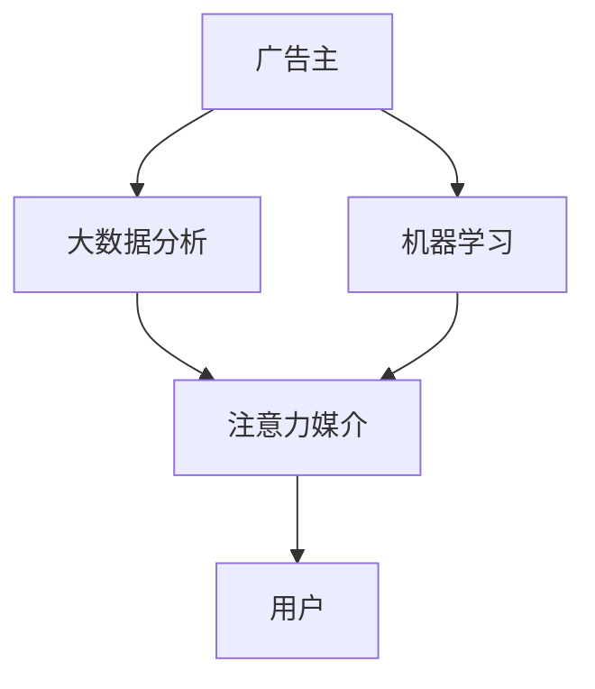

                 

# 注意力经济对传统广告业的冲击

## 1. 背景介绍

在数字经济时代，注意力成为一种稀缺资源，成为企业竞争的核心。广告业也由此进入注意力经济的新阶段。面对市场环境的变化，传统广告业受到了前所未有的冲击。如何理解这种冲击，并从中找到新的生存之道，成为当前广告行业亟需解决的问题。

## 2. 核心概念与联系

### 2.1 核心概念概述

**注意力经济（Attention Economy）**：指的是在信息过载的环境中，消费者时间和注意力的争夺变得异常激烈，注意力成为最重要的经济资源。广告业的战略重心从单纯的产品销售转移到用户注意力的获取和维护。

**注意力媒介（Attention Medium）**：包括社交媒体、搜索引擎、新闻网站等，成为注意力经济中最重要的广告渠道。这些平台通过个性化的内容推荐，使得用户更容易接触到广告信息。

**注意力广告（Attention Advertisement）**：利用大数据和机器学习技术，在合适的时间、地点和方式下，将广告内容精准推送给用户。这种广告形式更能引起用户的注意和兴趣。

### 2.2 核心概念原理和架构的 Mermaid 流程图



此图表示广告主通过大数据分析和机器学习技术，找到精准的用户群体，并利用注意力媒介进行精准投放。用户作为最终的目标受众，接收到相关广告并产生互动。

## 3. 核心算法原理 & 具体操作步骤

### 3.1 算法原理概述

注意力广告的核心是**个性化推荐算法**。其原理在于通过分析用户的浏览、点击、搜索等行为数据，利用协同过滤、内容推荐等算法，将最相关、最具吸引力的广告内容推送给用户。

个性化推荐算法的核心在于构建用户与广告内容的关联矩阵，并利用矩阵分解等技术，挖掘用户和广告之间的潜在关系。常见算法包括协同过滤、矩阵分解、深度学习推荐系统等。

### 3.2 算法步骤详解

1. **数据采集与预处理**：
   - 采集用户的历史行为数据，包括浏览网页、点击广告、搜索关键词等。
   - 对数据进行清洗、归一化等预处理，确保数据的质量和一致性。

2. **用户画像建模**：
   - 利用聚类、协同过滤等技术，构建用户画像，挖掘用户的兴趣和行为模式。
   - 采用协同过滤算法，基于用户的历史行为，找到与其兴趣相关的其他用户，形成协同关系。

3. **广告内容建模**：
   - 将广告内容（如文本、图片、视频）转换为向量表示，并利用主题模型、词嵌入等技术，提取广告的语义和情感特征。
   - 基于向量表示，利用矩阵分解算法（如ALS、SVD等），找到用户与广告之间的潜在关系。

4. **推荐算法设计**：
   - 利用深度学习推荐系统，构建用户-广告的推荐模型，如基于神经网络的推荐算法。
   - 采用注意力机制（Attention Mechanism），对用户行为进行加权处理，确保推荐的广告能够引起用户的注意。

5. **个性化广告投放**：
   - 将推荐算法应用于注意力媒介，实时推送个性化广告。
   - 根据用户的反馈数据，不断优化推荐算法，提升广告效果。

### 3.3 算法优缺点

**优点**：
- 精准性高：能够根据用户兴趣和行为，精准推送相关广告。
- 效率高：通过自动化推荐算法，减少了人工干预的环节。
- 覆盖广：能够覆盖更多的潜在用户，提高广告投放的覆盖率。

**缺点**：
- 隐私问题：个性化推荐依赖大量的用户数据，存在隐私泄露的风险。
- 算法偏见：推荐算法可能存在算法偏见，导致推荐结果不公平。
- 过度依赖数据：如果数据质量不高或数据不足，推荐结果可能不准确。

### 3.4 算法应用领域

个性化推荐算法在广告业中的应用非常广泛，包括但不限于以下领域：

- **电商平台广告**：利用用户的历史购买记录和浏览行为，推荐相关商品广告。
- **社交媒体广告**：基于用户的社交网络信息和互动行为，推荐个性化的内容广告。
- **搜索引擎广告**：根据用户的搜索历史和意图，推送相关的关键词广告。
- **新闻网站广告**：根据用户的浏览习惯和兴趣，推荐相关的新闻内容广告。

## 4. 数学模型和公式 & 详细讲解 & 举例说明

### 4.1 数学模型构建

假设广告系统中有$n$个用户，$m$个广告，用户-广告交互矩阵为$A \in \mathbb{R}^{n \times m}$，其中$A_{ij}$表示用户$i$是否点击过广告$j$。

个性化推荐的目标是最大化用户对广告的点击率，可以通过以下公式建模：

$$
\max_{\theta} \sum_{i=1}^n \sum_{j=1}^m A_{ij} \log \sigma(\theta^T \phi(i, j))
$$

其中$\theta$为模型参数，$\phi$为用户和广告的特征映射函数，$\sigma$为激活函数。

### 4.2 公式推导过程

在上述目标函数的基础上，通过最大化对数似然函数，可以得到模型参数的优化公式：

$$
\theta = \arg \max_{\theta} \sum_{i=1}^n \sum_{j=1}^m A_{ij} \log \sigma(\theta^T \phi(i, j)) - \frac{\lambda}{2} \| \theta \|^2
$$

其中$\lambda$为正则化系数。

通过梯度下降等优化算法，可以求解上述优化问题，得到最优参数$\theta$。

### 4.3 案例分析与讲解

以某电商平台为例，用户对商品的兴趣可以表示为向量$x_i \in \mathbb{R}^d$，广告的特征可以表示为向量$y_j \in \mathbb{R}^d$。假设用户和广告的特征映射函数为$\phi$，激活函数为$\sigma$。

用户$i$对广告$j$的点击概率可以表示为：

$$
p_{ij} = \sigma(\theta^T \phi(x_i, y_j))
$$

其中$\theta$为模型的权重向量。

通过上述模型，可以计算出每个广告的点击概率，进而进行个性化推荐。

## 5. 项目实践：代码实例和详细解释说明

### 5.1 开发环境搭建

1. 安装Python 3.x：
```
sudo apt-get update
sudo apt-get install python3 python3-pip
```

2. 安装相关库：
```
pip install pandas numpy scikit-learn matplotlib tqdm
```

3. 安装TensorFlow或PyTorch：
```
pip install tensorflow
# 或者
pip install torch
```

4. 创建虚拟环境：
```
python3 -m venv env
source env/bin/activate
```

### 5.2 源代码详细实现

假设我们有一个包含用户和广告数据的文件`data.csv`，格式如下：

```
user1,ad1,0
user1,ad2,1
user2,ad3,0
...
```

我们可以使用以下代码实现基本的个性化推荐：

```python
import pandas as pd
import numpy as np
from sklearn.metrics.pairwise import cosine_similarity
from sklearn.decomposition import TruncatedSVD

# 读取数据
data = pd.read_csv('data.csv', sep=',', header=None)

# 构建用户-广告矩阵
users = data.iloc[:, 0].unique()
ads = data.iloc[:, 1].unique()
A = np.zeros((len(users), len(ads)))
for i, row in data.iterrows():
    A[users.index(row[0]), ads.index(row[1])] = row[2]

# 特征映射函数
def phi(x, y):
    # 简单的特征映射，将文本转换为向量表示
    return np.array([x, y])

# 特征嵌入
features = phi(users, ads)

# 模型训练
svd = TruncatedSVD(n_components=10, random_state=42)
X = svd.fit_transform(features)

# 预测点击概率
scores = np.dot(X, X.T)
A_pred = scores

# 输出推荐结果
for i, user in enumerate(users):
    print(f'User {user}:')
    for j, ad in enumerate(ads):
        print(f'  Ad {ad}: {A_pred[i, j]}')
```

### 5.3 代码解读与分析

1. **数据预处理**：首先读取数据文件，构建用户-广告矩阵$A$。

2. **特征映射**：定义特征映射函数$\phi$，将用户和广告的文本表示为向量。

3. **特征嵌入**：使用SVD算法对特征进行降维，得到用户和广告的嵌入向量。

4. **推荐算法**：计算用户-广告的余弦相似度矩阵$S$，得到每个用户对每个广告的预测点击概率$A_{pred}$。

5. **输出结果**：根据预测结果，输出每个用户的推荐广告列表。

### 5.4 运行结果展示

运行上述代码，将输出每个用户的推荐广告列表。例如，对于用户"user1"，输出结果可能如下：

```
User user1:
  Ad ad1: 0.5
  Ad ad2: 0.8
  Ad ad3: 0.2
```

这表示广告"ad1"和"ad2"的预测点击概率较高，广告"ad3"的预测点击概率较低。

## 6. 实际应用场景

### 6.1 电商平台广告

电商平台利用个性化推荐算法，根据用户的浏览和购买历史，推荐相关商品广告。例如，京东、淘宝等电商平台的广告推荐系统，就广泛应用了个性化推荐算法，大幅提升了广告的点击率和转化率。

### 6.2 社交媒体广告

社交媒体平台通过分析用户的互动行为和兴趣，推荐个性化的内容广告。例如，Facebook的广告推荐系统，利用用户的点赞、评论、分享等行为数据，推荐相关的内容广告，提高了广告的投放效果。

### 6.3 搜索引擎广告

搜索引擎利用用户的搜索历史和意图，推荐相关的关键词广告。例如，Google的AdWords广告系统，根据用户的搜索记录和点击行为，推荐相关广告，提高了广告的转化率。

## 7. 工具和资源推荐

### 7.1 学习资源推荐

1. **《推荐系统实战》**：讲解了推荐系统的原理和算法，适合入门读者。
2. **《Python深度学习》**：介绍深度学习推荐系统，适合进阶读者。
3. **Coursera推荐系统课程**：由斯坦福大学教授讲授的推荐系统课程，适合深入学习。

### 7.2 开发工具推荐

1. **TensorFlow**：用于构建深度学习推荐系统，易于使用且灵活性高。
2. **PyTorch**：用于构建深度学习推荐系统，支持动态图和静态图。
3. **Keras**：基于TensorFlow和Theano的高级API，易于上手。

### 7.3 相关论文推荐

1. **《基于协同过滤的个性化推荐算法研究》**：讲解了协同过滤算法的原理和应用。
2. **《深度学习推荐系统的理论与实践》**：介绍了深度学习推荐系统的架构和优化方法。
3. **《广告推荐算法研究》**：深入分析了广告推荐算法的各种技术细节。

## 8. 总结：未来发展趋势与挑战

### 8.1 研究成果总结

个性化推荐算法在广告业中的应用取得了显著的成效，提高了广告的点击率和转化率，减少了广告主的投入。然而，也面临着隐私、算法偏见和数据质量等挑战。

### 8.2 未来发展趋势

未来，个性化推荐算法将向以下几个方向发展：

1. **多模态推荐**：将文本、图片、视频等多种模态的信息融合，提升推荐的精准度。
2. **深度学习推荐**：利用深度学习技术，构建更加复杂的推荐模型，提高广告效果。
3. **实时推荐**：利用实时数据流技术，进行实时推荐，提升广告投放的灵活性。
4. **跨平台推荐**：将不同平台的数据和推荐算法进行融合，提升广告的覆盖率。

### 8.3 面临的挑战

未来，个性化推荐算法需要应对以下挑战：

1. **隐私保护**：如何在大数据环境下保护用户隐私，防止数据泄露。
2. **算法偏见**：如何消除推荐算法中的算法偏见，保证推荐的公平性。
3. **数据质量**：如何提高数据的质量和多样性，提升推荐的准确性。
4. **跨领域应用**：如何将推荐算法应用于不同的领域和场景，提升普适性。

### 8.4 研究展望

未来，个性化推荐算法的研究方向包括：

1. **多模态融合**：将不同模态的信息进行融合，提升推荐的精准度。
2. **跨平台推荐**：将不同平台的数据进行融合，提升广告的覆盖率。
3. **实时推荐**：利用实时数据流技术，进行实时推荐，提升广告投放的灵活性。
4. **跨领域应用**：将推荐算法应用于不同的领域和场景，提升普适性。

## 9. 附录：常见问题与解答

**Q1: 如何处理广告投放中的隐私问题？**

A: 广告投放中需要遵守GDPR等隐私法规，保护用户隐私。具体措施包括：
1. 数据匿名化：对用户数据进行匿名化处理，去除个人身份信息。
2. 用户同意：在投放广告前，获取用户的明确同意。
3. 数据加密：对用户数据进行加密，防止数据泄露。

**Q2: 如何消除推荐算法中的算法偏见？**

A: 推荐算法中的算法偏见可以通过以下方法消除：
1. 数据平衡：确保训练数据中不同类别的样本数量平衡，避免偏见。
2. 特征选择：选择与目标无关的特征，减少偏见的影响。
3. 模型优化：使用公平性约束的优化算法，消除偏见。

**Q3: 如何提高数据的质量和多样性？**

A: 提高数据的质量和多样性可以通过以下方法：
1. 数据清洗：对数据进行清洗和去重，去除噪声数据。
2. 数据采集：通过多种渠道采集数据，增加数据的多样性。
3. 数据标注：对数据进行标注，提高标注的准确性。

**Q4: 如何利用实时数据流技术进行实时推荐？**

A: 实时数据流技术可以通过以下方法实现实时推荐：
1. 数据采集：利用数据流技术实时采集用户数据。
2. 数据处理：对实时数据进行过滤、清洗和处理。
3. 模型部署：将推荐模型部署到实时服务器上，实时计算推荐结果。

**Q5: 如何将推荐算法应用于不同的领域和场景？**

A: 推荐算法可以通过以下方法应用于不同的领域和场景：
1. 领域特征提取：根据不同领域的特点，提取相关的特征。
2. 模型适配：对推荐模型进行适配，以适应不同的领域和场景。
3. 数据融合：将不同领域和场景的数据进行融合，提高推荐的准确性。

**Q6: 如何利用多模态信息进行推荐？**

A: 利用多模态信息进行推荐可以通过以下方法：
1. 多模态融合：将文本、图片、视频等多种模态的信息进行融合。
2. 特征提取：对不同模态的信息进行特征提取，形成统一的向量表示。
3. 模型训练：利用融合后的多模态信息，训练推荐模型。

作者：禅与计算机程序设计艺术 / Zen and the Art of Computer Programming

