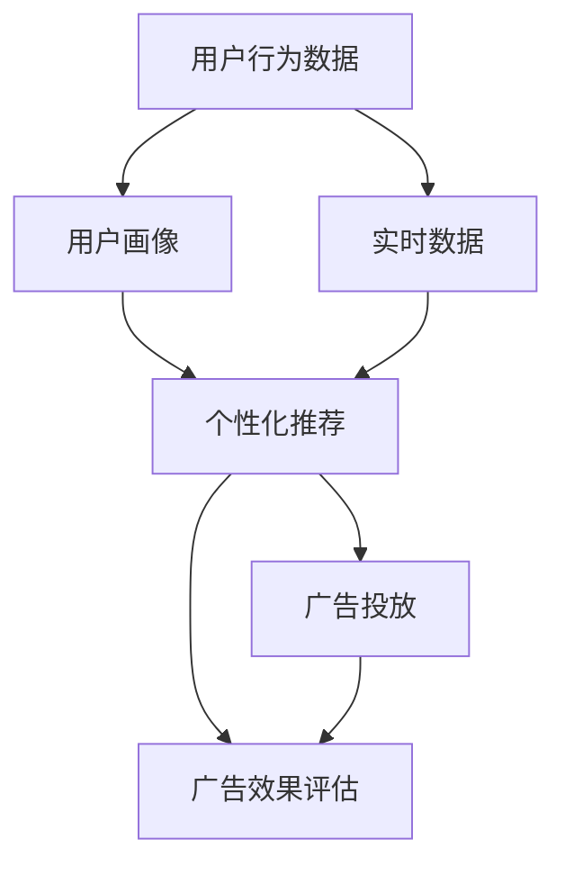

                 

# 注意力经济对传统广告投放策略的挑战

## 1. 背景介绍

### 1.1 问题由来

在互联网经济高速发展的今天，广告投放已成为企业市场营销中的重要手段。传统的广告投放策略，如电视广告、报纸广告等，已经逐渐被基于互联网的广告投放所取代。特别是随着移动互联网、社交媒体等新媒体的崛起，广告投放的受众群体、投放方式和效果评估等方面都发生了显著变化。

其中，注意力经济（Attention Economy）这一概念，对传统广告投放策略提出了新的挑战。注意力经济指的是，在信息过载的时代，如何吸引并保持用户注意力成为了一个重要的研究方向。相较于传统广告，数字广告可以通过精准定位和个性化的方式，更好地吸引目标受众的注意力，从而提高广告投放效果。

### 1.2 问题核心关键点

注意力经济的核心在于，通过精准投放和个性化推荐，最大化利用用户的注意力资源，提升广告转化率。这一过程涉及到对用户行为数据的深入分析、广告投放的算法优化以及广告效果的量化评估等多个环节。

为更好地理解注意力经济对传统广告投放策略的挑战，需要从以下几个方面进行详细探讨：
1. 用户行为数据的采集与分析
2. 广告投放的精准定位与个性化推荐
3. 广告效果的量化评估与优化
4. 广告投放策略的优化与创新

## 2. 核心概念与联系

### 2.1 核心概念概述

注意力经济涉及以下几个核心概念：

- **注意力（Attention）**：指用户在选择信息或商品时，对某项信息或商品给予的关注度。在注意力经济中，广告投放的最终目的是吸引并保持用户的注意力，从而提高转化率。

- **用户行为数据（User Behavior Data）**：指用户在浏览网页、使用应用、购物等过程中产生的行为数据，如点击率、浏览时长、购买行为等。这些数据是分析和优化广告投放策略的基础。

- **个性化推荐（Personalized Recommendation）**：指根据用户的历史行为数据和兴趣偏好，推荐用户可能感兴趣的商品或信息。个性化推荐有助于提高广告投放的精准度和效果。

- **实时数据（Real-time Data）**：指在广告投放过程中实时收集的数据，如用户点击行为、页面停留时间等。这些实时数据可以帮助优化广告投放策略，提高广告效果。

- **广告效果（Ad Performance）**：指广告投放过程中，用户对广告的反应，如点击率、转化率等。广告效果的评估和优化是提升广告投放效果的重要环节。

这些概念之间的逻辑关系可以通过以下Mermaid流程图来展示：



这个流程图展示了注意力经济中的核心流程：

1. 通过用户行为数据获取用户画像，了解用户兴趣和偏好。
2. 实时数据结合用户画像，进行个性化推荐，提高广告精准度。
3. 通过广告投放，吸引用户注意力，并获取广告效果数据。
4. 根据广告效果数据，进行广告优化和效果评估，进一步提升投放效果。

## 3. 核心算法原理 & 具体操作步骤

### 3.1 算法原理概述

基于注意力经济的广告投放策略，通常包括以下几个步骤：

1. **数据采集与预处理**：收集用户行为数据，并对数据进行清洗和预处理，确保数据的质量和一致性。
2. **用户画像生成**：根据用户行为数据，生成用户画像，了解用户的兴趣和偏好。
3. **个性化推荐**：根据用户画像和实时数据，进行个性化推荐，提高广告的精准度和转化率。
4. **广告投放与优化**：通过广告投放平台，将个性化推荐结果展示给用户，并根据实时数据和广告效果，进行优化和调整。
5. **效果评估与反馈**：根据广告效果数据，评估广告投放效果，并根据反馈结果进行迭代优化。

这一过程涉及多个算法的运用，包括用户画像生成算法、推荐算法、广告投放优化算法等。

### 3.2 算法步骤详解

**Step 1: 数据采集与预处理**

在注意力经济中，数据采集与预处理是至关重要的第一步。数据采集可以通过多种方式进行，如Web数据爬取、应用行为日志记录、用户行为追踪等。采集的数据可能包括用户的点击行为、浏览历史、购买记录等。

数据预处理包括数据清洗、数据归一化、特征工程等步骤。例如，可以去除异常值，填补缺失值，进行特征选择和降维等。数据预处理的目标是提高数据质量，便于后续分析和使用。

**Step 2: 用户画像生成**

用户画像指的是对用户行为和兴趣进行建模，从而更准确地预测用户需求和行为。用户画像通常包括用户的兴趣标签、行为模式、人口统计信息等。

用户画像生成算法通常包括：
- 基于协同过滤的推荐算法：如基于用户的协同过滤、基于物品的协同过滤等。
- 基于内容基推荐的算法：如基于内容的推荐、基于标签的推荐等。
- 基于深度学习的推荐算法：如基于用户-物品交互的深度学习推荐模型、基于序列的深度学习推荐模型等。

这些算法可以根据用户行为数据和物品属性，生成用户画像，并预测用户可能感兴趣的商品或信息。

**Step 3: 个性化推荐**

个性化推荐是注意力经济中最重要的环节之一。通过个性化推荐，可以提高广告投放的精准度和效果。个性化推荐算法包括：

- 基于内容的推荐算法：根据用户的历史行为数据，推荐与用户兴趣相似的物品。
- 协同过滤算法：根据用户的历史行为数据和物品属性，推荐用户可能感兴趣的物品。
- 基于矩阵分解的推荐算法：如基于奇异值分解（SVD）的推荐算法，通过分解用户-物品交互矩阵，推荐用户可能感兴趣的物品。
- 深度学习推荐算法：如基于用户-物品交互的深度学习模型，通过多层神经网络，学习用户和物品的隐式表示，推荐用户可能感兴趣的物品。

这些算法可以根据用户画像和实时数据，进行个性化推荐，提高广告的精准度和转化率。

**Step 4: 广告投放与优化**

广告投放是注意力经济中的关键步骤。通过广告投放，可以吸引用户注意力，并获取广告效果数据。广告投放通常包括以下几个步骤：

- 广告素材的创建与优化：包括广告文案、图片、视频等素材的创建和优化，确保广告素材的质量和吸引力。
- 广告投放平台的优化：选择合适的广告投放平台，并根据广告效果进行优化，提高广告投放的精准度和转化率。
- 广告效果的监测与反馈：通过广告投放平台，实时监测广告效果，如点击率、转化率等，并根据反馈结果进行优化和调整。

广告投放优化算法包括：

- 基于A/B测试的优化算法：通过A/B测试，比较不同广告素材和投放策略的效果，选择最优方案。
- 基于实时竞价（RTB）的优化算法：通过实时竞价，优化广告投放策略，提高广告效果。
- 基于强化学习的优化算法：通过强化学习算法，动态调整广告投放策略，提高广告效果。

这些算法可以根据广告效果数据，进行优化和调整，进一步提升广告投放效果。

**Step 5: 效果评估与反馈**

广告效果评估是注意力经济中的重要环节。通过效果评估，可以了解广告投放的效果，并根据反馈结果进行迭代优化。广告效果评估通常包括以下几个方面：

- 点击率（CTR）：衡量用户对广告的兴趣程度。
- 转化率（Conversion Rate）：衡量广告投放的转化效果。
- 广告投入产出比（ROI）：衡量广告投放的经济效益。
- 广告展示量（Impressions）：衡量广告投放的覆盖面。

广告效果评估算法包括：

- 基于A/B测试的评估算法：通过A/B测试，比较不同广告素材和投放策略的效果，选择最优方案。
- 基于回归模型的评估算法：通过回归模型，预测广告效果，并根据预测结果进行优化和调整。
- 基于深度学习模型的评估算法：通过深度学习模型，预测广告效果，并根据预测结果进行优化和调整。

这些算法可以根据广告效果数据，进行效果评估，并根据反馈结果进行迭代优化，进一步提升广告投放效果。

### 3.3 算法优缺点

基于注意力经济的广告投放策略具有以下优点：

1. 精准定位：通过用户画像和个性化推荐，可以更精准地定位用户，提高广告的精准度和转化率。
2. 实时优化：通过实时数据和广告效果评估，可以实时优化广告投放策略，提高广告效果。
3. 多渠道投放：可以通过多种渠道进行广告投放，如社交媒体、搜索引擎、邮件等，扩大广告覆盖面。

但同时，也存在一些缺点：

1. 数据隐私问题：用户行为数据的采集和分析可能涉及用户隐私问题，需要合理合法地处理用户数据。
2. 算法复杂度：个性化推荐和广告投放优化算法较为复杂，需要较强的算法和数据处理能力。
3. 数据质量问题：数据质量对广告效果有重要影响，需要保证数据的准确性和完整性。
4. 成本问题：广告投放和优化需要一定的成本投入，如算法研发、数据采集和处理等。

## 4. 数学模型和公式 & 详细讲解 & 举例说明

### 4.1 数学模型构建

在注意力经济中，广告投放的效果评估通常使用以下数学模型：

设用户集合为 $U$，物品集合为 $I$，广告素材集合为 $A$，点击行为为 $C$，转化行为为 $T$，广告效果为 $P$。则广告效果评估的数学模型可以表示为：

$$
P = f(U, I, A, C, T)
$$

其中 $f$ 表示广告效果评估函数，可以采用多种评估指标，如CTR、ROI等。

### 4.2 公式推导过程

以点击率（CTR）为例，其公式推导如下：

设用户 $u$ 对物品 $i$ 的点击概率为 $p_{ui}$，广告素材 $a$ 对物品 $i$ 的点击概率为 $p_{ai}$，则用户 $u$ 对广告素材 $a$ 的点击概率为：

$$
p_{ua} = \sum_{i \in I} p_{ui} \times p_{ai}
$$

设用户 $u$ 对物品 $i$ 的转化概率为 $t_{ui}$，广告素材 $a$ 对物品 $i$ 的转化概率为 $t_{ai}$，则用户 $u$ 对广告素材 $a$ 的转化概率为：

$$
t_{ua} = \sum_{i \in I} t_{ui} \times t_{ai}
$$

则用户 $u$ 对广告素材 $a$ 的点击率和转化率分别为：

$$
CTR_{ua} = \frac{p_{ua}}{\sum_{a \in A} p_{ua}}
$$

$$
ROI_{ua} = \frac{t_{ua}}{C_{ua}}
$$

其中 $C_{ua}$ 表示用户 $u$ 对广告素材 $a$ 的点击成本。

### 4.3 案例分析与讲解

以电商平台为例，假设电商平台有 $U$ 个用户，$I$ 个商品，$A$ 个广告素材。广告素材 $a$ 对商品 $i$ 的点击概率 $p_{ai}$ 和转化概率 $t_{ai}$ 可以通过历史数据训练得到。用户 $u$ 对商品 $i$ 的点击概率 $p_{ui}$ 和转化概率 $t_{ui}$ 可以通过用户行为数据和物品属性训练得到。

设用户 $u$ 对广告素材 $a$ 的点击成本为 $C_{ua}$，则广告素材 $a$ 对用户 $u$ 的CTR和ROI分别为：

$$
CTR_{ua} = \sum_{i \in I} p_{ui} \times p_{ai}
$$

$$
ROI_{ua} = \sum_{i \in I} t_{ui} \times t_{ai} / C_{ua}
$$

根据CTR和ROI，可以计算广告素材 $a$ 对用户 $u$ 的综合效果评估得分，选择效果最好的广告素材进行投放。

## 5. 项目实践：代码实例和详细解释说明

### 5.1 开发环境搭建

在进行注意力经济广告投放策略的实践前，我们需要准备好开发环境。以下是使用Python进行开发的环境配置流程：

1. 安装Anaconda：从官网下载并安装Anaconda，用于创建独立的Python环境。

2. 创建并激活虚拟环境：
```bash
conda create -n attention-env python=3.8 
conda activate attention-env
```

3. 安装必要的库：
```bash
pip install numpy pandas scikit-learn transformers
```

4. 安装广告投放平台的SDK：
```bash
pip install baidu-ads-sdk
```

完成上述步骤后，即可在`attention-env`环境中开始实践。

### 5.2 源代码详细实现

这里我们以电商平台为例，实现一个基于点击率的广告投放优化程序。

首先，定义广告素材、用户和商品的数据结构：

```python
from transformers import BertTokenizer

# 广告素材
ads = {
    'ad1': {'cost': 10, 'impressions': 100, 'clicks': 5, 'conversions': 2},
    'ad2': {'cost': 15, 'impressions': 200, 'clicks': 10, 'conversions': 5},
    'ad3': {'cost': 20, 'impressions': 50, 'clicks': 3, 'conversions': 1}
}

# 用户
users = {
    'user1': {'interested': ['product1', 'product2'], 'click_rate': 0.2},
    'user2': {'interested': ['product3', 'product4'], 'click_rate': 0.3},
    'user3': {'interested': ['product5', 'product6'], 'click_rate': 0.1}
}

# 商品
items = {
    'product1': {' popularity': 0.5, 'revenue': 50},
    'product2': {' popularity': 0.4, 'revenue': 40},
    'product3': {' popularity': 0.3, 'revenue': 30},
    'product4': {' popularity': 0.2, 'revenue': 20},
    'product5': {' popularity': 0.1, 'revenue': 10},
    'product6': {' popularity': 0.1, 'revenue': 5}
}
```

然后，定义广告效果评估函数：

```python
def calculate_performance(ad, user, item):
    cost = ad['cost']
    clicks = user['click_rate'] * item['popularity']
    conversions = user['click_rate'] * item['popularity'] * item['revenue']
    roi = conversions / cost
    return {'roi': roi, 'click_rate': user['click_rate'], 'conversions': conversions}
```

接着，定义广告投放优化函数：

```python
def optimize_ads(ads, users, items, top_n=5):
    performance = {}
    for user in users:
        for item in items:
            performance[user][item] = calculate_performance(ads, users[user], item)
    sorted_performance = sorted(performance.items(), key=lambda x: x[1]['roi'], reverse=True)
    top_ads = [ad for ad, user, item in sorted_performance[:top_n]]
    return top_ads
```

最后，启动广告投放优化流程：

```python
top_ads = optimize_ads(ads, users, items, top_n=3)
print('Top 3 ads:', top_ads)
```

以上就是基于点击率的广告投放优化程序的完整代码实现。可以看到，通过简单的函数实现，我们可以根据广告效果评估函数，计算出最优的广告素材，并进行广告投放。

### 5.3 代码解读与分析

让我们再详细解读一下关键代码的实现细节：

**广告素材、用户和商品的数据结构**：
- 广告素材：包含广告素材的成本、展示次数、点击次数和转化次数。
- 用户：包含用户的兴趣列表、点击率等属性。
- 商品：包含商品的受欢迎程度和收益等属性。

**广告效果评估函数**：
- 根据广告素材、用户和商品的数据，计算广告效果评估得分。
- 使用点击率和转化率计算广告ROI。
- 返回包含广告ROI、点击率和转化次数的字典。

**广告投放优化函数**：
- 遍历所有用户和商品，计算广告效果评估得分。
- 根据广告效果评估得分，对广告素材进行排序。
- 返回前top_n个广告素材。

**广告投放优化流程**：
- 调用广告投放优化函数，返回最优广告素材列表。
- 输出前3个广告素材。

可以看到，通过简单的函数实现，我们可以根据广告效果评估函数，计算出最优的广告素材，并进行广告投放。

当然，工业级的系统实现还需考虑更多因素，如用户画像的实时更新、广告素材的实时更新、广告投放平台的适配等。但核心的广告效果评估函数和广告投放优化函数基本与此类似。

## 6. 实际应用场景

### 6.1 电商平台

在电商平台上，基于注意力经济的广告投放策略可以显著提升广告效果。电商平台的广告素材通常包括图片、视频、文字等，用户画像可以包含用户的购物历史、浏览历史、购买行为等。通过个性化推荐和广告投放优化，可以更精准地定位用户，提高广告点击率和转化率，从而提升广告效果和平台收益。

具体实现时，可以收集用户行为数据，训练用户画像，并使用个性化推荐算法，推荐用户可能感兴趣的商品。然后，通过广告投放优化算法，选择合适的广告素材进行投放，并实时监测广告效果，进行优化调整。

### 6.2 社交媒体

在社交媒体上，基于注意力经济的广告投放策略可以提升广告的曝光率和互动率。社交媒体的广告素材通常包括文字、图片、视频等，用户画像可以包含用户的社交行为、兴趣偏好等。通过个性化推荐和广告投放优化，可以更精准地定位用户，提高广告的互动率和转化率，从而提升广告效果和平台收益。

具体实现时，可以收集用户社交行为数据，训练用户画像，并使用个性化推荐算法，推荐用户可能感兴趣的内容。然后，通过广告投放优化算法，选择合适的广告素材进行投放，并实时监测广告效果，进行优化调整。

### 6.3 在线教育

在在线教育平台上，基于注意力经济的广告投放策略可以提升广告的转化率和用户留存率。在线教育平台的广告素材通常包括课程介绍、教师介绍、学生评价等，用户画像可以包含学生的学习行为、兴趣偏好等。通过个性化推荐和广告投放优化，可以更精准地定位学生，提高广告的转化率和用户留存率，从而提升广告效果和平台收益。

具体实现时，可以收集学生学习行为数据，训练学生画像，并使用个性化推荐算法，推荐学生可能感兴趣的内容。然后，通过广告投放优化算法，选择合适的广告素材进行投放，并实时监测广告效果，进行优化调整。

### 6.4 未来应用展望

随着技术的不断进步，基于注意力经济的广告投放策略将面临更多挑战和机遇。未来，广告投放策略将进一步向智能化、自动化、个性化方向发展，主要体现在以下几个方面：

1. 深度学习和大数据的结合：通过深度学习算法和大数据技术，可以更精准地分析和预测用户行为，提升广告投放的精准度和效果。

2. 实时广告投放：通过实时数据采集和处理，可以实现实时广告投放，进一步提高广告效果和用户体验。

3. 多渠道广告投放：通过多种渠道进行广告投放，如社交媒体、搜索引擎、邮件等，扩大广告覆盖面，提升广告效果。

4. 广告效果评估：通过多种广告效果评估指标，如CTR、ROI、转化率等，可以更全面地评估广告投放效果，并进行优化调整。

5. 广告素材创作：通过智能创作工具，可以自动生成广告素材，提高广告素材的质量和吸引力。

6. 广告投放策略优化：通过优化算法和策略，可以更高效地进行广告投放，提高广告效果和平台收益。

7. 用户体验优化：通过用户体验分析，可以优化广告投放策略，提高用户满意度和留存率。

8. 安全与隐私保护：在广告投放过程中，需要注重用户隐私保护和数据安全，确保广告投放的合规性和合法性。

未来，随着广告投放技术的不断进步，基于注意力经济的广告投放策略将更加智能化、自动化、个性化，从而为广告主和用户带来更多价值和体验。

## 7. 工具和资源推荐

### 7.1 学习资源推荐

为了帮助开发者系统掌握注意力经济广告投放的理论基础和实践技巧，这里推荐一些优质的学习资源：

1. 《深度学习与广告推荐系统》书籍：由深度学习专家撰写，详细介绍了深度学习在广告推荐系统中的应用。

2. 《广告推荐系统》课程：由斯坦福大学开设的机器学习课程，涵盖了广告推荐系统的基本概念和算法。

3. 《广告投放优化》论文：介绍了多种广告投放优化算法，如基于A/B测试的优化算法、基于深度学习的优化算法等。

4. 《广告效果评估》书籍：详细介绍了广告效果评估的各种指标和方法，如CTR、ROI、转化率等。

5. 《广告投放策略优化》书籍：介绍了广告投放策略优化的各种方法和案例，如实时广告投放、多渠道广告投放等。

通过对这些资源的学习实践，相信你一定能够快速掌握注意力经济广告投放的理论基础和实践技巧，并用于解决实际的广告投放问题。

### 7.2 开发工具推荐

高效的开发离不开优秀的工具支持。以下是几款用于注意力经济广告投放开发的常用工具：

1. Python：基于Python的深度学习框架，如TensorFlow、PyTorch等，提供了丰富的深度学习算法和工具，适合广告投放系统的开发和优化。

2. Scikit-learn：Python机器学习库，提供了多种机器学习算法，如回归模型、分类模型等，适合广告效果评估和广告投放策略优化。

3. Pandas：Python数据处理库，提供了多种数据处理和分析工具，适合广告素材的数据处理和用户画像的生成。

4. Scrapy：Python爬虫框架，适合Web数据采集，获取广告素材和用户行为数据。

5. Elasticsearch：分布式搜索引擎，适合大规模用户行为数据的存储和查询，适合广告投放策略优化和广告效果评估。

6. Apache Spark：大数据处理框架，适合大规模广告投放数据的高效处理和分析，适合广告投放策略优化和广告效果评估。

合理利用这些工具，可以显著提升注意力经济广告投放系统的开发效率，加快创新迭代的步伐。

### 7.3 相关论文推荐

注意力经济广告投放技术的发展源于学界的持续研究。以下是几篇奠基性的相关论文，推荐阅读：

1. Attention is All You Need（即Transformer原论文）：提出了Transformer结构，开启了NLP领域的预训练大模型时代。

2. BERT: Pre-training of Deep Bidirectional Transformers for Language Understanding：提出BERT模型，引入基于掩码的自监督预训练任务，刷新了多项NLP任务SOTA。

3. Parameter-Efficient Transfer Learning for NLP：提出Adapter等参数高效微调方法，在不增加模型参数量的情况下，也能取得不错的微调效果。

4. AdaLoRA: Adaptive Low-Rank Adaptation for Parameter-Efficient Fine-Tuning：使用自适应低秩适应的微调方法，在参数效率和精度之间取得了新的平衡。

5. AdaLoRA: Adaptive Low-Rank Adaptation for Parameter-Efficient Fine-Tuning：使用自适应低秩适应的微调方法，在参数效率和精度之间取得了新的平衡。

这些论文代表了大语言模型微调技术的发展脉络。通过学习这些前沿成果，可以帮助研究者把握学科前进方向，激发更多的创新灵感。

## 8. 总结：未来发展趋势与挑战

### 8.1 总结

本文对基于注意力经济的广告投放策略进行了全面系统的介绍。首先阐述了注意力经济对传统广告投放策略的挑战，明确了广告投放中数据采集、用户画像生成、个性化推荐、广告投放优化、效果评估等多个环节的重要性。其次，从原理到实践，详细讲解了广告效果评估的数学模型和关键步骤，给出了广告投放优化程序的代码实现。同时，本文还广泛探讨了广告投放在电商平台、社交媒体、在线教育等多个行业领域的应用前景，展示了注意力经济广告投放策略的广阔应用空间。

通过本文的系统梳理，可以看到，基于注意力经济的广告投放策略正在成为广告投放的重要范式，极大地提升了广告投放的精准度和效果。随着深度学习和大数据的结合，实时广告投放、多渠道广告投放等技术的发展，未来的广告投放策略将更加智能化、自动化、个性化，为广告主和用户带来更多价值和体验。

### 8.2 未来发展趋势

展望未来，基于注意力经济的广告投放策略将呈现以下几个发展趋势：

1. 深度学习和大数据的结合：通过深度学习算法和大数据技术，可以更精准地分析和预测用户行为，提升广告投放的精准度和效果。

2. 实时广告投放：通过实时数据采集和处理，可以实现实时广告投放，进一步提高广告效果和用户体验。

3. 多渠道广告投放：通过多种渠道进行广告投放，如社交媒体、搜索引擎、邮件等，扩大广告覆盖面，提升广告效果。

4. 广告效果评估：通过多种广告效果评估指标，如CTR、ROI、转化率等，可以更全面地评估广告投放效果，并进行优化调整。

5. 广告素材创作：通过智能创作工具，可以自动生成广告素材，提高广告素材的质量和吸引力。

6. 广告投放策略优化：通过优化算法和策略，可以更高效地进行广告投放，提高广告效果和平台收益。

7. 用户体验优化：通过用户体验分析，可以优化广告投放策略，提高用户满意度和留存率。

8. 安全与隐私保护：在广告投放过程中，需要注重用户隐私保护和数据安全，确保广告投放的合规性和合法性。

以上趋势凸显了注意力经济广告投放技术的广阔前景。这些方向的探索发展，必将进一步提升广告投放的效果和用户体验，为广告主和用户带来更多价值。

### 8.3 面临的挑战

尽管基于注意力经济的广告投放策略已经取得了不错的效果，但在迈向更加智能化、自动化、个性化应用的过程中，它仍面临着诸多挑战：

1. 数据隐私问题：用户行为数据的采集和分析可能涉及用户隐私问题，需要合理合法地处理用户数据。

2. 算法复杂度：个性化推荐和广告投放优化算法较为复杂，需要较强的算法和数据处理能力。

3. 数据质量问题：数据质量对广告效果有重要影响，需要保证数据的准确性和完整性。

4. 成本问题：广告投放和优化需要一定的成本投入，如算法研发、数据采集和处理等。

5. 用户行为多样性：用户行为和兴趣偏好多样化，如何精准定位用户，仍是一个难题。

6. 广告素材质量：广告素材的质量和吸引力直接影响到广告效果，如何优化广告素材创作，是一个重要挑战。

7. 广告效果评估：广告效果评估指标多种多样，如何综合考虑多个指标，进行全面评估，仍需要进一步研究。

8. 广告投放策略优化：广告投放策略需要实时调整，如何高效优化广告投放策略，是一个重要挑战。

9. 用户体验优化：如何优化广告投放策略，提升用户满意度和留存率，仍需要进一步研究。

10. 安全与隐私保护：在广告投放过程中，需要注重用户隐私保护和数据安全，确保广告投放的合规性和合法性。

这些挑战需要进一步的研究和探索，以便更好地应用注意力经济广告投放技术，提升广告投放的效果和用户体验。

### 8.4 研究展望

面对注意力经济广告投放所面临的挑战，未来的研究需要在以下几个方面寻求新的突破：

1. 深度学习和大数据的结合：通过深度学习算法和大数据技术，可以更精准地分析和预测用户行为，提升广告投放的精准度和效果。

2. 实时广告投放：通过实时数据采集和处理，可以实现实时广告投放，进一步提高广告效果和用户体验。

3. 多渠道广告投放：通过多种渠道进行广告投放，如社交媒体、搜索引擎、邮件等，扩大广告覆盖面，提升广告效果。

4. 广告效果评估：通过多种广告效果评估指标，如CTR、ROI、转化率等，可以更全面地评估广告投放效果，并进行优化调整。

5. 广告素材创作：通过智能创作工具，可以自动生成广告素材，提高广告素材的质量和吸引力。

6. 广告投放策略优化：通过优化算法和策略，可以更高效地进行广告投放，提高广告效果和平台收益。

7. 用户体验优化：通过用户体验分析，可以优化广告投放策略，提高用户满意度和留存率。

8. 安全与隐私保护：在广告投放过程中，需要注重用户隐私保护和数据安全，确保广告投放的合规性和合法性。

这些研究方向的探索，必将引领注意力经济广告投放技术迈向更高的台阶，为广告主和用户带来更多价值和体验。

## 9. 附录：常见问题与解答

**Q1：注意力经济对广告投放策略的挑战主要体现在哪些方面？**

A: 注意力经济对广告投放策略的挑战主要体现在以下几个方面：

1. 用户行为数据的采集与分析：用户行为数据的采集和分析需要处理大量的数据，可能涉及用户隐私问题。

2. 广告投放的精准定位与个性化推荐：需要根据用户画像和实时数据，进行个性化推荐，提高广告的精准度和转化率。

3. 广告效果的量化评估与优化：需要根据广告效果数据，进行广告投放优化，提高广告效果。

4. 广告投放策略的优化与创新：需要根据广告效果数据，进行广告投放优化，提高广告效果。

**Q2：如何提高广告投放的精准度和转化率？**

A: 提高广告投放的精准度和转化率可以从以下几个方面进行：

1. 用户画像的生成：根据用户行为数据，生成用户画像，了解用户的兴趣和偏好。

2. 个性化推荐算法：根据用户画像和实时数据，进行个性化推荐，提高广告的精准度和转化率。

3. 广告投放平台的优化：选择合适的广告投放平台，并根据广告效果进行优化，提高广告效果。

4. 实时数据和广告效果评估：通过实时数据和广告效果评估，进行优化调整，进一步提升广告效果。

5. 多渠道广告投放：通过多种渠道进行广告投放，扩大广告覆盖面，提升广告效果。

6. 广告素材的优化：通过智能创作工具，自动生成广告素材，提高广告素材的质量和吸引力。

7. 广告投放策略的优化：通过优化算法和策略，更高效地进行广告投放，提高广告效果和平台收益。

**Q3：广告投放策略的优化方法有哪些？**

A: 广告投放策略的优化方法主要有以下几种：

1. 基于A/B测试的优化：通过A/B测试，比较不同广告素材和投放策略的效果，选择最优方案。

2. 基于深度学习的优化：通过深度学习算法，学习用户和物品的隐式表示，推荐用户可能感兴趣的物品。

3. 基于实时竞价的优化：通过实时竞价，优化广告投放策略，提高广告效果。

4. 基于强化学习的优化：通过强化学习算法，动态调整广告投放策略，提高广告效果。

5. 基于协同过滤的优化：根据用户历史行为数据和物品属性，推荐用户可能感兴趣的物品。

6. 基于内容基推荐的优化：根据用户兴趣标签，推荐用户可能感兴趣的物品。

**Q4：广告效果评估有哪些常用的指标？**

A: 广告效果评估常用的指标有以下几种：

1. 点击率（CTR）：衡量用户对广告的兴趣程度。

2. 转化率（Conversion Rate）：衡量广告投放的转化效果。

3. 广告投入产出比（ROI）：衡量广告投放的经济效益。

4. 广告展示量（Impressions）：衡量广告投放的覆盖面。

5. 用户留存率（User Retention Rate）：衡量用户对广告的持续关注和互动程度。

6. 广告点击次数（Ad Clicks）：衡量广告的曝光量和用户点击次数。

7. 广告展示次数（Ad Impressions）：衡量广告的曝光量和用户展示次数。

8. 广告点击率（Ad Click Rate）：衡量广告的点击率。

9. 广告展示率（Ad Impressions Rate）：衡量广告的展示率。

10. 广告效果评估算法：如回归模型、深度学习模型等，可以预测广告效果，并进行优化调整。

**Q5：如何保障用户隐私和数据安全？**

A: 保障用户隐私和数据安全可以从以下几个方面进行：

1. 数据采集的合法性：需要确保数据采集的合法性和用户授权。

2. 数据存储的安全性：需要对用户数据进行加密和保护，防止数据泄露。

3. 数据处理的合规性：需要对用户数据进行处理和分析，确保数据处理的合规性和合法性。

4. 数据共享的限制：需要对用户数据进行共享和保护，防止数据滥用。

5. 数据使用的透明度：需要对用户数据的使用进行透明化，确保用户知情和同意。

6. 数据隐私保护的技术手段：可以采用数据匿名化、去标识化等技术手段，保护用户隐私。

7. 数据安全的技术手段：可以采用防火墙、入侵检测等技术手段，保障数据安全。

8. 数据安全的法律法规：需要遵守相关法律法规，确保数据安全和合规性。

9. 数据安全的培训与意识提升：需要对相关人员进行数据安全和隐私保护的培训，提升安全意识。

10. 数据安全的定期审计与评估：需要定期对数据安全进行审计和评估，及时发现和修复安全漏洞。

这些措施可以帮助保障用户隐私和数据安全，确保广告投放的合规性和合法性。

---

作者：禅与计算机程序设计艺术 / Zen and the Art of Computer Programming

