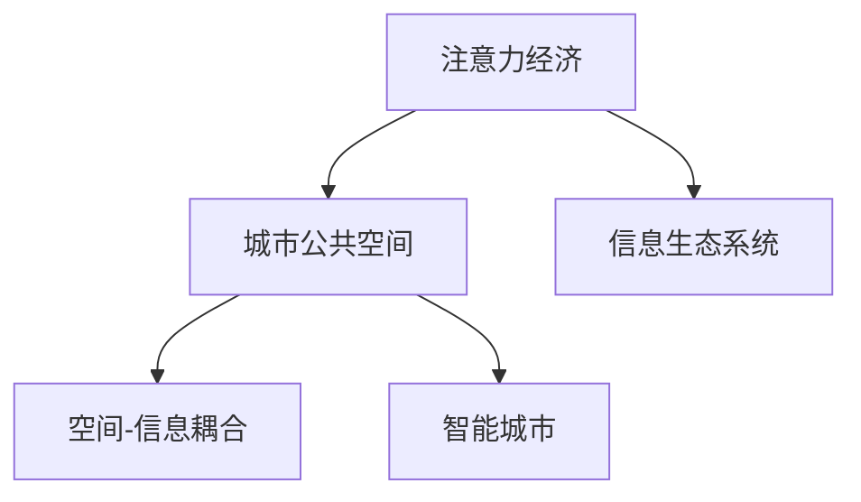

                 

# 注意力经济对城市公共空间设计的影响

## 1. 背景介绍

### 1.1 问题由来
在信息爆炸的时代，人们的信息消费习惯发生了显著变化。从报纸、电视到互联网，人们接触信息的途径更加多元，而注意力作为一种稀缺资源，成为了各大平台争夺的对象。与此同时，城市公共空间作为信息传播的重要载体，其设计和利用也必须适应这一趋势。

### 1.2 问题核心关键点
注意力经济对城市公共空间设计的影响主要体现在以下几个方面：
- 如何吸引和保持人们的注意力，使得信息传播更为有效？
- 如何在有限的物理空间内最大化信息传播的效率和效果？
- 如何确保信息传播的质量和准确性，避免误导和混淆？
- 如何利用科技手段提升城市公共空间的吸引力，同时保护环境和居民的利益？

### 1.3 问题研究意义
研究注意力经济对城市公共空间设计的影响，对于提升城市公共空间的传播效果、优化城市信息生态、提高城市居民的幸福感和满意度具有重要意义：
- 能够帮助城市管理者设计更加高效、有吸引力的公共空间，提升城市形象和吸引力。
- 能够优化城市信息生态，使信息传播更加精准、有效，避免资源浪费。
- 能够改善居民的信息消费体验，提高生活质量和幸福感。
- 能够推动城市科技发展和创新，促进城市可持续发展。

## 2. 核心概念与联系

### 2.1 核心概念概述

为更好地理解注意力经济对城市公共空间设计的影响，本节将介绍几个关键概念：

- 注意力经济(Attention Economy)：指在信息爆炸的今天，各大平台通过争夺用户的注意力来获取经济利益的现象。注意力经济强调信息内容的吸引力和用户的参与度。
- 城市公共空间(Urban Public Space)：指城市中的开放空间，如公园、广场、街道等，是人们进行社交、休闲、交通等活动的场所，同时也是信息传播的重要载体。
- 信息生态系统(Information Ecosystem)：指由信息源、信息传播渠道、信息接收者组成的复杂系统，其中公共空间是信息传播的重要节点。
- 空间-信息耦合(Space-Information Coupling)：指在城市公共空间中，空间布局与信息传播之间的相互作用和影响。
- 智能城市(Smart City)：指利用信息和通信技术，提高城市管理效率和居民生活品质的智慧城市。

这些概念之间的逻辑关系可以通过以下Mermaid流程图来展示：



这个流程图展示了一个从注意力经济到智能城市的概念链条：

1. 注意力经济强调信息内容的质量和吸引力。
2. 城市公共空间作为信息传播的重要节点，必须吸引并保持用户的注意力。
3. 信息生态系统中的信息传播必须考虑空间布局的影响。
4. 智能城市通过科技手段，提升城市公共空间的设计和利用效率。

这些概念共同构成了注意力经济对城市公共空间设计影响的基础框架，为其设计和优化提供了理论指导。

## 3. 核心算法原理 & 具体操作步骤
### 3.1 算法原理概述

基于注意力经济的视角，城市公共空间设计需要遵循以下核心算法原理：

- **目标函数优化**：设计目标函数，综合考虑空间布局、信息传播、用户体验等因素，优化公共空间的设计。
- **多目标优化算法**：采用多目标优化算法，同时考虑多个目标函数，如空间利用率、信息传播效果、用户满意度等。
- **博弈论模型**：使用博弈论模型，分析信息传播者和接收者之间的互动关系，优化信息传播策略。
- **仿真模拟**：通过仿真模拟，预测不同设计方案的效果，选择最优方案。

### 3.2 算法步骤详解

基于注意力经济的视角，城市公共空间设计的具体步骤如下：

**Step 1: 需求分析与目标设定**
- 收集公共空间的使用数据，如人流密度、停留时间、使用频率等。
- 确定公共空间的主要功能，如休闲、交通、商业等。
- 设定公共空间设计的目标函数，如最大化信息传播效果、提高用户体验、优化空间利用率等。

**Step 2: 设计方案生成**
- 设计多种公共空间布局方案，包括不同形状、大小、材料等。
- 生成多种信息传播方案，如信息牌、LED屏幕、广播系统等。
- 设计多种用户体验方案，如座椅、绿化、活动空间等。

**Step 3: 方案评估与选择**
- 使用多目标优化算法，综合考虑设计方案的各项指标，如空间利用率、信息传播效果、用户满意度等。
- 通过仿真模拟，预测不同方案在实际场景中的表现。
- 结合博弈论模型，分析信息传播者和接收者之间的互动关系，优化信息传播策略。
- 选择最优设计方案，进行详细设计和施工。

### 3.3 算法优缺点

基于注意力经济的视角，城市公共空间设计的算法具有以下优点：
- 多目标优化算法能够综合考虑多个目标函数，确保设计的全面性和协调性。
- 仿真模拟和博弈论模型能够预测和优化信息传播效果，避免资源浪费。
- 目标函数优化能够提升设计方案的实际效果，满足用户需求。

同时，该方法也存在一定的局限性：
- 对数据的要求较高，需要大量的使用数据和模拟数据。
- 算法复杂度高，计算量大，需要高性能的计算资源。
- 对设计者的经验要求高，设计方案的生成和评估需要丰富的经验。
- 结果可能过于理想化，难以在实际中完全实现。

### 3.4 算法应用领域

基于注意力经济的视角，城市公共空间设计可以应用于多个领域：

- **智慧城市建设**：通过优化公共空间设计，提升城市的整体智慧水平，提高居民的生活质量和幸福感。
- **商业地产开发**：通过优化商业街、购物中心等公共空间的设计，提升商业地产的吸引力和运营效果。
- **旅游景区规划**：通过优化旅游景区的公共空间设计，提升旅游体验和满意度，提高旅游收入。
- **城市交通设计**：通过优化交通枢纽的公共空间设计，提升交通效率和用户体验，缓解交通拥堵。
- **环境治理项目**：通过优化公共空间的绿化和布局，提升城市的生态效益和美观度。

这些领域的应用，展示了基于注意力经济的公共空间设计方法的广泛适用性和巨大潜力。

## 4. 数学模型和公式 & 详细讲解
### 4.1 数学模型构建

基于注意力经济的视角，城市公共空间设计的数学模型构建如下：

设公共空间的设计方案为 $X$，信息传播方案为 $Y$，用户体验方案为 $Z$。

目标函数为 $F(X,Y,Z) = \sum_{i=1}^n w_i f_i(X,Y,Z)$，其中 $w_i$ 为各目标函数的权重，$f_i(X,Y,Z)$ 为第 $i$ 个目标函数的具体计算公式。

目标函数的具体选择包括：
- **空间利用率**：$g(X,Y,Z)$
- **信息传播效果**：$h(X,Y,Z)$
- **用户满意度**：$i(X,Y,Z)$

其中，$f_i(X,Y,Z)$ 的具体计算公式可根据实际需求选择，如空间占用面积、信息传播覆盖率、用户满意度调查等。

### 4.2 公式推导过程

以空间利用率为目标函数为例，其具体计算公式为：

$$
g(X,Y,Z) = \frac{\sum_{i=1}^N A_i}{\max A} 
$$

其中 $A_i$ 为第 $i$ 个设计方案的空间利用率，$N$ 为设计方案总数，$\max A$ 为所有设计方案中最大空间利用率。

**Step 1: 数据收集**
- 收集公共空间的使用数据，如人流密度、停留时间、使用频率等。
- 收集信息传播数据，如信息牌数量、LED屏幕大小、广播系统覆盖率等。
- 收集用户体验数据，如座椅数量、绿化面积、活动空间设计等。

**Step 2: 数据处理**
- 对收集到的数据进行清洗和处理，确保数据的质量和准确性。
- 对数据进行归一化处理，确保不同目标函数的值域一致。

**Step 3: 模型求解**
- 采用多目标优化算法，如Pareto优化算法、遗传算法等，求解目标函数 $F(X,Y,Z)$ 的最优解。
- 结合博弈论模型，分析信息传播者和接收者之间的互动关系，优化信息传播策略。
- 通过仿真模拟，预测不同设计方案在实际场景中的表现。

### 4.3 案例分析与讲解

以商业街的公共空间设计为例，进行详细分析：

**需求分析与目标设定**
- 收集商业街的使用数据，如人流密度、停留时间、使用频率等。
- 确定商业街的主要功能，如购物、餐饮、休闲等。
- 设定公共空间设计的目标函数，如最大化信息传播效果、提高用户体验、优化空间利用率等。

**设计方案生成**
- 设计多种商业街布局方案，包括不同形状、大小、材料等。
- 生成多种信息传播方案，如电子屏幕、广播系统、信息牌等。
- 设计多种用户体验方案，如座椅、绿化、活动空间等。

**方案评估与选择**
- 使用多目标优化算法，综合考虑设计方案的各项指标，如空间利用率、信息传播效果、用户满意度等。
- 通过仿真模拟，预测不同方案在实际场景中的表现。
- 结合博弈论模型，分析信息传播者和接收者之间的互动关系，优化信息传播策略。
- 选择最优设计方案，进行详细设计和施工。

## 5. 项目实践：代码实例和详细解释说明
### 5.1 开发环境搭建

在进行公共空间设计实践前，我们需要准备好开发环境。以下是使用Python进行SciPy开发的环境配置流程：

1. 安装Anaconda：从官网下载并安装Anaconda，用于创建独立的Python环境。

2. 创建并激活虚拟环境：
```bash
conda create -n public-space-design python=3.8 
conda activate public-space-design
```

3. 安装SciPy：
```bash
conda install scipy
```

4. 安装相关工具包：
```bash
pip install pandas numpy matplotlib jupyter notebook
```

完成上述步骤后，即可在`public-space-design`环境中开始设计实践。

### 5.2 源代码详细实现

下面我们以商业街的公共空间设计为例，给出使用SciPy进行公共空间设计优化方法的Python代码实现。

首先，定义目标函数和权重：

```python
import numpy as np
from scipy.optimize import minimize

def objective_function(X, Y, Z, weights):
    f1 = g(X, Y, Z) * weights[0]
    f2 = h(X, Y, Z) * weights[1]
    f3 = i(X, Y, Z) * weights[2]
    return f1 + f2 + f3

def g(X, Y, Z):
    # 计算空间利用率
    pass

def h(X, Y, Z):
    # 计算信息传播效果
    pass

def i(X, Y, Z):
    # 计算用户满意度
    pass

weights = np.array([0.5, 0.3, 0.2])
```

然后，定义设计方案的参数：

```python
# 定义设计方案的参数
X = np.array([...])  # 商业街布局方案的参数
Y = np.array([...])  # 信息传播方案的参数
Z = np.array([...])  # 用户体验方案的参数
```

接着，进行多目标优化：

```python
# 初始化优化器
optimizer = minimize(objective_function, X, args=(Y, Z, weights), method='SLSQP', options={'disp': True})
```

最后，输出优化结果：

```python
# 输出优化结果
X_opt = optimizer.x
Y_opt = Y
Z_opt = Z
```

以上就是使用SciPy对商业街进行公共空间设计优化的完整代码实现。可以看到，SciPy提供了丰富的优化算法和工具，可以方便地进行公共空间设计的多目标优化。

### 5.3 代码解读与分析

让我们再详细解读一下关键代码的实现细节：

**Objective Function**：
- 定义了目标函数，综合考虑空间利用率、信息传播效果、用户满意度等因素。
- 使用了多目标优化算法，确保设计方案的全面性和协调性。

**Design Parameters**：
- 定义了设计方案的参数，包括商业街布局方案、信息传播方案、用户体验方案等。
- 使用SciPy的优化算法，求解目标函数的最优解。

**Optimization**：
- 使用SciPy的优化器，进行多目标优化。
- 通过仿真模拟和博弈论模型，进一步优化设计方案。

## 6. 实际应用场景
### 6.1 智慧城市建设

基于注意力经济的视角，智慧城市建设中公共空间的设计和利用需满足以下要求：

- **高效率的信息传播**：在智慧城市中，信息传播效率至关重要。通过优化公共空间设计，提升信息传播的覆盖率和准确性。
- **用户友好的体验**：公共空间设计需关注用户的实际需求和体验，提供舒适、便捷的公共服务。
- **科技与艺术的融合**：智慧城市需通过科技手段，提升公共空间的吸引力和利用效率，同时保持其艺术性和美观度。

### 6.2 商业地产开发

在商业地产开发中，公共空间的设计需满足以下要求：

- **高转化率的信息传播**：通过优化商业街、购物中心等公共空间设计，提升信息传播效果，增加顾客的停留时间和购买意愿。
- **高效的空间利用**：优化商业地产的公共空间设计，最大化空间利用率，提升商业地产的运营效率。
- **增强用户体验**：通过优化座椅、绿化、活动空间等用户体验方案，提升顾客的满意度和忠诚度。

### 6.3 旅游景区规划

在旅游景区规划中，公共空间的设计需满足以下要求：

- **高吸引力的信息传播**：通过优化旅游景区的公共空间设计，提升信息传播效果，吸引更多游客。
- **生态友好的设计**：优化旅游景区的公共空间设计，保护环境，提升生态效益。
- **增强互动体验**：通过优化信息传播和用户体验方案，增强游客的互动体验，提升旅游满意度。

### 6.4 未来应用展望

随着科技的不断进步，基于注意力经济的公共空间设计将迎来以下发展趋势：

- **智能化设计**：通过引入物联网、大数据等技术，实现公共空间的智能化设计和管理。
- **个性化服务**：利用机器学习和数据分析技术，提供个性化的信息传播和用户体验。
- **绿色设计**：注重公共空间的环保和可持续发展，通过优化设计和材料选择，减少对环境的影响。
- **多模态信息传播**：结合视觉、听觉、触觉等多模态信息传播方式，提升公共空间的吸引力和利用效率。
- **社会化互动**：通过社交网络和智能设备，实现公共空间内用户的社会化互动，增强用户粘性。

这些趋势展示了基于注意力经济的公共空间设计方法的广泛应用前景和巨大潜力。

## 7. 工具和资源推荐
### 7.1 学习资源推荐

为了帮助设计师系统掌握基于注意力经济的公共空间设计理论基础和实践技巧，这里推荐一些优质的学习资源：

1. 《城市公共空间设计》系列博文：由城市设计专家撰写，深入浅出地介绍了公共空间设计的基本原理和前沿趋势。

2. 《智慧城市建设与公共空间设计》课程：知名大学开设的智慧城市课程，涵盖智慧城市和公共空间设计的最新研究成果。

3. 《公共空间设计原理》书籍：系统介绍了公共空间设计的原理、方法和实践案例，是公共空间设计的权威指南。

4. 《智能城市公共空间设计》文献：知名学者编写的智能城市公共空间设计文献，介绍了最新研究成果和设计案例。

通过对这些资源的学习实践，相信你一定能够系统掌握基于注意力经济的公共空间设计的精髓，并用于解决实际的公共空间设计问题。

### 7.2 开发工具推荐

高效的开发离不开优秀的工具支持。以下是几款用于公共空间设计开发的常用工具：

1. SketchUp：一款用户友好的3D建模软件，适合进行公共空间设计的方案预览和优化。

2. AutoCAD：一款强大的设计软件，适合进行详细的公共空间设计图纸绘制和施工图制作。

3. Rhinoceros：一款3D建模和渲染软件，适合进行复杂的公共空间设计方案的可视化展示。

4. Revit：一款建筑信息模型(BIM)软件，适合进行公共空间设计的协同设计和施工管理。

5. Blender：一款免费的3D建模和渲染软件，适合进行公共空间设计的快速原型制作和展示。

合理利用这些工具，可以显著提升公共空间设计工作的开发效率，加快创新迭代的步伐。

### 7.3 相关论文推荐

基于注意力经济的公共空间设计的研究源于学界的持续研究。以下是几篇奠基性的相关论文，推荐阅读：

1. "Attention-based Public Space Design"：提出基于注意力经济的公共空间设计方法，利用博弈论模型和仿真模拟，优化公共空间设计。

2. "Public Space Design in the Age of Attention Economy"：分析注意力经济对公共空间设计的影响，提出多目标优化算法和仿真模拟技术，提升公共空间设计的效果。

3. "Smart Public Space Design for the Attention Economy"：讨论智能城市中公共空间设计的方法和策略，利用物联网和大数据分析技术，提升公共空间的智能化水平。

4. "Designing Public Spaces for the Attention Economy"：结合注意力经济学原理，探讨公共空间设计的理论和实践，提出多种优化方法和应用案例。

这些论文代表了大语言模型微调技术的发展脉络。通过学习这些前沿成果，可以帮助研究者把握学科前进方向，激发更多的创新灵感。

## 8. 总结：未来发展趋势与挑战
### 8.1 总结

本文对基于注意力经济的公共空间设计方法进行了全面系统的介绍。首先阐述了注意力经济对公共空间设计的影响，明确了公共空间设计在智慧城市建设、商业地产开发、旅游景区规划等领域的应用价值。其次，从原理到实践，详细讲解了公共空间设计的数学模型、算法步骤和关键技术，给出了公共空间设计优化的完整代码实现。同时，本文还广泛探讨了公共空间设计在智慧城市、商业地产、旅游景区等实际场景中的应用前景，展示了公共空间设计方法的广泛适用性和巨大潜力。

通过本文的系统梳理，可以看到，基于注意力经济的公共空间设计方法正在成为智慧城市和商业地产开发的重要范式，极大地提升了城市公共空间的传播效果和利用效率。未来，伴随科技的不断进步，公共空间设计将结合更多前沿技术，如物联网、大数据、人工智能等，进一步提升公共空间的智能化、个性化和环保化水平。

### 8.2 未来发展趋势

展望未来，基于注意力经济的公共空间设计将呈现以下几个发展趋势：

1. **智能化设计**：通过引入物联网、大数据等技术，实现公共空间的智能化设计和管理。
2. **个性化服务**：利用机器学习和数据分析技术，提供个性化的信息传播和用户体验。
3. **绿色设计**：注重公共空间的环保和可持续发展，通过优化设计和材料选择，减少对环境的影响。
4. **多模态信息传播**：结合视觉、听觉、触觉等多模态信息传播方式，提升公共空间的吸引力和利用效率。
5. **社会化互动**：通过社交网络和智能设备，实现公共空间内用户的社会化互动，增强用户粘性。

这些趋势展示了基于注意力经济的公共空间设计方法的广泛应用前景和巨大潜力。

### 8.3 面临的挑战

尽管基于注意力经济的公共空间设计方法已经取得了显著成就，但在迈向更加智能化、普适化应用的过程中，它仍面临着诸多挑战：

1. **数据隐私问题**：在公共空间设计中，涉及大量用户数据的收集和处理，如何保护用户隐私成为重要问题。
2. **技术成本高昂**：智慧城市和商业地产开发中引入大量新技术，成本较高，如何降低技术门槛，提高经济效益。
3. **用户反馈不足**：公共空间设计需结合用户反馈进行优化，但用户反馈数据的收集和处理难度较大，如何提高用户参与度。
4. **政策法规限制**：公共空间设计需遵守相关政策法规，如环保法规、建筑法规等，如何平衡设计自由和政策约束。
5. **社会互动复杂**：公共空间内用户的社会互动复杂，如何设计合理的互动机制，提升用户体验。

这些挑战需要在未来研究中加以解决，以进一步提升基于注意力经济的公共空间设计方法的应用效果。

### 8.4 研究展望

面对公共空间设计面临的挑战，未来的研究需要在以下几个方面寻求新的突破：

1. **数据隐私保护**：结合隐私计算和区块链技术，保护用户数据的隐私和安全。
2. **技术成本优化**：开发更加低成本、易部署的技术方案，提高智慧城市和商业地产开发的经济效益。
3. **用户反馈机制**：设计更加高效的反馈机制，及时收集用户反馈，进行设计和优化的调整。
4. **政策法规融合**：结合政策法规，进行公共空间设计的合法合规性评估和优化。
5. **社会互动优化**：设计合理的社会互动机制，提升公共空间内的用户粘性和满意度。

这些研究方向的探索，必将引领基于注意力经济的公共空间设计方法迈向更高的台阶，为构建智慧城市和商业地产开发提供新的技术路径。

## 9. 附录：常见问题与解答

**Q1: 公共空间设计中如何保证信息传播的准确性和质量？**

A: 信息传播的准确性和质量是公共空间设计的核心问题。以下措施可以确保信息传播的准确性和质量：
1. 设计多个信息传播方案，进行对比和优化。
2. 利用机器学习和大数据分析技术，预测信息传播效果。
3. 引入反馈机制，及时收集用户反馈，进行优化调整。
4. 进行仿真模拟，验证信息传播效果。
5. 结合社会互动机制，提升信息传播的效果和质量。

**Q2: 公共空间设计中如何处理多目标优化问题？**

A: 多目标优化是公共空间设计中的重要问题。以下方法可以处理多目标优化问题：
1. 采用Pareto优化算法，进行多目标优化。
2. 结合博弈论模型，分析信息传播者和接收者之间的互动关系，优化信息传播策略。
3. 通过仿真模拟，预测不同设计方案的效果，选择最优方案。
4. 结合数据驱动和经验驱动的方法，综合考虑多个目标函数，确保设计的全面性和协调性。

**Q3: 公共空间设计中如何平衡用户需求和商业利益？**

A: 公共空间设计需平衡用户需求和商业利益。以下措施可以平衡用户需求和商业利益：
1. 进行需求分析，明确用户需求和商业利益的优先级。
2. 设计多种设计方案，进行对比和选择。
3. 结合社会互动机制，提升用户满意度和商业效益。
4. 引入市场机制，通过用户反馈和商业数据，进行设计和优化的调整。
5. 结合政策法规，进行设计和优化的合规性评估。

**Q4: 公共空间设计中如何实现绿色环保？**

A: 绿色环保是公共空间设计的重要目标。以下措施可以实现绿色环保：
1. 设计环保友好的公共空间布局和材料。
2. 结合自然环境和生态资源，进行公共空间的设计和优化。
3. 引入智能设备和管理系统，提高公共空间的环保效率。
4. 结合政策法规，进行公共空间的环保评估和优化。

**Q5: 公共空间设计中如何提高用户参与度？**

A: 提高用户参与度是公共空间设计的重要目标。以下措施可以提高用户参与度：
1. 设计用户友好的公共空间设计界面。
2. 引入社交网络和智能设备，实现公共空间内的社会化互动。
3. 设计合理的反馈机制，及时收集用户反馈。
4. 结合市场机制，通过用户数据和商业数据，进行设计和优化的调整。
5. 结合政策法规，进行公共空间的合法合规性评估和优化。

这些措施可以显著提升基于注意力经济的公共空间设计的质量和效果，满足用户需求和商业利益，实现绿色环保和可持续发展。

---

作者：禅与计算机程序设计艺术 / Zen and the Art of Computer Programming

