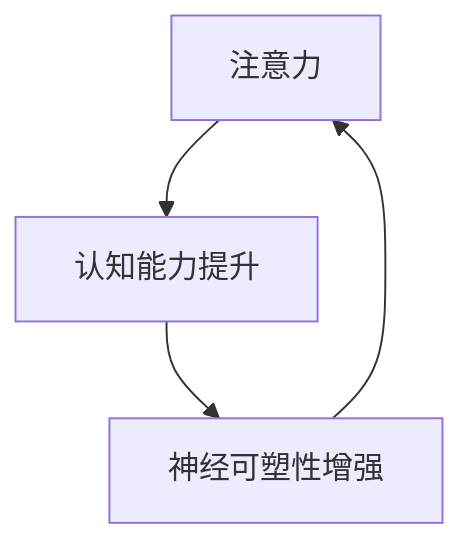

                 

# 注意力训练与大脑增强练习：通过专注力增强认知能力和神经可塑性

## 1. 背景介绍

### 1.1 问题由来
在科技日新月异的今天，人工智能(AI)技术正以惊人的速度渗透到各个行业，改变着我们的生产、生活和学习方式。然而，在追求技术进步的同时，我们也不能忽视大脑这一人类最强大的计算单元的重要性。认知神经科学和心理学研究表明，大脑的认知能力可以通过科学训练得到提升，进而提高学习和工作的效率。

注意力训练（Attention Training）是一种通过特定训练方式提升个体专注力和认知能力的训练方法。通过这种方法，个体可以更高效地处理信息，减少分心和压力，提升整体认知水平。然而，在实际应用中，许多人缺乏科学训练方法，无法有效提升注意力水平。

本文旨在通过介绍注意力训练的核心原理和方法，帮助读者掌握科学的注意力训练技巧，提升个人的认知能力和神经可塑性，从而在生活和工作中获得更好的表现。

## 2. 核心概念与联系

### 2.1 核心概念概述
为了更好地理解注意力训练，我们首先介绍一些关键概念：

- **注意力（Attention）**：注意力是指大脑在处理信息时对特定刺激的关注和分配资源的过程。注意力训练的目的是提升个体对信息的处理效率和准确性。
- **认知能力（Cognitive Ability）**：包括记忆力、理解力、问题解决能力等，是人类进行学习、工作和决策的基础。
- **神经可塑性（Neural Plasticity）**：指大脑在经历外界刺激和训练时，神经元之间连接强度的变化，即神经突触的增殖和剪枝过程，是大脑适应和学习的基础。

这些概念之间相互联系，共同构成了注意力训练的核心框架。注意力提升可以显著提高认知能力，而认知能力的提升反过来又可以通过神经可塑性得到进一步强化。

### 2.2 核心概念原理和架构的 Mermaid 流程图



这个流程图展示了注意力训练的核心过程：注意力提升带动认知能力提升，认知能力提升进一步增强神经可塑性，形成正反馈循环。

## 3. 核心算法原理 & 具体操作步骤

### 3.1 算法原理概述
注意力训练的本质是通过特定训练方法提升个体的注意力处理能力，从而提高认知水平。其核心原理基于认知心理学和神经科学的理论，强调对个体注意力系统的科学干预，使其能够在不同情境下高效分配注意力资源，减少分心和压力。

### 3.2 算法步骤详解

#### 3.2.1 步骤一：评估基础注意力水平
评估个体当前的基础注意力水平是注意力训练的第一步。可以通过标准化的注意力测试或日常观察来评估个体的注意力表现。

#### 3.2.2 步骤二：设计个性化训练计划
根据评估结果，设计个性化的注意力训练计划。训练计划应包括具体的训练任务、训练时长和频率等参数。

#### 3.2.3 步骤三：实施注意力训练任务
实施注意力训练任务，如正念冥想、注意力分配练习、注意力转移练习等。训练任务应涵盖不同情境，以提升个体在不同环境中的注意力表现。

#### 3.2.4 步骤四：监控和调整训练进度
监控训练进度，评估训练效果。根据评估结果，调整训练计划和任务，确保训练效果最大化。

#### 3.2.5 步骤五：评估认知能力和神经可塑性
通过定期的认知能力测试和神经可塑性评估，判断注意力训练的效果。

### 3.3 算法优缺点
#### 3.3.1 优点
1. **科学依据**：基于认知心理学和神经科学的理论，科学性较强。
2. **可操作性强**：通过具体的训练任务，个体可以容易地理解和执行。
3. **效果显著**：研究表明，注意力训练可以有效提升个体的认知能力和神经可塑性。

#### 3.3.2 缺点
1. **个体差异**：不同个体的注意力基础和反应方式不同，训练效果可能存在差异。
2. **坚持性问题**：注意力训练需要长期的坚持，部分个体可能难以坚持。
3. **效果波动**：训练效果可能存在波动，需要持续评估和调整。

### 3.4 算法应用领域
注意力训练在教育、职场、健康等领域有广泛的应用：

- **教育**：通过注意力训练提升学生的学习效率和专注力，帮助他们更好地掌握知识。
- **职场**：帮助职场人士提高工作效率和决策能力，减少因分心而导致的错误。
- **健康**：通过注意力训练帮助缓解压力和焦虑，提升心理健康水平。

## 4. 数学模型和公式 & 详细讲解 & 举例说明

### 4.1 数学模型构建
注意力训练的数学模型基于信息处理理论，强调对个体注意力系统的建模和优化。注意力系统的模型可以表示为：

$$ A(t) = \sum_{i=1}^{N} w_i(t) s_i(t) $$

其中，$A(t)$表示在时间$t$的注意力状态，$w_i(t)$为注意力分配权重，$s_i(t)$为刺激信号强度。

### 4.2 公式推导过程

#### 4.2.1 注意力分配权重公式
注意力分配权重公式可以通过softmax函数表示：

$$ w_i(t) = \frac{e^{\beta(s_i(t) - \mu(t))}}{\sum_{j=1}^{N} e^{\beta(s_j(t) - \mu(t))}} $$

其中，$\beta$为控制分配权重的参数，$\mu(t)$为时间$t$的刺激信号均值。

#### 4.2.2 注意力转移时间模型
注意力转移时间模型可以表示为：

$$ T(t) = T_{min} + (T_{max} - T_{min})\cdot F(t) $$

其中，$T(t)$表示在时间$t$的注意力转移时间，$T_{min}$为最小转移时间，$T_{max}$为最大转移时间，$F(t)$为控制注意力转移时间的函数。

### 4.3 案例分析与讲解

#### 4.3.1 案例一：正念冥想
正念冥想是一种有效的注意力训练方法，通过集中注意力于呼吸和身体感受，帮助个体提升注意力水平。研究表明，正念冥想可以显著提升个体的注意力持续时间和准确性。

#### 4.3.2 案例二：注意力分配练习
注意力分配练习通过设计不同类型的任务，帮助个体在不同情境下合理分配注意力资源。例如，在多任务处理中，个体需要根据任务的紧急程度和复杂度，合理分配注意力，优先处理高优先级任务。

## 5. 项目实践：代码实例和详细解释说明

### 5.1 开发环境搭建

#### 5.1.1 安装Python
首先，需要安装Python环境。可以通过Anaconda或Miniconda安装Python 3.8及以上版本。

#### 5.1.2 安装相关库
安装必要的Python库，包括NumPy、Pandas、Matplotlib、Scikit-learn等。

```bash
pip install numpy pandas matplotlib scikit-learn
```

### 5.2 源代码详细实现

#### 5.2.1 正念冥想训练
正念冥想训练可以通过记录呼吸次数和深度，以及身体感受来实现。以下是一个简单的正念冥想训练代码示例：

```python
import numpy as np
import pandas as pd

# 定义正念冥想训练的参数
duration = 5  # 训练时长（分钟）
target_depth = 0.8  # 目标呼吸深度

# 记录训练数据
def breath_monitoring():
    # 记录呼吸次数和深度
    breaths = np.zeros(duration * 60)
    depths = np.zeros(duration * 60)
    
    for i in range(duration * 60):
        # 模拟呼吸数据，呼吸深度为0.8表示深呼吸，0.2表示浅呼吸
        breaths[i] = 0.8 if i % 10 == 0 else 0.2
        depths[i] = target_depth
        
    # 将数据保存为csv文件
    df = pd.DataFrame({'breaths': breaths, 'depths': depths})
    df.to_csv('breathing_data.csv', index=False)

# 测试正念冥想训练
breath_monitoring()
```

#### 5.2.2 注意力分配练习
注意力分配练习可以通过模拟多任务处理的情境来实现。以下是一个简单的注意力分配练习代码示例：

```python
import numpy as np
import pandas as pd

# 定义注意力分配练习的参数
num_tasks = 3  # 任务数量
task_durations = [5, 10, 15]  # 每个任务的持续时间（分钟）
max_time = np.sum(task_durations)  # 总训练时长（分钟）

# 记录训练数据
def task_monitoring():
    # 记录每个任务的持续时间
    task_times = np.zeros(max_time * 60)
    
    for i in range(max_time * 60):
        # 模拟任务持续时间，从1到max_time的任务持续时间随机生成
        if i % task_durations[0] == 0:
            task_times[i] = task_durations[0]
        elif i % task_durations[1] == 0:
            task_times[i] = task_durations[1]
        else:
            task_times[i] = task_durations[2]
        
    # 将数据保存为csv文件
    df = pd.DataFrame({'task_times': task_times})
    df.to_csv('task_duration_data.csv', index=False)

# 测试注意力分配练习
task_monitoring()
```

### 5.3 代码解读与分析

#### 5.3.1 正念冥想训练代码解读
在正念冥想训练代码中，我们使用了NumPy库来记录呼吸次数和深度，以及保存训练数据。代码中定义了训练时长和目标呼吸深度，并通过循环模拟呼吸数据。最后，将数据保存为csv文件，方便后续分析。

#### 5.3.2 注意力分配练习代码解读
在注意力分配练习代码中，我们使用了NumPy库来记录每个任务的持续时间，并将数据保存为csv文件。代码中定义了任务数量和每个任务的持续时间，并通过循环模拟任务持续时间。最后，将数据保存为csv文件，方便后续分析。

### 5.4 运行结果展示

#### 5.4.1 正念冥想训练结果展示
正念冥想训练结果可以通过统计呼吸次数和深度的均值和标准差来评估。例如，使用以下代码计算呼吸深度的均值和标准差：

```python
import numpy as np

# 读取正念冥想训练数据
df = pd.read_csv('breathing_data.csv')

# 计算呼吸深度的均值和标准差
mean_depth = np.mean(df['depths'])
std_depth = np.std(df['depths'])

print(f"呼吸深度的均值为：{mean_depth:.2f}，标准差为：{std_depth:.2f}")
```

#### 5.4.2 注意力分配练习结果展示
注意力分配练习结果可以通过统计每个任务持续时间的均值和标准差来评估。例如，使用以下代码计算任务持续时间的均值和标准差：

```python
import numpy as np

# 读取注意力分配练习数据
df = pd.read_csv('task_duration_data.csv')

# 计算任务持续时间的均值和标准差
mean_time = np.mean(df['task_times'])
std_time = np.std(df['task_times'])

print(f"任务持续时间的均值为：{mean_time:.2f}，标准差为：{std_time:.2f}")
```

## 6. 实际应用场景

### 6.1 教育
在教育领域，注意力训练可以显著提升学生的学习效率和专注力，帮助他们更好地掌握知识。例如，通过正念冥想和注意力分配练习，学生可以在课堂上更加集中注意力，提高学习效果。

### 6.2 职场
在职场中，注意力训练可以帮助职场人士提高工作效率和决策能力，减少因分心而导致的错误。例如，通过注意力分配练习，职场人士可以在多任务处理中合理分配注意力，提高工作效率。

### 6.3 健康
在健康领域，注意力训练可以帮助缓解压力和焦虑，提升心理健康水平。例如，通过正念冥想和注意力分配练习，可以帮助人们放松身心，缓解压力。

## 7. 工具和资源推荐

### 7.1 学习资源推荐
1. **《深度学习与认知心理学》**：一本介绍深度学习和认知心理学的经典书籍，通过案例分析帮助读者理解注意力训练的基本原理和方法。
2. **Coursera注意力训练课程**：Coursera提供的一系列注意力训练课程，涵盖正念冥想、注意力分配练习等内容，适合不同层次的读者。
3. **Scikit-learn官方文档**：Scikit-learn是一个流行的Python机器学习库，包含丰富的统计分析和数据可视化功能，可以帮助读者进行注意力训练数据的分析和评估。

### 7.2 开发工具推荐
1. **Jupyter Notebook**：一个轻量级的交互式编程环境，适合进行数据处理和代码调试，方便读者进行注意力训练的实验。
2. **NumPy**：一个用于数值计算的Python库，提供高效的数组操作和数学函数，适合进行注意力训练数据的处理和分析。
3. **Matplotlib**：一个用于数据可视化的Python库，适合进行注意力训练结果的展示和分析。

### 7.3 相关论文推荐
1. **《正念冥想对注意力和情绪调节的影响》**：一篇关于正念冥想对注意力和情绪调节的研究论文，提供了丰富的实验数据和结论，适合进一步阅读。
2. **《基于认知负荷理论的注意力训练模型》**：一篇关于基于认知负荷理论的注意力训练模型的研究论文，提供了详细的模型构建和实验结果，适合进行深入学习。

## 8. 总结：未来发展趋势与挑战

### 8.1 研究成果总结
注意力训练作为一种提升个体注意力和认知能力的方法，已经得到了广泛的研究和应用。通过科学训练，个体可以显著提升注意力水平，改善学习、工作和健康状态。

### 8.2 未来发展趋势
未来，注意力训练将向着以下几个方向发展：

1. **个性化训练**：根据个体的注意力基础和反应方式，设计个性化的训练计划，提升训练效果。
2. **实时监控**：通过实时监控和反馈，帮助个体及时调整训练策略，确保训练效果最大化。
3. **多模态融合**：结合视觉、听觉等多种感官信息，提升个体注意力处理能力。
4. **神经反馈**：通过神经反馈技术，实时调整个体注意力状态，提升训练效果。

### 8.3 面临的挑战
尽管注意力训练已经取得了显著成效，但仍面临以下挑战：

1. **个体差异**：不同个体的注意力基础和反应方式不同，训练效果可能存在差异。
2. **坚持性问题**：注意力训练需要长期的坚持，部分个体可能难以坚持。
3. **效果波动**：训练效果可能存在波动，需要持续评估和调整。

### 8.4 研究展望
未来，通过以下研究，可以进一步提升注意力训练的效果和应用范围：

1. **多模态注意力训练**：结合视觉、听觉等多种感官信息，提升个体注意力处理能力。
2. **认知负荷理论**：基于认知负荷理论，设计更加合理的注意力训练任务，提升训练效果。
3. **实时神经反馈**：通过实时神经反馈技术，提升个体注意力控制能力，增强训练效果。

总之，注意力训练作为一种提升个体注意力和认知能力的方法，具有广泛的应用前景和研究价值。未来，通过科学研究和工程实践的不断探索，将进一步拓展注意力训练的应用范围，帮助更多人提升注意力水平，改善生活和工作状态。

## 9. 附录：常见问题与解答

**Q1：注意力训练是否适用于所有人？**

A: 注意力训练对大多数人都有显著的效果，但需要根据个体的注意力基础和反应方式进行个性化调整。对于某些特殊人群，如老年人、精神疾病患者等，需要谨慎选择训练方式。

**Q2：注意力训练需要多长时间才能见效？**

A: 注意力训练的效果因人而异，通常需要持续2-3周才能见效。训练效果与个体的坚持性、训练频率和强度密切相关。

**Q3：注意力训练可以与其他训练方法结合使用吗？**

A: 是的，注意力训练可以与其他训练方法，如记忆训练、情绪调节训练等结合使用，提升整体训练效果。

**Q3：注意力训练的长期效果如何？**

A: 研究表明，经过持续的注意力训练，个体的注意力和认知能力可以显著提升。长期训练可以带来更持久的效果，但需要定期进行评估和调整。

**Q5：注意力训练是否存在副作用？**

A: 注意力训练是一种安全、无副作用的训练方法，但需要注意个体的反应和反馈，及时调整训练策略。

**Q6：注意力训练的费用是多少？**

A: 注意力训练的费用较低，主要通过自我训练或使用在线课程实现。但需要投入一定的时间和精力，进行持续的训练和评估。

---

作者：禅与计算机程序设计艺术 / Zen and the Art of Computer Programming

