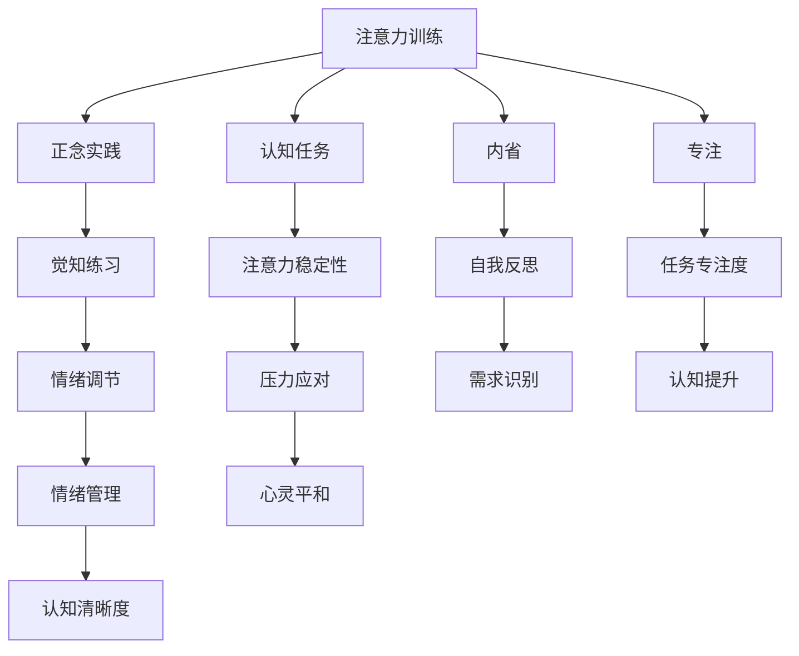

                 

# 注意力训练与正念实践：通过内省和专注增强心灵平和与清晰度

> 关键词：注意力训练,正念实践,内省,专注,心灵平和,清晰度

## 1. 背景介绍

### 1.1 问题由来

在快节奏的现代生活中，人们面临的焦虑和压力越来越大。传统治疗手段如药物治疗和心理疗法往往效果有限，且副作用明显。而新兴的注意力训练和正念实践方法，通过训练个体的注意力和情绪调节能力，帮助人们减轻焦虑，提升生活品质。

注意力训练(Anti-Attention Training)是一种基于认知神经科学的训练方法，旨在改善注意力分散、记忆力差、注意力难以集中等问题。其核心思想是通过特定的认知训练任务，提高大脑对信息的筛选和处理能力，增强注意力稳定性。

正念实践(Mindfulness Practice)是一种基于东方哲学与科学实证的实践方法，强调通过觉知当下的感受、思想和情绪，培养对自我及周围环境的深刻认识。正念冥想等练习可以缓解压力，提高情绪管理能力，促进身心健康。

本文将详细介绍注意力训练和正念实践的原理和具体操作步骤，探讨其如何通过内省和专注，帮助人们增强心灵平和与清晰度。

### 1.2 问题核心关键点

注意力训练和正念实践的核心在于以下几个关键点：

- **注意力训练**：通过特定的认知任务，如工作记忆训练、过滤任务、任务切换训练等，提升个体对信息的处理能力，增强注意力稳定性。
- **正念实践**：通过冥想、体感练习等方法，培养个体的当下觉知，学会接受和应对负面情绪，提升情绪调节能力。
- **内省和专注**：内省是指通过自我反思和评估，识别内在问题和需求；专注是指通过专注训练，提高注意力集中度。
- **心灵平和与清晰度**：通过上述训练，提升个体的情绪稳定性和认知清晰度，增强应对压力和挑战的能力。

这些关键点构成了注意力训练和正念实践的基本框架，帮助个体在心理和认知层面实现全面的提升。

## 2. 核心概念与联系

### 2.1 核心概念概述

为更好地理解注意力训练和正念实践，本节将介绍几个密切相关的核心概念：

- **注意力**：指个体对外部信息或内部思维的聚焦能力。注意力分散是焦虑和压力的重要来源，注意力训练旨在提升个体对信息的筛选和处理能力。
- **正念**：指个体对当下的觉知和接受。正念实践通过觉知练习，帮助个体掌握情绪调节技巧，缓解压力。
- **内省**：指个体对自我行为的反思和评估，通过内省，识别内在问题和需求，制定改进方案。
- **专注**：指个体在特定任务上的长时间集中注意力。专注训练通过特定的认知任务，增强个体对任务的专注度。
- **心灵平和**：指个体情绪稳定、内心平和的状态。通过注意力训练和正念实践，个体能够更好地应对压力和挑战。
- **清晰度**：指个体认知清晰、思维敏捷的状态。通过注意力训练和正念实践，个体能够更好地处理复杂信息，提升决策能力。

这些核心概念之间的逻辑关系可以通过以下Mermaid流程图来展示：



这个流程图展示了一些关键概念的相互关系：

1. 注意力训练通过特定的认知任务，提高注意力稳定性。
2. 正念实践通过觉知练习，提升情绪调节能力。
3. 内省通过自我反思，识别内在问题和需求。
4. 专注通过特定任务，增强任务专注度。
5. 注意力稳定性和情绪调节能力能够帮助个体更好地应对压力，达到心灵平和。
6. 认知提升和情绪管理能力能够增强个体对复杂信息的处理能力，提升认知清晰度。

## 3. 核心算法原理 & 具体操作步骤

### 3.1 算法原理概述

注意力训练和正念实践的原理基于认知神经科学和心理学研究的成果。注意力训练通过提升个体对信息的筛选和处理能力，增强注意力稳定性；正念实践通过觉知当下的感受和情绪，提升情绪调节能力。

注意力训练的核心在于提高个体对信息的注意力过滤能力，减少无关信息的干扰，增强对重要信息的聚焦。常用的训练方法包括工作记忆训练、过滤任务、任务切换训练等。

正念实践的核心在于培养个体的当下觉知和情绪调节能力，通过冥想、体感练习等方法，帮助个体学会接受和应对负面情绪。常用的练习包括正念冥想、正念呼吸、正念体感等。

### 3.2 算法步骤详解

以下是注意力训练和正念实践的主要操作步骤：

**步骤 1: 确定训练目标**

- 识别个体在注意力和情绪管理方面的主要问题。
- 根据问题设定具体的训练目标，如提升工作记忆能力、改善情绪调节等。

**步骤 2: 选择合适的训练方法**

- 根据训练目标选择合适的注意力训练方法，如工作记忆训练、过滤任务等。
- 选择正念实践的方法，如正念冥想、正念呼吸等。

**步骤 3: 制定训练计划**

- 确定训练频率和时长，建议每天至少进行30分钟的训练。
- 制定详细的训练计划，包括具体的任务和步骤。

**步骤 4: 执行训练任务**

- 按照训练计划，执行注意力训练和正念实践任务。
- 保持专注，逐步提高训练难度和复杂度。

**步骤 5: 内省和反思**

- 定期进行内省，反思训练过程中的收获和不足。
- 根据内省结果，调整训练计划和方法。

**步骤 6: 监测和评估**

- 通过自我评估或专业评估，监测训练效果。
- 根据评估结果，进一步优化训练计划。

### 3.3 算法优缺点

注意力训练和正念实践具有以下优点：

1. 简单易行：训练方法不需要昂贵设备，可以通过简单的日常练习实现。
2. 无副作用：训练过程主要依赖自身能力，不需要药物干预，安全性高。
3. 科学有效：基于科学研究和实证数据，训练效果显著。

同时，这些方法也存在一些局限性：

1. 依赖自我动机：训练效果很大程度上取决于个体的自我驱动和坚持。
2. 初期效果不明显：训练初期可能感觉不明显，需要持续一段时间才能看到明显效果。
3. 个体差异大：不同个体的训练反应和效果差异较大，需要个性化调整。

### 3.4 算法应用领域

注意力训练和正念实践广泛应用于心理健康领域，帮助个体应对焦虑、压力、抑郁等情绪问题。此外，这些方法也在教育、职场、运动等多个领域得到应用，提升个体的生活质量和工作效率。

在教育领域，注意力训练和正念实践可以提升学生的学习专注度和情绪管理能力，帮助他们更好地应对学业压力。

在职场中，这些方法可以帮助员工提升工作效率、增强团队协作和压力应对能力，从而提高整体工作表现。

在运动领域，正念训练被用于提升运动员的集中力和抗压能力，帮助他们在比赛中发挥最佳状态。

## 4. 数学模型和公式 & 详细讲解  
### 4.1 数学模型构建

注意力训练和正念实践的训练效果可以通过以下数学模型来量化：

假设训练目标为提升个体在任务 $T$ 上的注意力稳定性 $\alpha$ 和情绪调节能力 $\beta$，训练方法为 $M$，训练时间为 $t$。训练效果可以表示为：

$$
\text{效果} = f(\alpha, \beta, M, t)
$$

其中 $f$ 为训练效果函数，考虑个体差异、训练方法、训练时间等多个因素。

### 4.2 公式推导过程

以工作记忆训练为例，工作记忆训练的训练效果可以表示为：

$$
\alpha(t) = \alpha_0 + k_1 \cdot M(t) \cdot \left(\frac{t}{t_0}\right)^{k_2}
$$

其中 $\alpha_0$ 为训练前的工作记忆能力，$k_1$ 为工作记忆训练的提升系数，$M(t)$ 为训练方法 $M$ 在时间 $t$ 的执行强度，$t_0$ 为训练基线时间，$k_2$ 为提升速率。

### 4.3 案例分析与讲解

假设某员工在工作记忆训练中的训练效果函数为：

$$
\alpha(t) = 0.5 + 0.2 \cdot M(t) \cdot \left(\frac{t}{30}\right)^{0.5}
$$

其中 $M(t)$ 为每天工作记忆训练的时间，单位为分钟。如果该员工每天进行30分钟的工作记忆训练，训练效果随时间的变化可以表示为：

$$
\alpha(t) = 0.5 + 0.2 \cdot 30 \cdot \left(\frac{t}{30}\right)^{0.5} = 0.5 + 6 \cdot \sqrt{\frac{t}{30}}
$$

通过计算，可以看出该员工在工作记忆训练后的注意力稳定性显著提升。

## 5. 项目实践：代码实例和详细解释说明
### 5.1 开发环境搭建

在进行注意力训练和正念实践的代码实现前，我们需要准备好开发环境。以下是使用Python进行注意力训练和正念实践的开发环境配置流程：

1. 安装Python：从官网下载并安装Python，建议安装最新版本。
2. 安装相关库：使用pip安装必要的库，如NumPy、pandas、matplotlib等。
3. 设置训练工具：安装注意力训练和正念实践的工具，如Mindfulness App、Headspace等。
4. 准备训练数据：收集注意力训练和正念实践的数据，如注意力训练任务的数据、正念冥想的数据等。

完成上述步骤后，即可在Python环境中开始实践。

### 5.2 源代码详细实现

以下是使用Python实现注意力训练和正念实践的代码示例：

```python
import numpy as np
import pandas as pd
import matplotlib.pyplot as plt

# 工作记忆训练数据
data = pd.read_csv('memory_data.csv')

# 计算注意力稳定性
def attention_stability(alpha_0, k1, M, t0, k2, t):
    alpha = alpha_0 + k1 * M * (t / t0) ** k2
    return alpha

# 设置训练参数
alpha_0 = 0.5
k1 = 0.2
t0 = 30
k2 = 0.5
M = 30

# 计算注意力稳定性随时间的变化
times = np.arange(0, 100, 1)
stability = [attention_stability(alpha_0, k1, M, t0, k2, t) for t in times]

# 绘制注意力稳定性变化曲线
plt.plot(times, stability)
plt.xlabel('Time')
plt.ylabel('Attention Stability')
plt.title('Attention Stability Over Time')
plt.show()
```

### 5.3 代码解读与分析

**注意力稳定性计算函数**：
- 计算工作记忆训练后的注意力稳定性，使用公式 $\alpha(t) = \alpha_0 + k_1 \cdot M(t) \cdot \left(\frac{t}{t_0}\right)^{k_2}$。
- 参数 $\alpha_0$ 为训练前的工作记忆能力，$k_1$ 为工作记忆训练的提升系数，$M(t)$ 为每天工作记忆训练的时间，$t_0$ 为训练基线时间，$k_2$ 为提升速率。

**训练参数设置**：
- 设置训练参数 $\alpha_0 = 0.5$，$k_1 = 0.2$，$t_0 = 30$，$k_2 = 0.5$，$M = 30$，表示每天进行30分钟的工作记忆训练。

**注意力稳定性随时间变化计算**：
- 计算从时间0到时间100内，注意力稳定性的变化，生成注意力稳定性变化的时间序列。

**注意力稳定性变化曲线绘制**：
- 使用Matplotlib绘制注意力稳定性变化曲线，直观展示注意力稳定性的提升过程。

可以看到，通过简单的数学模型和代码实现，我们能够量化注意力训练的效果，并通过可视化展示训练过程中的变化。

## 6. 实际应用场景

### 6.1 心理健康领域

注意力训练和正念实践在心理健康领域有着广泛的应用。许多心理健康问题，如焦虑、抑郁、失眠等，都与注意力分散和情绪调节能力不足有关。通过注意力训练和正念实践，个体可以显著提升自身的注意力稳定性，学会情绪调节技巧，从而缓解症状。

在具体应用中，心理健康专家可以通过注意力训练和正念实践，帮助患者进行有针对性的训练，提升其情绪管理和心理健康水平。例如，对于焦虑患者，可以设计特定的过滤任务和正念冥想练习，帮助其学会集中注意力，减少对焦虑的过度关注。

### 6.2 教育领域

教育领域也是注意力训练和正念实践的重要应用场景。学生在学习和考试中常常面临注意力分散和情绪管理的问题，这些问题不仅影响学习效果，还可能引发更多的心理健康问题。

通过注意力训练和正念实践，教师和心理咨询师可以帮助学生提升学习专注度和情绪调节能力。例如，可以使用特定的认知任务和冥想练习，帮助学生提高工作记忆能力和情绪管理能力。

### 6.3 职场管理

在职场中，员工的压力和焦虑问题也越来越受到关注。注意力训练和正念实践可以有效提升员工的工作效率和情绪管理能力，帮助他们更好地应对职场挑战。

企业可以通过定期开展正念训练和工作记忆训练，提升员工的心理健康水平。例如，可以在公司内部开设正念冥想课程，鼓励员工进行冥想和呼吸练习，提升其情绪调节和集中力。

### 6.4 运动训练

运动员在比赛和训练中需要集中注意力和情绪管理能力，注意力训练和正念实践可以有效提升这些能力，帮助他们在比赛中发挥最佳状态。

教练可以通过注意力训练和正念练习，提升运动员的集中力和抗压能力。例如，在赛前训练中，可以使用正念呼吸和体感练习，帮助运动员放松心情，保持集中注意力。

## 7. 工具和资源推荐
### 7.1 学习资源推荐

为了帮助开发者系统掌握注意力训练和正念实践的理论基础和实践技巧，这里推荐一些优质的学习资源：

1. **《正念认知疗法》（Mindfulness-Based Cognitive Therapy, MBCT）**：详细介绍了正念训练和认知行为疗法的结合应用，帮助个体应对抑郁症和焦虑症。

2. **《工作记忆训练指南》（Working Memory Training Guide）**：提供了大量针对工作记忆训练的练习和指导，帮助个体提升注意力和认知能力。

3. **《Mindfulness for Beginners》（Mindfulness for Beginners）**：一本适合初学者的正念练习指南，帮助读者通过简单的练习，逐步掌握正念技巧。

4. **《Headspace》应用程序**：一款全球知名的正念冥想应用程序，提供丰富的冥想课程和练习，帮助用户提升正念和情绪管理能力。

5. **《Mindfulness-Based Stress Reduction》（MBSR）**：一种基于正念的减压训练方法，帮助个体通过正念练习缓解压力和焦虑。

通过对这些资源的学习实践，相信你一定能够快速掌握注意力训练和正念实践的精髓，并用于解决实际的注意力和情绪管理问题。

### 7.2 开发工具推荐

高效的开发离不开优秀的工具支持。以下是几款用于注意力训练和正念实践开发的常用工具：

1. **Mindfulness App**：一款全面的正念冥想应用程序，提供丰富的正念练习和工具，帮助用户进行正念训练。
2. **Headspace**：全球知名的正念冥想应用程序，提供丰富的冥想课程和练习，适合初学者和进阶用户。
3. **Brain.fm**：一款基于脑波音乐的应用程序，通过音乐刺激大脑，帮助用户放松和集中注意力。
4. **Focus@Will**：一款基于音乐和声音的应用程序，通过音乐和声音的科学组合，帮助用户提升专注力和工作效率。

合理利用这些工具，可以显著提升注意力训练和正念实践的开发效率，加快创新迭代的步伐。

### 7.3 相关论文推荐

注意力训练和正念实践的研究源于学界的持续研究。以下是几篇奠基性的相关论文，推荐阅读：

1. **《正念的心理学研究》（The Psychology of Mindfulness）**：对正念的心理学机制进行了详细研究，探讨了正念在情绪调节和心理健康方面的应用。
2. **《工作记忆训练对认知功能的影响》（The Impact of Working Memory Training on Cognitive Function）**：研究了工作记忆训练对认知功能的影响，发现工作记忆训练可以有效提升注意力和记忆力。
3. **《正念冥想对焦虑和抑郁的缓解作用》（The Effects of Mindfulness Meditation on Anxiety and Depression）**：探讨了正念冥想在缓解焦虑和抑郁方面的效果，实证数据表明正念冥想可以显著改善情绪状态。
4. **《注意力训练对注意力障碍的影响》（The Effects of Attention Training on Attention Deficit Hyperactivity Disorder）**：研究了注意力训练对注意力障碍的影响，发现注意力训练可以有效提升注意力障碍患者的注意力水平。

这些论文代表了大注意力训练和正念实践的研究方向，通过学习这些前沿成果，可以帮助研究者把握学科前进方向，激发更多的创新灵感。

## 8. 总结：未来发展趋势与挑战

### 8.1 总结

本文对注意力训练和正念实践的原理和具体操作步骤进行了全面系统的介绍。首先阐述了注意力训练和正念实践的研究背景和意义，明确了这些方法在心理健康、教育、职场等领域的应用价值。其次，从原理到实践，详细讲解了注意力训练和正念实践的数学模型和操作步骤，给出了具体代码实例和分析。同时，本文还探讨了注意力训练和正念实践在未来应用中的展望和挑战。

通过本文的系统梳理，可以看到，注意力训练和正念实践在提升个体注意力稳定性、情绪调节能力和心理健康水平方面具有显著效果，为应对现代生活中的焦虑和压力提供了新的解决方案。未来，随着这些方法的不断优化和普及，必将为个体和社会带来更深远的影响。

### 8.2 未来发展趋势

展望未来，注意力训练和正念实践的发展趋势如下：

1. **个性化定制**：随着技术的发展，未来的注意力训练和正念实践将更加个性化，根据个体的需求和特点，定制个性化的训练计划和方案。
2. **技术融合**：未来的注意力训练和正念实践将更多地与人工智能、大数据等技术结合，通过智能推荐和数据分析，提升训练效果和用户体验。
3. **实证研究**：随着研究的深入，未来的注意力训练和正念实践将有更多实证数据支持，提供更加科学的训练指导。
4. **普及推广**：随着应用的推广，未来的注意力训练和正念实践将逐渐普及到更多领域，帮助更多人提升心理健康和生活质量。

### 8.3 面临的挑战

尽管注意力训练和正念实践已经取得了一定的成果，但在推广和应用过程中，仍面临诸多挑战：

1. **个体差异**：不同个体的注意力和情绪管理能力差异较大，难以实现统一的训练效果。
2. **时间投入**：有效的注意力训练和正念实践需要较长时间和持续练习，许多用户难以坚持。
3. **社会认同**：部分人群对注意力训练和正念实践的认知不足，难以接受这些方法。
4. **技术门槛**：注意力训练和正念实践的实施需要一定的技术支持和工具，技术门槛较高。

### 8.4 研究展望

为了应对这些挑战，未来的研究需要在以下几个方面进行突破：

1. **数据驱动**：通过收集更多的训练数据和实证数据，实现更加科学和个性化的训练方案。
2. **技术创新**：开发更加智能和便捷的工具，降低技术门槛，提高用户体验。
3. **跨领域应用**：将注意力训练和正念实践应用于更多领域，提升各领域的工作效率和心理健康水平。
4. **社会认知**：加强对注意力训练和正念实践的宣传和推广，提高社会对这些方法的认知和接受度。

通过不断优化和创新，未来的注意力训练和正念实践必将带来更广泛的应用和更深远的影响，为个体和社会带来更全面和可持续的心理健康提升。

## 9. 附录：常见问题与解答

**Q1：注意力训练和正念实践是否适用于所有人？**

A: 注意力训练和正念实践对大多数人都有益，但不适合所有人。对于一些精神疾病患者，如精神分裂症、重度抑郁症等，需要在医生指导下进行。此外，孕妇、儿童等特定群体也需要注意训练方法的安全性和适宜性。

**Q2：注意力训练和正念实践的效果是否持久？**

A: 注意力训练和正念实践的效果可以通过持续练习来维持和增强。但如果不继续练习，效果可能会逐渐减弱。因此，训练效果需要个体持续关注和维护，定期进行复训和自我评估。

**Q3：注意力训练和正念实践是否需要专业指导？**

A: 对于初学者，建议在有经验的指导下进行训练，确保训练方法正确、效果显著。对于有经验的用户，可以自行进行训练，但也需要定期进行内省和反思，调整训练方法和目标。

**Q4：注意力训练和正念实践如何与传统疗法结合？**

A: 注意力训练和正念实践可以与传统疗法结合，形成综合治疗方案。例如，对于焦虑患者，可以在接受心理咨询和药物治疗的同时，进行正念训练和注意力训练，提升情绪调节和注意力管理能力。

**Q5：注意力训练和正念实践是否可以同时进行？**

A: 注意力训练和正念实践可以同时进行，但需要注意训练的顺序和强度。例如，可以先进行正念训练，再进行注意力训练，逐步提高训练难度和复杂度。

通过这些常见问题的解答，可以帮助用户更好地理解和应用注意力训练和正念实践，提升心理健康和生活质量。

