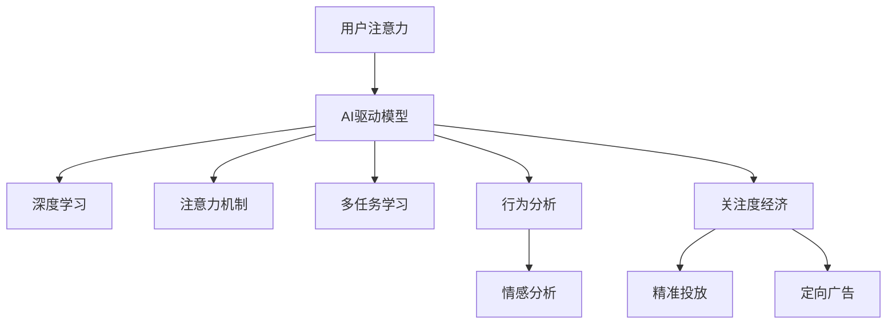

                 

# 注意力货币化策略：AI驱动的关注度经济模型

## 1. 背景介绍

### 1.1 问题由来
在数字经济时代，用户注意力作为一种稀缺资源，成为驱动互联网企业发展的核心动力。然而，如何准确衡量和高效利用用户注意力，最大化其商业价值，成为各企业亟待解决的问题。随着人工智能技术的飞速发展，特别是深度学习和大数据分析技术的普及，利用AI技术挖掘和利用用户关注度，逐渐成为互联网企业的关注焦点。

近年来，众多互联网企业开始尝试利用AI技术对用户注意力进行数字化建模，进而将这种无形资产转化为可量化、可运营的关注度经济。例如，通过行为分析、文本挖掘、情感分析等技术，对用户的浏览、点击、分享等行为进行建模，预测其未来的注意力分配，并据此进行精准投放和定向广告，实现用户注意力的货币化。

### 1.2 问题核心关键点
AI驱动的关注度经济模型主要关注以下几个核心问题：

- 如何准确量化用户注意力：通过深度学习模型对用户的行为数据进行建模，提取关键特征。
- 如何高效利用用户注意力：利用预测模型对用户的未来注意力进行预测，实现精准投放和定向广告。
- 如何提升模型效果：优化深度学习模型结构，引入更多的先验知识，提高模型的泛化能力和鲁棒性。
- 如何规避伦理风险：在数据处理和模型设计过程中，确保用户隐私保护，避免数据滥用和模型偏见。

## 2. 核心概念与联系

### 2.1 核心概念概述

为更好地理解AI驱动的关注度经济模型，本节将介绍几个密切相关的核心概念：

- **用户注意力**：用户对特定内容、活动或产品的关注程度。通常通过用户的点击、停留时间、转发等行为进行量化。
- **AI驱动模型**：使用深度学习等AI技术对用户注意力进行建模和预测的算法模型。常见的模型包括序列建模、多任务学习、注意力机制等。
- **关注度经济**：将用户注意力转化为商业价值的过程，通过精准投放和定向广告，实现流量变现和经济效益。
- **深度学习**：一类基于神经网络的机器学习技术，通过多层非线性变换，实现对复杂数据的建模和预测。
- **注意力机制**：一种用于提升神经网络模型对输入数据中关键信息聚焦能力的机制，常见的注意力机制包括自注意力、多头注意力等。
- **多任务学习**：一种模型训练策略，同一模型同时预测多个任务，以利用任务间共性，提升模型泛化能力和效率。
- **行为分析**：通过分析用户的行为数据，提取其特征，构建用户画像，预测其未来行为。
- **情感分析**：利用自然语言处理技术，分析用户文本内容，识别其情感倾向，辅助用户注意力建模。

这些核心概念之间的逻辑关系可以通过以下Mermaid流程图来展示：



这个流程图展示了几大核心概念之间的相互关系：

1. 用户注意力是AI驱动模型的输入。
2. AI驱动模型基于深度学习、注意力机制、多任务学习等技术，对用户注意力进行建模和预测。
3. 行为分析和情感分析是用户注意力建模的重要补充。
4. 关注度经济是通过精准投放和定向广告，将用户注意力转化为商业价值的过程。

## 3. 核心算法原理 & 具体操作步骤
### 3.1 算法原理概述

AI驱动的关注度经济模型主要基于深度学习技术，通过对用户行为数据的分析，挖掘和量化用户注意力。其核心思想是：利用深度学习模型，构建用户注意力预测模型，结合行为分析、情感分析等技术，对用户未来的注意力分配进行预测，进而实现精准投放和定向广告。

形式化地，假设用户注意力为 $A$，关注度经济模型为 $M$，行为特征为 $X$，情感特征为 $Y$，则关注度经济模型的目标函数为：

$$
\hat{A} = M(X, Y)
$$

其中，$\hat{A}$ 为模型预测的用户注意力，$M$ 为预测模型，$X$ 为行为特征，$Y$ 为情感特征。

模型的训练目标是最小化预测值与实际值之间的差异，即：

$$
\mathcal{L}(M) = \frac{1}{N} \sum_{i=1}^N \mathcal{L}(\hat{A}_i, A_i)
$$

其中，$\mathcal{L}$ 为预测误差函数，$N$ 为样本数量。

### 3.2 算法步骤详解

AI驱动的关注度经济模型的构建一般包括以下几个关键步骤：

**Step 1: 数据收集与预处理**
- 收集用户的行为数据、文本数据等，进行数据清洗、去重和归一化等预处理操作。
- 将数据集划分为训练集、验证集和测试集，保持数据分布的一致性。

**Step 2: 特征提取**
- 对用户行为数据进行特征提取，构建用户画像，获取行为特征 $X$。
- 对用户文本数据进行情感分析，提取情感特征 $Y$。
- 将 $X$ 和 $Y$ 作为深度学习模型的输入。

**Step 3: 模型构建与训练**
- 选择合适的深度学习模型，如RNN、CNN、Transformer等，构建关注度经济模型。
- 设计合适的损失函数和优化算法，如均方误差、交叉熵、Adam等，进行模型训练。
- 在训练过程中，应用早停、正则化等技术，避免过拟合。

**Step 4: 模型评估与优化**
- 在验证集上评估模型性能，计算预测误差、精度、召回率等指标。
- 根据评估结果，调整模型结构和超参数，进行模型优化。
- 在测试集上重新评估模型性能，确保模型泛化能力。

**Step 5: 关注度经济实现**
- 利用优化后的模型对新用户行为进行预测，提取其关注度。
- 根据预测结果，进行精准投放和定向广告。
- 收集投放效果数据，反馈优化模型。

以上是AI驱动的关注度经济模型的构建步骤。在实际应用中，还需要针对具体业务场景，对数据收集、特征提取、模型设计等环节进行优化设计，以进一步提升模型性能。

### 3.3 算法优缺点

AI驱动的关注度经济模型具有以下优点：

1. 高效准确：深度学习模型能够从大量数据中自动提取关键特征，准确预测用户注意力。
2. 实时响应：关注度经济模型可以实时处理用户行为数据，快速响应市场需求。
3. 可解释性强：深度学习模型可以提供关注度预测的内部机制，易于解释和优化。
4. 灵活适应：通过调整模型结构和超参数，可以灵活应对不同业务场景和数据分布。

同时，该模型也存在一定的局限性：

1. 依赖高质量数据：深度学习模型的性能依赖于高质量、标注数据的数量和质量，数据获取成本较高。
2. 模型复杂度高：深度学习模型的结构复杂，计算资源消耗较大。
3. 泛化能力差：深度学习模型容易过拟合，泛化能力有待提高。
4. 数据隐私问题：用户行为数据涉及隐私保护，数据获取和处理过程中需注意隐私保护。

尽管存在这些局限性，但就目前而言，AI驱动的关注度经济模型仍是大数据分析和AI技术结合的重要应用方向。未来相关研究的重点在于如何进一步降低数据获取成本，提高模型泛化能力，同时兼顾隐私保护和模型可解释性等因素。

### 3.4 算法应用领域

AI驱动的关注度经济模型已在多个行业领域得到应用，例如：

- 互联网广告：通过精准投放和定向广告，提升广告投放效果，实现流量变现。
- 电子商务：通过推荐系统，向用户推荐商品，提升销售转化率。
- 内容创作：通过分析用户关注度，指导内容生产，提升内容质量和用户粘性。
- 金融理财：通过用户行为数据，分析投资趋势，提供精准理财建议。
- 医疗健康：通过用户健康行为数据，分析健康风险，提供个性化健康管理方案。

除了上述这些常见应用外，AI驱动的关注度经济模型还被创新性地应用于更多场景中，如智能客服、智慧城市、智能推荐等，为各行各业带来了新的增长点和创新点。

## 4. 数学模型和公式 & 详细讲解 & 举例说明

### 4.1 数学模型构建

本节将使用数学语言对AI驱动的关注度经济模型进行更加严格的刻画。

记用户注意力为 $A$，行为特征为 $X$，情感特征为 $Y$，深度学习模型为 $M$。关注度经济模型的目标函数为：

$$
\hat{A} = M(X, Y)
$$

其中，$\hat{A}$ 为模型预测的用户注意力，$M$ 为预测模型，$X$ 为行为特征，$Y$ 为情感特征。模型的训练目标是最小化预测值与实际值之间的差异，即：

$$
\mathcal{L}(M) = \frac{1}{N} \sum_{i=1}^N \mathcal{L}(\hat{A}_i, A_i)
$$

其中，$\mathcal{L}$ 为预测误差函数，$N$ 为样本数量。

### 4.2 公式推导过程

以下我们以序列预测为例，推导深度学习模型的损失函数和梯度计算公式。

假设用户行为数据 $X$ 由 $T$ 个时间步构成，情感特征 $Y$ 同样由 $T$ 个时间步构成。记预测模型 $M$ 的参数为 $\theta$，则有：

$$
\hat{A} = M(X, Y; \theta)
$$

假设模型 $M$ 为序列模型，如RNN、LSTM等，则有：

$$
\hat{A}_t = M_t(X_t, Y_t; \theta)
$$

其中，$M_t$ 表示时间步 $t$ 处的模型参数，$X_t$ 表示时间步 $t$ 处的行为特征，$Y_t$ 表示时间步 $t$ 处的情感特征。

假设预测值和实际值之间的误差为 $e_t = A_t - \hat{A}_t$，则预测模型的损失函数为：

$$
\mathcal{L}(\hat{A}, A; \theta) = \frac{1}{N} \sum_{t=1}^T \sum_{i=1}^N e_i^2
$$

对于时间步 $t$ 处的预测误差，有：

$$
e_t = A_t - \hat{A}_t
$$

利用链式法则，预测误差对模型参数 $\theta$ 的梯度为：

$$
\frac{\partial \mathcal{L}}{\partial \theta} = -2\frac{1}{N} \sum_{t=1}^T \sum_{i=1}^N \frac{\partial \hat{A}_t}{\partial \theta} e_t
$$

其中，$\frac{\partial \hat{A}_t}{\partial \theta}$ 为模型对时间步 $t$ 的预测误差对模型参数 $\theta$ 的偏导数。

在得到损失函数的梯度后，即可带入深度学习算法，如反向传播算法，更新模型参数 $\theta$，完成模型的训练和优化。

### 4.3 案例分析与讲解

考虑一个电商平台的精准投放场景，假设平台收集了用户的浏览、点击、购买等行为数据，以及用户在评论中的情感表达。使用深度学习模型对用户行为进行建模，提取行为特征 $X$ 和情感特征 $Y$，并设计关注度经济模型 $M$。

具体步骤如下：

1. **数据收集与预处理**：
   - 收集用户的浏览记录、点击记录和购买记录，并进行去重、清洗和归一化等预处理操作。
   - 收集用户在商品评论中的文本数据，并进行情感分析，提取情感特征。

2. **特征提取**：
   - 对用户行为数据进行特征提取，构建用户画像，获取行为特征 $X$。
   - 对用户评论数据进行情感分析，提取情感特征 $Y$。

3. **模型构建与训练**：
   - 选择合适的深度学习模型，如RNN、LSTM等，构建关注度经济模型 $M$。
   - 设计合适的损失函数和优化算法，如均方误差、交叉熵、Adam等，进行模型训练。
   - 应用早停、正则化等技术，避免过拟合。

4. **模型评估与优化**：
   - 在验证集上评估模型性能，计算预测误差、精度、召回率等指标。
   - 根据评估结果，调整模型结构和超参数，进行模型优化。
   - 在测试集上重新评估模型性能，确保模型泛化能力。

5. **关注度经济实现**：
   - 利用优化后的模型对新用户行为进行预测，提取其关注度。
   - 根据预测结果，进行精准投放和定向广告。
   - 收集投放效果数据，反馈优化模型。

通过上述步骤，电商平台可以根据用户的关注度，实现精准投放和定向广告，提升广告效果和用户粘性，实现流量变现。

## 5. 项目实践：代码实例和详细解释说明
### 5.1 开发环境搭建

在进行关注度经济模型开发前，我们需要准备好开发环境。以下是使用Python进行PyTorch开发的环境配置流程：

1. 安装Anaconda：从官网下载并安装Anaconda，用于创建独立的Python环境。

2. 创建并激活虚拟环境：
```bash
conda create -n pytorch-env python=3.8 
conda activate pytorch-env
```

3. 安装PyTorch：根据CUDA版本，从官网获取对应的安装命令。例如：
```bash
conda install pytorch torchvision torchaudio cudatoolkit=11.1 -c pytorch -c conda-forge
```

4. 安装各类工具包：
```bash
pip install numpy pandas scikit-learn matplotlib tqdm jupyter notebook ipython
```

完成上述步骤后，即可在`pytorch-env`环境中开始关注度经济模型的开发。

### 5.2 源代码详细实现

这里我们以电商平台的精准投放场景为例，给出使用PyTorch对用户行为进行建模的代码实现。

首先，定义数据处理函数：

```python
import pandas as pd
import numpy as np
from sklearn.preprocessing import StandardScaler
from sklearn.model_selection import train_test_split

# 读取数据
data = pd.read_csv('user_behavior.csv')

# 特征工程：行为特征归一化、情感特征编码
X = data[['浏览时长', '点击次数', '购买金额']] / data[['浏览时长', '点击次数', '购买金额']].mean()
Y = pd.get_dummies(data['评论情感'], prefix='情感')
X = StandardScaler().fit_transform(X)

# 数据划分
X_train, X_test, y_train, y_test = train_test_split(X, Y, test_size=0.2, random_state=42)

# 模型参数设置
input_size = X.shape[1]
hidden_size = 128
num_layers = 2
output_size = Y.shape[1]
learning_rate = 0.001
num_epochs = 100

# 构建模型
class LSTM(nn.Module):
    def __init__(self, input_size, hidden_size, num_layers, output_size):
        super(LSTM, self).__init__()
        self.hidden_size = hidden_size
        self.num_layers = num_layers
        self.lstm = nn.LSTM(input_size, hidden_size, num_layers, batch_first=True)
        self.fc = nn.Linear(hidden_size, output_size)

    def forward(self, x):
        h0 = torch.zeros(num_layers, x.size(0), self.hidden_size).to(device)
        c0 = torch.zeros(num_layers, x.size(0), self.hidden_size).to(device)
        out, _ = self.lstm(x, (h0, c0))
        out = self.fc(out[:, -1, :])
        return out

# 定义训练函数
def train(model, X_train, y_train, X_test, y_test, learning_rate, num_epochs):
    device = torch.device('cuda' if torch.cuda.is_available() else 'cpu')
    model.to(device)
    optimizer = torch.optim.Adam(model.parameters(), lr=learning_rate)
    criterion = nn.CrossEntropyLoss()
    
    for epoch in range(num_epochs):
        loss = 0
        model.train()
        for i in range(X_train.shape[0]):
            inputs = X_train[i:i+1, :].to(device)
            targets = y_train[i:i+1, :].to(device)
            optimizer.zero_grad()
            outputs = model(inputs)
            loss += criterion(outputs, targets)
            loss.backward()
            optimizer.step()
        print(f'Epoch {epoch+1}, loss: {loss:.4f}')
    
    model.eval()
    with torch.no_grad():
        test_loss = 0
        correct = 0
        for i in range(X_test.shape[0]):
            inputs = X_test[i:i+1, :].to(device)
            targets = y_test[i:i+1, :].to(device)
            outputs = model(inputs)
            test_loss += criterion(outputs, targets)
            _, predicted = torch.max(outputs.data, 1)
            correct += (predicted == targets).sum().item()
        test_loss /= X_test.shape[0]
        print(f'Test loss: {test_loss:.4f}, accuracy: {correct/X_test.shape[0]*100:.2f}%')
```

然后，定义模型和训练函数：

```python
# 构建模型
model = LSTM(input_size, hidden_size, num_layers, output_size)

# 训练模型
train(model, X_train, y_train, X_test, y_test, learning_rate, num_epochs)
```

### 5.3 代码解读与分析

让我们再详细解读一下关键代码的实现细节：

**数据处理函数**：
- 读取用户行为数据，并进行特征工程处理，包括行为特征归一化、情感特征编码。
- 使用sklearn的StandardScaler对行为特征进行归一化，使用Pandas的get_dummies函数对情感特征进行独热编码。

**LSTM模型定义**：
- 定义LSTM模型类，继承自nn.Module，设置模型的输入、隐藏层大小、层数和输出大小。
- 初始化LSTM层和全连接层，在前向传播过程中，进行LSTM的前向计算和全连接层输出。

**训练函数定义**：
- 在训练过程中，使用PyTorch的Adam优化器和交叉熵损失函数，进行模型的前向传播和反向传播。
- 在训练结束后，在测试集上重新评估模型性能。

通过上述步骤，电商平台的关注度经济模型已成功构建。接下来，需要进一步优化模型，确保其在实际应用中的效果。

## 6. 实际应用场景

### 6.1 互联网广告

互联网广告是AI驱动关注度经济模型的典型应用场景。传统广告投放方式往往缺乏精准度，无法实现真正的用户定向。而通过AI模型预测用户的注意力分布，可以实现精准投放和定向广告，最大化广告效果。

具体实现中，广告平台收集用户的浏览记录、点击记录和行为数据，使用深度学习模型进行用户画像构建和行为特征提取，设计关注度经济模型，预测用户的未来注意力。根据预测结果，进行精准投放和定向广告，提升广告效果和用户粘性。

### 6.2 电子商务

电子商务平台利用关注度经济模型进行推荐系统优化，提升用户转化率和销售业绩。通过深度学习模型对用户行为数据进行建模，提取关键特征，预测用户的关注度。根据预测结果，进行个性化推荐，提供精准的商品推荐，提升用户购买意愿和满意度。

在实际应用中，电商平台可以收集用户的浏览、点击、购买等行为数据，进行行为特征提取和情感分析，设计关注度经济模型，预测用户的未来关注度。根据预测结果，进行个性化推荐和精准投放，提升用户转化率和平台业绩。

### 6.3 内容创作

内容创作平台利用关注度经济模型，指导内容生产和运营策略。通过深度学习模型对用户行为数据进行建模，预测用户的关注度分布。根据预测结果，优化内容生产和分发策略，提升用户粘性和平台流量。

在实际应用中，内容创作平台可以收集用户的阅读、分享、评论等行为数据，进行行为特征提取和情感分析，设计关注度经济模型，预测用户的未来关注度。根据预测结果，优化内容生产和分发策略，提升用户粘性和平台流量。

### 6.4 金融理财

金融理财平台利用关注度经济模型进行投资决策和风险管理。通过深度学习模型对用户行为数据进行建模，预测用户的关注度和投资偏好。根据预测结果，进行精准的投资推荐和风险管理，提升用户满意度和平台价值。

在实际应用中，金融理财平台可以收集用户的交易记录、账户余额、理财偏好等行为数据，进行行为特征提取和情感分析，设计关注度经济模型，预测用户的未来关注度。根据预测结果，进行精准的投资推荐和风险管理，提升用户满意度和平台价值。

## 7. 工具和资源推荐
### 7.1 学习资源推荐

为了帮助开发者系统掌握关注度经济模型的理论基础和实践技巧，这里推荐一些优质的学习资源：

1. 《深度学习》系列书籍：深度学习领域的经典教材，全面介绍了深度学习的基本概念和核心技术。
2. CS231n《卷积神经网络》课程：斯坦福大学开设的深度学习课程，涵盖神经网络、卷积神经网络等内容，适合深度学习初学者。
3. PyTorch官方文档：PyTorch官方文档，提供了丰富的深度学习模型和工具，是深度学习开发者的必备资源。
4. TensorFlow官方文档：TensorFlow官方文档，提供了丰富的深度学习模型和工具，是深度学习开发者的必备资源。
5. HuggingFace官方文档：HuggingFace官方文档，提供了丰富的自然语言处理模型和工具，是自然语言处理开发者的必备资源。

通过对这些资源的学习实践，相信你一定能够快速掌握深度学习模型的核心技术和实际应用。

### 7.2 开发工具推荐

高效的开发离不开优秀的工具支持。以下是几款用于深度学习模型开发和训练的常用工具：

1. PyTorch：基于Python的开源深度学习框架，灵活动态的计算图，适合快速迭代研究。
2. TensorFlow：由Google主导开发的开源深度学习框架，生产部署方便，适合大规模工程应用。
3. Keras：基于Python的高层深度学习框架，提供了丰富的深度学习模型和工具，易于上手使用。
4. Weights & Biases：模型训练的实验跟踪工具，可以记录和可视化模型训练过程中的各项指标，方便对比和调优。
5. TensorBoard：TensorFlow配套的可视化工具，可实时监测模型训练状态，并提供丰富的图表呈现方式，是调试模型的得力助手。

合理利用这些工具，可以显著提升深度学习模型开发的效率，加快创新迭代的步伐。

### 7.3 相关论文推荐

深度学习模型的发展源于学界的持续研究。以下是几篇奠基性的相关论文，推荐阅读：

1. Deep Learning：深度学习领域的经典教材，由Yoshua Bengio、Ian Goodfellow和Aaron Courville合著。
2. ImageNet Classification with Deep Convolutional Neural Networks：提出卷积神经网络，开创了计算机视觉领域的深度学习时代。
3. Attention is All You Need：提出Transformer结构，开启了自然语言处理领域的预训练大模型时代。
4. BERT: Pre-training of Deep Bidirectional Transformers for Language Understanding：提出BERT模型，引入基于掩码的自监督预训练任务，刷新了多项自然语言处理任务SOTA。
5. Seq2Seq Model for Image Caption Generation：提出序列到序列模型，为机器翻译、图像描述生成等任务奠定了基础。

通过对这些论文的学习实践，相信你一定能够深入理解深度学习模型的核心思想和前沿技术。

## 8. 总结：未来发展趋势与挑战

### 8.1 总结

本文对AI驱动的关注度经济模型进行了全面系统的介绍。首先阐述了关注度经济模型的研究背景和意义，明确了关注度经济模型在数字经济中的重要作用。其次，从原理到实践，详细讲解了关注度经济模型的数学模型和构建步骤，给出了关注度经济模型开发的完整代码实例。同时，本文还广泛探讨了关注度经济模型在互联网广告、电子商务、内容创作、金融理财等多个行业领域的应用前景，展示了关注度经济模型的巨大潜力。此外，本文精选了关注度经济模型的各类学习资源，力求为读者提供全方位的技术指引。

通过本文的系统梳理，可以看到，AI驱动的关注度经济模型在数据挖掘和用户行为分析方面具有显著优势，能够高效准确地预测用户注意力，实现精准投放和定向广告，具有广泛的应用前景。未来，随着深度学习模型的不断演进和优化，关注度经济模型必将在数字经济中发挥更加重要的作用，推动各行业进入智能化、精准化的新阶段。

### 8.2 未来发展趋势

展望未来，关注度经济模型将呈现以下几个发展趋势：

1. 模型规模持续增大。随着算力成本的下降和数据规模的扩张，深度学习模型的参数量还将持续增长。超大规模模型蕴含的丰富特征信息，有望进一步提升关注度预测的准确性。
2. 模型结构更加灵活。未来的深度学习模型将更加注重模型的灵活性和可解释性，引入更多的先验知识和规则，增强模型的泛化能力和鲁棒性。
3. 跨模态融合深入。未来的模型将不仅关注单一模态数据，而是融合视觉、语音、文本等多模态信息，提升模型的多任务处理能力。
4. 隐私保护日益重视。随着数据隐私保护法规的加强，未来的关注度经济模型将更加注重数据隐私保护，确保用户隐私不被滥用。
5. 实时性需求增加。随着实时性要求的提高，未来的关注度经济模型将更加注重实时处理能力，以支持动态预测和实时投放。

以上趋势凸显了关注度经济模型在数字经济中的巨大潜力。这些方向的探索发展，必将进一步提升关注度经济模型的性能和应用范围，为各行业带来更多的经济价值和社会效益。

### 8.3 面临的挑战

尽管关注度经济模型已经取得了瞩目成就，但在迈向更加智能化、普适化应用的过程中，它仍面临诸多挑战：

1. 数据获取瓶颈。深度学习模型的性能依赖于高质量、大规模的数据，获取高质量标注数据成本较高。如何降低数据获取成本，是关注度经济模型面临的重要挑战。
2. 模型复杂度提升。随着模型规模的增大，模型结构更加复杂，计算资源消耗也随之增加。如何降低模型复杂度，提高计算效率，是关注度经济模型亟待解决的问题。
3. 泛化能力不足。深度学习模型容易过拟合，泛化能力有待提高。如何提升模型的泛化能力，确保其在新场景下的稳定性和鲁棒性，是关注度经济模型面临的重要挑战。
4. 隐私保护问题。关注度经济模型涉及用户隐私保护，数据获取和处理过程中需注意隐私保护。如何确保用户数据的安全和隐私，是关注度经济模型面临的重要挑战。
5. 可解释性不足。深度学习模型的决策过程通常缺乏可解释性，难以对其推理逻辑进行分析和调试。如何赋予模型更强的可解释性，确保其决策过程透明，是关注度经济模型面临的重要挑战。

尽管存在这些挑战，但通过不断优化模型结构和优化算法，结合跨模态融合、隐私保护等前沿技术，关注度经济模型必将在未来的数字经济中发挥更加重要的作用，成为推动各行业智能化发展的关键技术。

### 8.4 研究展望

面向未来，关注度经济模型的研究需要在以下几个方面寻求新的突破：

1. 探索无监督和半监督关注度预测方法。摆脱对大规模标注数据的依赖，利用自监督学习、主动学习等无监督和半监督范式，最大限度利用非结构化数据，实现更加灵活高效的关注度预测。
2. 研究关注度预测的跨模态融合方法。融合视觉、语音、文本等多模态信息，提升模型的多任务处理能力，增强模型的泛化能力和鲁棒性。
3. 引入更多先验知识和规则。将符号化的先验知识，如知识图谱、逻辑规则等，与神经网络模型进行巧妙融合，引导关注度预测过程学习更准确、合理的语言模型。
4. 结合因果分析和博弈论工具。将因果分析方法引入关注度预测模型，识别出模型决策的关键特征，增强输出解释的因果性和逻辑性。借助博弈论工具刻画人机交互过程，主动探索并规避模型的脆弱点，提高系统稳定性。
5. 纳入伦理道德约束。在模型训练目标中引入伦理导向的评估指标，过滤和惩罚有害的输出倾向，确保用户数据的安全和隐私，避免数据滥用和模型偏见。

这些研究方向将进一步推动关注度经济模型的技术进步，为数字经济中的智能决策和精准投放提供更加高效、透明、可解释的技术支持。面向未来，关注度经济模型需要与其他人工智能技术进行更深入的融合，多路径协同发力，共同推动数字经济的智能化、普适化发展。

## 9. 附录：常见问题与解答

**Q1：关注度经济模型如何量化用户注意力？**

A: 关注度经济模型通过深度学习模型对用户的行为数据进行建模，提取关键特征，预测用户的未来注意力。具体实现中，可以使用RNN、LSTM、Transformer等深度学习模型，对用户行为数据进行序列建模，提取行为特征和情感特征，构建关注度经济模型，预测用户的未来注意力。

**Q2：关注度经济模型是否适用于所有业务场景？**

A: 关注度经济模型在大多数业务场景中都能取得不错的效果，但也有一些场景可能不适合。例如，对于一些数据分布极度不均或噪声较多的场景，关注度经济模型的效果可能不佳。此外，对于一些需要高度精细化和个性化的业务场景，关注度经济模型可能难以满足需求。因此，在实际应用中，需要根据具体业务场景的特点，进行模型选择和优化。

**Q3：如何提高关注度经济模型的泛化能力？**

A: 提高关注度经济模型的泛化能力，可以从以下几个方面入手：
1. 数据扩充：通过数据增强、数据合成等方法，扩充训练集，提高模型的泛化能力。
2. 正则化：引入L2正则、Dropout等正则化技术，避免模型过拟合。
3. 集成学习：采用模型集成方法，如Bagging、Boosting等，提高模型的泛化能力。
4. 迁移学习：利用预训练模型和迁移学习技术，提高模型的泛化能力。

**Q4：关注度经济模型在数据隐私保护方面有哪些挑战？**

A: 关注度经济模型涉及用户隐私保护，面临以下挑战：
1. 数据泄露：在数据收集和处理过程中，可能存在数据泄露的风险。
2. 数据滥用：用户数据可能被滥用于不正当的商业目的。
3. 模型偏见：模型可能学习到有害的偏见，产生歧视性输出。
4. 隐私保护法规：不同国家和地区的隐私保护法规可能存在差异，需要遵守相关法规。

为了应对这些挑战，需要采用隐私保护技术，如差分隐私、联邦学习等，保护用户隐私。同时，需要在模型设计中引入伦理导向的评估指标，确保模型输出符合伦理道德标准。

通过本文的系统梳理，可以看到，AI驱动的关注度经济模型在数字经济中的巨大潜力。尽管面临诸多挑战，但通过不断优化模型结构和优化算法，结合跨模态融合、隐私保护等前沿技术，关注度经济模型必将在未来的数字经济中发挥更加重要的作用，成为推动各行业智能化发展的关键技术。

