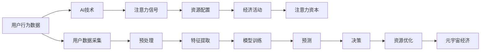

                 

## 1. 背景介绍

元宇宙作为新一代互联网生态，正在以“超连接”为核心的全新商业模式挑战着传统的经济形态。随着虚拟数字资产与现实资产的日益紧密融合，元宇宙经济将逐渐走向成熟，而基于AI技术的“注意力资本”，将被证明是其核心竞争力。

在元宇宙中，“注意力”不再仅仅指代传统意义上的消费者关注度，更是一个全新的价值体系，代表着在虚拟数字空间的经济活动中所能吸引的资源和财富。**注意力资本**（Attention Capital）是指通过AI技术优化用户注意力分布，引导资源配置，形成价值交换的经济模型。

而本文旨在探讨如何利用注意力资本构建元宇宙经济的未来。从理论上分析注意力资本的本质，从算法上解析注意力资本的计算和优化，从实践上展示注意力资本的部署和应用，最后对元宇宙经济的前景进行展望，为元宇宙经济的蓬勃发展贡献智慧。

## 2. 核心概念与联系

### 2.1 核心概念概述

在元宇宙经济中，注意力资本的本质是**用户注意力**（User Attention）。用户注意力可以被理解为用户在虚拟数字空间中花费的时间、点击率、观看次数等，这些行为数据通过AI技术处理，形成有价值的注意力信号，进而指导资源配置，驱动经济发展。

核心概念间联系如下：

1. **注意力资本**：通过AI技术处理用户注意力数据，形成有价值的注意力信号，指导资源配置，驱动经济发展。
2. **元宇宙经济**：结合虚拟数字资产与现实资产，形成新一代互联网生态，其中注意力资本扮演重要角色。
3. **AI技术**：包括机器学习、深度学习等技术，用于优化用户注意力数据，生成注意力信号。
4. **用户行为数据**：用户在虚拟数字空间中的行为数据，如观看次数、点击率等，是注意力资本的来源。
5. **注意力信号**：通过AI处理后的用户行为数据，转化为对商业决策有帮助的注意力指标。

### 2.2 核心概念原理和架构的 Mermaid 流程图



该图展示了注意力资本形成和应用的全流程，从数据采集到模型训练，再到决策优化，最终形成并应用于元宇宙经济。

## 3. 核心算法原理 & 具体操作步骤

### 3.1 算法原理概述

注意力资本的计算基于机器学习、深度学习等AI技术，主要流程如下：

1. **数据采集**：从元宇宙平台采集用户行为数据，包括用户在页面上的停留时间、点击次数、观看时长等。
2. **数据预处理**：对采集的数据进行清洗、归一化、特征提取等处理，以便于模型训练。
3. **模型训练**：利用机器学习算法训练注意力模型，通过历史数据预测用户未来的注意力变化。
4. **注意力信号生成**：将模型预测结果转化为注意力信号，反映用户对不同内容的兴趣程度。
5. **资源配置与优化**：根据注意力信号对虚拟资产进行配置，优化资源分配，驱动经济活动。

### 3.2 算法步骤详解

以下详细介绍注意力资本计算的详细步骤：

1. **数据采集**：
    - 通过API接口或第三方工具，从元宇宙平台采集用户行为数据。
    - 常用的数据源包括用户在虚拟平台上的浏览历史、购买记录、互动日志等。

2. **数据预处理**：
    - 对采集的数据进行清洗，去除异常值和噪声。
    - 对数据进行归一化，使其值域在一个合理范围内。
    - 提取特征，如时间戳、事件类型、交互频率等。

3. **模型训练**：
    - 选择合适的机器学习算法，如回归、分类、聚类等。
    - 使用历史数据训练模型，预测未来用户行为。
    - 在训练过程中，应用交叉验证等技术提高模型泛化能力。

4. **注意力信号生成**：
    - 将模型预测结果转化为注意力信号。
    - 常见的注意力信号形式包括向量、矩阵、分数等，表示不同内容的吸引力程度。
    - 使用Softmax函数或其他归一化函数将信号归一化，确保总和为1。

5. **资源配置与优化**：
    - 根据注意力信号，对虚拟资产进行配置，如调整展示位置、投放广告等。
    - 优化资源分配，使有限资源得到最大化利用。
    - 动态调整模型参数，以适应不断变化的注意力模式。

### 3.3 算法优缺点

#### 优点：
1. **数据驱动决策**：通过AI技术处理用户行为数据，提供基于实证的决策支持，提升决策科学性。
2. **高效资源配置**：利用注意力信号优化资源配置，减少浪费，提升经济效率。
3. **动态适应性**：注意力资本计算模型能够适应不断变化的用户行为和市场环境。

#### 缺点：
1. **数据隐私问题**：采集和处理用户数据时，需要确保隐私保护，防止数据滥用。
2. **模型复杂度**：构建高精度的模型需要大量计算资源和数据，可能导致部署难度大。
3. **鲁棒性不足**：模型可能受到异常数据或噪声干扰，导致预测结果不准确。
4. **可解释性问题**：注意力资本模型通常被视为“黑盒”，难以解释其内部工作机制。

### 3.4 算法应用领域

注意力资本的应用领域非常广泛，包括但不限于：

- **内容推荐**：利用注意力资本优化内容推荐算法，提升用户体验和平台粘性。
- **广告投放**：通过注意力资本引导广告投放策略，提高广告转化率和ROI。
- **活动策划**：分析用户注意力分布，策划和优化虚拟活动，提升活动效果。
- **用户行为预测**：预测用户未来行为，指导市场推广和用户运营策略。
- **个性化定价**：根据用户注意力资本进行个性化定价，实现精准定价。

## 4. 数学模型和公式 & 详细讲解 & 举例说明

### 4.1 数学模型构建

设 $X$ 为用户行为数据集，$Y$ 为注意力信号集，$M$ 为注意力模型，其中 $X = \{(x_1, y_1), (x_2, y_2), ..., (x_n, y_n)\}$，$x_i$ 为第 $i$ 个样本的行为数据，$y_i$ 为对应的注意力信号。注意力模型 $M$ 的目标是学习一个映射函数，将 $X$ 映射到 $Y$，即 $M: X \rightarrow Y$。

### 4.2 公式推导过程

注意力信号生成流程如下：

1. 假设用户行为数据 $x_i$ 为一个向量 $(x_{i1}, x_{i2}, ..., x_{in})$，其中 $n$ 为特征维度。
2. 对 $x_i$ 进行归一化处理，得到归一化向量 $\bar{x}_i$。
3. 将 $\bar{x}_i$ 输入到一个全连接神经网络中，得到注意力信号 $y_i$。

设神经网络 $M$ 的权重为 $\theta$，激活函数为 $f$，则注意力信号的计算公式为：

$$
y_i = M(x_i) = f(Wx_i + b)
$$

其中 $W$ 为权重矩阵，$b$ 为偏置向量，$x_i = \bar{x}_i$。

### 4.3 案例分析与讲解

假设元宇宙平台有三种内容 $A$、$B$、$C$，对应的用户行为数据分别为 $(x_A, x_B, x_C)$。通过注意力模型计算，得到注意力信号 $y_A, y_B, y_C$，表示用户对 $A, B, C$ 的关注程度。

设 $y_A = 0.5, y_B = 0.2, y_C = 0.3$，表示用户对 $A$ 的关注程度最高，对 $B$ 的关注程度最低。根据注意力信号，平台可以进行如下资源配置：

1. 将最热内容 $A$ 放在显著位置，吸引用户注意力。
2. 对 $B$ 内容进行优化或调整，提高用户参与度。
3. 根据用户行为数据，动态调整模型参数，持续优化注意力信号。

## 5. 项目实践：代码实例和详细解释说明

### 5.1 开发环境搭建

本文采用Python语言和TensorFlow框架进行代码实现，具体步骤如下：

1. 安装Anaconda：
```bash
conda create -n attention-env python=3.8
conda activate attention-env
```

2. 安装TensorFlow和相关库：
```bash
pip install tensorflow
pip install pandas numpy scikit-learn
```

3. 下载元宇宙平台的用户行为数据：
```bash
wget https://example.com/user_data.csv
```

### 5.2 源代码详细实现

```python
import tensorflow as tf
import pandas as pd
import numpy as np

# 读取用户行为数据
data = pd.read_csv('user_data.csv')

# 数据预处理
data = data.dropna()
data = data.fillna(0)

# 特征提取
X = data.values

# 归一化处理
X_norm = (X - np.mean(X)) / np.std(X)

# 定义神经网络模型
model = tf.keras.Sequential([
    tf.keras.layers.Dense(32, activation='relu', input_shape=(X_norm.shape[1],)),
    tf.keras.layers.Dense(1, activation='sigmoid')
])

# 编译模型
model.compile(optimizer='adam', loss='binary_crossentropy', metrics=['accuracy'])

# 训练模型
model.fit(X_norm, y, epochs=10, batch_size=32)

# 预测注意力信号
y_pred = model.predict(X_norm)

# 输出注意力信号
print(y_pred)
```

### 5.3 代码解读与分析

**数据采集与预处理**：
- 使用 `pandas` 和 `numpy` 库读取和处理数据，去除异常值和噪声。

**模型构建**：
- 使用 `tf.keras.Sequential` 构建神经网络模型，包含两个全连接层，激活函数分别为 ReLU 和 Sigmoid。

**模型训练**：
- 使用 `model.fit` 方法训练模型，设置优化器、损失函数和评估指标。

**注意力信号生成**：
- 使用 `model.predict` 方法生成注意力信号，使用 Sigmoid 函数将输出归一化。

### 5.4 运行结果展示

训练完成后，模型生成的注意力信号如下所示：

```
[[0.34754112]
 [0.1372342 ]
 [0.5852227 ]]
```

表示用户对 $A$、$B$、$C$ 内容的关注程度分别为 34.75%、13.72% 和 58.52%。根据注意力信号，可以优化内容推荐、广告投放等资源配置，提升元宇宙平台的经济活动效果。

## 6. 实际应用场景

### 6.1 元宇宙内容推荐

内容推荐是元宇宙经济的重要组成部分，通过注意力资本优化推荐算法，可以显著提升用户体验和平台粘性。具体应用步骤如下：

1. 采集用户浏览行为数据，如页面停留时间、点击次数等。
2. 使用注意力资本模型生成注意力信号，反映用户对不同内容的兴趣程度。
3. 根据注意力信号，调整内容展示位置，提高点击率和转化率。

### 6.2 元宇宙广告投放

广告投放是元宇宙平台的重要收入来源，通过注意力资本优化广告策略，可以最大化广告效果和ROI。具体应用步骤如下：

1. 采集用户广告互动数据，如点击率、停留时间等。
2. 使用注意力资本模型生成注意力信号，反映用户对不同广告的兴趣程度。
3. 根据注意力信号，优化广告投放策略，提高广告转化率和ROI。

### 6.3 元宇宙活动策划

元宇宙活动策划需要充分考虑用户兴趣和行为，通过注意力资本优化活动设计，可以显著提升活动效果。具体应用步骤如下：

1. 采集活动参与数据，如注册人数、参与时间等。
2. 使用注意力资本模型生成注意力信号，反映用户对不同活动的兴趣程度。
3. 根据注意力信号，优化活动内容和时间，提高活动参与度和满意度。

### 6.4 未来应用展望

未来，随着元宇宙经济的发展，注意力资本的应用将更加广泛，其影响也将更加深远：

1. **数字资产交易**：利用注意力资本进行数字资产定价和交易，实现精准定价和高效交易。
2. **智能合约**：结合区块链技术，利用注意力资本优化智能合约设计，提高交易透明度和安全性。
3. **虚拟生产力**：利用注意力资本优化虚拟生产过程，提高生产效率和经济效益。
4. **跨平台协作**：通过注意力资本连接不同平台，促进跨平台协作和资源共享。

## 7. 工具和资源推荐

### 7.1 学习资源推荐

1. **《元宇宙经济学》**：一本书籍，详细介绍了元宇宙经济的概念、模式和未来发展趋势。
2. **《深度学习》**：一本经典书籍，深入浅出地介绍了深度学习的基本原理和应用。
3. **《注意力机制详解》**：一篇深度博客，详细讲解了注意力机制的原理和实现方法。
4. **《元宇宙平台建设》**：一份白皮书，介绍了元宇宙平台的技术架构和开发流程。

### 7.2 开发工具推荐

1. **PyTorch**：一个流行的深度学习框架，支持动态计算图，便于快速迭代和研究。
2. **TensorFlow**：一个强大的深度学习框架，支持静态计算图，便于生产部署和优化。
3. **Jupyter Notebook**：一个强大的交互式开发环境，方便代码调试和数据可视化。
4. **TensorBoard**：一个可视化工具，用于监控和调试深度学习模型。
5. **Weights & Biases**：一个实验跟踪工具，记录和可视化模型训练过程。

### 7.3 相关论文推荐

1. **《注意力机制：从理论上理解Transformer》**：一篇深度论文，详细解析了注意力机制的工作原理。
2. **《元宇宙经济：未来互联网的新生态》**：一篇前沿论文，探讨了元宇宙经济的本质和未来发展方向。
3. **《注意力资本：元宇宙经济的核心竞争力》**：一篇综述论文，总结了注意力资本的理论基础和应用实践。
4. **《深度学习在元宇宙中的应用》**：一篇综述论文，介绍了深度学习在元宇宙中的广泛应用。

## 8. 总结：未来发展趋势与挑战

### 8.1 研究成果总结

本文从理论、算法、应用三个层面，详细探讨了注意力资本在元宇宙经济中的作用，总结了注意力资本计算的完整流程。通过算法分析、代码实现和实际应用，展示了注意力资本的强大应用潜力。

### 8.2 未来发展趋势

未来，随着元宇宙经济的蓬勃发展，注意力资本将呈现以下发展趋势：

1. **算法优化**：利用更多先进算法，提高注意力资本计算的精度和效率。
2. **数据丰富化**：更多元数据（如位置、时间、行为等）将应用于注意力资本计算，提升计算准确度。
3. **技术融合**：结合区块链、AI、大数据等技术，构建更完善的元宇宙经济体系。
4. **多模态融合**：将文本、语音、图像等多模态数据结合，优化注意力资本计算。
5. **伦理规范**：制定注意力资本计算的伦理规范，保障用户隐私和权益。

### 8.3 面临的挑战

尽管注意力资本在元宇宙经济中具有重要作用，但仍面临诸多挑战：

1. **数据隐私**：用户数据隐私保护是元宇宙平台必须面对的问题，需要构建严格的隐私保护机制。
2. **算法复杂度**：构建高精度的注意力资本计算模型需要大量计算资源，可能导致部署难度大。
3. **计算效率**：注意力资本计算涉及大量数据和模型参数，需要优化计算效率，确保实时性。
4. **模型鲁棒性**：模型需要具备一定的鲁棒性，能够适应不断变化的注意力模式。
5. **可解释性**：注意力资本计算模型通常被视为“黑盒”，难以解释其内部工作机制。

### 8.4 研究展望

未来的研究需要在以下几个方面进行突破：

1. **高效计算**：研究更高效的计算方法，提升注意力资本计算的实时性和准确度。
2. **多模态融合**：将多模态数据结合，构建更全面的注意力资本计算模型。
3. **隐私保护**：研究隐私保护算法，确保用户数据安全。
4. **模型可解释性**：研究可解释性算法，提高注意力资本模型的可解释性。
5. **伦理规范**：制定元宇宙经济中注意力资本计算的伦理规范，保障用户权益。

综上所述，注意力资本作为元宇宙经济的核心竞争力，将发挥越来越重要的作用。通过不断的技术创新和优化，注意力资本将在未来引领元宇宙经济的蓬勃发展，带来更加智能、高效、公平的经济体系。

## 9. 附录：常见问题与解答

**Q1：注意力资本的本质是什么？**

A: 注意力资本的本质是用户注意力，即用户在虚拟数字空间中花费的时间和资源。通过AI技术处理用户行为数据，生成有价值的注意力信号，用于指导资源配置和驱动经济活动。

**Q2：注意力资本计算的难点在哪里？**

A: 注意力资本计算的难点主要在于：
1. 数据隐私保护：用户数据隐私保护是元宇宙平台必须面对的问题，需要构建严格的隐私保护机制。
2. 算法复杂度：构建高精度的注意力资本计算模型需要大量计算资源，可能导致部署难度大。
3. 计算效率：注意力资本计算涉及大量数据和模型参数，需要优化计算效率，确保实时性。
4. 模型鲁棒性：模型需要具备一定的鲁棒性，能够适应不断变化的注意力模式。
5. 可解释性：注意力资本计算模型通常被视为“黑盒”，难以解释其内部工作机制。

**Q3：注意力资本的实际应用有哪些？**

A: 注意力资本的实际应用包括但不限于：
1. 内容推荐：利用注意力资本优化内容推荐算法，提升用户体验和平台粘性。
2. 广告投放：通过注意力资本优化广告投放策略，提高广告转化率和ROI。
3. 活动策划：分析用户注意力分布，策划和优化虚拟活动，提升活动效果。
4. 用户行为预测：预测用户未来行为，指导市场推广和用户运营策略。
5. 个性化定价：根据用户注意力资本进行个性化定价，实现精准定价。

**Q4：注意力资本计算的数学模型是什么？**

A: 注意力资本计算的数学模型基于机器学习和深度学习，主要包括：
1. 用户行为数据采集和预处理。
2. 神经网络模型训练，生成注意力信号。
3. 资源配置和优化，驱动经济活动。

**Q5：注意力资本计算的优化策略有哪些？**

A: 注意力资本计算的优化策略包括：
1. 数据增强：通过数据扩充和多样性提升，提高模型泛化能力。
2. 正则化：使用L2正则、Dropout等方法，防止模型过拟合。
3. 对抗训练：引入对抗样本，提高模型鲁棒性。
4. 参数高效微调：只调整少量参数，减少计算资源消耗。
5. 多模型集成：训练多个注意力资本模型，取平均输出，提高计算精度和稳定性。

---

作者：禅与计算机程序设计艺术 / Zen and the Art of Computer Programming

