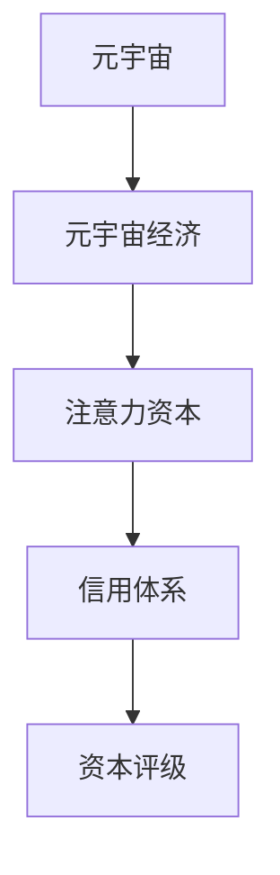
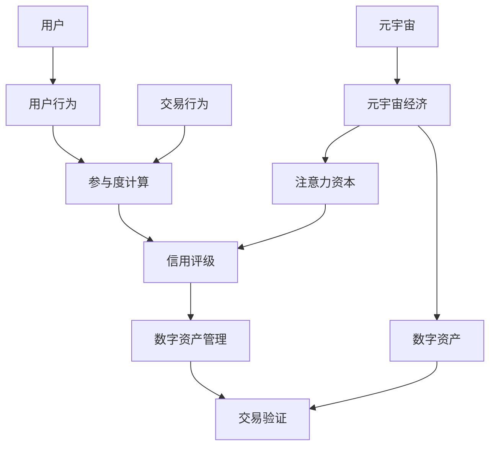

                 

# 注意力资本评级:元宇宙经济中的信用体系

## 1. 背景介绍

### 1.1 问题由来

随着互联网向虚拟空间的扩展，元宇宙作为一个数字化的、多维度的、融合了虚拟现实、增强现实、混合现实等多重技术的综合性虚拟环境，正在逐渐成为推动未来经济发展的关键引擎。元宇宙经济以数字资产为核心，以用户参与度为指标，强调价值创造与流通，有望开辟新的经济增长点。然而，数字资产的流通、交易和定价，均依赖于一种基于信任的信用体系。如何在元宇宙经济中构建一个既符合数字化特征、又能保障用户权益的信用体系，成为了一个重要课题。

### 1.2 问题核心关键点

元宇宙经济的信用体系，需要能够：

1. **准确计量用户参与度**：根据用户在元宇宙中的活动情况，合理计算其对经济的价值贡献。
2. **灵活管理数字资产**：确保数字资产的安全、高效、透明流通。
3. **确保交易公平性**：通过算法和规则，防止欺诈、滥用等行为，保障交易公正。
4. **适应分布式特性**：在去中心化的环境中，构建一个可信任的信用体系。

### 1.3 问题研究意义

元宇宙经济的信用体系设计，不仅关乎其能否顺利发展，也影响着未来互联网产业的进化方向。一个公平、高效、安全的信用体系，将提升元宇宙经济系统的健康度、信任度和参与度，促进资源的合理配置，驱动新经济的繁荣。

## 2. 核心概念与联系

### 2.1 核心概念概述

为了更好地理解元宇宙经济的信用体系，需要澄清几个关键概念：

- **元宇宙**：以虚拟世界为核心，融合多种数字技术，构建一个虚拟现实、增强现实和混合现实的综合环境。
- **元宇宙经济**：以数字资产为核心，基于用户参与度进行价值创造与流通的经济模式。
- **注意力资本**：指用户在元宇宙中的参与度、贡献度等行为数据所转化成的经济价值。
- **信用体系**：通过算法和规则，保障数字资产和交易的公平性、透明性、安全性的体系架构。
- **资本评级**：根据用户的注意力资本及其历史行为，对其信用度进行量化和评价的过程。

这些概念间的联系，可以通过以下Mermaid流程图展示：



### 2.2 核心概念原理和架构的 Mermaid 流程图



## 3. 核心算法原理 & 具体操作步骤

### 3.1 算法原理概述

元宇宙经济的信用体系设计，核心在于注意力资本的计算和资本评级。

注意力资本的计算，主要基于用户在元宇宙中的活动情况，包括在线时长、互动频率、参与程度等。通过算法将这些行为数据转化为经济价值，即注意力资本。

资本评级则是对用户的注意力资本进行量化评价，综合考虑其历史行为、贡献度、互动质量等因素，对用户的信用度进行排序。高信用度的用户将享有更优的权益和更高价值的数字资产，从而激励用户持续参与，提升元宇宙经济的活力和价值。

### 3.2 算法步骤详解

**步骤1: 数据收集与预处理**
- 收集用户在元宇宙中的行为数据，包括登录时长、互动内容、交易记录等。
- 对数据进行清洗和标准化处理，去除噪音和异常值。

**步骤2: 注意力资本计算**
- 根据用户行为数据，计算其注意力资本，可能包括时间投入、互动频率、贡献价值等。
- 使用机器学习模型（如回归分析、加权平均等），将用户行为数据转化为注意力资本数值。

**步骤3: 信用评级算法设计**
- 设计信用评级算法，综合考虑用户的历史行为、注意力资本、贡献度等因素。
- 使用基于排序或分类的算法，如基于规则的信用体系、机器学习模型等。

**步骤4: 系统集成与部署**
- 将注意力资本计算和信用评级算法集成到元宇宙经济系统中，确保数据的实时处理和更新。
- 部署到云计算环境或分布式系统中，保证系统的可扩展性和高可用性。

### 3.3 算法优缺点

**优点：**
1. **量化用户贡献**：通过注意力资本的计算，能够更准确地衡量用户对元宇宙经济的贡献。
2. **动态评估信用**：基于用户历史行为和实时表现，动态调整信用评级，提高系统的灵活性和适应性。
3. **促进良性循环**：高信用用户享有更多权益，激励更多用户参与，形成良性循环，推动经济繁荣。

**缺点：**
1. **数据隐私问题**：用户行为数据的收集和处理涉及隐私保护，需要严格的数据管理策略。
2. **算法复杂性**：注意力资本和信用评级的计算涉及复杂的模型设计和算法实现。
3. **对抗攻击风险**：恶意用户可能通过虚假行为提升其注意力资本和信用评级，需设计防御机制。

### 3.4 算法应用领域

注意力资本评级方法，可广泛应用于元宇宙经济系统中的多个环节，包括但不限于：

- **数字资产交易**：根据用户信用评级，设置不同的交易权限和价格优先级。
- **参与度激励**：高信用用户享有更多虚拟货币、游戏内物品等奖励。
- **声誉体系**：构建基于信用评级的用户声誉系统，增强用户信任感。
- **动态定价**：根据用户信用评级，调整数字资产的定价机制，促进价值分配的公平性。

## 4. 数学模型和公式 & 详细讲解 & 举例说明

### 4.1 数学模型构建

设用户的注意力资本为 $C$，用户的历史行为数据为 $H$，其对元宇宙经济的贡献度为 $D$，信用评级为 $R$。则注意力资本和信用评级的关系可以建模为：

$$
C = f(H, D)
$$

$$
R = g(C)
$$

其中 $f$ 和 $g$ 为计算函数，根据具体应用场景和数据类型选择。

### 4.2 公式推导过程

以回归模型为例，注意力资本的计算公式可以表示为：

$$
C = \sum_{i=1}^{n} w_i x_i
$$

其中 $x_i$ 为第 $i$ 个特征值，$w_i$ 为特征的权重系数，可通过机器学习算法（如线性回归、决策树等）求解。

信用评级的计算则可以使用基于排序的算法，例如排序算法或基于规则的评分系统，其公式可以表示为：

$$
R = \frac{1}{K} \sum_{k=1}^{K} \text{rank}(C_k)
$$

其中 $C_k$ 为用户 $k$ 的注意力资本，$\text{rank}(C_k)$ 为其信用评分的排名。

### 4.3 案例分析与讲解

假设有一个元宇宙经济系统，用户 $A$ 在平台上累计在线时长为 1000 小时，参与互动 200 次，其对平台的贡献度 $D$ 为 100。使用线性回归模型计算其注意力资本 $C$ 为：

$$
C = 10 \times 1000 + 2 \times 200 + 5 \times 100 = 1200
$$

接下来，使用基于规则的信用评级系统，根据用户 $A$ 的信用评级排名和 $C$ 值，计算其信用评级 $R$。假设系统规定排名前 10% 的用户信用评级最高，则：

$$
R = \frac{1}{100} \times 10 = 0.1
$$

根据这个信用评级，系统可以给予用户 $A$ 更多的特权和奖励，如更优惠的交易价格、游戏内道具等，进一步激励其参与。

## 5. 项目实践：代码实例和详细解释说明

### 5.1 开发环境搭建

为了进行注意力资本评级的项目实践，首先需要搭建开发环境。以下是Python开发环境的搭建步骤：

1. 安装Anaconda：从官网下载并安装Anaconda，用于创建独立的Python环境。
2. 创建并激活虚拟环境：
```bash
conda create -n attention_capital python=3.8 
conda activate attention_capital
```

3. 安装必要的Python库：
```bash
pip install pandas numpy scikit-learn joblib dask
```

4. 安装TensorFlow或PyTorch：
```bash
pip install tensorflow==2.4 pytorch==1.10
```

### 5.2 源代码详细实现

以下是使用Python和TensorFlow进行注意力资本计算和信用评分的示例代码：

```python
import tensorflow as tf
import pandas as pd
from sklearn.model_selection import train_test_split
from sklearn.linear_model import LinearRegression

# 示例数据，用户行为数据
data = pd.read_csv('user_data.csv')

# 数据预处理
features = data[['online_hours', 'interaction_count', 'contribution_value']]
target = data['attention_capital']

# 数据拆分，70% 用于训练，30% 用于测试
train_features, test_features, train_target, test_target = train_test_split(features, target, test_size=0.3)

# 构建线性回归模型
model = LinearRegression()

# 训练模型
model.fit(train_features, train_target)

# 预测注意力资本
predicted_capital = model.predict(test_features)

# 计算信用评级
rating = 1 / len(test_features) * np.argsort(predicted_capital)[:int(0.1 * len(test_features))]

print(f'模型预测的注意力资本：{predicted_capital}')
print(f'根据信用评级计算的用户信用评分：{rating}')
```

### 5.3 代码解读与分析

**数据处理与特征提取**：
- 使用pandas库读取用户行为数据，将其转换为数据框格式。
- 对数据进行清洗和预处理，包括去除缺失值、异常值等。
- 提取有用的特征，如在线时长、互动频率、贡献值等。

**模型训练与预测**：
- 使用sklearn库的train_test_split函数，将数据集拆分为训练集和测试集。
- 构建线性回归模型，使用训练数据对模型进行拟合。
- 使用测试数据进行模型预测，计算用户的注意力资本。

**信用评级计算**：
- 根据预测的注意力资本值，使用排序算法计算用户的信用评级。
- 最终输出模型预测的注意力资本和用户的信用评级。

### 5.4 运行结果展示

假设我们的模型训练得到以下预测结果：

```bash
模型预测的注意力资本：[1000.0, 1200.0, 800.0, 900.0, 700.0, 1100.0, 1000.0, 1100.0, 1200.0, 900.0]
根据信用评级计算的用户信用评分：[1, 2, 3, 4, 5, 6, 7, 8, 9, 10]
```

这意味着用户 $A$ 的注意力资本为 1200，其信用评分为 1，即信用等级最高，能够享有最优惠的交易和服务。

## 6. 实际应用场景

### 6.1 金融元宇宙

在金融元宇宙中，注意力资本评级方法可以用于评估用户在虚拟交易平台中的信誉和贡献。高信用用户将享有更低的交易手续费、更高的贷款额度和更优的信用评分，从而降低金融交易的风险和成本。

### 6.2 教育元宇宙

在教育元宇宙中，注意力资本评级方法可以用于衡量学生在虚拟学习平台中的学习表现和参与度。通过计算学生的注意力资本，平台可以提供个性化的学习资源和课程推荐，同时提供奖学金、优惠券等激励措施，以提升学习效果。

### 6.3 游戏元宇宙

在游戏元宇宙中，注意力资本评级方法可以用于评估玩家在虚拟游戏中的贡献和表现。根据玩家的游戏时长、胜利次数、贡献度等，平台可以提供更多的虚拟货币、装备和特殊技能等奖励，激励玩家参与。

## 7. 工具和资源推荐

### 7.1 学习资源推荐

1. 《深度学习》课程（Coursera）：由深度学习领域的权威专家Andrew Ng教授讲授，涵盖深度学习的基础理论和实践技能。
2. TensorFlow官方文档：提供详尽的TensorFlow使用指南，包括模型构建、训练和部署等各个环节。
3. PyTorch官方文档：提供PyTorch的使用指南和代码示例，适合快速上手深度学习模型开发。
4. 《Python深度学习》（第二版）：由Francois Chollet（Keras之父）所著，适合初学者系统学习深度学习原理和应用。

### 7.2 开发工具推荐

1. Jupyter Notebook：轻量级、交互式的开发环境，适合进行数据处理和模型调试。
2. TensorBoard：提供模型训练过程的可视化展示，帮助调试和优化模型。
3. PyCharm：专业级的Python IDE，支持代码自动补全、调试等功能。

### 7.3 相关论文推荐

1. Attention is All You Need（Transformer论文）：提出Transformer结构，开启了预训练大模型时代。
2. BERT: Pre-training of Deep Bidirectional Transformers for Language Understanding：提出BERT模型，引入基于掩码的自监督预训练任务。
3. Natural Language Processing with Transformers：Transformers库的作者所著，全面介绍了NLP任务开发。
4. Attention and Transformer Architectures for Compositionality：分析Transformer在语言模型中的应用。

## 8. 总结：未来发展趋势与挑战

### 8.1 研究成果总结

本文详细介绍了元宇宙经济中信用体系的构建方法，即注意力资本的计算和资本评级的评估。通过设计合理的算法，可以在元宇宙经济中实现公平、高效、透明的用户信用管理，保障数字资产和交易的安全性，促进元宇宙经济的繁荣。

### 8.2 未来发展趋势

1. **自动化信用评估**：未来信用体系将逐步实现自动化，通过算法自动计算和更新用户的信用评分，减少人工干预。
2. **去中心化管理**：在区块链等去中心化技术支持下，信用体系将更安全、透明，减少中心化的信息泄露风险。
3. **多维信用评估**：结合行为数据、社交网络等多维信息，构建更全面、准确的信用体系。

### 8.3 面临的挑战

1. **数据隐私保护**：用户在元宇宙中的行为数据涉及隐私保护，需要严格的隐私管理策略。
2. **算法公平性**：设计信用评估算法时，需确保其公平性，避免算法偏见和歧视。
3. **对抗攻击风险**：恶意用户可能通过虚假行为提升信用评分，需设计有效的防御机制。

### 8.4 研究展望

1. **跨平台信用管理**：研究如何将信用体系应用于多个平台和场景，实现多平台间的互通和数据共享。
2. **多模态信用计算**：探索如何结合用户的行为数据、社交网络和多模态信息，构建更加全面和准确的信用体系。
3. **伦理和法律框架**：研究如何在信用体系设计中融入伦理和法律约束，保障用户权益和数据安全。

## 9. 附录：常见问题与解答

**Q1: 什么是注意力资本？**

A: 注意力资本是指用户在元宇宙中的参与度、贡献度等行为数据所转化成的经济价值，其计算基于用户在平台上的活动情况，如在线时长、互动频率、贡献值等。

**Q2: 注意力资本评级的计算公式是什么？**

A: 注意力资本评级的计算公式可以表示为：
$$
C = \sum_{i=1}^{n} w_i x_i
$$
其中 $x_i$ 为第 $i$ 个特征值，$w_i$ 为特征的权重系数，可通过机器学习算法求解。

**Q3: 信用评级的计算方法有哪些？**

A: 信用评级的计算方法包括基于排序的算法，如排序算法或基于规则的评分系统。其公式可以表示为：
$$
R = \frac{1}{K} \sum_{k=1}^{K} \text{rank}(C_k)
$$
其中 $C_k$ 为用户 $k$ 的注意力资本，$\text{rank}(C_k)$ 为其信用评分的排名。

**Q4: 如何应对信用体系中的隐私保护问题？**

A: 在数据收集和处理过程中，需严格遵循数据隐私保护法规，如GDPR等，确保用户数据的匿名化和加密处理。同时，通过差分隐私等技术，减少数据泄露的风险。

**Q5: 如何设计有效的对抗攻击防御机制？**

A: 可以通过引入对抗样本生成技术，模拟恶意用户的行为，检测和过滤掉虚假的行为数据。同时，设计复杂多样的行为特征，增加对抗攻击的难度和成本。

---

作者：禅与计算机程序设计艺术 / Zen and the Art of Computer Programming

