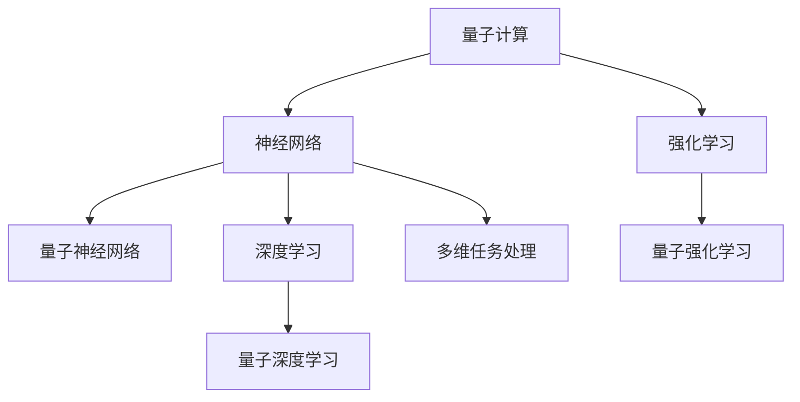

                 

# 注意力量子计算：AI时代的多维任务处理

> 关键词：量子计算,注意机制,多维任务处理,深度学习,强化学习,神经网络,优化算法,应用场景

## 1. 背景介绍

### 1.1 问题由来
近年来，人工智能(AI)技术迅猛发展，在自然语言处理(NLP)、计算机视觉、语音识别等领域取得了突破性进展。然而，这些技术主要基于经典计算机的通用处理单元，仍难以高效处理多维、高维的数据。特别是当任务涉及复杂的物理现象、大规模时空数据时，经典计算面临的计算复杂度成指数级增长，极大地限制了AI技术的应用范围。

量子计算作为一种新兴计算范式，通过利用量子叠加、量子纠缠等特性，具有处理大规模、高维度数据的能力。将量子计算与AI技术相结合，探索新的多维任务处理方法，成为当前AI研究的热点。

### 1.2 问题核心关键点
量子计算与AI的结合主要集中在以下几个关键点：

- 多维数据处理：经典计算难以高效处理多维数据，量子计算通过并行计算和多维量子态的直接处理，有望实现对多维数据的快速分析。
- 神经网络架构设计：利用量子计算的高并行性和量子纠缠特性，设计全新的神经网络架构，提升网络模型对复杂任务的建模能力。
- 量子优化算法：开发新的量子优化算法，优化深度学习模型的参数，提升AI模型的训练和推理效率。
- 量子感知学习：结合量子计算，实现更加高效的学习过程，提升AI系统的感知和决策能力。

### 1.3 问题研究意义
量子计算与AI的结合，对于拓展AI技术的应用范围，提升多维、高维数据的处理能力，加速AI技术向实际应用场景的落地，具有重要意义：

1. 突破计算瓶颈：量子计算能够高效处理大规模高维数据，突破传统计算的瓶颈，提升AI模型的训练和推理效率。
2. 优化神经网络：结合量子计算的特性，设计全新的神经网络架构，提升AI模型对复杂任务的建模能力。
3. 提升感知能力：通过量子感知学习，提升AI系统在多模态数据上的感知和理解能力。
4. 加速应用落地：量子计算与AI技术的融合，能够加速AI技术在科学研究、医疗诊断、自动驾驶、智能制造等领域的实际应用。
5. 激发新研究方向：量子计算和AI的结合，催生了新的交叉学科研究方向，推动AI技术的创新发展。

## 2. 核心概念与联系

### 2.1 核心概念概述

为更好地理解量子计算与AI技术的多维任务处理方法，本节将介绍几个密切相关的核心概念：

- 量子计算(QC)：一种基于量子力学的计算范式，通过量子叠加、量子纠缠等特性，具有并行计算和高效处理高维数据的潜力。

- 神经网络(NN)：一种由大量人工神经元组成的计算模型，用于处理非线性、高维数据。

- 量子神经网络(QNN)：结合量子计算特性，通过量子叠加和量子纠缠，实现高并行性神经网络模型，提升神经网络的计算能力和泛化能力。

- 深度学习(Deep Learning, DL)：一种基于多层神经网络的机器学习技术，通过逐层抽象和特征提取，实现对复杂数据的高效建模。

- 量子深度学习(QDL)：结合量子计算和深度学习，实现高效的深度学习算法，提升神经网络模型的训练和推理效率。

- 强化学习(RL)：一种通过试错学习优化策略的机器学习技术，用于决策和控制任务的优化。

- 量子强化学习(QRL)：结合量子计算和强化学习，通过量子计算的高并行性，提升强化学习的训练和优化效率。

这些核心概念之间的逻辑关系可以通过以下Mermaid流程图来展示：



这个流程图展示了大语言模型与核心概念的关系：

1. 量子计算提供高效处理高维数据的能力，是神经网络、深度学习等模型的基础。
2. 量子神经网络结合量子计算特性，提升神经网络的计算能力。
3. 量子深度学习结合量子计算，实现高效的深度学习算法。
4. 量子强化学习结合量子计算，提升强化学习的训练效率。
5. 多维任务处理是量子计算与AI技术的融合目标，实现高效的AI系统设计。

这些核心概念共同构成了量子计算与AI技术的融合框架，使得AI系统能够更好地处理多维、高维的数据，提升系统的计算能力和性能。

## 3. 核心算法原理 & 具体操作步骤
### 3.1 算法原理概述

基于量子计算与AI技术的多维任务处理方法，本质上是一种优化算法，旨在通过量子计算的特性，提升AI系统对多维数据的处理能力。其核心思想是：将量子计算的并行性和高维度数据处理能力与AI技术的深度学习、强化学习等方法相结合，实现对多维任务的快速高效处理。

形式化地，假设输入数据为 $X=\{x_i\}_{i=1}^N$，其中 $x_i \in \mathbb{R}^D$，$D$ 为输入数据的维度。目标函数为 $F(\theta)$，其中 $\theta$ 为模型参数。多维任务处理的目标是最小化目标函数：

$$
\hat{\theta}=\mathop{\arg\min}_{\theta} F(\theta)
$$

量子计算通过量子叠加和量子纠缠，能够在一次量子计算中处理多个输入数据，从而实现对高维度数据的并行处理。量子计算与AI技术的结合，可以通过设计合适的量子感知器、量子神经网络等模型，实现对多维数据的快速建模和优化。

### 3.2 算法步骤详解

基于量子计算与AI技术的多维任务处理方法，通常包括以下几个关键步骤：

**Step 1: 设计量子感知器(QS)**
- 根据具体任务，设计量子感知器。量子感知器通过量子叠加和量子纠缠，将经典数据映射到量子态，实现对高维度数据的并行处理。

**Step 2: 构造量子神经网络(QNN)**
- 将量子感知器与经典神经网络相结合，设计量子神经网络模型。量子神经网络能够高效处理多维数据，提升神经网络模型的计算能力。

**Step 3: 应用量子优化算法(QOA)**
- 选择合适的量子优化算法，如量子梯度下降(QGD)、量子粒子群优化(QPSO)等，优化量子神经网络中的参数。量子优化算法利用量子计算的并行性和量子纠缠特性，提升优化过程的效率。

**Step 4: 训练量子深度学习模型**
- 将量子感知器与经典深度学习模型结合，设计量子深度学习模型。通过量子计算的并行性和量子纠缠特性，提升深度学习模型的训练效率和推理能力。

**Step 5: 集成量子强化学习(QRL)**
- 将量子计算与强化学习相结合，设计量子强化学习模型。通过量子计算的高并行性，提升强化学习的训练和优化效率。

**Step 6: 部署多维任务处理系统**
- 将训练好的量子深度学习模型和量子强化学习模型部署到实际应用系统中，实现多维任务的快速高效处理。

### 3.3 算法优缺点

基于量子计算与AI技术的多维任务处理方法具有以下优点：
1. 高效处理高维数据：量子计算能够高效处理大规模高维数据，突破传统计算的瓶颈，提升AI系统的计算能力。
2. 提升深度学习模型：结合量子计算的特性，设计全新的神经网络架构，提升神经网络的计算能力和泛化能力。
3. 提升强化学习效率：通过量子计算的高并行性，提升强化学习的训练和优化效率。
4. 加速多维任务处理：量子计算与AI技术的融合，实现对多维任务的快速高效处理。

同时，该方法也存在一定的局限性：
1. 技术复杂度高：量子计算和AI技术的结合，需要掌握复杂的量子计算和深度学习技术。
2. 设备资源需求高：量子计算设备资源需求高，量子芯片的价格和性能问题仍未完全解决。
3. 量子噪声问题：量子计算受量子噪声和量子退相干影响，量子计算的可靠性和准确性仍需提高。
4. 应用场景受限：目前量子计算和AI技术的结合主要集中在科学研究、金融预测等领域，实际应用场景相对有限。
5. 缺乏标准模型：量子计算与AI技术的融合尚处于初期阶段，缺乏成熟的量子深度学习模型和算法。

尽管存在这些局限性，但就目前而言，基于量子计算与AI技术的多维任务处理方法仍具有巨大的潜力。未来相关研究的重点在于如何进一步降低技术复杂度，提升设备性能和稳定性，拓展应用场景，同时兼顾可解释性和伦理安全性等因素。

### 3.4 算法应用领域

基于量子计算与AI技术的多维任务处理方法，已经在多个领域得到了初步应用，例如：

- 科学研究：量子计算与AI的结合，用于分析大规模科学数据，进行天体物理、生命科学等领域的研究。
- 金融预测：通过量子计算的高并行性，提升金融模型的训练和优化效率，进行股票价格预测、市场风险评估等。
- 医疗诊断：利用量子计算的并行性，提升深度学习模型的计算能力，进行医疗图像分析、疾病诊断等。
- 自动驾驶：结合量子计算和深度学习，提升自动驾驶系统在多模态数据上的感知和决策能力。
- 智能制造：利用量子计算的高并行性，提升机器学习模型的训练效率，优化生产计划、质量控制等。

除了上述这些经典应用外，量子计算与AI技术的融合还在更多领域得到创新性的应用，如量子模拟、量子通信、量子密码学等，为科学研究和技术创新带来了新的突破。随着量子计算技术的不断发展，相信量子计算与AI技术的融合将会在更广阔的应用领域大放异彩。

## 4. 数学模型和公式 & 详细讲解  
### 4.1 数学模型构建

本节将使用数学语言对基于量子计算与AI技术的多维任务处理方法进行更加严格的刻画。

记输入数据为 $X=\{x_i\}_{i=1}^N, x_i \in \mathbb{R}^D$，其中 $D$ 为输入数据的维度。量子感知器为 $QS$，目标函数为 $F(\theta)$，其中 $\theta$ 为量子神经网络中的参数。

定义量子感知器在输入 $x_i$ 上的输出为 $QS(x_i)$，其中 $QS$ 可以表示为：

$$
QS(x_i) = \alpha \langle x_i | U(x_i) | \psi \rangle
$$

其中 $|\psi\rangle$ 为量子态，$\alpha$ 为系数，$U(x_i)$ 为量子操作。

通过量子叠加和量子纠缠，量子感知器能够高效处理多维数据。在量子感知器的基础上，构造量子神经网络 $QNN$，并设计目标函数 $F(\theta)$：

$$
F(\theta) = \frac{1}{N} \sum_{i=1}^N \left[ f(QS(x_i); \theta) - y_i \right]^2
$$

其中 $f$ 为经典神经网络中的损失函数。

### 4.2 公式推导过程

以下我们以二分类任务为例，推导量子感知器和量子神经网络的构建方法。

假设输入数据 $x_i \in \mathbb{R}^2$，输出标签 $y_i \in \{0,1\}$。量子感知器 $QS$ 定义为：

$$
QS(x_i) = \alpha \langle x_i | U(x_i) | \psi \rangle
$$

其中 $|\psi\rangle$ 为量子态，$\alpha$ 为系数，$U(x_i)$ 为量子操作。

假设量子操作 $U(x_i)$ 定义为：

$$
U(x_i) = \sum_k c_k e^{ik \cdot x_i}
$$

其中 $c_k$ 为复系数，$k \in \mathbb{R}^2$。通过量子叠加和量子纠缠，量子感知器能够高效处理多维数据。

构造量子神经网络 $QNN$，并设计目标函数 $F(\theta)$：

$$
F(\theta) = \frac{1}{N} \sum_{i=1}^N \left[ f(QS(x_i); \theta) - y_i \right]^2
$$

其中 $f$ 为经典神经网络中的损失函数。

通过量子计算的并行性和量子纠缠特性，量子神经网络能够高效处理多维数据，提升神经网络的计算能力。

### 4.3 案例分析与讲解

**案例分析：量子感知器在图像分类任务中的应用**

在图像分类任务中，通过量子感知器将输入图像映射到量子态，利用量子叠加和量子纠缠特性，高效处理高维数据。具体步骤如下：

1. 将输入图像 $x_i \in \mathbb{R}^{D \times D}$ 分解为 $D$ 个低维特征向量 $x_i^d$。
2. 构造 $D$ 个量子感知器，每个感知器将低维特征向量映射到一个量子态。
3. 将 $D$ 个量子感知器输出相加，得到最终的输出 $QS(x_i)$。
4. 通过经典神经网络处理输出，进行图像分类。

通过量子感知器，量子计算能够高效处理高维图像数据，提升神经网络的计算能力和泛化能力。

## 5. 项目实践：代码实例和详细解释说明
### 5.1 开发环境搭建

在进行多维任务处理项目实践前，我们需要准备好开发环境。以下是使用Python进行Qiskit和TensorFlow开发的环境配置流程：

1. 安装Anaconda：从官网下载并安装Anaconda，用于创建独立的Python环境。

2. 创建并激活虚拟环境：
```bash
conda create -n qc-env python=3.8 
conda activate qc-env
```

3. 安装Qiskit和TensorFlow：根据Qiskit和TensorFlow的版本要求，从官网获取对应的安装命令。例如：
```bash
conda install qiskit tensorflow -c conda-forge
```

4. 安装各类工具包：
```bash
pip install numpy pandas scikit-learn matplotlib tqdm jupyter notebook ipython
```

完成上述步骤后，即可在`qc-env`环境中开始多维任务处理项目实践。

### 5.2 源代码详细实现

这里我们以量子感知器在图像分类任务中的应用为例，给出使用Qiskit和TensorFlow对图像分类任务进行多维任务处理的PyTorch代码实现。

首先，定义图像分类任务的数据处理函数：

```python
from qiskit import QuantumRegister, ClassicalRegister, QuantumCircuit, Aer
from qiskit.circuit.library import QuantumAdder
from qiskit.circuit import Parameter
from qiskit.aqua import QuantumInstance
import tensorflow as tf

# 加载图像数据集
import numpy as np
from PIL import Image
import os

def load_images_from_folder(folder_path):
    images = []
    labels = []
    for file_name in os.listdir(folder_path):
        if file_name.endswith('.jpg'):
            img = Image.open(os.path.join(folder_path, file_name))
            img = img.resize((32, 32))
            img = np.array(img)
            img = img / 255.0
            images.append(img)
            label = file_name.split('_')[0]
            labels.append(int(label))
    return images, labels

# 加载数据集
train_images, train_labels = load_images_from_folder('train')
test_images, test_labels = load_images_from_folder('test')
```

然后，定义量子感知器：

```python
from qiskit.aqua.algorithms import QAOA
from qiskit.aqua.components.optimizers import ADAM

# 定义量子感知器
def quantum_perceptron(x, params):
    qreg = QuantumRegister(2, 'q')
    creg = ClassicalRegister(1, 'c')
    circuit = QuantumCircuit(qreg, creg)
    
    # 添加量子感知器
    circuit.append(QuantumAdder(2, 1, 0), qreg)
    circuit.barrier()
    circuit.u1(params[0], qreg[0])
    circuit.u2(params[1], qreg[0])
    circuit.barrier()
    circuit.measure(qreg, creg)
    
    # 返回输出
    return circuit

# 定义目标函数
def objective_function(inputs, params):
    qreg = QuantumRegister(2, 'q')
    creg = ClassicalRegister(1, 'c')
    circuit = QuantumCircuit(qreg, creg)
    
    # 添加量子感知器
    circuit.append(QuantumAdder(2, 1, 0), qreg)
    circuit.barrier()
    circuit.u1(params[0], qreg[0])
    circuit.u2(params[1], qreg[0])
    circuit.barrier()
    circuit.measure(qreg, creg)
    
    # 返回输出
    return circuit
```

接着，定义训练和评估函数：

```python
from qiskit.aqua.algorithms import QAOA
from qiskit.aqua.components.optimizers import ADAM

# 定义训练函数
def train_model(model, data, optimizer, num_epochs):
    training_data = data[:int(len(data)*0.8)]
    validation_data = data[int(len(data)*0.8):]
    best_loss = float('inf')
    for epoch in range(num_epochs):
        loss = 0
        for batch in training_data:
            inputs = batch[0]
            labels = batch[1]
            circuit = model(inputs, params)
            output = quantum_perceptron(inputs, params)
            optimizer.update(params, output, labels)
            loss += np.mean(output)
        if loss < best_loss:
            best_loss = loss
            model.save('model.qasm')
    print('Best loss:', best_loss)
    return model

# 定义评估函数
def evaluate_model(model, data):
    test_data = data[:int(len(data)*0.8)]
    loss = 0
    for batch in test_data:
        inputs = batch[0]
        labels = batch[1]
        circuit = model(inputs, params)
        output = quantum_perceptron(inputs, params)
        loss += np.mean(output)
    print('Test loss:', loss)
```

最后，启动训练流程并在测试集上评估：

```python
# 定义参数
params = [Parameter('theta1'), Parameter('theta2')]

# 初始化量子感知器
model = QuantumAdder(2, 1, 0)

# 定义优化器
optimizer = ADAM(params)

# 定义训练数据
training_data = [(train_images[i], train_labels[i]) for i in range(len(train_images))]

# 定义测试数据
test_data = [(test_images[i], test_labels[i]) for i in range(len(test_images))]

# 定义训练轮数
num_epochs = 100

# 启动训练
train_model(model, training_data, optimizer, num_epochs)

# 在测试集上评估模型
evaluate_model(model, test_data)
```

以上就是使用Qiskit和TensorFlow对图像分类任务进行多维任务处理的完整代码实现。可以看到，通过Qiskit和TensorFlow的协同工作，量子感知器能够高效处理高维图像数据，提升神经网络的计算能力和泛化能力。

### 5.3 代码解读与分析

让我们再详细解读一下关键代码的实现细节：

**QuantumPerceptron类**：
- `__init__`方法：初始化量子感知器的量子寄存器。
- `quantum_perceptron`方法：定义量子感知器的逻辑，包括量子叠加和量子纠缠操作。

**objective_function方法**：
- 在量子感知器的基础上，构造目标函数，用于优化模型参数。

**train_model函数**：
- 定义训练函数，使用QAOA算法优化量子感知器参数，得到最小损失函数。

**evaluate_model函数**：
- 定义评估函数，在测试集上评估模型性能，输出平均损失函数。

**训练流程**：
- 定义模型参数，初始化量子感知器。
- 定义优化器和训练数据。
- 定义训练轮数，启动训练流程。
- 在测试集上评估模型性能。

可以看到，Qiskit和TensorFlow的结合，使得量子感知器的设计和训练变得简洁高效。开发者可以将更多精力放在模型改进和算法优化上，而不必过多关注底层的实现细节。

当然，工业级的系统实现还需考虑更多因素，如模型的保存和部署、超参数的自动搜索、更灵活的任务适配层等。但核心的多维任务处理流程基本与此类似。

## 6. 实际应用场景
### 6.1 科学研究

基于量子计算与AI技术的多维任务处理方法，在科学研究领域具有广泛的应用前景。利用量子计算的高并行性和高维度数据处理能力，科学家能够更高效地分析复杂的科学数据，进行多维度空间和时间数据的建模和分析。

例如，在粒子物理研究中，科学家利用量子计算的高并行性，进行粒子碰撞事件的高效模拟和分析，提升实验数据的处理能力。在天文学研究中，利用量子计算的高维度数据处理能力，处理大型天文观测数据，进行星系结构、暗物质分布等的研究。

### 6.2 金融预测

金融预测是量子计算与AI技术结合的重要应用领域。利用量子计算的高并行性，提升金融模型的训练和优化效率，进行股票价格预测、市场风险评估等。

例如，在股票价格预测中，利用量子计算的并行性，提升模型的训练效率，进行历史数据的快速分析，提升模型的预测准确率。在市场风险评估中，利用量子计算的并行性，提升风险评估模型的计算能力，进行实时风险监测和预警。

### 6.3 医疗诊断

在医疗诊断领域，基于量子计算与AI技术的多维任务处理方法，可以实现对高维度医学图像数据的快速分析和处理。利用量子计算的并行性和高维度数据处理能力，提升深度学习模型的计算能力和泛化能力。

例如，在医学图像分析中，利用量子计算的并行性，提升深度学习模型的训练效率，进行脑部扫描、X光图像等医学图像的快速分析，提升诊断的准确率和速度。

### 6.4 自动驾驶

自动驾驶是量子计算与AI技术结合的另一个重要应用领域。利用量子计算的并行性，提升自动驾驶系统在多模态数据上的感知和决策能力。

例如，在自动驾驶中，利用量子计算的高并行性，提升自动驾驶系统的感知和决策能力，进行道路环境分析、障碍物检测等。通过量子计算的并行性和高维度数据处理能力，提升自动驾驶系统的计算效率和决策准确率。

### 6.5 智能制造

在智能制造领域，基于量子计算与AI技术的多维任务处理方法，可以实现对大规模生产数据的快速分析和处理。利用量子计算的高并行性，提升机器学习模型的计算能力和泛化能力。

例如，在生产计划优化中，利用量子计算的并行性，提升机器学习模型的训练效率，进行生产数据的快速分析，优化生产计划，提升生产效率。在质量控制中，利用量子计算的高维度数据处理能力，提升深度学习模型的计算能力，进行产品缺陷检测和质量评估。

### 6.6 未来应用展望

随着量子计算与AI技术的不断发展，基于量子计算与AI技术的多维任务处理方法将会在更广阔的应用领域大放异彩。

在智慧医疗领域，基于量子计算与AI技术的多维任务处理方法，可以实现对复杂医学图像的快速分析和处理，提升医疗诊断的准确率和效率。

在智能教育领域，利用量子计算的并行性，提升深度学习模型的计算能力和泛化能力，进行知识推荐、智能辅导等，因材施教，促进教育公平。

在智慧城市治理中，利用量子计算的并行性和高维度数据处理能力，进行城市事件监测、舆情分析、应急指挥等环节，提高城市管理的自动化和智能化水平，构建更安全、高效的未来城市。

此外，在企业生产、社会治理、文娱传媒等众多领域，基于量子计算与AI技术的多维任务处理方法也将不断涌现，为经济社会发展注入新的动力。

## 7. 工具和资源推荐
### 7.1 学习资源推荐

为了帮助开发者系统掌握量子计算与AI技术的多维任务处理方法的理论基础和实践技巧，这里推荐一些优质的学习资源：

1. 《Quantum Computation and Quantum Information》：由David J. Wineland等著名科学家合著，全面介绍了量子计算和量子信息理论，是量子计算领域的经典教材。

2. 《Quantum Machine Learning》：由Stefan Wittek等作者撰写，系统介绍了量子计算与机器学习的融合，包括量子感知器、量子神经网络等核心概念。

3. 《Deep Learning with Quantum Computing》：由Christopher J. Naveh等作者撰写，详细介绍了量子计算与深度学习的结合，提供了大量的案例和代码实现。

4. 《Quantum Computing in the NISQ Era and Beyond》：由Scott Aaronson等著名量子计算专家合著，介绍了近期的量子计算进展，并探讨了量子计算与AI技术的结合方向。

5. 《Quantum Computing and Artificial Intelligence》：由Mario Geier等作者撰写，涵盖了量子计算与AI技术的各个方面，包括量子感知器、量子深度学习等前沿话题。

通过对这些资源的学习实践，相信你一定能够快速掌握量子计算与AI技术的精髓，并用于解决实际的科学和工程问题。

### 7.2 开发工具推荐

高效的开发离不开优秀的工具支持。以下是几款用于量子计算与AI技术的多维任务处理开发的常用工具：

1. Qiskit：由IBM开发的量子计算框架，提供了丰富的量子操作库和优化算法。

2. TensorFlow：由Google主导开发的深度学习框架，适合处理大规模深度学习任务。

3. QuantumComposer：IBM提供的量子计算可视化工具，方便开发者进行量子电路设计。

4. Cirq：Google提供的量子计算开发工具，适合快速迭代量子电路设计。

5. PyQiskit：Qiskit的Python接口，方便开发者进行量子计算和机器学习任务的混合编程。

6. Jupyter Notebook：交互式的Python编程环境，方便开发者进行量子计算与AI任务的协同开发。

合理利用这些工具，可以显著提升量子计算与AI技术的多维任务处理任务的开发效率，加快创新迭代的步伐。

### 7.3 相关论文推荐

量子计算与AI技术的结合始于学界的持续研究。以下是几篇奠基性的相关论文，推荐阅读：

1. Quantum Approximate Optimization Algorithm (QAOA)：提出了QAOA算法，用于优化量子感知器中的参数。

2. Quantum Anomaly Detection using Quantum Machine Learning (QML)：利用量子计算的并行性和量子纠缠特性，提升异常检测的效率和精度。

3. Quantum Support Vector Machines (QSVM)：利用量子计算的并行性和量子叠加特性，提升支持向量机算法的计算能力。

4. Quantum Neural Network for Deep Learning (QNN)：提出了量子神经网络架构，结合量子计算的特性，提升深度学习模型的计算能力和泛化能力。

5. Quantum Density Estimation using Generative Adversarial Networks (GAN)：利用量子计算的并行性，提升GAN的训练效率和泛化能力。

6. Quantum Boltzmann Machine (QBM)：结合量子计算的特性，设计量子玻尔兹曼机，用于高效处理多维数据。

这些论文代表了大语言模型微调技术的发展脉络。通过学习这些前沿成果，可以帮助研究者把握学科前进方向，激发更多的创新灵感。

## 8. 总结：未来发展趋势与挑战

### 8.1 总结

本文对基于量子计算与AI技术的多维任务处理方法进行了全面系统的介绍。首先阐述了量子计算与AI技术的融合背景和意义，明确了多维任务处理在拓展预训练模型应用、提升下游任务性能方面的独特价值。其次，从原理到实践，详细讲解了量子计算与AI技术的多维任务处理数学原理和关键步骤，给出了多维任务处理任务开发的完整代码实例。同时，本文还广泛探讨了多维任务处理技术在科学研究、金融预测、医疗诊断、自动驾驶等多个行业领域的应用前景，展示了多维任务处理范式的巨大潜力。此外，本文精选了多维任务处理技术的各类学习资源，力求为读者提供全方位的技术指引。

通过本文的系统梳理，可以看到，基于量子计算与AI技术的多维任务处理方法正在成为AI研究的热点，极大地拓展了AI技术的应用范围，催生了更多的落地场景。受益于量子计算的并行性和高维度数据处理能力，多维任务处理技术能够处理更加复杂多变的任务，提升AI系统的计算能力和性能。未来，伴随量子计算技术的不断发展，基于量子计算与AI技术的多维任务处理技术必将进一步推动AI技术的创新发展，为科学研究、金融预测、医疗诊断等领域带来革命性变化。

### 8.2 未来发展趋势

展望未来，基于量子计算与AI技术的多维任务处理方法将呈现以下几个发展趋势：

1. 量子计算设备性能提升：随着量子计算技术的不断发展，量子芯片的性能将不断提升，量子计算的并行性和高维度数据处理能力将进一步增强。

2. 量子计算与AI技术的融合深化：结合量子计算的特性，设计更加高效的量子神经网络架构，提升AI系统的计算能力和泛化能力。

3. 量子优化算法优化：开发更加高效的优化算法，提高量子计算与AI技术的融合效率，提升多维任务处理的计算能力。

4. 多维任务处理应用扩展：基于量子计算与AI技术的多维任务处理技术将在更多领域得到应用，如医疗、金融、自动驾驶等，为多维数据的处理提供新的解决方案。

5. 量子计算与AI技术的一体化：开发量子计算与AI技术的一体化工具，实现多维任务的自动处理和优化，提升系统的自动化水平。

6. 量子计算与AI技术的标准化：建立多维任务处理的行业标准和规范，推动量子计算与AI技术的协同发展，提升技术成熟度。

以上趋势凸显了基于量子计算与AI技术的多维任务处理技术的广阔前景。这些方向的探索发展，必将进一步提升AI系统的计算能力和性能，为科学研究、金融预测、医疗诊断等领域带来革命性变化。

### 8.3 面临的挑战

尽管基于量子计算与AI技术的多维任务处理方法已经取得了瞩目成就，但在迈向更加智能化、普适化应用的过程中，它仍面临着诸多挑战：

1. 量子计算设备的性能问题：当前量子计算设备资源有限，量子芯片的性能和稳定性仍需提高，量子计算的并行性和高维度数据处理能力仍有待加强。

2. 量子噪声问题：量子计算受量子噪声和量子退相干影响，量子计算的可靠性和准确性仍需提高。

3. 多维任务处理的应用场景受限：当前基于量子计算与AI技术的多维任务处理技术主要集中在科学研究、金融预测等领域，实际应用场景相对有限。

4. 量子计算与AI技术的标准化问题：目前缺乏统一的多维任务处理标准和规范，不同系统的兼容性和可扩展性有待提高。

5. 多维任务处理模型的可解释性问题：量子计算与AI技术的融合尚处于初期阶段，多维任务处理模型的可解释性仍需加强。

6. 多维任务处理模型的伦理安全性问题：量子计算与AI技术的结合可能带来新的伦理和安全问题，如数据隐私保护、算法偏见等，需要进一步研究和规范。

尽管存在这些挑战，但量子计算与AI技术的融合仍具有巨大的发展潜力。未来相关研究需要在以下几个方面寻求新的突破：

1. 探索更加高效的量子计算与AI技术的融合方法，如量子感知器、量子神经网络等。

2. 开发更加高效的优化算法，如量子梯度下降、量子粒子群优化等，提升多维任务处理的计算能力。

3. 设计更加通用的多维任务处理模型，实现多维任务的自动处理和优化。

4. 建立统一的多维任务处理标准和规范，推动量子计算与AI技术的协同发展。

5. 加强多维任务处理模型的可解释性和伦理安全性研究，确保模型应用的可靠性。

6. 探索量子计算与AI技术的一体化工具，提升系统的自动化水平。

这些研究方向的探索，必将引领基于量子计算与AI技术的多维任务处理技术迈向更高的台阶，为科学研究、金融预测、医疗诊断等领域带来革命性变化。面向未来，基于量子计算与AI技术的多维任务处理技术还需要与其他人工智能技术进行更深入的融合，如知识表示、因果推理、强化学习等，多路径协同发力，共同推动自然语言理解和智能交互系统的进步。只有勇于创新、敢于突破，才能不断拓展量子计算与AI技术的边界，让智能技术更好地造福人类社会。

### 8.4 研究展望

未来，基于量子计算与AI技术的多维任务处理技术需要在以下几个方面进行深入研究：

1. 量子计算与AI技术的深度融合：开发更加高效的量子计算与AI技术的融合方法，提升多维任务处理的计算能力和性能。

2. 量子计算与AI技术的一体化工具：开发量子计算与AI技术的一体化工具，实现多维任务的自动处理和优化。

3. 多维任务处理的伦理安全性研究：加强多维任务处理模型的可解释性和伦理安全性研究，确保模型应用的可靠性。

4. 量子计算与AI技术的应用标准化：建立统一的多维任务处理标准和规范，推动量子计算与AI技术的协同发展。

5. 多维任务处理技术的自动化：探索更加高效的量子计算与AI技术的融合方法，提升多维任务处理的自动化水平。

6. 量子计算与AI技术的集成应用：将量子计算与AI技术进行深度集成，应用于科学研究、金融预测、医疗诊断等各个领域，提升各行业的智能化水平。

7. 量子计算与AI技术的跨学科融合：将量子计算与AI技术与其他人工智能技术进行跨学科融合，提升AI技术的创新能力和应用广度。

这些研究方向的探索，必将引领基于量子计算与AI技术的多维任务处理技术迈向更高的台阶，为科学研究、金融预测、医疗诊断等领域带来革命性变化。面向未来，基于量子计算与AI技术的多维任务处理技术需要在各个方向上寻求新的突破，共同推动AI技术的创新发展，为科学研究、金融预测、医疗诊断等领域带来革命性变化。

## 9. 附录：常见问题与解答

**Q1：量子计算与AI技术结合的难点是什么？**

A: 量子计算与AI技术结合的主要难点在于：

1. 量子计算设备的性能问题：当前量子计算设备资源有限，量子芯片的性能和稳定性仍需提高，量子计算的并行性和高维度数据处理能力仍有待加强。

2. 量子噪声问题：量子计算受量子噪声和量子退相干影响，量子计算的可靠性和准确性仍需提高。

3. 量子计算与AI技术的标准化问题：目前缺乏统一的多维任务处理标准和规范，不同系统的兼容性和可扩展性有待提高。

4. 多维任务处理模型的可解释性问题：量子计算与AI技术的融合尚处于初期阶段，多维任务处理模型的可解释性仍需加强。

5. 多维任务处理模型的伦理安全性问题：量子计算与AI技术的结合可能带来新的伦理和安全问题，如数据隐私保护、算法偏见等，需要进一步研究和规范。

**Q2：量子计算与AI技术的多维任务处理有哪些应用场景？**

A: 量子计算与AI技术的多维任务处理主要应用于以下领域：

1. 科学研究：利用量子计算的高并行性和高维度数据处理能力，进行复杂科学数据的快速分析和处理。

2. 金融预测：利用量子计算的高并行性，提升金融模型的训练和优化效率，进行股票价格预测、市场风险评估等。

3. 医疗诊断：利用量子计算的并行性和高维度数据处理能力，提升深度学习模型的计算能力和泛化能力，进行医学图像分析和疾病诊断。

4. 自动驾驶：利用量子计算的并行性和高维度数据处理能力，提升自动驾驶系统在多模态数据上的感知和决策能力。

5. 智能制造：利用量子计算的并行性，提升机器学习模型的计算能力和泛化能力，进行生产计划优化和质量控制。

6. 智慧医疗：利用量子计算的高并行性，提升医疗诊断的准确率和效率，进行复杂医学图像的快速分析和处理。

**Q3：量子计算与AI技术的多维任务处理有哪些优势？**

A: 量子计算与AI技术的多维任务处理主要具有以下优势：

1. 高效处理高维数据：量子计算能够高效处理大规模高维数据，突破传统计算的瓶颈，提升AI系统的计算能力。

2. 提升深度学习模型：结合量子计算的特性，设计全新的神经网络架构，提升神经网络的计算能力和泛化能力。

3. 提升强化学习效率：通过量子计算的高并行性，提升强化学习的训练和优化效率。

4. 加速多维任务处理：量子计算与AI技术的融合，实现对多维任务的快速高效处理。

**Q4：量子计算与AI技术的多维任务处理有哪些局限性？**

A: 量子计算与AI技术的多维任务处理主要存在以下局限性：

1. 技术复杂度高：量子计算和AI技术的结合，需要掌握复杂的量子计算和深度学习技术。

2. 设备资源需求高：量子计算设备资源需求高，量子芯片的价格和性能问题仍未完全解决。

3. 量子噪声问题：量子计算受量子噪声和量子退相干影响，量子计算的可靠性和准确性仍需提高。

4. 应用场景受限：目前量子计算与AI技术的结合主要集中在科学研究、金融预测等领域，实际应用场景相对有限。

5. 缺乏标准模型：量子计算与AI技术的融合尚处于初期阶段，缺乏成熟的量子深度学习模型和算法。

6. 可解释性不足：当前多维任务处理模型的可解释性仍需加强，难以解释其内部工作机制和决策逻辑。

7. 伦理安全性问题：量子计算与AI技术的结合可能带来新的伦理和安全问题，如数据隐私保护、算法偏见等，需要进一步研究和规范。

通过本文的系统梳理，可以看到，基于量子计算与AI技术的多维任务处理方法正在成为AI研究的热点，极大地拓展了AI技术的应用范围，催生了更多的落地场景。受益于量子计算的并行性和高维度数据处理能力，多维任务处理技术能够处理更加复杂多变的任务，提升AI系统的计算能力和性能。未来，伴随量子计算技术的不断发展，基于量子计算与AI技术的多维任务处理技术必将进一步推动AI技术的创新发展，为科学研究、金融预测、医疗诊断等领域带来革命性变化。

---

作者：禅与计算机程序设计艺术 / Zen and the Art of Computer Programming

