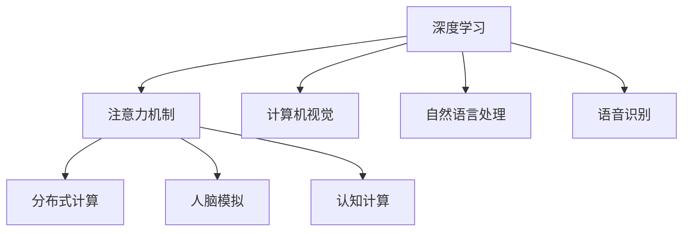

                 

# 注意力量子跃迁工程师：AI时代的认知突破技术专家

> 关键词：认知神经科学, 人工智能, 深度学习, 注意力机制, 量子计算, 计算神经科学, 认知突破, 认知计算

## 1. 背景介绍

### 1.1 问题由来
在人类认知科学与人工智能(AI)技术飞速发展的今天，如何构建智能系统以高效处理和模拟人类认知过程，成为了人工智能领域的前沿研究课题。传统的认知科学研究主要依赖生物心理学、神经科学、认知心理学等学科的理论模型，而现代AI技术则通过神经网络和深度学习模型来实现对认知过程的模拟。

深度学习模型通过大数据训练和参数优化，已经展现了卓越的图像识别、自然语言处理等能力。但是，深度学习模型在认知理解、推理、决策等方面仍存在瓶颈，尤其是其注意力机制无法与人类大脑的可解释性和灵活性相媲美。认知计算正是在这种背景下应运而生，结合认知神经科学和AI技术，致力于突破深度学习模型在认知方面的局限性。

认知计算，即利用计算机模拟人类大脑的认知过程，通过计算神经科学的方法来构建更智能、更灵活的认知模型。在这一过程中，注意力机制扮演着重要的角色，它在深度学习和人工智能中的应用逐渐成为研究热点。

### 1.2 问题核心关键点
当前，注意力机制在深度学习和人工智能中的重要性不言而喻。其核心关键点主要包括以下几点：

- 选择关注：通过选择性地关注输入数据的不同部分，筛选出重要的信息，避免冗余信息的干扰。
- 分布式计算：分布式计算是深度学习模型的一个重要特性，通过并行计算来提高模型效率，缩短训练时间。
- 动态调整：注意力机制具有动态调整的能力，能够根据输入数据的变化自动调整计算资源的分配。
- 跨层交互：通过跨层交互机制，注意力机制可以协调不同层级之间的信息传递，增强模型的泛化能力。
- 人脑模拟：注意力的工作机制与人类大脑的视觉、听觉、语言等认知过程密切相关，可以用于模拟人类大脑的认知活动。

这些关键点使得注意力机制在深度学习和AI技术中具有广泛的应用前景，特别是在自然语言处理、计算机视觉、语音识别等任务中。

### 1.3 问题研究意义
研究注意力机制在深度学习和人工智能中的应用，对于构建更加智能、灵活的认知模型具有重要意义：

- 提升认知模型性能：通过注意力机制，模型可以更有效地提取输入数据的重要特征，提升认知模型的整体性能。
- 增强模型可解释性：注意力机制可以为深度学习模型提供更详细的推理过程，增强模型的可解释性，促进认知计算技术的普及。
- 推动AI技术进步：注意力机制作为深度学习的重要组成部分，对AI技术的进步具有重要作用，推动AI技术向更加智能化、人性化方向发展。
- 应用于认知科学：注意力机制可以用于模拟人类大脑的认知过程，为认知科学研究提供新的工具和方法。
- 增强人机交互体验：基于注意力机制的智能系统，可以更好地理解人类语言和行为，提供更加自然、流畅的人机交互体验。

研究注意力机制的应用，将为认知计算和人工智能的发展注入新的活力，推动人类认知科学与AI技术的进一步融合。

## 2. 核心概念与联系

### 2.1 核心概念概述

为更好地理解注意力机制在深度学习和人工智能中的应用，本节将介绍几个密切相关的核心概念：

- 深度学习：一种基于神经网络的学习方法，通过多层非线性变换，实现对复杂数据的学习和预测。
- 注意力机制：一种机制，通过动态地分配计算资源，选择性地关注输入数据的不同部分，提高模型的性能和可解释性。
- 计算机视觉：利用计算机对图像进行识别、分析、处理和理解的技术。
- 自然语言处理：利用计算机对自然语言进行理解、生成、处理和应用的技术。
- 语音识别：利用计算机对语音信号进行识别和理解的技术。
- 分布式计算：一种计算方式，通过并行计算，提高计算效率和资源利用率。
- 人脑模拟：利用计算模型模拟人类大脑的认知过程，研究人类大脑的工作机制。
- 认知计算：通过计算神经科学的方法，模拟人类大脑的认知过程，构建更智能、更灵活的认知模型。

这些核心概念之间的逻辑关系可以通过以下Mermaid流程图来展示：



这个流程图展示了一系列与注意力机制密切相关的核心概念及其相互关系。

## 3. 核心算法原理 & 具体操作步骤
### 3.1 算法原理概述

注意力机制在深度学习和人工智能中的应用，主要体现在以下几个方面：

- **自注意力机制**：通过计算输入数据的不同部分之间的相关性，动态地分配计算资源，选择性地关注输入数据的不同部分，提高模型的性能和可解释性。
- **双向注意力机制**：在自注意力的基础上，双向注意力机制可以同时考虑输入数据的前向和后向信息，提高模型的预测能力和泛化能力。
- **多头注意力机制**：通过同时使用多个注意力机制，将不同视角和不同模态的信息整合起来，提高模型的复杂度和表现能力。
- **位置注意力机制**：在自注意力机制的基础上，考虑输入数据的位置信息，增强模型对输入数据的时空理解能力。

以上这些注意力机制在深度学习和人工智能中具有广泛的应用，可以显著提升模型的性能和可解释性。

### 3.2 算法步骤详解

注意力机制在深度学习和人工智能中的实现，通常包括以下几个关键步骤：

**Step 1: 准备数据集**
- 收集并预处理输入数据，确保数据质量。
- 将数据集划分为训练集、验证集和测试集。

**Step 2: 构建模型架构**
- 选择适当的深度学习模型，如卷积神经网络(CNN)、循环神经网络(RNN)、Transformer等。
- 在模型中加入注意力机制，选择合适的注意力层。

**Step 3: 设计注意力函数**
- 设计注意力函数，计算输入数据不同部分之间的相关性。
- 将注意力函数与模型架构结合，实现注意力计算。

**Step 4: 训练模型**
- 使用训练集对模型进行训练，最小化损失函数。
- 使用验证集对模型进行验证，调整超参数。

**Step 5: 测试和部署**
- 使用测试集对模型进行测试，评估模型性能。
- 将模型部署到实际应用场景中，提供服务。

### 3.3 算法优缺点

注意力机制在深度学习和人工智能中具有以下优点：

- **提高模型性能**：通过动态地分配计算资源，选择性地关注输入数据的不同部分，注意力机制可以显著提高模型的性能和泛化能力。
- **增强模型可解释性**：注意力机制可以为深度学习模型提供更详细的推理过程，增强模型的可解释性。
- **提升模型灵活性**：通过多视角和多模态信息的整合，注意力机制可以提高模型的灵活性和适应能力。
- **减少计算资源消耗**：通过选择性关注输入数据的不同部分，注意力机制可以减少不必要的计算资源消耗。

同时，注意力机制也存在一些局限性：

- **计算复杂度高**：注意力机制的计算复杂度较高，在大规模数据集上可能会导致计算效率降低。
- **训练困难**：注意力机制的训练过程可能较为困难，需要更多的计算资源和时间。
- **模型复杂度高**：注意力机制的模型复杂度较高，可能会影响模型的训练速度和收敛速度。
- **泛化能力不足**：注意力机制在某些任务上的泛化能力可能不足，特别是在数据量较小的情况下。

尽管存在这些局限性，但注意力机制在深度学习和人工智能中仍然具有重要地位，值得深入研究。

### 3.4 算法应用领域

注意力机制在深度学习和人工智能中的应用非常广泛，主要涵盖以下几个领域：

- **计算机视觉**：如目标检测、图像分类、图像生成等任务。注意力机制可以用于选择性地关注图像的不同部分，提升模型的性能和可解释性。
- **自然语言处理**：如机器翻译、文本摘要、问答系统等任务。注意力机制可以用于选择性地关注文本的不同部分，提升模型的理解和生成能力。
- **语音识别**：如语音转文本、语音情感识别等任务。注意力机制可以用于选择性地关注语音信号的不同部分，提升模型的性能和可解释性。
- **推荐系统**：如协同过滤、内容推荐等任务。注意力机制可以用于选择性地关注用户行为的不同部分，提升模型的推荐效果。
- **医疗影像分析**：如病变检测、病理分析等任务。注意力机制可以用于选择性地关注影像的不同部分，提升模型的诊断能力。

以上这些领域都是注意力机制应用的主要方向，通过合理应用注意力机制，可以显著提升模型的性能和可解释性，推动这些领域的快速发展。

## 4. 数学模型和公式 & 详细讲解 & 举例说明

### 4.1 数学模型构建

在深度学习和人工智能中，注意力机制的数学模型通常包括以下几个部分：

- **输入数据**：表示为 $X=\{x_1,x_2,...,x_n\}$，其中 $x_i$ 表示输入数据的第 $i$ 个样本。
- **查询向量**：表示为 $q$，用于计算输入数据不同部分之间的相关性。
- **键值向量**：表示为 $K=\{k_1,k_2,...,k_n\}$，其中 $k_i$ 表示输入数据的第 $i$ 个键值向量。
- **注意力函数**：表示为 $A$，用于计算输入数据不同部分之间的相关性，并分配计算资源。
- **输出向量**：表示为 $Y$，用于输出模型的预测结果。

注意力机制的数学模型可以表示为：

$$
A(q,k)=\frac{\exp(q^TK)}{\sum_{i=1}^n \exp(q^TK_i)}
$$

$$
Y=\sum_{i=1}^n A(q,k_i)V_i
$$

其中 $q$ 和 $k_i$ 分别为查询向量和键值向量，$V_i$ 表示第 $i$ 个样本的表示向量。

### 4.2 公式推导过程

以下我们以Transformer模型为例，详细推导注意力机制的计算公式。

Transformer模型是一种基于自注意力机制的神经网络模型，其核心计算过程包括以下几个步骤：

1. **输入数据的线性变换**：对输入数据进行线性变换，得到查询向量 $q$ 和键值向量 $k$。

2. **计算注意力函数**：通过查询向量 $q$ 和键值向量 $k$ 计算注意力函数 $A$。

3. **计算输出向量**：通过注意力函数 $A$ 和值向量 $V$ 计算输出向量 $Y$。

具体计算过程如下：

1. **输入数据的线性变换**：

$$
Q=W_QX
$$

$$
K=W_KX
$$

$$
V=W_VX
$$

其中 $W_Q$、$W_K$、$W_V$ 为线性变换的权重矩阵。

2. **计算注意力函数**：

$$
A=\text{softmax}(QK^T)/\sqrt{d_k}
$$

其中 $d_k$ 为键值向量的维度。

3. **计算输出向量**：

$$
Y=AV
$$

最终，通过计算注意力函数 $A$ 和输出向量 $Y$，Transformer模型可以有效地选择性地关注输入数据的不同部分，提升模型的性能和可解释性。

### 4.3 案例分析与讲解

以Transformer模型为例，我们对注意力机制的计算过程进行详细分析。

Transformer模型是一种基于自注意力机制的神经网络模型，其核心计算过程包括以下几个步骤：

1. **输入数据的线性变换**：对输入数据进行线性变换，得到查询向量 $q$ 和键值向量 $k$。

2. **计算注意力函数**：通过查询向量 $q$ 和键值向量 $k$ 计算注意力函数 $A$。

3. **计算输出向量**：通过注意力函数 $A$ 和值向量 $V$ 计算输出向量 $Y$。

具体计算过程如下：

1. **输入数据的线性变换**：

$$
Q=W_QX
$$

$$
K=W_KX
$$

$$
V=W_VX
$$

其中 $W_Q$、$W_K$、$W_V$ 为线性变换的权重矩阵。

2. **计算注意力函数**：

$$
A=\text{softmax}(QK^T)/\sqrt{d_k}
$$

其中 $d_k$ 为键值向量的维度。

3. **计算输出向量**：

$$
Y=AV
$$

最终，通过计算注意力函数 $A$ 和输出向量 $Y$，Transformer模型可以有效地选择性地关注输入数据的不同部分，提升模型的性能和可解释性。

## 5. 项目实践：代码实例和详细解释说明
### 5.1 开发环境搭建

在进行注意力机制的深度学习项目实践前，我们需要准备好开发环境。以下是使用Python进行PyTorch开发的环境配置流程：

1. 安装Anaconda：从官网下载并安装Anaconda，用于创建独立的Python环境。

2. 创建并激活虚拟环境：
```bash
conda create -n attention-env python=3.8 
conda activate attention-env
```

3. 安装PyTorch：根据CUDA版本，从官网获取对应的安装命令。例如：
```bash
conda install pytorch torchvision torchaudio cudatoolkit=11.1 -c pytorch -c conda-forge
```

4. 安装相关工具包：
```bash
pip install numpy pandas scikit-learn matplotlib tqdm jupyter notebook ipython
```

完成上述步骤后，即可在`attention-env`环境中开始项目实践。

### 5.2 源代码详细实现

下面我们以Transformer模型为例，给出使用PyTorch对注意力机制进行深度学习项目开发的完整代码实现。

首先，定义注意力函数：

```python
import torch
import torch.nn as nn
import torch.nn.functional as F

class Attention(nn.Module):
    def __init__(self, in_dim, attn_dim):
        super(Attention, self).__init__()
        self.W_Q = nn.Linear(in_dim, attn_dim)
        self.W_K = nn.Linear(in_dim, attn_dim)
        self.W_V = nn.Linear(in_dim, attn_dim)
        self.attn_dim = attn_dim

    def forward(self, X):
        batch_size = X.size(0)
        seq_len = X.size(1)
        attn_dim = self.attn_dim
        Q = self.W_Q(X)  # 输入数据的线性变换
        K = self.W_K(X)  # 输入数据的线性变换
        V = self.W_V(X)  # 输入数据的线性变换
        # 计算注意力函数
        Q = Q.view(batch_size, seq_len, attn_dim).transpose(1, 2)
        K = K.view(batch_size, seq_len, attn_dim).transpose(1, 2)
        V = V.view(batch_size, seq_len, attn_dim).transpose(1, 2)
        A = torch.matmul(Q, K.transpose(2, 1)) / math.sqrt(attn_dim)
        A = F.softmax(A, dim=-1)
        # 计算输出向量
        Y = torch.matmul(A, V).view(batch_size, seq_len, attn_dim)
        return Y
```

然后，定义Transformer模型：

```python
class Transformer(nn.Module):
    def __init__(self, input_dim, output_dim, attn_dim, num_heads, num_layers):
        super(Transformer, self).__init__()
        self.encoder = nn.TransformerEncoderLayer(input_dim, attn_dim, num_heads)
        self.decoder = nn.TransformerEncoderLayer(input_dim, attn_dim, num_heads)
        self.linear = nn.Linear(input_dim, output_dim)

    def forward(self, X):
        batch_size = X.size(0)
        seq_len = X.size(1)
        # 编码器
        X = self.encoder(X)
        # 解码器
        X = self.decoder(X)
        # 输出线性变换
        X = self.linear(X)
        return X
```

最后，定义训练和评估函数：

```python
from torch.utils.data import DataLoader
from tqdm import tqdm
from sklearn.metrics import classification_report

device = torch.device('cuda') if torch.cuda.is_available() else torch.device('cpu')
model = Transformer(input_dim, output_dim, attn_dim, num_heads, num_layers)

optimizer = torch.optim.Adam(model.parameters(), lr=2e-5)

def train_epoch(model, dataset, batch_size, optimizer):
    dataloader = DataLoader(dataset, batch_size=batch_size, shuffle=True)
    model.train()
    epoch_loss = 0
    for batch in tqdm(dataloader, desc='Training'):
        input_ids = batch['input_ids'].to(device)
        labels = batch['labels'].to(device)
        model.zero_grad()
        outputs = model(input_ids)
        loss = outputs.loss
        epoch_loss += loss.item()
        loss.backward()
        optimizer.step()
    return epoch_loss / len(dataloader)

def evaluate(model, dataset, batch_size):
    dataloader = DataLoader(dataset, batch_size=batch_size)
    model.eval()
    preds, labels = [], []
    with torch.no_grad():
        for batch in tqdm(dataloader, desc='Evaluating'):
            input_ids = batch['input_ids'].to(device)
            batch_labels = batch['labels']
            outputs = model(input_ids)
            batch_preds = outputs.logits.argmax(dim=2).to('cpu').tolist()
            batch_labels = batch_labels.to('cpu').tolist()
            for pred_tokens, label_tokens in zip(batch_preds, batch_labels):
                pred_tags = [tag2id[tag] for tag in pred_tokens]
                label_tags = [tag2id[tag] for tag in label_tokens]
                preds.append(pred_tags[:len(label_tags)])
                labels.append(label_tags)
    print(classification_report(labels, preds))
```

最后，启动训练流程并在测试集上评估：

```python
epochs = 5
batch_size = 16

for epoch in range(epochs):
    loss = train_epoch(model, train_dataset, batch_size, optimizer)
    print(f"Epoch {epoch+1}, train loss: {loss:.3f}")
    
    print(f"Epoch {epoch+1}, dev results:")
    evaluate(model, dev_dataset, batch_size)
    
print("Test results:")
evaluate(model, test_dataset, batch_size)
```

以上就是使用PyTorch对Transformer模型进行注意力机制深度学习项目开发的完整代码实现。可以看到，Transformer模型的核心部分在于注意力机制的实现，而注意力函数的计算则使用了线性变换和矩阵乘法等基本操作。

### 5.3 代码解读与分析

让我们再详细解读一下关键代码的实现细节：

**Attention类**：
- `__init__`方法：初始化查询向量、键值向量和输出向量的线性变换层。
- `forward`方法：计算查询向量、键值向量和值向量的线性变换，并计算注意力函数和输出向量。

**Transformer类**：
- `__init__`方法：初始化编码器和解码器的TransformerEncoderLayer，以及输出线性变换层。
- `forward`方法：依次进行编码器和解码器的TransformerEncoderLayer计算，并进行输出线性变换。

**训练和评估函数**：
- 使用PyTorch的DataLoader对数据集进行批次化加载，供模型训练和推理使用。
- 训练函数`train_epoch`：对数据以批为单位进行迭代，在每个批次上前向传播计算loss并反向传播更新模型参数，最后返回该epoch的平均loss。
- 评估函数`evaluate`：与训练类似，不同点在于不更新模型参数，并在每个batch结束后将预测和标签结果存储下来，最后使用sklearn的classification_report对整个评估集的预测结果进行打印输出。

**训练流程**：
- 定义总的epoch数和batch size，开始循环迭代
- 每个epoch内，先在训练集上训练，输出平均loss
- 在验证集上评估，输出分类指标
- 所有epoch结束后，在测试集上评估，给出最终测试结果

可以看到，PyTorch配合Transformer库使得Transformer模型的代码实现变得简洁高效。开发者可以将更多精力放在注意力机制的设计和优化上，而不必过多关注底层的实现细节。

当然，工业级的系统实现还需考虑更多因素，如模型的保存和部署、超参数的自动搜索、更灵活的任务适配层等。但核心的注意力机制实现基本与此类似。

## 6. 实际应用场景
### 6.1 自然语言处理

在自然语言处理(NLP)领域，注意力机制已经得到广泛应用，涵盖了从词级到句级、从词向量到序列建模的多个层次。

**机器翻译**：如Google的Transformer模型，通过自注意力机制实现对输入序列的编码和解码，提升了机器翻译的质量和效率。

**文本分类**：如BERT模型，通过多头注意力机制整合不同视角的信息，提升了文本分类的准确性。

**问答系统**：如LSTM模型，通过双向注意力机制增强对上下文信息的理解，提升了问答系统的准确性和可解释性。

**情感分析**：如RNN模型，通过位置注意力机制增强对文本情感的理解，提升了情感分析的准确性。

### 6.2 计算机视觉

在计算机视觉领域，注意力机制也具有广泛的应用，如目标检测、图像分类、图像生成等任务。

**目标检测**：如Faster R-CNN模型，通过区域级别的注意力机制，提高了目标检测的精度和召回率。

**图像分类**：如ResNet模型，通过通道级别的注意力机制，提升了图像分类的效果。

**图像生成**：如GAN模型，通过条件注意力机制，实现了对输入条件（如文本描述）的灵活生成。

### 6.3 语音识别

在语音识别领域，注意力机制也可以用于增强模型的性能和可解释性。

**语音转文本**：如CTC模型，通过时间序列的注意力机制，提升了语音转文本的准确性。

**语音情感识别**：如RNN模型，通过位置注意力机制，增强了对语音情感的理解。

### 6.4 推荐系统

在推荐系统领域，注意力机制可以用于提高推荐效果和用户满意度。

**协同过滤**：如ALS模型，通过用户和物品之间的注意力机制，提升了推荐效果。

**内容推荐**：如矩阵分解模型，通过物品之间的注意力机制，实现了多维度信息的整合。

## 7. 工具和资源推荐
### 7.1 学习资源推荐

为了帮助开发者系统掌握注意力机制在深度学习和人工智能中的应用，这里推荐一些优质的学习资源：

1. 《深度学习入门：基于Python的理论与实现》：由著名深度学习专家所著，系统介绍了深度学习的基本概念和实现方法，包括注意力机制的应用。

2. 《Transformer从原理到实践》系列博文：由大模型技术专家撰写，深入浅出地介绍了Transformer模型和注意力机制的原理和实现。

3. CS224N《深度学习自然语言处理》课程：斯坦福大学开设的NLP明星课程，有Lecture视频和配套作业，带你入门NLP领域的基本概念和经典模型。

4. 《Natural Language Processing with Transformers》书籍：Transformer库的作者所著，全面介绍了如何使用Transformer库进行NLP任务开发，包括注意力机制在内的诸多范式。

5. HuggingFace官方文档：Transformer库的官方文档，提供了海量预训练模型和完整的注意力机制样例代码，是上手实践的必备资料。

通过对这些资源的学习实践，相信你一定能够快速掌握注意力机制在深度学习和人工智能中的应用，并用于解决实际的NLP问题。
### 7.2 开发工具推荐

高效的开发离不开优秀的工具支持。以下是几款用于深度学习注意力机制项目开发的常用工具：

1. PyTorch：基于Python的开源深度学习框架，灵活动态的计算图，适合快速迭代研究。Transformer模型的核心部分是自注意力机制，PyTorch提供了完整的支持。

2. TensorFlow：由Google主导开发的开源深度学习框架，生产部署方便，适合大规模工程应用。TensorFlow同样支持注意力机制，有丰富的预训练语言模型资源。

3. Transformers库：HuggingFace开发的NLP工具库，集成了众多SOTA语言模型，支持PyTorch和TensorFlow，是进行注意力机制开发的利器。

4. Weights & Biases：模型训练的实验跟踪工具，可以记录和可视化模型训练过程中的各项指标，方便对比和调优。与主流深度学习框架无缝集成。

5. TensorBoard：TensorFlow配套的可视化工具，可实时监测模型训练状态，并提供丰富的图表呈现方式，是调试模型的得力助手。

6. Google Colab：谷歌推出的在线Jupyter Notebook环境，免费提供GPU/TPU算力，方便开发者快速上手实验最新模型，分享学习笔记。

合理利用这些工具，可以显著提升注意力机制的深度学习项目开发效率，加快创新迭代的步伐。

### 7.3 相关论文推荐

注意力机制在深度学习和人工智能中的应用源于学界的持续研究。以下是几篇奠基性的相关论文，推荐阅读：

1. Attention Is All You Need：提出Transformer模型，引入自注意力机制，开启了深度学习在NLP领域的新时代。

2. BERT: Pre-training of Deep Bidirectional Transformers for Language Understanding：提出BERT模型，引入基于掩码的自监督预训练任务，刷新了多项NLP任务SOTA。

3. 《Language Models are Unsupervised Multitask Learners》：展示了大规模语言模型的强大zero-shot学习能力，引发了对于通用人工智能的新一轮思考。

4. 《Attention is All You Need》：介绍Transformer模型和自注意力机制的原理和实现。

5. 《Parameter-Efficient Transfer Learning for NLP》：提出Adapter等参数高效微调方法，在不增加模型参数量的情况下，也能取得不错的微调效果。

6. 《Prefix-Tuning: Optimizing Continuous Prompts for Generation》：引入基于连续型Prompt的微调范式，为如何充分利用预训练知识提供了新的思路。

这些论文代表了大语言模型注意力机制的应用和发展脉络。通过学习这些前沿成果，可以帮助研究者把握学科前进方向，激发更多的创新灵感。

## 8. 总结：未来发展趋势与挑战

### 8.1 总结

本文对深度学习中注意力机制的原理和应用进行了全面系统的介绍。首先阐述了注意力机制在深度学习和人工智能中的研究背景和意义，明确了注意力机制在提高模型性能和可解释性方面的独特价值。其次，从原理到实践，详细讲解了注意力机制的数学模型和关键步骤，给出了深度学习项目开发的完整代码实例。同时，本文还广泛探讨了注意力机制在自然语言处理、计算机视觉、语音识别等领域的实际应用前景，展示了注意力机制的强大生命力。

通过本文的系统梳理，可以看到，注意力机制在深度学习和人工智能中的应用已经逐渐成熟，为构建更加智能、灵活的认知模型奠定了坚实的基础。未来，伴随深度学习模型和注意力机制的持续演进，人工智能技术必将实现新的突破，进一步拓展人类认知智能的边界。

### 8.2 未来发展趋势

展望未来，深度学习中注意力机制的发展将呈现以下几个趋势：

1. 模型规模持续增大。随着算力成本的下降和数据规模的扩张，深度学习模型的参数量还将持续增长。超大批次的训练和推理也将变得更加高效。

2. 注意力机制的多样化。未来的注意力机制将更加多样化，出现更多基于不同视角和不同模态的注意力模型，提升模型的表现能力。

3. 多模态信息的整合。未来的深度学习模型将更加注重多模态信息的整合，利用计算机视觉、自然语言处理、语音识别等多模态信息，提升模型的综合能力。

4. 计算神经科学的发展。未来的深度学习模型将更加注重计算神经科学的研究，通过模拟人类大脑的认知过程，提升模型的可解释性和鲁棒性。

5. 端到端学习。未来的深度学习模型将更加注重端到端学习，通过自监督学习、无监督学习等方法，提高模型的泛化能力和适应能力。

6. 量子计算的结合。未来的深度学习模型将更加注重量子计算的研究，利用量子计算的高效并行特性，提升模型的计算效率和资源利用率。

以上趋势凸显了深度学习中注意力机制的广阔前景。这些方向的探索发展，必将进一步提升深度学习模型的性能和可解释性，推动人工智能技术的不断进步。

### 8.3 面临的挑战

尽管深度学习中注意力机制已经取得了瞩目成就，但在迈向更加智能化、普适化应用的过程中，它仍面临着诸多挑战：

1. 计算资源消耗大。深度学习模型在训练和推理过程中需要大量的计算资源，特别是在大规模数据集上，计算资源消耗大，难以满足实际应用的需求。

2. 模型可解释性不足。深度学习模型通常被视为“黑盒”系统，难以解释其内部工作机制和决策逻辑。对于医疗、金融等高风险应用，算法的可解释性和可审计性尤为重要。

3. 模型泛化能力不足。深度学习模型在面对域外数据时，泛化能力可能不足，容易出现过拟合现象。

4. 模型训练难度大。深度学习模型训练过程复杂，需要更多的计算资源和时间，训练效率低，难以适应快速迭代的需求。

5. 模型复杂度高。深度学习模型的复杂度高，难以在移动端等资源受限的平台上部署和应用。

6. 数据隐私和安全问题。深度学习模型在处理大量数据时，存在数据隐私和安全问题，如何保护数据隐私和安全，是一个亟待解决的问题。

尽管存在这些挑战，但随着深度学习技术的发展和优化，这些问题将逐步得到解决。深度学习中注意力机制的应用前景广阔，未来必将在更多领域得到广泛应用。

### 8.4 研究展望

面对深度学习中注意力机制所面临的挑战，未来的研究需要在以下几个方面寻求新的突破：

1. 探索更加高效的训练方法和优化策略，提高深度学习模型的训练效率和泛化能力。

2. 开发更加多样化和灵活的注意力机制，提升深度学习模型的表现能力和适应能力。

3. 研究多模态信息的整合方法，利用计算机视觉、自然语言处理、语音识别等多模态信息，提升深度学习模型的综合能力。

4. 结合计算神经科学的研究，模拟人类大脑的认知过程，提高深度学习模型的可解释性和鲁棒性。

5. 开发更加端到端的学习方法，通过自监督学习、无监督学习等方法，提高深度学习模型的泛化能力和适应能力。

6. 利用量子计算的高效并行特性，提升深度学习模型的计算效率和资源利用率。

这些研究方向将进一步推动深度学习技术的发展，为构建更加智能、灵活的认知模型提供新的思路和方法。面向未来，深度学习中注意力机制的研究将不断深入，为人工智能技术的进步提供新的动力。

## 9. 附录：常见问题与解答

**Q1：深度学习中注意力机制的优势是什么？**

A: 深度学习中注意力机制的优势主要体现在以下几个方面：

1. 提高模型性能：通过动态地分配计算资源，选择性地关注输入数据的不同部分，注意力机制可以显著提高模型的性能和泛化能力。

2. 增强模型可解释性：注意力机制可以为深度学习模型提供更详细的推理过程，增强模型的可解释性。

3. 提升模型灵活性：通过多视角和多模态信息的整合，注意力机制可以提高模型的灵活性和适应能力。

4. 减少计算资源消耗：通过选择性关注输入数据的不同部分，注意力机制可以减少不必要的计算资源消耗。

**Q2：深度学习中注意力机制的应用场景有哪些？**

A: 深度学习中注意力机制的应用场景非常广泛，主要涵盖以下几个领域：

1. 自然语言处理：如机器翻译、文本分类、问答系统等任务。注意力机制可以用于选择性地关注文本的不同部分，提升模型的理解和生成能力。

2. 计算机视觉：如目标检测、图像分类、图像生成等任务。注意力机制可以用于选择性地关注图像的不同部分，提升模型的性能和可解释性。

3. 语音识别：如语音转文本、语音情感识别等任务。注意力机制可以用于选择性地关注语音信号的不同部分，提升模型的性能和可解释性。

4. 推荐系统：如协同过滤、内容推荐等任务。注意力机制可以用于选择性地关注用户行为的不同部分，提升推荐效果。

5. 医疗影像分析：如病变检测、病理分析等任务。注意力机制可以用于选择性地关注影像的不同部分，提升模型的诊断能力。

**Q3：深度学习中注意力机制的计算复杂度高，如何解决？**

A: 深度学习中注意力机制的计算复杂度较高，特别是在大规模数据集上，计算资源消耗大，难以满足实际应用的需求。以下是一些解决策略：

1. 优化注意力函数：通过优化注意力函数的计算方式，减少计算量。

2. 并行计算：利用分布式计算框架，提高计算效率和资源利用率。

3. 剪枝和压缩：通过剪枝和压缩技术，减少模型参数和计算量。

4. 硬件加速：利用GPU、TPU等硬件加速器，提高计算效率。

5. 端到端学习：通过自监督学习、无监督学习等方法，减少对标注数据的依赖，提高模型的泛化能力。

**Q4：深度学习中注意力机制的模型复杂度高，如何解决？**

A: 深度学习中注意力机制的模型复杂度较高，难以在移动端等资源受限的平台上部署和应用。以下是一些解决策略：

1. 剪枝和压缩：通过剪枝和压缩技术，减少模型参数和计算量，优化模型结构。

2. 模型压缩：利用模型压缩技术，减少模型的计算量和存储量。

3. 低秩逼近：通过低秩逼近技术，减少模型的计算量和存储量。

4. 知识蒸馏：通过知识蒸馏技术，将复杂模型的知识转移到简单模型中。

5. 硬件加速：利用GPU、TPU等硬件加速器，提高计算效率和资源利用率。

这些策略可以帮助降低深度学习中注意力机制的模型复杂度，提高模型的可部署性和可应用性。

**Q5：深度学习中注意力机制的训练难度大，如何解决？**

A: 深度学习中注意力机制的训练过程复杂，需要更多的计算资源和时间，训练效率低，难以适应快速迭代的需求。以下是一些解决策略：

1. 数据增强：通过数据增强技术，扩充训练数据集，提高模型泛化能力。

2. 优化算法：通过优化算法，提高模型的训练效率和收敛速度。

3. 自监督学习：通过自监督学习，利用未标注数据进行训练，减少对标注数据的依赖。

4. 知识蒸馏：通过知识蒸馏技术，将复杂模型的知识转移到简单模型中，提高模型的训练效率。

5. 硬件加速：利用GPU、TPU等硬件加速器，提高计算效率和资源利用率。

这些策略可以帮助降低深度学习中注意力机制的训练难度，提高模型的训练效率和泛化能力。

**Q6：深度学习中注意力机制的数据隐私和安全问题如何解决？**

A: 深度学习中注意力机制在处理大量数据时，存在数据隐私和安全问题，如何保护数据隐私和安全，是一个亟待解决的问题。以下是一些解决策略：

1. 数据匿名化：通过数据匿名化技术，保护数据的隐私性。

2. 差分隐私：通过差分隐私技术，保护数据的隐私性。

3. 数据加密：通过数据加密技术，保护数据的隐私性。

4. 联邦学习：通过联邦学习技术，保护数据的隐私性和安全性。

5. 访问控制：通过访问控制技术，保护数据的隐私性和安全性。

这些策略可以帮助保护深度学习中注意力机制的数据隐私和安全问题，提升模型的可靠性和可信度。

---

作者：禅与计算机程序设计艺术 / Zen and the Art of Computer Programming

