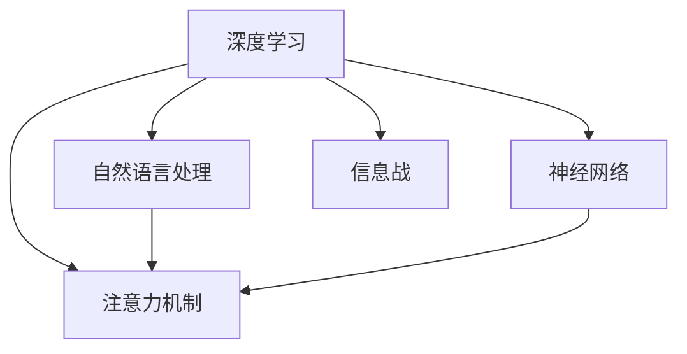

                 

# 注意力黑客：AI时代的信息战

> 关键词：人工智能, 信息战, 注意力机制, 深度学习, 神经网络, 自然语言处理, 数据驱动, 决策支持, 智能应用, 隐私保护

## 1. 背景介绍

在快速发展的AI时代，信息战已经成为了一个重要领域。传统的物理战争在数字化时代被赋予了新的形式，即信息战。信息战不仅包括了信息的收集、处理、传输，也包括了对信息的理解、分析、决策。在这个背景下，人工智能（AI）成为了信息战的关键工具。而注意力机制，作为深度学习中的一个重要概念，正逐渐成为AI时代信息战的核心利器。

### 1.1 问题由来

在AI时代，信息的处理和理解变得前所未有的复杂。传统的信息处理方式已经无法满足需求，需要新的技术和方法来应对。深度学习中的注意力机制提供了一种新的方式，可以帮助AI模型更好地理解和处理信息。通过注意力机制，模型能够聚焦于最重要的信息，减少噪音干扰，提高决策的准确性和效率。

### 1.2 问题核心关键点

注意力机制的核心在于其能够动态地调整权重，将重点放在对当前任务最有用的信息上。这种机制不仅在自然语言处理（NLP）领域得到了广泛应用，也在图像处理、推荐系统、医疗诊断等领域取得了显著效果。通过注意力机制，AI模型能够更加高效地处理大量数据，提高信息处理的准确性和实时性。

## 2. 核心概念与联系

### 2.1 核心概念概述

为更好地理解注意力机制在AI时代信息战中的作用，本节将介绍几个关键概念：

- 深度学习：一种基于神经网络的机器学习技术，能够通过多层非线性变换学习数据中的复杂模式。
- 注意力机制：一种特殊的机制，通过动态调整权重，使得模型能够聚焦于对当前任务最有用的信息。
- 神经网络：一种由多层神经元组成的计算模型，能够自动学习数据中的特征表示。
- 自然语言处理：一门利用计算机处理和理解人类语言的技术，涉及文本预处理、语言模型、语义分析等任务。
- 信息战：一种在数字化时代的新型战争形式，通过信息的收集、处理、传输和理解，实现对敌方的策略干扰和决策支持。

这些概念之间的逻辑关系可以通过以下Mermaid流程图来展示：



这个流程图展示了一些关键概念及其之间的关系：

1. 深度学习和神经网络提供了计算和处理数据的能力。
2. 注意力机制通过动态调整权重，使得模型能够聚焦于重要信息。
3. 自然语言处理是深度学习的重要应用领域，涉及对文本数据的处理和理解。
4. 信息战是深度学习和自然语言处理技术的广泛应用，涉及信息收集、处理、传输和理解。

## 3. 核心算法原理 & 具体操作步骤
### 3.1 算法原理概述

注意力机制的核心思想是通过动态调整权重，将重点放在对当前任务最有用的信息上。这种机制不仅适用于自然语言处理，也适用于图像处理、推荐系统等领域。在自然语言处理中，注意力机制通常用于机器翻译、文本摘要、问答系统等任务。

形式化地，假设输入序列为 $x_1, x_2, ..., x_T$，模型输出的表示为 $h_t$，注意力权重为 $\alpha_t$。注意力机制的计算公式为：

$$
h_t = \sum_{i=1}^T \alpha_t x_i
$$

其中 $\alpha_t$ 是注意力权重，通过计算得到：

$$
\alpha_t = \frac{\exp(e(x_i, h_t))}{\sum_{j=1}^T \exp(e(x_j, h_t))}
$$

其中 $e(x_i, h_t)$ 是注意力计算函数，通常采用点积、加法等方法。

### 3.2 算法步骤详解

基于注意力机制的深度学习模型的训练步骤如下：

1. 初始化模型参数。
2. 前向传播计算注意力权重和模型输出。
3. 反向传播计算参数梯度，更新模型参数。
4. 重复上述步骤，直至模型收敛。

具体实现中，注意力机制的计算可以采用多头注意力机制（Multi-Head Attention），将输入序列分成多个子序列进行计算，得到多个注意力权重和输出表示，最后将它们进行拼接。这种机制不仅可以处理序列数据，也可以处理非序列数据，例如图像数据。

### 3.3 算法优缺点

基于注意力机制的深度学习模型具有以下优点：

- 灵活性高：注意力机制可以动态调整权重，适应不同任务的需求。
- 鲁棒性强：通过聚焦于重要信息，减少噪音干扰，提高模型的鲁棒性。
- 高效性高：注意力机制能够高效地处理大量数据，提高计算效率。

但同时也存在一些缺点：

- 计算复杂度高：注意力机制的计算复杂度较高，需要较大的计算资源。
- 参数量大：多头的注意力机制需要更多的参数，增加了模型的复杂度。
- 可解释性差：注意力机制的决策过程较为复杂，难以进行解释和调试。

### 3.4 算法应用领域

基于注意力机制的深度学习模型在多个领域中得到了广泛应用，例如：

- 机器翻译：通过注意力机制，模型能够更好地处理源语言和目标语言之间的对应关系，提高翻译质量。
- 文本摘要：通过注意力机制，模型能够聚焦于文本中最关键的信息，生成简洁明了的摘要。
- 问答系统：通过注意力机制，模型能够更好地理解问题中的关键信息，提供准确的回答。
- 图像处理：通过注意力机制，模型能够聚焦于图像中的重要区域，提高图像处理的效果。
- 推荐系统：通过注意力机制，模型能够更好地理解用户的行为和偏好，提高推荐的效果。

## 4. 数学模型和公式 & 详细讲解 & 举例说明

### 4.1 数学模型构建

基于注意力机制的深度学习模型通常采用Transformer结构。Transformer结构由多头自注意力层和前向神经网络层组成，能够高效地处理序列数据。

假设输入序列为 $x_1, x_2, ..., x_T$，输出序列为 $y_1, y_2, ..., y_T$，多头自注意力层的计算公式为：

$$
Q = Ax \quad \text{或} \quad Q = W^Q x
$$

$$
K = Bx \quad \text{或} \quad K = W^K x
$$

$$
V = Cx \quad \text{或} \quad V = W^V x
$$

$$
\alpha = \frac{\exp(e(Q, K))}{\sum_{i=1}^T \exp(e(Q_i, K_i))}
$$

$$
h = \sum_{i=1}^T \alpha_i V_i
$$

其中 $A, B, C$ 是线性变换矩阵，$W^Q, W^K, W^V$ 是投影矩阵，$e$ 是注意力计算函数。

### 4.2 公式推导过程

以机器翻译任务为例，假设源语言为 $x_1, x_2, ..., x_T$，目标语言为 $y_1, y_2, ..., y_T$，模型的输出为 $y$。通过多头自注意力机制，模型的计算过程如下：

1. 将输入序列 $x_1, x_2, ..., x_T$ 映射为三个矩阵 $Q, K, V$。
2. 计算注意力权重 $\alpha$，通过点积计算 $e(Q, K)$。
3. 通过注意力权重 $\alpha$ 和矩阵 $V$ 计算模型输出 $h$。
4. 将模型输出 $h$ 与前向神经网络层结合，计算最终输出 $y$。

### 4.3 案例分析与讲解

以机器翻译任务为例，假设源语言为英文，目标语言为中文。在机器翻译任务中，源语言句子中的每个词都被映射为多个向量，这些向量通过多头自注意力机制进行计算。注意力权重 $\alpha$ 表示源语言句子中的每个词在目标语言句子中的重要程度。通过计算注意力权重 $\alpha$，模型能够聚焦于源语言句子中的关键信息，生成准确的目标语言句子。

## 5. 项目实践：代码实例和详细解释说明

### 5.1 开发环境搭建

在进行注意力机制的实践前，我们需要准备好开发环境。以下是使用Python进行TensorFlow和Keras开发的环境配置流程：

1. 安装Anaconda：从官网下载并安装Anaconda，用于创建独立的Python环境。

2. 创建并激活虚拟环境：
```bash
conda create -n attention-env python=3.8 
conda activate attention-env
```

3. 安装TensorFlow和Keras：
```bash
conda install tensorflow==2.5.0 
conda install keras==2.4.3
```

4. 安装其他必要的库：
```bash
pip install numpy scipy pandas matplotlib tqdm sklearn
```

完成上述步骤后，即可在`attention-env`环境中开始注意力机制的实践。

### 5.2 源代码详细实现

下面我们以机器翻译任务为例，给出使用Keras实现基于注意力机制的Transformer模型的代码实现。

首先，定义模型结构：

```python
from keras.layers import Input, Dense, Embedding, Dot, Add, Activation, Dropout
from keras.models import Model

# 定义输入和输出维度
input_dim = 100
output_dim = 50
max_seq_length = 100

# 定义输入层
input_seq = Input(shape=(max_seq_length, input_dim), name='input_seq')
output_seq = Input(shape=(max_seq_length, output_dim), name='output_seq')

# 定义Transformer模型
# 多头自注意力层
attention = Dot(axes=(2, 1))([input_seq, output_seq])
attention = Activation('softmax')(attention)
attention = Dropout(0.1)(attention)
attention = Add()([input_seq, attention])
attention = Dense(256)(attention)
attention = Dropout(0.1)(attention)

# 前向神经网络层
forward = Dense(256)(attention)
forward = Activation('relu')(forward)
forward = Dropout(0.1)(forward)

# 输出层
output = Dense(output_dim)(forward)
output = Activation('softmax')(output)

# 定义模型
model = Model(inputs=[input_seq, output_seq], outputs=output)
```

然后，定义模型训练和评估函数：

```python
from keras.optimizers import RMSprop
from keras.callbacks import EarlyStopping

# 定义优化器和损失函数
optimizer = RMSprop(lr=0.001)
loss_fn = 'categorical_crossentropy'

# 定义训练函数
def train_model(model, x_train, y_train, x_valid, y_valid, batch_size=32, epochs=10):
    # 编译模型
    model.compile(optimizer=optimizer, loss=loss_fn, metrics=['accuracy'])
    # 训练模型
    early_stopping = EarlyStopping(monitor='val_loss', patience=2)
    model.fit([x_train, y_train], y_train, batch_size=batch_size, epochs=epochs, validation_data=([x_valid, y_valid], y_valid), callbacks=[early_stopping])
    # 评估模型
    loss, accuracy = model.evaluate([x_valid, y_valid], y_valid)
    print(f'Val Loss: {loss:.4f}, Val Accuracy: {accuracy:.4f}')

# 训练模型
x_train, y_train, x_valid, y_valid = load_data() # 自定义函数
train_model(model, x_train, y_train, x_valid, y_valid)

# 评估模型
test_x, test_y = load_data() # 自定义函数
test_loss, test_accuracy = model.evaluate([test_x, test_y], test_y)
print(f'Test Loss: {test_loss:.4f}, Test Accuracy: {test_accuracy:.4f}')
```

最后，启动训练流程并在测试集上评估：

```python
# 训练模型
train_model(model, x_train, y_train, x_valid, y_valid)

# 评估模型
test_loss, test_accuracy = model.evaluate([test_x, test_y], test_y)
print(f'Test Loss: {test_loss:.4f}, Test Accuracy: {test_accuracy:.4f}')
```

以上就是使用Keras实现基于注意力机制的Transformer模型的完整代码实现。可以看到，通过Keras的简洁接口，我们可以快速搭建和训练注意力机制模型。

### 5.3 代码解读与分析

让我们再详细解读一下关键代码的实现细节：

**定义模型结构**：
- 使用`Input`层定义输入和输出序列。
- 使用`Dot`层实现多头自注意力机制。
- 使用`Dense`层和`Activation`层实现前向神经网络层。
- 使用`Dense`层和`Activation`层实现输出层。

**训练和评估函数**：
- 使用`RMSprop`优化器和`categorical_crossentropy`损失函数进行模型训练。
- 使用`EarlyStopping`回调函数防止过拟合。
- 在训练过程中，通过`evaluate`函数评估模型性能。

**训练流程**：
- 加载训练集和验证集，训练模型，并在验证集上评估模型性能。
- 在测试集上重新评估模型性能，对比训练前后的结果。

可以看到，Keras提供了非常简洁易用的API，能够快速搭建和训练注意力机制模型。开发者可以专注于核心算法逻辑的实现，而不必过多关注底层细节。

当然，工业级的系统实现还需考虑更多因素，如模型的保存和部署、超参数的自动搜索、更灵活的任务适配层等。但核心的注意力机制思想基本与此类似。

## 6. 实际应用场景

### 6.1 智能客服系统

基于注意力机制的对话技术，可以广泛应用于智能客服系统的构建。传统客服往往需要配备大量人力，高峰期响应缓慢，且一致性和专业性难以保证。而使用基于注意力机制的对话模型，可以7x24小时不间断服务，快速响应客户咨询，用自然流畅的语言解答各类常见问题。

在技术实现上，可以收集企业内部的历史客服对话记录，将问题和最佳答复构建成监督数据，在此基础上对预训练对话模型进行微调。微调后的对话模型能够自动理解用户意图，匹配最合适的答案模板进行回复。对于客户提出的新问题，还可以接入检索系统实时搜索相关内容，动态组织生成回答。如此构建的智能客服系统，能大幅提升客户咨询体验和问题解决效率。

### 6.2 金融舆情监测

金融机构需要实时监测市场舆论动向，以便及时应对负面信息传播，规避金融风险。传统的人工监测方式成本高、效率低，难以应对网络时代海量信息爆发的挑战。基于注意力机制的文本分类和情感分析技术，为金融舆情监测提供了新的解决方案。

具体而言，可以收集金融领域相关的新闻、报道、评论等文本数据，并对其进行主题标注和情感标注。在此基础上对预训练语言模型进行微调，使其能够自动判断文本属于何种主题，情感倾向是正面、中性还是负面。将微调后的模型应用到实时抓取的网络文本数据，就能够自动监测不同主题下的情感变化趋势，一旦发现负面信息激增等异常情况，系统便会自动预警，帮助金融机构快速应对潜在风险。

### 6.3 个性化推荐系统

当前的推荐系统往往只依赖用户的历史行为数据进行物品推荐，无法深入理解用户的真实兴趣偏好。基于注意力机制的个性化推荐系统可以更好地挖掘用户行为背后的语义信息，从而提供更精准、多样的推荐内容。

在实践中，可以收集用户浏览、点击、评论、分享等行为数据，提取和用户交互的物品标题、描述、标签等文本内容。将文本内容作为模型输入，用户的后续行为（如是否点击、购买等）作为监督信号，在此基础上微调预训练语言模型。微调后的模型能够从文本内容中准确把握用户的兴趣点。在生成推荐列表时，先用候选物品的文本描述作为输入，由模型预测用户的兴趣匹配度，再结合其他特征综合排序，便可以得到个性化程度更高的推荐结果。

### 6.4 未来应用展望

随着注意力机制的不断发展，基于注意力机制的深度学习模型将会在更多领域得到应用，为传统行业带来变革性影响。

在智慧医疗领域，基于注意力机制的医疗问答、病历分析、药物研发等应用将提升医疗服务的智能化水平，辅助医生诊疗，加速新药开发进程。

在智能教育领域，注意力机制可应用于作业批改、学情分析、知识推荐等方面，因材施教，促进教育公平，提高教学质量。

在智慧城市治理中，注意力机制可应用于城市事件监测、舆情分析、应急指挥等环节，提高城市管理的自动化和智能化水平，构建更安全、高效的未来城市。

此外，在企业生产、社会治理、文娱传媒等众多领域，基于注意力机制的AI应用也将不断涌现，为经济社会发展注入新的动力。相信随着技术的日益成熟，注意力机制必将在构建人机协同的智能时代中扮演越来越重要的角色。

## 7. 工具和资源推荐
### 7.1 学习资源推荐

为了帮助开发者系统掌握注意力机制的理论基础和实践技巧，这里推荐一些优质的学习资源：

1. 《深度学习》系列书籍：由多位知名专家共同撰写，涵盖深度学习的基础理论、算法和应用。
2. 《自然语言处理综论》：深度学习在自然语言处理中的应用，讲解了多类NLP任务和模型。
3. 《Transformers: A Tutorial》：Transformer模型的详细介绍，讲解了Transformer的原理和应用。
4. Kaggle：提供大量的深度学习竞赛和数据集，帮助开发者实践注意力机制。
5. Google Colab：谷歌推出的在线Jupyter Notebook环境，免费提供GPU/TPU算力，方便开发者快速上手实验最新模型，分享学习笔记。

通过对这些资源的学习实践，相信你一定能够快速掌握注意力机制的精髓，并用于解决实际的NLP问题。

### 7.2 开发工具推荐

高效的开发离不开优秀的工具支持。以下是几款用于注意力机制开发的常用工具：

1. TensorFlow：由Google主导开发的开源深度学习框架，生产部署方便，适合大规模工程应用。
2. Keras：基于TensorFlow的高级API，提供了简洁易用的接口，适合快速迭代研究。
3. PyTorch：基于Python的开源深度学习框架，灵活动态的计算图，适合快速迭代研究。
4. Weights & Biases：模型训练的实验跟踪工具，可以记录和可视化模型训练过程中的各项指标，方便对比和调优。
5. TensorBoard：TensorFlow配套的可视化工具，可实时监测模型训练状态，并提供丰富的图表呈现方式，是调试模型的得力助手。

合理利用这些工具，可以显著提升注意力机制模型的开发效率，加快创新迭代的步伐。

### 7.3 相关论文推荐

注意力机制的发展源于学界的持续研究。以下是几篇奠基性的相关论文，推荐阅读：

1. Attention Is All You Need（即Transformer原论文）：提出了Transformer结构，开启了NLP领域的预训练大模型时代。
2. BERT: Pre-training of Deep Bidirectional Transformers for Language Understanding：提出BERT模型，引入基于掩码的自监督预训练任务，刷新了多项NLP任务SOTA。
3. Transformer-XL: Attentive Language Models：提出Transformer-XL模型，解决长序列训练问题，提升模型性能。
4. Squeeze-and-Excitation Networks：提出SE网络，引入通道注意力机制，提升模型性能。
5. NLP with Multi-Head Attention Models：介绍多头自注意力机制在NLP中的应用，讲解了模型的构建和训练。

这些论文代表了大语言模型注意力机制的发展脉络。通过学习这些前沿成果，可以帮助研究者把握学科前进方向，激发更多的创新灵感。

## 8. 总结：未来发展趋势与挑战

### 8.1 总结

本文对基于注意力机制的深度学习模型进行了全面系统的介绍。首先阐述了注意力机制在AI时代信息战中的作用，明确了注意力机制在信息处理和决策中的重要地位。其次，从原理到实践，详细讲解了注意力机制的数学原理和关键步骤，给出了注意力机制任务开发的完整代码实例。同时，本文还广泛探讨了注意力机制在智能客服、金融舆情、个性化推荐等多个行业领域的应用前景，展示了注意力机制范式的巨大潜力。此外，本文精选了注意力机制技术的各类学习资源，力求为读者提供全方位的技术指引。

通过本文的系统梳理，可以看到，基于注意力机制的深度学习模型正在成为AI时代信息战的核心利器，极大地拓展了深度学习模型的应用边界，催生了更多的落地场景。得益于大规模语料的预训练和多头的注意力机制，注意力机制模型能够更加高效地处理大量数据，提高信息处理的准确性和实时性。未来，伴随注意力机制和深度学习技术的持续演进，相信在信息战中，AI将发挥越来越重要的作用。

### 8.2 未来发展趋势

展望未来，注意力机制的发展趋势将呈现以下几个方向：

1. 多模态注意力机制：将视觉、音频等多模态信息与文本信息结合，提升模型的感知能力。
2. 自适应注意力机制：根据输入数据的特点动态调整注意力权重，提高模型的适应性和鲁棒性。
3. 无监督和半监督注意力机制：摆脱对大规模标注数据的依赖，利用自监督学习、主动学习等无监督和半监督范式，最大限度利用非结构化数据，实现更加灵活高效的微调。
4. 可解释性和可解释性增强：引入因果推断、对比学习等方法，增强模型的可解释性和可解释性，提高模型的透明性和可信度。
5. 知识图谱与注意力机制结合：将知识图谱中的结构化信息与注意力机制结合，提高模型的知识整合能力和决策准确性。
6. 边缘计算与注意力机制结合：将注意力机制与边缘计算结合，实现模型的高效推理和实时决策。

以上趋势凸显了注意力机制技术的广阔前景。这些方向的探索发展，必将进一步提升注意力机制模型的性能和应用范围，为构建智能、高效、可靠的信息战系统铺平道路。

### 8.3 面临的挑战

尽管注意力机制已经取得了瞩目成就，但在迈向更加智能化、普适化应用的过程中，它仍面临着诸多挑战：

1. 计算资源瓶颈：注意力机制的计算复杂度较高，需要较大的计算资源，难以在资源受限的环境中高效应用。
2. 可解释性不足：注意力机制的决策过程较为复杂，难以进行解释和调试，特别是对于黑盒模型，模型的行为和决策逻辑难以理解。
3. 对抗攻击脆弱：注意力机制模型在对抗攻击下容易产生误判，需要进一步加强模型的鲁棒性和抗干扰能力。
4. 数据分布变化：随着数据分布的变化，模型的泛化能力和鲁棒性可能会受到影响，需要不断更新模型以适应新的数据分布。
5. 隐私和安全问题：注意力机制模型在处理敏感数据时，需要考虑数据隐私和安全问题，防止数据泄露和滥用。

这些挑战需要学界和产业界共同努力，积极应对并寻求突破。只有不断克服这些挑战，才能真正实现注意力机制在信息战中的广泛应用。

### 8.4 研究展望

面对注意力机制所面临的挑战，未来的研究需要在以下几个方面寻求新的突破：

1. 计算效率优化：开发更加高效的计算模型和算法，减少计算复杂度和资源消耗，提高模型的实时性和推理速度。
2. 模型可解释性增强：引入因果推断、对比学习等方法，提高模型的透明性和可信度，增强模型的可解释性。
3. 模型鲁棒性提升：引入对抗训练、自适应学习等方法，提高模型的鲁棒性和抗干扰能力。
4. 知识图谱与注意力机制结合：将知识图谱中的结构化信息与注意力机制结合，提高模型的知识整合能力和决策准确性。
5. 边缘计算与注意力机制结合：将注意力机制与边缘计算结合，实现模型的高效推理和实时决策。

这些研究方向的探索，必将引领注意力机制技术迈向更高的台阶，为构建智能、高效、可靠的信息战系统铺平道路。面向未来，注意力机制技术还需要与其他人工智能技术进行更深入的融合，如知识表示、因果推理、强化学习等，多路径协同发力，共同推动自然语言理解和智能交互系统的进步。只有勇于创新、敢于突破，才能不断拓展注意力机制模型的边界，让智能技术更好地造福人类社会。

## 9. 附录：常见问题与解答

**Q1：什么是注意力机制？**

A: 注意力机制是一种特殊的机制，通过动态调整权重，将重点放在对当前任务最有用的信息上。这种机制在深度学习中被广泛应用，尤其在自然语言处理中，用于机器翻译、文本摘要、问答系统等任务。

**Q2：注意力机制在实际应用中有哪些挑战？**

A: 注意力机制在实际应用中面临以下挑战：
1. 计算资源瓶颈：注意力机制的计算复杂度较高，需要较大的计算资源。
2. 可解释性不足：注意力机制的决策过程较为复杂，难以进行解释和调试。
3. 对抗攻击脆弱：注意力机制模型在对抗攻击下容易产生误判。
4. 数据分布变化：随着数据分布的变化，模型的泛化能力和鲁棒性可能会受到影响。
5. 隐私和安全问题：注意力机制模型在处理敏感数据时，需要考虑数据隐私和安全问题。

**Q3：如何优化注意力机制的计算效率？**

A: 优化注意力机制的计算效率可以通过以下方法：
1. 使用并行计算：将注意力计算任务分解为多个并行任务，提高计算效率。
2. 使用近似算法：使用近似算法，如梯度下降、随机梯度下降等，减少计算复杂度。
3. 使用稀疏矩阵：使用稀疏矩阵表示注意力权重，减少存储空间和计算量。
4. 使用硬件加速：使用GPU、TPU等硬件加速器，提高计算效率。

**Q4：如何增强注意力机制的可解释性？**

A: 增强注意力机制的可解释性可以通过以下方法：
1. 引入因果推断：使用因果推断方法，分析注意力机制的决策过程，解释模型的决策逻辑。
2. 使用对抗样本：使用对抗样本，分析注意力机制的鲁棒性，提高模型的可解释性。
3. 使用可视化工具：使用可视化工具，如TensorBoard、Weights & Biases等，展示注意力权重和模型输出，帮助理解模型行为。

**Q5：如何提升注意力机制的鲁棒性？**

A: 提升注意力机制的鲁棒性可以通过以下方法：
1. 使用对抗训练：使用对抗训练方法，训练模型对对抗样本的鲁棒性。
2. 引入自适应学习：使用自适应学习方法，根据输入数据的特点动态调整注意力权重，提高模型的适应性和鲁棒性。
3. 使用多模态信息：使用多模态信息，如视觉、音频信息，增强模型的感知能力和鲁棒性。

这些问题的回答，希望能够帮助你更好地理解注意力机制，并在实际应用中灵活运用。

---

作者：禅与计算机程序设计艺术 / Zen and the Art of Computer Programming

