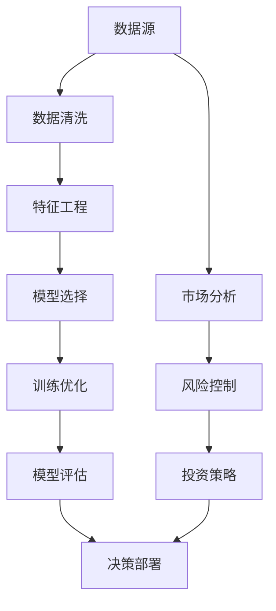

                 

# 洞察力与投资决策：市场机会的识别能力

> 关键词：
1. 洞察力
2. 投资决策
3. 市场机会
4. 数据挖掘
5. 预测建模
6. 金融科技
7. 算法优化

## 1. 背景介绍

### 1.1 问题由来
随着金融市场的不断发展和数字化转型，投资者面临的数据量和信息维度急剧增长，如何从中提取有价值的洞察力，成为一项极具挑战性的任务。传统的投资决策依赖于分析师的经验和直觉，但这种基于定性分析的方法往往带有主观性和局限性。利用先进的机器学习算法和大数据技术，可以从海量市场数据中挖掘出潜在的投资机会，提供更为客观、精确的量化决策支持。

### 1.2 问题核心关键点
洞察力与投资决策的关键在于如何高效地从市场数据中识别出有价值的信号，并结合历史数据和市场趋势进行预测建模。其中，核心问题包括：
1. 如何处理高维、非结构化的市场数据？
2. 如何在多维度特征中提取重要的统计量与特征？
3. 如何利用历史数据构建有效的预测模型？
4. 如何平衡模型复杂度与解释性？
5. 如何在市场变化时保持模型的稳定性和鲁棒性？

### 1.3 问题研究意义
提升市场机会的识别能力，对于投资者、基金经理和金融机构具有重要意义：

1. 提高投资回报率：通过精准的市场分析，实现对潜在投资机会的及时把握，从而提升投资组合的收益率。
2. 降低风险敞口：利用洞察力识别市场的转折点，避免因信息不对称导致的投资决策失误。
3. 增强决策效率：自动化、精确化的分析流程，减轻人力成本，提升决策效率。
4. 促进市场透明度：基于数据驱动的分析方法，促进市场信息共享和透明度提升。
5. 驱动金融科技发展：为金融科技产品（如智能投顾、量化交易等）提供技术支撑，推动金融服务的数字化转型。

## 2. 核心概念与联系

### 2.1 核心概念概述

为了深入理解市场机会的识别过程，需要涉及以下几个核心概念：

- **洞察力**：指从大量数据中提取有价值信息的能力。在金融投资中，洞察力涉及识别市场趋势、预测股票价格、分析财务指标等方面。
- **投资决策**：指在分析市场数据和历史趋势的基础上，做出买入、卖出或持有的决策。
- **市场机会**：指市场提供的、未被充分利用的投资机会。例如，股票低估、行业增长前景等。
- **数据挖掘**：从原始数据中挖掘出隐含的有价值信息的过程，常用的技术包括聚类分析、关联规则学习等。
- **预测建模**：使用历史数据构建模型，预测未来市场趋势和投资机会。常用的技术包括回归分析、分类算法等。
- **金融科技**：利用人工智能、大数据等技术，提升金融服务的效率和质量，包括智能投顾、量化交易、风险管理等。

这些概念之间存在紧密联系：通过数据挖掘和预测建模，可以提升对市场机会的洞察力，从而辅助投资者做出更为科学合理的投资决策，推动金融科技的发展。

### 2.2 核心概念原理和架构的 Mermaid 流程图



这个流程图展示了从数据采集到投资决策的完整过程，各个环节相互依存、相互促进。

## 3. 核心算法原理 & 具体操作步骤

### 3.1 算法原理概述

洞察力与投资决策的核心算法主要分为两个部分：数据挖掘和预测建模。

#### 3.1.1 数据挖掘

数据挖掘的目的是从大量的市场数据中发现隐含的模式和关系。常用的数据挖掘算法包括：

1. **聚类分析**：将数据分为若干群组，识别相似性和模式。例如，K-means算法常用于客户分群。
2. **关联规则学习**：发现数据项之间的关联关系，常用于购物篮分析。
3. **异常检测**：识别数据集中的异常点或异常行为，如欺诈检测。

#### 3.1.2 预测建模

预测建模的目的是基于历史数据构建模型，预测未来的市场变化。常用的预测建模算法包括：

1. **回归分析**：预测连续变量的值，如房价预测。
2. **时间序列分析**：基于时间序列数据预测未来趋势，如股票价格预测。
3. **分类算法**：预测离散变量的值，如股票上涨与否。
4. **深度学习**：构建复杂非线性模型，如图神经网络，进行精准预测。

### 3.2 算法步骤详解

洞察力与投资决策的算法流程主要包括以下几个步骤：

**Step 1: 数据收集与预处理**

1. 从市场数据源收集原始数据，包括股票价格、交易量、财务报表等。
2. 对数据进行清洗、去重、填充缺失值等预处理操作，确保数据质量。

**Step 2: 特征工程**

1. 从原始数据中提取有用的特征，如移动平均、技术指标、财务指标等。
2. 对特征进行编码和标准化，便于算法处理。

**Step 3: 模型选择与训练**

1. 选择适合的预测模型，如线性回归、随机森林、神经网络等。
2. 使用历史数据训练模型，调整超参数。

**Step 4: 模型评估与优化**

1. 在验证集上评估模型性能，使用交叉验证、ROC曲线等方法。
2. 根据评估结果，调整模型参数，优化模型性能。

**Step 5: 决策部署**

1. 将优化后的模型部署到实际投资决策中，实时获取市场数据进行预测。
2. 结合风险控制策略，做出投资决策。

### 3.3 算法优缺点

洞察力与投资决策的算法具有以下优点：

1. 自动化处理海量数据：算法可以处理大规模数据集，大幅提升数据分析效率。
2. 精确预测市场趋势：基于历史数据的模型能够捕捉到复杂关系，提供精准的预测结果。
3. 动态调整策略：利用实时的市场数据，动态调整投资策略，提高决策灵活性。
4. 降低人为因素干扰：减少分析师主观判断，提供客观的决策依据。

但算法也存在以下缺点：

1. 数据依赖性强：模型效果依赖于数据的质量和代表性。
2. 模型复杂度高：复杂的模型可能导致解释性差，难以理解。
3. 过度拟合风险：过多的特征和复杂模型容易过拟合，泛化性能差。
4. 需要持续更新：市场不断变化，模型需要定期更新以保持准确性。

### 3.4 算法应用领域

洞察力与投资决策的算法广泛应用于以下领域：

1. **量化交易**：使用算法进行高频交易，实现更快速的决策和执行。
2. **智能投顾**：通过算法分析客户风险偏好和市场机会，提供个性化投资建议。
3. **风险管理**：利用算法进行风险评估和控制，避免损失。
4. **市场分析**：利用算法识别市场热点和趋势，辅助投资决策。
5. **客户关系管理**：通过数据分析了解客户行为，提升客户满意度和忠诚度。
6. **反欺诈检测**：使用算法检测和防范金融欺诈行为。

这些应用场景展示了洞察力与投资决策算法的广泛适用性和巨大潜力。

## 4. 数学模型和公式 & 详细讲解 & 举例说明

### 4.1 数学模型构建

在本节中，我们将以回归分析为例，构建一个简单的投资决策模型。假设市场数据 $D = \{(x_i, y_i)\}_{i=1}^N$，其中 $x_i$ 为历史股票价格，$y_i$ 为未来的价格预测。

我们希望构建一个线性回归模型，形式如下：

$$
y = \beta_0 + \beta_1x + \epsilon
$$

其中 $\beta_0$ 为截距，$\beta_1$ 为斜率，$\epsilon$ 为误差项。

### 4.2 公式推导过程

线性回归的优化目标是最小化预测误差，即：

$$
\min_{\beta_0, \beta_1} \sum_{i=1}^N (y_i - (\beta_0 + \beta_1x_i))^2
$$

根据梯度下降法，求解 $\beta_0$ 和 $\beta_1$，具体推导如下：

$$
\nabla_{\beta_0} \mathcal{L}(\beta_0, \beta_1) = -2\sum_{i=1}^N (y_i - (\beta_0 + \beta_1x_i))
$$

$$
\nabla_{\beta_1} \mathcal{L}(\beta_0, \beta_1) = -2\sum_{i=1}^N (y_i - (\beta_0 + \beta_1x_i))x_i
$$

将这些梯度代入优化目标，求解 $\beta_0$ 和 $\beta_1$，得到：

$$
\beta_0 = \frac{\sum_{i=1}^N (y_i - \hat{y}_i)}{N}
$$

$$
\beta_1 = \frac{\sum_{i=1}^N (y_i - \hat{y}_i)x_i}{\sum_{i=1}^N (x_i - \bar{x})^2}
$$

其中 $\hat{y}_i = \beta_0 + \beta_1x_i$ 为预测值，$\bar{x}$ 为 $x_i$ 的均值。

### 4.3 案例分析与讲解

假设我们有一组历史股票价格数据 $D = \{(x_i, y_i)\}_{i=1}^N$，其中 $x_i$ 为每日收盘价，$y_i$ 为下一日的收盘价。使用线性回归模型进行预测，步骤如下：

1. 数据预处理：对价格数据进行清洗、去重和标准化处理。
2. 特征提取：提取每日收盘价的移动平均值、波动率等特征。
3. 模型训练：使用历史数据 $D$ 训练线性回归模型，求解 $\beta_0$ 和 $\beta_1$。
4. 模型评估：在验证集上评估模型性能，计算均方误差（MSE）和决定系数（R²）。
5. 决策部署：实时获取市场数据，使用模型进行价格预测，结合风险控制策略，做出投资决策。

例如，假设我们使用历史数据 $D = \{(x_i, y_i)\}_{i=1}^{1000}$ 训练线性回归模型，得到 $\beta_0 = 50$，$\beta_1 = 0.1$。现在获取到实时市场数据 $x_t$，预测下一日的价格 $\hat{y}_t = \beta_0 + \beta_1x_t$，并进行投资决策。

## 5. 项目实践：代码实例和详细解释说明

### 5.1 开发环境搭建

在进行洞察力与投资决策的项目实践前，需要先搭建好开发环境。以下是使用Python进行Pandas和Scikit-learn开发的Python环境配置流程：

1. 安装Anaconda：从官网下载并安装Anaconda，用于创建独立的Python环境。

2. 创建并激活虚拟环境：
```bash
conda create -n finance-env python=3.8 
conda activate finance-env
```

3. 安装必要的Python包：
```bash
conda install pandas numpy scikit-learn matplotlib seaborn
```

4. 安装Jupyter Notebook：
```bash
conda install jupyterlab
```

完成上述步骤后，即可在`finance-env`环境中开始项目实践。

### 5.2 源代码详细实现

我们以线性回归为例，给出使用Pandas和Scikit-learn进行股票价格预测的Python代码实现。

首先，导入所需的Python包：

```python
import pandas as pd
import numpy as np
from sklearn.linear_model import LinearRegression
from sklearn.metrics import mean_squared_error, r2_score
import matplotlib.pyplot as plt
```

然后，准备数据集：

```python
# 读取历史数据集
data = pd.read_csv('stock_prices.csv')

# 数据预处理
data['Date'] = pd.to_datetime(data['Date'])
data.set_index('Date', inplace=True)
data = data.resample('D').mean().dropna()

# 定义特征和目标变量
features = ['Open', 'High', 'Low', 'Close']
target = 'Close'

# 拆分数据集为训练集和测试集
train_data = data[:-30]
test_data = data[-30:]
```

接着，训练线性回归模型：

```python
# 将数据转换为Numpy数组
X_train = np.array(train_data[features])
y_train = np.array(train_data[target])

# 训练模型
model = LinearRegression()
model.fit(X_train, y_train)
```

最后，评估模型并进行预测：

```python
# 计算模型在测试集上的性能
X_test = np.array(test_data[features])
y_pred = model.predict(X_test)
mse = mean_squared_error(y_test, y_pred)
r2 = r2_score(y_test, y_pred)

# 输出评估结果
print(f"MSE: {mse}, R²: {r2}")

# 进行实时预测
real_time_price = 100  # 假设获取到的实时价格为100
real_time_price = np.array([real_time_price]).reshape(-1, 1)
predicted_price = model.predict(real_time_price)
print(f"Predicted Price: {predicted_price}")
```

### 5.3 代码解读与分析

让我们再详细解读一下关键代码的实现细节：

**读取数据集**：
- `pd.read_csv('stock_prices.csv')`：读取包含股票价格历史数据的CSV文件。

**数据预处理**：
- `pd.to_datetime(data['Date'])`：将日期列转换为Pandas的datetime对象，方便时间序列处理。
- `data.set_index('Date', inplace=True)`：设置日期列为索引。
- `data.resample('D').mean().dropna()`：对数据进行每日均值处理，并去掉NaN值。

**特征和目标变量**：
- `features`：定义包括开盘价、最高价、最低价、收盘价等特征。
- `target`：定义收盘价为预测目标变量。

**模型训练**：
- `LinearRegression()`：创建线性回归模型。
- `model.fit(X_train, y_train)`：使用训练集训练模型。

**模型评估**：
- `mean_squared_error(y_test, y_pred)`：计算预测误差的平方和，即均方误差。
- `r2_score(y_test, y_pred)`：计算决定系数，衡量模型对数据的拟合程度。

**实时预测**：
- `real_time_price = np.array([real_time_price]).reshape(-1, 1)`：将实时价格转换为Numpy数组，并进行reshape操作。
- `predicted_price = model.predict(real_time_price)`：使用模型进行预测。

通过以上步骤，可以构建一个简单的线性回归模型，进行股票价格预测。当然，实际应用中需要考虑更多的因素，如市场情绪、政策变化等，以提升模型的准确性和稳定性。

## 6. 实际应用场景

### 6.1 智能投顾系统

智能投顾系统利用洞察力与投资决策的算法，能够根据客户的风险偏好和市场数据，自动提供个性化的投资建议。智能投顾系统通过持续学习，不断优化算法模型，为客户提供更为精准和及时的投资建议。

例如，智能投顾系统可以根据客户的资产配置需求，自动推荐股票、基金等投资组合。结合市场分析结果，系统可以实时调整投资策略，确保客户资产稳健增值。

### 6.2 量化交易平台

量化交易平台利用算法进行高频交易，利用洞察力与投资决策的算法，能够在瞬间做出买卖决策。量化交易平台通过对海量市场数据的分析，发现价格波动和交易机会，利用自动化交易策略，实现快速且低成本的交易。

例如，量化交易平台可以实时分析市场数据，检测股票价格异常波动，自动下达买卖指令，实现自动套利。通过智能算法，量化交易平台可以在短时间内完成大量交易，大幅提升交易效率和收益。

### 6.3 风险管理系统

风险管理系统通过洞察力与投资决策的算法，对投资组合进行实时监控和风险评估。系统利用市场数据，动态调整风险敞口，确保投资组合在可控风险内稳健增长。

例如，风险管理系统可以实时监控市场波动，识别潜在的市场风险，自动调整资产配置，确保投资组合的稳定性。系统可以根据市场变化，动态调整投资策略，避免因市场波动导致的损失。

## 7. 工具和资源推荐

### 7.1 学习资源推荐

为了帮助开发者系统掌握洞察力与投资决策的技术基础和实践技巧，这里推荐一些优质的学习资源：

1. 《Python数据科学手册》：一本全面的数据科学入门书籍，介绍了Pandas、NumPy、Scikit-learn等数据处理和机器学习工具的使用方法。
2. 《机器学习实战》：一本实战导向的机器学习入门书籍，通过具体案例介绍各种机器学习算法的应用。
3. 《金融市场分析》：一本金融市场分析的经典教材，涵盖了市场数据处理、技术分析、基本分析等内容。
4. 《量化交易模型设计》：一本介绍量化交易模型的实用书籍，涵盖了量化交易策略、算法优化等内容。
5. Kaggle：一个数据科学竞赛平台，提供大量开源数据集和实战项目，帮助开发者提升技能。

通过对这些资源的学习实践，相信你一定能够快速掌握洞察力与投资决策的精髓，并用于解决实际的投资决策问题。

### 7.2 开发工具推荐

高效的开发离不开优秀的工具支持。以下是几款用于洞察力与投资决策开发的常用工具：

1. Python：灵活的脚本语言，适合快速迭代研究和数据分析。Pandas、NumPy、Scikit-learn等库提供了强大的数据处理和机器学习功能。
2. Jupyter Notebook：交互式开发环境，支持实时展示代码输出，方便调试和分享。
3. Tableau：数据可视化工具，可以轻松创建交互式数据图表，帮助理解数据特征和趋势。
4. Alpaca：量化交易平台，提供API接口，方便进行实盘交易和回测。
5. Backtrader：量化交易回测工具，支持多种交易策略和算法优化。

合理利用这些工具，可以显著提升洞察力与投资决策的开发效率，加快创新迭代的步伐。

### 7.3 相关论文推荐

洞察力与投资决策的研究源于学界的持续研究。以下是几篇奠基性的相关论文，推荐阅读：

1. 《金融数据挖掘与统计学习》：介绍了金融市场数据的挖掘方法和统计学习技术。
2. 《金融市场预测》：研究了金融市场的预测模型和技术，包括时间序列分析、机器学习等。
3. 《算法交易》：介绍了量化交易的基本原理和算法优化方法。
4. 《金融风险管理》：研究了金融风险的评估和管理方法，包括风险度量、风险控制等。
5. 《金融市场行为分析》：研究了市场主体的行为模式和市场情绪，揭示了市场非理性行为和驱动因素。

这些论文代表了大语言模型微调技术的发展脉络。通过学习这些前沿成果，可以帮助研究者把握学科前进方向，激发更多的创新灵感。

## 8. 总结：未来发展趋势与挑战

### 8.1 总结

本文对洞察力与投资决策的核心算法进行了全面系统的介绍。首先阐述了洞察力与投资决策的研究背景和意义，明确了市场机会识别在金融投资中的重要价值。其次，从原理到实践，详细讲解了洞察力与投资决策的算法流程和关键步骤，给出了项目开发的完整代码实例。同时，本文还广泛探讨了洞察力与投资决策在智能投顾、量化交易、风险管理等多个领域的应用前景，展示了洞察力与投资决策算法的巨大潜力。此外，本文精选了洞察力与投资决策的学习资源，力求为读者提供全方位的技术指引。

通过本文的系统梳理，可以看到，洞察力与投资决策的算法正逐步成为金融投资决策的重要工具，显著提升了投资决策的科学性和准确性。未来，伴随数据量和算力资源的不断增长，洞察力与投资决策算法将发挥更加重要的作用，为金融投资带来革命性的变革。

### 8.2 未来发展趋势

展望未来，洞察力与投资决策的算法将呈现以下几个发展趋势：

1. **深度学习与多模态融合**：未来的模型将利用深度学习技术，提升特征提取和预测精度。同时，结合文本、图像、语音等多模态数据，提升模型的整体表现。
2. **实时处理与自动化交易**：系统将实现实时数据处理和交易执行，利用洞察力与投资决策算法，实时监控市场变化，自动调整投资策略。
3. **模型集成与知识图谱**：系统将集成多个算法模型，构建综合分析框架。同时，引入知识图谱技术，增强模型的解释性和鲁棒性。
4. **风险控制与合规管理**：系统将加入风险控制机制，识别和规避市场风险。同时，引入合规管理功能，确保投资行为符合法律法规。
5. **个性化推荐与客户服务**：系统将结合洞察力与投资决策算法，提供个性化投资建议和客户服务。

以上趋势凸显了洞察力与投资决策算法的广阔前景。这些方向的探索发展，必将进一步提升投资决策的智能化水平，为投资者带来更高的投资回报和更低的风险敞口。

### 8.3 面临的挑战

尽管洞察力与投资决策算法已经取得了瞩目成就，但在迈向更加智能化、普适化应用的过程中，它仍面临着诸多挑战：

1. **数据质量问题**：市场数据存在噪声和缺失，数据清洗和处理难度较大。
2. **算法复杂度**：模型复杂度越高，训练和推理时间越长，计算资源消耗大。
3. **模型可解释性**：复杂的深度学习模型难以解释，缺乏透明性。
4. **市场变化适应性**：模型需要及时更新以适应市场变化，训练和部署成本高。
5. **风险控制挑战**：市场波动和突发事件可能带来巨大风险，需要模型具备高度鲁棒性。
6. **法律法规合规性**：金融投资涉及严格监管，系统需要遵守相关法律法规。

面对这些挑战，未来的研究需要在数据处理、算法优化、模型解释性、风险控制等方面进行更多探索，以进一步提升洞察力与投资决策算法的实用性和可靠性。

### 8.4 研究展望

面对洞察力与投资决策算法面临的挑战，未来的研究需要在以下几个方面寻求新的突破：

1. **数据增强与预处理**：探索数据增强技术，提高数据质量。研究高效的预处理算法，降低数据处理成本。
2. **模型压缩与优化**：开发轻量级模型和高效计算方法，提升模型的实时处理能力。
3. **解释性增强**：引入可解释性技术，如LIME、SHAP等，增强模型的透明度和可信度。
4. **模型融合与多任务学习**：结合多种算法模型，构建综合分析框架，提升模型的鲁棒性和泛化能力。
5. **自动化与持续学习**：利用自动化技术和持续学习算法，实时更新模型，确保模型具备高度适应性。
6. **法规合规与伦理考量**：研究合规管理技术，确保系统符合法律法规和伦理标准。

这些研究方向的探索，必将引领洞察力与投资决策算法迈向更高的台阶，为金融投资带来更加智能、安全和可靠的支持。未来，大语言模型微调技术还需要与其他人工智能技术进行更深入的融合，如知识表示、因果推理、强化学习等，多路径协同发力，共同推动金融投资的数字化转型。只有勇于创新、敢于突破，才能不断拓展洞察力与投资决策算法的边界，让智能技术更好地造福金融投资领域。

## 9. 附录：常见问题与解答

**Q1：如何处理市场数据中的噪声和缺失值？**

A: 处理市场数据中的噪声和缺失值，可以使用以下方法：

1. 噪声处理：利用滤波算法（如中值滤波、低通滤波等）去除噪声。
2. 数据插补：利用均值插补、KNN插补等方法填补缺失值。
3. 异常检测：使用统计方法或机器学习算法识别并处理异常值。
4. 数据平滑：利用移动平均、指数平滑等方法平滑数据，降低噪声影响。

这些方法需要根据具体数据情况选择，以确保处理后数据的有效性和可靠性。

**Q2：如何选择适当的特征进行建模？**

A: 选择适当的特征进行建模，需要考虑以下几个因素：

1. 特征的相关性：选择与目标变量高度相关的特征，避免冗余。
2. 特征的可解释性：选择容易理解和解释的特征，便于模型解释。
3. 特征的稳定性：选择稳定且不易受外界干扰的特征。
4. 特征的多样性：选择包含多种特征，提升模型的泛化能力。

通常，可以先通过领域知识和数据探索选择初步的特征集合，再利用特征选择算法（如Lasso、PCA等）优化特征选择。

**Q3：如何进行模型评估和优化？**

A: 进行模型评估和优化，可以采取以下步骤：

1. 分割数据集：将数据集分为训练集、验证集和测试集，避免过拟合。
2. 选择评估指标：根据任务特点选择适当的评估指标，如均方误差、准确率、召回率等。
3. 交叉验证：使用交叉验证方法，评估模型性能，优化模型参数。
4. 模型调整：根据验证集结果调整模型参数，提升模型性能。
5. 性能监控：实时监控模型性能，及时发现并解决性能下降问题。

通过以上步骤，可以确保模型的泛化能力和稳定性，提升投资决策的准确性和可靠性。

**Q4：如何实现自动化交易？**

A: 实现自动化交易，需要构建自动化交易系统，步骤如下：

1. 系统设计：设计交易策略和算法，选择适合的量化交易工具和平台。
2. 数据接口：获取实时的市场数据，并集成到交易系统中。
3. 实时处理：利用洞察力与投资决策算法，实时分析市场数据，生成交易信号。
4. 策略执行：根据交易信号，自动下达交易指令，执行买卖操作。
5. 风险控制：设置风险阈值，实时监控交易风险，避免超额损失。

通过构建自动化交易系统，可以大幅提高交易效率，降低交易成本，提升收益。

**Q5：如何构建智能投顾系统？**

A: 构建智能投顾系统，需要考虑以下几个关键点：

1. 客户画像：利用洞察力与投资决策算法，分析客户风险偏好、投资目标和历史交易数据，建立客户画像。
2. 投资建议：基于客户画像和市场数据，生成个性化的投资建议。
3. 动态调整：利用实时市场数据，动态调整投资组合和策略，确保稳健增长。
4. 用户体验：提供友好的用户界面，方便客户查看投资建议和交易记录。
5. 合规管理：确保系统符合法律法规，提供合规性的投资建议和交易记录。

通过结合洞察力与投资决策算法和用户体验设计，可以构建高效的智能投顾系统，提升客户满意度和投资收益。

---

作者：禅与计算机程序设计艺术 / Zen and the Art of Computer Programming

