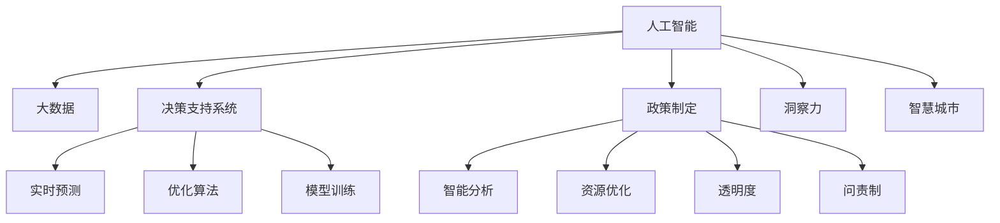

                 

# 洞察力与政策制定：社会治理的智慧

> 关键词：政策制定, 社会治理, 数据分析, 洞察力, 机器学习, 决策支持, 智慧城市

## 1. 背景介绍

### 1.1 问题由来
在现代社会，治理复杂性和政策制定难度不断增大。传统基于经验和直觉的政策制定方法难以满足当前日益多样化和动态化的社会需求。而新技术的飞速发展，如大数据、人工智能和机器学习，为治理和社会管理提供了全新的视角和方法。将人工智能技术应用于政策制定，不仅可以提升政策的科学性和精准度，还能有效应对治理挑战。本文将从背景和现状出发，探讨人工智能在政策制定中的应用。

### 1.2 问题核心关键点
人工智能在政策制定中的应用主要体现在以下几个方面：
1. **数据驱动决策**：通过大数据和机器学习算法，从海量数据中挖掘出有价值的信息，支持决策者做出更加精准的决策。
2. **洞察力增强**：利用机器学习模型进行预测和分析，帮助政策制定者发现问题，提出解决方案。
3. **资源优化**：通过智能优化算法，在资源配置和管理方面提供科学建议，提升治理效率。
4. **透明度和问责制**：通过算法透明性和可解释性，提升政策制定的透明度，增强问责制。
5. **弹性适应性**：基于模型进行实时监测和预测，使政策能够动态适应变化的环境。

## 2. 核心概念与联系

### 2.1 核心概念概述

为更好地理解人工智能在政策制定中的应用，本节将介绍几个关键概念及其相互关系：

- **人工智能（AI）**：利用算法和计算能力模拟和扩展人类智能的技术体系，涵盖机器学习、深度学习、自然语言处理等众多领域。
- **大数据**：指大规模、复杂、实时生成的数据集，通过数据挖掘和分析，提取有价值的信息。
- **政策制定**：政府或组织为解决社会问题或实现特定目标，制定并实施的一系列行动和规则。
- **洞察力**：基于数据分析和技术手段，揭示事物内在规律和未来趋势的能力。
- **决策支持系统（DSS）**：通过技术手段辅助决策者进行科学决策，提升决策质量和效率的系统。
- **智慧城市**：结合信息和通信技术（ICT）、互联网技术（IoT）和大数据，实现城市管理智能化和高效化。

这些概念之间的逻辑关系可以通过以下Mermaid流程图来展示：



这个流程图展示了人工智能在社会治理中各个关键环节的应用：

1. 人工智能从大数据中挖掘洞察力，辅助决策支持系统进行实时预测和优化。
2. 决策支持系统通过模型训练和智能分析，为政策制定提供科学建议。
3. 政策制定通过资源优化和透明度提升，实现高效管理。
4. 智慧城市将人工智能技术应用于城市治理的各个方面，提升管理水平。

## 3. 核心算法原理 & 具体操作步骤
### 3.1 算法原理概述

人工智能在政策制定中的应用，主要基于以下核心算法原理：

1. **数据预处理**：清洗、整理和标准化数据，去除噪声和冗余，确保数据质量。
2. **特征工程**：提取和构造有意义的特征，为机器学习模型提供输入。
3. **模型训练**：选择和训练合适的机器学习模型，如决策树、支持向量机、深度神经网络等。
4. **洞察力挖掘**：通过模型预测和分析，揭示数据背后的规律和趋势。
5. **政策优化**：基于洞察力，提出科学合理的政策建议和方案。
6. **模拟和评估**：使用仿真和评估工具，验证政策效果，优化政策方案。

### 3.2 算法步骤详解

以下是基于人工智能的政策制定过程详细步骤：

**Step 1: 数据收集与预处理**
- 收集相关的历史数据、统计数据和实时数据。
- 清洗数据，去除无效或噪声数据。
- 标准化数据格式，保证一致性。

**Step 2: 特征提取与选择**
- 基于领域知识和业务需求，提取关键特征。
- 使用特征选择算法，选择最具代表性的特征。

**Step 3: 模型训练与验证**
- 选择或设计合适的机器学习模型。
- 使用训练数据集训练模型，调整模型参数。
- 使用验证数据集评估模型性能，防止过拟合。

**Step 4: 洞察力挖掘**
- 使用模型对历史数据进行预测和分析，发现规律和趋势。
- 提取有价值的信息，为政策制定提供依据。

**Step 5: 政策建议生成**
- 基于洞察力，生成科学合理的政策建议。
- 考虑多方面的影响因素，确保政策的可行性和普适性。

**Step 6: 模拟与评估**
- 使用仿真工具，模拟政策的实施效果。
- 通过评估工具，验证政策的实际效果和影响。
- 根据评估结果调整政策方案，确保效果最优。

### 3.3 算法优缺点

人工智能在政策制定中的应用具有以下优点：
1. 数据驱动：基于大数据和机器学习模型，提供科学决策依据。
2. 提高效率：自动化的数据分析和预测，显著提升政策制定效率。
3. 精确度提升：精准的预测和分析，减少主观偏见。
4. 透明度增强：算法透明性和可解释性，提升决策过程的透明度。
5. 问责制加强：基于数据的决策过程，增强政策制定的可追溯性和问责制。

同时，也存在一些局限性：
1. 数据质量依赖：模型的结果高度依赖于数据的质量和完整性。
2. 模型偏见：机器学习模型可能会继承数据中的偏见，影响政策的公平性。
3. 复杂度增加：大规模数据分析和模型训练，增加了决策过程的复杂度。
4. 解释性不足：黑盒模型难以解释其内部决策过程。
5. 伦理和安全问题：算法决策可能引发伦理和安全问题，需要额外监管。

尽管存在这些局限性，但人工智能在政策制定中的应用仍具有广阔前景。未来研究将更多关注如何提高模型的可解释性和鲁棒性，确保决策的公平性和安全性。

### 3.4 算法应用领域

人工智能在政策制定中的应用领域广泛，主要包括以下几个方面：

1. **公共卫生**：预测疾病传播趋势，优化资源配置，提升公共卫生管理水平。
2. **教育**：分析学生数据，制定个性化教育方案，提升教育质量。
3. **交通管理**：优化交通流，减少拥堵，提高交通效率。
4. **环境治理**：监测环境指标，提出环保政策，保护生态环境。
5. **社会治安**：预测犯罪趋势，优化警力部署，提升社会治安水平。
6. **经济发展**：分析经济数据，制定经济政策，促进经济增长。
7. **城市规划**：基于数据分析，优化城市规划，提升城市管理水平。

这些领域中，人工智能技术的广泛应用，已经显著提升了政策的科学性和决策效率，成为治理现代化不可或缺的一部分。

## 4. 数学模型和公式 & 详细讲解  
### 4.1 数学模型构建

本节将使用数学语言对人工智能在政策制定中的应用进行更加严格的刻画。

记政策制定问题为 $P=\{D,O,N\}$，其中 $D$ 表示数据集，$O$ 表示目标函数，$N$ 表示决策变量。假设政策制定者希望最大化目标函数 $O$，则优化目标为：

$$
\mathop{\arg\min}_{\theta} O(D,\theta)
$$

其中 $\theta$ 为模型参数，$D$ 为输入数据集。通过选择合适的机器学习模型，如线性回归、逻辑回归、深度神经网络等，构建决策支持系统。

### 4.2 公式推导过程

以线性回归模型为例，推导目标函数及其梯度计算公式：

假设模型输出为 $\hat{y} = \theta_0 + \theta_1 x_1 + \theta_2 x_2$，其中 $\theta_0$ 为截距，$\theta_1, \theta_2$ 为系数。目标函数为均方误差损失：

$$
L(\theta) = \frac{1}{N} \sum_{i=1}^N (\hat{y}_i - y_i)^2
$$

对 $\theta$ 求导，得：

$$
\frac{\partial L(\theta)}{\partial \theta} = \frac{2}{N} \sum_{i=1}^N (\hat{y}_i - y_i) x_i
$$

使用梯度下降等优化算法，迭代更新模型参数 $\theta$，最小化目标函数 $L(\theta)$。

### 4.3 案例分析与讲解

以下通过一个简单的公共卫生案例，解释机器学习模型在政策制定中的应用。

假设某城市希望通过模型预测疫情爆发风险，并据此采取防控措施。收集历史疫情数据，包括病例数、感染率、天气等信息。数据预处理后，选择关键特征 $x_1=$ 病例数，$x_2=$ 天气情况。构建线性回归模型，目标函数为预测准确率 $O(D,\theta) = \frac{1}{N} \sum_{i=1}^N \mathbf{1}[\hat{y}_i = y_i]$，其中 $\mathbf{1}$ 为指示函数。

使用训练数据集训练模型，得到最优参数 $\theta^*$。利用测试集验证模型，得预测准确率为 85%。根据模型结果，政策制定者可以针对高风险区域采取防控措施，降低疫情爆发风险。

## 5. 项目实践：代码实例和详细解释说明
### 5.1 开发环境搭建

在进行人工智能政策制定实践前，我们需要准备好开发环境。以下是使用Python进行TensorFlow开发的Python环境配置流程：

1. 安装Anaconda：从官网下载并安装Anaconda，用于创建独立的Python环境。

2. 创建并激活虚拟环境：
```bash
conda create -n tf-env python=3.8 
conda activate tf-env
```

3. 安装TensorFlow：根据CUDA版本，从官网获取对应的安装命令。例如：
```bash
conda install tensorflow
```

4. 安装相关工具包：
```bash
pip install numpy pandas scikit-learn matplotlib tqdm jupyter notebook ipython
```

完成上述步骤后，即可在`tf-env`环境中开始项目实践。

### 5.2 源代码详细实现

下面以公共卫生案例为例，给出使用TensorFlow进行线性回归模型训练和评估的代码实现。

首先，定义模型和优化器：

```python
import tensorflow as tf
import numpy as np

# 定义线性回归模型
def linear_regression_model(X, y):
    model = tf.keras.Sequential([
        tf.keras.layers.Dense(1, input_dim=X.shape[1])
    ])
    return model

# 定义优化器
optimizer = tf.keras.optimizers.Adam(learning_rate=0.01)
```

接着，定义训练和评估函数：

```python
# 定义训练函数
def train_model(model, X_train, y_train, epochs=100):
    model.compile(loss='mse', optimizer=optimizer)
    history = model.fit(X_train, y_train, epochs=epochs, verbose=0)
    return history

# 定义评估函数
def evaluate_model(model, X_test, y_test):
    loss = model.evaluate(X_test, y_test)
    return loss
```

最后，启动训练流程并在测试集上评估：

```python
# 加载数据
X_train = np.load('X_train.npy')
y_train = np.load('y_train.npy')
X_test = np.load('X_test.npy')
y_test = np.load('y_test.npy')

# 构建模型
model = linear_regression_model(X_train, y_train)

# 训练模型
history = train_model(model, X_train, y_train)

# 评估模型
loss = evaluate_model(model, X_test, y_test)
print('Test loss:', loss)
```

以上就是使用TensorFlow进行线性回归模型训练和评估的完整代码实现。可以看到，TensorFlow提供了便捷的接口和丰富的工具，使得模型构建、训练和评估变得简洁高效。

### 5.3 代码解读与分析

让我们再详细解读一下关键代码的实现细节：

**linear_regression_model函数**：
- 定义了一个简单的线性回归模型，包含一个全连接层，输出维度为1。

**train_model函数**：
- 使用交叉熵损失和Adam优化器，对模型进行训练。
- 记录训练过程中的损失值，返回训练历史。

**evaluate_model函数**：
- 使用模型在测试集上计算损失，评估模型性能。

**训练流程**：
- 加载训练集和测试集数据。
- 构建线性回归模型。
- 使用训练函数训练模型。
- 使用评估函数计算测试集上的损失。

可以看到，TensorFlow提供了丰富的工具和函数，使得模型训练和评估变得简洁高效。开发者可以将更多精力放在模型设计和数据处理上，而不必过多关注底层的实现细节。

当然，工业级的系统实现还需考虑更多因素，如模型的保存和部署、超参数的自动搜索、更灵活的任务适配层等。但核心的模型构建和训练范式基本与此类似。

## 6. 实际应用场景
### 6.1 智能交通管理

基于人工智能的政策制定，可以有效提升交通管理水平，减少拥堵，提高交通效率。具体而言，可以收集交通流量、车辆密度、交通事故等数据，构建交通流量预测模型，辅助政策制定者优化交通信号灯控制、道路建设和维护。

在技术实现上，可以设计合适的特征提取算法，从交通数据中提取关键特征，如车辆类型、行驶速度、路况等。使用机器学习模型进行预测，输出未来交通流量，辅助交通管理者进行决策。对于突发事件，如交通事故、道路施工等，模型还可以进行实时监测和预测，提供及时的应对措施。

### 6.2 精准农业

在农业领域，基于人工智能的政策制定可以帮助农民优化资源使用，提升农业生产效率。具体而言，可以收集土壤、气象、作物生长等数据，构建作物生长预测模型，辅助政策制定者制定科学的种植方案、施肥和灌溉策略。

在技术实现上，可以设计合适的特征提取算法，从气象数据中提取温度、湿度、降雨量等关键特征。使用机器学习模型进行预测，输出作物生长状态，辅助农民进行决策。对于病虫害预测、水源管理等，模型还可以进行实时监测和预测，提供及时的应对措施。

### 6.3 环境监测与治理

在环境保护领域，基于人工智能的政策制定可以帮助政府和环保组织制定科学的环境保护政策，提升环境治理效果。具体而言，可以收集环境监测数据，如空气质量、水质、噪音等，构建环境变化预测模型，辅助政策制定者优化环境治理措施。

在技术实现上，可以设计合适的特征提取算法，从监测数据中提取污染物浓度、气象条件等关键特征。使用机器学习模型进行预测，输出环境质量变化趋势，辅助政策制定者进行决策。对于污染事件、自然灾害等，模型还可以进行实时监测和预测，提供及时的应对措施。

### 6.4 未来应用展望

随着人工智能技术的发展，基于政策制定的决策支持系统将更加智能和高效。未来可能的发展趋势包括：

1. **多模态融合**：将不同类型的数据（如文本、图像、声音）进行融合，提升政策制定的全面性和准确性。
2. **跨领域应用**：将政策制定技术应用于更多领域，如医疗、教育、公共安全等，提升各领域的治理水平。
3. **实时决策**：基于实时数据进行动态预测和决策，提升政策响应的速度和效果。
4. **联邦学习**：通过联邦学习技术，保护数据隐私，提升模型性能。
5. **透明度增强**：引入可解释性技术，提升决策过程的透明性和可解释性。

这些趋势将使得人工智能在政策制定中的应用更加广泛和深入，为社会治理提供更加智能和高效的支持。

## 7. 工具和资源推荐
### 7.1 学习资源推荐

为了帮助开发者系统掌握人工智能在政策制定中的应用，这里推荐一些优质的学习资源：

1. TensorFlow官方文档：提供全面的API文档和教程，帮助开发者快速上手TensorFlow。
2. Scikit-learn官方文档：提供丰富的机器学习算法和工具，支持Python和R语言。
3. Kaggle竞赛：提供海量数据集和竞赛平台，帮助开发者练习和应用机器学习技能。
4. Coursera《机器学习》课程：由斯坦福大学提供，涵盖机器学习的基本概念和经典算法。
5. Udacity《人工智能纳米学位》课程：涵盖深度学习、自然语言处理、计算机视觉等前沿话题。

通过对这些资源的学习实践，相信你一定能够快速掌握人工智能在政策制定中的应用，并用于解决实际的治理问题。
###  7.2 开发工具推荐

高效的开发离不开优秀的工具支持。以下是几款用于人工智能政策制定开发的常用工具：

1. TensorFlow：由Google主导开发的开源深度学习框架，生产部署方便，适合大规模工程应用。
2. Scikit-learn：基于Python的开源机器学习库，提供了丰富的算法和工具。
3. Jupyter Notebook：开源的交互式笔记本工具，支持Python、R等语言，方便快速迭代和展示代码。
4. TensorBoard：TensorFlow配套的可视化工具，可实时监测模型训练状态，并提供丰富的图表呈现方式。
5. Weights & Biases：模型训练的实验跟踪工具，可以记录和可视化模型训练过程中的各项指标，方便对比和调优。

合理利用这些工具，可以显著提升人工智能政策制定任务的开发效率，加快创新迭代的步伐。

### 7.3 相关论文推荐

人工智能在政策制定中的应用源于学界的持续研究。以下是几篇奠基性的相关论文，推荐阅读：

1. "Machine Learning for Healthcare Decision Support"（医疗决策支持系统）：探讨机器学习在医疗领域的应用，提升医疗决策的科学性和精准度。
2. "Data Mining and Statistical Learning for Environmental Prediction"（环境预测数据挖掘）：介绍机器学习在环境监测和治理中的应用，提升环境预测和治理的效率。
3. "Intelligent Traffic Management System"（智能交通管理系统）：介绍机器学习在交通管理中的应用，提升交通管理的智能化水平。
4. "A Survey on Data Mining and Statistical Learning for Agricultural Decision Support"（农业决策支持系统）：探讨机器学习在农业领域的应用，提升农业生产效率和资源使用效率。
5. "Artificial Intelligence and Machine Learning in Smart Cities"（智能城市中的AI和机器学习）：介绍机器学习在智慧城市中的应用，提升城市管理的智能化水平。

这些论文代表了大规模人工智能在政策制定中的应用，提供了丰富的理论基础和实践经验。通过学习这些前沿成果，可以帮助研究者把握学科前进方向，激发更多的创新灵感。

## 8. 总结：未来发展趋势与挑战
### 8.1 总结

本文对人工智能在政策制定中的应用进行了全面系统的介绍。首先阐述了人工智能在社会治理中的重要性，明确了其在政策制定中的独特价值。其次，从原理到实践，详细讲解了机器学习在政策制定中的数学模型和具体操作步骤，给出了政策制定任务的完整代码实例。同时，本文还广泛探讨了人工智能在多个领域的应用前景，展示了其广阔的潜力。最后，本文精选了学习资源和开发工具，力求为读者提供全方位的技术指引。

通过本文的系统梳理，可以看到，人工智能在政策制定中的应用将逐渐成为治理现代化不可或缺的一部分，极大地提升决策的科学性和效率。未来，伴随人工智能技术的持续演进，基于数据驱动的治理范式必将深入各行各业，为社会治理带来革命性变革。

### 8.2 未来发展趋势

展望未来，人工智能在政策制定中的应用将呈现以下几个发展趋势：

1. **技术深度融合**：将人工智能技术与更多领域技术进行融合，如物联网、区块链、区块链等，提升治理的全面性和智能化水平。
2. **跨领域应用**：将政策制定技术应用于更多领域，如医疗、教育、公共安全等，提升各领域的治理水平。
3. **实时决策**：基于实时数据进行动态预测和决策，提升政策响应的速度和效果。
4. **联邦学习**：通过联邦学习技术，保护数据隐私，提升模型性能。
5. **透明度增强**：引入可解释性技术，提升决策过程的透明性和可解释性。

这些趋势将使得人工智能在政策制定中的应用更加广泛和深入，为社会治理提供更加智能和高效的支持。

### 8.3 面临的挑战

尽管人工智能在政策制定中的应用已经取得了显著进展，但在迈向更加智能化、普适化应用的过程中，仍面临诸多挑战：

1. **数据质量问题**：数据的完整性、准确性和一致性是模型性能的关键因素，数据质量问题可能影响模型的决策结果。
2. **模型偏见**：机器学习模型可能会继承数据中的偏见，影响政策的公平性。
3. **资源消耗**：大规模数据处理和模型训练需要大量计算资源，可能对系统性能和成本造成影响。
4. **算法透明性**：黑盒模型的决策过程难以解释，可能引发伦理和安全问题。
5. **伦理与安全问题**：算法决策可能引发伦理和安全问题，需要额外监管。

尽管存在这些挑战，但人工智能在政策制定中的应用仍具有广阔前景。未来研究将更多关注如何提高模型的可解释性和鲁棒性，确保决策的公平性和安全性。

### 8.4 研究展望

面对人工智能在政策制定中面临的种种挑战，未来的研究需要在以下几个方面寻求新的突破：

1. **数据质量保障**：探索高质量数据采集和处理技术，确保数据来源的可靠性和数据的完整性。
2. **模型公平性**：设计和使用公平性指标，检测和纠正模型中的偏见，提升政策的公平性。
3. **资源优化**：探索高效的数据处理和模型训练技术，提升系统的性能和效率。
4. **算法透明性**：引入可解释性技术，增强算法的透明性和可解释性，提升决策的可追溯性。
5. **伦理与安全**：设计和使用伦理和安全评估指标，确保算法的伦理性和安全性。

这些研究方向的探索，将推动人工智能在政策制定中的应用更加广泛和深入，为社会治理带来更深远的影响。

## 9. 附录：常见问题与解答

**Q1：人工智能在政策制定中是否需要大量数据？**

A: 人工智能在政策制定中确实需要高质量的数据支持，但数据量和质量是相互依赖的。数据量大有助于提升模型的泛化能力，但数据质量问题（如缺失、噪声等）可能影响模型的决策结果。因此，在数据处理和分析过程中，需要采取有效的数据清洗和预处理技术，确保数据的质量和可靠性。

**Q2：机器学习模型是否容易产生偏见？**

A: 机器学习模型可能会继承数据中的偏见，因此在模型训练和评估过程中，需要引入公平性指标，检测和纠正模型中的偏见，确保政策的公平性和普适性。同时，还需要对数据进行预处理，去除有偏见的样本，确保模型在所有人群中的性能一致。

**Q3：如何提高机器学习模型的可解释性？**

A: 提高机器学习模型的可解释性是当前研究的重要方向。一种常见的做法是通过可视化工具，如Shapley值、LIME等，解释模型的预测过程和决策依据。此外，设计和使用可解释性强的模型，如线性模型、决策树等，也能增强模型的可解释性。

**Q4：人工智能在政策制定中如何应对伦理和安全问题？**

A: 人工智能在政策制定中需要考虑伦理和安全问题，如算法透明度、数据隐私等。设计和使用透明的算法，确保决策过程的透明性和可解释性，可以有效提升系统的信任度和可靠性。同时，对数据进行脱敏处理，确保数据隐私保护，也是保障系统安全的重要措施。

这些问题的答案展示了人工智能在政策制定中面临的多重挑战，同时也提供了可行的解决方案，有助于推动人工智能技术在治理中的应用。

---

作者：禅与计算机程序设计艺术 / Zen and the Art of Computer Programming

