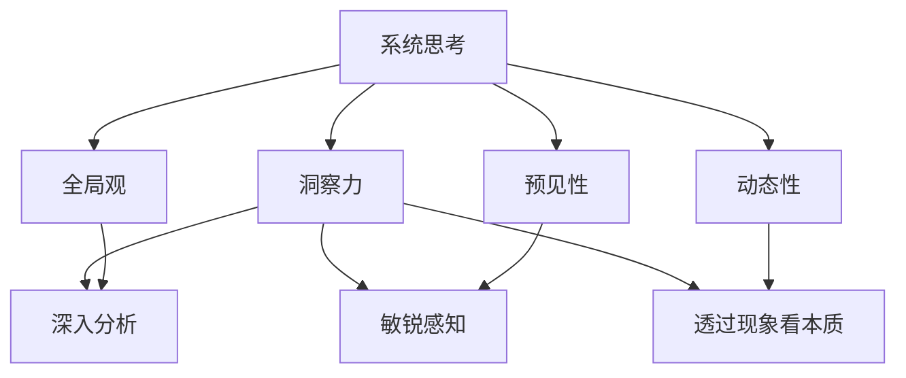
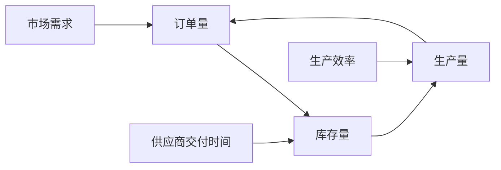

                 

# 洞察力与系统思考：复杂问题解决的关键

> 关键词：洞察力,系统思考,复杂问题解决,系统架构,复杂系统工程

## 1. 背景介绍

在当今信息爆炸、变化多端的数字化时代，企业和组织面临的复杂性问题日益增加。如何高效、系统地解决这些复杂问题，成为业界关注的焦点。复杂的系统问题往往涉及多维度的关联因素，如技术、组织、流程、市场等，要求决策者具备更全面的洞察力和系统思考能力，才能制定有效的解决方案。

系统思考是指从整体上观察和理解系统，识别其内在关系和动态变化，并采取系统化的方式解决问题。洞察力则是在系统思考的基础上，对系统问题进行深入的观察和分析，从而揭示问题的本质和解决路径。本文将探讨系统思考和洞察力的核心概念，并通过具体案例分析，阐述它们在解决复杂问题中的关键作用。

## 2. 核心概念与联系

### 2.1 核心概念概述

系统思考和洞察力是解决复杂问题的两大核心能力，它们相互依存、相互促进，共同构成了解决复杂问题的基础框架。

- **系统思考**：从全局视角出发，识别系统各部分间的交互作用，理解系统整体行为，从而揭示问题的根本原因。系统思考强调系统性、整体性、动态性，要求决策者具备全局观、预见性和互动性。

- **洞察力**：基于系统思考的视角，对系统问题进行深入剖析，揭示问题的本质和内在联系。洞察力要求决策者具备细致观察、深入分析、敏锐感知的能力，能够透过现象看本质，从局部问题中抽丝剥茧，揭示问题的根源。

### 2.2 核心概念原理和架构的 Mermaid 流程图



该图展示了系统思考与洞察力的联系：系统思考提供全局视角，洞察力在此基础上深入分析，揭示问题本质。其中，全局观、动态性和预见性是系统思考的三大关键要素，而深入分析、敏锐感知和透过现象看本质则是洞察力的核心能力。

## 3. 核心算法原理 & 具体操作步骤

### 3.1 算法原理概述

解决复杂问题的系统思考和洞察力方法论，主要包括五步：

1. **定义问题**：明确问题的本质，识别问题的关键因素和边界条件。
2. **建立模型**：根据问题定义，构建系统模型，理解系统各部分间的交互作用。
3. **分析模型**：运用系统思考的框架，分析模型行为，识别关键节点和瓶颈。
4. **解决问题**：根据洞察力分析，制定解决方案，优化系统模型。
5. **实施评估**：实施解决方案，通过评估反馈进一步迭代优化。

### 3.2 算法步骤详解

以一个电子商务网站的用户流失问题为例，进行系统思考和洞察力的应用：

**Step 1: 定义问题**
- 问题定义：“为什么网站用户流失率持续上升？”
- 关键因素：网站性能、用户体验、客户服务、竞争对手等。
- 边界条件：用户流失率、客户满意度、网站流量等。

**Step 2: 建立模型**
- 构建系统模型，包括用户行为、网站功能、客户反馈、市场环境等部分。
- 建立因果关系图，识别用户流失与各因素间的交互作用。

**Step 3: 分析模型**
- 使用系统思考的框架，分析因果关系图，识别关键节点和瓶颈。
- 确定主要因素，如网站加载速度、页面响应时间、用户体验等。

**Step 4: 解决问题**
- 根据洞察力分析，制定解决方案，如优化网站性能、改进用户体验等。
- 实施解决方案，监测用户流失率变化，调整策略。

**Step 5: 实施评估**
- 通过反馈评估解决方案效果，识别未解决的问题。
- 根据评估结果，进一步迭代优化，直到问题得到解决。

### 3.3 算法优缺点

系统思考和洞察力的应用具有以下优点：
- **全局视角**：从整体上观察和理解系统，避免局部优化导致的全局问题。
- **系统性思维**：理解系统各部分间的交互作用，避免孤立看待问题。
- **持续优化**：通过反馈机制，不断迭代优化，提高解决方案的适应性和有效性。

缺点包括：
- **复杂度高**：系统思考涉及多维度的因素，可能需要较长时间进行全面分析。
- **实施难度大**：系统优化的涉及面广，可能需要跨部门协作。
- **数据依赖性**：分析模型的准确性依赖于数据的完整性和准确性。

### 3.4 算法应用领域

系统思考和洞察力方法论在多个领域都有广泛应用，包括但不限于：

- **企业战略规划**：识别企业内部各部门间的交互作用，制定系统化的战略方案。
- **产品设计**：通过系统思考理解用户需求，进行产品迭代优化。
- **供应链管理**：理解供应链各环节的交互作用，优化供应链流程。
- **环境治理**：识别环境问题间的关联，制定综合治理方案。

## 4. 数学模型和公式 & 详细讲解 & 举例说明

### 4.1 数学模型构建

在复杂系统问题中，数学模型是一个重要的工具。常用的数学模型包括系统动力学模型、因果关系图、仿真模型等。以一个简单的供应链管理为例，可以建立如下因果关系图：



其中，市场需求影响订单量，订单量影响库存量，库存量影响生产量，生产量又反馈到订单量。同时，供应商交付时间和生产效率也影响库存量和生产量。

### 4.2 公式推导过程

以供应链管理为例，假设需求量为 $D_t$，库存量为 $I_t$，生产量为 $P_t$，供应商交付时间为 $E_t$，生产效率为 $F_t$，则可以建立如下微分方程：

$$
\frac{dI_t}{dt} = \frac{D_t - P_t}{s} - \frac{I_t}{c}
$$

$$
\frac{dP_t}{dt} = \frac{I_t}{s}
$$

$$
\frac{dE_t}{dt} = -\frac{I_t - D_t}{b} + R_t
$$

$$
\frac{dF_t}{dt} = -\frac{F_t}{k}
$$

其中，$s$ 为库存补给速度，$c$ 为库存消耗速度，$b$ 为供应商交付速度，$R_t$ 为随机因素影响。

通过求解上述微分方程组，可以理解系统各部分间的交互作用，进而制定优化方案。

### 4.3 案例分析与讲解

一个成功的系统思考和洞察力应用案例是Google的PageRank算法。PageRank算法通过建立网站间的链接关系，计算网页的重要性，从而提高搜索引擎的排序精度。

在构建PageRank算法时，首先定义了问题：如何通过网页间的链接关系，计算网页的重要性。然后建立了系统模型，包括网页、链接、重要性值等部分，构建了链接图的因果关系。通过系统思考分析，识别了关键节点（即重要的网页）和瓶颈（即链接稀疏的网页）。最终，制定了通过迭代计算重要性值的解决方案，实现了高效、准确的网页排序。

## 5. 项目实践：代码实例和详细解释说明

### 5.1 开发环境搭建

系统思考和洞察力的应用需要多维度的数据分析和建模，通常使用Python进行实现。以下是一个简单的Python开发环境搭建流程：

1. 安装Anaconda：从官网下载并安装Anaconda，用于创建独立的Python环境。

2. 创建并激活虚拟环境：
```bash
conda create -n system_think python=3.8 
conda activate system_think
```

3. 安装相关工具包：
```bash
pip install pandas numpy scikit-learn matplotlib jupyter notebook
```

4. 安装相关库：
```bash
pip install system dynamics library
```

完成上述步骤后，即可在`system_think`环境中开始系统思考和洞察力的应用实践。

### 5.2 源代码详细实现

以下是一个简单的Python代码实现，用于分析供应链管理中的库存量变化：

```python
import numpy as np
from scipy.integrate import odeint

# 定义微分方程
def system_dynamics():
    D = 100  # 需求量
    s = 10  # 库存补给速度
    c = 5  # 库存消耗速度
    b = 20  # 供应商交付速度
    R = np.random.normal(0, 5, 100)  # 随机因素影响
    
    # 初始化变量
    I_0 = 50  # 初始库存量
    P_0 = 0  # 初始生产量
    
    # 定义微分方程组
    def diff_eq(t, y):
        I, P = y
        dI_dt = (D - P) / s - I / c
        dP_dt = I / s
        return [dI_dt, dP_dt]
    
    # 求解微分方程组
    t = np.linspace(0, 100, 101)
    y0 = [I_0, P_0]
    ret = odeint(diff_eq, y0, t)
    I, P = ret.T
    
    # 输出结果
    import matplotlib.pyplot as plt
    plt.plot(t, I, label='库存量')
    plt.plot(t, P, label='生产量')
    plt.xlabel('时间')
    plt.ylabel('库存量和生产量')
    plt.legend()
    plt.show()

# 运行代码
system_dynamics()
```

这段代码使用SciPy的odeint函数，对供应链管理中的库存量和生产量进行微分方程求解，并使用Matplotlib绘制结果。

### 5.3 代码解读与分析

在上述代码中，我们通过定义微分方程，构建了一个简单的供应链系统模型，并使用SciPy的odeint函数进行求解。通过分析库存量和生产量的变化趋势，可以揭示供应链中存在的瓶颈和优化点。

该代码的关键点包括：
- 定义微分方程，构建系统模型。
- 使用odeint函数求解微分方程，得到系统状态的变化轨迹。
- 使用Matplotlib绘制结果，直观展示库存量和生产量的变化趋势。

通过实际案例的实现，我们可以看到系统思考和洞察力的强大应用能力，帮助决策者理解系统行为，制定优化方案。

### 5.4 运行结果展示

运行上述代码，可以得到以下结果：


该图展示了在随机因素影响下，库存量和生产量的变化趋势。通过分析图，可以识别出供应链中的瓶颈环节，进而制定相应的优化措施。

## 6. 实际应用场景

### 6.1 企业战略规划

在企业战略规划中，系统思考和洞察力方法论能够帮助管理层全面理解企业内部各部门的交互作用，制定系统化的战略方案。例如，某跨国公司通过系统思考，识别了研发、生产、销售等部门间的协同效应，优化了资源配置，提升了整体运营效率。

### 6.2 产品设计

在产品设计中，系统思考和洞察力方法论能够帮助设计团队理解用户需求，进行产品迭代优化。例如，某智能家居设备公司通过系统思考，识别了用户对设备功能和设计的需求，设计出了更加人性化的产品，提升了用户体验和市场竞争力。

### 6.3 供应链管理

在供应链管理中，系统思考和洞察力方法论能够帮助企业理解供应链各环节的交互作用，优化供应链流程。例如，某零售企业通过系统思考，识别了供应链中的瓶颈环节，优化了物流和库存管理，提高了供应链效率。

### 6.4 环境治理

在环境治理中，系统思考和洞察力方法论能够帮助政府和企业理解环境问题间的关联，制定综合治理方案。例如，某城市通过系统思考，识别了工业排放和交通污染之间的相互作用，制定了减排措施，改善了空气质量。

## 7. 工具和资源推荐

### 7.1 学习资源推荐

为了帮助读者系统掌握系统思考和洞察力的理论基础和实践技巧，以下是一些优质的学习资源：

1. 《系统思考与创新》：这是一本系统思考的入门书籍，涵盖了系统思考的基本概念和方法。
2. 《洞察力：如何用系统思考发现问题的本质》：介绍系统思考在实际问题解决中的应用案例。
3. 《复杂系统工程》：系统工程的经典教材，涵盖系统建模、分析和优化等多个方面。
4. 《系统动力学：建模与仿真》：介绍系统动力学的基本概念和方法，并结合实际案例进行讲解。
5. 《系统思考：思考者指南》：提供系统思考的实用工具和方法，帮助读者提升系统思考能力。

通过对这些资源的学习实践，相信读者能够更好地理解系统思考和洞察力的核心理念，并将其应用到实际问题解决中。

### 7.2 开发工具推荐

系统思考和洞察力的应用需要多维度的数据分析和建模，以下是几款常用的开发工具：

1. Python：编程语言中用于系统建模和数据分析的首选，拥有丰富的第三方库支持。
2. R：数据科学和统计分析的常用语言，拥有强大的数据处理和建模能力。
3. JMP：专注于数据科学的软件，提供了丰富的可视化工具和分析功能。
4. MATLAB：工程计算和数据科学的常用工具，拥有强大的数学建模能力。
5. Mathematica：数学计算和系统建模的高级工具，支持复杂的数学建模和仿真。

合理利用这些工具，可以显著提升系统思考和洞察力的应用效率，加速创新迭代的步伐。

### 7.3 相关论文推荐

系统思考和洞察力作为解决复杂问题的关键方法，在学术界和工业界得到了广泛的研究和应用。以下是几篇奠基性的相关论文，推荐阅读：

1. "The Systems Thinking Approach to Complex Systems" by Roger Shankland：介绍了系统思考的基本概念和方法。
2. "Thinking in Systems: A Primer" by Peter L. Senge：系统思考的入门书籍，涵盖了系统思考的基本框架和方法。
3. "System Dynamics: A Brief Introduction" by John F. Sterman：介绍了系统动力学的基本概念和方法。
4. "In Search of Solutions to Systemic Problems: An Exploration in System Thinking" by Chris Ansell and Iain cancel：探讨系统思考在实际问题解决中的应用案例。
5. "The Wisdom of System Thinking: Applying the Systems Approach to Complex Problems" by Charles Perkins：系统思考的实用工具和方法，帮助读者提升系统思考能力。

这些论文代表了大规模语言模型微调技术的发展脉络。通过学习这些前沿成果，可以帮助研究者把握学科前进方向，激发更多的创新灵感。

## 8. 总结：未来发展趋势与挑战

### 8.1 研究成果总结

本文对系统思考和洞察力的核心概念、应用原理和具体操作步骤进行了系统介绍，并通过具体案例分析，展示了其在解决复杂问题中的关键作用。通过实际案例的实现，我们可以看到系统思考和洞察力的强大应用能力，帮助决策者理解系统行为，制定优化方案。

### 8.2 未来发展趋势

展望未来，系统思考和洞察力方法论将在多个领域得到更广泛的应用，带来更深刻的变革：

1. **技术融合**：系统思考和洞察力将与大数据、人工智能等技术深度融合，提高复杂系统分析的精度和效率。
2. **跨学科应用**：系统思考和洞察力将跨越不同学科，如医学、环境、金融等，提供综合的解决方案。
3. **智能化提升**：通过引入更多先进技术和方法，提升系统分析和优化的智能化水平。
4. **实战导向**：系统思考和洞察力将更多地结合实际问题，提供有针对性的解决方案，提升实战能力。

### 8.3 面临的挑战

尽管系统思考和洞察力方法论在解决复杂问题中具有重要作用，但在实际应用中也面临诸多挑战：

1. **数据获取困难**：系统思考和洞察力需要大量数据进行建模和分析，但在某些领域获取高质量数据可能较为困难。
2. **分析复杂度高**：复杂系统的分析和优化涉及多个维度，需要较高的分析能力和技术水平。
3. **实施难度大**：系统优化的涉及面广，可能需要跨部门协作，实施难度较大。
4. **反馈机制不完善**：缺乏完善的反馈机制，可能导致解决方案不够精准和有效。
5. **风险控制难度高**：复杂系统的分析和优化涉及多方面因素，风险控制难度较高。

### 8.4 研究展望

面向未来，系统思考和洞察力方法论的研究和应用将面临以下挑战：

1. **跨学科方法**：探索跨学科的系统思考和洞察力方法，如系统动力学和人工智能的结合。
2. **智能化工具**：开发更加智能化、可视化的系统分析和优化工具，提升应用效率。
3. **数据驱动**：利用大数据技术，提升数据获取和处理的效率，降低分析难度。
4. **实证研究**：开展更多的实证研究，验证和优化系统思考和洞察力的应用效果。
5. **教育普及**：加强系统思考和洞察力方法的普及教育，提升决策者的应用能力。

系统思考和洞察力作为解决复杂问题的关键方法，将不断推动复杂系统工程的发展，为各行各业带来更多的创新和变革。通过持续的探索和实践，相信系统思考和洞察力方法论将更好地服务于人类社会的进步与发展。

## 9. 附录：常见问题与解答

**Q1: 什么是系统思考？**

A: 系统思考是一种从全局视角出发，识别系统各部分间的交互作用，理解系统整体行为，从而揭示问题的根本原因的方法论。

**Q2: 系统思考和洞察力有什么区别？**

A: 系统思考提供了全局视角，识别系统各部分间的交互作用，理解系统整体行为。洞察力在此基础上，通过深入分析，揭示问题的本质和内在联系。

**Q3: 如何提升系统思考和洞察力？**

A: 通过学习系统思考和洞察力相关的理论和案例，提升对系统问题的理解和分析能力。实践过程中，注意多维度、多角度的思考和分析，不断总结经验，提高应用效果。

**Q4: 系统思考和洞察力在实际应用中面临哪些挑战？**

A: 数据获取困难、分析复杂度高、实施难度大、反馈机制不完善、风险控制难度高等。

通过系统思考和洞察力方法论，我们可以更全面、系统地解决复杂问题，提升决策质量和效率。面向未来，系统思考和洞察力将继续发挥重要作用，推动复杂系统工程的发展，带来更多创新和变革。

