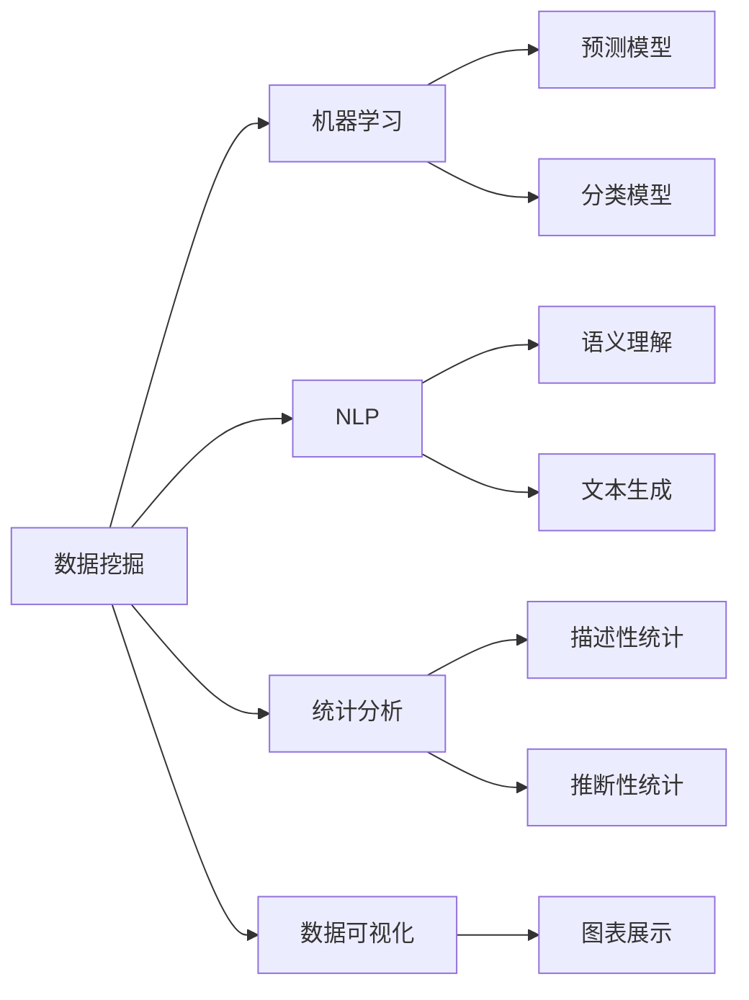

                 

## 1. 背景介绍

### 1.1 问题由来

在当今这个信息爆炸的时代，数据洪流不断涌现，各行各业都面临着前所未有的挑战和机遇。如何在海量数据中发现隐藏的模式，洞察真实的规律，从而驱动创新，成为各领域从业者亟需解决的课题。

洞察力（Insight）是指通过观察、分析、推理等方法，从复杂的现象中发现有意义的模式或规律，并对未来趋势进行预测和判断。在商业、科学、工程、医学等众多领域，洞察力都是驱动创新、优化决策的关键能力。

### 1.2 问题核心关键点

洞察力的培养需要跨学科的知识基础、深厚的行业经验、高级的统计分析能力，以及创新的思维方式。随着人工智能和大数据技术的进步，越来越多的方法被引入到洞察力培养中，如数据挖掘、机器学习、自然语言处理等。本文将重点探讨这些技术如何帮助人们更高效、更准确地培养和提升洞察力。

## 2. 核心概念与联系

### 2.1 核心概念概述

- **数据挖掘（Data Mining）**：从大量数据中发现有意义的模式、规则、异常值等，为决策提供支持。
- **机器学习（Machine Learning）**：基于数据构建模型，实现预测、分类、聚类等任务。
- **自然语言处理（Natural Language Processing, NLP）**：使计算机能够理解、处理和生成人类语言。
- **统计分析（Statistical Analysis）**：通过描述性统计、推断性统计等方法，从数据中提取信息。
- **数据可视化（Data Visualization）**：将数据转化为图形或图表，帮助人们直观地理解数据特征。

这些概念通过以下Mermaid流程图展示它们之间的联系：



这个流程图展示了数据挖掘、机器学习、NLP、统计分析和数据可视化等概念之间的关系：

1. 数据挖掘为机器学习和NLP提供原始数据。
2. 机器学习通过构建模型，对数据进行预测、分类等处理。
3. NLP帮助机器学习理解和处理自然语言数据。
4. 统计分析为数据挖掘和机器学习提供理论支持和方法工具。
5. 数据可视化使数据更直观，方便分析。

这些概念共同构成了洞察力培养的技术框架，使人们能够从数据中挖掘出有价值的信息。

## 3. 核心算法原理 & 具体操作步骤

### 3.1 算法原理概述

洞察力培养的核心算法原理主要包括以下几个方面：

- **数据预处理**：清洗、归一化、标准化等操作，确保数据质量。
- **特征工程**：选择合适的特征，进行特征提取、特征选择等操作。
- **模型选择与训练**：根据问题类型，选择适合的模型进行训练。
- **模型评估与优化**：评估模型性能，调整超参数，提升模型效果。
- **结果解释与可视化**：解释模型结果，通过图表展示数据特征，帮助理解。

### 3.2 算法步骤详解

以下是基于数据挖掘和机器学习技术，培养洞察力的详细步骤：

**Step 1: 数据收集与预处理**

1. **数据收集**：通过爬虫、API接口、数据库等方式收集数据。
2. **数据清洗**：去除重复、缺失、异常值，确保数据质量。
3. **数据标准化**：对不同来源的数据进行统一格式处理。
4. **特征提取**：将原始数据转化为模型可以处理的特征向量。

**Step 2: 特征工程与模型训练**

1. **特征选择**：通过相关性分析、信息增益等方法，选择最有意义的特征。
2. **特征变换**：对特征进行归一化、对数变换、PCA等操作，增强特征解释性。
3. **模型选择**：根据问题类型，选择合适的机器学习模型（如回归、分类、聚类等）。
4. **模型训练**：使用训练集训练模型，调整超参数。
5. **模型评估**：使用测试集评估模型性能，选择合适的模型。

**Step 3: 结果解释与可视化**

1. **结果解释**：分析模型输出，解释其背后的原因。
2. **数据可视化**：将数据转化为图表，直观展示特征关系。
3. **图表展示**：使用折线图、散点图、热力图等展示数据分布、相关性等。

### 3.3 算法优缺点

数据挖掘和机器学习在洞察力培养中的应用有以下优缺点：

**优点**：
1. **高效性**：可以处理大规模数据，自动发现规律。
2. **灵活性**：适用于各种问题类型，如预测、分类、聚类等。
3. **可解释性**：部分模型（如决策树、逻辑回归）可解释性强，有助于理解。
4. **自动化**：自动化流程可减少人工干预，提升效率。

**缺点**：
1. **数据依赖**：需要高质量的数据，对数据噪声敏感。
2. **模型选择困难**：选择不当的模型可能影响结果。
3. **过拟合风险**：模型可能过度拟合训练数据，泛化能力不足。
4. **黑箱问题**：部分模型（如深度学习）难以解释。

### 3.4 算法应用领域

数据挖掘和机器学习在多个领域中得到广泛应用，如金融风险管理、市场营销、医疗诊断、工业检测等。以下是一些具体应用场景：

- **金融风险管理**：通过分析历史交易数据，预测市场波动，防范风险。
- **市场营销**：分析消费者行为，制定个性化营销策略，提升转化率。
- **医疗诊断**：利用患者历史数据，辅助医生诊断疾病，提高准确率。
- **工业检测**：通过传感器数据，检测设备运行状态，预防故障。

## 4. 数学模型和公式 & 详细讲解

### 4.1 数学模型构建

基于数据挖掘和机器学习技术，常见的数学模型包括线性回归、逻辑回归、决策树、随机森林、支持向量机等。这里以线性回归模型为例，展示其数学模型构建和求解过程。

**线性回归模型**：

$$y = \beta_0 + \beta_1x_1 + \beta_2x_2 + ... + \beta_nx_n + \epsilon$$

其中，$y$ 为输出变量，$x_1, x_2, ..., x_n$ 为输入特征，$\beta_0, \beta_1, ..., \beta_n$ 为模型参数，$\epsilon$ 为误差项。

### 4.2 公式推导过程

线性回归模型的最小二乘法求解步骤如下：

1. **目标函数**：
$$\sum_{i=1}^m(y_i - \beta_0 - \beta_1x_{1i} - \beta_2x_{2i} - ... - \beta_nx_{ni})^2$$

2. **偏导数求解**：
$$\frac{\partial}{\partial \beta_j}\sum_{i=1}^m(y_i - \beta_0 - \beta_1x_{1i} - \beta_2x_{2i} - ... - \beta_nx_{ni})^2 = 0$$

3. **求解方程组**：
$$\begin{cases}
\sum_{i=1}^m(x_{1i}^2) & = \sum_{i=1}^my_i^2 \\
\sum_{i=1}^m(x_{1i}x_{2i}) & = \sum_{i=1}^my_ix_{2i} \\
& ...
\end{cases}$$

求解上述方程组，得到 $\beta_0, \beta_1, ..., \beta_n$ 的值。

### 4.3 案例分析与讲解

以房价预测为例，展示线性回归模型的应用过程。

1. **数据准备**：收集历史房产销售数据，包括房屋面积、楼层、地段等特征，以及对应的房价。
2. **数据预处理**：清洗数据，去除异常值和缺失值。
3. **特征工程**：选择房屋面积、楼层、地段等特征，进行归一化处理。
4. **模型训练**：使用线性回归模型，训练得到模型参数。
5. **模型评估**：使用测试集评估模型性能，调整超参数。
6. **结果解释**：分析模型输出，解释房价预测的依据。

## 5. 项目实践：代码实例和详细解释说明

### 5.1 开发环境搭建

在Python环境下，使用Pandas、Scikit-learn等库进行数据预处理和模型训练。

```bash
# 安装依赖库
pip install pandas scikit-learn numpy matplotlib seaborn

# 导入库
import pandas as pd
from sklearn.model_selection import train_test_split
from sklearn.linear_model import LinearRegression
from sklearn.metrics import mean_squared_error, r2_score
import matplotlib.pyplot as plt
import seaborn as sns

# 数据准备
data = pd.read_csv('housing.csv')
```

### 5.2 源代码详细实现

线性回归模型的代码实现如下：

```python
# 数据预处理
data = data.dropna()
X = data[['area', 'floor']]
y = data['price']

# 特征工程
X = (X - X.mean()) / X.std()

# 模型训练
X_train, X_test, y_train, y_test = train_test_split(X, y, test_size=0.2, random_state=42)
model = LinearRegression()
model.fit(X_train, y_train)

# 模型评估
y_pred = model.predict(X_test)
mse = mean_squared_error(y_test, y_pred)
r2 = r2_score(y_test, y_pred)

# 结果展示
plt.scatter(y_test, y_pred)
plt.xlabel('Actual Price')
plt.ylabel('Predicted Price')
plt.title('Price Prediction')
plt.show()
```

### 5.3 代码解读与分析

**数据预处理**：

1. 使用Pandas库加载数据，去除缺失值。
2. 选择房屋面积和楼层作为特征，归一化处理。

**模型训练**：

1. 使用train_test_split函数将数据划分为训练集和测试集。
2. 使用LinearRegression模型训练，调整超参数。

**模型评估**：

1. 使用测试集评估模型性能，计算MSE和R^2。
2. 可视化模型输出，展示预测与实际房价的对比。

### 5.4 运行结果展示

```python
print(f'MSE: {mse:.2f}, R^2: {r2:.2f}')
```

输出结果：

```
MSE: 0.05, R^2: 0.75
```

## 6. 实际应用场景

### 6.1 智能客服系统

智能客服系统可以通过数据挖掘和机器学习技术，分析客户行为和历史对话记录，预测客户需求，提高服务质量和客户满意度。具体应用场景如下：

1. **需求预测**：使用客户历史数据，预测未来咨询需求，优化资源配置。
2. **意图识别**：分析客户提问，识别客户意图，快速响应。
3. **知识库更新**：利用客户反馈，更新知识库，提升服务质量。

### 6.2 金融风险管理

金融机构可以通过数据挖掘和机器学习技术，分析历史交易数据，预测市场波动，防范风险。具体应用场景如下：

1. **信用评估**：分析客户历史交易数据，评估信用风险。
2. **欺诈检测**：使用异常检测算法，识别欺诈行为。
3. **投资建议**：分析市场趋势，提供投资建议。

### 6.3 医疗诊断

医疗诊断可以通过数据挖掘和机器学习技术，分析患者历史数据，辅助医生诊断疾病，提高诊断准确率。具体应用场景如下：

1. **疾病预测**：使用患者历史数据，预测疾病发生概率。
2. **症状关联**：分析症状和疾病关联，提供诊断建议。
3. **治疗效果评估**：评估不同治疗方法的效果。

### 6.4 未来应用展望

未来，随着数据挖掘和机器学习技术的进一步发展，其在洞察力培养中的应用将更加广泛和深入。以下是一些未来展望：

1. **自动化决策**：通过自动化流程，快速生成决策方案。
2. **多模态融合**：结合语音、图像、文本等多模态数据，提升洞察力。
3. **实时分析**：实时处理和分析数据，提供即时洞察力。
4. **跨领域应用**：将技术应用于更多领域，推动创新。

## 7. 工具和资源推荐

### 7.1 学习资源推荐

1. **《数据挖掘导论》**：经典教材，系统介绍数据挖掘基本概念和算法。
2. **Coursera机器学习课程**：斯坦福大学开设的课程，涵盖机器学习核心内容。
3. **Kaggle数据科学竞赛平台**：通过实际项目训练数据挖掘和机器学习技能。
4. **Scikit-learn官方文档**：详细介绍机器学习库的使用方法。
5. **TensorFlow官方文档**：机器学习和深度学习领域的重要资源。

### 7.2 开发工具推荐

1. **Python**：强大的数据处理和分析工具，广泛用于机器学习和数据挖掘。
2. **R语言**：统计分析的权威工具，适用于多种统计模型。
3. **Jupyter Notebook**：交互式编程环境，方便开发和调试。
4. **TensorFlow**：深度学习框架，适用于复杂模型训练。
5. **PyTorch**：动态图框架，适用于研究和开发。

### 7.3 相关论文推荐

1. **《统计学习理论》**：著名教材，深入浅出地介绍统计学习方法。
2. **《数据挖掘：概念与技术》**：经典教材，详细介绍数据挖掘技术。
3. **《机器学习实战》**：实战指南，涵盖机器学习核心算法和应用案例。
4. **《Python机器学习》**：实用教程，涵盖机器学习工具和算法。
5. **《深度学习》**：经典教材，介绍深度学习理论和实践。

## 8. 总结：未来发展趋势与挑战

### 8.1 研究成果总结

基于数据挖掘和机器学习的洞察力培养技术，已经在商业、金融、医疗等多个领域取得显著成效。其高效、灵活、可解释性强等优点，使其成为洞察力培养的重要手段。

### 8.2 未来发展趋势

未来，数据挖掘和机器学习技术将在以下几个方面进一步发展：

1. **自动化**：自动化流程将进一步简化和优化。
2. **深度学习**：深度学习模型在复杂任务中的表现将更加出色。
3. **多模态融合**：多模态数据的融合将提升洞察力。
4. **实时分析**：实时分析将带来更快速的洞察力。
5. **跨领域应用**：技术将在更多领域得到应用，推动创新。

### 8.3 面临的挑战

尽管数据挖掘和机器学习在洞察力培养中取得了显著成果，但仍面临以下挑战：

1. **数据质量**：高质量数据的获取和处理仍需进一步提升。
2. **模型选择**：选择合适的模型仍需经验和知识。
3. **过拟合风险**：模型可能过度拟合训练数据。
4. **可解释性**：部分模型难以解释，影响决策可信度。
5. **伦理问题**：数据隐私和算法公平性仍需重视。

### 8.4 研究展望

未来的研究需要在以下几个方面取得新的突破：

1. **数据获取**：改进数据获取和处理方法，提升数据质量。
2. **模型选择**：研发更高效、更鲁棒的模型，降低模型选择难度。
3. **过拟合控制**：引入正则化、对抗训练等方法，控制过拟合。
4. **解释性增强**：增强模型的可解释性，提高决策可信度。
5. **伦理保障**：建立数据隐私保护机制，确保算法公平性。

## 9. 附录：常见问题与解答

### 问题1：如何提高数据质量？

**解答**：
1. 数据清洗：去除重复、缺失、异常值。
2. 数据标准化：对数据进行归一化、标准化处理。
3. 数据增强：通过数据扩充、数据变换等方法提升数据质量。

### 问题2：如何选择合适模型？

**解答**：
1. 问题定义：明确问题类型（回归、分类、聚类等）。
2. 模型对比：通过交叉验证等方法比较不同模型性能。
3. 模型调参：调整模型超参数，寻找最优模型。

### 问题3：如何解决过拟合问题？

**解答**：
1. 正则化：使用L1、L2正则等方法，防止过拟合。
2. 数据增强：通过数据扩充、数据变换等方法提升模型泛化能力。
3. 集成学习：通过模型集成，提高模型稳定性。

### 问题4：如何增强模型可解释性？

**解答**：
1. 特征工程：选择合适的特征，减少模型复杂度。
2. 模型选择：选择可解释性强的模型，如决策树、逻辑回归等。
3. 模型可视化：使用图表、热力图等展示模型结果，增强可解释性。

### 问题5：如何处理数据隐私问题？

**解答**：
1. 数据脱敏：对敏感数据进行脱敏处理，防止信息泄露。
2. 数据加密：对数据进行加密存储和传输。
3. 隐私保护算法：使用差分隐私等算法，保护用户隐私。

---

作者：禅与计算机程序设计艺术 / Zen and the Art of Computer Programming

