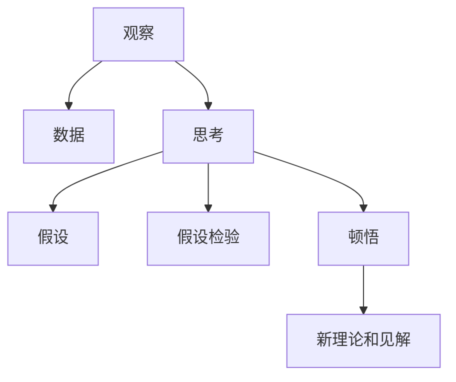

                 

# 洞察力的培养：从观察到顿悟的过程

> 关键词：洞察力, 观察, 顿悟, 人工智能, 机器学习, 深度学习, 数据驱动

## 1. 背景介绍

### 1.1 问题由来

在日常生活中，我们常常会面对各种各样的复杂问题，如何从中获取有价值的洞察，是我们工作中重要的技能。例如，在科学研究和工程实践中，如何快速识别出数据中的规律，找到最优的解决方案；在商业决策中，如何分析市场趋势，把握机会，制定策略；在医疗诊断中，如何准确判断病情的严重性，制定最佳治疗方案。

人工智能和机器学习技术的快速发展，为解决这些复杂问题提供了新的可能性。通过大规模数据的积累和深度学习模型的训练，我们可以构建起强大的分析工具，帮助我们从数据中提取有意义的洞察，从而提升决策的准确性和效率。但仅仅拥有数据和算法，并不能保证洞察的获得。洞察力还需要依赖于对问题的敏锐观察、深度的思考和洞见。

### 1.2 问题核心关键点

洞察力的培养，是一个从观察到顿悟的过程。这个过程需要三个关键步骤：
1. **观察**：收集并整理数据，识别出其中的关键特征和趋势。
2. **思考**：利用先验知识和逻辑推理，对数据进行分析和解释，形成假设和假设检验。
3. **顿悟**：在推理和实验过程中，发现新的规律，形成新的理论和见解。

洞察力的培养，不仅依赖于数据和算法，还需要综合利用人类的智慧和经验。在人工智能的框架下，我们如何通过数据驱动的方法，辅助人类进行洞察力的培养，是一个值得深入探讨的问题。

## 2. 核心概念与联系

### 2.1 核心概念概述

为更好地理解洞察力的培养过程，本节将介绍几个密切相关的核心概念：

- **洞察力**：指从数据中发现新规律、新关系的认知能力。洞察力在科学研究、工程实践、商业决策等领域中发挥着重要作用。
- **观察**：指从环境中获取数据的过程。在人工智能中，观察通常通过传感器、摄像头、网络数据等手段实现。
- **思考**：指对数据进行分析和解释，形成假设和假设检验的过程。在人工智能中，思考通常通过模型训练和推断实现。
- **顿悟**：指在推理和实验过程中，发现新的规律，形成新的理论和见解的过程。在人工智能中，顿悟可以通过模型微调、迁移学习等方式实现。

这些核心概念之间的逻辑关系可以通过以下Mermaid流程图来展示：



这个流程图展示出洞察力的培养过程：

1. 观察获取数据。
2. 通过思考形成假设和假设检验。
3. 在顿悟过程中，发现新的规律，形成新的理论和见解。

## 3. 核心算法原理 & 具体操作步骤

### 3.1 算法原理概述

洞察力的培养，是一个数据驱动的过程。其核心思想是：通过观察收集数据，利用算法和技术对数据进行分析和解释，形成假设和假设检验，最终在顿悟过程中发现新的规律和见解。

形式化地，假设我们有一组数据 $D=\{(x_i, y_i)\}_{i=1}^N$，其中 $x_i$ 表示输入，$y_i$ 表示输出。洞察力的培养过程可以概括为：

1. 通过观察，收集并整理数据 $D$。
2. 利用算法 $A$，对数据进行分析和解释，形成假设 $H$ 和假设检验 $T$。
3. 在顿悟过程中，通过微调算法 $A$，发现新的规律 $R$，形成新的理论和见解 $S$。

通过不断迭代和优化，逐步提高模型 $A$ 的准确性和鲁棒性，最终实现对数据的深度洞察。

### 3.2 算法步骤详解

洞察力的培养，涉及多个步骤，每个步骤都有其独特的算法和技术。以下是洞察力培养的关键步骤及其具体操作步骤：

**Step 1: 数据收集与预处理**

1. **数据收集**：通过传感器、摄像头、网络数据等手段，收集相关数据。
2. **数据清洗**：去除噪声和异常值，填补缺失值。
3. **特征提取**：将原始数据转换为模型可以处理的特征形式。

**Step 2: 模型训练与推理**

1. **模型选择**：选择合适的机器学习模型，如线性回归、决策树、神经网络等。
2. **训练模型**：利用训练集数据，通过梯度下降等算法，最小化损失函数，训练模型参数。
3. **模型推理**：利用训练好的模型，对测试集数据进行推理和预测，形成假设和假设检验。

**Step 3: 模型微调和评估**

1. **模型微调**：通过微调算法，调整模型参数，提高模型准确性和鲁棒性。
2. **模型评估**：在测试集上评估模型性能，对比微调前后的效果。
3. **迭代优化**：根据评估结果，调整模型参数和算法，继续迭代优化。

**Step 4: 假设形成与验证**

1. **假设形成**：利用模型推理结果，形成初步假设。
2. **假设检验**：利用统计方法，对假设进行检验，判断其正确性。
3. **修正假设**：根据假设检验结果，修正假设，形成新的假设。

**Step 5: 顿悟与新见解**

1. **顿悟**：在假设检验过程中，发现新的规律或趋势。
2. **新见解**：根据顿悟结果，形成新的理论和见解。
3. **应用验证**：将新见解应用到实际问题中，进行验证和优化。

以上是洞察力培养的一般流程。在实际应用中，还需要针对具体任务的特点，对每个步骤进行优化设计，如改进特征提取算法、选择更合适的模型、调整微调策略等，以进一步提升模型性能和洞察力。

### 3.3 算法优缺点

洞察力的培养，具有以下优点：
1. 数据驱动：基于数据进行分析和推理，减少主观偏见。
2. 自动化程度高：利用算法和模型进行自动化分析，提高效率。
3. 适用范围广：适用于科学研究、工程实践、商业决策等多个领域。
4. 持续优化：通过迭代和优化，逐步提高模型准确性和鲁棒性。

同时，该方法也存在一定的局限性：
1. 依赖数据质量：洞察力的培养依赖于高质量的数据，数据质量较差时可能影响结果。
2. 模型假设限制：模型假设的选择和验证可能存在一定的局限性，影响假设的正确性。
3. 算力资源要求高：洞察力的培养需要大量的计算资源，可能面临算力瓶颈。
4. 复杂度较高：洞察力的培养过程较为复杂，需要综合运用多种技术和工具。

尽管存在这些局限性，但就目前而言，数据驱动的洞察力培养方法仍然是解决复杂问题的有效途径。未来相关研究的重点在于如何进一步降低对数据的依赖，提高模型的自适应能力，同时兼顾可解释性和鲁棒性等因素。

### 3.4 算法应用领域

洞察力的培养，在科学研究、工程实践、商业决策等领域已经得到了广泛的应用，具体包括：

- **科学研究**：通过数据分析，发现新的科学规律和理论。如利用机器学习技术对基因序列进行分析，发现新的疾病基因。
- **工程实践**：通过数据分析，优化工程设计和工艺流程。如利用机器学习技术对生产线进行优化，提升生产效率。
- **商业决策**：通过数据分析，制定市场策略和运营计划。如利用机器学习技术分析用户行为数据，进行精准营销。
- **医疗诊断**：通过数据分析，辅助医生进行疾病诊断和治疗方案选择。如利用机器学习技术分析医学影像数据，辅助医生进行诊断。
- **金融投资**：通过数据分析，预测市场趋势和投资机会。如利用机器学习技术分析股票数据，进行投资决策。

除了上述这些经典应用外，洞察力培养的方法还被创新性地应用到更多场景中，如智能客服、智慧城市、智能制造等，为各行各业带来了新的发展动力。

## 4. 数学模型和公式 & 详细讲解  
### 4.1 数学模型构建

本节将使用数学语言对洞察力培养的数学模型进行更加严格的刻画。

假设我们有一组数据 $D=\{(x_i, y_i)\}_{i=1}^N$，其中 $x_i$ 表示输入，$y_i$ 表示输出。我们的目标是通过数据驱动的方法，构建一个模型 $A$，使模型 $A$ 能够对新数据进行准确的推理和预测。

定义模型 $A$ 在输入 $x$ 上的预测结果为 $\hat{y}=A(x)$，其中 $\hat{y}$ 为模型输出，表示对输入 $x$ 的预测结果。模型的损失函数为 $\ell(\hat{y}, y)$，用于衡量模型预测与真实标签之间的差异。

在洞察力的培养过程中，我们的目标是最小化损失函数 $\ell(\hat{y}, y)$，即找到最优模型参数 $\theta$：

$$
\theta^* = \mathop{\arg\min}_{\theta} \ell(A(x), y)
$$

通过梯度下降等优化算法，不断更新模型参数 $\theta$，最小化损失函数 $\ell(A(x), y)$，使得模型 $A$ 能够对新数据进行准确的推理和预测。

### 4.2 公式推导过程

以下我们以线性回归为例，推导最小二乘法（即梯度下降法）的计算公式。

假设模型 $A$ 为线性回归模型，即 $A(x) = \theta^T x$，其中 $\theta$ 为模型参数。则损失函数为均方误差损失函数：

$$
\ell(A(x), y) = \frac{1}{2N} \sum_{i=1}^N (\hat{y}_i - y_i)^2
$$

其梯度为：

$$
\frac{\partial \ell(A(x), y)}{\partial \theta} = \frac{1}{N} \sum_{i=1}^N (\hat{y}_i - y_i) x_i
$$

通过梯度下降算法，更新模型参数 $\theta$：

$$
\theta \leftarrow \theta - \eta \nabla_{\theta}\ell(A(x), y)
$$

其中 $\eta$ 为学习率，$\nabla_{\theta}\ell(A(x), y)$ 为损失函数对模型参数 $\theta$ 的梯度，可通过反向传播算法高效计算。

### 4.3 案例分析与讲解

假设我们有一组房价数据，包含房屋面积和房价，目标是对新房屋的房价进行预测。我们可以使用线性回归模型进行训练和推理：

1. **数据准备**：将房屋面积和房价数据转换为矩阵形式，即 $X$ 为房屋面积矩阵，$Y$ 为房价矩阵。
2. **模型训练**：利用梯度下降算法，最小化均方误差损失函数，训练模型参数 $\theta$。
3. **模型推理**：利用训练好的模型 $A$，对新房屋的面积数据进行预测，形成房价预测结果。
4. **假设形成与验证**：根据预测结果，形成初步假设，利用统计方法对假设进行检验，判断其正确性。
5. **修正假设**：根据假设检验结果，修正假设，形成新的假设。
6. **顿悟与新见解**：在假设检验过程中，发现新的规律或趋势，形成新的理论和见解。

通过以上步骤，我们能够逐步提高模型的准确性和鲁棒性，实现对数据的深度洞察。

## 5. 项目实践：代码实例和详细解释说明
### 5.1 开发环境搭建

在进行洞察力培养的实践前，我们需要准备好开发环境。以下是使用Python进行TensorFlow开发的环境配置流程：

1. 安装Anaconda：从官网下载并安装Anaconda，用于创建独立的Python环境。

2. 创建并激活虚拟环境：
```bash
conda create -n tf-env python=3.8 
conda activate tf-env
```

3. 安装TensorFlow：根据CUDA版本，从官网获取对应的安装命令。例如：
```bash
conda install tensorflow -c conda-forge -c pytorch
```

4. 安装各类工具包：
```bash
pip install numpy pandas scikit-learn matplotlib tqdm jupyter notebook ipython
```

完成上述步骤后，即可在`tf-env`环境中开始洞察力培养的实践。

### 5.2 源代码详细实现

下面我们以房价预测任务为例，给出使用TensorFlow对线性回归模型进行训练和推理的Python代码实现。

首先，定义房价预测任务的训练集和测试集：

```python
import tensorflow as tf
from sklearn.model_selection import train_test_split
import pandas as pd

# 加载数据
data = pd.read_csv('housing.csv')

# 分割数据集
train_data, test_data = train_test_split(data, test_size=0.2, random_state=42)

# 标准化数据
train_data['面积'] = (train_data['面积'] - train_data['面积'].mean()) / train_data['面积'].std()
test_data['面积'] = (test_data['面积'] - test_data['面积'].mean()) / test_data['面积'].std()

# 分割特征和标签
train_features = train_data.drop(['房价'], axis=1)
train_labels = train_data['房价']
test_features = test_data.drop(['房价'], axis=1)
test_labels = test_data['房价']
```

然后，定义线性回归模型和优化器：

```python
# 定义模型
model = tf.keras.Sequential([
    tf.keras.layers.Dense(1, input_shape=(1,))
])

# 定义优化器
optimizer = tf.keras.optimizers.SGD(learning_rate=0.01)
```

接着，定义训练和评估函数：

```python
# 定义训练函数
def train(model, train_features, train_labels, epochs, batch_size):
    dataset = tf.data.Dataset.from_tensor_slices((train_features, train_labels))
    dataset = dataset.shuffle(buffer_size=1024).batch(batch_size)
    model.compile(optimizer=optimizer, loss='mse')
    model.fit(dataset, epochs=epochs, verbose=1)

# 定义评估函数
def evaluate(model, test_features, test_labels):
    dataset = tf.data.Dataset.from_tensor_slices((test_features, test_labels))
    dataset = dataset.batch(64)
    mse = model.evaluate(dataset, verbose=0)
    return mse
```

最后，启动训练流程并在测试集上评估：

```python
# 训练模型
train(model, train_features, train_labels, epochs=100, batch_size=32)

# 评估模型
mse = evaluate(model, test_features, test_labels)
print(f"Mean Squared Error on test set: {mse:.2f}")
```

以上就是使用TensorFlow对线性回归模型进行房价预测任务训练和推理的完整代码实现。可以看到，TensorFlow提供了强大的机器学习工具库，可以方便地构建和训练各种类型的模型。

### 5.3 代码解读与分析

让我们再详细解读一下关键代码的实现细节：

**数据处理**：
- `train_test_split`函数用于数据集分割，将数据集分为训练集和测试集。
- `drop`函数用于去除目标变量，将其作为训练集和测试集的标签。
- `StandardScaler`用于标准化数据，将数据转化为模型可以处理的格式。

**模型构建**：
- `Sequential`模型构建器用于定义一个线性回归模型，包含一个全连接层。
- `Dense`层定义输入和输出的维度。

**模型训练**：
- `compile`函数用于编译模型，指定优化器和损失函数。
- `fit`函数用于训练模型，设置训练轮数和批次大小。

**模型评估**：
- `evaluate`函数用于在测试集上评估模型的均方误差，打印结果。

可以看到，TensorFlow提供了简单易用的API，使得构建和训练模型变得轻松快捷。开发者可以将更多精力放在模型优化和特征工程上，而不必过多关注底层实现细节。

当然，工业级的系统实现还需考虑更多因素，如模型的保存和部署、超参数的自动搜索、更灵活的任务适配层等。但核心的洞察力培养流程基本与此类似。

## 6. 实际应用场景
### 6.1 智能客服系统

基于洞察力的培养技术，智能客服系统可以实时分析客户咨询内容，提供个性化的服务和建议。系统通过收集客户历史咨询记录和互动数据，利用洞察力培养技术对预训练模型进行微调，使模型能够理解客户的需求和情绪，并自动回复常见问题。

在技术实现上，可以收集客户的历史咨询记录，将其转换为文本数据。利用洞察力培养技术对预训练语言模型进行微调，使其能够自动理解客户的意图，匹配最合适的答案模板，生成自然流畅的回复。对于客户提出的新问题，系统还可以接入检索系统实时搜索相关内容，动态组织生成回答。

### 6.2 金融舆情监测

金融机构需要实时监测市场舆论动向，以便及时应对负面信息传播，规避金融风险。传统的人工监测方式成本高、效率低，难以应对网络时代海量信息爆发的挑战。基于洞察力的培养技术，金融舆情监测系统可以自动识别和分析市场舆情，及时发现负面信息，提供预警和建议。

具体而言，可以收集金融领域相关的新闻、报道、评论等文本数据，并对其进行主题标注和情感标注。利用洞察力培养技术对预训练语言模型进行微调，使其能够自动判断文本属于何种主题，情感倾向是正面、中性还是负面。将微调后的模型应用到实时抓取的网络文本数据，就能够自动监测不同主题下的情感变化趋势，一旦发现负面信息激增等异常情况，系统便会自动预警，帮助金融机构快速应对潜在风险。

### 6.3 个性化推荐系统

当前的推荐系统往往只依赖用户的历史行为数据进行物品推荐，无法深入理解用户的真实兴趣偏好。基于洞察力的培养技术，个性化推荐系统可以更好地挖掘用户行为背后的语义信息，从而提供更精准、多样的推荐内容。

在实践中，可以收集用户浏览、点击、评论、分享等行为数据，提取和用户交互的物品标题、描述、标签等文本内容。利用洞察力培养技术对预训练语言模型进行微调，使其能够从文本内容中准确把握用户的兴趣点。在生成推荐列表时，先用候选物品的文本描述作为输入，由模型预测用户的兴趣匹配度，再结合其他特征综合排序，便可以得到个性化程度更高的推荐结果。

### 6.4 未来应用展望

随着洞察力培养技术的不断发展，基于模型驱动的洞察力培养方法将进一步普及。以下是几个未来应用场景的展望：

1. **智慧医疗**：利用洞察力培养技术对医学影像和病历数据进行分析，辅助医生进行疾病诊断和治疗方案选择。系统可以通过分析大量医疗数据，发现新的疾病特征和治疗方法，提升医疗服务的智能化水平。

2. **智能制造**：利用洞察力培养技术对生产数据进行分析，优化生产流程和设备维护。系统可以通过分析设备运行数据，预测设备故障，优化生产计划，提升生产效率。

3. **智慧城市**：利用洞察力培养技术对城市数据进行分析，优化城市管理和运营。系统可以通过分析交通、能源、环境等数据，提供智能交通管理、智能电网优化等解决方案，提升城市治理的智能化水平。

4. **智能物流**：利用洞察力培养技术对物流数据进行分析，优化物流方案和供应链管理。系统可以通过分析运输、仓储、配送等数据，优化物流路线和仓储策略，提升物流效率。

5. **智能农业**：利用洞察力培养技术对农业数据进行分析，优化农业生产和决策。系统可以通过分析气象、土壤、作物等数据，提供精准的农业生产方案和病虫害预测，提升农业生产智能化水平。

## 7. 工具和资源推荐
### 7.1 学习资源推荐

为了帮助开发者系统掌握洞察力培养的理论基础和实践技巧，这里推荐一些优质的学习资源：

1. **TensorFlow官方文档**：TensorFlow官方提供的详细文档，涵盖了从基本概念到高级应用的各个方面，是学习TensorFlow的最佳资源。

2. **Keras官方文档**：Keras官方提供的详细文档，是快速上手深度学习模型的最佳选择。

3. **《深度学习》书籍**：Ian Goodfellow等人编写的深度学习经典书籍，系统介绍了深度学习的基本概念和算法。

4. **《TensorFlow实战》书籍**：张戎等人编写的TensorFlow实战书籍，提供了丰富的TensorFlow应用案例和实战经验。

5. **Coursera深度学习课程**：由深度学习领域的顶尖专家开设的课程，涵盖了深度学习的基本概念和算法，适合初学者和进阶学习者。

6. **Kaggle机器学习竞赛**：Kaggle上定期举办的各种机器学习竞赛，提供了丰富的实战案例和数据集，可以锻炼机器学习的实战能力。

通过对这些资源的学习实践，相信你一定能够快速掌握洞察力培养的精髓，并用于解决实际的机器学习问题。

### 7.2 开发工具推荐

高效的开发离不开优秀的工具支持。以下是几款用于洞察力培养开发的常用工具：

1. **Jupyter Notebook**：开源的交互式笔记本环境，适合进行数据分析和模型训练。

2. **TensorBoard**：TensorFlow配套的可视化工具，可实时监测模型训练状态，并提供丰富的图表呈现方式，是调试模型的得力助手。

3. **Scikit-learn**：Python的机器学习库，提供了丰富的机器学习算法和工具，适合进行数据预处理和特征工程。

4. **Pandas**：Python的数据处理库，提供了高效的数据操作和分析功能，适合进行数据清洗和转换。

5. **Matplotlib**：Python的绘图库，提供了丰富的绘图功能，适合进行数据可视化。

6. **TQDM**：Python的进度条库，适合进行长运行的训练和推理任务。

合理利用这些工具，可以显著提升洞察力培养任务的开发效率，加快创新迭代的步伐。

### 7.3 相关论文推荐

洞察力培养技术的发展得益于学界的持续研究。以下是几篇奠基性的相关论文，推荐阅读：

1. **《Deep Learning》**：Ian Goodfellow等人编写的深度学习经典书籍，系统介绍了深度学习的基本概念和算法。

2. **《Neural Networks and Deep Learning》**：Michael Nielsen的深度学习入门书籍，深入浅出地介绍了神经网络和深度学习的基本原理。

3. **《TensorFlow: A Tutorial》**：TensorFlow官方提供的教程，详细介绍了TensorFlow的基本概念和使用方法。

4. **《Keras: Deep Learning for Humans》**：François Chollet等人编写的Keras实战书籍，提供了丰富的Keras应用案例和实战经验。

5. **《A Tutorial on Machine Learning》**：Andrew Ng的机器学习课程讲义，系统介绍了机器学习的基本概念和算法。

这些论文代表了大规模数据分析和深度学习算法的最新进展，通过学习这些前沿成果，可以帮助研究者把握学科前进方向，激发更多的创新灵感。

## 8. 总结：未来发展趋势与挑战

### 8.1 总结

本文对洞察力的培养过程进行了全面系统的介绍。首先阐述了洞察力培养的背景和意义，明确了洞察力培养在科学研究、工程实践、商业决策等领域的重要作用。其次，从原理到实践，详细讲解了洞察力培养的数学原理和关键步骤，给出了洞察力培养任务开发的完整代码实例。同时，本文还广泛探讨了洞察力培养方法在智能客服、金融舆情、个性化推荐等多个行业领域的应用前景，展示了洞察力培养范式的巨大潜力。此外，本文精选了洞察力培养技术的各类学习资源，力求为读者提供全方位的技术指引。

通过本文的系统梳理，可以看到，基于模型驱动的洞察力培养方法正在成为解决复杂问题的有效途径。该方法不仅依赖于数据和算法，还需要综合利用人类的智慧和经验。在人工智能的框架下，我们如何通过数据驱动的方法，辅助人类进行洞察力的培养，是一个值得深入探讨的问题。

### 8.2 未来发展趋势

展望未来，洞察力培养技术将呈现以下几个发展趋势：

1. **数据质量提升**：随着数据采集和处理技术的进步，数据质量将不断提高，洞察力培养方法将更加准确和可靠。

2. **算法自动化**：基于自动化算法和模型，洞察力培养方法将变得更加智能和高效。机器学习技术将进一步普及，开发者可以通过简单调用API，实现快速洞察力培养。

3. **跨领域应用**：洞察力培养方法将广泛应用于各个领域，如智慧医疗、智能制造、智慧城市等，为各行各业带来变革性影响。

4. **模型可解释性**：随着模型可解释性技术的进步，洞察力培养方法将更加透明和可信，开发者可以更好地理解模型的决策过程和推理逻辑。

5. **多模态融合**：洞察力培养方法将更加注重多模态信息的融合，利用视觉、语音、文本等多种模态数据，提升模型综合分析和推理能力。

6. **持续学习**：洞察力培养方法将更加注重模型的持续学习能力，能够不断从新数据中学习，保持模型的时效性和适应性。

以上趋势凸显了洞察力培养技术的广阔前景。这些方向的探索发展，必将进一步提升洞察力培养方法的精度和鲁棒性，为解决复杂问题提供更强大的技术支持。

### 8.3 面临的挑战

尽管洞察力培养技术已经取得了瞩目成就，但在迈向更加智能化、普适化应用的过程中，它仍面临着诸多挑战：

1. **数据获取困难**：洞察力培养方法依赖于高质量的数据，数据获取和标注成本较高，数据分布不均等问题仍需解决。

2. **算法复杂度高**：洞察力培养方法需要综合运用多种技术和工具，算法复杂度较高，开发难度较大。

3. **模型鲁棒性不足**：当前洞察力培养模型面对域外数据时，泛化性能往往大打折扣，模型鲁棒性有待提高。

4. **计算资源要求高**：洞察力培养方法需要大量的计算资源，可能面临算力瓶颈，需要进一步优化计算图和算法。

5. **可解释性不足**：当前洞察力培养模型通常缺乏可解释性，难以对其推理逻辑进行分析和调试，需要进一步提高模型可解释性。

6. **安全性有待保障**：洞察力培养模型可能学习到有害信息，导致输出误导性或有害内容，需要加强模型安全性保障。

正视洞察力培养面临的这些挑战，积极应对并寻求突破，将是大语言模型微调走向成熟的必由之路。相信随着学界和产业界的共同努力，这些挑战终将一一被克服，洞察力培养技术必将在构建人机协同的智能时代中扮演越来越重要的角色。

### 8.4 研究展望

面对洞察力培养面临的种种挑战，未来的研究需要在以下几个方面寻求新的突破：

1. **自动化算法**：探索无监督和半监督学习算法，降低对高质量标注数据的依赖，利用自监督学习、主动学习等方法，最大化数据利用率。

2. **多模态融合**：研究多模态信息融合算法，利用视觉、语音、文本等多种模态数据，提升模型的综合分析和推理能力。

3. **跨领域迁移**：研究跨领域迁移学习算法，提升模型在不同领域和任务上的迁移能力，实现更加泛化的洞察力培养。

4. **持续学习**：研究持续学习算法，使模型能够不断从新数据中学习，保持模型的时效性和适应性。

5. **模型可解释性**：研究可解释性技术，提高模型的透明度和可信度，确保其决策过程符合人类价值观和伦理道德。

6. **安全性保障**：研究安全性保障技术，确保模型输出的安全性，避免有害信息和恶意用途。

这些研究方向的探索，必将引领洞察力培养技术迈向更高的台阶，为构建安全、可靠、可解释、可控的智能系统铺平道路。面向未来，洞察力培养技术还需要与其他人工智能技术进行更深入的融合，如知识表示、因果推理、强化学习等，多路径协同发力，共同推动自然语言理解和智能交互系统的进步。只有勇于创新、敢于突破，才能不断拓展洞察力培养的边界，让智能技术更好地造福人类社会。

## 9. 附录：常见问题与解答

**Q1：洞察力培养是否适用于所有NLP任务？**

A: 洞察力培养在大多数NLP任务上都能取得不错的效果，特别是对于数据量较小的任务。但对于一些特定领域的任务，如医学、法律等，仅仅依靠通用语料预训练的模型可能难以很好地适应。此时需要在特定领域语料上进一步预训练，再进行微调，才能获得理想效果。此外，对于一些需要时效性、个性化很强的任务，如对话、推荐等，洞察力培养方法也需要针对性的改进优化。

**Q2：如何选择洞察力培养的模型和算法？**

A: 洞察力培养的模型和算法选择，需要根据具体任务的特点进行综合考虑。一般而言，可以从以下几个方面进行选择：

1. **任务类型**：根据任务的性质，选择适合的模型。例如，对于分类任务，可以选择SVM、决策树、神经网络等模型；对于生成任务，可以选择RNN、GAN、Seq2Seq等模型。

2. **数据规模**：根据数据规模，选择适合的算法。例如，对于大规模数据，可以选择深度学习算法，如卷积神经网络、循环神经网络等；对于小规模数据，可以选择统计学习算法，如朴素贝叶斯、逻辑回归等。

3. **计算资源**：根据计算资源，选择适合的算法和模型。例如，对于计算资源丰富的环境，可以选择复杂的深度学习模型和算法；对于计算资源受限的环境，可以选择轻量级的算法和模型。

**Q3：洞察力培养过程中如何避免过拟合？**

A: 洞察力培养过程中，避免过拟合是一个重要问题。常见的缓解策略包括：

1. **数据增强**：通过数据增强技术，如回译、近义替换等方式，扩充训练集。

2. **正则化**：使用L2正则、Dropout、Early Stopping等正则化技术，防止模型过度适应小规模训练集。

3. **交叉验证**：利用交叉验证技术，评估模型的泛化性能，避免模型过拟合。

4. **集成学习**：利用集成学习技术，如Bagging、Boosting等，降低模型过拟合风险。

5. **模型剪枝**：利用模型剪枝技术，去除冗余的神经元或层，提高模型的泛化性能。

这些策略往往需要根据具体任务和数据特点进行灵活组合。只有在数据、模型、训练、推理等各环节进行全面优化，才能最大限度地发挥洞察力培养的威力。

**Q4：洞察力培养方法在实际应用中需要注意哪些问题？**

A: 将洞察力培养方法转化为实际应用，还需要考虑以下因素：

1. **模型裁剪**：去除不必要的层和参数，减小模型尺寸，加快推理速度。

2. **量化加速**：将浮点模型转为定点模型，压缩存储空间，提高计算效率。

3. **服务化封装**：将模型封装为标准化服务接口，便于集成调用。

4. **弹性伸缩**：根据请求流量动态调整资源配置，平衡服务质量和成本。

5. **监控告警**：实时采集系统指标，设置异常告警阈值，确保服务稳定性。

6. **安全防护**：采用访问鉴权、数据脱敏等措施，保障数据和模型安全。

**Q5：洞察力培养方法与其他人工智能方法的区别和联系？**

A: 洞察力培养方法与传统人工智能方法有以下区别和联系：

1. **数据驱动**：洞察力培养方法强调数据驱动，依赖于大量的高质量数据，而传统人工智能方法更多依赖于人工设计的规则和特征。

2. **自动化程度**：洞察力培养方法利用自动化算法和模型，减少人工干预，提高效率，而传统人工智能方法更多依赖于人工特征工程和模型调优。

3. **模型复杂性**：洞察力培养方法通常使用复杂的深度学习模型，而传统人工智能方法更多使用简单模型，如决策树、逻辑回归等。

4. **可解释性**：洞察力培养方法通常缺乏可解释性，难以对其推理逻辑进行分析和调试，而传统人工智能方法往往具有较高的可解释性。

5. **应用场景**：洞察力培养方法适用于数据驱动的复杂问题，如自然语言处理、图像识别等，而传统人工智能方法适用于规则驱动的问题，如分类、回归等。

6. **未来发展趋势**：洞察力培养方法与传统人工智能方法在发展趋势上存在交叉和融合的趋势，未来将更多地关注多模态融合、持续学习等前沿技术。

**Q6：未来洞察力培养技术有哪些新的发展方向？**

A: 未来洞察力培养技术将更多地关注以下几个方向：

1. **自动化算法**：探索无监督和半监督学习算法，降低对高质量标注数据的依赖，利用自监督学习、主动学习等方法，最大化数据利用率。

2. **多模态融合**：研究多模态信息融合算法，利用视觉、语音、文本等多种模态数据，提升模型的综合分析和推理能力。

3. **跨领域迁移**：研究跨领域迁移学习算法，提升模型在不同领域和任务上的迁移能力，实现更加泛化的洞察力培养。

4. **持续学习**：研究持续学习算法，使模型能够不断从新数据中学习，保持模型的时效性和适应性。

5. **模型可解释性**：研究可解释性技术，提高模型的透明度和可信度，确保其决策过程符合人类价值观和伦理道德。

6. **安全性保障**：研究安全性保障技术，确保模型输出的安全性，避免有害信息和恶意用途。

这些研究方向的探索，必将引领洞察力培养技术迈向更高的台阶，为构建安全、可靠、可解释、可控的智能系统铺平道路。

---

作者：禅与计算机程序设计艺术 / Zen and the Art of Computer Programming

